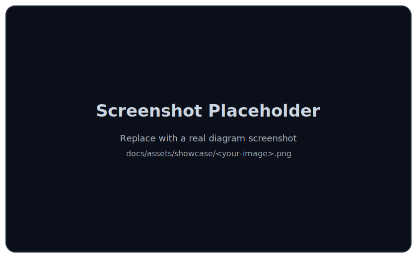
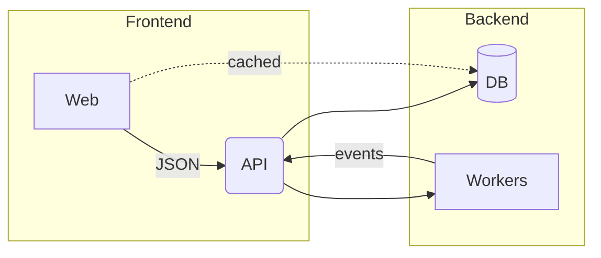
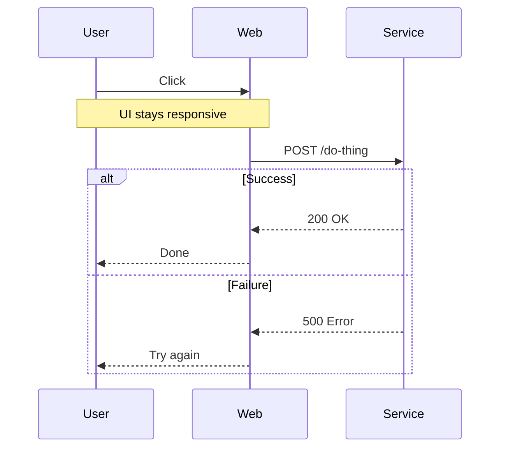

# merman

Mermaid, but headless, in Rust.


Think of `merman` as Mermaid's headless twin: same language, same diagrams, no browser required.

`merman` is a Rust, headless, 1:1 re-implementation of Mermaid pinned to `mermaid@11.12.2`.
The upstream Mermaid implementation is the spec (see `docs/adr/0014-upstream-parity-policy.md`).

## TL;DR

- Want an executable? Use `merman-cli` (render SVG/PNG/JPG/PDF).
- Want a library? Use `merman` (`render` for SVG; `raster` for PNG/JPG/PDF).
- Only need parsing / semantic JSON? Use `merman-core`.
- Quality gate: `cargo run -p xtask -- verify` (fmt + nextest + DOM parity sweep).

## Contents

- [Status](#status)
- [Install](#install)
- [Quickstart (CLI)](#quickstart-cli)
- [Quickstart (library)](#quickstart-library)
- [Showcase](#showcase)
- [Quality gates](#quality-gates)
- [Limitations](#limitations)
- [Crates](#crates)
- [Development](#development)
- [Changelog](#changelog)
- [License](#license)

## Status

- Baseline: Mermaid `@11.12.2`.
- Alignment is enforced via upstream SVG DOM baselines + golden snapshots (“golden-driven parity”).
- DOM parity checks normalize geometry numeric tokens to 3 decimals (`--dom-decimals 3`) and compare the canonicalized DOM (not byte-identical SVG).
- Current coverage and gates: `docs/alignment/STATUS.md`.
- Corpus size: 1800+ upstream SVG baselines across 23 diagrams.
- ZenUML is supported in a headless compatibility mode (subset; not parity-gated). See ADR 0061.

## What you get

- Parse Mermaid into a semantic JSON model (headless)
- Compute headless layout (geometry + routes) as JSON
- Render SVG (parity-focused DOM)
- Render PNG (SVG rasterization via `resvg`)
- Render JPG (SVG rasterization via `resvg`)
- Render PDF (SVG → PDF conversion via `svg2pdf`)

Diagram coverage and current parity status live in `docs/alignment/STATUS.md`.

## Install

After publishing `0.1.0`, you can:

```sh
# CLI
cargo install merman-cli

# Library (SVG)
cargo add merman --features render

# Library (SVG + PNG/JPG/PDF)
cargo add merman --features raster
```

MSRV is `rust-version = 1.87`.

## Quickstart (CLI)

```sh
# Detect diagram type
merman-cli detect path/to/diagram.mmd

# Parse -> semantic JSON
merman-cli parse path/to/diagram.mmd --pretty

# Layout -> layout JSON
merman-cli layout path/to/diagram.mmd --pretty

# Render SVG
merman-cli render path/to/diagram.mmd --out out.svg

# Render raster formats
merman-cli render --format png --out out.png path/to/diagram.mmd
merman-cli render --format jpg --out out.jpg path/to/diagram.mmd
merman-cli render --format pdf --out out.pdf path/to/diagram.mmd
```

Minimal end-to-end example:

```bash
cat > example.mmd <<'EOF'
flowchart TD
  A[Start] --> B{Decision}
  B -->|Yes| C[Do thing]
  B -->|No| D[Do other thing]
EOF

merman-cli render example.mmd --out example.svg
```

```powershell
@'
flowchart TD
  A[Start] --> B{Decision}
  B -->|Yes| C[Do thing]
  B -->|No| D[Do other thing]
'@ | Set-Content -Encoding utf8 example.mmd

merman-cli render example.mmd --out example.svg
```

## Quickstart (library)

The `merman` crate is a convenience wrapper around `merman-core` (parsing) + `merman-render` (layout + SVG).
Enable the `render` feature when you want layout + SVG. Enable `raster` when you also need
PNG/JPG/PDF from Rust (no CLI required).

```rust
use merman_core::{Engine, ParseOptions};
use merman::render::{
    headless_layout_options, render_svg_sync, sanitize_svg_id, SvgRenderOptions,
};

fn main() -> Result<(), Box<dyn std::error::Error>> {
    let engine = Engine::new();

    let layout = headless_layout_options();

    // For UIs that inline multiple diagrams, set a per-diagram SVG id to avoid internal `<defs>`
    // and accessibility id collisions.
    let svg_opts = SvgRenderOptions {
        diagram_id: Some(sanitize_svg_id("example-diagram")),
        ..SvgRenderOptions::default()
    };

    // Executor-free synchronous entrypoint (the work is CPU-bound and does not perform I/O).
    let svg = render_svg_sync(
        &engine,
        "flowchart TD; A-->B;",
        ParseOptions::default(),
        &layout,
        &svg_opts,
    )?
    .unwrap();

    println!("{svg}");
    Ok(())
}
```

If you prefer a bundled "pipeline" instead of passing multiple option structs per call, use
`merman::render::HeadlessRenderer`.

If you already know the diagram type (e.g. from a Markdown fence info string), prefer
`Engine::parse_diagram_as_sync(...)` to skip type detection.

If your downstream renderer does not support SVG `<foreignObject>` (common for rasterizers),
prefer `HeadlessRenderer::render_svg_readable_sync()` which adds a best-effort `<text>/<tspan>`
overlay extracted from Mermaid labels.

## Showcase



This section is intentionally screenshot-friendly. Drop your real screenshots into `docs/assets/showcase/`
and replace the placeholder `src` above (or add more images per example).

### Flowchart (clusters + styled edges)



### Sequence (notes + alt/else)



## Quality gates

This repo is built around reproducible alignment layers and CI-friendly gates:

- Semantic snapshots: `fixtures/**/*.golden.json`
- Layout snapshots: `fixtures/**/*.layout.golden.json`
- Upstream SVG baselines: `fixtures/upstream-svgs/**`
- DOM parity gates: `xtask compare-all-svgs --check-dom` (see `docs/adr/0050-release-quality-gates.md`)

The goal is not “it looks similar”, but “it stays aligned”.

Quick confidence check:

```sh
cargo run -p xtask -- verify
```

For a quick “does raster output look sane?” sweep across fixtures (dev-only):

- `pwsh -NoProfile -ExecutionPolicy Bypass -File tools/preview/export-fixtures-png.ps1 -BuildReleaseCli -CleanOutDir`

## Limitations

- SVG `<foreignObject>` HTML labels are not universally supported (especially in rasterizers). If you need a more compatible output, prefer `render_svg_readable_sync()`.
- Determinism is a goal: output is stabilized via goldens, DOM canonicalization, and vendored/forked dependencies where needed (see `roughr-merman`).

## Crates

- Headless parsing: `merman-core`
- Convenience API: `merman` (enable `render` for layout + SVG)
- Rendering + layout stack: `merman-render`
- Layout ports:
  - `dugong`: Dagre-compatible layout (port of `dagrejs/dagre`)
  - `dugong-graphlib`: graph container APIs (port of `dagrejs/graphlib`)
  - `manatee`: compound graph layouts (COSE/FCoSE ports)

## Development

- Format:
  - `cargo fmt`
- Tests:
  - `cargo nextest run`
- Verify generated artifacts:
  - `cargo run -p xtask -- verify-generated`
- Update semantic goldens:
  - `cargo run -p xtask -- update-snapshots`
- Update layout goldens:
  - `cargo run -p xtask -- update-layout-snapshots`
- Full parity sweep (DOM):
  - `cargo run --release -p xtask -- compare-all-svgs --check-dom --dom-mode parity-root --dom-decimals 3`

More workflows: `docs/rendering/COMPARE_ALL_SVGS.md`.

## Performance

`merman` is designed for Mermaid parity and deterministic outputs. It is headless and does not
spawn a browser, so it can be fast, but performance is treated as a tracked metric (not a claim).

To run the local benchmark suite, see `docs/performance/BENCHMARKING.md`.

For an optional apples-to-oranges comparison against `mermaid-rs-renderer` (mmdr), see
`docs/performance/COMPARISON.md` and the generator script `tools/bench/compare_mermaid_renderers.py`.

The comparison script can also include upstream Mermaid JS rendering (via the pinned
`tools/mermaid-cli` puppeteer setup) when available.

## Changelog

See `CHANGELOG.md`.

If you want a local binary without `cargo run`, install the CLI from source:

- `cargo install --path crates/merman-cli`

## Reference upstreams (no submodules)

This repository uses optional local checkouts under `repo-ref/` for parity work.
These are **not committed** and are **not** git submodules.
Pinned revisions live in `repo-ref/REPOS.lock.json`.

Populate `repo-ref/*` by cloning each repo at the pinned commit shown in the lock file.

## License

Dual-licensed under MIT or Apache-2.0. See `LICENSE`, `LICENSE-MIT`, `LICENSE-APACHE`.
