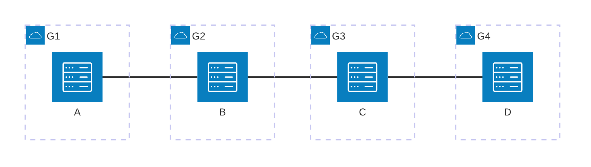
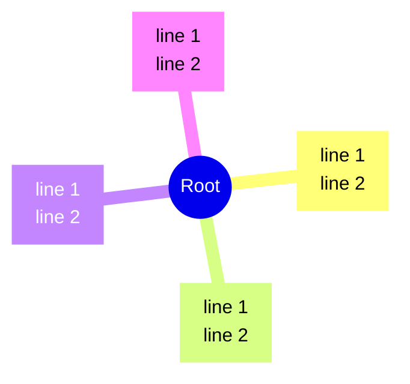
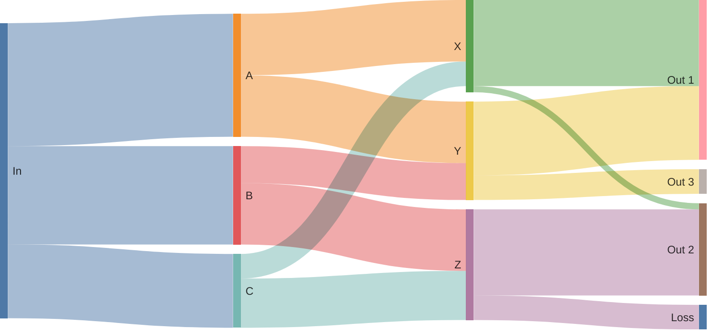
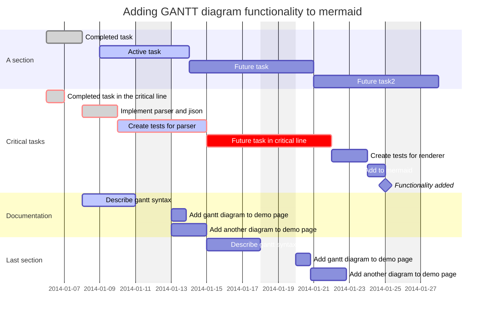

# merman

Mermaid, but headless, in Rust.


Think of `merman` as Mermaid's headless twin: same language, same diagrams, no browser required.

`merman` is a Rust, headless, 1:1 re-implementation of Mermaid pinned to `mermaid@11.12.2`.
The upstream Mermaid implementation is the spec (see [docs/adr/0014-upstream-parity-policy.md](docs/adr/0014-upstream-parity-policy.md)).

## TL;DR

- Want an executable? Use [`merman-cli`](crates/merman-cli) (render SVG/PNG/JPG/PDF).
- Want a library? Use [`merman`](crates/merman) (`render` for SVG; `raster` for PNG/JPG/PDF).
- Only need parsing / semantic JSON? Use [`merman-core`](crates/merman-core).
- Quality gate: `cargo run -p xtask -- verify` (fmt + nextest + DOM parity sweep).

## Contents

- [Status](#status)
- [Install](#install)
- [Quickstart (CLI)](#quickstart-cli)
- [Quickstart (library)](#quickstart-library)
- [Showcase](#showcase)
- [Quality gates](#quality-gates)
- [Limitations](#limitations)
- [Crates](#crates)
- [Links](#links)
- [Changelog](#changelog)
- [License](#license)

## Status

- Baseline: Mermaid `@11.12.2`.
- Alignment is enforced via upstream SVG DOM baselines + golden snapshots (“golden-driven parity”).
- DOM parity checks normalize geometry numeric tokens to 3 decimals (`--dom-decimals 3`) and compare the canonicalized DOM (not byte-identical SVG).
- Current coverage and gates: [docs/alignment/STATUS.md](docs/alignment/STATUS.md).
- Corpus size: 1800+ upstream SVG baselines across 23 diagrams.
- ZenUML is supported in a headless compatibility mode (subset; not parity-gated). See [docs/adr/0061-external-diagrams-zenuml.md](docs/adr/0061-external-diagrams-zenuml.md).

## What you get

- Parse Mermaid into a semantic JSON model (headless)
- Compute headless layout (geometry + routes) as JSON
- Render SVG (parity-focused DOM)
- Render PNG (SVG rasterization via `resvg`)
- Render JPG (SVG rasterization via `resvg`)
- Render PDF (SVG → PDF conversion via `svg2pdf`)

Diagram coverage and current parity status live in [docs/alignment/STATUS.md](docs/alignment/STATUS.md).

## Install

From source (today):

```sh
cargo install --path crates/merman-cli
```

Once published (`0.1.0+`), you can also:

```sh
# CLI
cargo install merman-cli

# Library (SVG)
cargo add merman --features render

# Library (SVG + PNG/JPG/PDF)
cargo add merman --features raster
```

MSRV is `rust-version = 1.87`.

## Quickstart (CLI)

```sh
# Detect diagram type
merman-cli detect path/to/diagram.mmd

# Parse -> semantic JSON
merman-cli parse path/to/diagram.mmd --pretty

# Layout -> layout JSON
merman-cli layout path/to/diagram.mmd --pretty

# Render SVG
merman-cli render path/to/diagram.mmd --out out.svg

# Render raster formats
merman-cli render --format png --out out.png path/to/diagram.mmd
merman-cli render --format jpg --out out.jpg path/to/diagram.mmd
merman-cli render --format pdf --out out.pdf path/to/diagram.mmd
```

Minimal end-to-end example:

```bash
cat > example.mmd <<'EOF'
flowchart TD
  A[Start] --> B{Decision}
  B -->|Yes| C[Do thing]
  B -->|No| D[Do other thing]
EOF

merman-cli render example.mmd --out example.svg
```

```powershell
@'
flowchart TD
  A[Start] --> B{Decision}
  B -->|Yes| C[Do thing]
  B -->|No| D[Do other thing]
'@ | Set-Content -Encoding utf8 example.mmd

merman-cli render example.mmd --out example.svg
```

## Quickstart (library)

The [`merman`](crates/merman) crate is a convenience wrapper around [`merman-core`](crates/merman-core) (parsing)
and [`merman-render`](crates/merman-render) (layout + SVG).
Enable the `render` feature when you want layout + SVG. Enable `raster` when you also need
PNG/JPG/PDF from Rust (no CLI required).

```rust
use merman_core::{Engine, ParseOptions};
use merman::render::{
    headless_layout_options, render_svg_sync, sanitize_svg_id, SvgRenderOptions,
};

fn main() -> Result<(), Box<dyn std::error::Error>> {
    let engine = Engine::new();

    let layout = headless_layout_options();

    // For UIs that inline multiple diagrams, set a per-diagram SVG id to avoid internal `<defs>`
    // and accessibility id collisions.
    let svg_opts = SvgRenderOptions {
        diagram_id: Some(sanitize_svg_id("example-diagram")),
        ..SvgRenderOptions::default()
    };

    // Executor-free synchronous entrypoint (the work is CPU-bound and does not perform I/O).
    let svg = render_svg_sync(
        &engine,
        "flowchart TD; A-->B;",
        ParseOptions::default(),
        &layout,
        &svg_opts,
    )?
    .unwrap();

    println!("{svg}");
    Ok(())
}
```

If you prefer a bundled "pipeline" instead of passing multiple option structs per call, use
`merman::render::HeadlessRenderer`.

If you already know the diagram type (e.g. from a Markdown fence info string), prefer
`Engine::parse_diagram_as_sync(...)` to skip type detection.

If your downstream renderer does not support SVG `<foreignObject>` (common for rasterizers),
prefer `HeadlessRenderer::render_svg_readable_sync()` which adds a best-effort `<text>/<tspan>`
overlay extracted from Mermaid labels.

## Showcase

All screenshots below are produced by [`merman-cli`](crates/merman-cli) (headless) and committed under
[docs/assets/showcase/](docs/assets/showcase/).
Each example links to an existing fixture so the README stays honest and reproducible.

### Architecture (many groups + sparse services)

<p align="center">
  
</p>

Fixture: [`fixtures/architecture/stress_architecture_batch4_many_groups_sparse_services_069.mmd`](fixtures/architecture/stress_architecture_batch4_many_groups_sparse_services_069.mmd)

<details>
  <summary>Mermaid source</summary>


```mermaid
architecture-beta
%% Authored stress fixture (Mermaid@11.12.2): many groups with sparse services (group rect bounds).

group g1(cloud)[G1]
group g2(cloud)[G2]
group g3(cloud)[G3]
group g4(cloud)[G4]

service a(server)[A] in g1
service b(server)[B] in g2
service c(server)[C] in g3
service d(server)[D] in g4

a:R -- L:b
b:R -- L:c
c:R -- L:d
```

</details>

### Mindmap (line breaks in labels)

<p align="center">
  
</p>

Fixture: [`fixtures/mindmap/stress_mindmap_br_variants_031.mmd`](fixtures/mindmap/stress_mindmap_br_variants_031.mmd)

<details>
  <summary>Mermaid source</summary>


```mermaid
mindmap
  %% Authored stress fixture (Mermaid@11.12.2): <br> variants inside labels.
  root((Root))
    n1["line 1<br>line 2"]
    n2["line 1<br/>line 2"]
    n3["line 1<br />line 2"]
    n4["line 1<br \t/>line 2"]
    %% plus whitespace variants (see the fixture for the full set)
```

</details>

### Sankey (dense shared nodes)

<p align="center">
  
</p>

Fixture: [`fixtures/sankey/stress_sankey_batch1_dense_shared_nodes_007.mmd`](fixtures/sankey/stress_sankey_batch1_dense_shared_nodes_007.mmd)

<details>
  <summary>Mermaid source</summary>


```mermaid
%%{init: {"sankey": {"width": 900, "height": 420, "useMaxWidth": true, "showValues": false, "linkColor": "source", "nodeAlignment": "justify"}}}%%
sankey

%% Source: repo-ref/mermaid/packages/mermaid/src/docs/syntax/sankey.md (dense graphs) + authored stress
In,A,10
In,B,8
In,C,6
A,X,5
A,Y,5
B,Y,3
B,Z,5
C,X,2
C,Z,4
X,Out 1,7
X,Out 2,0.5
Y,Out 1,6
Y,Out 3,2
Z,Out 2,7
Z,Loss,2
```

</details>

### Gantt (date math + excludes)

<p align="center">
  
</p>

Fixture: [`fixtures/gantt/upstream_docs_gantt_syntax_002.mmd`](fixtures/gantt/upstream_docs_gantt_syntax_002.mmd)

<details>
  <summary>Mermaid source</summary>


```mermaid
gantt
    dateFormat  YYYY-MM-DD
    title       Adding GANTT diagram functionality to mermaid
    excludes    weekends
    %% (`excludes` accepts specific dates in YYYY-MM-DD format, days of the week ("sunday") or "weekends", but not the word "weekdays".)

    section A section
    Completed task            :done,    des1, 2014-01-06,2014-01-08
    Active task               :active,  des2, 2014-01-09, 3d
    Future task               :         des3, after des2, 5d
    Future task2              :         des4, after des3, 5d

    section Critical tasks
    Completed task in the critical line :crit, done, 2014-01-06,24h
    Implement parser and jison          :crit, done, after des1, 2d
    Create tests for parser             :crit, active, 3d
    Future task in critical line        :crit, 5d
    Create tests for renderer           :2d
    Add to mermaid                      :until isadded
    Functionality added                 :milestone, isadded, 2014-01-25, 0d

    section Documentation
    Describe gantt syntax               :active, a1, after des1, 3d
    Add gantt diagram to demo page      :after a1  , 20h
    Add another diagram to demo page    :doc1, after a1  , 48h

    section Last section
    Describe gantt syntax               :after doc1, 3d
    Add gantt diagram to demo page      :20h
    Add another diagram to demo page    :48h
```

</details>

### Stress gallery (more fixtures)

| Architecture (dense services + cross edges) | Mindmap (deep + wide) |
| --- | --- |
| <br/>Fixture: [`fixtures/architecture/stress_architecture_batch5_dense_group_services_073.mmd`](fixtures/architecture/stress_architecture_batch5_dense_group_services_073.mmd) | <br/>Fixture: [`fixtures/mindmap/stress_deep_wide_combo_011.mmd`](fixtures/mindmap/stress_deep_wide_combo_011.mmd) |

## Quality gates

This repo is built around reproducible alignment layers and CI-friendly gates:

- Semantic snapshots: `fixtures/**/*.golden.json`
- Layout snapshots: `fixtures/**/*.layout.golden.json`
- Upstream SVG baselines: `fixtures/upstream-svgs/**`
- DOM parity gates: `xtask compare-all-svgs --check-dom` (see [docs/adr/0050-release-quality-gates.md](docs/adr/0050-release-quality-gates.md))

The goal is not “it looks similar”, but “it stays aligned”.

Quick confidence check:

```sh
cargo run -p xtask -- verify
```

For a quick “does raster output look sane?” sweep across fixtures (dev-only):

- `pwsh -NoProfile -ExecutionPolicy Bypass -File tools/preview/export-fixtures-png.ps1 -BuildReleaseCli -CleanOutDir`

## Limitations

- SVG `<foreignObject>` HTML labels are not universally supported (especially in rasterizers). If you need a more compatible output, prefer `render_svg_readable_sync()`.
- Determinism is a goal: output is stabilized via goldens, DOM canonicalization, and vendored/forked dependencies where needed (see `roughr-merman`).

## Crates

- Headless parsing: [`merman-core`](crates/merman-core)
- Convenience API: [`merman`](crates/merman) (enable `render` for layout + SVG)
- Rendering + layout stack: [`merman-render`](crates/merman-render)
- Layout ports:
  - [`dugong`](crates/dugong): Dagre-compatible layout (port of `dagrejs/dagre`)
  - [`dugong-graphlib`](crates/dugong-graphlib): graph container APIs (port of `dagrejs/graphlib`)
  - [`manatee`](crates/manatee): compound graph layouts (COSE/FCoSE ports)

## Links

- Alignment status: [docs/alignment/STATUS.md](docs/alignment/STATUS.md)
- Parity policy: [docs/adr/0014-upstream-parity-policy.md](docs/adr/0014-upstream-parity-policy.md)
- Release quality gates: [docs/adr/0050-release-quality-gates.md](docs/adr/0050-release-quality-gates.md)
- Upstream Mermaid: [mermaid-js/mermaid](https://github.com/mermaid-js/mermaid)
- Related: [1jehuang/mermaid-rs-renderer](https://github.com/1jehuang/mermaid-rs-renderer/)

## Changelog

See [CHANGELOG.md](CHANGELOG.md).

## License

Dual-licensed under MIT or Apache-2.0. See `LICENSE`, `LICENSE-MIT`, `LICENSE-APACHE`.
