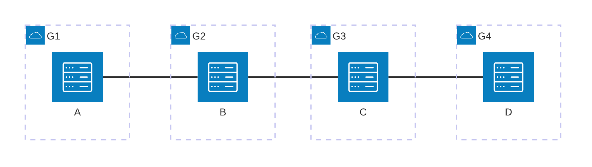
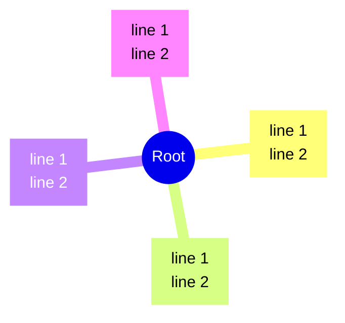
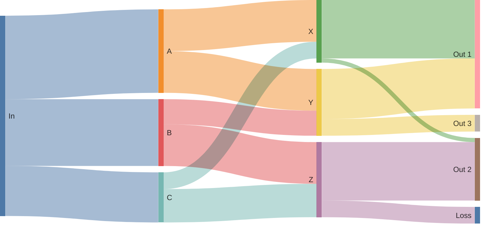
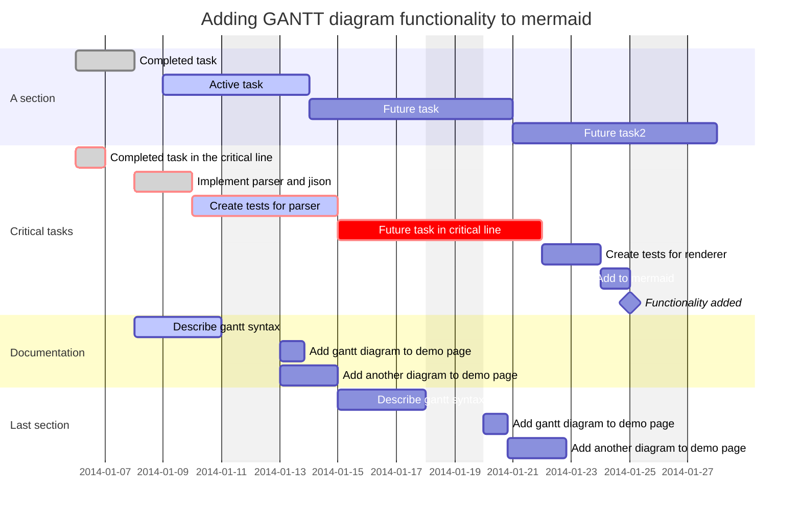

# merman

[Mermaid.js](https://mermaid.js.org/), but headless, in Rust.

[](https://github.com/Latias94/merman/actions/workflows/ci.yml)
[](https://crates.io/crates/merman)
[](https://docs.rs/merman)
[](https://crates.io/crates/merman)
[](https://www.rust-lang.org)

[](https://opensource.org/licenses/MIT)
[](https://opensource.org/licenses/Apache-2.0)

[Mermaid.js](https://mermaid.js.org/) is a JavaScript diagramming tool that turns text such as
`flowchart TD; A-->B;` into diagrams for Markdown, docs, and web apps.

Merman is a parity-focused, headless Rust implementation of Mermaid.js for parsing, layout, and
browserless rendering. It targets `mermaid@11.15.0`, produces semantic JSON, layout JSON, SVG,
raster formats, and ASCII/Unicode output, and does not launch a browser or JavaScript runtime to
render diagrams.

Try it in the browser: [Merman Playground](https://frankorz.com/merman/).

Parity is enforced with golden semantic/layout snapshots and upstream SVG DOM baselines, so changes
that affect semantics, layout, or rendering are caught and reviewed.

Project note: Merman is not affiliated with, endorsed by, or sponsored by the
[Mermaid project](https://github.com/mermaid-js/mermaid) or its maintainers. It is an independent
compatibility implementation by Mermaid users. Many examples and fixtures in this repository are
extracted from Mermaid documentation or tests, either verbatim or with small updates for local
context; see
[`THIRD_PARTY_NOTICES.md`](https://github.com/Latias94/merman/blob/main/THIRD_PARTY_NOTICES.md) for
Mermaid license and provenance notes.

## Choose Your Entry Point

| You want to... | Start with | Notes |
| --- | --- | --- |
| Try or share Mermaid diagrams in the browser | [Merman Playground](https://frankorz.com/merman/) | Static live editor powered by the wasm web package. |
| Render Mermaid from Rust | [`merman`](https://crates.io/crates/merman) | Enable `render` for SVG, `ascii` for terminal text, `raster` for PNG/JPG/PDF. |
| Use a command-line tool | [`merman-cli`](https://crates.io/crates/merman-cli) / [Homebrew](https://formulae.brew.sh/formula/merman-cli) | Detect, parse, layout, render SVG, render raster formats, and render ASCII/Unicode text. |
| Render diagrams in Rust API docs | [`merman-rustdoc`](https://crates.io/crates/merman-rustdoc) | Proc-macro integration for rustdoc that turns Mermaid fences into inline headless SVG. |
| Embed in a browser or TypeScript app | [`@mermanjs/web`](https://www.npmjs.com/package/@mermanjs/web) | wasm-bindgen output plus TypeScript helpers for SVG, JSON, validation, metadata, and DOM rendering. Source: [`platforms/web`](https://github.com/Latias94/merman/tree/main/platforms/web#readme). |
| Build a Typst plugin/package | [`merman-typst-plugin`](https://github.com/Latias94/merman/tree/main/crates/merman-typst-plugin#readme) | Experimental wasm-minimal-protocol transport for Typst-compatible WASM hosts. |
| Parse Mermaid or produce semantic JSON | [`merman-core`](https://crates.io/crates/merman-core) | Parser, metadata, semantic JSON, and typed render models without layout/render dependencies. |
| Embed from C or C++ | [`merman-ffi`](https://crates.io/crates/merman-ffi) | Stable C ABI, header, and dynamic/static library artifacts. Source: [`crates/merman-ffi`](https://github.com/Latias94/merman/tree/main/crates/merman-ffi). |
| Embed from Swift, Kotlin, Dart, Python, or another native host | [Native packages and bindings](#quickstart-ffi-and-native-hosts) | Published packages for Python, Flutter, and web; repository packages for Android and Apple/SwiftPM. |
| Work on layout/rendering internals | [`merman-render`](https://crates.io/crates/merman-render) | Low-level layout and SVG stack used by the public `merman` facade. |

## What Merman Outputs

- Semantic JSON for Mermaid diagrams.
- Layout JSON with computed geometry and routes.
- Mermaid-like SVG from a fully headless Rust renderer.
- ASCII/Unicode diagrams for terminals, logs, and documentation snippets.
- PNG, JPG, and PDF via SVG rasterization/conversion.

Diagram coverage and current parity status live in [docs/alignment/STATUS.md](https://github.com/Latias94/merman/blob/main/docs/alignment/STATUS.md).

## Sample output

| Architecture | Mindmap | Sankey |
| --- | --- | --- |
| <a href="#architecture-many-groups--sparse-services"></a> | <a href="#mindmap-line-breaks-in-labels"></a> | <a href="#sankey-dense-shared-nodes"></a> |

These images were rendered headlessly by `merman-cli` from Mermaid fixtures. See
[Showcase](#showcase) for source diagrams and more rendered examples.

## Performance

`merman` includes a corpus-driven benchmark harness for comparing native `merman`,
`mermaid-rs-renderer`, and upstream Mermaid JS v11.15.0. In a local warm-render `standard` suite
run on Apple M4, `merman` measured all 34 requested fixtures and used about 1.8% to 23.0% of
Mermaid JS render time across successful Mermaid JS cases, roughly 4.3x to 56.4x faster, with a
median speedup around 15.8x.

The goal is not to replace Mermaid.js in the browser. This is mostly for native apps, text
editors, CI pipelines, preview tools, and doc generators where embedding a JS engine just to draw
a flowchart is heavy and awkward. Criterion benchmarks are kept for regression tracking, but the
main priorities are parity and predictable headless output, not a marketing claim about being
"faster Mermaid".

Performance numbers are not a substitute for SVG parity. Missing, skipped, errored, and quality
comparison results are reported separately by the benchmark harness. See
[`docs/performance/BENCHMARKING.md`](https://github.com/Latias94/merman/blob/main/docs/performance/BENCHMARKING.md)
for methodology and commands.

## Install

```sh
# Command-line tool (Cargo)
cargo install merman-cli --version 0.8.0-alpha.2

# Command-line tool (Homebrew, macOS and Linux)
brew install merman-cli

# Rust library: SVG rendering
cargo add merman@0.8.0-alpha.2 --features render

# Rust library: ASCII/Unicode text output
cargo add merman@0.8.0-alpha.2 --features ascii

# Rust library: SVG + PNG/JPG/PDF
cargo add merman@0.8.0-alpha.2 --features raster

# Rustdoc integration
cargo add merman-rustdoc@0.8.0-alpha.2 --optional

# Browser / TypeScript package
npm install @mermanjs/web

# Flutter package
flutter pub add merman

# Python package (experimental UniFFI wheels)
pip install merman
```

Package pages: [Homebrew `merman-cli`](https://formulae.brew.sh/formula/merman-cli),
[npm `@mermanjs/web`](https://www.npmjs.com/package/@mermanjs/web),
[pub.dev `merman`](https://pub.dev/packages/merman), and
[PyPI `merman`](https://pypi.org/project/merman/).

For rustdoc feature setup and examples, see
[`crates/merman-rustdoc/README.md`](crates/merman-rustdoc/README.md).

From a local checkout:

```sh
cargo install --path crates/merman-cli
cargo build -p merman-ffi --release
```

Use [`crates/merman-ffi/include/merman.h`](https://github.com/Latias94/merman/blob/main/crates/merman-ffi/include/merman.h) and link the
platform-specific library artifact from `target/release` for native embedding.

MSRV is `rust-version = 1.95`.

## Contents

- [Choose Your Entry Point](#choose-your-entry-point)
- [What Merman Outputs](#what-merman-outputs)
- [Sample output](#sample-output)
- [Performance](#performance)
- [Install](#install)
- [Quickstart (library)](#quickstart-library)
- [Rust examples](#rust-examples)
- [Quickstart (CLI)](#quickstart-cli)
- [Library API details](#library-api-details)
- [Quickstart (FFI and native hosts)](#quickstart-ffi-and-native-hosts)
- [Math Labels](#math-labels)
- [ASCII/Unicode text output](#asciiunicode-text-output)
- [Developing](#developing)
- [Showcase](#showcase)
- [Parity and coverage](#parity-and-coverage)
- [Quality gates](#quality-gates)
- [Limitations](#limitations)
- [Feature surfaces](#feature-surfaces)
- [Architecture notes](#architecture-notes)
- [Workspace crates](#workspace-crates)
- [Star History](#star-history)
- [Links](#links)

## Quickstart (library)

For most Rust applications, start with `merman::render::HeadlessRenderer`:

```rust
use merman::render::HeadlessRenderer;

fn main() -> Result<(), Box<dyn std::error::Error>> {
    let renderer = HeadlessRenderer::new().with_diagram_id("readme-example");
    let svg = renderer
        .render_svg_sync("flowchart TD\nA[Start] --> B[Done]")?
        .unwrap();

    println!("{svg}");
    Ok(())
}
```

Use `render_svg_sync()` when you want Mermaid-parity SVG. Use
`render_svg_resvg_safe_sync()` when the result will be rasterized or shown by an SVG engine that
does not support `<foreignObject>` well. Use the `ascii` feature and
`merman::ascii::HeadlessAsciiRenderer` for terminal text output.

## Rust examples

The `crates/merman/examples` programs are ordered as a progressive Rust integration path. Each
example reads Mermaid source from stdin when provided and falls back to a small built-in diagram.
When stdin is an interactive terminal, examples `01` through `08` and `11` do not wait for input;
they print a short note to stderr and render their built-in example. See the
[`crates/merman/examples`](crates/merman/examples) directory and its
[`README.md`](crates/merman/examples/README.md) for copyable commands with custom stdin and output
files.

| Step | Goal | Feature | Command |
| --- | --- | --- | --- |
| 01 | Render SVG with the high-level facade | `render` | `cargo run -p merman --features render --example example_01_svg_basic > out.svg` |
| 02 | Parse Mermaid to semantic JSON | none | `cargo run -p merman --example example_02_semantic_json` |
| 03 | Produce layout JSON | `render` | `cargo run -p merman --features render --example example_03_layout_json` |
| 04 | Render terminal text | `ascii` | `cargo run -p merman --features ascii --example example_04_ascii_output` |
| 05 | Render PNG from Rust | `raster` | `cargo run -p merman --features raster --example example_05_raster_output -- target/example.png` |
| 06 | Apply an SVG output pipeline | `render` | `cargo run -p merman --features render --example example_06_svg_pipeline > pipeline.svg` |
| 07 | Use Mermaid theme variables and `themeCSS` | `render` | `cargo run -p merman --features render --example example_07_theme_css > themed.svg` |
| 08 | Make time-sensitive Gantt parsing deterministic | none | `cargo run -p merman --example example_08_deterministic_gantt` |
| 09 | Inline multiple diagrams without SVG id collisions | `render` | `cargo run -p merman --features render --example example_09_multiple_diagrams` |
| 10 | Integrate with a desktop GUI host via egui | `egui-example` | `cargo run -p merman --features egui-example --example example_10_integration_egui` |
| 11 | Build a custom host output environment | `render` | `cargo run -p merman --features render --example example_11_custom_output_environment > host-preview.svg` |

The egui example is intentionally a host-integration skeleton rather than a full playground: it
keeps a long-lived renderer, edits Mermaid source, previews a raster texture, reports render
errors, and saves SVG/PNG outputs.

## Quickstart (CLI)

```sh
# Detect diagram type
merman-cli detect path/to/diagram.mmd

# Parse -> semantic JSON
merman-cli parse path/to/diagram.mmd --pretty

# Layout -> layout JSON
merman-cli layout path/to/diagram.mmd --pretty

# Render SVG
merman-cli render path/to/diagram.mmd --out out.svg

# Render terminal text output
merman-cli render --format unicode path/to/diagram.mmd
merman-cli render --format ascii path/to/diagram.mmd

# Terminal text supports common flowchart directions, labels, shapes, and simple subgraphs
printf "flowchart TB\nsubgraph one\nA((Start)) -- go --> B[(DB)]\nend\n" |
  merman-cli render --format ascii -

# Render raster formats
merman-cli render --format png --out out.png path/to/diagram.mmd
merman-cli render --format jpg --out out.jpg path/to/diagram.mmd
merman-cli render --format pdf --out out.pdf path/to/diagram.mmd
```

Minimal end-to-end example:

```bash
cat > example.mmd <<'EOF'
flowchart TD
  A[Start] --> B{Decision}
  B -->|Yes| C[Do thing]
  B -->|No| D[Do other thing]
EOF

merman-cli render example.mmd --out example.svg
merman-cli render --format ascii example.mmd
```

```powershell
@'
flowchart TD
  A[Start] --> B{Decision}
  B -->|Yes| C[Do thing]
  B -->|No| D[Do other thing]
'@ | Set-Content -Encoding utf8 example.mmd

merman-cli render example.mmd --out example.svg
```

## Library API details

The [`merman`](https://crates.io/crates/merman) crate is a convenience wrapper around [`merman-core`](https://crates.io/crates/merman-core) (parsing)
and output crates such as [`merman-render`](https://crates.io/crates/merman-render) (layout + SVG) and
[`merman-ascii`](https://crates.io/crates/merman-ascii) (ASCII/Unicode text). Enable the `render` feature when you
want layout + SVG, `ascii` when you want text output, and `raster` when you also need PNG/JPG/PDF
from Rust (no CLI required).

```rust
use merman_core::{Engine, ParseOptions};
use merman::render::{
    headless_layout_options, render_svg_sync, sanitize_svg_id, SvgRenderOptions,
};

fn main() -> Result<(), Box<dyn std::error::Error>> {
    let engine = Engine::new();

    let layout = headless_layout_options();

    // For UIs that inline multiple diagrams, set a per-diagram SVG id to avoid internal `<defs>`
    // and accessibility id collisions.
    let svg_opts = SvgRenderOptions {
        diagram_id: Some(sanitize_svg_id("example-diagram")),
        ..SvgRenderOptions::default()
    };

    // Executor-free synchronous entrypoint (the work is CPU-bound and does not perform I/O).
    let svg = render_svg_sync(
        &engine,
        "flowchart TD; A-->B;",
        ParseOptions::default(),
        &layout,
        &svg_opts,
    )?
    .unwrap();

    println!("{svg}");
    Ok(())
}
```

If you prefer a bundled "pipeline" instead of passing multiple option structs per call, use
`merman::render::HeadlessRenderer`.

If you already know the diagram type (e.g. from a Markdown fence info string), prefer
`Engine::parse_diagram_with_type_sync(...)` to skip type detection.

If your downstream renderer does not support SVG `<foreignObject>` (common for rasterizers),
prefer `HeadlessRenderer::render_svg_resvg_safe_sync()`. Use
`HeadlessRenderer::render_svg_readable_sync()` when you want to keep the original
`<foreignObject>` nodes and add best-effort `<text>/<tspan>` fallback overlays.

When you enable the `raster` feature, PNG/JPG conversion is target-aware and budgeted. A Mermaid
SVG can legitimately have a very large `viewBox`; browser previews usually draw that vector SVG
inside a smaller container, while a headless PNG/JPG path must allocate a concrete pixmap. Use
`RasterOptions::with_fit_to(...)` for preview-sized output, `scale` for device-pixel ratio, and
`RasterSizeLimit` for the final pixmap budget. The default PNG/JPG budget caps output at `8192px`
per side and `8192*8192` pixels; trusted oversized exports can call
`RasterOptions::with_unbounded_size()`.

Runnable raster example:

```bash
cargo run -p merman --features raster --example example_05_raster_output
printf "flowchart LR\nA --> B\n" | \
  cargo run -p merman --features raster --example example_05_raster_output -- target/example.png
```

The split is intentional:

- `render_svg_sync` is for Mermaid-parity snapshots and callers that want the raw SVG contract.
- `render_svg_readable_sync` is for inline previews that can keep `<foreignObject>` but still want readable fallback text.
- `render_svg_resvg_safe_sync` or `SvgPipeline::resvg_safe()` is for PNG/JPG/PDF export and tools built on `resvg` / `usvg`.
- `SvgPostprocessor` and `ScopedCssPostprocessor` are for host applications that need product-specific theme or cleanup passes after a built-in preset.

`render_svg_sync` intentionally stays Mermaid-parity by default. For consumer-oriented output,
use an explicit SVG pipeline:

```rust
use merman::render::{
    CssOverridePolicy, HeadlessRenderer, ScopedCssPostprocessor, SvgPipeline,
};

let renderer = HeadlessRenderer::new().with_diagram_id("readme-diagram");
let pipeline = SvgPipeline::resvg_safe().with_postprocessor(
    ScopedCssPostprocessor::new(
        r#"
.node rect {
  stroke: #2563eb;
  stroke-width: 2px;
}
.merman-foreignobject-fallback-text {
  fill: #111827;
}
"#,
    )
    .with_override_policy(CssOverridePolicy::StripExistingImportant),
);
let svg = renderer
    .render_svg_with_pipeline_sync("flowchart TD; A[Layer 7\\nHTTP]-->B;", &pipeline)?
    .unwrap();
# Ok::<(), Box<dyn std::error::Error>>(())
```

See [`docs/rendering/SVG_OUTPUT_PIPELINE.md`](https://github.com/Latias94/merman/blob/main/docs/rendering/SVG_OUTPUT_PIPELINE.md) for preset
behavior, custom postprocessors that can read diagram type/title/svg id, and scoped CSS examples.

Runnable example:

```bash
cargo run -p merman --features render --example example_06_svg_pipeline < fixtures/flowchart/basic.mmd > out.svg
cargo run -p merman --features render --example example_11_custom_output_environment > host-preview.svg
```

## Quickstart (FFI and native hosts)

The [`merman-ffi`](https://crates.io/crates/merman-ffi) crate exposes a stable C ABI for non-Rust hosts. The current
FFI surface supports SVG rendering, ASCII text rendering, semantic JSON, layout JSON, validation
JSON, binding metadata, host text-measurement callbacks for reusable engines, and explicit
Rust-owned buffer release.

Start with the surface that matches your host:

| Host | Package or source | Notes |
| --- | --- | --- |
| C / C++ / other native FFI | [`merman-ffi`](https://crates.io/crates/merman-ffi), [`crates/merman-ffi`](https://github.com/Latias94/merman/tree/main/crates/merman-ffi), [`merman.h`](https://github.com/Latias94/merman/blob/main/crates/merman-ffi/include/merman.h) | Stable C ABI used by the higher-level wrappers. |
| Python | [`merman` on PyPI](https://pypi.org/project/merman/), [`platforms/python/merman`](https://github.com/Latias94/merman/tree/main/platforms/python/merman) | Experimental UniFFI wheels. |
| Flutter / Dart | [`merman` on pub.dev](https://pub.dev/packages/merman), [`platforms/flutter`](https://github.com/Latias94/merman/tree/main/platforms/flutter) | Flutter package backed by Dart FFI and bundled native libraries. |
| Android / Kotlin | [`platforms/android`](https://github.com/Latias94/merman/tree/main/platforms/android) | AAR/JNI package source for Android hosts. |
| Apple / SwiftPM | [`Package.swift`](https://github.com/Latias94/merman/blob/main/Package.swift), [`platforms/apple`](https://github.com/Latias94/merman/tree/main/platforms/apple) | Swift wrapper and binary XCFramework package layout. |

```c
#include "merman.h"

static const uint8_t source[] = "flowchart TD\nA[Hello] --> B[World]";

MermanResult result = merman_render_svg(source, sizeof(source) - 1, NULL, 0);
if (result.code == MERMAN_OK) {
    /* result.data contains UTF-8 SVG bytes. */
}
merman_buffer_free(result.data);
```

Every non-empty `MermanResult.data` buffer must be released with `merman_buffer_free`. See
[`docs/bindings/FFI_PROTOCOL.md`](https://github.com/Latias94/merman/blob/main/docs/bindings/FFI_PROTOCOL.md) for result codes, options JSON,
threading, and compatibility rules.

Headless rendering cannot know the exact browser or native UI font fallback that will display the
final SVG. If precise label geometry matters, native hosts should install the FFI text-measurement
callback and measure with their own DOM/canvas/WebView/native text stack. Unsupported requests can
return `handled=0`, and merman will fall back to its vendored Mermaid-compatible measurer.

Detailed platform notes:

- Android/Kotlin: [`docs/bindings/ANDROID_JNI.md`](https://github.com/Latias94/merman/blob/main/docs/bindings/ANDROID_JNI.md)
- Apple Swift Package: [`docs/bindings/APPLE_SWIFT.md`](https://github.com/Latias94/merman/blob/main/docs/bindings/APPLE_SWIFT.md)
- Flutter/Dart FFI: [`docs/bindings/FLUTTER_DART_FFI.md`](https://github.com/Latias94/merman/blob/main/docs/bindings/FLUTTER_DART_FFI.md)
- Python UniFFI package: [`docs/bindings/PYTHON_UNIFFI.md`](https://github.com/Latias94/merman/blob/main/docs/bindings/PYTHON_UNIFFI.md)

### Binary size

The FFI and wasm packages carry the full parser, layout, and headless renderer stack. Treat them as
application/runtime dependencies rather than tiny scripting shims: current release artifacts are
roughly 9-17 MB per native dynamic-library slice before app-store or package compression, while the
browser wasm artifact is about 9.8 MB uncompressed and 3.6 MB with gzip. Universal Apple
XCFrameworks and static archives can be larger because they bundle multiple architectures. Use
normal platform controls such as release builds, stripping/LTO, package compression, lazy loading,
and long-lived caching for versioned artifacts.

## Math Labels

`merman-cli` enables the pure-Rust RaTeX backend by default. Use `--math-renderer ratex`
to render supported `$$...$$` labels. Flowchart and Sequence support math-only labels and
single-formula prose/math labels such as `Solve: $$x^2$$`:

```bash
printf "flowchart LR\nA[\"$$x^2$$\"] --> B\n" |
  cargo run -p merman-cli -- render --math-renderer ratex -
```

Build `merman-cli` with `--no-default-features` only when you intentionally want to exclude
default binary capabilities such as RaTeX and ASCII/Unicode. In that mode `ratex` remains
unavailable unless `ratex-math` is enabled explicitly, and ASCII/Unicode CLI output remains
unavailable unless `ascii` is enabled explicitly.

## ASCII/Unicode text output

Library users enable the `ascii` feature when they want terminal-friendly text instead of SVG.
`merman-cli` enables ASCII/Unicode output by default:

Current public text support covers flowchart/graph, sequenceDiagram, classDiagram, erDiagram, and
xychart through `merman::ascii::render_ascii_sync`, typed `merman::ascii::render_model`, the direct
typed helpers (`render_flowchart`, `render_sequence`, `render_class`, `render_er`,
`render_xychart`), and `merman-cli render --format ascii|unicode`.

Flowchart text output covers LR/TD/TB/BT/RL root directions, boxed nodes, common terminal shape
approximations, labels, open/dotted/thick edges, length spacing, and titled/nested subgraphs with
multiline and wrapped title rows.

Sequence text output covers common messages, notes, lifecycle rows, participant boxes, and the
primary Mermaid control-block subset: `loop`, `opt`, `break`, `rect`, `par_over`, `alt`, `par`,
and `critical`. Mermaid-compatible output keeps bottom participant boxes disabled by default;
`AsciiRenderOptions::with_sequence_mirror_actors(true)` and
`merman-cli render --format ascii|unicode --sequence-mirror-actors` enable mirrored participant
boxes for terminal output.

Class, ER, and XYChart text output intentionally ship bounded terminal-native subsets: class and ER
support boxes, labels, single relationships, layered chain/star multi-relationship layouts, and
adjacent-layer crossing layouts resolved by layer reordering. Same-endpoint and simple
mixed-parallel relationships render as distinct lanes, simple spanning-level relationships route
through side lanes, and isolated unrelated classes/entities render as standalone components beside
the relationship layout. Cyclic and denser graph shapes still return clear diagnostics. XYChart
renders deterministic compact bars, lines, mixed plots, titles, and axes instead of SVG
coordinates.

```rust
use merman::ascii::{AsciiRenderOptions, HeadlessAsciiRenderer};

fn main() -> Result<(), Box<dyn std::error::Error>> {
    let renderer = HeadlessAsciiRenderer::new()
        .with_strict_parsing()
        .with_ascii_options(AsciiRenderOptions::unicode());
    let text = renderer
        .render_ascii_sync("sequenceDiagram\nparticipant A\nparticipant B\nA->>B: Hello")?
        .unwrap();

    println!("{text}");
    Ok(())
}
```

Runnable examples:

```bash
cargo run -p merman --features ascii --example example_04_ascii_output
cargo run -p merman --features ascii --example example_04_ascii_output -- --ascii
cargo run -p merman --features raster --example example_05_raster_output
printf "flowchart LR\nA --> B\n" | cargo run -p merman-cli -- render --format ascii -
```

## Developing

For local Rust changes, start with the fast formatting and test loop:

```sh
cargo fmt --all --check
cargo nextest run --workspace
cargo run -p xtask -- verify
```

Use `cargo run -p xtask -- verify --strict` before release-level parser, layout, render, or
platform binding changes. Platform-specific build and packaging notes live with the binding docs
linked in [Quickstart (FFI and native hosts)](#quickstart-ffi-and-native-hosts).

## Showcase

All screenshots below are produced by [`merman-cli`](https://crates.io/crates/merman-cli) (headless) and committed under
[docs/assets/showcase/](https://github.com/Latias94/merman/tree/main/docs/assets/showcase/).
Each example links to an existing fixture so the README stays honest and reproducible.

### Architecture (many groups + sparse services)

<p align="center">
  
</p>

Fixture: [`fixtures/architecture/stress_architecture_batch4_many_groups_sparse_services_069.mmd`](https://github.com/Latias94/merman/blob/main/fixtures/architecture/stress_architecture_batch4_many_groups_sparse_services_069.mmd)

<details>
  <summary>Mermaid source</summary>


```mermaid
architecture-beta
%% Authored stress fixture: many groups with sparse services (group rect bounds).

group g1(cloud)[G1]
group g2(cloud)[G2]
group g3(cloud)[G3]
group g4(cloud)[G4]

service a(server)[A] in g1
service b(server)[B] in g2
service c(server)[C] in g3
service d(server)[D] in g4

a:R -- L:b
b:R -- L:c
c:R -- L:d
```

</details>

### Mindmap (line breaks in labels)

<p align="center">
  
</p>

Fixture: [`fixtures/mindmap/stress_mindmap_br_variants_031.mmd`](https://github.com/Latias94/merman/blob/main/fixtures/mindmap/stress_mindmap_br_variants_031.mmd)

<details>
  <summary>Mermaid source</summary>


```mermaid
mindmap
  %% Authored stress fixture: <br> variants inside labels.
  root((Root))
    n1["line 1<br>line 2"]
    n2["line 1<br/>line 2"]
    n3["line 1<br />line 2"]
    n4["line 1<br \t/>line 2"]
    %% plus whitespace variants (see the fixture for the full set)
```

</details>

### Sankey (dense shared nodes)

<p align="center">
  
</p>

Fixture: [`fixtures/sankey/stress_sankey_batch1_dense_shared_nodes_007.mmd`](https://github.com/Latias94/merman/blob/main/fixtures/sankey/stress_sankey_batch1_dense_shared_nodes_007.mmd)

<details>
  <summary>Mermaid source</summary>


```mermaid
%%{init: {"sankey": {"width": 900, "height": 420, "useMaxWidth": true, "showValues": false, "linkColor": "source", "nodeAlignment": "justify"}}}%%
sankey

%% Source: repo-ref/mermaid/packages/mermaid/src/docs/syntax/sankey.md (dense graphs) + authored stress
In,A,10
In,B,8
In,C,6
A,X,5
A,Y,5
B,Y,3
B,Z,5
C,X,2
C,Z,4
X,Out 1,7
X,Out 2,0.5
Y,Out 1,6
Y,Out 3,2
Z,Out 2,7
Z,Loss,2
```

</details>

### Gantt (date math + excludes)

<p align="center">
  
</p>

Fixture: [`fixtures/gantt/upstream_docs_gantt_syntax_002.mmd`](https://github.com/Latias94/merman/blob/main/fixtures/gantt/upstream_docs_gantt_syntax_002.mmd)

<details>
  <summary>Mermaid source</summary>


```mermaid
gantt
    dateFormat  YYYY-MM-DD
    title       Adding GANTT diagram functionality to mermaid
    excludes    weekends
    %% (`excludes` accepts specific dates in YYYY-MM-DD format, days of the week ("sunday") or "weekends", but not the word "weekdays".)

    section A section
    Completed task            :done,    des1, 2014-01-06,2014-01-08
    Active task               :active,  des2, 2014-01-09, 3d
    Future task               :         des3, after des2, 5d
    Future task2              :         des4, after des3, 5d

    section Critical tasks
    Completed task in the critical line :crit, done, 2014-01-06,24h
    Implement parser and jison          :crit, done, after des1, 2d
    Create tests for parser             :crit, active, 3d
    Future task in critical line        :crit, 5d
    Create tests for renderer           :2d
    Add to mermaid                      :until isadded
    Functionality added                 :milestone, isadded, 2014-01-25, 0d

    section Documentation
    Describe gantt syntax               :active, a1, after des1, 3d
    Add gantt diagram to demo page      :after a1  , 20h
    Add another diagram to demo page    :doc1, after a1  , 48h

    section Last section
    Describe gantt syntax               :after doc1, 3d
    Add gantt diagram to demo page      :20h
    Add another diagram to demo page    :48h
```

</details>

### Stress gallery (more fixtures)

| Architecture (ports + routing) | Mindmap (deep + wide) |
| --- | --- |
| <br/>Fixture: [`fixtures/architecture/stress_architecture_batch5_services_outside_groups_crosslinks_078.mmd`](https://github.com/Latias94/merman/blob/main/fixtures/architecture/stress_architecture_batch5_services_outside_groups_crosslinks_078.mmd)<br/><sub>Note: Architecture diagonal arrowheads are oriented from the rendered edge segment; DOM parity still normalizes geometry against upstream Mermaid.</sub> | <br/>Fixture: [`fixtures/mindmap/stress_deep_wide_combo_011.mmd`](https://github.com/Latias94/merman/blob/main/fixtures/mindmap/stress_deep_wide_combo_011.mmd) |

## Parity and coverage

- Baseline: Mermaid `@11.15.0`.
- Merman treats Mermaid as the specification, not just inspiration: surprising upstream behavior is
  matched and documented instead of being replaced with a Rust-specific interpretation.
- Parsing and semantic output are locked with `fixtures/**/*.golden.json`; layout geometry is locked
  separately with `fixtures/**/*.layout.golden.json` so regressions can be traced to parsing,
  geometry, or final SVG emission.
- Upstream SVG baselines under `fixtures/upstream-svgs/**` are generated from the pinned official
  Mermaid CLI/browser rendering pipeline and used as the end-to-end source of truth.
- Core layout dependencies are rewritten as headless Rust ports where parity requires matching
  upstream algorithms: `dugong` / `dugong-graphlib` for Dagre + Graphlib behavior, and `manatee`
  for Cytoscape/FCoSE/COSE-style compound layouts used by diagrams such as Architecture and
  Mindmap.
- Fixture imports are traceable to upstream docs, tests, Cypress rendering samples, and selected
  stress cases. When an upstream browser sample is not directly renderable by the pinned Mermaid
  CLI, the raw input is kept as parser-only and a documented normalized variant is used for layout
  and SVG parity.
- Alignment is enforced via upstream SVG DOM baselines plus semantic/layout golden snapshots.
- DOM parity checks normalize geometry numeric tokens to 3 decimals (`--dom-decimals 3`) and compare the canonicalized DOM, not byte-identical SVG text.
- Corpus size: 3500+ upstream SVG baselines across 23 diagrams.
- Mermaid diagram families that are present upstream but not implemented here are listed in
  [docs/alignment/STATUS.md](https://github.com/Latias94/merman/blob/main/docs/alignment/STATUS.md).
- Current coverage and gates: [docs/alignment/STATUS.md](https://github.com/Latias94/merman/blob/main/docs/alignment/STATUS.md).
- ZenUML is supported in a headless compatibility mode (subset; not parity-gated). See [docs/adr/0061-external-diagrams-zenuml.md](https://github.com/Latias94/merman/blob/main/docs/adr/0061-external-diagrams-zenuml.md).

## Quality gates

This repo is built around reproducible alignment layers and CI-friendly gates:

- Semantic snapshots: `fixtures/**/*.golden.json`
- Layout snapshots: `fixtures/**/*.layout.golden.json`
- Upstream SVG baselines: `fixtures/upstream-svgs/**`
- DOM parity gates: `xtask compare-all-svgs --check-dom` (see [docs/adr/0050-release-quality-gates.md](https://github.com/Latias94/merman/blob/main/docs/adr/0050-release-quality-gates.md))

The goal is not “it looks similar”, but “it stays aligned”.

Quick confidence check:

```sh
cargo run -p xtask -- verify
```

Release-level check:

```sh
cargo run -p xtask -- verify --strict
```

`--strict` adds all-features compilation, the public feature matrix
(`merman` no-default/render/raster and `merman-core` no-default), workspace clippy, override
no-growth, nextest, SVG DOM parity, and full SVG root parity.

For a quick “does raster output look sane?” sweep across fixtures (dev-only):

- `pwsh -NoProfile -ExecutionPolicy Bypass -File tools/preview/export-fixtures-png.ps1 -BuildReleaseCli -CleanOutDir`

## Limitations

- SVG `<foreignObject>` HTML labels are not universally supported (especially in rasterizers). If you need a more compatible output, prefer `render_svg_resvg_safe_sync()` or the explicit `SvgPipeline::resvg_safe()` preset.
- Text measurement is inherently host-sensitive. Merman uses vendored compatibility metrics by
  default and keeps Flowchart HTML labels non-clipping, but browser and native font fallback,
  shaping, hinting, and subpixel rounding can still differ. Hosts that need exact geometry should
  provide a `TextMeasurer` in Rust or the C FFI text-measurement callback.
- PNG/JPG export is constrained by a default pixmap budget. This protects headless hosts from
  oversized allocations, but it also means extremely large diagrams are downscaled unless callers
  choose a target fit box or explicitly opt into unbounded raster output.
- Architecture compound layout and root viewport parity are still geometry-normalized against upstream Cytoscape/FCoSE output; dense compound graphs can still have layout-level differences (see [`docs/alignment/STATUS.md`](https://github.com/Latias94/merman/blob/main/docs/alignment/STATUS.md)).
- Determinism is a goal: output is stabilized via goldens, DOM canonicalization, and vendored/forked dependencies where needed (see `roughr-merman`).

## Feature surfaces

Cargo feature meanings and host profile expectations are documented in
[`docs/FEATURES.md`](https://github.com/Latias94/merman/blob/main/docs/FEATURES.md). In short:
`merman-wasm` is the browser/wasm-bindgen package, while pure-WASM and Typst-style hosts start from
`merman-core --no-default-features` or `merman --no-default-features` and must avoid full core
config/sanitization, host-clock, host-random, host-timing, JS, and WASI imports.

`@mermanjs/web` publishes the full browser artifact by default. The source tree also has browser
source-build presets for core, render, ASCII, full, and RaTeX math artifacts, but those presets are
not separate npm entry points. Browser callers can inspect the active artifact with
`bindingCapabilities()`.

Typst-compatible WASM uses `merman-typst-plugin`, not `merman-wasm`. The plugin crate exports
wasm-minimal-protocol functions and is gated so package artifacts import only Typst's `typst_env`
protocol functions.

Use the defaults for normal Rust applications. Defaults keep Mermaid-compatible full
configuration/sanitization and host behavior enabled, which is what you want for CLIs, servers,
desktop apps, and tests that should accept Mermaid-style frontmatter, JSON5/YAML config, and broad
HTML sanitization.

Disable defaults for constrained hosts. For example, a Typst package, plugin sandbox, or no-import
WASM runtime usually does not want local wall-clock time, host randomness, `wasm-bindgen`, WASI, URL
parsing, YAML/JSON5 parsing, or DOMPurify-like sanitizer dependencies. In those cases, start from
`default-features = false`, then opt into only the output family you need.

Enable `render` when you need layout and SVG output. Add `raster` only when you also need PNG/JPG/PDF
conversion. Add `ascii` only for terminal text output. Enable `core-full` when you need Mermaid's
full config/frontmatter behavior or full sanitizer parity; leave it off for size-oriented Typst-like
rendering where inputs and options are already controlled. Enable `host` when local clock/randomness
is a feature, such as live previews that should use today’s date; leave it off for deterministic
WASM output.

The pure core profile keeps common inline metadata such as `@{ shape: rounded }`, but does not apply
YAML frontmatter title/config and uses conservative HTML escaping instead of DOMPurify-like
sanitization.

## Architecture notes

- `merman-core` owns detection, parsing, stable semantic JSON, and typed render models for the
  render-optimized path.
- `merman-render` owns layout and SVG emission. The default SVG helper uses
  `parse_diagram_for_render_model_sync` -> `layout_parsed_render_layout_only` ->
  `render_layout_svg_parts_for_render_model_with_config`, so typed diagrams avoid rebuilding the
  owned semantic JSON payload.
- `layout_diagram_sync` and `render_layouted_svg` remain compatibility paths for callers that need
  owned semantic/layout JSON between steps.
- Parity renderers live under `svg/parity/*`; large renderers are split by diagram responsibility
  and generated overrides are treated as compatibility data, not as default model fixes.

## Workspace crates

| Crate | Role |
| --- | --- |
| [`merman`](https://crates.io/crates/merman) | Public Rust facade. Enable `render`, `ascii`, and/or `raster` depending on output needs. |
| [`merman-cli`](https://crates.io/crates/merman-cli) | Command-line interface for detect/parse/layout/render workflows. |
| [`merman-rustdoc`](https://crates.io/crates/merman-rustdoc) | Proc-macro integration for rendering Mermaid fences in rustdoc as inline headless SVG. |
| [`merman-core`](https://crates.io/crates/merman-core) | Detection, parsing, metadata, semantic JSON, and typed render models. |
| [`merman-render`](https://crates.io/crates/merman-render) | Headless layout, SVG rendering, SVG pipelines, and raster-friendly postprocessing. |
| [`merman-ascii`](https://crates.io/crates/merman-ascii) | ASCII/Unicode terminal rendering for typed models. |
| [`merman-ffi`](https://crates.io/crates/merman-ffi) | Stable C ABI for native hosts and platform wrappers. |
| [`merman-bindings-core`](https://crates.io/crates/merman-bindings-core) | Shared safe facade behind C ABI and UniFFI bindings. |
| [`merman-uniffi`](https://crates.io/crates/merman-uniffi) | UniFFI-generated binding surface, currently used for Python packaging. |
| [`merman-wasm`](https://crates.io/crates/merman-wasm) | wasm-bindgen transport crate behind the `@mermanjs/web` TypeScript package. |
| [`merman-typst-plugin`](https://crates.io/crates/merman-typst-plugin) | Experimental wasm-minimal-protocol transport crate for Typst-compatible plugin hosts. |
| [`dugong`](https://crates.io/crates/dugong) | Dagre-compatible layout port. |
| [`dugong-graphlib`](https://crates.io/crates/dugong-graphlib) | Graph container APIs ported from `dagrejs/graphlib`. |
| [`manatee`](https://crates.io/crates/manatee) | COSE/FCoSE-style compound graph layout ports. |
| [`merman-layout-elk`](https://crates.io/crates/merman-layout-elk) | Optional ELK layout engine integration point. |
| [`roughr-merman`](https://crates.io/crates/roughr-merman) | Forked Rough.js-style renderer dependency stabilized for Mermaid parity. |

## Star History

<a href="https://www.star-history.com/#Latias94/merman&amp;Date">
  <picture>
    <source media="(prefers-color-scheme: dark)" srcset="https://api.star-history.com/svg?repos=Latias94/merman&amp;type=Date&amp;theme=dark" />
    <source media="(prefers-color-scheme: light)" srcset="https://api.star-history.com/svg?repos=Latias94/merman&amp;type=Date" />
    
  </picture>
</a>

## Links

- Alignment status: [docs/alignment/STATUS.md](https://github.com/Latias94/merman/blob/main/docs/alignment/STATUS.md)
- Merman Playground: [frankorz.com/merman](https://frankorz.com/merman/)
- Parity policy: [docs/adr/0014-upstream-parity-policy.md](https://github.com/Latias94/merman/blob/main/docs/adr/0014-upstream-parity-policy.md)
- Release quality gates: [docs/adr/0050-release-quality-gates.md](https://github.com/Latias94/merman/blob/main/docs/adr/0050-release-quality-gates.md)
- WASM package surface semantics: [docs/adr/0069-wasm-package-surface-semantics.md](https://github.com/Latias94/merman/blob/main/docs/adr/0069-wasm-package-surface-semantics.md)
- Upstream Mermaid: [mermaid-js/mermaid](https://github.com/mermaid-js/mermaid) (MIT)
- Related: [1jehuang/mermaid-rs-renderer](https://github.com/1jehuang/mermaid-rs-renderer/)
- ASCII reference: [AlexanderGrooff/mermaid-ascii](https://github.com/AlexanderGrooff/mermaid-ascii)
  (MIT; grid/routing/fixture reference for `merman-ascii`)
- ASCII reference: [lukilabs/beautiful-mermaid](https://github.com/lukilabs/beautiful-mermaid)
  (MIT; reference for future class, ER, xychart, color, and multiline terminal output)
- Changelog: [CHANGELOG.md](https://github.com/Latias94/merman/blob/main/CHANGELOG.md)
- License: dual MIT or Apache-2.0; see `LICENSE`, `LICENSE-MIT`, and `LICENSE-APACHE`
- Upstream attribution: [THIRD_PARTY_NOTICES.md](https://github.com/Latias94/merman/blob/main/THIRD_PARTY_NOTICES.md)
