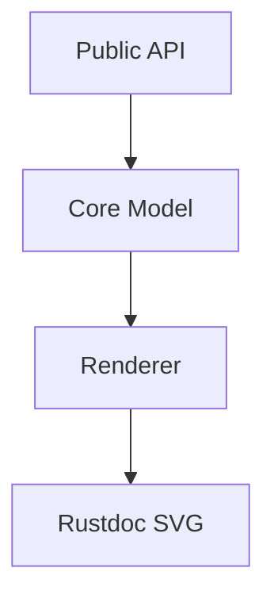
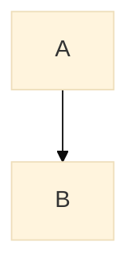

# merman-rustdoc

[](https://crates.io/crates/merman-rustdoc)
[](https://docs.rs/merman-rustdoc)

Render Mermaid diagrams in rustdoc as inline SVG.

`merman-rustdoc` is a small proc-macro integration for crates that want diagrams in API docs
without loading Mermaid JavaScript in the browser. It reads Mermaid code fences and `include_mmd!`
lines from doc comments, renders them with Merman during `cargo doc`, and writes the resulting SVG
back into the generated rustdoc page.

## Install

Use a normal dependency for the simplest setup:

```toml
[dependencies]
merman-rustdoc = "0.7"
```

This works for local `cargo doc` and for docs.rs because the examples below use `cfg_attr(doc, ...)`.
The macro only expands during rustdoc builds, but Cargo will still compile the dependency during
ordinary builds.

If you want ordinary builds to avoid compiling `merman-rustdoc`, make it optional behind a
documentation feature:

```toml
[dependencies]
merman-rustdoc = { version = "0.7", optional = true }

[features]
doc-diagrams = ["dep:merman-rustdoc"]

[package.metadata.docs.rs]
features = ["doc-diagrams"]
```

With this optional setup, build docs locally with:

```sh
cargo doc --features doc-diagrams
```

docs.rs will also enable `doc-diagrams` because of the `package.metadata.docs.rs` section.

## Quickstart

Put `#[cfg_attr(doc, merman_rustdoc::merman)]` on any item whose docs contain a Mermaid fence.

````rust
#[cfg_attr(doc, merman_rustdoc::merman)]
/// Rendered by rustdoc as inline SVG:
///
/// ```mermaid
/// flowchart TD
///   A[Start] --> B[Done]
/// ```
pub fn example() {}
````

When you run `cargo doc`, the Mermaid fence is replaced with an inline `<svg>` in the generated
HTML. The source view still shows your original Rust source. If you use the optional dependency
setup above, run `cargo doc --features doc-diagrams` instead.

## Common Patterns

### Functions

````rust
#[cfg_attr(doc, merman_rustdoc::merman)]
/// Parse, layout, and render a diagram.
///
/// ```mermaid
/// flowchart LR
///   Parse --> Layout --> Svg[SVG]
/// ```
pub fn render_svg(input: &str) -> String {
    todo!()
}
````

### Modules

````rust
#[cfg_attr(doc, merman_rustdoc::merman)]
/// Rendering pipeline.
///
/// ```mermaid
/// flowchart TD
///   Core[merman-core] --> Render[merman-render]
///   Render --> Rustdoc[merman-rustdoc]
/// ```
pub mod render {}
````

### Structs

````rust
#[cfg_attr(doc, merman_rustdoc::merman)]
/// A renderer configured for rustdoc output.
///
/// ```mermaid
/// flowchart TD
///   Config --> Renderer
///   Renderer --> InlineSvg[Inline SVG]
/// ```
pub struct RustdocRenderer;
````

### Traits

````rust
#[cfg_attr(doc, merman_rustdoc::merman)]
/// Something that can render a diagram.
///
/// ```mermaid
/// sequenceDiagram
///   participant Caller
///   participant Renderer
///   Caller->>Renderer: render(source)
///   Renderer-->>Caller: svg
/// ```
pub trait RenderDiagram {
    fn render(&self, source: &str) -> String;
}
````

### Impl Blocks

````rust
pub struct Client;

#[cfg_attr(doc, merman_rustdoc::merman)]
/// High-level client workflow.
///
/// ```mermaid
/// flowchart TD
///   New[new()] --> Render[render()]
///   Render --> Done[SVG]
/// ```
impl Client {
    pub fn new() -> Self {
        Self
    }

    pub fn render(&self, _source: &str) -> String {
        todo!()
    }
}
````

## Include Mermaid Files

Large diagrams are easier to maintain in separate `.mmd` files.

```text
my-crate/
├── Cargo.toml
├── src/lib.rs
└── docs/architecture.mmd
```

`docs/architecture.mmd`:



`src/lib.rs`:

```rust
#[cfg_attr(doc, merman_rustdoc::merman)]
/// Crate architecture.
///
/// include_mmd!("docs/architecture.mmd")
pub fn architecture() {}
```

Include paths are resolved relative to the consuming crate's `CARGO_MANIFEST_DIR`, not relative to
the source file.

## Multiple Diagrams

You can put more than one diagram on the same item. SVG ids are scoped per diagram so inline SVG
definitions do not collide.

````rust
#[cfg_attr(doc, merman_rustdoc::merman)]
/// Input flow:
///
/// ```mermaid
/// flowchart LR
///   Source --> Parse --> Model
/// ```
///
/// Output flow:
///
/// ```mermaid
/// flowchart LR
///   Model --> Layout --> Svg[SVG]
/// ```
pub fn pipeline() {}
````

Backtick and tilde fences are both supported:

````rust
#[cfg_attr(doc, merman_rustdoc::merman)]
/// ~~~ mermaid
/// flowchart TD
///   A --> B
/// ~~~
pub fn tilde_fence() {}
````

## Options

The attribute accepts string options:

```rust
#[cfg_attr(
    doc,
    merman_rustdoc::merman(
        scope = "item",
        pipeline = "readable",
        fail = "error",
        source = "hide",
        sanitize = "strict",
        theme = "rustdoc"
    )
)]
/// ```mermaid
/// flowchart TD
///   A --> B
/// ```
pub fn configured() {}
```

| Option | Values | Default | Meaning |
| --- | --- | --- | --- |
| `scope` | `item`, `tree` | `item` | Controls whether only the annotated item or the inline item tree is rewritten. |
| `pipeline` | `readable`, `parity`, `resvg-safe` | `readable` | Selects the SVG output pipeline. |
| `fail` | `error`, `keep-source` | `error` | Controls what happens when rendering or file includes fail. |
| `source` | `hide`, `details` | `hide` | Adds a collapsed Mermaid source block under the SVG when set to `details`. |
| `sanitize` | `strict`, `off` | `strict` | Checks rendered SVG for script elements, event attributes, and unsafe resource references. |
| `theme` | `rustdoc`, `mermaid`, or a supported Mermaid theme name | `rustdoc` | Controls whether diagrams follow rustdoc light/dark themes, use Mermaid source config, or use a fixed Mermaid theme. |

### `scope = "tree"`

Use `scope = "tree"` when one attribute should process docs inside an inline item tree. This is most
useful for modules, but it also handles docs on impl methods, trait methods, fields, and enum
variants that are visible in the annotated item.

````rust
#[cfg_attr(
    doc,
    merman_rustdoc::merman(scope = "tree")
)]
pub mod api {
    /// Nested function diagram.
    ///
    /// ```mermaid
    /// flowchart TD
    ///   Request --> Handler --> Response
    /// ```
    pub fn handler() {}

    pub struct Client;

    impl Client {
        /// Nested method diagram.
        ///
        /// ```mermaid
        /// sequenceDiagram
        ///   User->>Client: call()
        ///   Client-->>User: result
        /// ```
        pub fn call(&self) {}
    }
}
````

`scope = "tree"` requires inline Rust syntax. It does not inspect external module files:

```rust
#[cfg_attr(doc, merman_rustdoc::merman(scope = "tree"))]
pub mod external;
```

That form fails with a clear error because a proc macro cannot safely recurse into `external.rs`.

### `source = "details"`

Use this when readers should be able to inspect the Mermaid source from the generated docs.

````rust
#[cfg_attr(
    doc,
    merman_rustdoc::merman(source = "details")
)]
/// ```mermaid
/// flowchart TD
///   User --> Api --> Database
/// ```
pub fn visible_source() {}
````

The generated page will show the SVG first, then a collapsed "Mermaid source" block.

### `fail = "keep-source"`

Use this for documentation builds where a broken diagram should not fail the whole crate. The
original Mermaid fence or `include_mmd!` line is left in place when rendering fails.

````rust
#[cfg_attr(
    doc,
    merman_rustdoc::merman(fail = "keep-source")
)]
/// ```mermaid
/// flowchart TD
///   A --> B
/// ```
pub fn tolerant_docs() {}
````

The default is `fail = "error"`, which is better for CI and release builds because diagram problems
are caught early.

### `pipeline`

Choose the SVG pipeline that fits the target:

- `readable`: default. Produces stable, readable SVG for rustdoc.
- `parity`: closer to Merman's Mermaid-parity SVG path.
- `resvg-safe`: post-processes SVG for raster-oriented consumers.

```rust
#[cfg_attr(
    doc,
    merman_rustdoc::merman(pipeline = "resvg-safe")
)]
/// ```mermaid
/// flowchart TD
///   A --> B
/// ```
pub fn resvg_safe_docs() {}
```

### `sanitize = "strict"`

`sanitize = "strict"` is the default. It validates rendered SVG before inserting it into rustdoc and
fails the documentation build if it finds script elements, event attributes, `javascript:` URLs, or
remote resource references such as `<image href="https://...">`.

```rust
#[cfg_attr(
    doc,
    merman_rustdoc::merman(sanitize = "strict")
)]
/// ```mermaid
/// flowchart TD
///   A --> B
/// ```
pub fn checked_svg() {}
```

Use `sanitize = "off"` only when you are deliberately inspecting raw renderer output:

```rust
#[cfg_attr(
    doc,
    merman_rustdoc::merman(sanitize = "off")
)]
/// ```mermaid
/// flowchart TD
///   A --> B
/// ```
pub fn raw_svg() {}
```

### `theme`

`theme = "rustdoc"` is the default. It renders light and dark SVG variants during `cargo doc`, then
uses rustdoc's page theme state to show the matching variant. Readers can switch rustdoc light,
dark, or ayu themes without loading Mermaid JavaScript in the browser.

Use `theme = "mermaid"` when you want a single SVG and want Mermaid source-level config, such as
front matter or an `%%init%%` directive, to decide the theme:

````rust
#[cfg_attr(
    doc,
    merman_rustdoc::merman(theme = "mermaid")
)]
/// ```mermaid
/// %%{init: {"theme": "base"}}%%
/// flowchart TD
///   A --> B
/// ```
pub fn mermaid_configured_diagram() {}
````

Use a fixed Mermaid theme when you want one static SVG regardless of the reader's rustdoc theme:

````rust
#[cfg_attr(
    doc,
    merman_rustdoc::merman(theme = "dark")
)]
/// ```mermaid
/// flowchart TD
///   A --> B
/// ```
pub fn dark_diagram() {}
````

Supported fixed theme names follow Merman's Mermaid theme surface: `default`, `base`, `dark`,
`forest`, `neutral`, `neo`, `neo-dark`, `redux`, `redux-dark`, `redux-color`, and
`redux-dark-color`.

Rustdoc theme mode and fixed themes are passed as Mermaid site config. Source-level config still
wins, so a diagram can override them with front matter or an `%%init%%` directive:



When source-level config sets an explicit Mermaid theme, both rustdoc variants may render with that
source-selected theme. Use source-level theme directives only when a diagram should intentionally
opt out of rustdoc theme adaptation.

## Re-exports

Inline SVG is stored in the expanded rustdoc attributes. That makes re-exported pages work when the
upstream item was documented with `merman-rustdoc`.

```rust
// upstream crate
#[cfg_attr(doc, merman_rustdoc::merman)]
/// ```mermaid
/// flowchart TD
///   Upstream --> Reexport
/// ```
pub struct DiagrammedType;
```

```rust
// downstream crate
#[doc(inline)]
pub use upstream::DiagrammedType;
```

If the upstream crate uses the optional documentation feature setup, that feature still has to be
enabled when its docs are built. A downstream re-export cannot render diagrams that were never
expanded upstream.

## What Gets Rendered

Supported today:

- Mermaid fences using backticks or tildes.
- `include_mmd!("path/to/file.mmd")` lines outside other Markdown code fences.
- Item docs on functions, modules, structs, traits, and impl blocks.
- Recursive inline item docs with `scope = "tree"`.
- Multiple diagrams on the same item.
- Footnotes and normal Markdown around diagrams.
- Re-exported item docs when the upstream item was rendered first.

Not supported today:

- Crate-level inner docs using `//!`.
- Recursive processing for external `mod name;` files.
- Running Mermaid JavaScript in the browser.
- Fetching Mermaid source or assets from remote URLs.
- Copying external SVG files into the rustdoc output directory.

## Troubleshooting

### The generated docs still show a Mermaid code block

Make sure the item has the attribute:

```rust
#[cfg_attr(doc, merman_rustdoc::merman)]
```

If you use the optional dependency setup, also make sure the documentation feature is enabled:

```sh
cargo doc --features doc-diagrams
```

Also gate the attribute with the same feature:

```rust
#[cfg_attr(all(doc, feature = "doc-diagrams"), merman_rustdoc::merman)]
```

### `include_mmd!` cannot find a file

Paths are relative to `CARGO_MANIFEST_DIR`.

```rust
/// include_mmd!("docs/architecture.mmd")
```

For a crate at `my-crate/Cargo.toml`, that resolves to:

```text
my-crate/docs/architecture.mmd
```

### docs.rs does not render diagrams

The normal dependency setup does not need docs.rs metadata. If `merman-rustdoc` is optional behind a
documentation feature, add the docs.rs feature configuration:

```toml
[package.metadata.docs.rs]
features = ["doc-diagrams"]
```

### A diagram failure blocks `cargo doc`

That is the default behavior. Use `fail = "keep-source"` if you prefer documentation builds to keep
going while preserving the original Mermaid source.

### `scope = "tree"` fails on `mod name;`

Use an inline module when you want recursive processing:

```rust
#[cfg_attr(doc, merman_rustdoc::merman(scope = "tree"))]
pub mod api {
    // child docs are visible to the proc macro here
}
```

External module files are not traversed by the proc macro.

### Can I use this on crate-level `//!` docs?

No. `merman-rustdoc` rewrites item-level outer docs. It does not rewrite crate-level inner docs
written with `//!`.

Put crate-level diagrams on a public module or item instead:

````rust
#[cfg_attr(doc, merman_rustdoc::merman)]
/// Crate architecture.
///
/// ```mermaid
/// flowchart TD
///   Crate --> Module
/// ```
pub mod architecture {}
````

### Does this rewrite `#[doc = include_str!(...)]`?

No. `merman-rustdoc` rewrites literal rustdoc lines that come from item doc comments and
`include_mmd!("path.mmd")` lines. It does not evaluate or rewrite Markdown loaded through
`#[doc = include_str!("...")]`.

Use `include_mmd!` for Mermaid files:

```rust
#[cfg_attr(doc, merman_rustdoc::merman)]
/// include_mmd!("docs/architecture.mmd")
pub fn architecture() {}
```

### Do rustdoc symbol links work inside Mermaid diagrams?

No. Mermaid source is rendered to SVG before rustdoc resolves intra-doc links. Text inside the SVG
does not participate in rustdoc link resolution, so labels such as `[Type](crate::Type)` are treated
as Mermaid text or Mermaid links, not rustdoc symbol links.

Normal Mermaid links follow whatever Merman renders, subject to `sanitize = "strict"`.

### What about themes?

By default, `merman-rustdoc` follows rustdoc's light/dark theme setting. It renders light and dark
SVG variants during `cargo doc` and uses rustdoc's `data-theme` state to show the matching variant.

Use `theme = "mermaid"` for a single SVG controlled by Mermaid source config. Use `theme = "dark"`
or another supported Mermaid theme to choose one fixed build-time theme. If your Mermaid source uses
Mermaid's own source-level config, such as an `%%init%%` directive, it is passed to Merman with the
rest of the diagram and overrides the rustdoc-level theme default:


Whether a specific Mermaid theme directive works depends on Merman's renderer support for that
diagram and config. `merman-rustdoc` does not add a separate SVG recoloring layer on top.

## Why Build-Time SVG

Many rustdoc Mermaid integrations inject Mermaid JavaScript into the generated page. That works, but
it makes rendering depend on browser execution, script loading, and sometimes remote assets.

`merman-rustdoc` renders before the page is opened:

- no Mermaid JavaScript is injected;
- no CDN is required;
- docs work offline after they are generated;
- SVG is present in the HTML that rustdoc writes;
- broken diagrams can fail CI before release.

## Acknowledgements

Thanks to [`aquamarine`](https://github.com/mersinvald/aquamarine) for proving that Mermaid diagrams
inside rustdoc comments are useful and ergonomic. `merman-rustdoc` follows the same user-facing idea,
but renders SVG with Merman during documentation builds instead of loading Mermaid in the browser.
