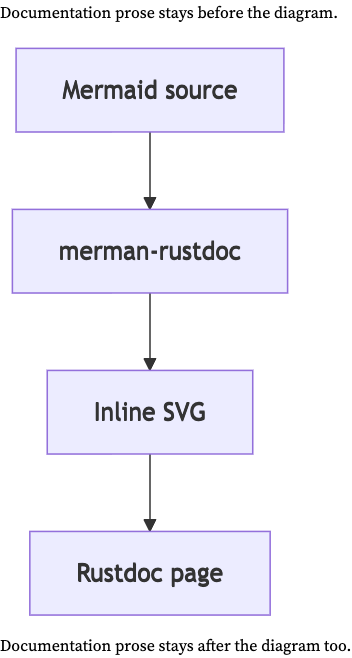

# merman-rustdoc

[](https://crates.io/crates/merman-rustdoc) [](https://docs.rs/merman-rustdoc) [](https://github.com/Latias94/merman/blob/main/LICENSE-MIT)

Render Mermaid diagrams as inline SVG while `cargo doc` runs. Generated rustdoc pages need no Mermaid JavaScript, browser-side rendering, CDN, or network access.

`merman-rustdoc` rewrites Mermaid fences and `include_mmd!` lines in item documentation. Diagram failures can fail CI before documentation is published, and the resulting SVG remains part of the generated HTML.

> Dependency snippets pin the prerelease version because APIs can change between alpha releases.

## Quick Start

Keep the renderer out of ordinary builds by making it an optional documentation dependency:

```toml
[dependencies]
merman-rustdoc = { version = "=0.8.0-alpha.6", optional = true }

[features]
doc-diagrams = ["dep:merman-rustdoc"]

[package.metadata.docs.rs]
features = ["doc-diagrams"]
```

Annotate an item whose docs contain a Mermaid fence:

````rust
#[cfg_attr(all(doc, feature = "doc-diagrams"), merman_rustdoc::merman)]
/// The diagram is replaced with inline SVG during `cargo doc`.
///
/// ```mermaid
/// flowchart TD
///   Source[Mermaid source] --> Macro[merman-rustdoc]
///   Macro --> Svg[Inline SVG]
///   Svg --> Docs[Rustdoc page]
/// ```
pub fn documented() {}
````

Build the documentation:

```sh
cargo doc --features doc-diagrams
```

The source code still contains the original Mermaid fence. Only the rustdoc output is rewritten.



## Choose Between The Two Rustdoc Paths

This macro is the one-step path: `cargo doc` compiles the selected native renderer closure and
rewrites annotated item documentation during macro expansion. The independent
[`merman-cli rustdoc`](../merman-cli/README.md#rustdoc-fragments) path moves rendering to an explicit
authoring/CI step so the documented crate consumes only committed files. Neither integration
depends on, executes, discovers, or falls back to the other.

The checked-generation form starts with a configuration such as:

```toml
schema = 1

[[fragments]]
id = "crate-overview"
source = "docs/rustdoc-src/crate-overview.md"
```

Generate and verify the managed bundle, then use standard Rustdoc input:

```sh
merman-cli rustdoc build --config merman-rustdoc.toml
merman-cli rustdoc check --config merman-rustdoc.toml --quiet
cargo doc --no-deps
```

```rust
#![doc = include_str!(concat!(
    env!("CARGO_MANIFEST_DIR"),
    "/docs/generated/merman-rustdoc/crate-overview.md"
))]
```

| Concern | `merman-cli rustdoc` | `merman-rustdoc` attribute macro |
| --- | --- | --- |
| Cargo dependency closure | No Merman renderer dependency in the documented crate | Compiles this proc macro and the selected native renderer closure |
| Authoring loop | Explicit `build`; CI runs read-only `check` | One-step rendering during `cargo doc` |
| Rustdoc scope | Crate and item docs through native `include_str!` | Annotated item docs and recursive inline item trees |
| Generated ownership | Commit and review fragments plus `receipt.json` | Source comments stay unchanged; SVG exists only in generated Rustdoc output |
| docs.rs | Reads packaged fragments; it does not run the CLI | Enables the optional macro dependency through docs.rs metadata |
| Failure timing | Authoring build or CI freshness check | Macro expansion during `cargo doc` |
| Rollback | Restore or regenerate source/config/managed output as one Git change | Revert the annotated Rust source or feature selection |

Choose CLI generation for published crates, crate-level docs, reproducible package contents, or a
strict Cargo dependency budget. Choose this macro for item-level docs when one-step `cargo doc`
ergonomics outweigh the compile cost. A generated fragment must be included at most once on one
rendered page because it contains deterministic SVG DOM IDs. The CLI guide documents package
inclusion, Git rollback, and migration from this attribute form.

## Choose The Renderer Closure

The default feature is `complete-svg`: deterministic SVG rendering with Cytoscape layout and math.
It intentionally does not enable the optional EPL-2.0 ELK implementation or host clock, time-zone,
random, or timing adapters. Use `complete-svg-elk` only when the published artifact is prepared
with the corresponding ELK notices and source provenance.

Use a smaller closure when the documented diagrams need only the base SVG renderer:

```toml
[dependencies]
merman-rustdoc = { version = "=0.8.0-alpha.6", default-features = false, features = ["svg"], optional = true }
```

| Feature | Adds |
| --- | --- |
| `complete-svg` | `svg`, Cytoscape layout, and math |
| `complete-svg-elk` | `complete-svg` plus the ELK layout implementation and its EPL-2.0 closure |
| `svg` | Base deterministic SVG renderer |
| `layout-cytoscape` | Architecture and other Cytoscape-backed layouts; implies `svg` |
| `layout-elk` | ELK-backed layouts; implies `svg` |
| `math` | RaTeX math rendering; implies `svg` |

If build weight matters, start with `svg` and add only the capabilities required by the diagrams in your docs.

## Include Mermaid Files

Large diagrams can live in separate `.mmd` files:

```text
my-crate/
├── Cargo.toml
├── src/lib.rs
└── docs/architecture.mmd
```

Reference the file from an annotated item's docs:

```rust
#[cfg_attr(all(doc, feature = "doc-diagrams"), merman_rustdoc::merman)]
/// Crate architecture.
///
/// include_mmd!("docs/architecture.mmd")
pub fn architecture() {}
```

Paths are resolved relative to the consuming crate's `CARGO_MANIFEST_DIR`. `include_mmd!` must appear outside other Markdown code fences.

## Configure Rendering

All attribute options use string literals:

````rust
#[cfg_attr(
    all(doc, feature = "doc-diagrams"),
    merman_rustdoc::merman(
        scope = "item",
        pipeline = "parity",
        fail = "error",
        source = "hide",
        sanitize = "strict",
        theme = "rustdoc"
    )
)]
/// ```mermaid
/// flowchart TD
///   A --> B
/// ```
pub fn configured() {}
````

| Option | Values | Default | Meaning |
| --- | --- | --- | --- |
| `scope` | `item`, `tree` | `item` | Rewrite only the annotated item or recurse through an inline item tree. |
| `pipeline` | `parity`, `readable`, `resvg-safe` | `parity` | Select the SVG output pipeline. |
| `fail` | `error`, `keep-source` | `error` | Fail documentation or preserve the Mermaid source after an error. |
| `source` | `hide`, `details` | `hide` | Optionally add the source in a collapsed details block. |
| `sanitize` | `strict`, `off` | `strict` | Reject scripts, event attributes, unsafe URLs, and remote resources before insertion. |
| `theme` | `rustdoc`, `mermaid`, or a supported Mermaid theme | `rustdoc` | Follow rustdoc, source-level Mermaid config, or one fixed theme. |

`theme = "rustdoc"` renders light and dark SVG variants and switches between them with rustdoc's existing page theme state. No Mermaid runtime is loaded in the browser. `theme = "mermaid"` emits one SVG controlled by Mermaid source config, while a value such as `theme = "dark"` selects one fixed Merman theme. Source-level Mermaid config still takes precedence.

`parity` is the default because rustdoc pages target browsers, which render Mermaid's native
`<foreignObject>` labels directly. `readable` deliberately adds SVG `<text>` fallbacks alongside
those labels and can display both representations in consumers that support each one. Use it only
when the host selects one representation. `resvg-safe` removes `<foreignObject>` labels and keeps
the SVG text fallback for rasterizers and other compatible consumers.

Use `scope = "tree"` when one attribute should process children inside an inline module, trait, impl block, struct, or enum:

````rust
#[cfg_attr(
    all(doc, feature = "doc-diagrams"),
    merman_rustdoc::merman(scope = "tree")
)]
pub mod api {
    /// ```mermaid
    /// flowchart TD
    ///   Request --> Handler --> Response
    /// ```
    pub fn handler() {}
}
````

An external `mod api;` cannot be traversed by a proc macro. Annotate items in that module directly instead.

## Supported Inputs

- Backtick or tilde Mermaid fences.
- Multiple diagrams on one item, with isolated SVG IDs.
- `include_mmd!("path/to/file.mmd")`.
- Item docs on functions, modules, structs, traits, impl blocks, fields, and variants visible to the annotated syntax tree.
- Recursive inline items with `scope = "tree"`.
- Re-exported docs when the upstream item was rendered first.
- Normal Markdown, prose, and footnotes around diagrams.

The macro deliberately does not:

- rewrite crate-level inner docs written with `//!`;
- evaluate Markdown from `#[doc = include_str!("...")]`;
- traverse external `mod name;` files;
- resolve rustdoc symbol links inside SVG text;
- fetch Mermaid source or assets from remote URLs;
- inject Mermaid JavaScript into generated pages.

For a crate-level architecture diagram, place the docs on a public module or another public item.

## Failure And Security Policy

The default `fail = "error"` stops `cargo doc` when source loading, parsing, rendering, or sanitization fails. This is the recommended CI behavior. Use `fail = "keep-source"` when documentation should remain buildable while preserving the unresolved Mermaid fence.

The default `sanitize = "strict"` validates every rendered SVG before inserting it into rustdoc. Disable it only for deliberate renderer debugging; `sanitize = "off"` trusts the generated SVG as raw HTML.

## Troubleshooting

**The page still shows a Mermaid fence.** Confirm the item has the attribute, the dependency feature is enabled, and the `cfg_attr` uses the same `doc-diagrams` gate:

```sh
cargo doc --features doc-diagrams
```

**`include_mmd!` cannot find a file.** Resolve the path from the crate containing `Cargo.toml`, not from the Rust source file.

**docs.rs does not render diagrams.** When the dependency is optional, include `features = ["doc-diagrams"]` under `[package.metadata.docs.rs]`.

**A slim build reports a missing capability.** Add `layout-cytoscape` or `math` to the dependency
as required, use `complete-svg-elk` when the documented diagrams need ELK, or use the default
`complete-svg` profile for the non-ELK closure.

**A re-export has no rendered diagram.** The upstream item's macro must expand while the upstream docs are built; a downstream re-export cannot render source that was never expanded.

## License And Notices

Merman's own code is licensed under either Apache-2.0 or MIT at your option. The default
`complete-svg` closure does not compile ELK; `complete-svg-elk` and any artifact profile that lists
`layout-elk` additionally carry the EPL-2.0 ELK source closure. Distribute the matching notices and
source provenance from [`THIRD_PARTY_NOTICES.md`](https://github.com/Latias94/merman/blob/main/THIRD_PARTY_NOTICES.md)
with that artifact. Math-enabled builds may also include the OFL-1.1 RaTeX font closure.

The user-facing attribute pattern is inspired by [`aquamarine`](https://github.com/mersinvald/aquamarine). Merman differs by rendering SVG during documentation builds instead of loading Mermaid in the browser.
