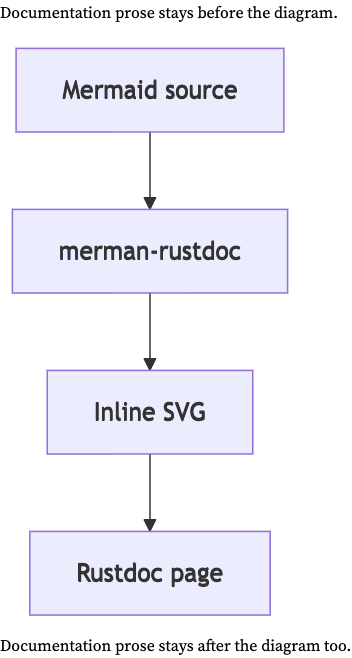

# merman-rustdoc

[](https://crates.io/crates/merman-rustdoc) [](https://docs.rs/merman-rustdoc) [](https://github.com/Latias94/merman/blob/main/LICENSE-MIT)

Render Mermaid diagrams as inline SVG while `cargo doc` runs. Generated rustdoc pages need no Mermaid JavaScript, browser-side rendering, CDN, or network access.

`merman-rustdoc` rewrites Mermaid fences and `include_mmd!` lines in item documentation. Diagram failures can fail CI before documentation is published, and the resulting SVG remains part of the generated HTML.

> This guide and its dependency examples target the unpublished `0.8.0` candidate. The latest published version is `0.8.0-alpha.7`; use its tagged documentation until `0.8.0` is available.

> The offline resource defaults and resource-budget options documented below are new in `0.8.0`. Published `0.8.0-alpha.7` uses the interactive 800,000-unit budget and does not expose these options.

## Quick Start

Keep the renderer out of ordinary builds by making it an optional documentation dependency:

```toml
[dependencies]
merman-rustdoc = { version = "0.8.0", optional = true }

[features]
doc-diagrams = ["dep:merman-rustdoc"]

[package.metadata.docs.rs]
features = ["doc-diagrams"]
```

Annotate an item whose docs contain a Mermaid fence:

````rust
#[cfg_attr(all(doc, feature = "doc-diagrams"), merman_rustdoc::merman)]
/// The diagram is replaced with inline SVG during `cargo doc`.
///
/// ```mermaid
/// flowchart TD
///   Source[Mermaid source] --> Macro[merman-rustdoc]
///   Macro --> Svg[Inline SVG]
///   Svg --> Docs[Rustdoc page]
/// ```
pub fn documented() {}
````

Build the documentation:

```sh
cargo doc --features doc-diagrams
```

Leave `doc-diagrams` out of your default features. `cfg_attr` controls macro expansion, not
dependency compilation: `cargo build --all-features` still compiles the selected renderer.
Optional dependencies can also remain in `Cargo.lock` while their feature is disabled; that does
not mean Cargo builds them. For no renderer dependency during `cargo doc` either, use the
CLI-generated fragments described below.

The source code still contains the original Mermaid fence. Only the rustdoc output is rewritten.



## Choose Between The Two Rustdoc Paths

This macro is the one-step path: `cargo doc` compiles the selected native renderer closure and
rewrites annotated item documentation during macro expansion. The independent
[`merman-cli rustdoc`](../merman-cli/README.md#rustdoc-fragments) path moves rendering to an explicit
authoring/CI step so the documented crate consumes only committed files. Neither integration
depends on, executes, discovers, or falls back to the other. They share Markdown replacement
and HTML wrapping through `merman-doc`, and SVG output handling through the renderer. The shared
libraries do not add the macro or CLI to the other product's dependency graph.

The checked-generation form starts with a configuration such as:

```toml
schema = 1

[[fragments]]
id = "crate-overview"
source = "docs/rustdoc-src/crate-overview.md"
```

Generate and verify the managed bundle, then use standard Rustdoc input:

```sh
merman-cli rustdoc build --config merman-rustdoc.toml
merman-cli rustdoc check --config merman-rustdoc.toml --quiet
cargo doc --no-deps
```

```rust
#![doc = include_str!(concat!(
    env!("CARGO_MANIFEST_DIR"),
    "/docs/generated/merman-rustdoc/crate-overview.md"
))]
```

| Concern | `merman-cli rustdoc` | `merman-rustdoc` attribute macro |
| --- | --- | --- |
| Cargo dependency closure | No Merman renderer dependency in the documented crate | Compiles this proc macro and the selected native renderer closure |
| Authoring loop | Explicit `build`; CI runs read-only `check` | One-step rendering during `cargo doc` |
| Rustdoc scope | Crate and item docs through native `include_str!` | Annotated item docs and recursive inline item trees |
| Generated ownership | Commit and review fragments plus `receipt.json` | Source comments stay unchanged; SVG exists only in generated Rustdoc output |
| docs.rs | Reads packaged fragments; it does not run the CLI | Enables the optional macro dependency through docs.rs metadata |
| Failure timing | Authoring build or CI freshness check | Macro expansion during `cargo doc` |
| Rollback | Restore or regenerate source/config/managed output as one Git change | Revert the annotated Rust source or feature selection |

Choose CLI generation for published crates, crate-level docs, reproducible package contents, or a
strict Cargo dependency budget. Choose this macro for item-level docs when one-step `cargo doc`
ergonomics outweigh the compile cost. A generated fragment must be included at most once on one
rendered page because it contains deterministic SVG DOM IDs. The CLI guide documents package
inclusion, Git rollback, and migration from this attribute form.

## Choose The Renderer Closure

The `0.8.0` candidate defaults to `all-diagrams`, `svg`, `layout-cytoscape`, and
`layout-elk`: all built-in families and deterministic SVG rendering with both layout engines.
Math is opt-in; add `math` when diagrams contain mathematical labels, or select `complete-svg-elk`
for SVG, both layouts, and math together. Users of alpha.6's math-enabled default must enable
math explicitly when upgrading.

The default includes the EPL-2.0 ELK implementation; distributed artifacts must retain the
corresponding notices and source provenance. It does not enable host clock, time-zone, random,
or timing adapters. The separate `merman` facade defaults to `all-diagrams + complete-svg-elk`,
including math. To omit ELK, disable default features and select the required diagram families
plus `complete-svg` for SVG, Cytoscape, and math, or choose narrower capability leaves. Selecting
`complete-svg` without disabling defaults still includes ELK because Cargo features are additive.
See the repository's
[third-party notices](https://github.com/Latias94/merman/blob/main/THIRD_PARTY_NOTICES.md) for the
source provenance and artifact obligations.

Use a smaller closure when the documented diagrams need only the base SVG renderer:

```toml
[dependencies]
merman-rustdoc = { version = "0.8.0", default-features = false, features = ["diagram-flowchart", "svg"], optional = true }
```

| Feature | Adds |
| --- | --- |
| `complete-svg` | `svg`, Cytoscape layout, and math |
| `complete-svg-elk` | `complete-svg` plus the ELK layout implementation and its EPL-2.0 closure |
| `svg` | Base deterministic SVG renderer |
| `layout-cytoscape` | Architecture and other Cytoscape-backed layouts; implies `svg` |
| `layout-elk` | ELK-backed layouts; implies `svg` |
| `math` | RaTeX math rendering; implies `svg` |

For the current checkout, disable defaults and select both families and outputs explicitly:

```toml
merman-rustdoc = { path = "../merman/crates/merman-rustdoc", default-features = false, features = ["svg", "diagram-flowchart"], optional = true }
```

Use `all-diagrams` to retain the complete parser surface. `complete-svg` and `complete-svg-elk`
select output/engine closures; neither enables a family when defaults are disabled. See the
[migration guide](../../docs/FEATURES.md#select-diagram-families).

## Include Mermaid Files

Large diagrams can live in separate `.mmd` files:

```text
my-crate/
├── Cargo.toml
├── build.rs
├── src/lib.rs
└── docs/diagrams/architecture.mmd
```

Reference the file from an annotated item's docs:

```rust
#[cfg_attr(all(doc, feature = "doc-diagrams"), merman_rustdoc::merman)]
/// Crate architecture.
///
/// include_mmd!("docs/diagrams/architecture.mmd")
pub fn architecture() {}
```

Paths are resolved relative to the consuming crate's `CARGO_MANIFEST_DIR`. Write `include_mmd!` on
its own Markdown line, using a JSON-compatible quoted path such as the example above; Rust
raw-string paths are not supported. Directives in comments, inline code, or other code blocks are
preserved.

### Rebuild When Diagram Files Change

The macro reads files during expansion but cannot automatically register all those reads with
stable Cargo builds. Add this `build.rs` to the consuming crate so edits to diagram files trigger
documentation regeneration without editing Rust source:

```rust
fn main() {
    println!("cargo::rerun-if-changed=docs/diagrams");
}
```

No build dependency is required. Keep `docs/diagrams` as an existing dedicated directory and watch
the directory rather than just existing `.mmd` files. Cargo then observes file additions,
modifications, and deletions, including restoration of a missing include when using
`fail = "keep-source"`. Run `cargo doc --features doc-diagrams` as usual after changing a diagram.

If the crate already has a `build.rs`, add the `println!` to its existing `main`. Emitting the first
`rerun-if-changed` instruction narrows Cargo's default package-wide tracking, so also declare the
script's other file inputs if it previously relied on that default.

Both the watched path and `include_mmd!` resolve from the consuming crate's manifest directory.
For a local input such as `../shared/docs/diagrams/architecture.mmd`, watch
`../shared/docs/diagrams` in that consumer's build script. Include the diagram directory in the
crate package, especially when using a `[package] include` allowlist; verify it with
`cargo package --list`. Files outside the package are local workspace inputs, not portable
published resources. Copy required diagrams into the published crate or use the CLI generation
path for committed documentation fragments.

## Configure Rendering

All attribute options use string literals. Unknown or repeated options are errors:

````rust
#[cfg_attr(
    all(doc, feature = "doc-diagrams"),
    merman_rustdoc::merman(
        scope = "item",
        pipeline = "parity",
        fail = "error",
        source = "hide",
        sanitize = "strict",
        theme = "rustdoc",
        background = "transparent"
    )
)]
/// ```mermaid
/// flowchart TD
///   A --> B
/// ```
pub fn configured() {}
````

| Option | Values | Default | Meaning |
| --- | --- | --- | --- |
| `scope` | `item`, `tree` | `item` | Rewrite only the annotated item or recurse through an inline item tree. |
| `inherit` | `on`, `off` | `on` | Inherit parent tree rendering options, or start from defaults before applying this attribute's options. |
| `pipeline` | `parity`, `readable`, `resvg-safe` | `parity` | Select the SVG output pipeline. |
| `fail` | `error`, `keep-source` | `error` | Fail documentation or preserve the Mermaid source after an error. |
| `source` | `hide`, `details` | `hide` | Optionally add the source in a collapsed details block. |
| `sanitize` | `strict`, `off` | `strict` | Reject scripts, event attributes, unsafe URLs, and remote resources before insertion. |
| `theme` | `rustdoc`, `mermaid`, or a supported Mermaid theme | `rustdoc` | Follow rustdoc, source-level Mermaid config, or one fixed theme. |
| `background` | A CSS background color | `transparent` | Set the root SVG background independently of Mermaid theme configuration. |
| `id_prefix` | A nonempty string of ASCII letters, digits, `-`, or `_` | Automatic namespace | Add an explicit namespace for generated documentation with overlapping source locations. |
| `resource_profile` | `interactive`, `constrained`, `trusted-native`, `unbounded-for-trusted-input` | `trusted-native` | Select the input, model, layout, and SVG resource policy. |
| `max_layout_work_units` | Positive integer literal | Selected profile's limit | Override only the layout work budget for each diagram and theme variant. |

`theme = "rustdoc"` renders light and dark SVG variants and switches between them with rustdoc's existing page theme state. No Mermaid runtime is loaded in the browser. `theme = "mermaid"` emits one SVG controlled by Mermaid source config, while a value such as `theme = "dark"` selects one fixed Merman theme. Source-level Mermaid config still takes precedence.

The root SVG background is transparent by default, so the diagram uses the rustdoc page's
background in both light and dark themes. Set `background = "white"` or another CSS color when the
canvas should have its own background. This is an SVG output policy, separate from
`themeVariables.background`; a source-level Mermaid theme does not replace the root background
selected by this option.

SVG IDs are isolated automatically for each documented occurrence and theme variant. Most callers
do not need `id_prefix`. When another macro generates items with overlapping source locations,
assign distinct prefixes to those invocations, for example `id_prefix = "request-api"`. A prefix
adds to the automatic namespace; it does not set an exact SVG ID or remove the per-diagram and
per-theme suffixes. Reusing one prefix on a tree still preserves instance isolation.

`parity` is the default browser-oriented preset. It still runs inside the macro's embedding pipeline: deterministic
rendering, a transparent canvas, strict SVG admission, and isolated IDs remain the defaults.
Changing Cargo features selects available rendering capabilities; it does not select a different
SVG pipeline.

Browsers render Mermaid's native
`<foreignObject>` labels directly. `readable` deliberately adds SVG `<text>` fallbacks alongside
those labels and can display both representations in consumers that support each one. Use it only
when the host selects one representation. `resvg-safe` removes `<foreignObject>` labels and keeps
the SVG text fallback for rasterizers and other compatible consumers.

Use `scope = "tree"` when one attribute should process children inside an inline module, trait, impl block, struct, or enum:

````rust
#[cfg_attr(
    all(doc, feature = "doc-diagrams"),
    merman_rustdoc::merman(scope = "tree")
)]
pub mod api {
    /// ```mermaid
    /// flowchart TD
    ///   Request --> Handler --> Response
    /// ```
    pub fn handler() {}
}
````

Rendering is deferred until Rust has processed conditional compilation. A child function, field,
or enum variant excluded by `cfg` does not render diagrams or read its Mermaid includes. The macro
does not evaluate `cfg` expressions itself.

A child with its own `merman` attribute inherits rendering options from the parent's
`scope = "tree"` and overrides only the options it explicitly supplies. `scope` itself is not
inherited: it defaults to `item`, so the child changes only its own docs and its descendants keep
the parent's configuration. Use `scope = "tree"` on the child to apply its effective rendering
options to its visible descendants. For example:

````rust
#[cfg_attr(all(doc, feature = "doc-diagrams"), merman_rustdoc::merman(scope = "tree", source = "details"))]
pub mod api {
    #[cfg_attr(all(doc, feature = "doc-diagrams"), merman_rustdoc::merman(theme = "dark"))]
    /// ```mermaid
    /// flowchart TD
    ///   Request --> Response
    /// ```
    pub fn request() {}
}
````

Here `request` uses the dark theme and inherits `source = "details"`. To start from defaults,
write `merman_rustdoc::merman(inherit = "off", theme = "dark")`: this uses `source = "hide"`,
the default transparent background, and no inherited `id_prefix`, then applies the local dark
theme. `inherit = "off"` changes the base configuration; any explicit local option still applies.

Inheritance also works when the attribute is imported with `use` or renamed. Attributes apply
to their selected documentation in expansion order. An item with no documentation is unchanged
by `scope = "item"`; its options are not saved for a later `scope = "tree"` attribute. Prefer one
attribute per item and select `scope = "tree"` when configuring descendant documentation.

If a child's `cfg_attr` condition is false, its local macro does not run and the parent's tree
configuration still applies. Cargo dependency renaming is supported; use the dependency's local
name in the public attribute path.

An external `mod api;` cannot be traversed by a proc macro. Annotate items in that module directly
instead. Fields and enum variants are processed through an enclosing `scope = "tree"`; the public
attribute is intended for items.

### Generated Items and Diagram Identity

Ordinary attributes and separate `macro_rules!` invocations receive automatic namespaces.
If one declarative-macro invocation generates identical annotated methods in different impls,
annotate each complete impl with `scope = "tree"` so its trait/type identity is available, or
supply distinct `id_prefix` values in the generated branches. The same explicit prefix rule
applies to identical generated methods whose outer calls have the same line and column in
different files. Stable procedural macros do not expose every outer expansion context; no
process-global counter is used to disguise this boundary.

## Resource Budgets

Rustdoc uses the `trusted-native` profile for offline documentation builds, matching the CLI's
local-file workflow. It allows 15,000,000 layout work units per diagram and theme variant while
retaining finite source, model, nesting, and SVG limits. Ordinary documentation needs no budget
configuration. The general library and Web defaults remain `interactive` (14,100,000 units).

Work units measure deterministic admission work, not milliseconds, bytes, or a Mermaid syntax
limit. Alpha.7 selects ELK for Class and other supported families when compiled in; nested
namespaces can require more work than the former Dagre default. The native budget is calibrated
against the registered corpus and nested-Class controls, rather than source lines or node count.

For an exceptional trusted diagram, increase only the budget named by the diagnostic:

```rust
#[cfg_attr(
    all(doc, feature = "doc-diagrams"),
    merman_rustdoc::merman(max_layout_work_units = 20_000_000)
)]
/// include_mmd!("docs/diagrams/architecture.mmd")
pub fn architecture() {}
```

The integer must be positive and fit the build host's `usize`; quoted numbers, expressions,
and zero are rejected. The example value is not a guarantee for every diagram. A resource
error's `actual` value identifies the charge that was rejected, not the total budget a successful
render would need. Each diagram and each light/dark variant receives its own budget.

Use `resource_profile = "interactive"` or `"constrained"` when intentionally tightening the broader
input/model/output policy for a restricted build environment. `unbounded-for-trusted-input`
explicitly removes policy ceilings for trusted documentation; hard implementation guards remain.
An explicit `max_layout_work_units` applies after the selected profile, including the unbounded
profile. Choose a finite override when only one budget needs to change.

Both options follow `scope = "tree"` inheritance. A child overrides only the fields it supplies;
changing its profile preserves an inherited explicit layout limit. `inherit = "off"` resets both
to defaults before applying local options. Mermaid frontmatter and init directives cannot override
these host limits, and the attribute macro does not read `merman-rustdoc.toml`.

## Supported Inputs

- Backtick or tilde Mermaid fences, including in lists, blockquotes, and footnotes.
- Multiple diagrams on one item, with isolated SVG IDs.
- `include_mmd!("path/to/file.mmd")`.
- Item docs on functions, modules, structs, traits, and impl blocks.
- Field and variant docs visible to an enclosing `scope = "tree"`.
- Line comments, block doc comments, and literal multiline `#[doc = "..."]` attributes.
- Recursive inline items with `scope = "tree"`.
- Re-exported docs when the upstream item was rendered first.
- Normal Markdown, prose, and footnotes around diagrams.

Literal doc attributes on the same item are combined across ordinary attributes, preserving
Markdown structure and indentation. Dynamic doc expressions, such as `#[doc = include_str!(...)]`,
remain unchanged and form boundaries between rewritten groups; do not split one Mermaid block
across such a boundary. Code examples and HTML comments are preserved.

Diagram fences and standalone include directives can appear in ordered or unordered lists,
blockquotes, footnotes, and nested combinations of these containers. Keep the container's explicit
indentation and every blockquote marker on the diagram or directive lines. The generated SVG stays
inside that container, with neighboring Markdown preserved. For example:

````markdown
- Request flow:

  ```mermaid
  flowchart TD
    Request --> Response
  ```

> include_mmd!("docs/diagrams/architecture.mmd")

See the architecture note.[^architecture]

[^architecture]:
    include_mmd!("docs/diagrams/architecture.mmd")
````

A standalone include on a Markdown lazy continuation line, with its list indentation or blockquote
markers omitted, reports an error explaining the missing prefix. Add that indentation or marker,
or use `fail = "keep-source"` to retain the directive. The CLI rustdoc Markdown path uses the same
container rules.

The macro deliberately does not:

- rewrite crate-level inner docs written with `//!`;
- evaluate Markdown from `#[doc = include_str!("...")]`;
- traverse external `mod name;` files;
- resolve rustdoc symbol links inside SVG text;
- fetch Mermaid source or assets from remote URLs;
- inject Mermaid JavaScript into generated pages.

For a crate-level architecture diagram, place the docs on a public module or another public item.

## Failure And Security Policy

The default `fail = "error"` stops `cargo doc` when source loading, parsing, rendering, or sanitization fails. This is the recommended CI behavior. Use `fail = "keep-source"` when documentation should remain buildable while preserving the unresolved Mermaid fence.

The default `sanitize = "strict"` uses the renderer's SVG validation before inserting diagrams into
rustdoc. It checks SVG and embedded HTML resource attributes, scripts, event attributes, and CSS
URLs, including escaped forms. Safe `<foreignObject>` labels remain available in browser output.
Disable validation only for deliberate renderer debugging; `sanitize = "off"` trusts the generated
SVG as raw HTML but still applies SVG ID isolation.

The refactored output changes two observable defaults: root backgrounds are transparent, and SVG
IDs use occurrence namespaces. Do not depend on historical SVG IDs. Stricter resource validation
also rejects unsafe SVG that older versions could accept; use supported local diagram content or
fix the resource reference instead of disabling validation.

## Troubleshooting

**The page still shows a Mermaid fence.** Confirm the item has the attribute, the dependency feature is enabled, and the `cfg_attr` uses the same `doc-diagrams` gate:

```sh
cargo doc --features doc-diagrams
```

**`include_mmd!` cannot find a file.** Resolve the path from the crate containing `Cargo.toml`, not from the Rust source file.

**docs.rs does not render diagrams.** When the dependency is optional, include `features = ["doc-diagrams"]` under `[package.metadata.docs.rs]`.

**A build reports a missing capability.** Math is opt-in in this checkout; add `math` to the
dependency's features for math labels. Add `layout-cytoscape` when using a base-SVG-only recipe,
select `complete-svg` for SVG with Cytoscape and math, or select `complete-svg-elk` for ELK too.

**A re-export has no rendered diagram.** The upstream item's macro must expand while the upstream docs are built; a downstream re-export cannot render source that was never expanded.

## License And Notices

Merman's own code is licensed under either Apache-2.0 or MIT at your option. This checkout's
default includes `layout-elk` and carries the EPL-2.0 ELK source closure. Disable default features
and select the required diagram families plus `complete-svg` or narrower capability leaves to omit
it. Distribute the matching notices and
source provenance from [`THIRD_PARTY_NOTICES.md`](https://github.com/Latias94/merman/blob/main/THIRD_PARTY_NOTICES.md)
with that artifact. Math-enabled builds may also include the OFL-1.1 RaTeX font closure.

The user-facing attribute pattern is inspired by [`aquamarine`](https://github.com/mersinvald/aquamarine). Merman differs by rendering SVG during documentation builds instead of loading Mermaid in the browser.
