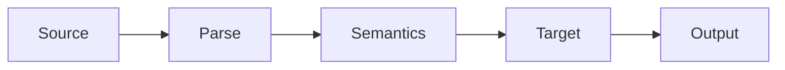

## Rendering lifecycle

Merman keeps parsing, semantic preparation, target selection, and output ownership inside one
operation boundary.

```mermaid
flowchart LR
    Source --> Parse --> Semantics --> Target --> Output
```
