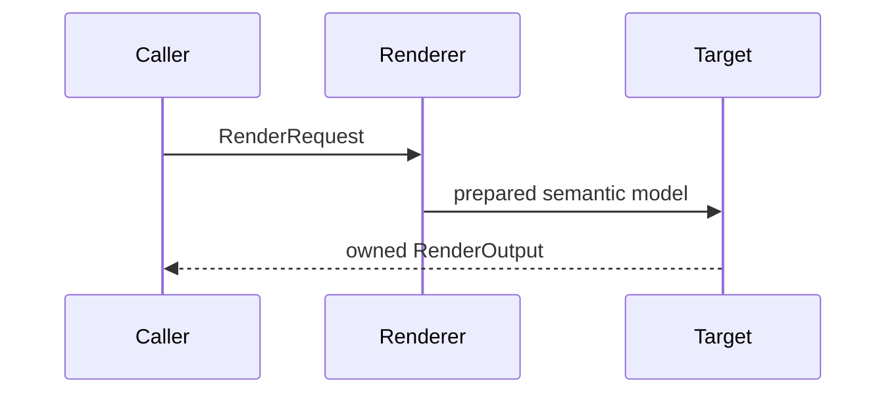

## Operation boundary

The rendering facade carries cancellation, resource limits, and deterministic host services from
the request through the selected output adapter.

```mermaid
sequenceDiagram
    participant Caller
    participant Renderer
    participant Target
    Caller->>Renderer: RenderRequest
    Renderer->>Target: prepared semantic model
    Target-->>Caller: owned RenderOutput
```
