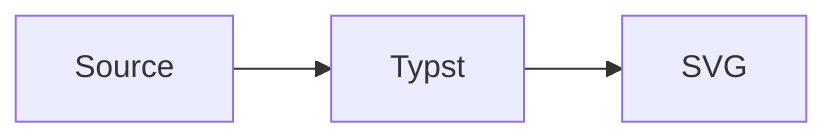

# merman

Render Mermaid diagrams in Typst with the `merman` Rust renderer.

`merman` embeds a WebAssembly plugin so Typst documents can render Mermaid diagrams directly during compilation while reusing the parser, layout, and SVG renderer from the broader `merman` project. This README covers the source tree for Typst package `0.4.0`, bundling Merman `0.8.0`. It requires Typst `0.15.0` or newer. Theme catalog discovery and authoring are unreleased ABI 3 additions and require a local package build; the `0.4.0` release baseline uses ABI 2.

## Quick Start

After `0.4.0` is available on Typst Universe, import it with:

```typst
#import "@preview/merman:0.4.0": mermaid
```

Before publication, build the package from this repository and pass its parent package root with
`typst compile --package-path <package-root> document.typ`; the import remains:

```typst
#import "@preview/merman:0.4.0": mermaid

#mermaid("
flowchart TD
  A[Write Mermaid] --> B[Render with merman]
  B --> C[Embed SVG in Typst]
")
```

Upgrading from `0.3.0`? Mermaid 12 changed the default layout of flowcharts and several other graph families to ELK. To keep Dagre, see [Choose a Layout](#choose-a-layout); no custom plugin build is needed.

## Version Mapping

| Typst package | merman source version | Typst plugin ABI | Notes |
| --- | --- | --- | --- |
| Development snapshot (package version pending) | `0.8.0` | `3` | Includes theme catalog discovery and authoring; requires a local build and Typst `--package-path`. |
| `0.4.0` | `0.8.0` | `2` | Mermaid 12.1 rendering; requires Typst `0.15.0` or newer. |
| `0.3.0` | `0.8.0-alpha.6` | `2` | Previous size-optimized WASM package. |
| `0.2.0` | Previously published source revision | `2` | Published registry channel; do not infer alpha.6 source provenance from this version. |
| `0.1.0` | `0.8.0-alpha.1` | `1` | Previous package API. |

The Typst package version tracks the `@preview/merman` wrapper API. The merman source version is the Rust workspace version used to build the package. The Typst plugin ABI tracks the WebAssembly export names and byte payload contracts; wrapper-only API breaks do not require an ABI bump when that plugin surface stays stable. Render option JSON follows shared binding options schema `3`, including top-level `theme` for compiled diagram themes, `site_config` for Mermaid configuration, `layout` for geometry, and `environment` for text measurement and math rendering. This options schema is independent from Typst plugin ABI 3 and native ABI 3.

The API and example sections below describe the source tree. Local builds retain the `0.4.0` import path until the next candidate version is assigned.

## Upgrading from 0.3.0

- The bundled renderer moves from Merman `0.8.0-alpha.6` to stable `0.8.0`, targeting Mermaid `12.1.0`. Agentflow and Usecase join the supported diagram families.
- Mermaid 12.0 changed layout and appearance defaults, and this package targets Mermaid 12.1. Flowchart, State, Class, ER, Requirement, Usecase, and Agentflow default to ELK; supported families adopt Redux/Neo presentation. Review existing diagrams for changed geometry, colors, and spacing. To request Dagre with the earlier theme and look, use `site-config: (layout: "dagre", theme: "default", look: "classic")`; this does not promise identical historical output.
- Replace family-local `defaultRenderer` settings with top-level `layout`. The Typst diagnostic analysis payload remains at schema `1`; analysis facts elsewhere in Merman use schema `2`. The operation result envelope, binding options schema, and Typst plugin ABI have separate versions.
- Embedded images still default to `resvg-safe`. Mathematical labels remain unsupported: this package does not include the `math` feature. `math-renderer: "ratex"` reports a missing capability.

The `0.4.0` release keeps the previous wrapper entry points. Layout uses deterministic Unicode-aware text measurement; it does not measure Typst's actual glyphs. See the [Merman 0.8.0 upgrade guide](https://github.com/Latias94/merman/blob/v0.8.0/docs/release/V070_TO_V080_UPGRADE_GUIDE.md) for renderer details.

## Examples

- [basic.typ](examples/basic.typ): minimal `#mermaid(...)` usage.
- [dagre.typ](examples/dagre.typ): use Dagre for individual diagrams and Mermaid raw blocks through a shared profile.
- [document-context.typ](examples/document-context.typ): opt-in document typography and width bridging.
- [elk.typ](examples/elk.typ): Mermaid's `layout: elk` frontmatter and the bundled ELK backend.
- [profile.typ](examples/profile.typ): reusable renderer settings shared by direct calls and raw blocks.
- [figure.typ](examples/figure.typ): Mermaid diagrams wrapped as Typst figures with reusable layout defaults.
- [raw-block.typ](examples/raw-block.typ): document-wide Mermaid fences with `show-mermaid-blocks`.
- [options.typ](examples/options.typ): themes, stable IDs, `mermaid-result`, SVG export, and placeholder errors.
- [print.typ](examples/print.typ): print-friendly white-background output.
- [presentation.typ](examples/presentation.typ): dark slide-sized output using a compiled theme preset.
- [svg-export.typ](examples/svg-export.typ): raw SVG and structured render payloads.
- [theme-authoring.typ](examples/theme-authoring.typ): materialize a shared definition, inspect support, and copy an editable preset recipe.

Package fixtures are grouped by behavior family under [tests](https://github.com/Latias94/merman/tree/main/distribution/typst/merman/tests): API, option normalization, render environments, context, errors, figures, raw blocks, README examples, historical issues, and visual smoke coverage. These links point to the source repository because examples and tests are not included in the published Typst package.

## Choose a Layout

The `0.4.0` package includes both Dagre and ELK. Mermaid 12.0 made ELK the default for Flowchart, State, Class, ER, Requirement, Usecase, and Agentflow when ELK is available; other diagram families keep their own layout behavior. `flowchart LR` sets the direction, not the layout algorithm.

To use Dagre for one diagram, pass Mermaid site configuration. This does not require rebuilding the plugin:

```typst
#mermaid(
  "flowchart LR\n  Source --> Layout\n  Layout --> SVG",
  site-config: (layout: "dagre"),
)
```

To use Dagre throughout a document, reuse a profile for direct calls and Mermaid raw blocks:

```typst
#import "@preview/merman:0.4.0": mermaid, mermaid-profile, show-mermaid-blocks

#let dagre = mermaid-profile(site-config: (layout: "dagre"))
#show raw.where(lang: "mermaid"): show-mermaid-blocks(profile: dagre)

#mermaid("flowchart LR\n  Source --> Layout", profile: dagre)
```

If a call also passes `site-config`, that dictionary replaces the profile's entire `site-config`; include `layout: "dagre"` in the direct dictionary to keep Dagre.

To also request the earlier appearance, add `theme: "default", look: "classic"` to the `site-config` dictionary. This does not guarantee pixel-identical output. To select ELK explicitly for one diagram, use Mermaid frontmatter:

```typst
#mermaid("---\nconfig:\n  layout: elk\n---\nflowchart LR\n  Source --> Layout\n  Layout --> SVG\n")
```

Use `site-config: (layout: "dagre")` to choose the Mermaid layout algorithm. The wrapper's top-level `layout:` parameter is a different setting for container geometry (such as `container_width`); it does not select Dagre or ELK. Choosing Dagre at runtime does not remove ELK from the bundled WASM.

ELK is an embedded, modified Rust translation of Eclipse ELK. The wrapper and Merman-authored code remain under `MIT OR Apache-2.0`; the ELK-derived portion is under `EPL-2.0`. This is a component-level license boundary, not a relicensing of the whole package. When redistributing the package or a derivative artifact, preserve `THIRD_PARTY_NOTICES.md` and the matching files under `THIRD_PARTY_LICENSES/`.

## Document Fonts

`mermaid(...)` is explicit-only by default. It does not automatically inherit the surrounding Typst font, text size, or container width.

Pass `document-context: true` to content-rendering APIs when you want opt-in document context bridging. This forwards the current Typst text font, text size, and available width as renderer options unless you override them directly.

```typst
#mermaid(source, document-context: true, width: 100%)

#show raw.where(lang: "mermaid"): show-mermaid-blocks(
  document-context: true,
  width: 100%,
)
```

You can also pass typography intent explicitly:

```typst
#mermaid(
  source,
  typography: (
    font: ("Source Sans 3", "Arial", "sans-serif"),
    size: "16px",
  ),
)
```

The typography size accepts CSS `px` strings, absolute Typst lengths, or numeric CSS pixels. Typst lengths are converted through the SVG 96-DPI coordinate system (`72pt == 96px`) so layout measurement and SVG output use the same numeric `font_size_px`. Typst font descriptors are projected to their ordered family names in `theme.spec.typography.default.font_stack`; descriptor `covers` constraints have no CSS or deterministic-measurer equivalent and are therefore not preserved.

This changes the SVG style intent sent to the headless renderer. It does not mean the Typst plugin measured the exact Typst font file. The Typst plugin uses the built-in `deterministic` measurer; browser-style host callbacks and Typst font-asset measurement are not available through this transport. Other transports may install a host callback when the final display stack is authoritative.

Check the compiled plugin capability surface with:

```typst
#let capabilities = merman-capabilities()
#capabilities.capabilities.text_measurement
```

## Profiles

Use `mermaid-profile(...)` for reusable diagram settings:

```typst
#let diagrams = mermaid-profile(
  typography: (
    font: ("Source Sans 3", "Arial", "sans-serif"),
    size: "16px",
  ),
  background: "#ffffff",
  theme-name: "base",
  figure: (
    placement: bottom,
    scope: "parent",
    caption-position: top,
    gap: 1em,
    outlined: false,
  ),
)

#mermaid(source, profile: diagrams, width: 100%)
#mermaid-figure(source, profile: diagrams, caption: [System flow], width: 100%)
```

Profiles work with `mermaid(...)`, `mermaid-figure(...)`, `mermaid-svg(...)`, `mermaid-result(...)`, `analyze-mermaid(...)`, and raw-block show rules. The optional `figure` section is consumed only by `mermaid-figure(...)`; it does not change raw SVG rendering or non-figure image calls.

For normal documents, start with `width`, `theme-name`, `theme-variables`, `theme-preset` or `diagram-theme`, `background`, `typography`, `document-context`, and reusable `profile` values. Lower-level renderer fields remain available when you need parity debugging or deterministic fixture control, but they are not the main authoring path.

`base-theme` is a lower-priority compatibility alias for `theme-name`; prefer `theme-name` in new documents. When both are supplied, `theme-name` wins.

Raw `options` always wins. Without it, precedence is field-specific and deterministic:

- site config: profile full object, profile `theme-name`/`theme-variables`, direct full object, direct `theme-name`/`theme-variables`;
- environment: profile full object, profile measurement/math shorthands, direct full object, direct measurement/math shorthands;
- compiled diagram theme: direct `diagram-theme`/`theme-preset` replaces the profile selection; document context, profile typography, and direct typography merge into `theme.spec.typography.default` in that order;
- layout: profile layout followed by container shorthands, unless a direct full `layout` object is present, in which case that object replaces the layout shorthands;
- scalar fields: direct value, profile value, package or renderer default.

`theme-name` and `theme-variables` replace the Mermaid `theme` or `themeVariables` field at their layer; they do not deep-merge individual theme-variable keys. `theme-preset` selects one complete compiled preset, so it cannot be combined with `typography` or `document-context`; use `diagram-theme` when typography must be composed into an explicit spec.

A direct `site-config` object replaces the profile `site-config` object; use the direct `theme-name` and `theme` shorthands when you want the documented theme-layer precedence instead of replacing the full object.

A profile that contains raw `options` is an opaque binding-options bundle: it bypasses the profile and call-site shorthands. Pass a direct raw `options` dictionary to replace that bundle, or use the structured profile fields when you want field-level overrides.

## Raw Blocks

Use `show-mermaid-blocks` with Typst's `raw.where` selector:

````typst
#import "@preview/merman:0.4.0": show-mermaid-blocks

#show raw.where(lang: "mermaid"): show-mermaid-blocks(width: 100%)


````

Raw-block show rules default to `error-mode: "placeholder"`, so one invalid fence stays visible as a marked block instead of aborting the whole document. Pass `error-mode: "panic"` when a document-wide rule must fail the compile on the first render error.

Avoid setting a fixed `id` in a document-wide raw-block show rule unless the document has only one Mermaid block; otherwise multiple diagrams will share the same SVG id.

For document-context-aware rendering, pass `document-context: true`. This reads the current Typst text font, text size, and container width inside `context`, then forwards them to the renderer.

```typst
#import "@preview/merman:0.4.0": show-mermaid-blocks

#show raw.where(lang: "mermaid"): show-mermaid-blocks(
  document-context: true,
  width: 100%,
)
```

## API Migration

This refactor intentionally removes compatibility-only context wrappers:

```typst
// Old:
#mermaid-context(source, width: 100%)
#show raw.where(lang: "mermaid"): show-mermaid-blocks-context(width: 100%)

// New:
#mermaid(source, document-context: true, width: 100%)
#show raw.where(lang: "mermaid"): show-mermaid-blocks(
  document-context: true,
  width: 100%,
)
```

`context` is a Typst keyword, so the public parameter is named `document-context`.

The current development package moves measurement and math selection to the binding options schema `3` render environment:

```typst
#mermaid(source, text-measurement: "deterministic", math-renderer: "none")
#mermaid(
  source,
  environment: (
    text_measurement: "deterministic",
    math_renderer: "none",
  ),
)
```

The removed layout fields are rejected; they are not translated through a compatibility path.

The prerelease presentation aggregate was also removed rather than aliased:

```typst
// Old and rejected:
#mermaid(source, presentation-profile: "merman-modern")
#mermaid(source, host-theme: (appearance: "dark"))

// Select a compiled diagram theme:
#mermaid(source, theme-preset: "ayu-dark")

// Or provide one complete DiagramThemeSpec body:
#mermaid(
  source,
  diagram-theme: (
    typography: (
      default: (font_stack: ("Inter", "Arial"), font_size_px: 16),
    ),
  ),
)
```

The old Typst `theme` shorthand for Mermaid variables is now named `theme-variables`. `theme-name` still selects Mermaid's own theme through `site_config.theme`; neither field selects a compiled Merman diagram theme.

## API

### `mermaid(source, ..)`

Renders a Mermaid string or raw block as an SVG image.

Common parameters:

- `width`, `height`, `fit`, `alt`: forwarded to Typst's `image`.
- `scale`: wraps the rendered image with Typst `scale`; accepts ratios such as `120%` or numbers such as `1.2`.
- `document-context`: `false` by default. Set to `true` to inherit Typst text font, text size, and finite available width for image rendering. An auto-width page reports an infinite outer width, so Merman keeps its renderer default instead of serializing infinity.
- `profile`: reusable options produced by `mermaid-profile(...)`.
- `typography`: high-level font and size intent projected to `theme.spec.typography.default`.
- `theme-preset`: compiled Merman diagram-theme preset, such as `"editor-dark"` or `"ayu-dark"`.
- `diagram-theme`: one complete `DiagramThemeSpec` body, wrapped as top-level `theme.spec`.
- `id`: stable SVG root id. `diagram-id` is the lower-level binding name; precedence is direct `diagram-id`, direct `id`, profile `diagram-id`, then profile `id`.
- `background`: SVG root background color, mapped to `svg.root_background_color`.
- `theme-name`: Mermaid theme name, such as `"base"` or `"dark"`.
- `theme-variables`: Mermaid `themeVariables`.
- `error-mode`: `"panic"` by default. Use `"placeholder"` or `"text"` to show diagram errors in the document instead of failing the Typst compile. These modes handle structured errors returned by `merman`; missing wasm files, Typst plugin loading failures, invalid `error-mode` values, and SVG image decoding failures still fail the Typst compile.

This entry point is explicit-only unless `document-context: true` is set.

Advanced renderer parameters:

- `pipeline`: `"resvg-safe"` by default for embedded Typst images. Use `"parity"` when you need Mermaid-like SVG DOM output, or `"readable"` for inline SVG inspection.
- `site-config`: bounded Mermaid site config object. General bindings reject host-owned `themeCSS` and `secure`; use the typed theme inputs for appearance instead.
- `layout`: full binding layout object for container geometry. This overrides the container shorthands.
- `container-width`, `container-height`: shorthands for `layout.container_width` and `layout.container_height`.
- `environment`: full binding render-environment object. Use `text_measurement` and `math_renderer` fields when composing options directly.
- `text-measurement`, `math-renderer`: shorthands for `environment.text_measurement` and `environment.math_renderer`. Direct values override `environment`, which overrides profile environment values.
- `drop-native-duplicate-fallbacks`: SVG post-processing shorthand for removing duplicate native fallback text.
- `fixed-today`, `fixed-local-offset-minutes`: deterministic date controls for date-sensitive diagrams.
- `options`: escape hatch; when present, it supplies the Rust binding options and overrides shorthand parameters. It does not bypass general binding validation: `svg.scoped_css`, `svg.scopedCss`, `svg.css_override_policy`, and `svg.cssOverridePolicy` remain rejected because raw CSS and cascade policy belong to trusted Rust or native CLI hosts. The plugin also reserves the constrained `resources` ceiling; documents may provide stricter limits, while looser profiles or overrides return a structured options error.

Typst does not expose the removed `scoped-css` or `css-override-policy` high-level controls. Use `diagram-theme`, `theme-variables`, or `background` for document-owned presentation needs.

Use `typography` for Typst-facing font intent: it accepts Typst font descriptors, absolute Typst lengths, and numeric or string CSS pixels. It is projected into the typed `theme.spec.typography.default` object rather than a raw CSS or host-theme escape hatch.

### `mermaid-profile(..)`

Returns a reusable Typst settings dictionary. Profiles normalize into the same binding options used by direct parameters, so they do not create a second rendering path. The removed `presentation-profile`, `host-theme`, `merman-modern`, `scoped-css`, and `css-override-policy` inputs are not compatibility aliases; handwritten dictionaries using a removed field fail with a migration diagnostic.

### `mermaid-figure(source, ..)`

Renders a Mermaid diagram and wraps it in a Typst `figure`.

Use `document-context: true` when the figure should opt into the same document-context bridge as `mermaid(...)`.

Figure layout parameters are forwarded to Typst's native `figure`: `placement`, `scope`, `supplement`, `numbering`, `gap`, and `outlined`. Use `caption-position` and `caption-separator` when you need a top caption or document-specific caption separator. Direct figure parameters override `profile.figure` defaults.

### `mermaid-svg(source, ..)`

Returns the rendered SVG as a string instead of embedding it as an image.

This value-returning API does not enter Typst `context`; pass `typography`, `theme-preset`/`diagram-theme`, `layout`, or `container-width` explicitly when exporting SVG text. Rendering failures panic; use `mermaid-result(...)` when the document needs programmatic error handling.

### `mermaid-result(source, ..)`

Returns a structured render payload:

```typst
#let result = mermaid-result("flowchart TD\nA --> B")
#if result.ok {
  result.svg
} else {
  result.message
}
```

The result also includes `operation`, `kind`, and `capability_id`. On failure, these fields let callers distinguish a missing compiled capability from invalid input or a general render error without parsing `message`.
Resource-limit failures additionally expose `details.resource` with the stable limit id, profile, and actual/max values.

### `analyze-mermaid(source, ..)`

Returns the canonical diagnostic analysis schema 1 payload produced by the Rust bindings:

```typst
#let analysis = analyze-mermaid("flowchart TD\nA --> B")
#analysis.version
#analysis.valid
#analysis.summary.errors
#analysis.diagnostics
```

### Theme authoring

`materialize-theme`, `describe-theme-support`, and `export-theme-preset` are thin projections of
the shared Rust-owned theme operations. The Typst wrapper encodes inputs and unwraps successful
results; it does not expand tokens or infer support locally.
`mermaid-theme-definition` composes materialization and rendering in one call, so a document can
render a shared definition without manually carrying an intermediate complete spec.
Like `mermaid`, it accepts `document-context: true` when the rendered diagram should inherit the
current Typst text style and available width.

These functions remain Alpha while the C7a authoring qualification gate is open. Their presence in
Typst plugin ABI 3 makes the callable transport explicit; it is not a stability commitment for the
theme authoring payloads.

```typst
#let definition = (
  authoring_schema_version: 1,
  expansion_version: 1,
  tokens: (canvas: "#0f172a", text: "#e5e7eb", accent: "#38bdf8"),
)
#let materialized = materialize-theme(definition)
#mermaid-theme-definition(
  "flowchart LR\nA --> B",
  definition,
  document-context: true,
  width: 80%,
)
#let support = describe-theme-support((
  schema_version: 1,
  family: "sequence",
  output: "standalone-svg",
  subject: (kind: "base-typography", property: "font-stack"),
))
#let preset = export-theme-preset("editor-dark")
```

Each function returns the canonical result dictionary on success. On failure it returns the same
structured operation envelope used by rendering, including `ok`, `code_name`, `kind`, `message`,
and an optional `capability_id`. The plugin always applies its constrained resource policy; caller
options may tighten that policy but cannot loosen it.

Invalid Mermaid source remains a schema-1 analysis payload with `valid: false`; transport, options, and missing-capability failures use the structured operation envelope instead.

### `theme-catalog()` (development snapshot)

Returns the shared theme catalog for the installed plugin, including available presets, semantic
selectors, supported outputs, and effective constrained theme resource limits. The catalog remains
Alpha; an available preset with empty `qualified_cells` has no qualified artifact scope.

```typst
#let catalog = theme-catalog()
#let preset = export-theme-preset(catalog.presets.at(0).id)
```

Success returns catalog schema 3. Failure returns the structured operation envelope with operation
`theme-catalog`. Discovery takes no options and describes the plugin's fixed default ceiling;
individual authoring calls may tighten that ceiling.

### `merman-capabilities()`

Returns the compiled plugin capability payload, including the current text measurement boundary:

```typst
#let capabilities = merman-capabilities()
#capabilities.capabilities.text_measurement.provider_ids
```

The flat catalog reports the artifact's current capability, output, operation, registry, and resource sets. The plugin independently applies a fixed constrained resource ceiling to every render, analysis, and theme-authoring operation. Raw binding options may tighten individual resource limits but cannot loosen or silently replace that transport-owned policy. The options root and any `analysis` or `merman` wrapper must be JSON objects; malformed wrapper values return a structured options error before an operation begins.

### `show-mermaid-blocks(..)`

Returns a raw block show handler. This is the shortest way to enable Mermaid fences across a Typst document:

```typst
#show raw.where(lang: "mermaid"): show-mermaid-blocks(width: 100%)
```

## Development

The Typst package uses its own version track and is not locked to the Rust crate version. The embedded WebAssembly plugin also has a separate ABI version, documented in the Version Mapping table, for exported function and payload compatibility.

Build the publish Typst package locally:

```sh
cargo run --locked -p xtask -- build-typst-package --profile publish
```

The release build requires `wasm-tools` and Binaryen `wasm-opt version 131`. The package builder applies a pinned `wasm-opt -Oz` pass before stripping custom sections and records both tool versions in the artifact manifest.

The package is written to:

```sh
dist/typst/merman/0.4.0
```

The source package carries the examples shown above so they remain readable in the package review. `typst.toml` excludes `examples/**` from the runtime download; tests stay in the Merman source repository and are not bundled.

For a manual local install, copy that directory to `<package-root>/preview/merman/0.4.0` and pass the parent directory to Typst:

```text
<package-root>/preview/merman/0.4.0/typst.toml
<package-root>/preview/merman/0.4.0/lib.typ
<package-root>/preview/merman/0.4.0/merman_typst_plugin.wasm
```

```sh
typst compile --package-path <package-root> document.typ
```

The `typst-package-smoke` command creates this preview layout automatically in a temporary directory.

For local `@preview` smoke tests, copy the built package under a preview namespace package path and compile with `--package-path`:

```sh
cargo run --locked -p xtask -- typst-package-smoke --profile publish --skip-wasm-build
```

Use an explicit Typst binary when the CLI is downloaded outside `PATH`:

```sh
cargo run --locked -p xtask -- typst-package-smoke --profile publish --skip-wasm-build --typst /path/to/typst
```

Each smoke run owns an independent temporary directory under `target/typst-package-smoke/`. Positive fixtures preserve their nested output paths, and `tests/compile-fail/` fixtures must fail with the diagnostic declared by their adjacent `.error.txt` file. Successful runs remove their artifacts by default; pass `--keep-artifacts` to retain the run directory for inspection.

The build verifies artifact-recipe provenance from its private build directory, then stages only the
runtime wrapper, WASM, examples, and legal materials. The transaction snapshots source bytes,
verifies the complete file shape and contents, and rechecks live source identity immediately before
atomically replacing the version directory; build receipts are not included in the published package.

The sole package profile, `publish`, enables SVG rendering, analysis, the complete Mermaid language catalog, and the Cytoscape and ELK layout backends. There are no alternate bridge-only or SVG-only package profiles. ASCII, PNG, JPEG, and PDF are not compiled because this wrapper exposes no operation for those outputs. Maintainer experiments use direct Cargo features and do not create another package identity or release recipe.

## Current Limits

- Output is SVG embedded through Typst `image`; diagrams are not Typst-native vector elements.
- Font family and size can be forwarded as style intent, but exact Typst font glyph measurement is not automatic.
- RaTeX math rendering is not available in the Typst plugin. Its current upstream closure depends on browser system-font discovery; the capability will remain closed until a zero-browser-import implementation passes admission.
- Browser-only Mermaid interactions such as script callbacks and popup behavior are not expected to work in static Typst output.
- The package is smoke-tested with Typst 0.15.0. Typst 0.15 HTML export remains experimental and is not a package promise here.
- The `readable` and `parity` pipelines can embed SVG structures that Typst warns about; `resvg-safe` is the intended embedded-image path for package output.

## License

The wrapper and Merman-authored code are available under either MIT or Apache-2.0. The embedded ELK-derived implementation is a separate component under EPL-2.0; it does not relicense the rest of the package. `THIRD_PARTY_NOTICES.md` records the exact source revision, relationship, and scope for ELK and the other embedded or translated components, while `THIRD_PARTY_LICENSES/` contains their applicable legal files. Preserve these materials when redistributing the package or a derivative artifact.

The machine-readable Cargo dependency report remains in the source repository's release evidence instead of being duplicated in the downloaded Typst package.
