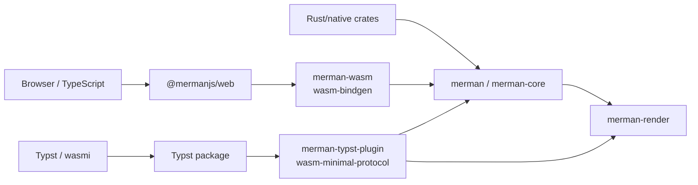

# ADR 0069: WASM Package Surface Semantics

- Status: accepted
- Date: 2026-06-10
- Last amended: 2026-07-18

## Context

The WASM feature-surface slimming lane split concerns that were previously easy to conflate:

- browser WebAssembly delivered through `wasm-bindgen` and the `@mermanjs/web` TypeScript package;
- Typst/pure WebAssembly delivered through `wasm-minimal-protocol` and a `wasmi` host;
- Cargo feature profiles for full Mermaid compatibility, host capabilities, and output capabilities.

`merman-wasm` remains a browser/JavaScript transport crate. It is not a generic "runs in every
WASM host" artifact, because wasm-bindgen glue, browser imports, and TypeScript package helpers are
part of its intended contract.

At the same time, `merman-typst-plugin` now proves the Typst transport boundary: the default render
artifact imports only the two `typst_env` wasm-minimal-protocol functions, exports `memory`, and
passes a wasmi smoke call returning SVG JSON.

## Decision

Keep the browser, Rust/native, and Typst WASM surfaces separate for release semantics.

```mermaid
flowchart LR
    Rust["Rust/native crates"] --> Core["merman / merman-core"]
    Browser["Browser / TypeScript"] --> Web["@mermanjs/web"]
    Web --> WasmBindgen["merman-wasm<br/>wasm-bindgen"]
    Typst["Typst / wasmi"] --> TypstPkg["Typst package"]
    TypstPkg --> TypstPlugin["merman-typst-plugin<br/>wasm-minimal-protocol"]
    Core --> Render["merman-render"]
    WasmBindgen --> Core
    TypstPlugin --> Core
    TypstPlugin --> Render
```

1. `@mermanjs/web` remains one npm package with capability-specific public subpaths.
   - `platforms/web/web-surface-descriptor.json` is the machine-readable owner of browser preset
     features/capabilities and public entry/preset/package-directory/runtime-profile mappings.
     Build and release tools consume it as structured data rather than parsing JavaScript source.
   - The default entry point publishes `browser-full`.
   - `./core`, `./render`, `./render-only`, `./ascii`, `./editor`, and `./full` each bind to the
     matching generated WASM artifact and omit unsupported runtime wrappers from their TypeScript
     surface.
   - `browser-editor` contains the full diagram catalog, analysis, and `merman-editor-core`
     language intelligence without SVG, ASCII, host, or ELK dependencies. It is the browser Worker
     surface described by ADR-0074.
   - `browser-full-no-elk` and `browser-ratex-math` remain source/CI evidence presets rather than
     public wrapper subpaths.
   - Pure `./catalog`, `./svg-safety`, and `./text-measurement-abi` helpers do not initialize WASM.
   - `bindingCapabilities()` is the runtime discovery API for the active artifact. Package names
     are not a substitute for capability checks when consumers supply a custom generated artifact.

2. `merman-wasm` remains explicitly browser/JS WASM.
   - It may use wasm-bindgen, serde-wasm-bindgen, and browser-compatible glue.
   - It must not be documented as the Typst or pure-WASM surface.

3. `merman-typst-plugin` owns Typst-compatible WASM.
   - Package builds must pass the `typst-wasm` import/export gate and the wasmi smoke gate.
   - The default plugin artifact enables `render`.
   - `--no-default-features` is the bridge-only protocol artifact.
   - `core-full`, `core-host`, and `ratex-math` are opt-ins; Typst package builds should not enable
     `core-host`.

4. Rust/native defaults stay compatibility-oriented.
   - This ADR does not change default feature behavior for normal Rust, CLI, browser, or native
     binding consumers.
   - Constrained hosts must opt into no-default feature profiles intentionally.

## Success Metrics

| Metric | Target | Measurement |
| --- | --- | --- |
| Browser publication default | Default npm entry uses `browser-full` | `npm run prepack --prefix platforms/web` rejects a non-full default artifact unless `MERMAN_WEB_ALLOW_NON_DEFAULT_PRESET=1` |
| Public browser subpaths | Every wrapper has matching TS, wasm-bindgen, WASM, preset metadata, exports, and size evidence | package contract/smoke checks, `SURFACES.json`, and `xtask wasm-size-matrix` |
| Editor Worker surface | `./editor` exposes parser-backed language APIs on ABI 2/editor schema 1 without render/ASCII/ELK | Web contract tests plus Playground Worker browser tests |
| Browser preset evidence | All named browser presets build and report accurate capabilities | `npm run build:surfaces --prefix platforms/web`, package smoke, and preset manifests |
| Runtime capability discovery | Active artifact reports compiled capabilities | `bindingCapabilities()` returns booleans and legacy artifacts fall back to full capabilities |
| Typst import boundary | Only the two `typst_env` protocol imports are present | `cargo run -p xtask -- profile-budget check-wasm --profile typst-wasm --wasm <plugin.wasm>` |
| Typst execution boundary | Plugin can be loaded by a Typst-compatible host and return SVG JSON | `cargo run -p xtask -- typst-plugin-smoke --wasm <plugin.wasm>` |
| Surface documentation | Browser and Typst/pure-WASM surfaces are not conflated | `docs/release/PACKAGE_SURFACES.md`, `docs/FEATURES.md`, and README surface sections |

## Alternatives Considered

### Option A: Multiple npm packages

Publish `@mermanjs/web-core`, `@mermanjs/web-render`, and `@mermanjs/web-editor` as independent
packages.

- Pros: package installation makes the selected dependency posture explicit.
- Cons: multiplies versions, provenance, release workflows, and shared TypeScript type ownership.
- Decision: rejected. Capability-specific subpaths provide small artifacts while one npm package
  keeps versioning and shared contract generation atomic.

### Option B: Make the slim browser artifact the npm default

Change `@mermanjs/web` to publish `browser-render` or `browser-core` by default.

- Pros: smaller default download.
- Cons: breaking behavior for callers using ASCII or full-core behavior; surprises users who expect
  existing default APIs to work.
- Decision: rejected. `browser-full` remains the default until a versioned migration is designed.

### Option C: Treat `merman-wasm` as the generic WASM crate

Make `merman-wasm` cover browser, pure-WASM, and Typst by feature switches.

- Pros: fewer crates and fewer names.
- Cons: conflates wasm-bindgen browser glue with Typst's import contract; makes import regressions
  harder to reason about; weakens package documentation.
- Decision: rejected. `merman-wasm` is browser-specific; `merman-typst-plugin` is Typst-specific.

### Option D: Delay Typst surface documentation until full package publication

Keep `merman-typst-plugin` as an internal probe until the Typst package wrapper is complete.

- Pros: avoids documenting an experimental package surface too early.
- Cons: hides an important compatibility boundary; makes release gates less visible; risks future
  browser-WASM changes regressing Typst import compatibility.
- Decision: rejected. Document the transport as experimental and gate it now, while keeping Typst
  registry publication separate.

## Risks And Mitigations

| Risk | Severity | Likelihood | Mitigation |
| --- | --- | --- | --- |
| Users assume every named preset is a public npm subpath | Medium | Medium | Generate the exact subpath list from release/package manifests; document evidence-only presets separately |
| A subpath ships the wrong WASM capability set | High | Low | Bind wrapper, preset metadata, generated declarations, smoke, ABI, and size budget in one release gate |
| Editor helpers drift from LSP/parser semantics | High | Low | Keep behavior in `merman-editor-core`; run it through the dedicated ABI-2/schema-1 WASM Worker rather than TypeScript heuristics |
| Typst docs imply full package readiness from transport smoke | Medium | Medium | Label Typst package publication as manual/future; document smoke as transport validation only |
| Browser changes reintroduce JS imports into Typst builds | High | Low | Keep `profile-budget check-wasm --profile typst-wasm` and `typst-plugin-smoke` as release gates |
| Feature defaults become unclear across crates | Medium | Medium | Record defaults in `docs/FEATURES.md`, README, and package surface docs |
| Source-build preset sizes are compared across unlike surfaces | Low | Medium | Use `xtask wasm-size-matrix` with explicit `browser` and `typst` surfaces |

## Consequences

- Existing browser and Rust/native users keep compatible defaults.
- Browser consumers can choose a capability-specific public subpath without splitting package
  versioning across multiple npm names.
- Playground language intelligence can load the editor-only Worker artifact instead of duplicating
  the full renderer artifact.
- Typst work has a concrete, testable transport gate before registry packaging.
- Future independent browser packages, a changed default preset, or a reusable public engine/session
  API require a new ADR or migration plan.
- Playground runtime, BFCache, Compare realms, and benchmark ownership remain application concerns
  defined by ADR-0074; they are not exported from `@mermanjs/web`.
