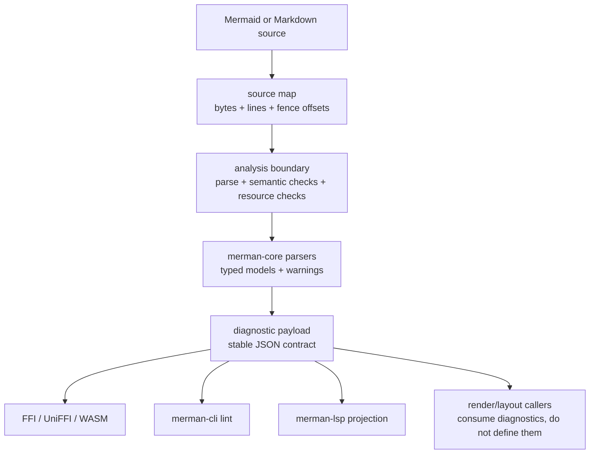

# ADR 0070: Diagnostics-First Analysis Contract

- Status: accepted
- Date: 2026-06-23

## Context

Merman exposes parsing, layout, rendering, editor services, and validation through Rust, WASM, FFI,
UniFFI, CLI, and LSP surfaces. The older validation API answered whether a source could pass the
shared render-backed parse path, but it did not expose a normalized diagnostic model with source
spans, severity, rule identity, or editor-oriented metadata.

That is enough for smoke validation, but it is not enough for linting, Markdown integrations,
continuous integration, and the language server. Those products need a first-class analysis
boundary:

- deterministic diagnostics that do not require SVG rendering;
- source locations that can be projected into Markdown fences, CLI output, and LSP ranges;
- warnings and compatibility notes that are not fatal parse errors;
- a shared JSON contract that all bindings can return without wrapper-specific interpretation;
- parity evidence against the pinned Mermaid source without launching Mermaid JS at runtime.

The external `mermaid-lint` project demonstrates the product shape: fast Rust/WASM validation,
Markdown/editor integrations, and a JavaScript fallback path for Mermaid-authoritative behavior.
Merman has a different constraint. It is a headless Rust reimplementation, so Mermaid JS should be
used as source and parity evidence, not as a production fallback inside the lint or LSP path.

## Decision

Introduce a diagnostics-first analysis contract and make it the canonical validation surface for
bindings, CLI linting, Markdown scanning, and LSP diagnostics.



The contract has these rules:

1. Analysis is a separate product boundary from rendering.
   - The default analyzer must build without `merman-render`.
   - Optional layout or render checks may be added later, but they must be profile-controlled and
     use the same diagnostic payload shape.
   - Rendering may surface analysis diagnostics, but render success is not the definition of
     validation success.

2. `analyze_json` becomes the canonical binding payload.
   - Rust binding facade, C ABI, UniFFI, WASM, TypeScript, and platform wrappers should converge on
     one JSON payload.
   - Low-level C ABI and WASM transports should return UTF-8 JSON bytes/strings; higher-level
     wrappers may add typed helpers after the JSON contract is stable.
   - Callers must ignore unknown fields and tolerate missing optional fields.

3. `validate_json` remains a compatibility projection during alpha migration.
   - Existing callers keep top-level `valid`, `error`, `message`, `code`, and `code_name` fields.
   - Once analysis exists, validation should be derived from diagnostics instead of calling a
     render-owned parse path directly.
   - New callers should prefer `analyze_json`.

4. Diagnostics carry stable identity and source location.
   - Required fields: `id`, `severity`, `category`, and `message`.
   - Severity values are `error`, `warning`, `info`, and `hint`.
   - Categories start with `parse`, `semantic`, `config`, `resource`, `compatibility`, `layout`, and
     `render`.
   - Spans are optional but, when present, byte offsets are canonical. Line/column and LSP UTF-16
     ranges are derived views.
   - Parser failures should use structured parse diagnostics when the parser can prove an exact
     token span or insertion point. Analysis, not LSP or UI code, decides how to merge recovered
     parser facts and when a fallback or whole-source span is honest. LSP Problems use the string
     diagnostic rule id as `Diagnostic.code`; numeric status codes remain payload metadata.

5. Source mapping is part of analysis, not each wrapper.
   - Plain `.mmd` input uses the whole document as diagram source.
   - Markdown/MDX scanning records fence offsets and maps diagnostic ranges back to host-document
     ranges.
   - Whole-diagram or whole-fence spans are reserved for source-wide conditions or parser failures
     that genuinely do not expose a narrower deterministic location.

6. Mermaid JS remains parity evidence.
   - The pinned `repo-ref/mermaid` source and generated fixtures guide semantics, error behavior,
     supported rules, and message quality.
   - Production analysis must not shell out to Node or invoke Mermaid JS as an authoritative
     fallback unless a future ADR explicitly changes the runtime boundary.

The canonical JSON shape starts as:

```json
{
  "version": 1,
  "valid": false,
  "summary": {
    "errors": 1,
    "warnings": 0,
    "infos": 0,
    "hints": 0
  },
  "source": {
    "kind": "diagram",
    "path": null,
    "diagram_index": null,
    "language": "mermaid"
  },
  "diagnostics": [
    {
      "id": "merman.parse.no_diagram",
      "severity": "error",
      "category": "parse",
      "message": "no Mermaid diagram detected",
      "code": 4,
      "code_name": "MERMAN_NO_DIAGRAM",
      "diagram_type": null,
      "span": {
        "byte_start": 0,
        "byte_end": 0,
        "line": 1,
        "column": 1,
        "end_line": 1,
        "end_column": 1,
        "lsp_range": {
          "start": { "line": 0, "character": 0 },
          "end": { "line": 0, "character": 0 }
        }
      },
      "related": [],
      "help": null
    }
  ]
}
```

## Success Metrics

| Metric | Target | Measurement |
| --- | --- | --- |
| Analysis without rendering | The default analysis crate/path builds without `merman-render` | Cargo feature check for the analysis package or facade |
| Binding convergence | FFI, UniFFI, WASM, and TypeScript expose `analyze_json` or equivalent wrapper | Binding smoke tests call analysis and assert the shared JSON shape |
| Validation migration | Existing validation tests keep passing while validation is derived from diagnostics | Current validate fixtures plus new projection snapshots |
| CLI lint readiness | `merman-cli lint` reports file, line, column, severity, id, and message for `.mmd`, Markdown, and MDX | CLI integration tests with fixture snapshots |
| LSP projection | Diagnostics convert to LSP `Diagnostic` without reparsing or deduplicating in the adapter | Unit tests for byte/line/UTF-16 range mapping, string rule-id codes, and pull/push parity |
| Mermaid parity discipline | Diagnostic behavior for parser errors and supported warnings is covered by upstream-derived fixtures | Snapshot tests tied to pinned Mermaid fixtures/source references |

## Alternatives Considered

### Option A: Extend `validate_json` only

Add diagnostics fields to the current validation payload and keep validation as the primary name.

- Pros: smallest public API change and fewer new methods.
- Cons: keeps the product framed as a boolean check, encourages render-path coupling, and makes LSP
  and lint callers depend on a legacy shape.
- Decision: rejected. `validate_json` should become a compatibility projection, not the canonical
  product boundary.

### Option B: Use Mermaid JS as a runtime fallback

Follow the common linter pattern of using Rust/WASM first and then invoking Mermaid JS for
authoritative fallback behavior.

- Pros: faster route to Mermaid-compatible pass/fail behavior and error messages.
- Cons: violates Merman's headless Rust boundary, requires Node or browser runtime availability,
  complicates FFI/mobile/offline hosts, and can hide divergence instead of fixing it.
- Decision: rejected. Mermaid JS remains source and fixture evidence.

### Option C: Build the LSP first

Create a language server now and let its diagnostic model drive lower-level APIs.

- Pros: proves the editor use case immediately.
- Cons: risks baking transport-specific LSP assumptions into core analysis; delays reusable CLI,
  CI, and binding diagnostics.
- Decision: rejected. Build the diagnostic core first, then adapt it to LSP.

### Option D: Create a separate `merman-lint` product first

Ship a standalone linter before changing the shared bindings.

- Pros: product can iterate quickly without disturbing current render APIs.
- Cons: risks duplicate parsers/source mapping, wrapper drift, and a second public diagnostic
  schema that later has to be merged back.
- Decision: deferred. A linter can be a CLI/product surface over the shared analysis contract.

## Risks And Mitigations

| Risk | Severity | Likelihood | Mitigation |
| --- | --- | --- | --- |
| Diagnostic schema churn breaks early host integrations | Medium | High | Keep `version`, tolerate unknown fields, document alpha status, and snapshot public payloads |
| Early spans are too coarse for editors | Medium | High | Make spans optional, use whole-fence fallbacks, then improve family-local parsers incrementally |
| Analysis grows render dependencies again | High | Medium | Add feature gates and build checks proving the default analyzer is render-free |
| Wrapper APIs drift from the shared payload | Medium | Medium | Keep binding smoke tests over identical fixture JSON and document C ABI as the low-level anchor |
| Mermaid parity diverges because there is no JS fallback | High | Medium | Tie diagnostics to pinned source evidence and upstream-derived fixtures instead of runtime fallback |
| Resource checks are duplicated between render and analysis | Medium | Medium | Move shared budget enforcement into the analysis-facing facade and let render consume the same result |

## Consequences

- Lint and LSP work reuse the same source-map and diagnostic model.
- Binding packages gain a richer payload without changing every host around a Rust enum.
- Existing `validate` users have a migration bridge during alpha.
- Parser families need incremental span and warning upgrades.
- Documentation and tests must distinguish implemented APIs from reserved protocol extensions:
  `textDocument/diagnostic` pull is implemented, but `workspace/diagnostic` remains unimplemented
  until unopened workspace-file scanning exists.

## Ongoing Governance

1. Keep LSP, editor-core, and VS Code projection layers free of semantic diagnostic deduplication
   or recovered-parser message policy.
2. Expand parser-family span coverage with source-backed exact spans or insertion points; keep
   named fallback diagnostics for families whose parser path cannot yet prove a narrower location.
3. Do not implement `workspace/diagnostic` until unopened workspace-file scanning has a documented
   owner, cache model, and test coverage.
4. Add new quick fixes only through deterministic `DiagnosticFix` metadata emitted by analysis
   rules, with LSP rejecting unsafe or overlapping edit sets before projection.
