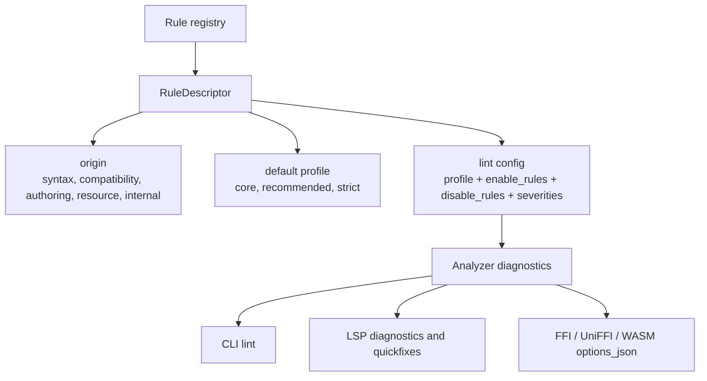

# ADR 0072: Lint Rule Governance

- Status: accepted
- Date: 2026-06-26

## Context

Merman now has a diagnostics-first analysis boundary, CLI linting, LSP diagnostics, and fix-backed
code actions. That makes rule identity part of the product contract. A lint rule can influence how
users write Mermaid, so the rule catalog must not imply that Merman is the Mermaid project or that
Merman authoring preferences are official Mermaid standards.

The risk is highest for rules that are useful but stylistic. For example, Mermaid accepts a
flowchart header without an explicit direction and Merman can offer a safe quickfix to insert
`TB`. That is a good authoring recommendation, but it is not a Mermaid syntax error.

## Decision

Classify every analysis rule by origin and default profile. Merman will not use a `mermaid.*`
namespace unless a future upstream-owned integration explicitly grants that authority.

The governance rules are:

1. Rule IDs stay under `merman.*`.
2. Merman authoring recommendations use the `merman.authoring.*` namespace.
3. `RuleDescriptor.origin` records whether a rule is Mermaid syntax, Mermaid compatibility,
   Merman authoring, Merman resource policy, or Merman internal infrastructure.
4. Mermaid syntax and compatibility rules require durable evidence from at least one of:
   pinned Mermaid source identified by a public commit URL, upstream docs, upstream-derived
   fixtures, or a reproducible compatibility test. Local upstream checkouts may be used for
   development research, but public rule metadata and documentation must not cite local paths.
5. Merman authoring rules may be useful and fix-backed, but they must not be presented as official
   Mermaid requirements.
6. The default `core` profile enables syntax, compatibility, resource, and internal diagnostics
   needed for correctness and safety. It does not enable Merman authoring recommendations.
7. The `recommended` profile enables authoring recommendations as hints. Individual authoring rules
   can also be enabled through `enable_rules`.
8. `disable_rules` wins over profile defaults and explicit enablement.
9. Severity overrides do not imply authority. Raising an authoring rule to warning or error is a
   host policy choice, not a Merman claim about Mermaid.

The first breaking rule-id migrations are:

| Old ID | New ID | Origin | Default profile |
| --- | --- | --- | --- |
| `merman.config.prefer_init_directive` | `merman.authoring.config.prefer_init_directive` | `merman_authoring` | `recommended` |
| `merman.flowchart.missing_direction` | `merman.authoring.flowchart.explicit_direction` | `merman_authoring` | `recommended` |

## Success Metrics

| Metric | Target | Measurement |
| --- | --- | --- |
| Rule authority is machine-readable | Every descriptor has `origin` and `default_profile` | `merman-analysis` rule descriptor tests |
| Authoring rules are not default standards | Core profile emits no authoring diagnostics | Analyzer and rule-config tests |
| Hosts can opt in deliberately | `lint.profile = "recommended"` and `enable_rules` enable authoring hints | Options JSON, CLI, and LSP tests |
| Unknown authority is not silent | Unknown or internal public config rule IDs are rejected | Options JSON and CLI tests |
| Fixes remain safe | Authoring quickfixes still require source-span-backed `DiagnosticFix` metadata | LSP code-action tests |

## Alternatives Considered

### Option A: Keep all lint rules enabled by default

- Pros: users immediately see all available recommendations.
- Cons: makes Merman authoring preferences look like default standards, especially in editors.
- Decision: rejected. Core diagnostics must remain conservative.

### Option B: Use `mermaid.*` rule IDs for upstream-backed rules

- Pros: visually separates upstream compatibility from Merman policy.
- Cons: Merman is not the Mermaid project, and that namespace would imply official ownership.
- Decision: rejected. Use `origin` metadata instead.

### Option C: Keep only severity levels without profiles

- Pros: simpler configuration model.
- Cons: severity answers impact, not authority. A hint can still be an unwanted default standard.
- Decision: rejected. Profiles and explicit enablement encode opt-in policy.

### Option D: Defer governance until the lint catalog is larger

- Pros: fewer immediate breaking changes.
- Cons: rule IDs become harder to rename once users configure them.
- Decision: rejected. Alpha is the right time to break.

## Risks And Mitigations

| Risk | Severity | Likelihood | Mitigation |
| --- | --- | --- | --- |
| Existing alpha users lose authoring diagnostics | Medium | Medium | Document `lint.profile = "recommended"` and `enable_rules` |
| Rule origins are assigned too casually | High | Medium | Require source/docs/fixture evidence for Mermaid syntax and compatibility origins |
| Hosts treat recommended as official | Medium | Medium | Keep authoring IDs under `merman.authoring.*` and default severity as hint |
| Strict profile becomes vague | Medium | Medium | Reserve strict for future rules until a later ADR defines its bar |
| Public docs drift from registry metadata | Medium | Medium | Keep descriptor tests and Options JSON docs updated with rule profile changes |

## Consequences

- The lint catalog can grow without pretending to be Mermaid official.
- LSP and CLI can offer productivity quickfixes behind explicit rule profiles.
- Alpha users must update old authoring rule IDs.
- Future rule additions need evidence and origin classification before becoming configurable.
