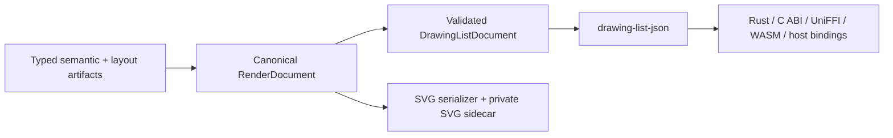

# ADR-0087: Renderer-Neutral DrawingList as the Cross-Language Render Contract

## Status

Accepted.

## Date

2026-09-03

## Context

Merman currently owns Mermaid semantics, layout, and SVG parity, but consumers such as editors,
native UI toolkits, canvas hosts, and language bindings need a complete renderer-neutral drawing
description. SVG is not a suitable public master model: it couples consumers to browser DOM/CSS,
`foreignObject`, executable-link concerns, and serializer details. Independently emitting SVG and a
second drawing list would duplicate visual decisions and eventually drift.

Issue #114 also requires an explicit answer for effects that cannot be represented by portable
vector commands. A renderer-neutral contract must not silently drop, approximate, or substitute a
visual construct. It must either describe the construct, carry a bounded self-contained raster
subtree with provenance, or reject the request before returning a partial result.

## Decision

Merman adopts a versioned, renderer-neutral `DrawingList` as a public cross-language output, with
`application/vnd.merman.drawing-list+json;version=1` as its initial media type.

The rendering pipeline follows one canonical document boundary:

1. `RenderDocument` is built after the existing typed semantic and layout stages. It owns the
   validated public `DrawingListDocument` projection and a private SVG structural sidecar for DOM
   IDs, classes, definitions, HTML shells, and accessibility ordering.
2. DrawingList JSON and SVG are target-local serializers of that canonical document. SVG is never
   parsed back into the public DrawingList as the permanent architecture. A migration bridge may be
   used only when it records an accountable vector, raster, or error disposition and is deleted
   after the corresponding direct family adapter is complete.
3. Visual effects use explicit typed commands and resources for paths, fills, strokes, transforms,
   opacity, blend modes, text obligations, images, clipping, gradients, patterns, markers, masks,
   filters, links, and accessibility metadata. Text records its measurement and shaping
   obligation; the contract does not imply browser font or shaping parity that Merman cannot prove.
4. A non-portable or not-yet-portable effect is handled by the request policy: portable vector
   commands when available, a bounded self-contained `DrawRasterSubtree` with source identity,
   bounds, scale, format, alpha, and reason when a raster asset is available, or a typed error.
   `VectorOnly` rejects a required raster effect before returning output. No partial DrawingList is
   committed after cancellation, deadline, validation, or resource-limit failure.
5. The existing Root Viewport, operation control, resource limits, security boundary, and render
   environment remain authoritative. Decoding and consuming a DrawingList never performs ambient
   network, file, or font loading.
6. Capability discovery and generic transports advertise one `drawing-list-json` operation. ABI 3
   appends operation code `14` only while the existing function table, record layouts, and closed
   error vocabulary remain unchanged; an actual ABI layout change requires a separately reviewed
   ABI decision.
7. Structural validation, schema compatibility, effect accounting, and deterministic provenance
   are correctness evidence. Content hashes may be retained for diagnostics or fixture identity,
   but a hash is not a semantic correctness gate and cannot hide an unclassified visual effect.

## Consequences

- Native and language-binding consumers can render a complete, self-contained document without
  embedding an SVG/DOM interpreter.
- SVG parity remains source-backed while DrawingList consumers receive an honest portable contract;
  the two outputs can evolve through shared semantic decisions rather than parallel emitters.
- Family migration is initially more expensive because each visual effect needs a direct vector,
  explicit raster, or structured-failure classification. That cost is intentional and produces an
  auditable coverage boundary instead of silent visual loss.
- The public protocol can evolve independently from the C ABI result layout, while capability and
  generated-binding projections remain discoverable from their existing authorities.
- Browser text metrics, HTML labels, math, icons, filters, masks, and hand-drawn output remain
  bounded residuals until a portable representation or explicit fallback is implemented.

## Rejected Alternatives

### SVG or `resvg` importer as the canonical producer

Rejected. It would make browser/SVG concepts the core model, lose source-level provenance, and make
CSS, HTML labels, and executable-content boundaries unreliable for native consumers.

### Independent DrawingList emitters beside every SVG emitter

Rejected. It duplicates root, style, text, effect, and failure decisions and guarantees semantic
drift between SVG and non-SVG targets.

### Reuse `LayoutJson` or `SvgPlan` as the public drawing model

Rejected. Those artifacts are diagnostic/planning projections and do not carry paint order,
resolved visual state, resource ownership, text obligations, or no-silent-loss dispositions.

### Make hashes the primary release contract

Rejected. Hashes detect byte changes but cannot explain whether a change is an intended semantic
evolution, a browser residual, or an omitted visual construct. They remain optional evidence, not
the DrawingList correctness model.

## Amends

- ADR-0063: SVG pipelines remain public output adapters, but their visual source is the canonical
  `RenderDocument` plus SVG sidecar after migration; parity/readable/resvg-safe policy remains
  SVG-specific.
- ADR-0066 and ADR-0076: DrawingList extends the existing generic capability and binding contract;
  it does not create a parallel transport catalog or replace the stable C ABI boundary.
- ADR-0073 and ADR-0081: family-owned typed rendering and proportionate, structural release gates
  remain authoritative; DrawingList coverage is added as an explicit effect/family evidence lane.
