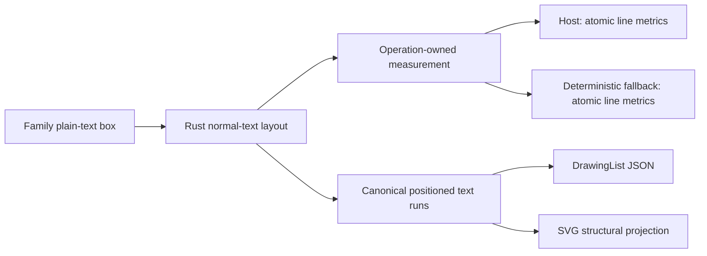

# ADR-0088: Atomic Normal-Line Metrics and Additive Host Callback Evolution

## Status

Accepted design; atomic metrics, transport projections, bounded Rust normal-text layout, direct
Venn text nodes, and their canonical SVG identity-shell projection are implemented. Full-family
Venn parity and RoughJS migration remain in progress; no additional family is admitted by this ADR.

## Date

2026-09-08

## Context

Venn text nodes use plain HTML text with normal whitespace, normal line height, centered flex
layout, and normal word breaking. The existing `HtmlLike` measurement path describes different
behavior: explicit 1.5em lines and, when constrained, preserved break-spaces. SVG bbox height is
also not an HTML line box. Reusing either would silently change the public DrawingList.

The pinned source is `repo-ref/mermaid/packages/mermaid/src/diagrams/venn/vennRenderer.ts`.
A September 8 Chromium 151 probe of attached single-line HTML confirmed that actual content
matters: at 20px, the Trebuchet/Verdana/Arial stack gave line-height/baseline-offset pairs of
23/19 for `Hg`, 28/21 for Chinese, and 29/22 for an emoji sequence. The serif stack gave 23/18
for `Hg`. A zero-size inline-block baseline marker left all measured line heights unchanged.
These are characterization observations, not constants to embed in production.

The native ABI 3 callback result has an exact-size contract. Adding fields to that record would
break existing hosts. However, its function table permits complete appended slots, and its
minimum-prefix descriptor separately freezes the existing callbacks and records. This offers a
safe extension without changing the ordinary execute, result ownership, or close protocols.

## Decision

1. Add one normal-line measurement operation returning a fixed-size pair:
   `NormalLineMetrics { line_height, baseline_offset }`. The offset is the alphabetic baseline
   relative to the line-box top. Measure the actual line text and style, not a fixed `Hg` probe.
   Validate both fields together and select host or deterministic fallback for the entire pair.
   Non-finite values and negative heights are invalid; do not impose guessed font-specific ratios.
2. Keep line breaking and positioned runs in Rust. Normal plain-text layout collapses HTML ASCII
   whitespace, preserves NBSP, does not parse literal markup, and does not break an indivisible
   long word. It accounts for min-content flex sizing, measures complete candidate lines, and
   obtains line metrics after deciding each line. Empty text has no painted line. Use the existing
   operation work/cancellation and DrawingList allocation budgets before allocating line storage.
3. Follow ADR-0086: the built-in pair is an explicitly font-agnostic compatibility heuristic,
   with profile provenance. It must not masquerade as a browser or named-font measurement.
   Browser hosts measure an attached single-line HTML box with `line-height: normal` and a
   zero-size baseline marker; native hosts use their own text systems or decline the operation.
4. Serialize the resolved public text origins and styles. An SVG HTML shell may preserve DOM
   identity and structure, but must not perform a second automatic wrap or derive visual text
   from a sidecar. Different line metrics, font fallback, and shaping remain attributable browser
   residuals, not permission to omit words or styles.
5. Evolve C host services through newly named callback/config/result records and an appended
   `engine_new_with_services_v2` table entry. Preserve every published record, old callback
   signature, old slot, and minimum-prefix digest. A new callback must never be passed through an
   old function pointer. Keep old callbacks as thin transport adapters sharing the same admission,
   lifetime, validation, and fallback machinery; they decline results they cannot represent.
6. The new result belongs to the independently versioned measurement protocol. Keep protocol 1
   requests on old C callbacks; the new callback negotiates the evolved protocol explicitly.
   UniFFI has a separate record wire contract and must update its API probe and generated consumers.
   No Rust-only or Web-only admission of the new operation substitutes for the transport closure.

## Alternatives

- **Two scalar operations:** smaller wire changes, but height and baseline can independently fall
  back to different providers. Pairing caches or rollback rules would be more complex than an
  atomic result. Rejected.
- **Host returns the full wrapped paragraph:** can delegate browser-specific wrapping and bidi,
  but adds callback-owned arrays, text-range conventions, and transport allocation ownership.
  Not required for this plain-text surface; Rust already owns the layout. Not selected.
- **ABI 4 replacement:** permits replacing the existing callback record outright, but breaks all
  native consumers for a capability that can be selected through an appended service entry.
  Not selected while existing record and slot semantics remain valid.

## Verification and Risks

- A focused descriptor test must accept appended independent callbacks/records while preserving
  the old minimum-prefix digest; edits to frozen callbacks still change that digest. Uniqueness,
  ordered codes, missing-prefix checks, and the closed error vocabulary remain enforced. Do not
  build a type-reachability analyzer into `xtask` to prove the new constructor's behavior.
- Native integration must exercise an old callback, the new paired result, and undersized table
  capacity. It must prove that old records are not overwritten and no partial slot is exposed.
- Renderer tests must exercise authoritative host pairs, whole-pair fallback, mixed-script lines,
  NBSP, long words, literal markup, cancellation, and small caller budgets through the real builder.
- Cross-language tests must cover the new pair and invalid/unhandled results. Generated protocol,
  ABI, UniFFI, Web, Flutter, and package surfaces must agree before advertising the new operation.
- Venn remains on the explicit migration route until its direct text-node representation and
  source-backed SVG parity are verified. This ADR is not family admission or completion evidence.

This decision elaborates ADR-0087 R2/R6/R8/R9 and its implementation units U5–U7. It does not relax
the requirement to finish all families or remove the temporary legacy SVG bridge.
