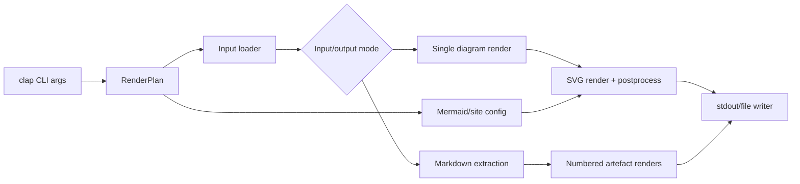

# merman-cli Official CLI Compatibility

**Status**: Complete for the documented CLI surface, with registered divergences
**Baseline**: `@mermaid-js/mermaid-cli` `11.15.0`
**Reference source**: `tools/mermaid-cli/node_modules/@mermaid-js/mermaid-cli/src/index.js`
**Created**: 2026-06-04
**Last updated**: 2026-06-06

This document is the source of truth for making `merman-cli` behave like the official Mermaid CLI
where a pure-Rust implementation can reasonably do so. It tracks both the public command surface and
the observable file/stdout/Markdown behavior.

## Goals

- Make top-level `merman-cli` render/export usage behave like `mmdc`.
- Keep `detect`, `parse`, `layout`, and `render` developer subcommands available without blocking
  official CLI compatibility.
- Document deliberate divergence where upstream behavior is browser-specific or not compatible with
  this Rust renderer.
- Keep every official behavior backed by an integration test or a documented unsupported decision.

## Non-Goals

- Pixel-identical raster output. Upstream uses Puppeteer screenshots/PDF output; `merman-cli` uses
  pure-Rust SVG rendering and Rust rasterizers.
- Replacing the Rust diagram renderers with browser execution.

## High-Level Design

The CLI is intentionally split into modules:

- `cli.rs`: command-line contract and argument validation.
- `commands.rs`: command dispatch for top-level compatibility and developer subcommands.
- `render.rs`: render planning, format inference, single-diagram rendering.
- `markdown.rs`: Markdown fence extraction, numbered artefact naming, image links, and rewrite
  helpers.
- `config.rs`: Mermaid config, layout options, math renderer, text measurement.
- `io.rs`: stdin/file/stdout behavior.
- `error.rs`: CLI error formatting and conversions.

## Alternatives Considered

### Option A: Pure-Rust compatibility layer (recommended)

**Pros**: keeps the project browserless, works with existing renderers, easy to package, allows
fine-grained tests around CLI behavior.
**Cons**: browser-only behavior such as Puppeteer PDF layout must be emulated or documented as
divergence.
**Decision**: chosen.

### Option B: Shell out to official `mmdc`

**Pros**: exact upstream behavior for all browser paths.
**Cons**: defeats the Rust CLI purpose, requires Node/Puppeteer, creates deployment and security
costs, makes Rust renderers irrelevant for CLI output.
**Decision**: rejected.

### Option C: Embed a browser backend behind an optional feature

**Pros**: could provide exact behavior for PDF/icon/plugin cases.
**Cons**: large dependency surface, harder releases, duplicates official CLI.
**Decision**: deferred. Revisit only if downstream users require exact browser PDF or plugin behavior.

## Success Metrics

| Metric | Target | Measurement |
|---|---:|---|
| Official option coverage | Every `mmdc@11.15.0` public flag is implemented or explicitly documented as an unsupported/divergent behavior | `cargo nextest run -p merman-cli` + matrix review |
| Core single-diagram behavior | `-i`, `-o`, `-o -`, format inference, config/css/theme covered | CLI integration tests |
| Markdown behavior | `.md`/`.markdown` extraction, numbered artefacts, output Markdown rewrite covered | CLI integration tests |
| Unsupported/divergent behavior | Every divergence documented in this file | Status matrix review |
| Regression coverage | Default and `--no-default-features` CLI test sets pass | nextest gates |

## Official Option Matrix

| Official option | Upstream behavior | Local status | Notes |
|---|---|---|---|
| `-t, --theme [theme]` | Choices: `default`, `forest`, `dark`, `neutral`; default `default`. Config file can override it. | Implemented | Local config merge matches upstream `{ theme }` then config file merge. |
| `-w, --width [width]` | Positive integer, default `800`. | Implemented | Local accepts positive number and stores as `f64`. |
| `-H, --height [height]` | Positive integer, default `600`. | Implemented | Local accepts positive number and stores as `f64`. |
| `-i, --input <input>` | File path; `-` means stdin without missing-input warning. `.md`/`.markdown` activates Markdown mode. | Implemented | Single-diagram, stdin, and Markdown batch rendering implemented. |
| `-o, --output [output]` | Missing output defaults to `<input>.svg` or `out.svg`; `-` writes stdout and defaults format to SVG. | Implemented divergence | Official extensions are validated; documented Rust extensions `jpg`/`jpeg`/`txt`/`ascii` are also accepted. |
| `-a, --artefacts [artefacts]` | Only valid with Markdown input; creates directory recursively; overrides artefact location. | Implemented | Supports both `--artefacts` and Rust-friendly `--artifacts` alias. |
| `-j, --jobs <jobs>` | Positive integer; default half available CPUs or `1`; limits Markdown render concurrency. | Implemented | Uses a bounded Rayon pool for Markdown chart renders; `jobs=1` keeps serial behavior. |
| `-e, --outputFormat [format]` | Choices: `svg`, `png`, `pdf`; overrides output extension. | Implemented divergence | Local also supports `jpg`, `ascii`, `unicode` for Rust-specific output; unknown values are rejected by clap. |
| `-b, --backgroundColor [color]` | Default `white`; applied to SVG/PNG/PDF browser page path. | Implemented | Local applies root background/postprocess and raster background. |
| `-c, --configFile [configFile]` | JSON Mermaid config file; must exist. | Implemented | JSON parse errors bubble as CLI errors. |
| `-C, --cssFile [cssFile]` | CSS file; must exist; injected into page before rendering. | Implemented | Local injects scoped CSS through SVG postprocessor. |
| `-I, --svgId [svgId]` | Root SVG id used by `mermaid.render`. | Implemented | Local sanitizes for Rust SVG internals. |
| `-s, --scale [scale]` | Positive float, default `1`; Puppeteer device scale factor. | Implemented | Local uses raster scale. |
| `-f, --pdfFit` | PDF page clipped to chart bounding box. | Implemented divergence | Top-level default PDF uses a Letter-sized page approximation; `--pdfFit` uses chart-sized `svg2pdf` output. |
| `-q, --quiet` | Suppresses info logs. | Implemented | Markdown chart-count and artefact logs are suppressed. |
| `-p, --puppeteerConfigFile [file]` | JSON Puppeteer launch config; must exist. | Implemented divergence | File existence and JSON parsing match upstream preflight behavior; values are accepted no-op because the Rust CLI has no Puppeteer runtime. |
| `--iconPacks <icons...>` | Registers Iconify package loaders in browser; may fetch from unpkg. | Implemented | Loads local `node_modules/<package>/icons.json` when present, otherwise fetches `https://unpkg.com/<package>/icons.json`; package tail is used as the Iconify prefix like upstream. |
| `--iconPacksNamesAndUrls <prefix#url...>` | Registers explicit Iconify JSON URL loaders. | Implemented | Supports HTTP(S), `file://`, and local path Iconify JSON sources; prefix before `#` overrides the JSON prefix like upstream loader registration. |
| `--help`, `-h` | Print help and exit 0. | Implemented | Covered by CLI tests. |
| `--version` | Print version and exit 0. | Implemented | Covered by CLI tests. |

## Rust Extension Option Matrix

| Rust extension option | Local behavior | Status | Notes |
|---|---|---|---|
| `--fixed-today <YYYY-MM-DD>` | Overrides the local "today" date used by time-dependent diagrams. | Implemented | Primarily stabilizes Gantt parse/render output for snapshots and headless automation. |
| `--fixed-local-offset-minutes <minutes>` | Overrides local timezone semantics with a fixed offset in minutes. | Implemented | Validated to offsets accepted by `chrono::FixedOffset`; useful for cross-runner Gantt determinism. |

## Observable Behavior Matrix

| Behavior | Upstream source | Local status | Required tests |
|---|---|---|---|
| Missing input reads stdin and warns. | `cli()` input check | Implemented | Existing smoke path; add stderr assertion. |
| `-i -` reads stdin and suppresses missing-input warning. | `cli()` input check | Implemented | Existing stdout test covers success. |
| Explicit missing input file fails with a path-specific message. | `cli()` input check | Implemented | `top_level_missing_input_file_reports_path`. |
| Missing output with input writes `<input>.svg`. | `cli()` output check | Implemented | `top_level_default_output_for_input_file_appends_svg`. |
| Missing output with stdin writes `out.svg`. | `cli()` output check | Implemented | `top_level_default_output_for_stdin_writes_out_svg`. |
| `-o -` writes stdout, defaults format to SVG if `-e` absent. | `cli()` output check | Implemented | Existing test checks no `-` file. |
| Explicit output must end in `.md`, `.markdown`, `.svg`, `.png`, or `.pdf`. | `cli()` output regex | Implemented divergence | Unknown extensions are rejected; documented Rust extensions remain accepted. |
| Runtime output format must be `svg`, `png`, or `pdf`. | `run()` output format check | Divergence | Local intentionally supports JPG/text. Document in help. |
| Markdown input forbids stdout. | `run()` Markdown branch | Implemented | `markdown_input_rejects_stdout_output`. |
| Markdown fenced block regex matches only whole-line triple backtick/colon `mermaid` blocks. | `mermaidChartsInMarkdown` | Implemented | `extracts_backtick_and_colon_mermaid_blocks`. |
| Markdown artefact file naming uses `output-1.ext`, `output-2.ext`. | `output.replace(...)` | Implemented | `markdown_input_writes_numbered_svg_artefacts`. |
| Output `.md`/`.markdown` rewrites Mermaid fences to Markdown images. | Markdown replacement branch | Implemented | `markdown_output_rewrites_mermaid_blocks_to_images`. |
| Markdown image alt defaults to `diagram`; title/alt escaped. | `markdownImage()` | Implemented | `replaces_charts_with_escaped_markdown_images`. |
| No Markdown charts logs a message and writes no artefacts. | Markdown branch | Implemented | `markdown_without_charts_logs_and_writes_no_artefacts`. |
| Config file overrides default/CLI theme when it contains `theme`. | `Object.assign({ theme }, config)` | Implemented | `config_file_theme_overrides_cli_theme`. |
| Missing config/css/puppeteer files fail before rendering. | `checkConfigFile`, css check | Implemented | Config/css/puppeteer paths are validated before render work. |

## Deliberate Divergence Register

| Area | Divergence | Rationale | Follow-up |
|---|---|---|---|
| JPG output | Local supports `jpg`/`jpeg`; upstream `11.15.0` only supports `svg`, `png`, `pdf`. | Existing Rust CLI shipped JPG support and tests. | Keep as Rust extension; document as non-official. |
| ASCII/Unicode output | Local supports text output; upstream does not. | Valuable Rust-native CLI capability. | Keep enabled by default for `merman-cli`; `--no-default-features` can still exclude it. |
| RaTeX math | Local CLI enables `ratex-math` by default; upstream uses browser Mermaid/KaTeX behavior. | Rust CLI should render math without extra feature friction. | Keep `--math-renderer none|ratex`; no-default build still rejects. |
| Puppeteer config | No browser runtime in local CLI. | Browserless architecture. | Validate file for compatibility, treat runtime config as accepted no-op. |
| PDF output | Local PDF is generated through Rust `svg2pdf`, not Chromium print-to-PDF. | Browser PDF pagination, margins, and CSS print behavior cannot be pixel-identical without Puppeteer. | Top-level default uses a Letter page approximation; `--pdfFit` uses chart-sized output. |
| Icon pack rendering internals | Upstream uses browser DOM `getBBox()` and Iconify `replaceIDs()` when embedding icons. | Local renderer parses Iconify JSON into a Rust registry and emits deterministic nested SVGs; layout remains based on existing Rust icon node sizing. | Keep tests focused on successful real icon rendering; deepen DOM-level icon parity separately if fixture comparison exposes differences. |

## Execution Model / Concurrency

Official `mmdc@11.15.0` uses `p-limit(jobs)` for Markdown files: every Mermaid code block becomes
an independent render task, at most `jobs` tasks run at once, and `Promise.all(...)` returns images
in source order for the final Markdown rewrite.

`merman-cli` mirrors the observable behavior with a synchronous CLI shell and a bounded Rayon
thread pool inside Markdown mode:

- `--jobs 1` uses the same serial path as a single diagram.
- `--jobs N` renders Markdown chart artefacts on a pool with `N` worker threads.
- Result collection is order-preserving, so rewritten Markdown always maps block 1 to
  `output-1.ext`, block 2 to `output-2.ext`, and so on, regardless of completion order.
- Each task writes its own numbered artefact. The overall operation fails if any task fails; tasks
  already running may finish, matching the practical behavior of already-started upstream promises.
- Informational artefact logs may appear in completion order, and `--quiet` suppresses them.

## Work Breakdown

### Phase 1: Compatibility Spec and Validation

- [x] Add clap-based top-level command surface.
- [x] Modularize CLI entrypoint.
- [x] Enable `ratex-math` and ASCII/Unicode output by default for `merman-cli`.
- [x] Add first CLI compatibility regression tests.
- [x] Add this compatibility document to `docs/alignment/STATUS.md`.

### Phase 2: Markdown Export Parity

- [x] Add Markdown extraction module with upstream-compatible regex.
- [x] Add Markdown image escaping helper.
- [x] Render numbered artefact files for `.md`/`.markdown` input.
- [x] Rewrite Markdown output when output path is `.md`/`.markdown`.
- [x] Implement `--artefacts` directory creation and relative link calculation.
- [x] Add `--jobs` scheduling semantics for Markdown renders.

### Phase 3: Strict Official Behavior

- [x] Validate output extensions against official set, while preserving documented Rust extensions.
- [x] Validate `puppeteerConfigFile` existence/JSON and document runtime no-op.
- [x] Add config/theme/css precedence tests.
- [x] Add stdout/Markdown incompatibility tests.
- [x] Align user-facing errors where practical.

### Phase 4: Browser-Specific Decision Points

- [x] Decide `pdfFit` semantics for Rust `svg2pdf`.
- [x] Implement Iconify icon pack support through a Rust SVG icon registry.
- [x] Document any final divergence in the register above.

## Risks and Mitigations

| Risk | Severity | Likelihood | Mitigation |
|---|---:|---:|---|
| Accidentally removing useful Rust-only output (`jpg`, `ascii`, `unicode`) | Medium | Medium | Keep divergence register and tests. |
| Markdown regex drift from upstream | High | Medium | Copy upstream regex semantics into tests with fixtures. |
| Output file naming surprises | Medium | Medium | Test exact paths for `.svg`, `.png`, `.pdf`, `.md`, and artefacts. |
| Network icon pack behavior introduces supply-chain risk | High | Medium | Remote fetching only occurs when the user explicitly passes `--iconPacks` without a local package or an HTTP(S) `prefix#url`; tests use local JSON sources. |
| PDF fit cannot match browser PDF exactly | Medium | High | Define Rust-specific behavior and document divergence. |

## Immediate Next Tests

- None currently identified in the documented CLI compatibility surface.
