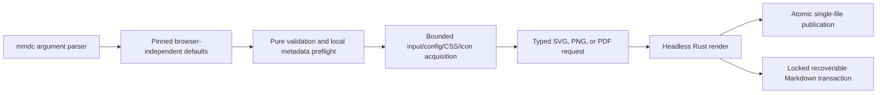

# merman-cli `mmdc` Compatibility

| Contract | Value |
| --- | --- |
| Status | Supported versioned compatibility surface with registered divergences |
| Baseline | `@mermaid-js/mermaid-cli@11.16.0` |
| Interface | `merman-cli mmdc` |
| Hidden compatibility alias | Root-level `mmdc` options; permanently supported and not advertised |
| Native format transition | `render` / `batch -e` through `0.8.x`; use `-f/--format`; removed in `v0.9.0` |
| Reference source | `tools/mermaid-cli/node_modules/@mermaid-js/mermaid-cli/src/index.js` |
| Last updated | 2026-07-29 |

Merman provides a browserless compatibility command for scripts that use the official Mermaid CLI. Compatibility is explicit and release-pinned: `merman-cli mmdc` owns the supported `mmdc@11.16.0` argument names, browser-independent defaults, file naming, Markdown detection, warnings, and fence scanner. The repository does not install an `mmdc` executable alias.

The advertised root command does not own render flags. A root invocation that begins with an option owned by `mmdc` is permanently rewritten to the explicit `mmdc` subcommand before Clap parsing. This separation lets the compatibility contract track a named upstream release while native `render` and `batch` use stricter Rust CLI conventions without breaking existing scripts.

## Migration

| Previous command | Pinned compatibility | Recommended native workflow |
| --- | --- | --- |
| `mmdc -i diagram.mmd -o diagram.svg` | `merman-cli mmdc -i diagram.mmd -o diagram.svg` | `merman-cli render diagram.mmd -o diagram.svg` |
| `merman-cli -i diagram.mmd -o diagram.svg` | `merman-cli mmdc -i diagram.mmd -o diagram.svg` | `merman-cli render diagram.mmd -o diagram.svg` |
| `merman-cli -i diagram.mmd` | `merman-cli mmdc -i diagram.mmd` | `merman-cli render diagram.mmd` |
| `merman-cli -i - -o -` | `merman-cli mmdc -i - -o -` | `merman-cli render` with piped stdin |
| Root Markdown inference | `merman-cli mmdc -i README.md -o out.md --artefacts assets` | `merman-cli batch README.md --output-dir README.merman` |

The default output names intentionally differ:

- `mmdc -i diagram.mmd` preserves the upstream-style append rule and writes `diagram.mmd.svg`.
- `render diagram.mmd` replaces the input extension and writes `diagram.svg`.
- Piped native `render` writes stdout by default.
- Implicit `mmdc` stdin retains the pinned missing-input warning even with `--quiet`; explicit
  `-i -` does not.
- `mmdc -o -` without `-e` retains the pinned SVG-format warning even though stdout otherwise
  enables quiet output.

The permanent root rewrite uses the exact `mmdc` parser, defaults, validation, and execution path and emits no compatibility-layer warning. It is intentionally absent from root help and completions; explicit `merman-cli mmdc` remains the preferred spelling for new compatibility scripts. Bare root inputs and options that are not owned by `mmdc` still fail with exit `2` and a targeted workflow message.

Native `render -e` and `batch -e` are separate temporary aliases for `-f/--format`. They are hidden from help and completions, their bounded migration warnings remain visible even with `--quiet`, and they are removed in `v0.9.0`. The removal does not apply to `mmdc -e/--outputFormat`.

## Contract Boundary

The compatibility command follows the successful browser-independent workflows of the pinned CLI:

- SVG, PNG, and PDF output selection and extension inference.
- `default`, `forest`, `dark`, and `neutral` theme validation.
- width, height, background, config JSON, CSS, SVG id, scale, PDF-fit, quiet, and icon-pack arguments.
- named input, explicit or implicit stdin, stdout, and default output naming.
- strict `.md` / `.markdown` recognition, numbered artifacts, and Markdown image rewriting.
- bounded parallel chart scheduling when `parallel-markdown` is compiled.
- bounded preflight of a Puppeteer configuration file even though no browser is started.

JPEG and ASCII/Unicode are native Merman capabilities. Use `render --format jpg|ascii|unicode`; they are deliberately absent from `mmdc --outputFormat`.


```mermaid
flowchart LR
    Args["mmdc argument parser"] --> Normalize["Pinned browser-independent defaults"]
    Normalize --> Preflight["Pure validation and local metadata preflight"]
    Preflight --> Acquire["Bounded input/config/CSS/icon acquisition"]
    Acquire --> Prepare["Typed SVG, PNG, or PDF request"]
    Prepare --> Execute["Headless Rust render"]
    Execute --> Single["Atomic single-file publication"]
    Execute --> Batch["Locked recoverable Markdown transaction"]
```

Compatibility and native commands converge only after argument normalization. They share bounded acquisition, render backends, output alias checks, and publication machinery; they do not share a flattened command-line argument structure.

## Option Matrix

| `mmdc@11.16.0` option | Local contract |
| --- | --- |
| `-i, --input` | File or `-`; omission reads stdin and emits the pinned warning even with `--quiet` |
| `-o, --output` | File or `-`; `-e` selects the format when present, while the output path must still use a supported compatibility extension; without `-e`, a supported non-stdout extension selects the format, omission defaults to SVG, and stdout warns before selecting SVG; missing or unsupported non-stdout extensions are rejected |
| `-e, --outputFormat` | `svg`, `png`, or `pdf`, limited further by compiled output features |
| `-t, --theme` | Exactly `default`, `forest`, `dark`, or `neutral` |
| `-w, --width`; `-H, --height` | Pinned positive-integer parsing; defaults are 800 by 600 |
| `-b, --backgroundColor` | Defaults to white on the compatibility path |
| `-c, --configFile` | Bounded JSON object acquisition; config theme overrides the CLI theme like upstream |
| `-C, --cssFile` | Bounded CSS acquisition and scoped SVG injection |
| `-I, --svgId` | Root SVG id and internal marker prefix |
| `-s, --scale` | Positive PNG scale; local raster limits still apply |
| `-f, --pdfFit` | Fits the Rust vector PDF page to the rendered SVG viewport |
| `-q, --quiet` | Suppresses render information and timing diagnostics, but not the two pinned argument warnings above |
| `-p, --puppeteerConfigFile` | Bounded existence and JSON validation; accepted runtime no-op |
| `-a, --artefacts` | Markdown-only artifact directory, subject to the one-root recovery rule |
| `-j, --jobs` | Markdown concurrency when `parallel-markdown` is compiled; accepted no-op for a single diagram |
| `--iconPacks` | Local `node_modules` Iconify packages; a miss never fetches implicitly |
| `--iconPacksNamesAndUrls` | `prefix#source` definitions for local files, `file://`, or authorized HTTP(S) |

Merman-specific resource, runtime, sanitizer, raster, PDF, and icon-network controls remain visible on `mmdc` where they constrain the shared Rust backend. They are extensions, not claims about the official CLI.

## Strict Markdown

Strict compatibility retains the pinned JavaScript regular-expression behavior rather than using the native scanner:

- only case-sensitive `.md` and `.markdown` paths enter Markdown mode;
- only the pinned lowercase `mermaid` marker and three-character backtick/colon matcher are recognized;
- uppercase markers, tilde fences, longer native fences, MDX, and unclosed fences do not gain native behavior;
- numbered output follows the compatibility output template;
- zero charts with an image template writes no image; a Markdown target receives an unchanged document;
- strict mode never deletes stale numbered files when a later run contains fewer charts or selects a different format or artifacts directory.

Native `batch` is intentionally more ergonomic. It accepts `.md`, `.markdown`, and `.mdx` case-insensitively, recognizes backtick, tilde, and colon fences of length three or more, supports `Mermaid` case variants, and retains an unclosed Mermaid fence through end of file.

Both paths acquire a stable lock and resolve an incomplete owned transaction before new staging. Every chart completes in staging before publication, the rewritten document is committed last, and rollback/recovery state is reported honestly. This is a recoverable multi-file transaction, not a claim of globally atomic filesystem publication.

For strict `mmdc`, the rewritten document parent is the transaction root. An explicit `--artefacts` directory must remain below that root on the same filesystem. A split root or nested mount is rejected before creating directories, locking, accessing the network, or rendering. Native `batch` instead owns its complete output directory.

## Deliberate Divergences

| Area | Divergence | Reason |
| --- | --- | --- |
| Rendering runtime | Pure Rust, no Puppeteer or Chromium | Browserless installation and execution are core product requirements |
| Ambient runtime state | Deterministic date, UTC offset, and random stream by default; use `--runtime native` when all system adapters are compiled | Reproducible output remains the CLI default, while upstream Chromium observes host state |
| Pixel output | PNG uses Merman's bounded SVG raster pipeline | It is not a Chromium screenshot contract |
| PDF | Vector Rust conversion with bounded localized raster work | Chromium print CSS, pagination, and font rendering are browser-specific |
| Puppeteer config | Validated, then ignored | There is no Puppeteer process to configure |
| Network icons | Explicit `--allow-network`; private destinations also require `--allow-private-network` | Prevent implicit downloads and SSRF-style access |
| Redirects | Every destination is resolved, classified, authorized, and pinned per hop | Initial authorization must not authorize a private redirect |
| Resources | Source, auxiliary inputs, charts, staging, working set, jobs, redirects, and duration are bounded | Untrusted input must not allocate or work without a governed limit |
| Markdown roots | One same-filesystem transaction root | Merman does not claim coordinated recovery across unrelated filesystems |
| Concurrency | `--jobs` is capped by the selected resource profile and scheduling-weight permits | Thread count alone is not a sufficient memory bound |
| Extra formats | JPEG and text are native-only | Upstream `mmdc@11.16.0` exposes SVG, PNG, and PDF |

The network restrictions and one-root Markdown rule are intentional safety divergences. They are not silent fallbacks.

## Publication And Failure Semantics

Compatibility output uses the same integrity boundary as native output:

- argument conflicts and statically requested unavailable capabilities fail before input acquisition; capabilities discovered from diagram source fail during content processing;
- output aliases of source, config, CSS, Puppeteer config, or local icon inputs are rejected;
- a single output file keeps its prior complete contents until atomic replacement succeeds;
- Markdown render failure leaves the previous final generation unchanged;
- publication or rollback failure exits `3` and retains recovery evidence;
- stdout contains only the requested payload, and a closed downstream pipe is success.

Exit classes are stable across command dialects:

| Exit | Class |
| ---: | --- |
| `0` | Success |
| `1` | Content or render failure, including a layout or math capability required by parsed source but absent from the build |
| `2` | Invocation or configuration error, including a statically requested option or output capability absent from the build |
| `3` | Local/remote operational or publication failure |

## Version Lifecycle

The compatibility version is generated from `tools/upstreams/MERMAID_REFERENCE_BUNDLE.json` and reported by:

```sh
merman-cli capabilities --json
```

The JSON document uses capability schema 2 and current CLI contract 3. It includes the Merman package version, pinned Mermaid and `mmdc` versions, compiled command/capability/output sets, and the canonical descriptor digest. The CLI contract version tracks native command behavior independently from this pinned compatibility baseline. An `mmdc` behavior change requires a Mermaid baseline alignment, updated tests, this register, and a migration note. Merman does not silently follow the latest npm release.

## Verification

Coverage is maintained by:

- process tests for command parsing, defaults, naming, stdin/stdout, errors, and migration diagnostics;
- strict/native scanner snapshots and Markdown transaction recovery tests;
- output-specific SVG, PNG, JPEG, and PDF smokes;
- network authorization and redaction tests;
- a 22-row exact Cargo feature process matrix;
- generated help, completion, man page, and capability contracts;
- release-archive structural checks plus host-native runtime smoke before publishing.

The implementation target is functional and structural convergence backed by pinned source. Browser font metrics, `getBBox()` floats, `foreignObject`, RoughJS geometry, and Chromium export behavior remain bounded residuals rather than pixel-perfect claims.
