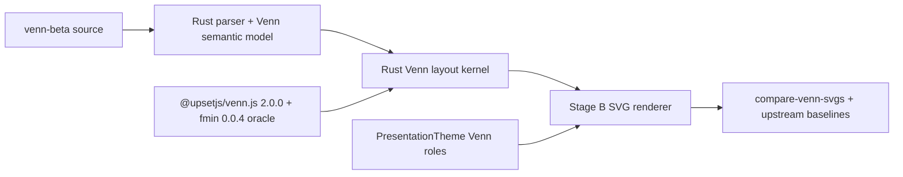

# Venn Beta Admission Plan (Mermaid@11.16.0)

Status: Admitted
Last updated: 2026-06-08
Pinned Mermaid commit: `41646dfd43ac83f001b03c70605feb036afae46d`

This document records the source-backed plan and admission evidence for `venn-beta` in `merman`.

## Problem

Mermaid 11.15 includes `venn-beta`. Local support now has a source-backed Rust layout kernel, a core detector/parser/typed semantic model, a classic Stage B SVG renderer, normalized Venn fixtures, committed upstream SVG baselines, and a green family-local compare gate.

The parser and DB are small enough to port directly. The risky part is layout/rendering: Mermaid delegates circle placement and intersection geometry to `@upsetjs/venn.js@2.0.0`, then mutates the generated SVG with D3 and optionally replaces shapes with RoughJS for `look: "handDrawn"`. A local renderer must not approximate that geometry with ad hoc circle formulas and then claim Mermaid parity.

## Implementation Progress

- Done: source-backed `@upsetjs/venn.js@2.0.0` / `fmin@0.0.4` Rust layout kernel in `merman-render`.
- Done: core `venn-beta` detector, semantic JSON parser, and typed `RenderSemanticModel::Venn` model.
- Done: classic Stage B SVG renderer foundation for title, circles, intersections, text-node `foreignObject`, debug text-node layout, typed render-model path, and semantic JSON path.
- Done: targeted `xtask compare-venn-svgs`, `gen-upstream-svgs --diagram venn`, and `check-upstream-svgs --diagram venn` tooling.
- Done: normalized Venn fixtures and committed upstream SVG baselines for Mermaid syntax-doc examples.
- Done: `venn` is admitted to `supported_diagrams()` and the primary SVG matrix for classic SVG output.
- Done: Venn renderer theme roles are projected through `PresentationTheme::venn()` for classic SVG output.
- Deferred: `look: "handDrawn"`/RoughJS Venn output remains out of scope until classic coverage is expanded.

## Source Evidence

- Detector: `repo-ref/mermaid/packages/mermaid/src/diagrams/venn/vennDetector.ts` accepts `/^\s*venn-beta/` and exposes diagram id `venn`.
- Grammar: `repo-ref/mermaid/packages/mermaid/src/diagrams/venn/parser/venn.jison` supports `set`, `union`, `text`, indented text, `style`, quoted identifiers, bracket labels, and numeric sizes.
- DB/model: `repo-ref/mermaid/packages/mermaid/src/diagrams/venn/vennDB.ts` sorts set identifiers for stable keys, defaults single-set size to `10`, defaults union size to `10 / len^2`, and rejects unknown union identifiers.
- Renderer: `repo-ref/mermaid/packages/mermaid/src/diagrams/venn/vennRenderer.ts` calls `venn.VennDiagram()` for SVG generation and `venn.layout()` for text-node placement.
- Styles: `repo-ref/mermaid/packages/mermaid/src/diagrams/venn/styles.ts` defines title, circle text, intersection text, and text-node font/color CSS.
- Config: `repo-ref/mermaid/packages/mermaid/src/config.type.ts` defines `VennDiagramConfig` with `width`, `height`, `padding`, and `useDebugLayout`; `defaultConfig.ts` wires `defaultConfigJson.venn`.
- Dependency: `repo-ref/mermaid/pnpm-lock.yaml` pins `@upsetjs/venn.js@2.0.0`.
- Tests/docs: `repo-ref/mermaid/packages/mermaid/src/diagrams/venn/parser/venn.spec.ts`, `vennRenderer.spec.ts`, and `repo-ref/mermaid/docs/syntax/venn.md`.

## Layout Source Audit

The pinned `@upsetjs/venn.js@2.0.0` npm tarball publishes the source used for layout and geometry. The audit covered `src/layout.js`, `src/circleintersection.js`, `src/diagram.js`, `src/index.d.ts`, `src/layout.spec.js`, `src/circleintersection.spec.js`, and `src/diagram.spec.js`.

| Area | Source-backed finding | Implementation consequence |
|---|---|---|
| Package surface | `@upsetjs/venn.js@2.0.0` is MIT licensed and ships source. Its source imports `fmin@0.0.4` primitives: `bisect`, `nelderMead`, `conjugateGradient`, `zeros`, `zerosM`, `norm2`, and `scale`. `fmin@0.0.4` is BSD-3-Clause. | A Rust port is viable, but license notices and source attribution must be handled when code is ported. Do not depend on a browser or Node runtime in CLI/FFI packages. |
| Circle layout | `venn()` adds missing pairwise intersections, builds an initial layout, then optimizes all circle centers with `nelderMead` and a loss function over pairwise and higher-order overlaps. | The layout adapter must port the optimization loop, not just the final SVG path generation. |
| Initial layout | `bestInitialLayout()` starts with `greedyLayout()` and tries `constrainedMDSLayout()` for larger inputs (`areas.length >= 8`). MDS uses `conjugateGradient` and `Math.random` restarts. | The Rust layout kernel needs deterministic seeded random support for oracle tests. Greedy-only layout is not enough for admission. |
| Geometry | `circleintersection.js` implements `intersectionArea`, `circleOverlap`, `circleCircleIntersection`, circular segment area, containment, and arc stats. | Port geometry as a focused Rust module and cover it with upstream-derived numeric tests before renderer work. |
| Text and path helpers | `diagram.js` uses `computeTextCentre()` with `nelderMead`, `computeTextCentres()`, `intersectionAreaPath()`, `normalizeSolution()`, and `scaleSolution()`. Its `layout()` helper returns `data`, `text`, `circles`, `arcs`, `path`, and `distinctPath`. | The Rust adapter should expose a typed layout result equivalent to `IVennLayout<T>` so the SVG renderer does not reimplement layout internals. |
| Mermaid renderer use | Mermaid calls `VennDiagram().width(...).height(...)` to create the base D3 SVG, then separately calls `venn.layout(sets, { width, height, padding })` to place Mermaid-specific text nodes. | Renderer parity requires both the D3 DOM shape and the helper layout output. The JS package should remain a comparison oracle, not the production runtime path. |
| Upstream tests | `layout.spec.js` covers greedy layout, distance-from-area, normalization, and disjoint clustering. `circleintersection.spec.js` covers segment/overlap/intersection geometry and random failure regressions. `diagram.spec.js` covers text-centre behavior. | Port these as the first layout/geometry test corpus, then add Mermaid syntax-doc fixtures and upstream SVG baselines. |

## Proposed Solution

Implement `venn-beta` around a source-backed Rust layout kernel that mirrors the relevant `@upsetjs/venn.js@2.0.0` behavior. The npm package may be used by `xtask` or tests as an oracle, but not by the runtime renderer.

The implementation lane should have these slices:

1. Detector and typed parser: add `venn` detector for `venn-beta`, port parser behavior from `venn.jison`, and create a typed model with subsets, text nodes, style entries, title, accessibility metadata, and effective `venn` config.
2. Parser fixtures: port upstream parser cases for labels, sizes, text nodes, style declarations, quoted identifiers, unknown unions, and invalid `set` / `union` arity.
3. Layout kernel: port the relevant `@upsetjs/venn.js@2.0.0` layout, geometry, text-centre, normalize, scale, path, and minimal `fmin` helper behavior into Rust behind a typed adapter. Seed the random MDS path for deterministic oracle tests.
4. Layout oracle fixtures: generate pinned package outputs for small, overlapping, disjoint, nested, higher-order, and text-node diagrams; compare circles, text centres, paths, and loss within documented tolerances before renderer DOM work.
5. Stage B SVG renderer: emit Mermaid-shaped `.venn-circle`, `.venn-intersection`, `.venn-title`, `.venn-text-nodes`, `.venn-text-area`, and `foreignObject` text-node DOM after layout is source-backed. Classic SVG foundation is in place; `look: "handDrawn"` remains deferred until classic baselines are green.
6. Theme roles: `PresentationTheme::venn()` owns `venn1..venn8`, `vennTitleTextColor`, `vennSetTextColor`, `primaryColor`, `primaryTextColor`, `textColor`, `titleColor`, `background`, font family, and dark/light readable circle text derivation; diagram `style` entries still override per-area fill, stroke, opacity, width, and text color.
7. Fixture and compare gate: import syntax-doc and parser-source fixtures, generate `fixtures/upstream-svgs/venn`, run `xtask compare-venn-svgs`, and keep the family in the main matrix once family-local structural DOM parity is green.

## Alternatives Considered

| Option | Pros | Cons | Decision |
|---|---|---|---|
| Port `@upsetjs/venn.js@2.0.0` layout logic into Rust | Pure Rust, deterministic, no runtime JS dependency, matches headless architecture | Requires porting small optimizer helpers and maintaining numeric tolerances | Recommended after audit |
| Use a JS/WASM adapter for `@upsetjs/venn.js` during layout | Highest layout fidelity initially | Adds non-Rust runtime dependency, complicates CLI/FFI packaging, weakens headless portability | Acceptable only as a comparison oracle |
| Use a generic Rust optimizer crate instead of porting `fmin` behavior | Reduces local optimizer code | Numeric behavior and termination may drift from the pinned source before SVG parity is measurable | Defer until a source-backed port proves too costly |
| Implement a local approximate circle solver | Fastest to code | Not source-backed, likely DOM/geometry drift, violates admission rubric | Rejected |
| Parse-only `venn-beta` support | Low risk, gives early diagnostics/model access | Users expect visible diagrams; no parity value for preview users | Defer unless a caller explicitly needs parse-only metadata |

## Success Metrics

| Metric | Target | Measurement |
|---|---|---|
| Parser coverage | Upstream parser spec behavior covered by semantic snapshots | `cargo nextest run -p merman-core venn` |
| Geometry parity | Circle intersection, overlap, segment area, and path helpers pass upstream-derived numeric tests | Dedicated Rust layout/geometry tests |
| Layout source parity | Layout adapter outputs match the pinned `@upsetjs/venn.js@2.0.0` oracle for initial fixtures within documented tolerance | Dedicated layout tests or fixture snapshots |
| SVG structural parity | Family-local Venn DOM parity passes for committed upstream baselines | `cargo run -p xtask -- compare-venn-svgs --check-dom --dom-mode parity --dom-decimals 3` |
| Matrix admission | `venn` is admitted to `compare-all-svgs` after detector, parser, layout, renderer, fixtures, and baselines exist | `cargo run -p xtask -- check-alignment` |

## Risks and Mitigations

| Risk | Severity | Likelihood | Mitigation |
|---|---|---:|---|
| Venn layout drift from `@upsetjs/venn.js` | High | High | Port the pinned layout/geometry/text-centre code path first; use pinned package output as an oracle before writing renderer DOM |
| Optimizer behavior drift | High | Medium | Port only the `fmin` primitives used by Venn initially and cover them through layout-level oracle fixtures |
| Random MDS restarts produce unstable higher-order diagrams | Medium | Medium | Add a deterministic seed path for tests, mirroring the repo's existing seeded Mermaid baseline pattern |
| Ported license obligations are missed | Medium | Low | Record MIT/BSD-3-Clause attribution in the implementation PR when source code is ported |
| Browser/D3 serialization noise | Medium | Medium | Normalize only non-semantic D3 wrapper differences in the family compare adapter; do not hide geometry or label differences |
| `foreignObject` text-node parity differs across renderers | Medium | High | Document strict HTML/browser text-metric residuals separately from structural DOM parity |
| RoughJS hand-drawn output expands scope | Medium | Medium | Defer `look: "handDrawn"` until classic SVG parity is green; do not emulate rough output with classic paths |
| Packaging impact from a JS layout dependency | High | Medium | Prefer Rust port; if a JS oracle is used, keep it in test/tooling, not runtime packages |

## Admission Decision

`venn-beta` is admitted for classic SVG output. The source-backed layout/parser, renderer foundation, normalized fixtures, upstream baselines, and targeted compare tooling are in place. `@upsetjs/venn.js@2.0.0` remains a test/tooling oracle only, not a runtime dependency.

`look: "handDrawn"` remains a separate follow-up lane. Mermaid's renderer switches the generated
circle/intersection paths through RoughJS, so local support should only be promoted after rendered
SVG tests prove deterministic rough output and seed behavior for Venn-specific shapes. The current
support matrix must not list Venn as rendered hand-drawn support.

The renderer now consumes Venn theme roles through `PresentationTheme::venn()`, so Venn-specific theme fallback chains no longer live inside the SVG emission module.

## Admission Gates

- `cargo nextest run -p merman-core venn`
- dedicated Venn geometry/layout oracle tests
- `cargo nextest run -p merman-render venn`
- `cargo run -p xtask -- compare-venn-svgs --check-dom --dom-mode parity --dom-decimals 3`
- `cargo run -p xtask -- compare-venn-svgs --check-dom --dom-mode parity-root --dom-decimals 3`
- `cargo run -p xtask -- check-upstream-svgs --diagram venn --check-dom --dom-mode parity --dom-decimals 3`
- `cargo run -p xtask -- check-alignment`

Latest focused gates for the theme-role cleanup:

- `cargo nextest run -p merman-render venn_svg presentation_theme`
- `cargo nextest run -p merman-render --test venn_svg_test`
- `cargo check -p merman-render`
- `cargo run -p xtask -- compare-venn-svgs --check-dom --dom-mode parity --dom-decimals 3`
- `cargo fmt --all --check`
- `git diff --check`
