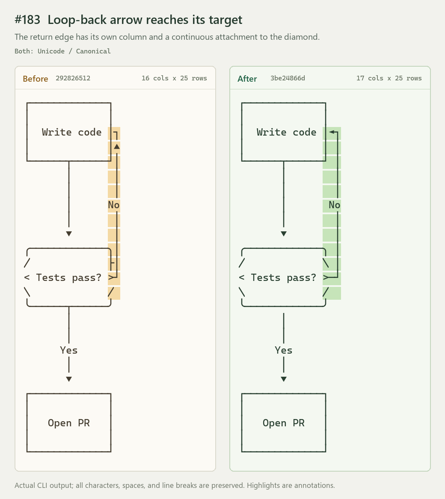
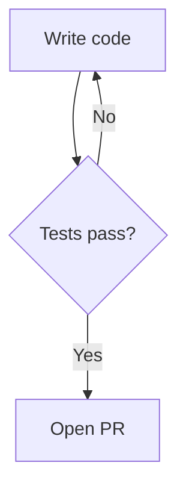
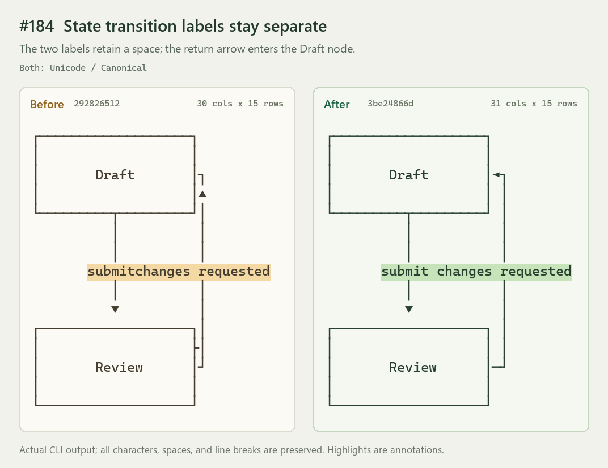
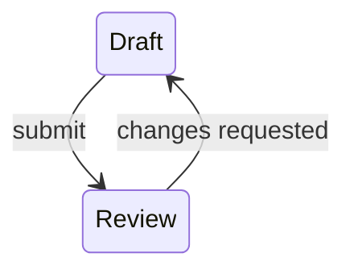
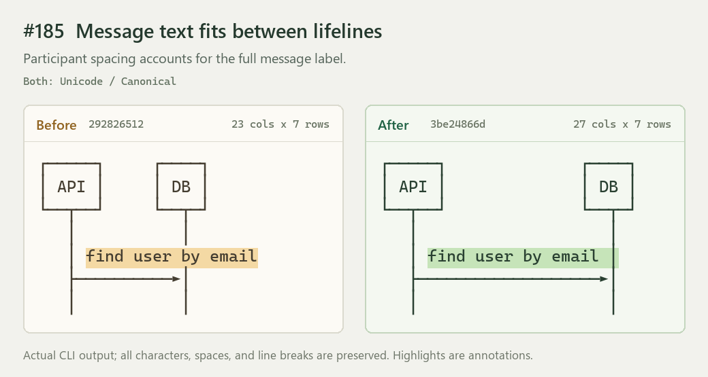
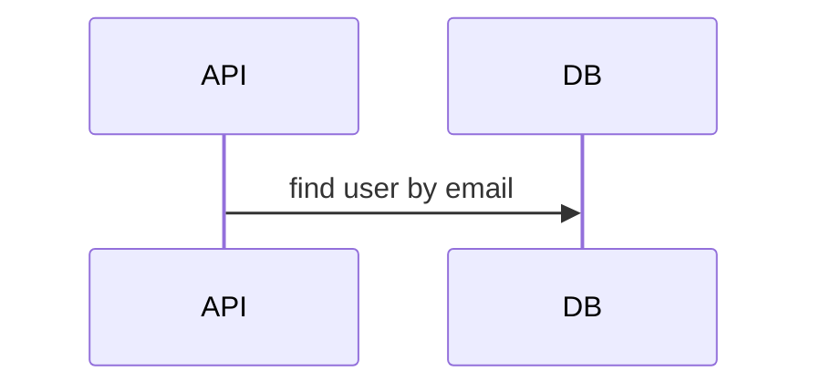
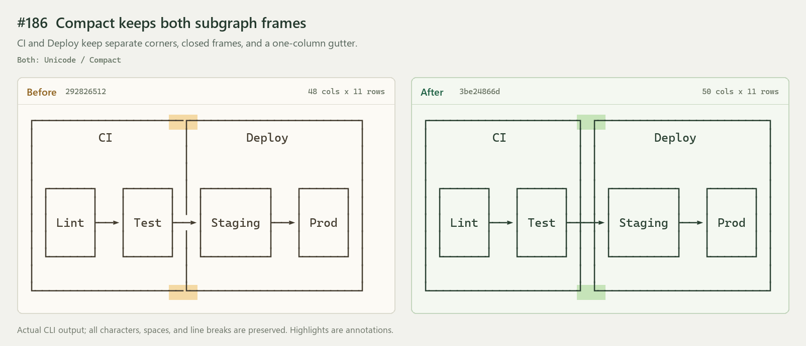
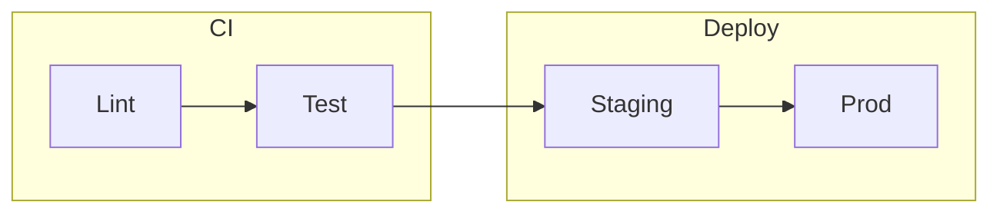
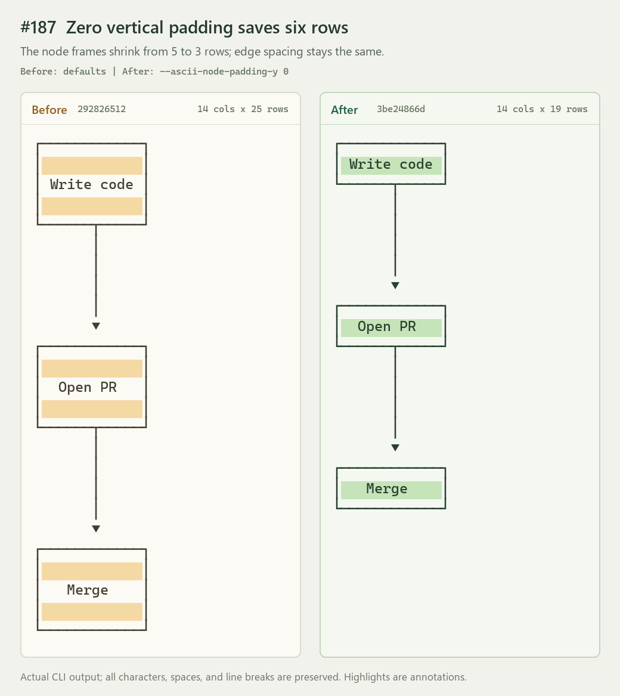
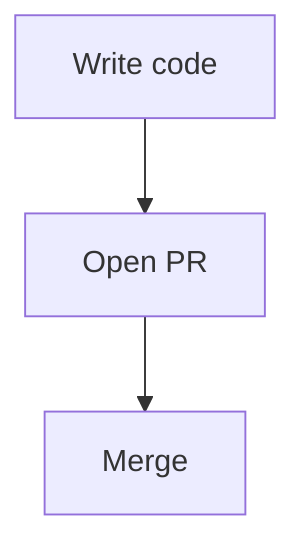

# ASCII geometry: issues #183–#187

Actual Unicode CLI output before `2928265122d5a3d35e239e3ddbce885c7e342c59` and after `3be24866d8f373bf573d708a149fb8fa5d7c58da`.

The PNGs are review illustrations, not golden fixtures. `comparison.json` preserves the original
Mermaid inputs, invocation arguments, structured reports, and unmodified text. Each pair uses the
same input. Highlighted cells are presentation annotations.

For #187, the old binary uses its default padding because it does not support the new flag.
The new binary uses `--ascii-node-padding-y 0`; default padding remains unchanged.

Dimensions are terminal display cells, not image pixels. There is no trimming or lossy fallback.

## #183: Loop-back arrow reaches its target



Input:



Before (16 columns × 25 rows):

```console
merman-cli render --format unicode --ascii-layout-profile canonical issue.mmd
```

After (17 columns × 25 rows):

```console
merman-cli render --format unicode --ascii-layout-profile canonical issue.mmd
```

## #184: State transition labels stay separate



Input:



Before (30 columns × 15 rows):

```console
merman-cli render --format unicode --ascii-layout-profile canonical issue.mmd
```

After (31 columns × 15 rows):

```console
merman-cli render --format unicode --ascii-layout-profile canonical issue.mmd
```

## #185: Message text fits between lifelines



Input:



Before (23 columns × 7 rows):

```console
merman-cli render --format unicode --ascii-layout-profile canonical issue.mmd
```

After (27 columns × 7 rows):

```console
merman-cli render --format unicode --ascii-layout-profile canonical issue.mmd
```

## #186: Compact keeps both subgraph frames



Input:



Before (48 columns × 11 rows):

```console
merman-cli render --format unicode --ascii-layout-profile compact issue.mmd
```

After (50 columns × 11 rows):

```console
merman-cli render --format unicode --ascii-layout-profile compact issue.mmd
```

## #187: Zero vertical padding saves six rows



Input:



Before (14 columns × 25 rows):

```console
merman-cli render --format unicode --ascii-layout-profile canonical issue.mmd
```

After (14 columns × 19 rows):

```console
merman-cli render --format unicode --ascii-layout-profile canonical --ascii-node-padding-y 0 issue.mmd
```

## Capture notes

Save each input as `issue.mmd`, then run the listed command with the corresponding revision.
Adding `--ascii-report` returns the structured report recorded in `comparison.json`.
The images rasterize that recorded text with an equal-width terminal font; the renderer output
does not contain the colors or highlights.
