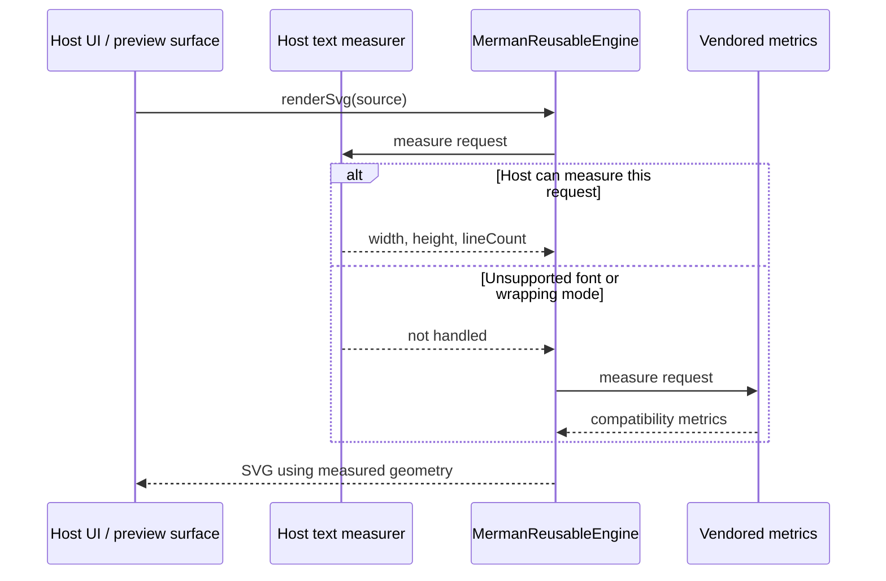

# Host Text Measurement

Status: Draft
Last updated: 2026-06-17

This guide explains how native hosts should use Merman's text-measurement callback and where the
remaining headless-rendering limits are. It complements the exact C ABI contract in
[`FFI_PROTOCOL.md`](FFI_PROTOCOL.md#host-text-measurement).

## Problem

Mermaid measures many labels inside a browser after CSS, font loading, fallback, shaping, and
rounding have been resolved. Merman renders without a browser, so it must know label geometry before
the final display surface exists.

That is usually good enough with Merman's vendored Mermaid-compatible metrics, but it cannot be
perfect for every host. A browser such as Zen Browser, Chromium, WebKit, an Android `TextView`, an
Apple Core Text view, and a Flutter SVG widget can all choose different fallback fonts or round
glyph advances differently. The result can be small layout drift or clipped HTML labels, such as a
Flowchart decision label ending in `?` when the final font is wider than the headless estimate.

## Best Practice

Measure text with the same text stack that will display the SVG.



Use the callback when exact host geometry matters. Use the default vendored metrics when you need
small dependency footprint, deterministic headless output, or CI-friendly rendering.

## Options

| Option | When to use | Pros | Cons |
| --- | --- | --- | --- |
| Vendored metrics | CLI output, docs generation, CI, simple previews | No host dependency, deterministic, works everywhere | Cannot know host-specific fallback fonts or browser rounding |
| Host callback | Editors, design tools, WebView previews, native previews where clipping is unacceptable | Best fidelity when measurement and display share the same text stack | Requires callback lifecycle, threading, caching, and platform text APIs |
| Browser/WebView measurement service | Hosts that display Merman SVG in a browser surface | Closest to Mermaid's DOM/canvas behavior | UI-thread and async font-loading constraints need careful orchestration |
| Built-in platform font engine in Merman | Future optional feature for hosts without their own measuring stack | Could improve no-callback estimates | Adds dependencies and still cannot exactly match every platform fallback chain |

The callback is a seam, not a promise that all output becomes browser-identical. It is exact only to
the extent that the host measures with the same fonts, line wrapping, white-space behavior, and
surface that will render the SVG.

## C ABI Contract Summary

Install a callback on a reusable engine:

```c
MermanResult merman_engine_set_text_measure_callback(
    MermanEngine* engine,
    MermanHostTextMeasureCallback callback,
    void* user_data
);
```

The request includes:

- `text` as a UTF-8 byte slice.
- `font_family`, `font_size`, `font_weight`, and `font_style`.
- `line_height`, `letter_spacing`, and `word_spacing` in CSS pixels.
- `wrap_mode`, `direction`, and `white_space` constants.
- Optional `max_width` when wrapping is requested.

The callback returns `handled=1` with `width`, `height`, and `line_count`, or `handled=0` to let
Merman fall back for that single request. Invalid, negative, non-finite, or zero-line results are
treated as unsupported by higher-level wrappers.

Request string pointers are valid only during the callback. Copy or decode them immediately if the
host text API needs owned strings.

## Lifecycle And Threading Rules

- Keep the callback and `user_data` alive until it is cleared or the engine is closed.
- Clear the callback before destroying host-side measurement state.
- Do not free a reusable engine while another thread is rendering with it.
- Treat callbacks as synchronous and latency-sensitive. They run during layout.
- If the same reusable engine can render on multiple threads, the callback and all shared font
  caches must be thread-safe.
- Do not call back into the same `MermanReusableEngine` from inside the measurer.
- Return `handled=0` when a request cannot be measured faithfully. A bad "handled" value is worse
  than falling back.

## Android JNI

Use `MermanReusableEngine` with `MermanTextMeasurer`:

```kotlin
val engine = MermanReusableEngine()
engine.setTextMeasurer { request ->
    // Measure with the same text stack used by your preview.
    // Return null for unsupported requests.
    null
}
```

Recommended Android implementation choices:

- Run Merman rendering on a background dispatcher. Rendering is synchronous and can invoke the
  measurer many times.
- Use Android text APIs when the final preview is native Android UI: `TextPaint` for style, `Paint`
  or `TextPaint` width metrics for simple single-line labels, and `StaticLayout.Builder` for
  wrapped labels.
- Match `fontFamily`, `fontSize`, `fontWeight`, `fontStyle`, `letterSpacing`, `lineHeight`,
  `direction`, `whiteSpace`, and `maxWidth` as closely as the host API allows.
- Cache measurements by the full request shape. Flowchart layouts can ask for the same label more
  than once.
- If the final surface is a `WebView`, measure in that same WebView/JavaScript font environment
  only if you can do it without deadlocks. WebView and font-loading work is often UI-thread-bound,
  while Merman's callback is synchronous. A common pattern is to pre-measure or maintain a cache and
  return `null` until the cache is ready.
- The JNI wrapper holds a global reference to the Kotlin measurer and obtains a `JNIEnv` for the
  callback thread. Host measurers still need to be thread-safe if the engine is used concurrently.

Relevant platform references:

- Android JNI tips: <https://developer.android.com/ndk/guides/jni-tips>
- `StaticLayout.Builder`: <https://developer.android.com/reference/android/text/StaticLayout.Builder>
- `TextPaint`: <https://developer.android.com/reference/android/text/TextPaint>

## Apple Swift

The Swift wrapper currently exposes the raw C callback:

```swift
let callback: MermanTextMeasureCallback = { request, userData in
    return MermanTextMeasureResult(
        handled: 0,
        width: 0,
        height: 0,
        line_count: 0
    )
}

try reusable.setTextMeasureCallback(callback)
```

Recommended Apple implementation choices:

- Use Core Text when the final preview is native Apple UI: `CTLine`/typographic bounds for
  single-line labels and `CTFramesetterSuggestFrameSizeWithConstraints` for wrapped attributed
  strings.
- `NSAttributedString.boundingRect(with:options:context:)` is acceptable for AppKit/UIKit hosts
  when it uses the same fonts and paragraph attributes as the display path.
- If the final surface is `WKWebView`, the closest measurement is DOM/canvas in that WebView after
  fonts have loaded. Keep the synchronous callback boundary in mind; prefer a prepared measurement
  service or cache over blocking arbitrary render threads on WebKit.
- Use `userData` for host context. Retain that context for at least as long as the callback is
  installed, and release it after clearing the callback or closing the engine.
- Decode UTF-8 request fields inside the callback; do not store request pointers.
- Use `autoreleasepool` around measurement code that creates Objective-C objects repeatedly.

Relevant platform references:

- Core Text overview: <https://developer.apple.com/documentation/coretext/>
- `CTFramesetter`: <https://developer.apple.com/documentation/coretext/ctframesetter>
- `CTLine`: <https://developer.apple.com/documentation/coretext/ctline>
- `NSAttributedString`: <https://developer.apple.com/documentation/foundation/nsattributedstring>

## Flutter / Dart FFI

Use `MermanReusableEngine` with `setTextMeasurer`:

```dart
final engine = Merman.open().reusableEngine();
engine.setTextMeasurer((request) {
  // Measure with the same surface that will display the SVG.
  // Return null for unsupported requests.
  return null;
});
```

The current Dart wrapper uses `NativeCallable.isolateLocal`, so the native callback must be invoked
on the same isolate thread that created it. That has practical consequences:

- Create the reusable engine, install the measurer, render, and close the engine on the same Dart
  isolate.
- Do not pass a measured `MermanReusableEngine` to another isolate.
- Always call `close()` when finished; closing releases the native engine and the Dart callback.
- Keep the measurer fast and synchronous. Dart's `NativeCallable.listener` can be invoked from any
  thread, but it only supports asynchronous `void` callbacks, so it is not a fit for this
  synchronous measurement ABI.

Recommended Flutter implementation choices:

- If displaying through `webview_flutter`, measure in a WebView/JavaScript service using canvas or
  DOM APIs after fonts are loaded, then feed cached results into the synchronous measurer.
- If displaying through a native SVG widget, use the same package's text measurement behavior if it
  exposes one. Otherwise prefer the vendored fallback plus non-clipping output.
- If rendering in pure Dart UI, use Flutter paragraph/text layout APIs in the same isolate and with
  the same font registration as the preview.

Relevant platform references:

- Dart `NativeCallable`: <https://api.dart.dev/dart-ffi/NativeCallable-class.html>
- `NativeCallable.isolateLocal`: <https://api.dart.dev/dart-ffi/NativeCallable/NativeCallable.isolateLocal.html>
- `NativeCallable.listener`: <https://api.dart.dev/dart-ffi/NativeCallable/NativeCallable.listener.html>

## Browser Or WebView Measurement

For browser-like hosts, the usual measurement adapter is:

1. Load the same CSS and fonts as the preview surface.
2. Wait for font readiness where possible.
3. Build a CSS `font` string from the Merman request.
4. Use `CanvasRenderingContext2D.measureText()` for single-line width.
5. Use DOM measurement for wrapped HTML labels when `maxWidth` and `white-space` matter.
6. Return `handled=0` for CSS features the adapter does not model.

Canvas is useful for advances, but wrapped HTML labels often need DOM measurement because line
breaking, white-space, and inline layout are part of the browser's layout engine.

Relevant web references:

- `CanvasRenderingContext2D.measureText()`: <https://developer.mozilla.org/en-US/docs/Web/API/CanvasRenderingContext2D/measureText>
- `TextMetrics`: <https://developer.mozilla.org/en-US/docs/Web/API/TextMetrics>
- `Document.fonts` / CSS Font Loading API:
  <https://developer.mozilla.org/en-US/docs/Web/API/Document/fonts>

## Testing Recommendations

Add host-level tests for the cases that motivated the integration:

- `flowchart TD; A[Start] --> B{Condition?}` with the host's default UI font.
- Long labels near wrapping thresholds.
- Labels with punctuation, CJK text, emoji, and mixed LTR/RTL runs if the app supports them.
- The same diagram rendered with the default vendored metrics and with the host callback installed.
- A fallback path where the measurer intentionally returns unsupported.

Do not assert exact pixels across unrelated platforms. Assert that text is visible, labels are not
clipped, and known host regressions stay fixed.
