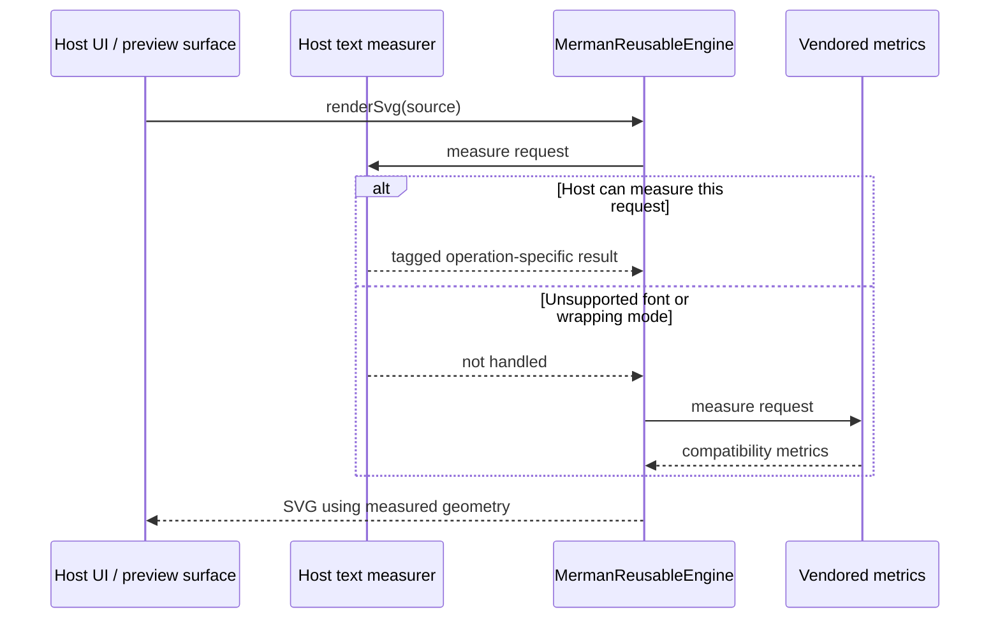

# Host Text Measurement

Status: Draft
Last updated: 2026-07-16

This guide explains how native hosts should use Merman's text-measurement callback and where the
remaining headless-rendering limits are. It complements the exact C ABI contract in
[`FFI_PROTOCOL.md`](FFI_PROTOCOL.md#host-text-measurement).

## Problem

Mermaid measures many labels inside a browser after CSS, font loading, fallback, shaping, and
rounding have been resolved. Merman renders without a browser, so it must know label geometry before
the final display surface exists.

That is usually good enough with Merman's vendored Mermaid-compatible metrics, but it cannot be
perfect for every host. A browser such as Zen Browser, Chromium, WebKit, an Android `TextView`, an
Apple Core Text view, and a Flutter SVG widget can all choose different fallback fonts or round
glyph advances differently. The result can be small layout drift or clipped HTML labels, such as a
Flowchart decision label ending in `?` when the final font is wider than the headless estimate.

This surfaced publicly in [issue #9](https://github.com/Latias94/merman/issues/9): the same
Flowchart condition label was visible in Chrome but clipped in Zen Browser on Linux. That kind of
report is useful because it shows the real boundary: the source text and UTF-8 handling are fine,
but the final browser's resolved font metrics differ from what a dependency-light headless renderer
can safely predict.

## Best Practice

Measure text with the same text stack that will display the SVG.


```mermaid
sequenceDiagram
    participant Host as Host UI / preview surface
    participant Adapter as Host text measurer
    participant Engine as MermanReusableEngine
    participant Fallback as Vendored metrics

    Host->>Engine: renderSvg(source)
    Engine->>Adapter: measure request
    alt Host can measure this request
        Adapter-->>Engine: tagged operation-specific result
    else Unsupported font or wrapping mode
        Adapter-->>Engine: not handled
        Engine->>Fallback: measure request
        Fallback-->>Engine: compatibility metrics
    end
    Engine-->>Host: SVG using measured geometry
```

Use the callback when exact host geometry matters. Use the default vendored metrics when you need
small dependency footprint, deterministic headless output, or CI-friendly rendering.

## What Merman Changed

Merman uses a layered strategy instead of pretending there is one universal font measurement answer:

1. The default renderer still uses vendored Mermaid-compatible metrics. This keeps the CLI, CI,
   documentation builds, server-side batch rendering, and embedders such as editors dependency-light
   and deterministic.
2. Flowchart HTML labels are made non-clipping by default so small browser/font differences are less
   likely to hide trailing punctuation.
3. Hosts that already own the final display stack can install a synchronous measurement callback on
   a reusable engine. Browser and WebView hosts should measure with DOM/canvas after fonts are ready;
   Android, Apple, and Flutter hosts should measure with their own native text layout APIs.
4. Unsupported requests intentionally fall back per request. Returning "not handled" is better than
   returning a guessed size from the wrong font stack.
5. The playground exposes browser-vs-headless measurement and font-stack switches so issues like #9
   can be reproduced with an explicit environment instead of hidden global browser state.

The alternative would be to ship a heavier Rust-side font discovery, fallback, shaping, and layout
engine. That can improve some no-callback estimates, but it still cannot exactly match every
browser, WebView, platform UI toolkit, installed font set, or user stylesheet. Merman therefore keeps
that as a future optional feature candidate rather than a baseline dependency.

## Quick Decision Checklist

You probably do not need a host measurer when the SVG is generated for a CLI, static docs, CI
snapshots, batch server rendering, or another pipeline where deterministic output matters more than
matching a live UI font stack.

You should consider a host measurer when the SVG is displayed in an editor, preview pane, design
tool, WebView, or native app surface where clipped labels or host-specific font fallback are user
visible. Start with one or two fixtures that reproduce the problem, then expand only if the callback
improves those cases.

For each platform, answer these questions before installing a callback:

1. Which surface will display the SVG: browser/WebView, native text, Flutter widget, rasterizer, or
   a mix?
2. Can that same surface measure synchronously during render, or do you need a precomputed cache?
3. Are the exact fonts registered and loaded before measurement starts?
4. Does the measurement API support the requested wrapping and white-space mode?
5. What should return unsupported so Merman can fall back safely?

## Options

| Option | When to use | Pros | Cons |
| --- | --- | --- | --- |
| Vendored metrics | CLI output, docs generation, CI, simple previews | No host dependency, deterministic, works everywhere | Cannot know host-specific fallback fonts or browser rounding |
| Host callback | Editors, design tools, WebView previews, native previews where clipping is unacceptable | Best fidelity when measurement and display share the same text stack | Requires callback lifecycle, threading, caching, and platform text APIs |
| Browser/WebView measurement service | Hosts that display Merman SVG in a browser surface | Closest to Mermaid's DOM/canvas behavior | UI-thread and async font-loading constraints need careful orchestration |
| Built-in platform font engine in Merman | Future optional feature for hosts without their own measuring stack | Could improve no-callback estimates | Adds dependencies and still cannot exactly match every platform fallback chain |

The callback is a seam, not a promise that all output becomes browser-identical. It is exact only to
the extent that the host measures with the same fonts, line wrapping, white-space behavior, and
surface that will render the SVG.

## C ABI Contract Summary

The operation-aware text-measurement request and tagged result described here use C ABI v2
(`MERMAN_ABI_VERSION == 2`). Install a callback on a reusable engine:

```c
MermanResult merman_engine_set_text_measure_callback(
    MermanEngine* engine,
    MermanHostTextMeasureCallback callback,
    void* user_data
);
```

The request includes:

- `text` as a UTF-8 byte slice.
- `font_family`, `font_size`, `font_weight`, and `font_style`.
- `line_height`, `letter_spacing`, and `word_spacing` in CSS pixels.
- `wrap_mode`, `direction`, and `white_space` constants.
- Optional `max_width` when wrapping is requested.
- `phase`, which identifies the routing stage that requested the measurement:
  `MERMAN_TEXT_MEASUREMENT_PHASE_LAYOUT`, `MERMAN_TEXT_MEASUREMENT_PHASE_WRAP`,
  `MERMAN_TEXT_MEASUREMENT_PHASE_SVG_BBOX`,
  or `MERMAN_TEXT_MEASUREMENT_PHASE_COMPUTED_LENGTH`.
- `operation`, which identifies the exact browser/platform primitive and therefore the required
  result shape.

The stable operation mapping is:

| Code | Operation | Expected result kind |
| ---: | --- | --- |
| 0 | `measure` | `metrics` |
| 1 | `computed-length` | `length` |
| 2 | `bbox-x` | `horizontal-extents` |
| 3 | `bbox-x-with-ascii-overhang` | `horizontal-extents` |
| 4 | `title-bbox-x` | `horizontal-extents` |
| 5 | `simple-bbox-width` | `length` |
| 6 | `raw-bbox-width` | `length` |
| 7 | `tspan-bbox-width` | `length` |
| 8 | `tspan-bbox-height` | `length` |
| 9 | `wrap-probe-bbox-width` | `length` |
| 10 | `simple-bbox-height` | `length` |
| 11 | `wrapped` | `metrics` |
| 12 | `wrapped-with-raw-width` | `wrapped-with-raw-width` |
| 13 | `bounding-client-rect-width` | `length` |
| 14 | `create-text-bbox-y-offset` | `length` (signed) |
| 15 | `mermaid-calculate-text-dimensions` | `metrics` |
| 16 | `canvas-measure-text-width` | `length` |
| 17 | `create-text-middle-bbox-y-offset` | `length` (signed) |
| 18 | `raw-bbox-height` | `length` |

The four stable result kinds are `metrics` (`width`, `height`, `line_count`), `length` (`length`),
`horizontal-extents` (`bbox_left`, `bbox_right`), and `wrapped-with-raw-width` (metrics plus an
optional `raw_width`). The C ABI carries their numeric codes 0 through 3 in `result_kind`; UniFFI
uses `MermanTextMeasurementResultKind`; Web uses the `kind` discriminant.

The callback returns `handled=1` with the exact result kind required by `operation`, or `handled=0`
to let Merman fall back for that single request. Operation 14,
`create-text-bbox-y-offset`, mirrors an ordinary `createFormattedText(...).getBBox().y`. Operation
17, `create-text-middle-bbox-y-offset`, mirrors the same formatted text after Architecture's outer
label group contributes inherited `dominant-baseline="middle"`. The middle baseline changes
`getBBox().y` according to the resolved font's baseline and x-height, so operation 14 is not a valid
answer for operation 17. Both operations carry a finite signed `length`; other lengths and all
metric/extents dimensions must be non-negative. A handled result with the wrong kind, missing
required fields, an invalid/non-finite value, or zero metric lines is recorded as `Invalid`; a
callback exception/error is recorded as `Error`; an unsupported result is recorded as `Missing`.
All three use the configured per-request fallback and do not abort the enclosing render. A raw C
callback must catch any host-language exception before it crosses the C ABI boundary and normally
return `handled=0` because the value-returning C callback cannot transport an exception.

A browser adapter should use two isolated formatted-text probes, or explicitly clear inherited
baseline and anchor state between requests. The ordinary probe has no inherited middle baseline;
the Architecture probe applies the outer group's `alignment-baseline="middle"`,
`dominant-baseline="middle"`, and `text-anchor="middle"` before reading the descendant text bbox.
If a host cannot reproduce that DOM and font state, it should leave operation 17 unhandled rather
than derive it from operation 14.

Operation 18, `raw-bbox-height`, reads the non-negative `height` from
`<text>TEXT_CONTENT</text>.getBBox()` with the requested font style. It intentionally uses direct
text content, not a `<tspan>` and not a Mermaid text-construction helper, so hosts must preserve
that DOM shape or leave the operation unhandled.

Request string pointers are valid only during the callback. Copy or decode them immediately if the
host text API needs owned strings.

## Lifecycle And Threading Rules

- Keep the callback and `user_data` alive until it is cleared or the engine is closed.
- Clear the callback before destroying host-side measurement state.
- Do not free a reusable engine while another thread is rendering with it.
- Treat callbacks as synchronous and latency-sensitive. They run during layout.
- If the same reusable engine can render on multiple threads, the callback and all shared font
  caches must be thread-safe.
- Do not call back into the same `MermanReusableEngine` from inside the measurer.
- Return `handled=0` when a request cannot be measured faithfully. A bad "handled" value is worse
  than falling back.

## Python UniFFI

Use the `MermanTextMeasurer` protocol with a reusable engine:

```python
import merman


class PreviewMeasurer(merman.MermanTextMeasurer):
    def measure(self, request):
        return None


engine = merman.MermanEngine()
reusable = engine.reusable_engine_with_text_measurer(None, PreviewMeasurer())
```

For long-lived preview surfaces, call `set_text_measurer()` when the host text stack becomes
available and `clear_text_measurer()` before destroying the host-side measurement state. Returning
`None` from `measure()` leaves that single request on Merman's vendored fallback metrics. Invalid
metrics and callback exceptions or errors have the same per-request behavior: Merman uses the
vendored fallback and continues the enclosing layout or render operation.
Use `diagram_family_capabilities()` to decide whether a diagram family can render through the
current Python binding before installing host-specific measurement logic.

## Android JNI

Use `MermanReusableEngine` with `MermanTextMeasurer`:

```kotlin
val engine = MermanReusableEngine()
engine.setTextMeasurer { request ->
    // Measure with the same text stack used by your preview.
    // Return null for unsupported requests.
    null
}
```

Recommended Android implementation choices:

- Run Merman rendering on a background dispatcher. Rendering is synchronous and can invoke the
  measurer many times.
- Use Android text APIs when the final preview is native Android UI: `TextPaint` for style, `Paint`
  or `TextPaint` width metrics for simple single-line labels, and `StaticLayout.Builder` for
  wrapped labels.
- Set `TextPaint.textSize`, `typeface`, `letterSpacing`, locale, and text direction from the
  request where the host supports them. Apply font fallback through the same font registration or
  `Typeface` resolution used by the view that will display the SVG.
- For `MERMAN_WRAP_MODE_HTML_LIKE`, first measure the natural single-line width. Only constrain to
  `maxWidth` when the natural width exceeds the request's `maxWidth`; short labels should keep
  their natural width.
- Match `fontFamily`, `fontSize`, `fontWeight`, `fontStyle`, `letterSpacing`, `lineHeight`,
  `direction`, `whiteSpace`, and `maxWidth` as closely as the host API allows.
- Cache measurements by the full request shape. Flowchart layouts can ask for the same label more
  than once.
- If the final surface is a `WebView`, measure in that same WebView/JavaScript font environment
  only if you can do it without deadlocks. WebView and font-loading work is often UI-thread-bound,
  while Merman's callback is synchronous. A common pattern is to pre-measure or maintain a cache and
  return `null` until the cache is ready.
- The JNI wrapper holds a global reference to the Kotlin measurer and obtains a `JNIEnv` for the
  callback thread. Host measurers still need to be thread-safe if the engine is used concurrently.

Relevant platform references:

- Android JNI tips: <https://developer.android.com/ndk/guides/jni-tips>
- `StaticLayout.Builder`: <https://developer.android.com/reference/android/text/StaticLayout.Builder>
- `TextPaint`: <https://developer.android.com/reference/android/text/TextPaint>

## Apple Swift

The Swift wrapper currently exposes the raw C callback:

```swift
let callback: MermanTextMeasureCallback = { request, userData in
    var result = MermanTextMeasureResult()
    result.handled = 0
    return result
}

try reusable.setTextMeasureCallback(callback)
```

Recommended Apple implementation choices:

- Use Core Text when the final preview is native Apple UI: `CTLine`/typographic bounds for
  single-line labels and `CTFramesetterSuggestFrameSizeWithConstraints` for wrapped attributed
  strings.
- `NSAttributedString.boundingRect(with:options:context:)` is acceptable for AppKit/UIKit hosts
  when it uses the same fonts and paragraph attributes as the display path.
- Build attributed strings from the request's font family, size, weight, style, paragraph direction,
  line height, kern/letter spacing, and wrapping constraint. Resolve missing fonts through the same
  fallback policy used by the final view.
- For HTML-like wrapped labels, do the same two-phase check as browsers: measure natural width
  first, then use the constrained frame only when it exceeds `maxWidth`.
- If the final surface is `WKWebView`, the closest measurement is DOM/canvas in that WebView after
  fonts have loaded. Keep the synchronous callback boundary in mind; prefer a prepared measurement
  service or cache over blocking arbitrary render threads on WebKit.
- Use `userData` for host context. Retain that context for at least as long as the callback is
  installed, and release it after clearing the callback or closing the engine.
- Decode UTF-8 request fields inside the callback; do not store request pointers.
- Use `autoreleasepool` around measurement code that creates Objective-C objects repeatedly.

Relevant platform references:

- Core Text overview: <https://developer.apple.com/documentation/coretext/>
- `CTFramesetter`: <https://developer.apple.com/documentation/coretext/ctframesetter>
- `CTLine`: <https://developer.apple.com/documentation/coretext/ctline>
- `NSAttributedString`: <https://developer.apple.com/documentation/foundation/nsattributedstring>

## Flutter / Dart FFI

Use `MermanReusableEngine` with `setTextMeasurer`:

```dart
final engine = Merman.open().reusableEngine();
engine.setTextMeasurer((request) {
  // Measure with the same surface that will display the SVG.
  // Return null for unsupported requests.
  return null;
});
```

The current Dart wrapper uses `NativeCallable.isolateLocal`, so the native callback must be invoked
on the same isolate thread that created it. That has practical consequences:

- Create the reusable engine, install the measurer, render, and close the engine on the same Dart
  isolate.
- Do not pass a measured `MermanReusableEngine` to another isolate.
- Always call `close()` when finished; closing releases the native engine and the Dart callback.
- Keep the measurer fast and synchronous. Dart's `NativeCallable.listener` can be invoked from any
  thread, but it only supports asynchronous `void` callbacks, so it is not a fit for this
  synchronous measurement ABI.

Recommended Flutter implementation choices:

- If displaying through `webview_flutter`, measure in a WebView/JavaScript service using canvas or
  DOM APIs after fonts are loaded, then feed cached results into the synchronous measurer.
- If displaying through a native SVG widget, use the same package's text measurement behavior if it
  exposes one. Otherwise prefer the vendored fallback plus non-clipping output.
- If rendering in pure Dart UI, use Flutter paragraph/text layout APIs in the same isolate and with
  the same font registration as the preview.
- Include the full request shape in cache keys: operation, phase, text, font family, size, weight,
  style, line height, spacing, wrap mode, white-space mode, direction, and `maxWidth`.
- Do not wait for WebView JavaScript, font loading, platform channels, or another isolate from
  inside the synchronous callback. Pre-measure and cache instead; return `null` when the cache does
  not have a faithful value yet.

Relevant platform references:

- Dart `NativeCallable`: <https://api.dart.dev/dart-ffi/NativeCallable-class.html>
- `NativeCallable.isolateLocal`: <https://api.dart.dev/dart-ffi/NativeCallable/NativeCallable.isolateLocal.html>
- `NativeCallable.listener`: <https://api.dart.dev/dart-ffi/NativeCallable/NativeCallable.listener.html>

## Browser Or WebView Measurement

For browser-like hosts, the usual measurement adapter is:

1. Load the same CSS and fonts as the preview surface.
2. Wait for font readiness where possible.
3. Build the requested direct `<text>`, `<text><tspan>`, or HTML probe shape.
4. Execute the exact `operation`: Mermaid's aggregate text-dimensions calculation,
   `CanvasRenderingContext2D.measureText().width`, `getComputedTextLength()`, `getBBox()`,
   `getBoundingClientRect()`, or wrapped layout as requested.
5. Return the matching tagged result kind without applying adapter-side quantization.
6. Return unsupported for primitives or CSS features the adapter does not model.

Canvas is the correct primitive for `canvas-measure-text-width`, but it is not a substitute for an
operation that explicitly asks for SVG DOM geometry. Wrapped HTML labels need DOM measurement
because line breaking, white-space, and inline layout are part of the browser's layout engine.

For HTML-like labels, avoid setting `width=maxWidth` up front. Measure natural width first with a
nowrap inline/table-cell style; only switch to the wrapped `width=maxWidth` table/block style when
the natural width exceeds `maxWidth`. Otherwise short labels will be reported too wide and can make
the whole diagram expand.

Relevant web references:

- `CanvasRenderingContext2D.measureText()`: <https://developer.mozilla.org/en-US/docs/Web/API/CanvasRenderingContext2D/measureText>
- `TextMetrics`: <https://developer.mozilla.org/en-US/docs/Web/API/TextMetrics>
- `Document.fonts` / CSS Font Loading API:
  <https://developer.mozilla.org/en-US/docs/Web/API/Document/fonts>

## Testing Recommendations

Add host-level tests for the cases that motivated the integration:

- `flowchart TD; A[Start] --> B{Condition?}` with the host's default UI font.
- Long labels near wrapping thresholds.
- Labels with punctuation, CJK text, emoji, and mixed LTR/RTL runs if the app supports them.
- The same diagram rendered with the default vendored metrics and with the host callback installed.
- A fallback path where the measurer intentionally returns unsupported.

Do not assert exact pixels across unrelated platforms. Assert that text is visible, labels are not
clipped, and known host regressions stay fixed.
