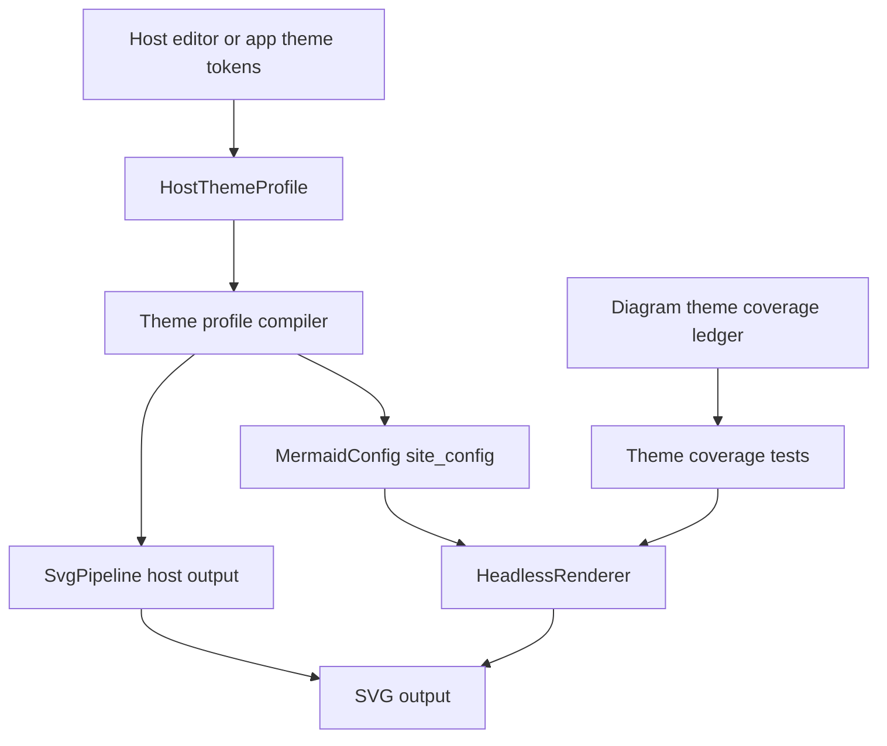

# refactor: Host theme profile and diagram theme coverage

## Summary

This plan adds an opt-in host theme profile layer for editor and application integrations while preserving Mermaid parity as the default renderer contract. The work turns repeated host theme mapping, SVG cleanup, scoped CSS, and per-diagram theme coverage into a typed, documented, and testable merman capability.

---

## Problem Frame

`merman` already accepts Mermaid-compatible `site_config` values and exposes an SVG postprocess pipeline, but host integrations still need to map editor colors into many Mermaid tokens, choose raster-safe cleanup, inject scoped CSS, and patch diagram-specific styling themselves. Zed is the concrete local example, and `repo-ref/modern_mermaid` shows how far product themes can go when they combine Mermaid variables, CSS, chart palettes, and canvas styling.

The refactor must stay broader than Zed. The right boundary is a host-neutral theme profile that compiles into existing Mermaid config and SVG pipeline pieces, plus a diagram coverage ledger that proves each supported diagram family consumes theme variables through the shared render-side theme view where appropriate.

---

## Requirements

- R1. Default SVG rendering and parity baselines must remain unchanged unless the caller opts into a host theme profile or explicit host postprocessors.
- R2. Rust callers must be able to describe host/editor colors through a typed profile instead of hand-building a large `themeVariables` JSON object.
- R3. Binding callers must get an equivalent JSON option shape so C ABI, Android, Apple, Flutter, and Python integrations can use the same profile without new ABI functions.
- R4. The profile compiler must preserve raw Mermaid escape hatches: `site_config`, `themeVariables`, `themeCSS`, and `svg.scoped_css` remain available and overrideable.
- R5. Host output options must compose with existing `SvgPipeline` presets, scoped CSS, root background replacement, duplicate fallback cleanup, and CSS override policy.
- R6. Every supported SVG diagram family must have an explicit theme coverage status, with tests for visible theme signals or a documented reason why no theme surface exists.
- R7. Accent and series palette behavior must be opt-in and product-neutral; merman must not encode Zed color names, GPUI types, or editor-specific class names.
- R8. Documentation and examples must show how a host can adapt editor theme tokens without copying Zed-specific postprocessing.

---

## Scope Boundaries

### In Scope

- A public, host-neutral theme profile API in Rust.
- A binding JSON profile shape that compiles to the same renderer and pipeline options as the Rust API.
- Generic host output composition around existing `SvgPipeline` pieces.
- A per-diagram theme coverage ledger and focused regression tests.
- Migration-oriented examples and docs for editor integrations.

### Out of Scope

- Pixel-perfect cloning of `repo-ref/modern_mermaid` visual themes.
- Zed-specific classes such as `zed-accent-N`, GPUI color types, or Zed player color semantics.
- Changing default `render_svg_sync` parity output.
- Replacing Mermaid-compatible `themeVariables` with a non-Mermaid theme system.

### Deferred to Follow-Up Work

- A low-level XML event-stream postprocessor API, unless profiling later proves the existing string/Cow trait is too expensive.
- Built-in named theme packs beyond a minimal editor-light/editor-dark profile, if the first refactor should stay focused on API shape and coverage.
- Visual snapshot tooling for every theme profile across every fixture; this plan starts with semantic SVG signal tests.

---

## Key Technical Decisions

- KTD1. Opt-in profile layer over default parity: The new host profile compiles into existing `MermaidConfig`, `SvgRenderOptions`, and `SvgPipeline` settings. This keeps Mermaid parity untouched and makes host styling a deliberate contract.
- KTD2. Semantic host roles, Mermaid tokens as output: The public profile names host-facing roles such as canvas, surface, text, border, line, note, actor, activation, and series palette. The compiler translates those roles into Mermaid 11.15.0 `themeVariables` and SVG postprocessors.
- KTD3. Raw escape hatches stay first-class: Callers can still pass `site_config`, `themeVariables`, `themeCSS`, and scoped CSS. Explicit raw values must win over derived defaults so advanced hosts are not boxed into the profile model.
- KTD4. Reuse `SvgPipeline` instead of adding a separate host renderer path: Host profiles should produce or decorate a `SvgPipeline`, preserving ADR-0063 and ADR-0064 pass ordering.
- KTD5. Diagram coverage becomes a maintained ledger: Each diagram family gets a status that names the theme roles it consumes, the tests that cover them, and any accepted residuals. This prevents future diagram additions from silently bypassing host themes.
- KTD6. Accent and chart palette are neutral capabilities: Series palette and accent assignment can be built from caller-provided CSS colors, but generated classes and selectors must use merman-neutral names and remain opt-in.
- KTD7. Rust API and bindings JSON must stay equivalent: The JSON shape should be a serialization of the same conceptual profile, not a weaker or divergent binding-only contract.

---

## High-Level Technical Design

The profile compiler is the only new policy layer. It should derive Mermaid-compatible theme variables and host postprocessors from semantic roles, then hand those results to existing renderer and pipeline APIs. Diagram renderers continue to read effective config through `PresentationTheme` and related helpers.

---

## System-Wide Impact

This change affects public Rust API, shared binding options, SVG output pipeline composition, renderer theme internals, docs, and integration tests. It also creates a stronger compatibility promise for downstream users because theme behavior becomes a product surface rather than an incidental collection of raw JSON keys.

---

## Implementation Units

### U1. Define host theme profile model

- **Goal:** Add the public profile data model and compiler boundary without changing renderer defaults.
- **Requirements:** R1, R2, R4, R7
- **Dependencies:** None
- **Files:** `crates/merman-render/src/svg/theme_profile.rs`, `crates/merman-render/src/svg.rs`, `crates/merman/src/render/mod.rs`, `crates/merman-render/src/lib.rs`
- **Approach:** Introduce a host-neutral profile with role groups for canvas, typography, node surfaces, edges, notes, sequence roles, charts, and optional series/accent palette. The compiler should return Mermaid config fragments and host output options instead of directly rendering SVG.
- **Patterns to follow:** `crates/merman-render/src/svg/parity/theme.rs`, `crates/merman-render/src/svg/pipeline/mod.rs`, `docs/adr/0068-render-side-presentation-theme-view.md`
- **Test scenarios:** Profile defaults compile to no-op values that do not change parity output; a dark editor-like profile emits expected core Mermaid variables; explicit raw Mermaid variables override derived profile roles; invalid or empty CSS color fields are rejected or ignored according to the selected validation policy.
- **Verification:** Rust API exposes the profile from `merman::render`, and existing parity tests still pass without opt-in profile use.

### U2. Add renderer and pipeline composition API

- **Goal:** Let Rust callers apply a host profile through a small builder path rather than manually stitching renderer and pipeline options.
- **Requirements:** R2, R4, R5
- **Dependencies:** U1
- **Files:** `crates/merman/src/render/mod.rs`, `crates/merman-render/src/svg/pipeline/mod.rs`, `crates/merman-render/src/svg/pipeline/builtin/scoped_css.rs`, `crates/merman/examples/example_11_custom_output_environment.rs`
- **Approach:** Add a profile application path that can update `HeadlessRenderer` with derived site config and produce a host-ready `SvgPipeline`. Keep existing `with_site_config` and `SvgPipeline` methods unchanged.
- **Patterns to follow:** `crates/merman/examples/example_06_svg_pipeline.rs`, `crates/merman/examples/example_11_custom_output_environment.rs`, `crates/merman/tests/zed_editor_contract.rs`
- **Test scenarios:** A profile-applied renderer produces the same SVG theme signals as manually supplied equivalent `site_config`; host CSS is injected after Mermaid CSS; `resvg-safe` plus `strip-existing-important` remains available; root background is applied only when requested.
- **Verification:** Host profile composition is ergonomic in an example and does not remove any existing public pipeline API.

### U3. Extend binding JSON with equivalent host profile options

- **Goal:** Make the typed profile usable from shared bindings without ABI expansion.
- **Requirements:** R3, R4, R5
- **Dependencies:** U1, U2
- **Files:** `crates/merman-bindings-core/src/common.rs`, `crates/merman-bindings-core/src/render/request.rs`, `crates/merman-bindings-core/src/render.rs`, `docs/bindings/OPTIONS_JSON.md`
- **Approach:** Add an optional top-level or `svg`-adjacent `theme_profile` object that maps to the Rust profile compiler. Keep `site_config` and `svg.*` behavior unchanged and define merge precedence in the docs.
- **Patterns to follow:** Existing `BindingOptions`, `SvgPipelineOptions`, and validation helpers in `crates/merman-bindings-core/src/common.rs`
- **Test scenarios:** Binding options with a profile render visible text, line, node, note, sequence, chart, and background colors; explicit `site_config.themeVariables` overrides profile-derived variables; invalid profile color values return `MERMAN_INVALID_ARGUMENT`; unknown profile fields are ignored like other options JSON fields.
- **Verification:** `docs/bindings/OPTIONS_JSON.md` shows both profile and raw escape hatch examples.

### U4. Build the diagram theme coverage ledger

- **Goal:** Make theme coverage inspectable and enforceable across all supported SVG diagram families.
- **Requirements:** R6
- **Dependencies:** None
- **Files:** `docs/rendering/diagram-theme-coverage.md`, `crates/merman/tests/theme_renderability_smoke.rs`, `crates/merman/tests/theme_profile_coverage.rs`
- **Approach:** Create a ledger that lists each diagram type, the theme roles or Mermaid variables it consumes, the renderer file path, the test case that covers it, and any known residual. Use the ledger to guide implementation and future reviews.
- **Patterns to follow:** `crates/merman/tests/theme_renderability_smoke.rs`, `docs/workstreams/theme-parity/HANDOFF.md`, `docs/workstreams/headless-parity-deepening/HANDOFF.md`
- **Test scenarios:** The coverage test iterates representative diagrams and asserts profile-derived visible colors appear; families with no meaningful theme surface have an explicit ledger reason; newly supported diagram types fail review if absent from the ledger.
- **Verification:** The ledger covers flowchart, block, class, sequence, state, ER, Gantt, GitGraph, mindmap, journey, quadrant chart, XY chart, timeline, pie, sankey, C4, architecture, packet, kanban, radar, treemap, tree view, requirement, eventmodeling, Ishikawa, Venn, info, and error output where renderable.

### U5. Migrate scattered renderer theme reads into `PresentationTheme`

- **Goal:** Reduce raw theme JSON access in diagram renderers and fill coverage gaps found by U4.
- **Requirements:** R1, R6
- **Dependencies:** U4
- **Files:** `crates/merman-render/src/svg/parity/theme.rs`, `crates/merman-render/src/svg/parity/util.rs`, `crates/merman-render/src/svg/parity/*.rs`, `crates/merman-render/src/svg/parity/*/*.rs`
- **Approach:** Move repeated fallback chains for typography, surfaces, borders, lines, notes, chart palettes, and labels into prepared theme views only where it removes duplication or closes a real gap. Keep diagram-specific Mermaid semantics local when centralization would hide behavior.
- **Patterns to follow:** Existing `node_diagram`, `class_diagram`, `sequence_diagram`, `state_diagram`, `xychart`, `quadrantchart`, `timeline`, `eventmodeling`, and `ishikawa` theme methods.
- **Execution note:** Use characterization tests before changing renderer output for each diagram family.
- **Test scenarios:** Existing theme smoke cases continue to pass; each migrated diagram still respects explicit Mermaid theme variables; host profile colors reach visible SVG elements; no `undefined`, `NaN`, or invalid empty SVG attributes are introduced.
- **Verification:** Direct raw `themeVariables` reads are reduced in the touched renderers, and every migrated family has a focused test case.

### U6. Add opt-in accent and series palette postprocessing

- **Goal:** Provide generic accent and series styling without encoding a specific editor's class names or color model.
- **Requirements:** R5, R7
- **Dependencies:** U1, U2, U4
- **Files:** `crates/merman-render/src/svg/pipeline/builtin/accent.rs`, `crates/merman-render/src/svg/pipeline/builtin/mod.rs`, `crates/merman-render/src/chart_palette.rs`, `crates/merman/tests/theme_profile_coverage.rs`
- **Approach:** Add a neutral postprocessor that can assign merman-owned accent classes or CSS variables from a caller-provided palette. Start with diagram families where the DOM structure is stable enough, and leave unsupported families untouched.
- **Patterns to follow:** `repo-ref/zed/crates/mermaid_render/src/postprocess/accent_colors.rs` as requirements evidence only, `crates/merman-render/src/svg/pipeline/builtin/scoped_css.rs`, `crates/merman-render/src/chart_palette.rs`
- **Test scenarios:** No accent classes appear without opt-in; opt-in palette creates deterministic classes or CSS variables; explicit Mermaid chart palette variables still win; unsupported diagrams remain valid SVG without partial styling.
- **Verification:** The postprocessor is product-neutral and works with both `parity` and `resvg-safe` pipelines.

### U7. Document host integration and migration guidance

- **Goal:** Make the new profile useful to downstream host authors.
- **Requirements:** R8
- **Dependencies:** U1, U2, U3, U4, U6
- **Files:** `docs/rendering/host-theme-profiles.md`, `docs/bindings/OPTIONS_JSON.md`, `crates/merman/examples/example_11_custom_output_environment.rs`, `crates/merman/examples/example_12_host_theme_profile.rs`
- **Approach:** Document profile roles, precedence, pipeline composition, and when to keep using raw Mermaid config or scoped CSS. Include an editor-like example that maps generic UI tokens to profile roles without naming Zed.
- **Patterns to follow:** `docs/adr/0063-extensible-svg-output-pipeline.md`, `docs/adr/0064-host-styling-svg-postprocessors.md`, `crates/merman/examples/example_11_custom_output_environment.rs`
- **Test scenarios:** Examples compile; docs examples match the binding JSON parser shape; migration guidance explains how to replace manual theme variable maps and generic raster-safe cleanup.
- **Verification:** A host author can choose between profile-only, profile plus raw overrides, and raw `site_config` plus custom postprocessors.

### U8. Run focused validation and update release-facing notes

- **Goal:** Prove the refactor is safe enough for alpha users and downstream integrations.
- **Requirements:** R1, R3, R5, R6, R8
- **Dependencies:** U1, U2, U3, U4, U5, U6, U7
- **Files:** `crates/merman/tests/theme_profile_coverage.rs`, `crates/merman-bindings-core/src/render.rs`, `docs/rendering/diagram-theme-coverage.md`, `docs/releasing/*`
- **Approach:** Run formatting and focused nextest suites first, then broaden to renderer/bindings tests if changes touch shared behavior. Update notes only where this creates a new public alpha capability.
- **Patterns to follow:** Existing focused tests under `crates/merman/tests/` and binding tests under `crates/merman-bindings-core/src/render.rs`
- **Test scenarios:** Default parity path unchanged; profile path works through Rust API; profile path works through options JSON; resvg-safe host output remains XML-parseable; diagram coverage tests include every ledger family.
- **Verification:** `cargo fmt` passes, focused `cargo nextest` suites pass, and any skipped broad tests are documented with a reason.

---

## Acceptance Examples

- AE1. A host passes a dark editor-like profile through Rust API and renders flowchart, sequence, class, state, XY chart, and pie diagrams with visible dark surfaces, light text, and configured line/accent colors.
- AE2. A binding caller passes equivalent `options_json` and gets the same visible theme signals plus `resvg-safe` cleanup.
- AE3. A caller supplies profile colors but overrides `themeVariables.nodeBorder`; the explicit Mermaid variable appears in the SVG instead of the derived profile border.
- AE4. A caller renders without a profile and receives the same parity SVG behavior as before.
- AE5. A newly added or enabled diagram family cannot be considered theme-complete until it is listed in the coverage ledger with tests or an explicit residual.

---

## Risks & Mitigations

| Risk | Mitigation |
| --- | --- |
| The profile API overfits Zed. | Keep role names host-neutral, avoid GPUI or Zed classes, and validate against `repo-ref/modern_mermaid` as a different theming style. |
| Derived variables change parity output. | Make profile application opt-in and keep default render paths untouched. |
| Raw override precedence becomes confusing. | Document and test precedence: profile defaults first, explicit `site_config` and explicit SVG options last. |
| Per-diagram migration creates broad SVG churn. | Use characterization tests and migrate only theme reads that close duplication or coverage gaps. |
| Accent postprocessing becomes brittle. | Limit initial accent support to stable SVG structures and keep unsupported diagrams no-op. |
| Bindings diverge from Rust API. | Implement JSON parsing through the same profile compiler used by Rust callers. |

---

## Alternative Approaches Considered

- Keep only raw `site_config` and `scoped_css`: This is already possible, but it pushes a large Mermaid-token map and cleanup policy into every host.
- Add Zed-specific helpers: This would solve one integration but would make merman less useful for other editors and applications.
- Copy `modern_mermaid` theme presets: That would import product style choices rather than improving merman's extension boundary.
- Move all theme policy into `merman-core`: That would mix Mermaid config parity with renderer and host styling policy, contrary to ADR-0068.

---

## Sources & Research

- `docs/adr/0063-extensible-svg-output-pipeline.md`
- `docs/adr/0064-host-styling-svg-postprocessors.md`
- `docs/adr/0068-render-side-presentation-theme-view.md`
- `docs/bindings/OPTIONS_JSON.md`
- `crates/merman-render/src/svg/parity/theme.rs`
- `crates/merman-render/src/svg/pipeline/mod.rs`
- `crates/merman/tests/theme_renderability_smoke.rs`
- `crates/merman/tests/zed_editor_contract.rs`
- `repo-ref/zed/crates/mermaid_render/src/render.rs`
- `repo-ref/zed/crates/mermaid_render/src/postprocess`
- `repo-ref/zed/crates/markdown/src/mermaid.rs`
- `repo-ref/modern_mermaid/src/utils/themes.ts`
