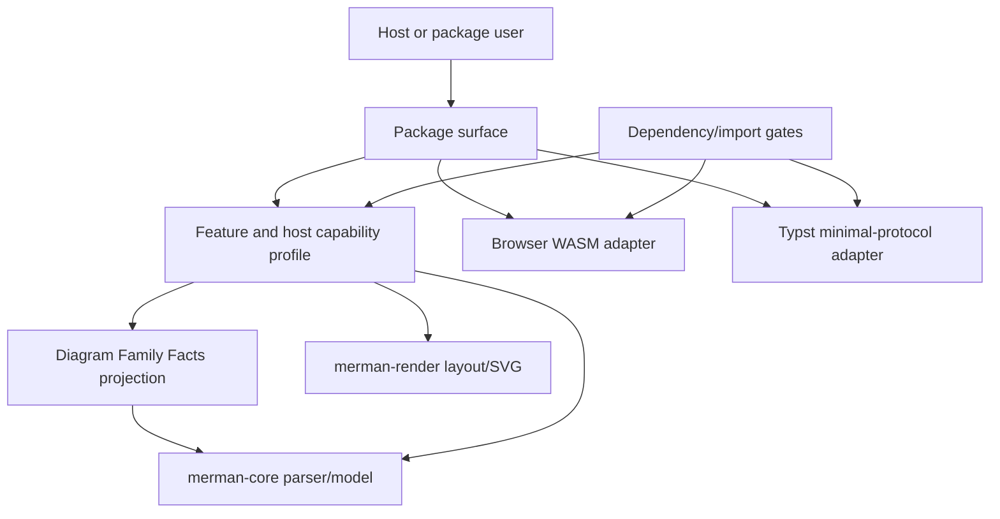

# refactor: WASM feature surface and dependency slimming

## Summary

This plan turns `merman`'s current browser-oriented WASM and broad core dependency surface into explicit feature, host capability, and transport profiles. Full Mermaid parity remains the default posture for normal Rust, native, and browser users, while a pure `wasm32-unknown-unknown` path becomes measurable and suitable for a future Typst wasm-minimal-protocol adapter.

---

## Problem Frame

The current feature graph mixes Mermaid parity scope, host capability scope, and output scope. `merman-core --no-default-features` only changes the detector profile today; direct core dependencies still pull `chrono` clock behavior, `uuid/js`, `web-time`, `lol_html`, `url`, `serde_yaml`, and `json5`. A parser-only WASM probe and `merman-wasm --no-default-features` both still include JS imports, which means the Typst concern is a protocol mismatch, not only a size concern.

Typst loads raw WebAssembly through `wasmi`, requires exported `memory`, calls functions with the wasm-minimal-protocol shape, and links only two `typst_env` imports. Browser `wasm-bindgen` glue, WebCrypto, JS Date/timezone, WASI, console hooks, or JS performance timing are outside that host interface.

---

## Requirements

- R1. Preserve full Mermaid parity as the default user-facing posture for native Rust and browser WASM package users.
- R2. Make `merman-core --no-default-features` a host-neutral profile for `wasm32-unknown-unknown` with no `wasm-bindgen`, `js-sys`, WebCrypto, JS Date, JS performance, or browser panic-hook imports.
- R3. Keep browser WASM and Typst/pure WASM as separate transport surfaces with separate dependency and import allowlists.
- R4. Move time, timezone, random ID generation, and timing instrumentation behind explicit host capability selection instead of implicit calls from core parsing and rendering.
- R5. Make Diagram Family Facts project detector, semantic parser, render parser, supported metadata, and admission status by profile.
- R6. Feature-gate frontmatter YAML, directive JSON5, DOM-like HTML sanitization, and URL canonicalization without weakening default/full security and Mermaid parity behavior.
- R7. Add repeatable dependency, size, and import gates so pure-WASM regressions fail before downstream hosts discover them.
- R8. Document changed feature semantics, package surfaces, unsupported pure-WASM behavior, and any public migration notes.

---

## Scope Boundaries

### In Scope

- Cargo feature redesign across `merman-core`, `merman-render`, `merman`, `merman-bindings-core`, `merman-wasm`, `dugong`, and `manatee`.
- A new experimental Typst or pure-WASM probe crate if it proves the transport seam better than a temporary test harness.
- Host capability profiles for time, local timezone, random IDs, timing, env-based diagnostics, and browser-only panic hooks.
- Dependency slimming for preprocessing, sanitization, URL formatting, and family registration.
- `xtask` or scriptable gates for dependency tree snapshots, import allowlists, exported memory, and size reporting.
- ADR updates when public default feature semantics or package-surface names change.

### Out of Scope

- Reducing Mermaid parity quality to chase size.
- Replacing `dugong`, `manatee`, or RoughJS-equivalent layout/render algorithms.
- Raster/PDF slimming.
- Shipping a polished Typst package before a pure-WASM module is proven loadable.
- Removing `wasm-bindgen` from the browser package.

### Deferred

- Full Typst SVG coverage for every diagram family.
- Rough/hand-drawn parity in pure-WASM output if `roughr` randomness remains unsuitable for the first Typst subset.
- Hard size budgets before WFS-020 produces repeatable measurements.

---

## Key Technical Decisions

- KTD1. Default behavior stays full, but feature edges become explicit: `merman` should depend on `merman-core` with `default-features = false` and activate the full core profile through an explicit default feature. This preserves normal `cargo add merman` behavior while making `default-features = false` meaningful.
- KTD2. Host capabilities are a real seam: time, local timezone, IDs, and timing already have multiple adapters: native, browser, deterministic test/probe, and Typst/pure. Keep the interface small, but stop letting parser modules call host capabilities directly.
- KTD3. Pure-WASM uses deterministic defaults: if the host does not provide current time, local timezone, entropy, or timing, the pure profile uses fixed deterministic behavior or rejects families that require unavailable capabilities.
- KTD4. Diagram Family Facts own profile projection: detectors, semantic parsers, render parsers, supported metadata, and family admission should derive from one fact model instead of scattering `cfg` decisions across registries and adapters.
- KTD5. Full sanitizer parity remains the default security contract: `lol_html`, `url`, YAML, and JSON5 can move behind profile features, but default/full behavior must continue to satisfy ADR-0020 and ADR-0023.
- KTD6. Browser WASM remains browser-shaped: `merman-wasm` keeps `wasm-bindgen`, `serde-wasm-bindgen`, and the browser panic hook. A Typst adapter must be a separate module or crate over a host-neutral byte facade.
- KTD7. Gates come before wide behavior edits: the first implementation unit adds measurement and import checks so every later dependency change has a before/after signal.

---

## High-Level Technical Design

The feature profile chooses Mermaid family scope, host capability scope, and output scope independently. Diagram Family Facts project the registered families for a profile. Transport crates only translate bytes and host protocol details; they do not rebuild parsing or rendering flow.

---

## Implementation Units

### U1. Freeze profile terminology, ADR deltas, and public semantics

- **Goal:** Convert the current workstream evidence into a stable contract before changing features.
- **Requirements:** R1, R2, R3, R8
- **Dependencies:** None
- **Files:** `docs/workstreams/wasm-feature-surface-slimming/DESIGN.md`, `docs/workstreams/wasm-feature-surface-slimming/EVIDENCE_AND_GATES.md`, `docs/adr/0006-feature-flags-tiny-vs-full.md`, `docs/adr/0012-tiny-scope.md`, `docs/adr/0008-async-and-runtime.md`
- **Approach:** Define names for `full`, `tiny`, `pure-wasm`, `browser-wasm`, and `typst-wasm` surfaces. Record whether `merman` default features change from implicit full-core to explicit full-core.
- **Test scenarios:** Documentation states that browser WASM and Typst/pure WASM are separate surfaces; ADR notes preserve full defaults; local probe paths may appear only as evidence, not as source-of-truth paths for implementation.
- **Verification:** `git diff --check -- docs/workstreams/wasm-feature-surface-slimming docs/adr`

### U2. Add dependency, size, import, and export gates

- **Goal:** Make pure-WASM regressions machine-checkable before production behavior changes.
- **Requirements:** R2, R7
- **Dependencies:** U1
- **Files:** `crates/xtask/src`, `docs/workstreams/wasm-feature-surface-slimming/EVIDENCE_AND_GATES.md`, `docs/release`
- **Approach:** Add an `xtask` profile-budget module or equivalent scripts that capture `cargo tree`, `wasm-tools print` imports, exported memory, and size for named profiles. Keep reports generated outside the repo unless a checked release table is being updated.
- **Test scenarios:** A WASM artifact with `__wbindgen_placeholder__` fails the pure-WASM import gate; a Typst probe without exported `memory` fails the export gate; a browser WASM artifact may include `wasm-bindgen` only under the browser profile.
- **Verification:** Gate tests or fixtures exercise both passing and failing import lists.

### U3. Make core time and timezone host-capability driven

- **Goal:** Remove implicit `chrono::Local` use from minimal core parsing while preserving native defaults.
- **Requirements:** R2, R4
- **Dependencies:** U2
- **Files:** `crates/merman-core/Cargo.toml`, `crates/merman-core/src/runtime.rs`, `crates/merman-core/src/time.rs`, `crates/merman-core/src/lib.rs`, `crates/merman-bindings-core/src/common.rs`, `crates/merman-bindings-core/src/render/request.rs`, `crates/merman-bindings-core/src/ascii.rs`
- **Approach:** Split `chrono` default clock support from date/time types. Keep native current-time behavior in full/native profiles. Pure profiles use fixed date and fixed UTC offset unless a caller passes an explicit deterministic value.
- **Test scenarios:** Gantt parsing with no fixed date preserves native/default behavior under full; Gantt parsing under pure profile does not link JS Date; binding options still validate `fixed_today` and `fixed_local_offset_minutes`; invalid offset errors remain stable.
- **Verification:** `cargo nextest run -p merman-core gantt` and the pure-WASM import gate.

### U4. Replace random ID generation with profile-owned IDs

- **Goal:** Remove WebCrypto-backed UUID generation from the pure profile.
- **Requirements:** R2, R4
- **Dependencies:** U2
- **Files:** `crates/merman-core/Cargo.toml`, `crates/merman-core/src/runtime.rs`, `crates/merman-core/src/diagrams/git_graph.rs`, `crates/merman-core/src/diagrams/block.rs`, `crates/merman-core/src/tests`
- **Approach:** Route auto IDs through the host capability profile. Full/native may keep random-looking IDs where Mermaid behavior requires them. Pure-WASM and tests use deterministic IDs.
- **Test scenarios:** `gitGraph` commits without explicit IDs are stable under deterministic profile; block parser generated IDs are stable under deterministic profile; full/default snapshots remain unchanged unless existing nondeterminism already prevents that guarantee; pure-WASM import gate has no WebCrypto imports.
- **Verification:** Focused `gitGraph` and block parser tests plus import allowlist.

### U5. Fence timing, env diagnostics, and debug-only host calls

- **Goal:** Stop `web-time`, env-var diagnostics, and debug printing from entering pure profiles.
- **Requirements:** R2, R4
- **Dependencies:** U2, U3
- **Files:** `crates/merman-core/src/lib.rs`, `crates/merman-render/Cargo.toml`, `crates/dugong/Cargo.toml`, `crates/manatee/Cargo.toml`, `crates/dugong/src`, `crates/manatee/src`, `crates/merman-render/src`
- **Approach:** Add profile-owned timing and diagnostics features. Keep native timing instrumentation available, but compile it out or make it no-op under pure-WASM profiles.
- **Test scenarios:** Full/native timing tests or smoke paths still compile; pure-WASM dependency tree does not contain `web-time`, `js-sys`, or `wasm-bindgen` through timing; render/layout crates still build with default features.
- **Verification:** Dependency gates for `merman-core`, `merman-render`, `dugong`, and `manatee`.

### U6. Split preprocessing dependencies from the minimal parser profile

- **Goal:** Remove mandatory YAML and JSON5 parsing from minimal core while preserving default Mermaid-compatible preprocessing.
- **Requirements:** R2, R6
- **Dependencies:** U2
- **Files:** `crates/merman-core/Cargo.toml`, `crates/merman-core/src/preprocess/mod.rs`, `crates/merman-core/src/error.rs`, `crates/merman-core/src/tests/detect.rs`, `crates/merman-core/src/tests/misc.rs`
- **Approach:** Put frontmatter YAML and directive JSON5 behind compatibility features. The minimal profile should either reject those constructs with documented errors or use a smaller documented parser path if implementation cost is low.
- **Test scenarios:** Default/full frontmatter and directive tests continue to pass; minimal profile has explicit tests for unsupported YAML/JSON5 behavior; dependency gate shows `serde_yaml`, `unsafe-libyaml`, `json5`, and `pest` absent from minimal core.
- **Verification:** Focused preprocess tests under full and minimal profiles.

### U7. Split sanitizer and URL dependencies from the minimal profile

- **Goal:** Feature-gate `lol_html`, `url`, and URL canonicalization transitive dependencies without weakening default security behavior.
- **Requirements:** R2, R6
- **Dependencies:** U2, U6
- **Files:** `crates/merman-core/Cargo.toml`, `crates/merman-core/src/sanitize.rs`, `crates/merman-core/src/utils.rs`, `crates/merman-core/src/common_db.rs`, `crates/merman-core/src/tests`
- **Approach:** Keep DOMPurify-like sanitization and Braintree URL parity in full/default. Add a minimal safe fallback with documented behavior for pure profiles, or require full sanitizer features for families whose labels/links cannot be safely represented without it.
- **Test scenarios:** Full/default sanitization tests from ADR-0020 and ADR-0023 still pass; minimal profile tests prove unsafe URLs do not become executable output; dependency gate shows `lol_html`, `url`, ICU/idna transitive dependencies absent when the minimal sanitizer path is selected.
- **Verification:** Sanitizer tests under both profiles and dependency gates.

### U8. Make Diagram Family Facts profile-specific across registries

- **Goal:** Make family inclusion a single deep module rather than detector-only feature logic.
- **Requirements:** R2, R5
- **Dependencies:** U3, U4, U6
- **Files:** `crates/merman-core/src/baseline.rs`, `crates/merman-core/src/family.rs`, `crates/merman-core/src/detect/mod.rs`, `crates/merman-core/src/diagram/mod.rs`, `crates/merman-core/src/tests/registry.rs`, `crates/merman-bindings-core/src/metadata.rs`
- **Approach:** Extend family facts with profile admission and dependency capability facts. Project detector facts, semantic parser facts, render parser facts, and supported diagram metadata through the chosen profile.
- **Test scenarios:** Full registry order matches the pinned Mermaid baseline; tiny profile keeps the documented tiny detector set; pure profile lists only admitted families; bindings report supported diagrams for the active profile; unsupported family errors name the active profile where useful.
- **Verification:** Registry tests compare every projection to family facts.

### U9. Make `merman` and shared bindings select profiles explicitly

- **Goal:** Ensure facade crates no longer reactivate broad core defaults accidentally.
- **Requirements:** R1, R2, R3, R8
- **Dependencies:** U3, U4, U8
- **Files:** `crates/merman/Cargo.toml`, `crates/merman/src/lib.rs`, `crates/merman-bindings-core/Cargo.toml`, `crates/merman-bindings-core/src/common.rs`, `crates/merman-bindings-core/src/engine.rs`, `crates/merman-ffi/Cargo.toml`, `crates/merman-uniffi/Cargo.toml`
- **Approach:** Change workspace dependency edges to use `default-features = false` where needed and activate full/tiny/pure profiles through named facade features. Keep `cargo add merman` behavior full by default if KTD1's ADR is accepted.
- **Test scenarios:** `merman` default build supports the same parser families as before; `merman --no-default-features` no longer pulls broad core defaults; binding crates default to render/full where they do today; missing feature errors remain structured.
- **Verification:** `cargo tree -p merman --no-default-features --target wasm32-unknown-unknown -e normal --depth 3` and focused facade tests.

### U10. Split browser WASM package presets

- **Goal:** Make browser users choose documented browser bundle presets without pretending the result is Typst-compatible.
- **Requirements:** R1, R3, R7, R8
- **Dependencies:** U8, U9
- **Files:** `crates/merman-wasm/Cargo.toml`, `crates/merman-wasm/src/lib.rs`, `platforms/web`, `docs/bindings`, `docs/release`
- **Approach:** Keep browser `wasm-bindgen` transport as the browser adapter. Add documented presets for core-only, render, ascii, and full browser bundles if the feature graph supports them.
- **Test scenarios:** Browser default build preserves current exported functions; browser slim preset builds and documents its missing functions; browser builds may include `wasm-bindgen` imports but still pass a browser-specific allowlist; TypeScript package smoke still passes if wrapper files change.
- **Verification:** Browser WASM size profile builds and import report.

### U11. Add experimental Typst or pure-WASM transport probe

- **Goal:** Prove a wasm-minimal-protocol module can be built and loaded for a small admitted subset.
- **Requirements:** R2, R3, R4, R5, R7
- **Dependencies:** U3, U4, U5, U8, U9
- **Files:** `crates/merman-typst/Cargo.toml`, `crates/merman-typst/src/lib.rs`, `Cargo.toml`, `docs/bindings`, `docs/workstreams/wasm-feature-surface-slimming/EVIDENCE_AND_GATES.md`
- **Approach:** Add an experimental `cdylib` crate or checked probe that depends on the pure profile and exports wasm-minimal-protocol functions over byte payloads. Start with parse JSON or SVG for a tiny admitted diagram subset.
- **Test scenarios:** WASM imports are only the two `typst_env` protocol imports; exported `memory` exists; exported functions use Typst-compatible integer signatures; a wasmi or Typst smoke call returns bytes for an admitted flowchart or sequence fixture; unsupported families return deterministic errors.
- **Verification:** Import allowlist, export gate, and smoke output.

### U12. Release docs, compatibility notes, and closeout verification

- **Goal:** Make the new feature surface understandable for downstream users and future maintainers.
- **Requirements:** R1, R3, R7, R8
- **Dependencies:** U10, U11
- **Files:** `README.md`, `crates/merman/README.md`, `crates/merman-core/README.md`, `crates/merman-wasm/README.md`, `docs/bindings`, `docs/release`, `docs/workstreams/wasm-feature-surface-slimming/WORKSTREAM.json`
- **Approach:** Document package surfaces, default feature behavior, pure-WASM limitations, import budgets, and migration notes. Record residual unsupported diagrams and split follow-up work if needed.
- **Test scenarios:** Docs distinguish browser WASM from Typst/pure WASM; examples compile for documented feature sets; release notes include dependency/import measurements; closeout updates the workstream status.
- **Verification:** `cargo fmt --all --check`, focused `cargo nextest` suites for touched crates, browser WASM preset builds, Typst/pure import gate, and docs diff checks.

---

## Acceptance Examples

- AE1. A downstream Typst probe depending on the pure profile builds a `wasm32-unknown-unknown` module with no `wasm-bindgen`, `js-sys`, WebCrypto, JS Date, JS performance, WASI, or browser panic-hook imports.
- AE2. `merman-wasm` default browser build still exposes browser-friendly `renderSvg`, `parseJson`, `layoutJson`, validation, metadata, and optional ASCII functions according to its documented features.
- AE3. A pure profile parse of an admitted flowchart fixture returns deterministic JSON or SVG bytes with no host time or entropy access.
- AE4. A Gantt fixture using fixed date and fixed local offset produces the same output across native and pure profiles for the admitted path.
- AE5. A diagram family excluded from pure profile reports a deterministic unsupported-family error rather than compiling in hidden dependencies.
- AE6. Release docs show a size/import table for parser-only, browser default, browser slim, and Typst/pure probe profiles.

---

## Risks & Mitigations

| Risk | Mitigation |
| --- | --- |
| Cargo feature changes surprise existing users. | Preserve default behavior through explicit default features and record the change in ADR/docs before release. |
| Minimal sanitizer behavior weakens safety. | Keep full sanitizer as default; define minimal fallback tests that fail closed for unsafe links and labels. |
| Family gating creates accidental parity gaps. | Drive registration from family facts and require profile-specific registry tests. |
| Timing/debug code keeps JS imports alive. | Add import gates early and fence `web-time`, env diagnostics, and browser hooks by profile. |
| Typst transport starts too broad. | Admit a small subset first and return deterministic unsupported errors for the rest. |
| Browser package naming remains ambiguous. | Keep `merman-wasm` documentation explicit: browser/JS WASM, not generic WASM. |

---

## Sources & Research

- `docs/workstreams/wasm-feature-surface-slimming/DESIGN.md`
- `docs/workstreams/wasm-feature-surface-slimming/EVIDENCE_AND_GATES.md`
- `docs/workstreams/wasm-feature-surface-slimming/TODO.md`
- `repo-ref/typst/crates/typst-library/src/foundations/plugin.rs`
- `docs/adr/0006-feature-flags-tiny-vs-full.md`
- `docs/adr/0012-tiny-scope.md`
- `docs/adr/0008-async-and-runtime.md`
- `docs/adr/0020-sanitization-and-security-level.md`
- `docs/adr/0023-url-sanitization-braintree-port.md`
- `docs/adr/0066-ffi-binding-strategy.md`
- `https://github.com/HSGamer/typst-mmdr/issues/4#issuecomment-4624101901`
