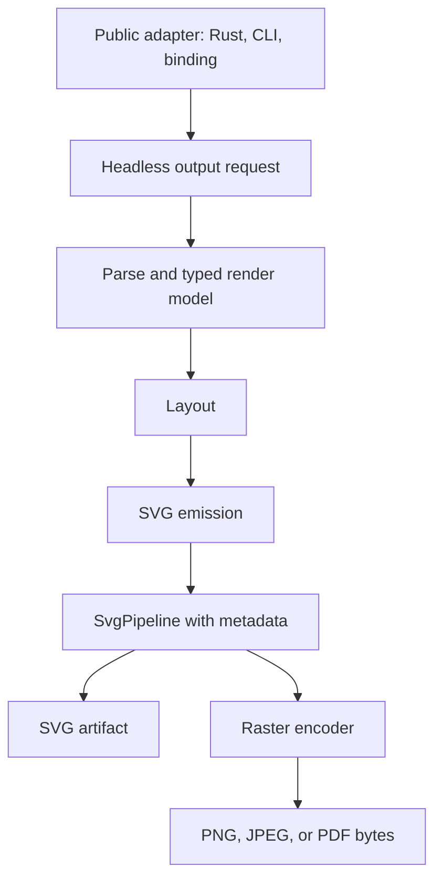

# refactor: Headless render operation output pipeline

## Summary

This plan deepens the Headless Render Operation so SVG, readable SVG, resvg-safe SVG, PNG, JPEG, and PDF all flow through one output-oriented operation. Public adapters keep selecting input and output shape, but they stop rebuilding pipeline selection, metadata assembly, and raster preconditions independently.

---

## Problem Frame

`CONTEXT.md` defines the canonical Headless Render Operation as parse, typed render model construction, layout, SVG emission, postprocess metadata, and pipeline ordering behind one behavior-bearing module. `crates/merman/src/render/operation.rs` already centralizes the typed SVG path, but raster output is still assembled in `HeadlessRenderer`, `crates/merman/src/render/raster.rs`, and `crates/merman-cli/src/render.rs`. That duplication makes it easy for SVG output, CLI raster output, and binding output to drift on pipeline ordering and metadata.

The first formal-version refactor should make the operation own the common output pipeline without changing the public default parity SVG contract.

---

## Requirements

- R1. Default `render_svg_sync` output must remain Mermaid-parity SVG unless the caller supplies a pipeline or host profile.
- R2. Raster helpers must use the same parsed render model and postprocess metadata path as SVG helpers.
- R3. PNG, JPEG, and PDF output must default to a resvg-safe pipeline unless the caller explicitly supplies a renderer-owned pipeline.
- R4. CLI raster output must not apply generic resvg-safe cleanup twice after a diagram has already rendered through a resvg-safe operation path.
- R5. Raw SVG raster input in the CLI must keep its current behavior: apply the raw-SVG raster pipeline, preserve title/desc metadata, and then rasterize.
- R6. Binding SVG output must continue honoring binding-selected pipeline, host theme output, scoped CSS, root background, and CSS override policy.
- R7. Error behavior for no-diagram, parse/render failure, invalid raster options, and feature-gated raster formats must remain compatible with existing callers.
- R8. The refactor must add tests that pin operation-level pipeline choice and adapter-level parity so future adapters do not reintroduce duplicate flow.

---

## Scope Boundaries

### In Scope

- A shared output request/result boundary under `crates/merman/src/render/operation.rs`.
- Public `merman::render` and `HeadlessRenderer` helpers rewritten to delegate SVG and raster output to that boundary.
- CLI raster path cleanup so diagram renders use the operation-selected pipeline once.
- Focused tests for SVG metadata, raster pipeline choice, and CLI raw SVG raster behavior.

### Out of Scope

- Changing Mermaid-parity SVG DOM output or fixture baselines.
- Reworking `SvgPipeline` public trait shape or postprocessor ordering semantics from ADR-0063 and ADR-0064.
- Moving ASCII rendering into the Headless Render Operation in this slice.
- Adding raster byte outputs to bindings that currently expose only SVG and JSON.
- Solving browser-dependent differences such as `foreignObject`, font rendering, or exact PDF pagination.

### Deferred to Follow-Up Work

- A second pass that makes bindings build pipeline options through a public reusable output-plan API instead of a binding-local `SvgPipelineOptions`.
- A full adapter contract matrix that proves CLI, bindings, FFI, UniFFI, WASM, and Rust facade all project from the same operation.
- Moving raw SVG raster input into a first-class operation variant if more non-CLI hosts need that path.

---

## Key Technical Decisions

- KTD1. Operation-owned output target: Add an operation-level output method that accepts an explicit target such as parity SVG, pipeline SVG, PNG, JPEG, or PDF. This keeps adapters from repeating parse, layout, SVG emission, metadata, and pipeline ordering.
- KTD2. Preserve parity as the zero-pipeline default: `render_svg_sync` stays equivalent to `SvgPipeline::parity()` and should not silently run readable or resvg-safe passes.
- KTD3. Raster is a postprocessed-SVG output, not a separate renderer: PNG, JPEG, and PDF should be implemented as "render SVG through selected pipeline, then encode bytes." This matches ADR-0059 without inventing another layout path.
- KTD4. Renderer-owned pipeline wins for raster helpers: If `HeadlessRenderer` was constructed with `with_svg_pipeline` or host theme output, raster helpers use that pipeline; otherwise they select `SvgPipeline::resvg_safe()`.
- KTD5. CLI owns only CLI-specific postprocessors: CLI background and CSS options should compose into the pipeline before operation rendering, while raster encoding should receive already-prepared SVG bytes and not call `svg_resvg_safe` again for diagram inputs.
- KTD6. Raw SVG input remains adapter-specific for now: Raw `<svg>` input is not parsed into a Mermaid render model, so the CLI keeps a small raw-SVG branch that applies the raster pipeline and calls raster encoders directly.

---

## High-Level Technical Design

The operation should continue returning `Option` for no-diagram inputs. Adapter-level errors such as CLI `NoDiagram` stay in adapter code because they reflect public interface policy, not render semantics.

---

## System-Wide Impact

This change touches the public Rust facade, raster feature helpers, CLI output generation, and binding SVG request flow. It is a refactor of behavior ownership, so the validation strategy must pin both unchanged outputs and removed duplicate cleanup. The highest-risk area is double-applying postprocessors in the CLI because host CSS and background passes intentionally append nodes and styles.

---

## Implementation Units

### U1. Define operation-level output request and artifact types

- **Goal:** Give `HeadlessOperation` a typed boundary for SVG and raster output without exposing a premature public API.
- **Requirements:** R1, R2, R3, R7
- **Dependencies:** None
- **Files:** `crates/merman/src/render/operation.rs`, `crates/merman/src/render/mod.rs`, `crates/merman/src/render/raster.rs`
- **Approach:** Introduce crate-private types for output target, prepared SVG parts, and rendered artifact bytes. Keep the initial boundary `pub(super)` so the public API can stabilize after adapter convergence proves the shape.
- **Patterns to follow:** `crates/merman/src/render/operation.rs`, `crates/merman-render/src/svg/pipeline/mod.rs`, `docs/adr/0063-extensible-svg-output-pipeline.md`
- **Test scenarios:** Parity SVG target equals current default SVG helper; pipeline SVG target passes diagram type, title, and root SVG id into postprocessors; no-diagram input returns `None` without raster work.
- **Verification:** Existing `svg_pipeline_tests` still pass and new operation tests cover both default and explicit pipeline targets.

### U2. Move public Rust SVG and raster helpers onto the operation boundary

- **Goal:** Remove duplicate SVG/pipeline/raster selection from `HeadlessRenderer` and `render::raster` free helpers.
- **Requirements:** R1, R2, R3, R7
- **Dependencies:** U1
- **Files:** `crates/merman/src/render/mod.rs`, `crates/merman/src/render/raster.rs`
- **Approach:** Route `render_svg_sync`, `render_svg_with_pipeline_sync`, `render_png_sync`, `render_jpeg_sync`, and `render_pdf_sync` through operation methods. Keep the public function signatures stable.
- **Patterns to follow:** Existing `HeadlessRenderer` builder methods in `crates/merman/src/render/mod.rs`
- **Test scenarios:** `HeadlessRenderer::render_png_sync` uses an explicit renderer-owned pipeline when present; free raster helpers use resvg-safe output; `render_layouted_svg_sync` still applies renderer-owned pipeline for pre-layout callers.
- **Verification:** Focused `merman` tests pass with and without the `raster` feature.

### U3. Normalize CLI diagram output around operation-prepared SVG

- **Goal:** Stop CLI diagram raster output from applying generic resvg-safe cleanup after the diagram has already rendered through a target pipeline.
- **Requirements:** R3, R4, R5, R7
- **Dependencies:** U1, U2
- **Files:** `crates/merman-cli/src/render.rs`, `crates/merman-cli/tests/png_smoke.rs`, `crates/merman-cli/tests/pdf_smoke.rs`
- **Approach:** Keep CLI construction of background and CSS postprocessors, but ensure diagram inputs render through a single selected `SvgPipeline`. Split rasterization into an "already prepared SVG" path for diagram output and a raw-SVG path that still runs raw-SVG cleanup.
- **Patterns to follow:** `svg_postprocess_pipeline` and `raw_svg_raster_pipeline` in `crates/merman-cli/src/render.rs`
- **Test scenarios:** CLI PNG from Mermaid input contains readable text and does not duplicate scoped CSS or root background markers; CLI PNG from raw SVG still goes through resvg-safe cleanup; PDF size validation remains applied before conversion.
- **Verification:** `crates/merman-cli/tests/png_smoke.rs` and `crates/merman-cli/tests/pdf_smoke.rs` pass under the raster feature.

### U4. Keep binding SVG behavior pinned while avoiding operation drift

- **Goal:** Verify binding SVG output remains equivalent after operation refactoring and document any still-local pipeline planning as a deferred boundary.
- **Requirements:** R2, R6, R7, R8
- **Dependencies:** U1, U2
- **Files:** `crates/merman-bindings-core/src/render/request.rs`, `crates/merman-bindings-core/src/render.rs`
- **Approach:** Prefer no public JSON shape changes in this slice. Keep binding pipeline option parsing local, but make its render call consume the same operation-backed `HeadlessRenderer` SVG method as Rust callers.
- **Patterns to follow:** `RenderRequestPlan::render_svg` and existing tests in `crates/merman-bindings-core/src/render.rs`
- **Test scenarios:** Binding options with `svg.pipeline=resvg-safe`, host theme output, scoped CSS, and root background still render expected markers; parse JSON and layout JSON are unchanged.
- **Verification:** Focused `merman-bindings-core` tests that cover render options pass.

### U5. Update documentation breadcrumbs for the new ownership boundary

- **Goal:** Make future adapter work start from the new operation boundary instead of copying CLI or binding logic.
- **Requirements:** R8
- **Dependencies:** U1, U2, U3, U4
- **Files:** `CONTEXT.md`, `docs/adr/0063-extensible-svg-output-pipeline.md`, `docs/rendering/RASTER_OUTPUT.md`
- **Approach:** Add a short note only where current docs would otherwise point readers toward adapter-local composition. Avoid a new ADR unless implementation discovers a public API decision beyond the accepted ADRs.
- **Patterns to follow:** Existing concise architecture boundary notes in `CONTEXT.md`
- **Test scenarios:** Documentation examples still name valid public helpers and do not imply SVG parity output is postprocessed by default.
- **Verification:** Docs and examples remain consistent with the public Rust API after U1-U4.

### U6. Run focused validation and ship the plan

- **Goal:** Prove the refactor preserves behavior while moving ownership.
- **Requirements:** R1, R4, R6, R7, R8
- **Dependencies:** U1, U2, U3, U4, U5
- **Files:** `crates/merman/src/render/operation.rs`, `crates/merman/src/render/mod.rs`, `crates/merman/src/render/raster.rs`, `crates/merman-cli/src/render.rs`, `crates/merman-bindings-core/src/render.rs`
- **Approach:** Format first, then run focused nextest suites for `merman`, `merman-cli`, and `merman-bindings-core`. Widen only if shared render behavior or feature-gated code indicates a broader failure surface.
- **Patterns to follow:** Validation defaults in `CONTEXT.md`
- **Test scenarios:** Default SVG unchanged; custom postprocessor metadata unchanged; raster output succeeds for representative flowchart; CLI raw SVG raster still succeeds; binding SVG options still compose in order.
- **Verification:** `cargo fmt` passes and focused `cargo nextest` commands pass or have documented external blockers.

---

## Acceptance Examples

- AE1. A caller using `HeadlessRenderer::new().render_svg_sync(...)` receives parity SVG without readable or resvg-safe cleanup.
- AE2. A caller using `HeadlessRenderer::new().render_png_sync(...)` receives PNG bytes rendered from resvg-safe SVG, with no separate parse/layout path.
- AE3. A caller using `with_svg_pipeline(SvgPipeline::parity().with_postprocessor(...))` gets the same custom postprocessor metadata when rendering SVG and when rendering PNG.
- AE4. `merman-cli` rendering Mermaid input to PNG applies CLI background and CSS once and does not duplicate generic resvg-safe cleanup.
- AE5. `merman-cli` rendering raw SVG input to PNG still applies the raw-SVG raster pipeline before encoding.
- AE6. Binding `render_svg` with host theme output keeps the same pipeline markers and JSON error behavior as before the refactor.

---

## Risks & Mitigations

| Risk | Mitigation |
| --- | --- |
| Double postprocessing changes CLI output. | Add marker-count assertions for scoped CSS and root background on diagram raster paths. |
| Raster helpers accidentally ignore renderer-owned host pipelines. | Add a custom postprocessor test that renders through `HeadlessRenderer::render_png_sync` and asserts the raster path consumed the prepared SVG. |
| Public API shape leaks before it is proven. | Keep new operation request/result types crate-private in this slice. |
| Binding behavior drifts while CLI and Rust facade improve. | Pin binding render option tests and defer reusable binding option projection as an explicit follow-up. |
| PDF output loses size validation. | Keep PDF validation close to encoding and cover the CLI PDF smoke path. |

---

## Sources

- `CONTEXT.md`
- `crates/merman/src/render/operation.rs`
- `crates/merman/src/render/mod.rs`
- `crates/merman/src/render/raster.rs`
- `crates/merman-cli/src/render.rs`
- `crates/merman-bindings-core/src/render/request.rs`
- `docs/adr/0059-raster-output-strategy.md`
- `docs/adr/0063-extensible-svg-output-pipeline.md`
- `docs/adr/0064-host-styling-svg-postprocessors.md`
- `docs/adr/0066-ffi-binding-strategy.md`
