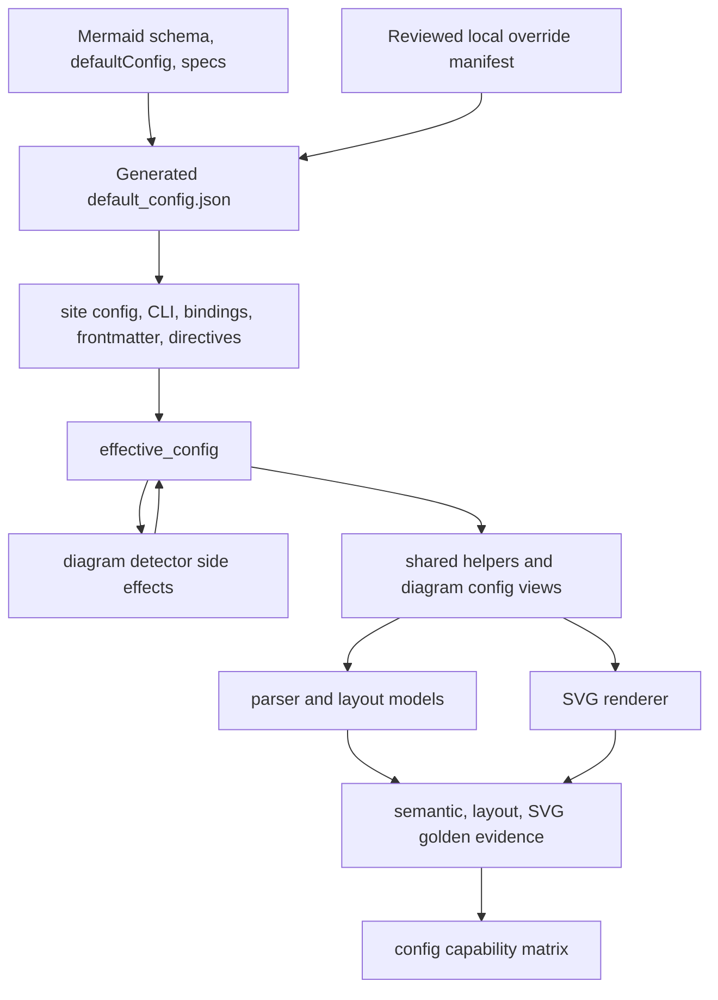

# refactor: Config parity evidence and renderer config views

## Summary

This plan turns Mermaid config support from a broad raw-JSON compatibility surface into a source-backed, testable parity contract. It keeps the existing raw config model, adds stronger evidence around effective config behavior, aligns generated defaults with admitted diagram families, and narrows renderer config reads behind diagram-local views.

---

## Problem Frame

`merman` already accepts Mermaid-compatible config through site config, CLI config files, bindings `options_json`, frontmatter, and init directives. The remaining gap is proof: unknown fields are preserved and many defaults are present, but only some fields are known to affect detection, layout, or SVG output. Because Mermaid parity treats configuration semantics as part of the spec, the project needs a repeatable way to say whether a field is merely accepted, merged into `effective_config`, consumed by parser/layout/render logic, or demonstrated in golden output.

---

## Requirements

**Config contract**

- R1. Preserve `MermaidConfig` as a raw JSON tree with deep merge and clone-on-write behavior.
- R2. Keep Mermaid defaults generated from the pinned `repo-ref/mermaid` schema and `defaultConfig.ts` behavior.
- R3. Align default-config local overrides with the diagram admission inventory so admitted families are not accidentally removed from generated defaults.
- R4. Document config support with separate statuses for accepted, merged, consumed, and rendered behavior.

**Parity evidence**

- R5. Add source-backed tests for config merge precedence, frontmatter/directive handling, `htmlLabels`, `theme`, `themeVariables`, `themeCSS`, `look`, and detector-driven layout fields.
- R6. Import or add official Mermaid-derived fixtures only when they prove config semantics or rendered config effects.
- R7. Every new config fixture must have the appropriate semantic, layout, or upstream SVG golden evidence for the behavior it claims.

**Renderer maintainability**

- R8. Move repeated renderer config fallback rules into shared helpers or diagram-local config views only when the extraction preserves Mermaid semantics.
- R9. Keep browser-dependent residuals explicit; do not broaden DOM normalization or hide config drift in comparator policy.
- R10. Keep Rust API, CLI, and bindings config entry points behaviorally aligned where they expose the same Mermaid config concept.

---

## Key Technical Decisions

- KTD1. Keep raw config as the compatibility base: Mermaid's config schema is large and moving, so full Rust struct typing would make upstream alignment harder. Type only fields that influence behavior or tests.
- KTD2. Treat capability status as a four-stage contract: `accepted` means parsed or preserved, `merged` means present in `effective_config`, `consumed` means parser/layout/render code reads it, and `rendered` means a golden or SVG assertion proves visible output impact.
- KTD3. Use upstream source as fixture authority: candidate config tests should trace to `repo-ref/mermaid/packages/mermaid/src/config.spec.ts`, `diagram-api/frontmatter.spec.ts`, `schemas/config.schema.yaml`, `defaultConfig.ts`, or diagram-specific upstream specs.
- KTD4. Prefer focused golden additions over corpus expansion: add only fixtures that pin a config behavior not already covered, then run the relevant layout and SVG compare gates.
- KTD5. Centralize fallback rules only after characterization: helpers for `htmlLabels`, font family, font size, `look`, and numeric CSS parsing are useful only if tests first lock the current Mermaid-compatible precedence.
- KTD6. Do not treat `layout=elk` plumbing as ELK parity: detector side effects and effective config should be tested, while full Flowchart ELK layout remains out of scope.

---

## High-Level Technical Design

The implementation keeps the current config pipeline intact. The new work adds evidence and small refactors around that pipeline, then records which fields are proven at each capability stage.

---

## Scope Boundaries

- Do not replace `MermaidConfig` with a full typed schema.
- Do not implement full Flowchart ELK layout parity as part of this plan.
- Do not refresh broad upstream SVG baselines unless a config fixture needs a new baseline.
- Do not broaden comparator normalization for config-driven mismatches.
- Do not edit `repo-ref/` except as a read-only upstream reference.
- Do not change public binding ABI; binding work stays within `options_json`.

### Deferred to Follow-Up Work

- Full schema-driven generation of Rust config accessors.
- A machine-readable config capability manifest that is enforced by `xtask check-alignment`.
- Complete rendered coverage for every Mermaid config field across every admitted diagram.

---

## Implementation Units

### U1. Align generated default config with admitted families

- **Goal:** Remove stale default-config override drift for diagram families that are now admitted, while preserving explicit exclusions for unsupported families.
- **Requirements:** R2, R3, R9
- **Dependencies:** None
- **Files:** `crates/xtask/default_config_overrides.json`, `crates/xtask/src/cmd/generate.rs`, `crates/xtask/src/cmd/verify.rs`, `crates/merman-core/src/generated/default_config.json`, `crates/merman-core/src/tests/misc.rs`, `docs/adr/0019-generated-default-config.md`, `docs/alignment/ADMISSION_INVENTORY.md`
- **Approach:** Compare override removals against `crates/xtask/src/cmd/admission.rs`. Re-enable generated defaults for admitted families such as `eventmodeling`, `treeView`, `venn`, and `ishikawa` if the only reason is stale deferral. Keep out-of-baseline or not-admitted removals source-backed.
- **Patterns to follow:** `docs/adr/0019-generated-default-config.md`, `crates/xtask/src/cmd/admission.rs`, existing default-config tests in `crates/merman-core/src/tests/misc.rs`
- **Test scenarios:** Default config includes admitted family config objects after regeneration; `wardley-beta`, `railroad`, and `cynefin` remain absent or explicitly justified according to the pinned baseline; generated default verification detects any unreviewed drift; existing parse metadata still exposes expected Architecture, XYChart, Pie, Sankey, and Class defaults.
- **Verification:** The generated artifact matches the reviewed override manifest, and alignment checks do not report admitted-family/default-config contradictions.

### U2. Expand the config capability matrix

- **Goal:** Make config support claims inspectable without reading every renderer.
- **Requirements:** R4, R5, R7, R9
- **Dependencies:** U1
- **Files:** `docs/alignment/CONFIG_FRONTMATTER_SUPPORT.md`, `docs/alignment/ADMISSION_INVENTORY.md`, `docs/rendering/diagram-theme-coverage.md`, `docs/rendering/UPSTREAM_SVG_BASELINES.md`
- **Approach:** Extend the current config/frontmatter support doc into a matrix that separates entry-point merge semantics from field-level behavior. Track at least the high-value fields: `theme`, `themeVariables`, `themeCSS`, `look`, `layout`, `flowchart.defaultRenderer`, `class.defaultRenderer`, `state.defaultRenderer`, root `htmlLabels`, deprecated `flowchart.htmlLabels`, `fontFamily`, `fontSize`, `handDrawnSeed`, and Gantt display/layout fields.
- **Patterns to follow:** `docs/alignment/CONFIG_FRONTMATTER_SUPPORT.md`, `docs/rendering/diagram-theme-coverage.md`, `docs/alignment/ADMISSION_INVENTORY.md`
- **Test scenarios:** Test expectation: none -- this unit is documentation-only, and executable checks are attached to the units that prove each matrix row.
- **Verification:** Each matrix row names its source evidence, local code path, local test or golden path, and known residual when behavior is partial.

### U3. Backfill core config precedence tests from upstream

- **Goal:** Lock the config pipeline before renderer refactors change call sites.
- **Requirements:** R1, R5, R10
- **Dependencies:** U1
- **Files:** `crates/merman-core/src/tests/misc.rs`, `crates/merman-core/src/tests/detect.rs`, `crates/merman-core/src/config/mod.rs`, `crates/merman-core/src/preprocess/mod.rs`, `crates/merman-core/src/parse_pipeline.rs`
- **Approach:** Add focused tests derived from upstream `config.spec.ts` and `diagram-api/frontmatter.spec.ts`. Keep assertions on `config` versus `effective_config` explicit so callers can distinguish merged overrides from full defaults.
- **Patterns to follow:** Existing tests `parse_merges_frontmatter_and_directive_config`, `parse_init_font_family_mirrors_legacy_theme_variable_like_upstream`, and detector tests around `defaultRenderer`
- **Test scenarios:** Frontmatter `config` wins over top-level diagram compatibility keys; directives win over frontmatter; directive `config` moves into the detected diagram namespace; root `htmlLabels` overrides deprecated `flowchart.htmlLabels`; `fontFamily` mirrors into `themeVariables.fontFamily` only when no explicit theme font is set; `theme` expands `themeVariables` into `effective_config`; `flowchart.defaultRenderer=elk` sets `layout=elk` without claiming layout parity.
- **Verification:** Core nextest coverage proves merge, precedence, and detector side effects independent of renderer output.

### U4. Add source-backed config fixtures and goldens for high-value diagrams

- **Goal:** Prove rendered config behavior with official or Mermaid-derived fixtures instead of relying on helper-level assertions.
- **Requirements:** R5, R6, R7, R9
- **Dependencies:** U2, U3
- **Files:** `fixtures/flowchart`, `fixtures/sequence`, `fixtures/gantt`, `fixtures/class`, `fixtures/state`, `fixtures/xychart`, `fixtures/upstream-svgs/flowchart`, `fixtures/upstream-svgs/sequence`, `fixtures/upstream-svgs/gantt`, `fixtures/upstream-svgs/class`, `fixtures/upstream-svgs/state`, `fixtures/upstream-svgs/xychart`, `crates/merman-render/tests/layout_snapshots_test.rs`, `docs/alignment/CONFIG_FRONTMATTER_SUPPORT.md`
- **Approach:** Select a small batch of upstream-backed fixtures that each demonstrate one config behavior. Prefer existing upstream tests or docs samples already represented in `repo-ref/mermaid`; only author local stress fixtures when upstream has no concise example.
- **Patterns to follow:** Existing normalized fixture naming under `fixtures/<diagram>`, upstream SVG storage under `fixtures/upstream-svgs/<diagram>`, and layout snapshot behavior in `crates/merman-render/tests/layout_snapshots_test.rs`
- **Test scenarios:** Flowchart proves root versus diagram `htmlLabels`, `look=neo`, `themeCSS`, and spacing/padding effects; Sequence proves font and spacing config affects layout and SVG labels; Gantt proves `displayMode`, `topAxis`, `rightPadding`, `useWidth`, and `numberSectionStyles`; Class proves `hideEmptyMembersBox`, `htmlLabels`, and `look`; State proves `defaultRenderer` detector branching and theme variables; XYChart proves frontmatter and directive config reach rendered chart options.
- **Verification:** Each added fixture has semantic and layout goldens when layout changes are claimed, and upstream SVG compare passes or records a narrow source-backed residual.

### U5. Consolidate common renderer config fallback rules

- **Goal:** Reduce duplicated fallback logic without changing output semantics.
- **Requirements:** R8, R9
- **Dependencies:** U3, U4
- **Files:** `crates/merman-render/src/config.rs`, `crates/merman-render/src/flowchart/config.rs`, `crates/merman-render/src/sequence/config.rs`, `crates/merman-render/src/class/config.rs`, `crates/merman-render/src/er/config.rs`, `crates/merman-render/src/state/config.rs`, `crates/merman-render/tests/flowchart_svg_test.rs`, `crates/merman-render/tests/sequence_svg_test.rs`, `crates/merman-render/tests/class_svg_test.rs`, `crates/merman-render/tests/er_svg_test.rs`, `crates/merman-render/tests/state_svg_test.rs`
- **Approach:** Extract only the repeated, source-backed helpers: effective `htmlLabels`, root/theme font family, root/theme font size, diagram `look`, numeric-or-CSS parsing, and simple theme variable lookup. Leave diagram-specific defaults inside each diagram config view.
- **Patterns to follow:** `FlowchartConfigView`, `SequenceConfigView`, `ClassConfigView`, and shared helpers already in `crates/merman-render/src/config.rs`
- **Execution note:** Add or confirm characterization coverage before moving each fallback rule.
- **Test scenarios:** Flowchart node labels still follow root `htmlLabels` while edge and cluster labels use the effective fallback; Sequence root font settings still override per-sequence font settings; Class and ER still preserve existing `look` DOM attributes; State still renders theme gradient and radius variables; numeric strings and CSS `px` values keep their existing Mermaid-compatible parsing behavior.
- **Verification:** Focused renderer tests pass with no broad SVG churn outside the intended config-backed fixtures.

### U6. Prove config entry points across API, CLI, and bindings

- **Goal:** Ensure hosts get the same config semantics regardless of entry point.
- **Requirements:** R5, R10
- **Dependencies:** U3, U5
- **Files:** `crates/merman-cli/src/config.rs`, `crates/merman-cli/src/cli.rs`, `crates/merman-cli/tests/cli_compat.rs`, `crates/merman-bindings-core/src/common.rs`, `crates/merman-bindings-core/src/render.rs`, `crates/merman-bindings-core/src/render/request.rs`, `docs/bindings/OPTIONS_JSON.md`, `crates/merman/tests/theme_renderability_smoke.rs`
- **Approach:** Add contract tests that compare site config effects through Rust renderer builders, CLI `--configFile`, and bindings `site_config`. Where current behavior differs, document the intended Mermaid-compatible precedence before changing it.
- **Patterns to follow:** Existing `render_svg_accepts_external_site_config`, CLI compatibility tests, and `docs/bindings/OPTIONS_JSON.md`
- **Test scenarios:** CLI config file with `themeVariables` changes visible Flowchart SVG colors; CLI `--theme` plus config file has documented precedence; non-object config files are either rejected or documented as unsupported; bindings `site_config` changes parse/layout/render outputs; invalid binding `site_config` returns an argument error; `themeCSS` is scoped in rendered SVG through both Rust and bindings paths.
- **Verification:** Public entry points expose the same supported config behavior or the docs name any intentional difference.

### U7. Tighten config fixture admission and residual policy

- **Goal:** Keep new config fixtures from becoming parser-only or comparator-normalized evidence gaps.
- **Requirements:** R6, R7, R9
- **Dependencies:** U4
- **Files:** `crates/xtask/src/cmd/generate.rs`, `crates/xtask/src/cmd/audit.rs`, `crates/xtask/src/cmd/upstream_svg_policy.rs`, `crates/xtask/src/cmd/admission.rs`, `docs/rendering/UPSTREAM_SVG_BASELINES.md`, `docs/alignment/CONFIG_FRONTMATTER_SUPPORT.md`
- **Approach:** Review skip policy and gap audit behavior for config fixture names. If a fixture exists to prove rendered config, it should either have an upstream SVG baseline or a documented fixture-specific reason why rendering is not comparable.
- **Patterns to follow:** Existing upstream SVG skip reason tests and admission inventory alignment checks
- **Test scenarios:** A renderable config fixture without an upstream SVG baseline is reported by audit tooling; parser-only config fixtures must include a reason in the support matrix; skip reasons accept exact fixture names and stems; compare-all still includes admitted config fixtures for primary SVG matrix diagrams.
- **Verification:** Alignment and audit output make config evidence gaps visible rather than silently accepting them.

### U8. Close the docs and release evidence loop

- **Goal:** Leave future Mermaid config parity work with a clear upgrade path.
- **Requirements:** R4, R7, R9, R10
- **Dependencies:** U1, U2, U3, U4, U5, U6, U7
- **Files:** `docs/alignment/CONFIG_FRONTMATTER_SUPPORT.md`, `docs/rendering/UPSTREAM_SVG_BASELINES.md`, `docs/bindings/OPTIONS_JSON.md`, `docs/adr/0005-configuration-strategy.md`, `docs/adr/0019-generated-default-config.md`, `docs/workstreams/headless-parity-deepening/EVIDENCE_AND_GATES.md`
- **Approach:** Update docs only with support that tests or goldens prove. Keep partial claims explicit, especially for `layout=elk`, `look`, browser text measurement, and diagram-specific theme consumption.
- **Patterns to follow:** Existing alignment docs distinguish supported, partial, and deferred behavior.
- **Test scenarios:** Test expectation: none -- documentation is verified by the evidence produced in prior units.
- **Verification:** A contributor can choose the next official Mermaid config fixture to import by reading the matrix, source references, and residual notes.

---

## Acceptance Examples

- AE1. A reviewer can open the config support matrix and tell whether `themeCSS` is accepted, merged, consumed, and rendered, with a test or fixture path for each claim.
- AE2. A Flowchart fixture proves root `htmlLabels` precedence over deprecated `flowchart.htmlLabels` using upstream-backed expectations.
- AE3. Generated default config includes admitted `eventmodeling`, `treeView`, `venn`, and `ishikawa` defaults when the pinned upstream exposes them.
- AE4. The same `themeVariables` object produces visible SVG signals through Rust renderer API, CLI `--configFile`, and bindings `site_config`.
- AE5. `layout=elk` is documented as detector/config plumbing unless and until separate layout parity evidence exists.

---

## System-Wide Impact

This work affects the parse pipeline, default config generation, renderer config helpers, fixture corpus, SVG baseline policy, CLI and binding contracts, and alignment documentation. The intended impact is stronger release confidence without expanding the public API surface.

---

## Risks & Dependencies

| Risk | Mitigation |
| --- | --- |
| Raw JSON preservation is mistaken for full behavioral support. | Use the accepted/merged/consumed/rendered matrix and avoid unsupported claims. |
| Default-config regeneration causes broad fixture churn. | Regenerate only after reviewing override drift and run focused family gates before broad compare. |
| Renderer helper extraction changes fallback precedence. | Add characterization tests before moving each fallback rule. |
| Official fixtures introduce browser-text residuals unrelated to config. | Prefer semantic/layout assertions when visual evidence would be dominated by browser measurement noise. |
| CLI and bindings precedence differs from Mermaid CLI expectations. | Lock current behavior with tests first, then change only with source-backed rationale and docs. |
| `themeCSS` tests mask sanitizer or scoping regressions. | Assert scoped selector output and postprocess markers rather than only checking raw CSS text. |

---

## Sources & Research

- `docs/adr/0005-configuration-strategy.md`
- `docs/adr/0014-upstream-parity-policy.md`
- `docs/adr/0019-generated-default-config.md`
- `docs/alignment/CONFIG_FRONTMATTER_SUPPORT.md`
- `docs/alignment/ADMISSION_INVENTORY.md`
- `crates/merman-core/src/config/mod.rs`
- `crates/merman-core/src/preprocess/mod.rs`
- `crates/merman-core/src/parse_pipeline.rs`
- `crates/xtask/default_config_overrides.json`
- `crates/xtask/src/cmd/admission.rs`
- `crates/xtask/src/cmd/generate.rs`
- `crates/merman-render/src/config.rs`
- `crates/merman-render/src/flowchart/config.rs`
- `crates/merman-render/src/sequence/config.rs`
- `crates/merman-cli/src/config.rs`
- `crates/merman-bindings-core/src/render.rs`
- `repo-ref/mermaid/packages/mermaid/src/config.spec.ts`
- `repo-ref/mermaid/packages/mermaid/src/diagram-api/frontmatter.spec.ts`
- `repo-ref/mermaid/packages/mermaid/src/defaultConfig.ts`
- `repo-ref/mermaid/packages/mermaid/src/schemas/config.schema.yaml`
