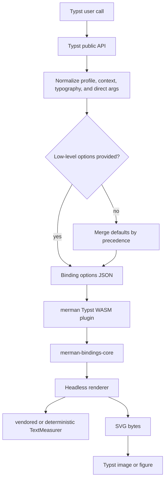

# feat: Harden Typst plugin document APIs and typography

## Summary

Harden the Typst package around three staged capabilities: stabilize the current opt-in document context bridge, add Typst-native wrapper and profile APIs, and extend typography handling without promising real Typst glyph measurement before the renderer can support it.

---

## Problem Frame

The Typst package currently renders Mermaid source through a Rust WASM plugin and embeds the resulting SVG with Typst `image`. The recent context bridge lets users opt into document font, text size, and container-width forwarding, but the public surface is still mostly a thin binding wrapper.

Typst users will expect two different things that must not be conflated: diagrams should be easy to make consistent with a document, and the layout should not silently drift because an embedded SVG is now measured against host fonts the renderer cannot actually inspect. The plan keeps `mermaid(...)` explicit-only for compatibility, builds better opt-in document APIs, and treats real font measurement as a later renderer/ABI boundary rather than a Typst-only wrapper feature.

---

## Requirements

**Compatibility and context bridge**

- R1. `mermaid(...)` remains explicit-only and does not automatically inherit Typst document font, text size, or container width.
- R2. Existing `mermaid-context(...)` and `show-mermaid-blocks-context(...)` keep opt-in inheritance of Typst `text.font`, `text.size`, and current layout width.
- R3. Precedence is deterministic: `options` stays the low-level escape hatch, explicit direct parameters override profile/context defaults, and context-derived values only fill missing fields.
- R4. Context bridge behavior is covered by Typst-level smoke fixtures and Rust binding tests where the behavior crosses the JSON boundary.

**Typst-native user APIs**

- R5. Users can define reusable diagram profiles for common document, print, and presentation styles without repeating raw binding dictionaries.
- R6. Users can render Mermaid diagrams as Typst figures without losing access to existing renderer options.
- R7. Raw Mermaid block show rules can share the same profile and context behavior as direct function calls.
- R8. Examples and README text distinguish explicit rendering, context-aware rendering, profiles, figures, and SVG export.

**Typography and measurement**

- R9. The Typst package exposes a clear typography surface for font family and font size while mapping to the existing renderer capabilities first.
- R10. Documentation and tests distinguish style inheritance from measurement accuracy: inheriting a font name does not mean the headless renderer measured that exact Typst font.
- R11. Any richer font or measurement ABI is versioned and gated by characterization tests before becoming part of the default package behavior.
- R12. Unknown or unsupported font measurement inputs fall back predictably rather than producing unstable diagram geometry.

---

## Key Technical Decisions

- KTD1. Keep the default API explicit-only: this preserves existing document output and avoids surprising layout drift for users who imported `mermaid(...)` before context-aware wrappers existed.
- KTD2. Add Typst-native APIs above the existing binding JSON contract: profiles and wrappers should normalize into the same `options` structure rather than creating a second renderer path.
- KTD3. Treat document context as a source of defaults, not a mode switch: context can provide font family, font size, and viewport width, but explicit user choices continue to win.
- KTD4. Split typography into style and measurement layers: Typst can express font intent now, while exact glyph measurement requires renderer or ABI work.
- KTD5. Add characterization before expanding font measurement: the existing renderer has vendored and deterministic measurers, and browser WASM has host callbacks, but Typst plugin calls are static WASM protocol calls with no browser-style measurement callback.
- KTD6. Prefer profile builders over broad global state: Typst users should be able to pass the same profile to direct calls, figure wrappers, and raw-block show rules without hidden document-wide mutation.

---

## High-Level Technical Design



Precedence should be documented and tested as a ladder:

1. `options` escape hatch when present.
2. Explicit direct parameters such as `host-theme`, `layout`, `viewport-width`, `text-measurer`, and `background`.
3. Explicit high-level objects such as `profile` and `typography`.
4. Context-derived document font, text size, and layout width from `mermaid-context(...)` or context-aware raw blocks.
5. Package defaults and renderer defaults.

The typography boundary should stay visible in API names and docs:

```text
Typst document font -> typography/style intent -> host_theme/themeVariables -> SVG style
Typst document font -> real glyph metrics -> not automatic in Typst plugin v1
```

---

## Phased Delivery

| Phase | Goal | Units | Gate |
| --- | --- | --- | --- |
| 1 | Stabilize the current context bridge | U1, U2 | Context examples and precedence fixtures pass through the local package smoke harness. |
| 2 | Add Typst-native APIs | U3, U4, U5 | Profiles, figures, and raw-block usage share one normalized option path. |
| 3 | Extend typography and measurement boundaries | U6, U7, U8 | Typography style options are stable, and any measurement expansion is guarded by characterization tests. |

---

## Implementation Units

### U1. Typst package smoke and assertion harness

- **Goal:** Add a repeatable local smoke harness for Typst package examples and behavior fixtures before changing the public API again.
- **Requirements:** R4, R8.
- **Dependencies:** None.
- **Files:**
  - `crates/xtask/src/cmd/typst_package.rs`
  - `crates/xtask/tests/typst_package_test.rs`
  - `packages/typst/merman/tests/basic-smoke.typ`
  - `packages/typst/merman/tests/context-bridge.typ`
  - `packages/typst/merman/tests/raw-block-context.typ`
  - `packages/typst/merman/README.md`
- **Approach:** Extend the existing package build workflow with a smoke path that can install the built package under a temporary preview namespace and compile selected examples and assertion fixtures. Keep the harness tolerant of missing local Typst CLI by reporting a clear skipped state in tests that cannot run in that environment.
- **Execution note:** Start with characterization fixtures for current `mermaid(...)`, `mermaid-context(...)`, and raw-block context behavior.
- **Patterns to follow:** Existing package copy logic in `crates/xtask/src/cmd/typst_package.rs`; current examples under `packages/typst/merman/examples`.
- **Test scenarios:**
  - Compile the basic example and assert the package can render a flowchart through the local preview package path.
  - Compile a context fixture with `#set text(font: "Arial", size: 13pt)` and assert the rendered SVG payload contains the bridged font family and size when using `mermaid-context(...)`.
  - Compile a raw-block context fixture and assert the show rule accepts a Mermaid fence without requiring per-block options.
  - Compile an explicit-only fixture and assert plain `mermaid(...)` does not inherit the surrounding Typst font.
  - Run the smoke harness with the Typst CLI unavailable and assert the test reports the prerequisite clearly rather than failing with an unrelated file or package error.
- **Verification:** The package has a documented local smoke path, and every feature-bearing Typst fixture either compiles or reports a clear environment prerequisite.

### U2. Stabilize context bridge precedence and behavior

- **Goal:** Lock down the current opt-in context bridge so future API work does not accidentally change inheritance or precedence semantics.
- **Requirements:** R1, R2, R3, R4.
- **Dependencies:** U1.
- **Files:**
  - `packages/typst/merman/lib.typ`
  - `packages/typst/merman/tests/context-bridge.typ`
  - `packages/typst/merman/tests/context-precedence.typ`
  - `packages/typst/merman/examples/document-context.typ`
  - `packages/typst/merman/README.md`
  - `crates/merman-bindings-core/src/render.rs`
- **Approach:** Preserve the current wrapper split while tightening normalization helpers around font-family arrays, font-size conversion, layout width forwarding, and host-theme merging. Add Rust binding assertions only for JSON boundary behavior that cannot be validated reliably inside Typst.
- **Patterns to follow:** Current `_context-mermaid`, `_context-host-theme`, `_layout-options`, and binding tests for `host_theme` and `layout`.
- **Test scenarios:**
  - `mermaid(...)` inside a Typst document with `#set text(font: "Arial")` emits default renderer typography unless explicit options are passed.
  - `mermaid-context(...)` inherits the surrounding font family and font size when neither `host-theme` nor `options` supplies them.
  - An explicit `host-theme.font_family` overrides a context-derived font family while preserving context-derived fields not explicitly overridden.
  - An explicit `layout` object overrides context-derived `viewport-width`.
  - An explicit `viewport-width` prevents the wrapper from using the current Typst container width.
  - `options` bypasses all shorthand and context merging.
- **Verification:** Context bridge behavior is described once in the README and proven by fixtures that cover default, inherited, and override paths.

### U3. Internal profile normalization layer

- **Goal:** Introduce a small Typst-side normalization layer that can support future profiles, typography objects, and wrappers without growing inconsistent merge logic across every public function.
- **Requirements:** R3, R5, R7, R9.
- **Dependencies:** U2.
- **Files:**
  - `packages/typst/merman/lib.typ`
  - `packages/typst/merman/tests/profile-normalization.typ`
  - `packages/typst/merman/tests/profile-precedence.typ`
  - `packages/typst/merman/README.md`
- **Approach:** Add a `profile` input and private helpers that normalize profile, typography, theme, SVG, layout, context, and direct arguments into the existing binding options shape. Keep `options` as the final escape hatch and keep existing named parameters working.
- **Technical design:** Directional API shape, not an implementation prescription:

  ```typst
  #let doc-diagrams = mermaid-profile(
    context: (typography: true, width: true),
    typography: (font: "Arial", size: 13pt),
    svg: (pipeline: "resvg-safe"),
  )

  #mermaid(source, profile: doc-diagrams, width: 100%)
  ```

- **Patterns to follow:** Current `_binding-options` and `_site-config` helpers in `packages/typst/merman/lib.typ`.
- **Test scenarios:**
  - A profile can set theme, host-theme, SVG pipeline, and layout shorthand values for `mermaid(...)`.
  - Direct parameters override profile values for `background`, `pipeline`, `host-theme`, and `viewport-width`.
  - `options` overrides profile and direct shorthand values.
  - A profile with context enabled still requires the context-aware entry point or show rule to read Typst context.
  - Existing calls that do not pass `profile` render the same SVG as before for representative fixtures.
- **Verification:** Public functions share one option normalization path, and no new wrapper has to duplicate JSON merge rules.

### U4. Typst-native wrappers for figures and raw blocks

- **Goal:** Add user-facing wrappers that feel natural in Typst documents while still exposing renderer options through profiles and direct overrides.
- **Requirements:** R5, R6, R7, R8.
- **Dependencies:** U3.
- **Files:**
  - `packages/typst/merman/lib.typ`
  - `packages/typst/merman/tests/figure-wrapper.typ`
  - `packages/typst/merman/tests/raw-block-profile.typ`
  - `packages/typst/merman/examples/figure.typ`
  - `packages/typst/merman/examples/profile.typ`
  - `packages/typst/merman/examples/raw-block.typ`
  - `packages/typst/merman/README.md`
- **Approach:** Add a figure wrapper that composes Typst `figure` around the existing image output, and update raw-block show handlers to accept the same `profile` and context controls as direct calls. Avoid hidden global state; users should pass reusable profile values explicitly.
- **Technical design:** Directional API shape:

  ```typst
  #mermaid-figure(
    source,
    caption: [System flow],
    profile: doc-diagrams,
    width: 100%,
  )

  #show raw.where(lang: "mermaid"): show-mermaid-blocks-context(
    profile: doc-diagrams,
    width: 100%,
  )
  ```

- **Patterns to follow:** Current `mermaid`, `mermaid-context`, `mermaid-raw`, `show-mermaid-blocks`, and `show-mermaid-blocks-context` wrappers.
- **Test scenarios:**
  - `mermaid-figure(...)` renders a Typst figure with caption content and an embedded SVG image.
  - `mermaid-figure(...)` forwards `alt`, `width`, `fit`, `error-mode`, and profile-derived renderer options.
  - A raw-block show rule using a profile renders the same renderer settings as a direct `mermaid(...)` call with that profile.
  - Context-aware raw blocks combine profile defaults with current document font and width.
  - A fixed `id` in a document-wide show rule remains documented as unsafe for multiple diagrams.
- **Verification:** Users can express common document, figure, and raw-block workflows without writing raw binding JSON.

### U5. Documentation and example overhaul

- **Goal:** Make the package behavior legible from a Typst user's point of view, especially around explicit rendering, context opt-in, and typography limits.
- **Requirements:** R1, R5, R6, R7, R8, R10.
- **Dependencies:** U2, U4.
- **Files:**
  - `packages/typst/merman/README.md`
  - `packages/typst/merman/examples/basic.typ`
  - `packages/typst/merman/examples/document-context.typ`
  - `packages/typst/merman/examples/figure.typ`
  - `packages/typst/merman/examples/profile.typ`
  - `packages/typst/merman/examples/print.typ`
  - `packages/typst/merman/examples/presentation.typ`
  - `packages/typst/merman/examples/raw-block.typ`
  - `packages/typst/merman/examples/svg-export.typ`
- **Approach:** Reorganize the README around user workflows instead of binding internals. Keep advanced options documented, but lead with the decision tree: explicit call, context-aware call, figure wrapper, raw-block show rule, SVG export.
- **Patterns to follow:** Existing README version mapping and current examples.
- **Test scenarios:**
  - Every README quick-start snippet maps to a maintained example or test fixture.
  - The context section states that default `mermaid(...)` does not inherit document fonts.
  - The typography section states that font family and size can be forwarded as style intent, but exact Typst font measurement is not automatic.
  - Print and presentation examples use profiles or wrapper APIs rather than repeating large option dictionaries when the profile API exists.
- **Verification:** A new Typst user can choose the correct entry point without reading binding internals, and advanced users can still find the low-level escape hatch.

### U6. Explicit typography surface in the Typst package

- **Goal:** Add a stable Typst-facing typography API that maps to current renderer capabilities and leaves room for later measurement support.
- **Requirements:** R3, R9, R10, R12.
- **Dependencies:** U3.
- **Files:**
  - `packages/typst/merman/lib.typ`
  - `packages/typst/merman/tests/typography-explicit.typ`
  - `packages/typst/merman/tests/typography-context.typ`
  - `packages/typst/merman/examples/document-context.typ`
  - `packages/typst/merman/README.md`
- **Approach:** Introduce a high-level `typography` object that initially supports font family and font size, then normalizes into `host_theme.font_family` and `host_theme.font_size`. Do not expose unsupported claims such as Typst line-height measurement unless the renderer contract can consume them.
- **Technical design:** Directional API shape:

  ```typst
  #mermaid(
    source,
    typography: (font: ("Source Sans 3", "Arial", "sans-serif"), size: 12pt),
  )
  ```

- **Patterns to follow:** Current `_font-family-value`, `_font-size-value`, and host-theme merge behavior.
- **Test scenarios:**
  - `typography.font` as a string maps to `host_theme.font_family`.
  - `typography.font` as an array maps to a comma-separated CSS font stack.
  - `typography.size` maps to `host_theme.font_size` with Typst length representation preserved.
  - Explicit `host-theme` fields override `typography` fields when both target the same output field.
  - Context-derived typography fills missing typography fields in `mermaid-context(...)`.
  - Unsupported typography keys are either ignored with documented behavior or rejected with a clear Typst error; choose one behavior and test it consistently.
- **Verification:** Typst users can configure typography without knowing `host_theme`, and the docs do not imply exact glyph measurement.

### U7. Renderer and binding typography characterization

- **Goal:** Characterize the renderer's current font measurement behavior for Typst-relevant font stacks before adding richer binding schema or font asset support.
- **Requirements:** R10, R11, R12.
- **Dependencies:** U6.
- **Files:**
  - `crates/merman-render/src/text/tests.rs`
  - `crates/merman-bindings-core/src/render.rs`
  - `crates/merman-render/src/text/font_metrics.rs`
  - `crates/merman-render/src/text/deterministic.rs`
  - `packages/typst/merman/tests/typography-measurement-boundary.typ`
  - `packages/typst/merman/README.md`
- **Approach:** Add tests that show how known Mermaid/default stacks, generic stacks, unknown named fonts, CJK text, emoji, and deterministic measurement behave today. Use these tests to define the boundary between supported style forwarding and unsupported real font measurement.
- **Execution note:** Characterization-first; do not change measurer behavior until the tests show the current boundary.
- **Patterns to follow:** Existing `TextMeasurer` tests and binding tests for `layout.text_measurer`.
- **Test scenarios:**
  - `layout.text_measurer = "vendored"` uses vendored metrics for known Mermaid and generic stacks.
  - `layout.text_measurer = "deterministic"` remains stable for unknown font families.
  - Unknown font families do not panic and fall back to deterministic behavior where no vendored table exists.
  - CJK and emoji labels produce finite, non-negative dimensions under both measurers.
  - Typst typography forwarding changes SVG style intent without claiming a different measurement provider.
  - Invalid `layout.text_measurer` values return the existing invalid-argument binding error.
- **Verification:** Measurement behavior is documented by tests before any new font measurement capability is designed or exposed.

### U8. Versioned font measurement extension boundary

- **Goal:** Prepare the future extension point for richer Typst font measurement or font asset input without forcing it into the current default package behavior.
- **Requirements:** R9, R10, R11, R12.
- **Dependencies:** U7.
- **Files:**
  - `crates/merman-bindings-core/src/common.rs`
  - `crates/merman-bindings-core/src/render/request.rs`
  - `crates/merman-bindings-core/src/render.rs`
  - `crates/merman-typst-plugin/src/lib.rs`
  - `crates/merman-render/src/lib.rs`
  - `crates/merman-render/src/text.rs`
  - `packages/typst/merman/lib.typ`
  - `packages/typst/merman/tests/font-measurement-capability.typ`
  - `packages/typst/merman/README.md`
- **Approach:** Design a versioned measurement capability boundary after U7, then implement the smallest useful contract. The first useful contract may be capability reporting and explicit unsupported errors rather than full font parsing. If a real font asset path is chosen, keep it opt-in and versioned so existing `render_svg_json(source, options)` behavior remains stable.
- **Technical design:** Directional extension shape:

  ```text
  Typst typography intent
    -> current host_theme/themeVariables mapping
    -> optional future measurement provider
       -> capability check
       -> explicit fallback or unsupported result
  ```

- **Patterns to follow:** Browser WASM `renderSvgWithTextMeasurer` as a conceptual host-measurer boundary; Typst plugin `abi_version` and `render_svg_json` as the compatibility contract that must remain stable.
- **Test scenarios:**
  - Existing ABI version and `render_svg_json(source, options)` continue to work for current callers.
  - Capability reporting identifies supported measurement modes without requiring users to infer them from errors.
  - Unsupported font measurement requests return a structured unsupported or invalid-argument error.
  - The default Typst package path never opts into experimental measurement automatically.
  - Any new measurement mode has fixture coverage for known fonts, unknown fonts, CJK, emoji, and fallback behavior before it is documented as supported.
- **Verification:** The codebase has a clear extension point for real font measurement, and the current Typst API remains compatible if that extension is deferred.

---

## Scope Boundaries

- The plan does not make plain `mermaid(...)` inherit Typst document context by default.
- The plan does not promise exact Typst font glyph measurement in the current plugin ABI.
- The plan does not replace the low-level `options` escape hatch.
- The plan does not attempt pixel-perfect browser parity for Typst output; renderer parity remains semantic and structural where browser-only text measurement residuals exist.

### Deferred to Follow-Up Work

- Full font file parsing or shaping support for Typst-provided font assets.
- Package version bump and publish workflow after the implementation is complete.
- Broader renderer parity work unrelated to Typst document APIs.

---

## System-Wide Impact

The public Typst package API becomes a first-class integration surface rather than only a thin binding wrapper. The Rust binding schema should remain stable through phases 1 and 2, while phase 3 may introduce a versioned extension only after measurement characterization. Renderer changes are intentionally delayed until tests prove which typography behavior is stable enough to expose.

---

## Risks & Dependencies

- **Typst CLI availability:** Local smoke tests depend on a Typst executable; the harness should report missing prerequisites clearly.
- **Typography expectation mismatch:** Users may read font inheritance as exact measurement. The API and docs must keep style forwarding separate from metric measurement.
- **Profile precedence drift:** Adding profiles can create confusing behavior if direct parameters, context, and `options` are merged differently across wrappers. A single normalization path is the main mitigation.
- **ABI expansion risk:** Typst plugin ABI changes are costly because package users compile through a shipped WASM file. Phase 3 should preserve existing entry points and add versioned capabilities only when necessary.
- **Fixture fragility:** SVG text and viewBox assertions should focus on semantic/style evidence and finite geometry, not brittle pixel-perfect numbers.

---

## Acceptance Examples

- AE1. Given a document with `#set text(font: "Arial", size: 13pt)`, when the user calls `mermaid(source)`, then the diagram renders with explicit/default renderer settings rather than inheriting the document font.
- AE2. Given the same document, when the user calls `mermaid-context(source)`, then font family, font size, and current container width are forwarded unless explicitly overridden.
- AE3. Given a reusable profile, when the user passes it to `mermaid(...)`, `mermaid-figure(...)`, and a raw-block show rule, then the same renderer settings are applied through one normalized option path.
- AE4. Given `typography: (font: ("Source Sans 3", "Arial", "sans-serif"), size: 12pt)`, when the diagram is rendered, then the emitted SVG style intent includes the configured font stack and size.
- AE5. Given an unknown font family, when the diagram is rendered with the current plugin, then layout remains finite and documented fallback measurement behavior applies.
- AE6. Given a future request for exact font measurement that the plugin cannot support, when the user opts into that mode, then the plugin returns a structured unsupported or invalid-argument result instead of silently pretending to measure it.

---

## Sources & Research

- `packages/typst/merman/lib.typ` currently provides explicit `mermaid(...)`, opt-in `mermaid-context(...)`, and raw-block wrappers.
- `packages/typst/merman/README.md` currently documents explicit-only default behavior and the context-aware wrapper.
- `crates/merman-bindings-core/src/common.rs` defines the binding JSON schema for `host_theme`, `layout`, and SVG options.
- `crates/merman-bindings-core/src/render/request.rs` maps `layout.text_measurer` to `vendored` or `deterministic` measurers.
- `crates/merman-render/src/text/measure.rs` defines `TextMeasurer` as the renderer extension point for host text systems.
- `crates/merman-wasm/src/lib.rs` has a browser host-measurement callback path, which is useful prior art but not directly available to the Typst static plugin call model.
- `crates/xtask/src/cmd/typst_package.rs` builds and copies the Typst package but does not yet provide a dedicated smoke-test workflow.
