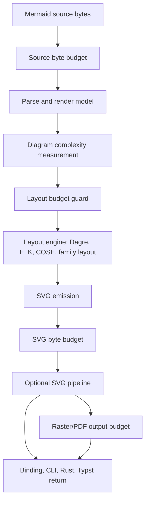

# refactor: Render resource limits and ELK package surface

## Summary

This plan adds a shared render-resource budget for source size, layout complexity, SVG output size, and package-surface defaults. It treats Flowchart ELK as the first high-risk layout backend to guard, keeps Typst package imports useful without local feature builds, and audits older raster/parser limits after the new budget is active.

---

## Problem Frame

Flowchart ELK is now source-backed and follows the Mermaid adapter plus an Eclipse ELK layered port. That makes Mermaid parity better, but it also changes the risk profile: ELK can do substantially more graph work than the older compatibility path, and the current DoS controls are scattered across raster output, parser depth, and family-specific guards.

The existing controls are not wrong, but they protect different lifecycle points. `RasterSizeLimit` protects PNG/JPG/PDF allocation after SVG exists. `MAX_DIAGRAM_NESTING_DEPTH` protects parser and recursive tree surfaces. Mermaid config defaults such as `maxTextSize` and `maxEdges` are preserved in config and secure-key behavior, but current code should not rely on them as a proven render-wide budget until implementation verifies where they execute.

Typst raises a separate packaging issue. The Typst package imports one `merman_typst_plugin.wasm` via `plugin("merman_typst_plugin.wasm")`, so users cannot enable a Cargo feature after importing the package. If the published Typst artifact advertises ELK support, that artifact must be built with ELK and guarded by resource budgets.

---

## Requirements

### Resource Safety

- R1. Render and layout entry points must be able to reject oversized source, oversized layout models, and oversized SVG output before returning or allocating large downstream artifacts.
- R2. Flowchart ELK must be guarded before entering the ELK layout engine for graph cardinality and hierarchy-heavy inputs.
- R3. Limit failures must be structured enough for Rust, CLI, FFI, WASM, and Typst wrappers to distinguish resource exhaustion from parse errors and ordinary render errors.
- R4. Resource profiles must allow bounded defaults for untrusted/direct-import surfaces and explicit unbounded or trusted profiles for controlled batch usage.
- R5. `--raster-unbounded` and raster-specific APIs must not disable layout or SVG resource budgets.

### Package Surface

- R6. The base Rust `render` feature must not silently pull in the EPL-backed ELK source port; ELK should remain an explicit feature at low-level compile surfaces.
- R7. Direct-import artifacts that users do not rebuild, especially the Typst package wasm, must either include ELK by default or clearly report that ELK is unsupported.
- R8. FFI and native binding crates must expose ELK as an opt-in capability or distinct full artifact, not an accidental side effect of enabling SVG render.
- R9. Browser/WASM and Typst size matrices must record the ELK-bearing presets that are intended for publication.
- R10. EPL-2.0 provenance for `merman-elk-layered` must stay visible in release notes, package-surface docs, and any artifact that includes ELK.

### Compatibility And Cleanup

- R11. Existing raster size limits must keep protecting PNG/JPG/PDF output allocation unless the new budget replaces the same lifecycle check.
- R12. Existing parser/config/tree-depth guards must remain unless the implementation proves the new budget covers the same recursion and error surface.
- R13. Existing Mermaid config keys such as `maxTextSize` and `maxEdges` must remain in the config model for parity and secure-key behavior even if render enforcement moves elsewhere.
- R14. The implementation must add tests that prove ELK-in-limit renderability, ELK-over-limit rejection, binding error projection, Typst error payloads, and old raster/depth guard preservation.

---

## Scope Boundaries

### In Scope

- A shared resource-limit model and error taxonomy for render/layout operations.
- Initial complexity measurement for Flowchart models, with Flowchart ELK as the first enforced layout-heavy backend.
- Source byte and SVG byte limits at the headless render operation and binding request boundary.
- Binding `options_json` support for resource profiles and explicit numeric overrides.
- Typst package build/profile updates so the published package can include ELK without asking users to rebuild the wasm.
- FFI/WASM/CLI feature and artifact policy updates so ELK defaults are intentional.
- A post-implementation audit of older resource limits with keep/delete criteria.

### Out of Scope

- Pixel-perfect ELK geometry work or new ELK fixture fitting.
- Full browser-grade SVG sanitization beyond the existing `resvg-safe` contract.
- A hard CPU preemption system for arbitrary Rust layout code in the first pass.
- Replacing all family-specific semantic limits in one change.
- Legal advice about EPL-2.0. The implementation records license provenance and package-surface impact; maintainers still own release/legal approval.

### Deferred To Follow-Up Work

- Cooperative phase deadlines inside every layout algorithm after the cardinality/byte budget seam exists.
- Per-host typed option builders for every platform wrapper.
- A separate slim/full native artifact release matrix if maintainers decide FFI should ship both no-ELK and ELK prebuilt libraries.
- Extending generic complexity measurement to every diagram family after Flowchart ELK proves the seam.

---

## Key Technical Decisions

- KTD1. Resource budget as a render operation concern: The budget should be attached to `HeadlessRenderer` and projected through bindings, while `merman-render` owns layout-model complexity checks for APIs that bypass the facade.
- KTD2. Cardinality and bytes first, timeouts later: Source bytes, model complexity, and SVG bytes are deterministic and wasm-compatible. Phase deadlines are useful but should be added only after cardinality guards can reject known expensive graphs before ELK starts.
- KTD3. ELK is explicit at compile surfaces: `merman/render` should no longer imply `merman-render/elk-layout`; `elk-layout` remains the feature that crosses into `merman-layout-elk` and `merman-elk-layered`.
- KTD4. Direct-import artifacts can be full by policy: Typst package and browser full artifacts may include ELK by default because users import an artifact rather than compile features, but those artifacts need explicit budgets, smoke tests, capability reporting, and EPL provenance.
- KTD5. FFI default stays conservative: C ABI and platform binding crates should not silently add ELK through `render`; maintainers can publish a separate full artifact or let downstream builders enable `elk-layout`.
- KTD6. Old limits are lifecycle-specific until proven duplicate: Raster pixmap limits and parser nesting limits should be kept by default because they protect allocations and recursion stages the new layout budget does not replace.
- KTD7. Binding errors get a stable resource status: Resource exhaustion should map to a public binding status such as `MERMAN_RESOURCE_LIMIT_EXCEEDED`, while preserving existing parse/render statuses for unrelated failures.

---

## High-Level Technical Design

The new budget should reject work at the earliest lifecycle point that has enough information. Source bytes are checked before parse. Flowchart complexity is checked after parse and before ELK graph construction or ELK layout. SVG bytes are checked after SVG emission and again after an output pipeline if the pipeline can increase output size. Raster size limits remain in the raster encoder path.

---

## Resource Model

The initial public model should use profile constructors plus explicit overrides. Exact defaults are implementation-time constants, but the shape should be stable:

| Concern | Example field | Enforced at | Notes |
| --- | --- | --- | --- |
| Source input | `max_source_bytes` | Before parse | Applies to bindings, CLI diagram source, Rust headless operation, and Typst plugin calls. |
| Flowchart nodes | `max_flowchart_nodes` | Before layout | Counts real nodes plus subgraph nodes when ELK will see them. |
| Flowchart edges | `max_flowchart_edges` | Before layout | Protects ELK and non-ELK flowchart paths from dense relationship inputs. |
| Flowchart subgraphs | `max_flowchart_subgraphs` | Before layout | Protects hierarchy-heavy ELK inputs. |
| Label text | `max_label_bytes` or aggregate text bytes | Before layout | Complements, but does not replace, Mermaid config `maxTextSize` without source-backed enforcement evidence. |
| SVG output | `max_svg_bytes` | After SVG emission and pipeline | Prevents large return payloads and Typst JSON payload blowups. |
| Raster output | existing `RasterSizeLimit` | Raster/PDF encoding | Remains separate because it constrains pixel dimensions and PDF conversion. |

Recommended profiles:

- `interactive`: bounded default for untrusted editor previews, WASM, Typst, and FFI entry points.
- `typst_package`: tighter SVG/source defaults when Typst document compilation should fail fast.
- `trusted_native`: higher limits for CLI or Rust callers processing known diagrams.
- `unbounded_for_trusted_input`: explicit opt-out for controlled environments, separate from raster unbounded output.

---

## Implementation Units

### U1. Define render resource limit model and error taxonomy

- **Goal:** Add a reusable limit model, profile constructors, and structured limit-exceeded error.
- **Requirements:** R1, R3, R4
- **Dependencies:** None
- **Files:** `crates/merman-render/src/lib.rs`, `crates/merman-render/src/resources.rs`, `crates/merman/src/render/mod.rs`, `crates/merman/src/render/operation.rs`
- **Approach:** Introduce a public or facade-reexported `RenderResourceLimits` plus `ResourceLimitExceeded` metadata containing phase, limit name, actual, and max. Add builder methods to `HeadlessRenderer` so callers can select a profile or override fields without rebuilding `LayoutOptions`.
- **Patterns to follow:** `crates/merman/src/render/raster.rs`, `crates/merman/src/render/operation.rs`, `crates/merman-bindings-core/src/common.rs`
- **Test scenarios:** Default renderer carries the intended bounded profile for public render paths; trusted/unbounded profile accepts a synthetic source that bounded profile rejects at source-byte stage; error display remains concise while structured fields are available to bindings.
- **Verification:** Focused unit tests in `crates/merman-render` and `crates/merman` cover profile defaults and error classification.

### U2. Enforce source and SVG byte budgets in the headless operation

- **Goal:** Put byte-size checks at the shared operation boundary so Rust facade, bindings, CLI, WASM, and Typst do not implement separate guards.
- **Requirements:** R1, R3, R5, R14
- **Dependencies:** U1
- **Files:** `crates/merman/src/render/operation.rs`, `crates/merman/src/render/mod.rs`, `crates/merman/tests/security_regression.rs`
- **Approach:** Check source bytes before calling the parser. Check emitted SVG bytes before returning raw parity SVG and after pipeline processing when the pipeline is used. Keep no-diagram behavior unchanged.
- **Patterns to follow:** `crates/merman/src/render/operation.rs`, `crates/merman/src/render/raster.rs`
- **Test scenarios:** Oversized source returns resource-limit error before parse; oversized SVG after pipeline returns resource-limit error; empty source still maps to no-diagram; `--raster-unbounded` does not disable source or SVG checks.
- **Verification:** `cargo nextest run -p merman --features render,raster --test security_regression`

### U3. Add Flowchart complexity measurement before ELK layout

- **Goal:** Reject large Flowchart ELK graphs before graph construction and before calling the source-backed ELK layout engine.
- **Requirements:** R1, R2, R4, R14
- **Dependencies:** U1
- **Files:** `crates/merman-render/src/resources.rs`, `crates/merman-render/src/lib.rs`, `crates/merman-render/src/flowchart/elk.rs`, `crates/merman-render/src/flowchart/layout.rs`, `crates/merman-render/tests/flowchart_layout_test.rs`, `crates/merman-render/tests/flowchart_svg_test.rs`
- **Approach:** Add a family-local `DiagramComplexity` measurement for `FlowchartV2Model`. Apply the guard in the dispatch path before `layout_flowchart_elk_typed` and before non-ELK flowchart layout when the shared budget is active.
- **Patterns to follow:** `crates/merman-render/src/flowchart/elk.rs`, `crates/merman-core/src/diagrams/tree_view.rs`, `crates/merman-core/tests/nesting_depth_limits.rs`
- **Test scenarios:** A normal `flowchart-elk` fixture renders within the default profile; a node-heavy ELK graph fails before ELK layout; an edge-heavy graph fails before ELK layout; a subgraph-heavy graph fails before ELK layout; compat backend and source-backed backend both use the same complexity guard.
- **Verification:** `cargo nextest run -p merman-render --features core-full,elk-layout flowchart`

### U4. Project limits through bindings options and public error payloads

- **Goal:** Make resource budgets configurable and observable through the shared binding contract.
- **Requirements:** R3, R4, R7, R8, R14
- **Dependencies:** U1, U2
- **Files:** `crates/merman-bindings-core/src/common.rs`, `crates/merman-bindings-core/src/render/request.rs`, `crates/merman-bindings-core/src/render.rs`, `docs/bindings/OPTIONS_JSON.md`, `crates/merman-wasm/src/lib.rs`, `crates/merman-ffi/src/lib.rs`, `crates/merman-ffi/src/android_jni.rs`
- **Approach:** Add an optional top-level `resources` object to `options_json` with `profile` and numeric overrides. Add a binding status for resource limits and map `HeadlessError` accordingly. Preserve unknown-field tolerance.
- **Patterns to follow:** `layout.flowchart_elk_backend` handling in `crates/merman-bindings-core/src/render/request.rs`, binding payload tests in `crates/merman-bindings-core/src/common.rs`
- **Test scenarios:** `options_json` can select a stricter profile; invalid numeric values return `MERMAN_INVALID_ARGUMENT`; limit failures return `MERMAN_RESOURCE_LIMIT_EXCEEDED`; `validate_json` applies source/parse limits but does not claim full renderability unless documented.
- **Verification:** `cargo nextest run -p merman-bindings-core --features render,elk-layout`

### U5. Decouple low-level ELK feature defaults

- **Goal:** Stop `render` from silently enabling ELK while preserving explicit ELK support.
- **Requirements:** R6, R8, R10
- **Dependencies:** None
- **Files:** `crates/merman/Cargo.toml`, `crates/merman-render/Cargo.toml`, `crates/merman-bindings-core/Cargo.toml`, `crates/merman-ffi/Cargo.toml`, `crates/merman-wasm/Cargo.toml`, `crates/merman-typst-plugin/Cargo.toml`, `docs/release/PACKAGE_SURFACES.md`
- **Approach:** Make `render` mean base SVG/render support only. Keep `elk-layout` as the explicit feature that pulls `merman-layout-elk` and its `merman-elk-layered` transitive crate. Update docs so consumers can see when EPL-backed code is compiled.
- **Patterns to follow:** Existing feature forwarding in `crates/merman-bindings-core/Cargo.toml` and `crates/merman-ffi/Cargo.toml`
- **Test scenarios:** `cargo tree -e features -p merman --features render` does not include `merman-elk-layered`; `cargo tree -e features -p merman --features elk-layout` does include it; `flowchart-elk` returns unsupported without `elk-layout`; `flowchart-elk` renders with `elk-layout`.
- **Verification:** Feature-targeted nextest runs for render without ELK and render with ELK.

### U6. Make Typst package ELK support artifact-owned

- **Goal:** Ensure the Typst package can support ELK without requiring users to build a custom wasm.
- **Requirements:** R2, R4, R7, R9, R10, R14
- **Dependencies:** U1, U4, U5
- **Files:** `crates/merman-typst-plugin/Cargo.toml`, `crates/merman-typst-plugin/src/lib.rs`, `crates/xtask/src/cmd/typst_package.rs`, `crates/xtask/src/cmd/typst_plugin_smoke.rs`, `crates/xtask/src/cmd/wasm_size_matrix.rs`, `docs/release/WASM_SIZE_BUDGETS.json`, `packages/typst/merman/lib.typ`, `packages/typst/merman/README.md`, `packages/typst/merman/typst.toml`, `docs/release/PACKAGE_SURFACES.md`
- **Approach:** Add an ELK-bearing Typst build profile and make the package build use it for the publishable package. Keep bridge/minimal profiles for transport checks. Expose resource profile defaults through Typst options without forcing every user to understand Cargo features.
- **Patterns to follow:** `crates/xtask/src/cmd/typst_package.rs`, `packages/typst/merman/lib.typ`, Typst package CI in `.github/workflows/ci.yml`
- **Test scenarios:** Typst `mermaid("flowchart-elk TD\nA-->B")` renders from the packaged wasm; over-limit ELK source returns a JSON render payload and Typst `error-mode: "placeholder"` displays it; `validate-mermaid` reports structured resource errors; package smoke examples compile with the ELK-bearing wasm.
- **Verification:** `cargo run -p xtask -- build-typst-package`; `cargo run -p xtask -- typst-plugin-smoke --wasm target/wasm32-unknown-unknown/wasm-size/merman_typst_plugin.wasm`; CI Typst package examples.

### U7. Align browser/WASM, CLI, and FFI defaults with artifact policy

- **Goal:** Make each public surface intentional about ELK, resource profiles, and capability reporting.
- **Requirements:** R4, R5, R7, R8, R9, R10
- **Dependencies:** U4, U5
- **Files:** `crates/merman-cli/Cargo.toml`, `crates/merman-cli/src/cli.rs`, `crates/merman-cli/src/render.rs`, `crates/merman-cli/README.md`, `crates/merman-wasm/Cargo.toml`, `crates/merman-wasm/src/lib.rs`, `platforms/web/scripts/build-wasm.mjs`, `docs/release/PACKAGE_SURFACES.md`, `crates/merman-ffi/Cargo.toml`, `crates/merman-ffi/README.md`
- **Approach:** Keep CLI full enough for Mermaid parity if maintainers accept the license/size trade-off, but make the feature explicit in the CLI crate. Keep FFI conservative by default and provide documented `elk-layout` opt-in. For browser full package presets, either include ELK and budget it or expose a clear unsupported capability for ELK.
- **Patterns to follow:** Browser preset policy in `docs/release/PACKAGE_SURFACES.md`, capability tests in `crates/merman-wasm/src/lib.rs`, CLI raster option conflict tests in `crates/merman-cli/tests/cli_compat.rs`
- **Test scenarios:** CLI renders ELK when built with the default CLI feature set; FFI default build reports unsupported ELK rather than rendering through an accidental dependency; browser capability metadata reports whether ELK is compiled; `--raster-unbounded` conflicts only with raster limits and leaves render resource profile intact.
- **Verification:** `cargo nextest run -p merman-cli --features elk-layout`; `cargo nextest run -p merman-ffi`; browser wasm preset smoke.

### U8. Audit and rationalize existing resource limits after implementation

- **Goal:** Decide which old limits stay, move, or are deleted after the shared budget is in place.
- **Requirements:** R11, R12, R13, R14
- **Dependencies:** U1 through U7
- **Files:** `crates/merman/src/render/raster.rs`, `crates/merman-core/src/lib.rs`, `crates/merman-core/src/preprocess/mod.rs`, `crates/merman-core/src/diagrams/tree_view.rs`, `crates/merman-core/src/generated/default_config.json`, `crates/merman-core/src/config/mod.rs`, `docs/security/THREAT_MODEL.md`, `docs/quality/PANIC_SURFACE.md`
- **Approach:** Keep limits that protect a different lifecycle stage. Delete only duplicated ad hoc guards that now call into the shared budget and have identical failure behavior. If `maxTextSize` or `maxEdges` remain config-only, document that resource enforcement lives in `resources` options instead of pretending Mermaid config is the active guard.
- **Patterns to follow:** `crates/merman/tests/security_regression.rs`, `crates/merman-core/tests/nesting_depth_limits.rs`, threat model success criteria in `docs/security/THREAT_MODEL.md`
- **Test scenarios:** Raster tests still cap pixmap dimensions and PDF conversion; deep config/frontmatter parsing still rejects beyond `MAX_DIAGRAM_NESTING_DEPTH`; treeView rendering still rejects over-depth typed models; Gantt expansion guards still fire if they protect semantic expansion before generic model measurement.
- **Verification:** Security and nesting-depth nextest suites plus a review diff showing no unrelated guard removal.

### U9. Update CI gates, size budgets, and release documentation

- **Goal:** Prevent resource and package-surface drift after the implementation lands.
- **Requirements:** R9, R10, R14
- **Dependencies:** U5, U6, U7, U8
- **Files:** `.github/workflows/ci.yml`, `crates/xtask/src/cmd/wasm_size_matrix.rs`, `docs/release/WASM_SIZE_BUDGETS.json`, `docs/release/PACKAGE_SURFACES.md`, `docs/security/THREAT_MODEL.md`, `CHANGELOG.md`
- **Approach:** Add ELK-bearing Typst and browser presets to the size matrix when they are publishable defaults. Add CI checks that exercise at least one over-limit ELK path through bindings and one Typst package import path.
- **Patterns to follow:** Existing `typst-package` CI job and `wasm-size-matrix` budget checks.
- **Test scenarios:** Size matrix fails if an intended publishable ELK preset is missing a budget; CI fails if Typst package import loses ELK support; CI fails if resource-limit binding status regresses to a generic render error.
- **Verification:** `cargo run -p xtask -- wasm-size-matrix --budget-file docs/release/WASM_SIZE_BUDGETS.json` and the existing CI Typst package job.

---

## Acceptance Examples

- AE1. Given a normal `flowchart-elk` diagram and an ELK-enabled artifact, rendering returns SVG without `NaN` and within the default resource profile.
- AE2. Given a Flowchart ELK diagram with more nodes than the selected profile allows, rendering returns a resource-limit error before ELK layout starts.
- AE3. Given a Typst package import, `mermaid("flowchart-elk TD\nA-->B")` works from the shipped wasm without requiring the user to rebuild with Cargo features.
- AE4. Given a default FFI build without `elk-layout`, Flowchart ELK reports unsupported capability rather than linking EPL-backed ELK transitively.
- AE5. Given `--raster-unbounded`, a huge SVG viewBox can bypass raster pixel caps only when explicitly intended, while source/layout/SVG byte budgets remain active.
- AE6. Given parser input nested beyond `MAX_DIAGRAM_NESTING_DEPTH`, parse still fails through the existing depth guard after the new resource model lands.

---

## System-Wide Impact

This change affects the public Rust facade, render crate feature graph, binding JSON contract, Typst package artifact, browser/WASM presets, CLI defaults, and release documentation. The most important behavior change is making ELK explicit at compile surfaces while allowing selected published full artifacts to include it deliberately.

The resource budget becomes part of the security model. It should be documented next to existing SVG sanitizer and raster guidance so host applications understand which controls are for untrusted Mermaid source, which controls are for output allocation, and which controls are still host-owned.

---

## Risks & Dependencies

| Risk | Impact | Mitigation |
| --- | --- | --- |
| Resource defaults reject legitimate large diagrams. | Users with trusted batch workloads may see new failures. | Provide named trusted/unbounded profiles and document them separately from raster unbounded output. |
| ELK feature decoupling breaks artifacts that assumed `render` meant ELK. | Compile or runtime unsupported errors. | Update package docs, capability reporting, and tests for no-ELK and ELK builds. |
| Typst ELK wasm grows beyond size budget. | Package publication or CI fails. | Add an ELK preset budget and decide publishability with real measurements. |
| EPL-backed code enters default library surfaces accidentally. | License and distribution expectations change. | Use `cargo tree -e features` checks and package-surface docs to keep ELK explicit. |
| Time-based DoS remains possible inside accepted complex layouts. | Cardinality guards reduce but do not eliminate CPU risk. | Add cooperative phase deadlines as follow-up once the shared budget seam exists. |
| Old limits are removed too aggressively. | Raster allocation or parser recursion protection regresses. | Treat U8 as an audit with keep/delete criteria, not a cleanup mandate. |

---

## Documentation / Operational Notes

- Update `docs/security/THREAT_MODEL.md` to describe source/model/SVG resource budgets separately from raster pixmap limits.
- Update `docs/bindings/OPTIONS_JSON.md` with the `resources` options shape, examples, and new error code.
- Update `docs/release/PACKAGE_SURFACES.md` so every surface states whether ELK is compiled by default and whether the artifact includes EPL-backed code.
- Update `packages/typst/merman/README.md` to explain that the registry package uses a prebuilt wasm and which diagrams/features it supports.
- Record size-budget changes in `docs/release/WASM_SIZE_BUDGETS.json` with enough headroom for regression detection, not as a product target.

---

## Sources / Research

- `docs/security/THREAT_MODEL.md` already identifies parser/layout DoS as a current mitigation area and lists expanded layout-heavy budgets as future work.
- `crates/merman/src/render/raster.rs` owns `RasterSizeLimit`, `DEFAULT_MAX_RASTER_SIDE_LENGTH`, and `DEFAULT_MAX_RASTER_PIXELS`, which protect raster/PDF allocation rather than layout work.
- `crates/merman-core/src/lib.rs`, `crates/merman-core/src/preprocess/mod.rs`, and `crates/merman-core/src/diagrams/tree_view.rs` own nesting-depth protections around parser/config/tree surfaces.
- `crates/merman-render/src/lib.rs` dispatches Flowchart ELK when the diagram type or effective config selects ELK.
- `crates/merman-render/src/flowchart/elk.rs` builds the Flowchart-to-ELK graph and calls the selected ELK backend.
- `crates/merman/Cargo.toml` currently makes `render` imply `merman-render/elk-layout`, which is the feature coupling this plan decouples.
- `crates/merman-layout-elk/README.md` and `crates/merman-elk-layered/Cargo.toml` define the ELK source-backed boundary and EPL-2.0 crate.
- `packages/typst/merman/lib.typ` imports a single `merman_typst_plugin.wasm`, making Typst feature support artifact-owned.
- `crates/xtask/src/cmd/typst_package.rs` and `crates/xtask/src/cmd/wasm_size_matrix.rs` are the current build and measurement entry points for Typst/browser wasm artifacts.
