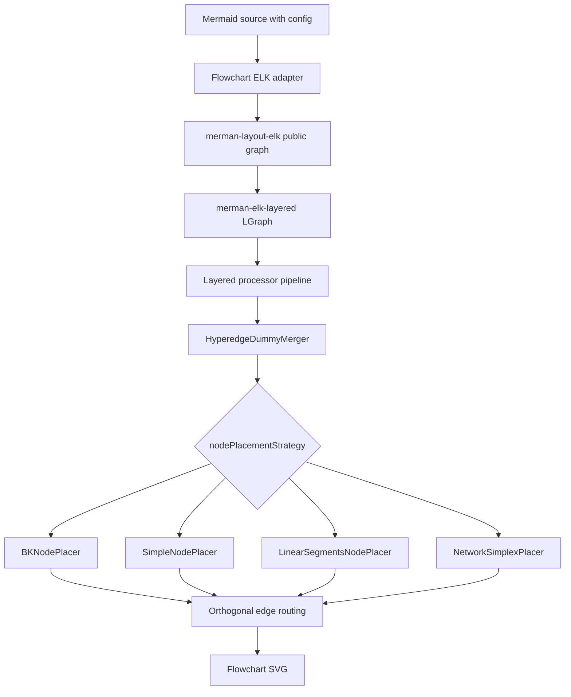

# feat: Flowchart ELK public config processor ports

## Summary

This plan ports the source-backed ELK processors needed for Mermaid's public Flowchart ELK configuration surface. It covers `elk.mergeEdges` and all documented `elk.nodePlacementStrategy` values while keeping full Eclipse ELK parity out of scope.

---

## Problem Frame

Flowchart ELK now defaults to the source-backed Mermaid adapter and Eclipse ELK layered port. The default `BRANDES_KOEPF` path renders, but Mermaid's documented ELK customization example fails when users set `mergeEdges: true` and `nodePlacementStrategy: LINEAR_SEGMENTS`.

The failure is not a parser or config issue. `merman-render` already maps Mermaid config into ELK layout options, and `merman-layout-elk` forwards those options into `merman-elk-layered`. The gap is in the layered processor port: `HyperedgeDummyMerger`, `SimpleNodePlacer`, `LinearSegmentsNodePlacer`, and `NetworkSimplexPlacer` are assembled by the source-backed pipeline but still return `UnsupportedProcessor`.

---

## Requirements

### Public Mermaid Config Support

- R1. The documented Mermaid example with `layout: elk`, `mergeEdges: true`, and `nodePlacementStrategy: LINEAR_SEGMENTS` must render through the source-backed backend without falling back to compat.
- R2. All documented `nodePlacementStrategy` values must be accepted and renderable: `BRANDES_KOEPF`, `LINEAR_SEGMENTS`, `SIMPLE`, and `NETWORK_SIMPLEX`.
- R3. `mergeEdges: true` must execute source-backed hyperedge dummy merging instead of being ignored or downgraded.
- R4. Existing config mapping for `cycleBreakingStrategy`, `considerModelOrder`, `forceNodeModelOrder`, self-loop options, and default `BRANDES_KOEPF` behavior must not regress.

### ELK Port Integrity

- R5. New processor behavior must be ported from the pinned Eclipse ELK source shape, using `repo-ref/openedges/elk-rs` only as a translation aid.
- R6. Processor wiring must stay in `merman-elk-layered`; renderer and public adapter crates must not gain algorithm-specific rewrites.
- R7. Geometry tests should assert structural and semantic invariants rather than pixel-perfect browser parity.
- R8. Unsupported processor errors should remain for processor strategies outside this plan so missing full-ELK features stay visible.

### Evidence And Documentation

- R9. Tests must prove the public config paths render, do not emit `NaN`, preserve visible labels, and avoid `UnsupportedProcessor` errors.
- R10. Flowchart ELK alignment docs must describe the newly covered public config surface and any still-deferred ELK processor families.

---

## Scope Boundaries

### In Scope

- Source-backed ports for `SimpleNodePlacer`, `LinearSegmentsNodePlacer`, `NetworkSimplexPlacer`, and `HyperedgeDummyMerger`.
- Focused graph-model helpers needed to rewire long-edge dummy nodes, collector ports, and node positions safely.
- Regression tests for the exact Mermaid documentation example and each documented node placement strategy.
- Flowchart ELK fixture or probe updates that demonstrate public config support without broad golden churn.
- Documentation updates to the Flowchart ELK alignment/support notes.

### Out of Scope

- Complete Eclipse ELK processor coverage.
- New edge-routing strategies such as polyline or splines.
- Interactive cycle breaking, interactive crossing minimization, partition processors, wrapping processors, comment processors, and hypernode postprocessing.
- Pixel-perfect layout matching against browser ELK output.
- Package-surface, EPL, FFI, Typst, and resource-budget policy changes already handled by the render-resource-limits plan.

### Deferred To Follow-Up Work

- Porting `cycleBreakingStrategy` values that currently select unported processors: `DEPTH_FIRST`, `INTERACTIVE`, and `MODEL_ORDER`.
- Porting non-orthogonal routers if Mermaid or user fixtures expose them through a supported public config path.
- Expanding the dedicated Flowchart ELK fixture lane after the public config processors are stable.

---

## Key Technical Decisions

- KTD1. Treat Mermaid's documented config surface as the support boundary: This plan ports the processors users can reach through current public `elk` config, not the full ELK processor inventory.
- KTD2. Keep source-backed behavior source-backed: Missing config support should be fixed in `merman-elk-layered`, not by silently ignoring options or routing configured graphs to the compat backend.
- KTD3. Port node placement as a complete documented family: `LINEAR_SEGMENTS` fixes the reported example, but `SIMPLE` and `NETWORK_SIMPLEX` are also documented Mermaid values and should not remain runtime traps.
- KTD4. Reuse existing graph primitives before adding new abstractions: `LGraph` already has edge rewiring, collector ports, layer membership, and network simplex support; new helpers should fill processor gaps rather than duplicate graph ownership.
- KTD5. Keep tests semantic where browser residuals dominate: Assertions should check render success, labels, edge path sanity, layer ordering, dummy merging, and absence of `NaN` or unsupported errors rather than exact browser coordinates.
- KTD6. Leave unsupported errors meaningful: Processor strategies not in this public config slice should continue to fail clearly so future ELK work is discoverable.

---

## High-Level Technical Design

The public adapter already carries the config values. The implementation should make the existing pipeline branches executable, then prove the configured graph stays on the source-backed path through render-level tests.

---

## Implementation Units

### U1. Add public-config regression coverage before porting

- **Goal:** Lock the user-visible failure mode before changing processor behavior.
- **Requirements:** R1, R2, R3, R9
- **Dependencies:** None
- **Files:** `crates/merman/tests/flowchart_elk_render.rs`, `crates/merman-elk-layered/src/pipeline.rs`, `fixtures/flowchart/local_flowchart_elk_public_config_005.mmd`, `fixtures/flowchart/local_flowchart_elk_public_config_005.layout.golden.json`, `fixtures/flowchart/local_flowchart_elk_public_config_005.golden.json`
- **Approach:** Add a render regression for the exact Mermaid documentation example and source-backed pipeline tests that show each documented node placement strategy selects the intended processor. Add a focused fixture only if the existing ELK test lane expects file-backed evidence for new public config behavior.
- **Execution note:** Start with failing tests that currently expose `LinearSegmentsNodePlacer` and `HyperedgeDummyMerger` as unsupported.
- **Patterns to follow:** Existing smoke tests in `crates/merman/tests/flowchart_elk_render.rs`; ELK processor sequence tests in `crates/merman-elk-layered/src/pipeline.rs`; local ELK hardening fixtures under `fixtures/flowchart/`.
- **Test scenarios:** The exact Mermaid docs example renders SVG and contains `Start`, `Choose Path`, `Option 1`, and `Option 2`; the same source-backed render does not contain `NaN`; configured `SIMPLE`, `LINEAR_SEGMENTS`, `NETWORK_SIMPLEX`, and default `BRANDES_KOEPF` each assemble their expected P4 processor; `mergeEdges: true` assembles `HyperedgeDummyMerger` when graph properties identify hyperedges.
- **Verification:** The tests fail on current main because of unsupported processors and pass only after the source-backed processors execute.

### U2. Port `SimpleNodePlacer` and shared P4 placement scaffolding

- **Goal:** Add the lowest-risk non-default node placement strategy and establish reusable P4 helpers for the larger placers.
- **Requirements:** R2, R5, R6, R7
- **Dependencies:** U1
- **Files:** `crates/merman-elk-layered/src/p4nodes.rs`, `crates/merman-elk-layered/src/p4nodes/simple.rs`, `crates/merman-elk-layered/src/pipeline.rs`, `crates/merman-elk-layered/src/lib.rs`, `crates/merman-elk-layered/src/graph.rs`
- **Approach:** Port the simple placer's vertical spacing and layer-height logic into the local `LGraph` model. Keep shared placement helpers local to `p4nodes` unless multiple modules need graph mutation APIs.
- **Patterns to follow:** `place_nodes_brandes_koepf` in `crates/merman-elk-layered/src/p4nodes/bk.rs`; `repo-ref/elk/plugins/org.eclipse.elk.alg.layered/src/org/eclipse/elk/alg/layered/p4nodes/SimpleNodePlacer.java`; `repo-ref/openedges/elk-rs/plugins/org.eclipse.elk.alg.layered/src/org/eclipse/elk/alg/layered/p4nodes/simple_node_placer.rs`.
- **Test scenarios:** A two-layer graph with uneven node heights is vertically centered by layer; multiple nodes in one layer respect node-node spacing and margins; empty layers and empty graphs are no-ops; source-backed render with `nodePlacementStrategy: SIMPLE` succeeds and keeps labels visible.
- **Verification:** `SimpleNodePlacer` is no longer reported as unsupported, and default `BRANDES_KOEPF` output remains covered by existing smoke tests.

### U3. Port `LinearSegmentsNodePlacer`

- **Goal:** Support Mermaid's documented `LINEAR_SEGMENTS` strategy and unblock the reported example once merge handling is present.
- **Requirements:** R1, R2, R5, R6, R7, R9
- **Dependencies:** U1, U2
- **Files:** `crates/merman-elk-layered/src/p4nodes.rs`, `crates/merman-elk-layered/src/p4nodes/linear_segments.rs`, `crates/merman-elk-layered/src/pipeline.rs`, `crates/merman-elk-layered/src/graph.rs`
- **Approach:** Port segment discovery, dependency ordering, pendulum/rubber balancing, and final layer-size synchronization against the local graph model. Preserve ELK's priority-straightness behavior so long-edge dummy chains stay visually coherent.
- **Patterns to follow:** `repo-ref/elk/plugins/org.eclipse.elk.alg.layered/src/org/eclipse/elk/alg/layered/p4nodes/LinearSegmentsNodePlacer.java`; `repo-ref/openedges/elk-rs/plugins/org.eclipse.elk.alg.layered/src/org/eclipse/elk/alg/layered/p4nodes/linear_segments_node_placer.rs`; spacing and margin helpers used by `BKNodePlacer`.
- **Test scenarios:** A long edge split across several layers keeps its dummy chain aligned after placement; fanout and fanin graphs do not collapse nodes onto each other; priority-straightness edges influence deflection only when priorities permit; cyclic segment dependency cases split segments instead of panicking; source-backed render with `nodePlacementStrategy: LINEAR_SEGMENTS` succeeds without `NaN`.
- **Verification:** `LinearSegmentsNodePlacer` executes in the P4 phase and produces finite node positions for the documented Mermaid example.

### U4. Port `NetworkSimplexPlacer`

- **Goal:** Support the final documented non-default `nodePlacementStrategy` value without inventing a second network simplex implementation.
- **Requirements:** R2, R4, R5, R6, R7
- **Dependencies:** U1, U2
- **Files:** `crates/merman-elk-layered/src/p4nodes.rs`, `crates/merman-elk-layered/src/p4nodes/network_simplex.rs`, `crates/merman-elk-layered/src/common/networksimplex.rs`, `crates/merman-elk-layered/src/pipeline.rs`, `crates/merman-elk-layered/src/graph.rs`
- **Approach:** Reuse `common::networksimplex` where possible and extend its public surface only for placement-specific needs. Translate ELK's auxiliary graph construction, north/south port handling that is already represented in the local graph model, and final position application.
- **Patterns to follow:** Existing P2 `layer_network_simplex` in `crates/merman-elk-layered/src/p2layers.rs`; `repo-ref/elk/plugins/org.eclipse.elk.alg.layered/src/org/eclipse/elk/alg/layered/p4nodes/NetworkSimplexPlacer.java`; `repo-ref/openedges/elk-rs/plugins/org.eclipse.elk.alg.layered/src/org/eclipse/elk/alg/layered/p4nodes/network_simplex_placer.rs`.
- **Test scenarios:** A simple layered graph with different node sizes receives finite y positions; in-layer edges and long-edge dummies produce valid auxiliary constraints; optional favor-straight-edges behavior does not break default Mermaid settings; source-backed render with `nodePlacementStrategy: NETWORK_SIMPLEX` succeeds and preserves labels.
- **Verification:** `NetworkSimplexPlacer` executes without duplicating the network simplex core and without regressing `NetworkSimplexLayerer` tests.

### U5. Port `HyperedgeDummyMerger` for `mergeEdges`

- **Goal:** Make `elk.mergeEdges: true` execute the ELK long-edge dummy merge path used by Mermaid.
- **Requirements:** R1, R3, R5, R6, R7, R9
- **Dependencies:** U1, U2
- **Files:** `crates/merman-elk-layered/src/intermediate.rs`, `crates/merman-elk-layered/src/pipeline.rs`, `crates/merman-elk-layered/src/graph.rs`, `crates/merman-elk-layered/src/importer.rs`
- **Approach:** Port component identification and adjacent long-edge dummy merging. Use existing edge rewiring helpers to move incoming and outgoing edges onto the kept dummy node, preserve source and target long-edge metadata, and remove merged nodes from layers without corrupting edge incidence lists.
- **Patterns to follow:** `repo-ref/elk/plugins/org.eclipse.elk.alg.layered/src/org/eclipse/elk/alg/layered/intermediate/HyperedgeDummyMerger.java`; `repo-ref/openedges/elk-rs/plugins/org.eclipse.elk.alg.layered/src/org/eclipse/elk/alg/layered/intermediate/hyperedge_dummy_merger.rs`; existing collector-port handling in `crates/merman-elk-layered/src/importer.rs` and `crates/merman-elk-layered/src/graph.rs`.
- **Test scenarios:** Parallel unlabeled edges with `mergeEdges: true` share collector-port dummy paths after long-edge splitting; labeled long edges are not merged across label-dummy boundaries that ELK keeps separate; source and target long-edge metadata are cleared or preserved according to same-source and same-target state; merged nodes are removed from layer membership while edge source and target incidence lists remain consistent.
- **Verification:** The documented Mermaid example no longer fails with `HyperedgeDummyMerger is not ported yet`, and merge-specific graph tests prove edge incidence integrity after the processor runs.

### U6. Wire end-to-end render evidence and alignment docs

- **Goal:** Close the plan with user-visible coverage and clear support documentation.
- **Requirements:** R1, R2, R3, R8, R9, R10
- **Dependencies:** U3, U4, U5
- **Files:** `crates/merman/tests/flowchart_elk_render.rs`, `crates/merman-render/src/flowchart/elk.rs`, `docs/alignment/CONFIG_FRONTMATTER_SUPPORT.md`, `docs/alignment/FLOWCHART_UPSTREAM_TEST_COVERAGE.md`, `docs/alignment/FIXTURE_EXPANSION_TODO.md`
- **Approach:** Add final render-level assertions for the public config surface and update alignment docs to distinguish covered public config from still-deferred full ELK processors. Keep `flowchart_elk_graph_adapter_maps_elk_layout_options` focused on mapping and keep algorithm behavior tests in `merman-elk-layered`.
- **Patterns to follow:** Existing Flowchart ELK alignment notes in `docs/alignment/CONFIG_FRONTMATTER_SUPPORT.md`; dedicated ELK lane notes in `docs/alignment/FLOWCHART_UPSTREAM_TEST_COVERAGE.md`; config mapping tests in `crates/merman-render/src/flowchart/elk.rs`.
- **Test scenarios:** The default `layout: elk` path still uses `BRANDES_KOEPF`; each public node placement strategy renders through `HeadlessRenderer`; `mergeEdges: true` plus `LINEAR_SEGMENTS` renders the documented example; unsupported non-scope processors still produce explicit unsupported errors when selected through lower-level options.
- **Verification:** Public Flowchart ELK config support is documented as renderable, and remaining ELK gaps are recorded as out of scope rather than hidden.

---

## Acceptance Examples

- AE1. Given the Mermaid documentation example with `mergeEdges: true` and `nodePlacementStrategy: LINEAR_SEGMENTS`, rendering returns SVG that contains all node and edge labels and no `NaN`.
- AE2. Given the same simple Flowchart ELK graph and each documented `nodePlacementStrategy`, rendering succeeds through the source-backed backend.
- AE3. Given parallel edges with `mergeEdges: true`, long-edge dummy merging preserves edge incidence and labels according to ELK's merge rules.
- AE4. Given a default `layout: elk` graph with no custom ELK config, the default `BRANDES_KOEPF` path remains renderable and retains the existing SVG contract tests.
- AE5. Given an ELK strategy outside this plan, the error remains explicit rather than silently downgraded or ignored.

---

## System-Wide Impact

This work changes Flowchart ELK runtime behavior for already accepted Mermaid config values. It should not change public APIs, binding ABI, CLI flags, feature defaults, or package surfaces. The most important reviewer signal is that a previously accepted config now reaches implemented source-backed processors instead of producing a render error.

---

## Risks & Dependencies

| Risk | Impact | Mitigation |
| --- | --- | --- |
| `NetworkSimplexPlacer` needs graph-model affordances not present in the current `common::networksimplex` API. | The public config family remains partially supported. | Extend the shared network simplex model narrowly and keep P2 layerer regression tests in the same change. |
| `HyperedgeDummyMerger` rewires edges incorrectly after long-edge splitting. | Rendered paths can lose labels or corrupt source/target incidence. | Add processor-level incidence tests before relying on SVG smoke tests. |
| Linear-segment balancing introduces unstable coordinates. | Fixture churn or non-deterministic SVG output. | Assert finite positions and semantic structure first; defer pixel geometry tuning unless source-backed evidence shows a semantic error. |
| Public docs imply full ELK support after this work. | Users may expect unsupported routers or interactive strategies to work. | Update alignment docs with a public-config support boundary and deferred processor list. |

---

## Documentation / Operational Notes

The implementation should update Flowchart ELK alignment documentation after the processors land. It should not alter EPL/package-surface guidance from the render-resource-limits workstream.

---

## Sources / Research

- `repo-ref/mermaid/docs/intro/syntax-reference.md` documents `mergeEdges` and `nodePlacementStrategy` with the exact `LINEAR_SEGMENTS` example.
- `repo-ref/mermaid/packages/mermaid/src/config.type.ts` exposes the public `elk` config keys and documented node placement values.
- `repo-ref/mermaid/packages/mermaid-layout-elk/src/render.ts` shows Mermaid's adapter passing `nodePlacement.strategy` and `elk.layered.mergeEdges` into ELK.
- `crates/merman-render/src/flowchart/elk.rs` already maps Mermaid config into ELK layout options.
- `crates/merman-layout-elk/src/lib.rs` forwards public ELK options into the source-backed layered port.
- `crates/merman-elk-layered/src/pipeline.rs` assembles the needed processors and currently reports unsupported processors for this scope.
- `repo-ref/elk/plugins/org.eclipse.elk.alg.layered/src/org/eclipse/elk/alg/layered/p4nodes/` and `repo-ref/elk/plugins/org.eclipse.elk.alg.layered/src/org/eclipse/elk/alg/layered/intermediate/HyperedgeDummyMerger.java` are the pinned source references.
- `repo-ref/openedges/elk-rs/plugins/org.eclipse.elk.alg.layered/src/org/eclipse/elk/alg/layered/` provides Rust translation guidance for the same processors.
