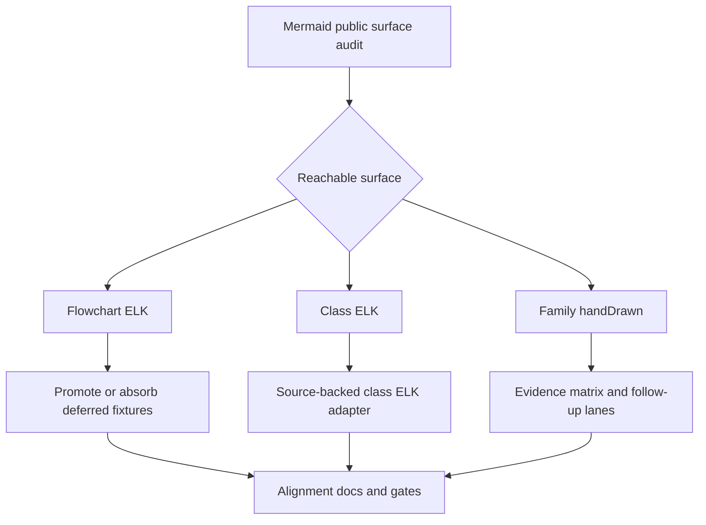

# feat: Close Mermaid-Reachable Parity Ports

## Summary

This plan closes the remaining Mermaid-reachable ELK parity surface and tightens hand-drawn support claims without widening the claim to private ELK internals or universal `look` support. The work turns current audit findings into enforceable fixture admission, source-backed Class ELK behavior, and a family-specific `look: handDrawn` evidence matrix.

---

## Problem Frame

Flowchart ELK now has a source-backed lane with full upstream `flowchart-elk.spec.js` call coverage, and the reported `mergeEdges: true` plus `nodePlacementStrategy: LINEAR_SEGMENTS` case is already locked by a render test. The remaining user-facing risk is not Flowchart ELK itself; it is unsupported-config surprise when other Mermaid public entry points accept `layout: elk`, `defaultRenderer: elk`, or `look: handDrawn` without rendered behavior that matches the support claim.

Current docs still describe `class.defaultRenderer` as detector-only, one Flowchart docs `layout: elk` fixture remains deferred, and `look` is correctly documented as partial by diagram. The next implementation pass should make those statements source-backed: support Mermaid-reachable behavior where local architecture can carry it, and make unsupported boundaries explicit instead of silently falling back to a different renderer.

---

## Requirements

**Reachable Surface Inventory**

- R1. The repo must have a repeatable audit for Mermaid public config/frontmatter surfaces that reach ELK layout, class renderer selection, or hand-drawn rendering.
- R2. Deferred fixtures with `layout` or `look` signals must either be promoted, absorbed as duplicates, or recorded with a source-backed reason.

**ELK Layout**

- R3. Flowchart `layout: elk` and `flowchart.defaultRenderer: elk` must stay on the source-backed ELK lane, including public ELK options already covered by the Flowchart gate.
- R4. Class `layout: elk` and `class.defaultRenderer: elk` must not silently render through the ordinary Dagre-compatible path when Mermaid's pinned source exposes an ELK renderer path.
- R5. Class ELK support must preserve existing Class SVG semantics for labels, notes, namespaces, relations, cardinalities, styles, links, and security-level behavior.

**Hand-Drawn Rendering**

- R6. `look: handDrawn` support claims must remain family-specific and backed by SVG tests or upstream baseline fixtures.
- R7. Mermaid-reachable non-Flowchart hand-drawn branches for admitted families must either have existing deterministic seed evidence in this plan or be documented as deferred family lanes with source-backed reasons and no user-facing overclaim.

**Operational Confidence**

- R8. New ELK or RoughJS work must use existing resource-limit posture where possible, extending it only where the current limits do not cover the new layout or rough-path workload.
- R9. Alignment docs must state the supported and unsupported boundaries precisely enough that users can tell whether importing Mermaid config will change rendered output.

---

## Scope Boundaries

In scope:

- Mermaid public config/frontmatter and detector paths for `layout: elk`, `flowchart.defaultRenderer: elk`, `class.defaultRenderer: elk`, `look: handDrawn`, and `handDrawnSeed`.
- Existing admitted diagram families and deferred fixtures that parse locally and are reachable from Mermaid public syntax or config.
- Source-backed fixture admission, layout/render tests, and alignment documentation.

Deferred to follow-up work:

- Full Eclipse ELK private processor inventory beyond Mermaid's public Flowchart/Class surfaces.
- New Venn and Ishikawa `look: handDrawn` renderer ports; this plan may only record follow-up scope or promote existing evidence if no new renderer work is required.
- New upstream diagram families that are not admitted in the Mermaid 11.15 matrix.
- Pixel-perfect browser root viewport convergence where residuals are already tracked as `parity-root` debt rather than semantic DOM parity.

Out of scope:

- Silent downgrade from an explicit Mermaid ELK renderer request to a non-ELK renderer.
- A universal claim that `look` works for every diagram family before each family has evidence.

---

## Key Technical Decisions

- KTD1. Source-backed reachable parity beats private inventory parity: the plan follows Mermaid's public config and renderer paths first, while unsupported full-ELK processors continue to fail or remain undocumented rather than being approximated.
- KTD2. No silent fallback for explicit renderer selection: if a user asks for Class ELK through Mermaid-supported config, the implementation either renders through an ELK path or fails with an explicit unsupported boundary during development until support lands.
- KTD3. Reuse existing layout models where the SVG DOM is shared: Class ELK should feed the existing `ClassDiagramV2Layout` and SVG renderer unless pinned Mermaid source proves that the ELK branch changes DOM semantics, because this keeps labels, styles, links, and hand-drawn class rendering in one renderer.
- KTD4. Keep Cargo feature boundaries conservative: Class ELK should reuse the existing `elk-layout` feature and `merman-layout-elk` dependency rather than adding a second ELK dependency or making a new default feature decision.
- KTD5. Treat `look: handDrawn` as a family contract: each admitted family gets focused SVG proof for rough paths and seed determinism before docs claim rendered support.
- KTD6. Resource limits are part of the renderer contract: new ELK graph construction and rough-path generation should be covered by `RenderResourceLimits` or an adjacent family-specific extension before broad fixture admission.

---

## High-Level Technical Design

The implementation starts with a reachable-surface inventory so the active work is driven by Mermaid's pinned source and existing fixtures. Flowchart ELK should mostly be fixture admission and guardrail work. Class ELK is the main renderer port: build an ELK graph from the Class semantic model, map the result back into the existing class layout model, and keep SVG emission centralized unless source evidence requires a separate DOM path. Hand-drawn work in this plan is claim cleanup: existing proven families are documented, while Venn and Ishikawa become source-backed follow-up lanes instead of expanding the active renderer port.

---

## Implementation Units

### U1. Re-audit Mermaid-reachable config and deferred gaps

- **Goal:** Produce a current inventory of reachable `layout`, `defaultRenderer`, and `look` gaps, separating actionable renderer work from duplicate or upstream-failing fixtures.
- **Requirements:** R1, R2, R9
- **Dependencies:** None
- **Files:**
  - `crates/xtask/src/cmd/audit.rs`
  - `crates/xtask/src/cmd/admission.rs`
  - `docs/alignment/CONFIG_FRONTMATTER_SUPPORT.md`
  - `docs/alignment/GAP_BACKLOG.md`
  - `docs/alignment/STATUS.md`
  - `fixtures/_deferred/README.md`
- **Approach:** Extend the existing audit classification only where it currently hides meaningful distinctions between Flowchart ELK duplicates, Class ELK candidates, and hand-drawn family gaps. Keep the report focused on public Mermaid reachability rather than full upstream package internals.
- **Patterns to follow:** `absorbed_deferred_duplicate` in `crates/xtask/src/cmd/audit.rs`; admission records in `crates/xtask/src/cmd/admission.rs`; support-level language in `docs/alignment/CONFIG_FRONTMATTER_SUPPORT.md`.
- **Test scenarios:**
  - A deferred Flowchart ELK fixture with an admitted active copy is reported as absorbed, not as an actionable gap.
  - A deferred Class fixture with `layout: elk` is surfaced as a Class ELK candidate until renderer support and fixture admission prove it.
  - Deferred parse-OK fixtures with only `look: handDrawn` are grouped by family and do not imply parser correctness debt.
  - Parser-only fixtures that upstream Mermaid CLI cannot render remain non-actionable.
- **Verification:** The generated audit has no unclassified parse-OK `layout` or `look` entries, and alignment docs mirror the audit categories without broadening support claims.

### U2. Characterize Class ELK source behavior

- **Goal:** Determine exactly how Mermaid 11.15 exposes Class ELK through `layout: elk` and `class.defaultRenderer: elk`, then lock the expected local entry-point behavior before changing layout internals.
- **Requirements:** R1, R4, R5
- **Dependencies:** U1
- **Files:**
  - `repo-ref/mermaid/packages/mermaid/src/diagrams/class/`
  - `crates/merman-core/src/detect/mod.rs`
  - `crates/merman-core/src/family.rs`
  - `crates/merman-render/src/lib.rs`
  - `crates/merman/tests/class_elk_render.rs`
  - `crates/merman-render/tests/class_layout_test.rs`
- **Approach:** Treat pinned Mermaid source as authority for config reachability and renderer selection. Add characterization tests that prove detection and layout dispatch semantics before implementing the adapter, including the current no-silent-fallback expectation.
- **Patterns to follow:** Flowchart ELK detector tests and render dispatch tests in `crates/merman-render/src/lib.rs`; config merge tests in `crates/merman-core/src/tests/misc.rs`.
- **Test scenarios:**
  - Frontmatter `config.layout: elk` on `classDiagram` reaches effective config and selects the planned Class ELK path.
  - `config.class.defaultRenderer: elk` follows Mermaid source semantics for renderer selection.
  - Existing `class.defaultRenderer: dagre-wrapper` behavior remains unchanged.
  - The existing Class Cypress `elk_v3` fixtures are classified as source-origin evidence, not proof that the local renderer currently uses ELK.
- **Verification:** Characterization tests fail against the old silent-fallback behavior and define the adapter contract that U3 must satisfy.

### U3. Implement source-backed Class ELK layout

- **Goal:** Render Class ELK requests through a source-backed ELK layout path while preserving the existing Class semantic and SVG renderer contract.
- **Requirements:** R4, R5, R8
- **Dependencies:** U2
- **Files:**
  - `crates/merman-render/src/lib.rs`
  - `crates/merman-render/src/class.rs`
  - `crates/merman-render/src/class/elk.rs`
  - `crates/merman-render/src/model.rs`
  - `crates/merman-layout-elk/src/lib.rs`
  - `crates/merman-render/tests/class_layout_test.rs`
  - `crates/merman-render/tests/class_svg_test.rs`
  - `crates/merman/tests/class_elk_render.rs`
- **Approach:** Build a Class-specific ELK graph adapter from the existing typed Class model and label metrics. Map ELK nodes, edges, edge labels, terminal labels, and namespace bounds into `ClassDiagramV2Layout` so downstream SVG emission keeps the existing class renderer. Extend `RenderResourceLimits` only if the current flowchart-focused checks do not cover Class graph complexity.
- **Patterns to follow:** Flowchart ELK adapter in `crates/merman-render/src/flowchart/elk.rs`; Class layout model construction in `crates/merman-render/src/class.rs`; class hand-drawn SVG tests in `crates/merman-render/tests/class_svg_test.rs`.
- **Test scenarios:**
  - A simple Class ELK diagram lays out in the requested direction and differs from the ordinary Dagre-compatible path in a detectable way.
  - Cardinality labels and relation titles stay attached to the correct edge sides after ELK routing.
  - Notes, lollipop interfaces, and namespaces render without losing parent or attachment semantics.
  - Styled classes, classDefs, links, callbacks, and security-level sanitization produce the same SVG semantics as the existing Class renderer.
  - Over-budget Class ELK graphs fail through resource-limit errors before expensive layout work grows unbounded.
- **Verification:** Class ELK render tests pass, Class non-ELK fixtures remain stable, and family-local Class SVG DOM parity does not regress for existing baselines.

### U4. Promote or absorb the Flowchart docs `layout: elk` fixture

- **Goal:** Resolve the remaining Flowchart docs deferred fixture that uses frontmatter `layout: elk`.
- **Requirements:** R2, R3
- **Dependencies:** U1
- **Files:**
  - `fixtures/_deferred/flowchart/upstream_docs_layouts_how_to_use_001.mmd`
  - `fixtures/flowchart/upstream_docs_layouts_how_to_use_001.mmd`
  - `fixtures/upstream-svgs/flowchart/upstream_docs_layouts_how_to_use_001.svg`
  - `docs/alignment/FLOWCHART_UPSTREAM_TEST_COVERAGE.md`
  - `docs/alignment/GAP_BACKLOG.md`
  - `crates/xtask/src/cmd/audit.rs`
- **Approach:** Treat this as an admission cleanup, not new ELK implementation. Promote it if it is not already covered by an admitted exact-call or unique-body fixture; otherwise teach the audit to report the deferred copy as absorbed by the active Flowchart ELK lane.
- **Patterns to follow:** Existing Flowchart ELK probe admission and the absorbed duplicate logic in `crates/xtask/src/cmd/audit.rs`.
- **Test scenarios:**
  - The docs fixture renders through the source-backed Flowchart ELK path.
  - Its upstream SVG baseline is generated with the pinned Mermaid config and compares in the Flowchart DOM parity mode.
  - The deferred copy no longer appears as a parse-OK out-of-scope gap after promotion or absorption.
- **Verification:** Flowchart ELK coverage docs mention the docs fixture status, and the gap audit shows no actionable Flowchart `layout=elk` deferred work.

### U5. Tighten `look: handDrawn` support claims by family

- **Goal:** Make the docs and tests state exactly which diagram families consume `look: handDrawn` and `handDrawnSeed` in rendered SVG.
- **Requirements:** R6, R7, R9
- **Dependencies:** U1
- **Files:**
  - `docs/alignment/CONFIG_FRONTMATTER_SUPPORT.md`
  - `docs/alignment/STATUS.md`
  - `docs/alignment/CLASS_UPSTREAM_TEST_COVERAGE.md`
  - `docs/alignment/VENN_BETA_ADMISSION_PLAN.md`
  - `docs/alignment/ISHIKAWA_MINIMUM.md`
  - `crates/merman-render/tests/look_svg_test.rs`
  - `crates/merman-render/tests/hand_drawn_seed_svg_test.rs`
  - `crates/merman-render/tests/class_svg_test.rs`
- **Approach:** Convert the current partial-by-diagram statement into a family matrix with evidence links. Include Class hand-drawn evidence now that Class has dedicated rough SVG tests, and keep Venn/Ishikawa deferred until U6 records a source-backed family lane or finds existing evidence that needs no new renderer work.
- **Patterns to follow:** Existing `look` row in `docs/alignment/CONFIG_FRONTMATTER_SUPPORT.md`; seed determinism tests in `crates/merman-render/tests/hand_drawn_seed_svg_test.rs`.
- **Test scenarios:**
  - Flowchart, Class, ER, Requirement, and State each have a focused assertion that `look: handDrawn` changes visible rough output or the family-specific rough wrapper.
  - Same `handDrawnSeed` keeps visible rough output deterministic for every claimed family.
  - Different `handDrawnSeed` changes visible rough output for every claimed family with stochastic rough paths.
  - Families without evidence are absent from the rendered-support claim.
- **Verification:** `CONFIG_FRONTMATTER_SUPPORT.md` no longer underclaims Class or overclaims unsupported families, and no documentation row implies universal `look` support.

### U6. Split Venn and Ishikawa hand-drawn follow-up lanes

- **Goal:** Keep this plan focused by documenting Venn and Ishikawa hand-drawn support as follow-up lanes unless existing evidence proves a no-new-port promotion is safe.
- **Requirements:** R6, R7, R9
- **Dependencies:** U5
- **Files:**
  - `docs/alignment/VENN_BETA_ADMISSION_PLAN.md`
  - `docs/alignment/ISHIKAWA_MINIMUM.md`
  - `docs/alignment/STATUS.md`
  - `docs/alignment/CONFIG_FRONTMATTER_SUPPORT.md`
  - `docs/plans/`
- **Approach:** Audit pinned Mermaid renderers only far enough to write source-backed follow-up scope. The active deliverable is a clear support boundary: Venn and Ishikawa remain out of rendered `look: handDrawn` claims unless a focused check proves the work is already covered by existing rough rendering code.
- **Patterns to follow:** Venn source-backed geometry policy in `docs/alignment/VENN_BETA_ADMISSION_PLAN.md`; Ishikawa admission notes in `docs/alignment/ISHIKAWA_MINIMUM.md`; family-specific support wording in `docs/alignment/CONFIG_FRONTMATTER_SUPPORT.md`.
- **Test scenarios:**
  - `CONFIG_FRONTMATTER_SUPPORT.md` lists Venn and Ishikawa hand-drawn support as deferred or unsupported, not rendered-supported.
  - Venn and Ishikawa alignment docs explain the source reason for deferral and the minimum evidence required for promotion.
  - If a follow-up plan is created under `docs/plans/`, it references this plan and stays scoped to one family lane.
- **Verification:** The active implementation plan no longer requires Venn or Ishikawa renderer code to close, and follow-up docs make the remaining hand-drawn work discoverable.

Deferred implementation targets for those follow-up lanes:

- **Files:**
  - `crates/merman-render/src/svg/parity/venn/render.rs`
  - `crates/merman-render/src/svg/parity/ishikawa/`
  - `crates/merman-render/tests/look_svg_test.rs`
  - `crates/merman-render/tests/hand_drawn_seed_svg_test.rs`
  - `fixtures/venn/*.mmd`
  - `fixtures/ishikawa/*.mmd`
  - `fixtures/upstream-svgs/venn/*.svg`
  - `fixtures/upstream-svgs/ishikawa/*.svg`

### U7. Final gates and alignment cleanup

- **Goal:** Prove the new parity boundaries through focused tests, family compares, and documentation consistency checks.
- **Requirements:** R1, R2, R3, R4, R5, R6, R7, R8, R9
- **Dependencies:** U3, U4, U5, U6
- **Files:**
  - `docs/alignment/CONFIG_FRONTMATTER_SUPPORT.md`
  - `docs/alignment/GAP_BACKLOG.md`
  - `docs/alignment/STATUS.md`
  - `docs/alignment/FLOWCHART_UPSTREAM_TEST_COVERAGE.md`
  - `docs/alignment/CLASS_UPSTREAM_TEST_COVERAGE.md`
  - `docs/alignment/ADMISSION_INVENTORY.md`
  - `crates/xtask/src/cmd/admission.rs`
  - `crates/xtask/src/cmd/audit.rs`
- **Approach:** Finish by reconciling the machine-readable admission inventory, human alignment docs, and fixture corpus. The final state should make the next audit boring: no unexpected parser-only actionable gap, no deferred parse-OK fixture without a reason, and no doc claim unsupported by a test or baseline.
- **Patterns to follow:** Existing `check-alignment` style consistency checks and family-local compare docs.
- **Test scenarios:**
  - Core and render nextest suites pass with the new Class ELK and hand-drawn coverage.
  - Flowchart and Class family-local SVG DOM compares pass for promoted fixtures, while Venn and Ishikawa remain explicitly deferred unless U6 promotes existing no-new-port evidence.
  - Gap audit reports no unclassified actionable Mermaid-reachable `layout` or `look` gaps.
  - Alignment docs reference existing fixture and test paths.
- **Verification:** The working tree contains only intentional plan/implementation/docs changes, and the final audit summary matches the support matrix.

---

## Acceptance Examples

- AE1. Given a Flowchart frontmatter diagram with `layout: elk`, `mergeEdges: true`, and `nodePlacementStrategy: LINEAR_SEGMENTS`, rendering succeeds through the source-backed Flowchart ELK lane and keeps the existing regression test green.
- AE2. Given a Class diagram with frontmatter `config.layout: elk`, rendering uses the Class ELK path or fails during development until that path exists; it never silently falls back to ordinary Class layout.
- AE3. Given a Class diagram with `config.class.defaultRenderer: elk`, detection and render dispatch follow pinned Mermaid source semantics and produce a Class SVG with existing link/style/security behavior intact.
- AE4. Given `look: handDrawn` and a fixed seed for every family listed as rendered-supported, repeated renders produce identical visible rough output.
- AE5. Given `look: handDrawn` for a family not yet implemented, docs do not claim rendered support and the audit records a family-specific deferred lane rather than hiding it as generic parser debt.
- AE6. Given the current deferred fixture corpus, the audit distinguishes parser failures, upstream-render failures, absorbed duplicates, and actionable Mermaid-reachable renderer work.

---

## Success Metrics

- Users importing Mermaid config get fewer unsupported-config surprises: Flowchart and Class ELK requests either render through the intended path or have an explicit unsupported boundary.
- The support matrix tells users which `look: handDrawn` families visibly render rough output and which ones remain deferred.
- The final audit is clean because actionable reachable gaps are resolved or classified, not because low-demand renderer ports were pulled into the active scope.

---

## System-Wide Impact

This work touches public render semantics, feature-gated dependency behavior, fixture admission, and documentation. The biggest user-facing change is that explicit Class ELK requests become meaningful instead of being accepted only as config metadata. The biggest maintainer-facing change is that `look` support becomes an evidence matrix, which reduces future ambiguity when importing Mermaid fixtures without adding Venn and Ishikawa renderer ports to this plan.

No new default dependency should be introduced by this plan. ELK work should stay behind the existing `elk-layout` feature, and hand-drawn work should reuse the existing rough rendering code paths before adding new crates or feature gates.

---

## Risks & Dependencies

| Risk | Impact | Mitigation |
|---|---|---|
| Class ELK requires DOM differences beyond layout geometry | The existing Class SVG renderer may not be sufficient | Characterize Mermaid source and upstream baselines in U2 before committing to the shared-renderer path |
| Existing Class `elk_v3` fixtures give false confidence | They may be named from upstream ELK specs while local rendering still uses ordinary layout | Treat them as source-origin coverage until U2 proves local dispatch |
| RoughJS parity grows beyond a small family branch | Venn or Ishikawa hand-drawn support can become a larger sub-port | Keep unsupported families out of docs claims and split a child lane rather than approximating |
| Resource limits remain Flowchart-centric | Class ELK or rough rendering could become a CPU/SVG-size DoS vector | Extend `RenderResourceLimits` at the graph/rough generation boundary before broad fixture admission |
| Documentation overclaims support | Users may import Mermaid config and expect behavior that is not rendered | Require each support-matrix promotion to cite a test or upstream baseline path |

---

## Sources / Research

- `docs/alignment/CONFIG_FRONTMATTER_SUPPORT.md`: current support matrix, including Flowchart ELK rendered support, detector-only Class defaultRenderer, and partial `look` claims.
- `docs/alignment/FLOWCHART_UPSTREAM_TEST_COVERAGE.md`: Flowchart ELK source-backed lane coverage for upstream render calls and public ELK options.
- `docs/alignment/GAP_BACKLOG.md`: current gap-audit policy and deferred fixture handling.
- `docs/alignment/CLASS_UPSTREAM_TEST_COVERAGE.md`: Class fixture corpus, including upstream `elk_v3` source-origin fixtures and current Class layout/SVG coverage.
- `crates/merman-render/src/lib.rs`: render dispatch path, Flowchart ELK feature gate, and current Class layout dispatch.
- `crates/merman-render/src/class.rs`: existing Class Dagre-compatible layout model construction and namespace/note/cardinality behavior.
- `crates/merman-core/src/detect/mod.rs`: Mermaid detector behavior for Flowchart ELK, Class renderer selection, and current defaultRenderer handling.
- `crates/xtask/src/cmd/audit.rs`: parser-only and deferred fixture audit classification.
- `fixtures/_deferred/flowchart/upstream_docs_layouts_how_to_use_001.mmd`: remaining Flowchart docs `layout: elk` deferred fixture.
- `fixtures/_deferred/class/upstream_cypress_classdiagram_v3_spec_should_render_a_full_class_diagram_using_elk_057.mmd`: Class `layout: elk` deferred candidate.
