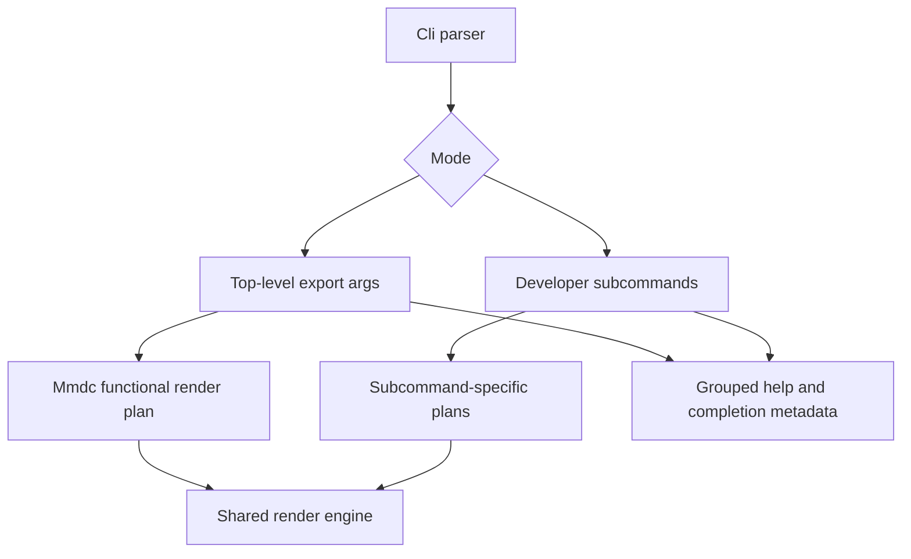

# refactor: Improve CLI Functional Parity and Ergonomics

## Summary

This plan improves `merman-cli` as a browserless functional replica of the official Mermaid CLI workflows without adding an `mmdc` binary alias. The work keeps the top-level export surface aligned with the pinned `mmdc@11.15.0` public behavior, separates compatibility flags from developer subcommands, and uses clap metadata to make help, validation, and shell integration clearer.

---

## Problem Frame

`merman-cli` already covers the documented top-level `mmdc` export workflow: input/output flags, format inference, Markdown batch rendering, config/theme/css handling, PDF fit behavior, icon packs, and accepted Puppeteer config preflight. The remaining gap is not core rendering functionality; it is CLI shape and user confidence. The current help mixes mmdc-compatible options, Rust-only renderer controls, Markdown-only batch flags, raster safety limits, and developer subcommand controls in one flat option set.

The most visible symptom is that `render` reuses the same `ExportArgs` struct as top-level mode, so `render --help` advertises options such as `--artefacts`, `--jobs`, and `--puppeteerConfigFile` even though those are top-level compatibility concerns. The top-level help also underuses clap affordances such as help headings, value hints, conflict metadata, and completion generation.

---

## Requirements

**Functional Parity**

- R1. Top-level `merman-cli` export behavior must keep covering every public `mmdc@11.15.0` flag that is implemented or deliberately documented as a browserless divergence.
- R2. The project must not add an `mmdc` binary alias; compatibility is functional behavior under the `merman-cli` command name, not zero-change script replacement.
- R3. Browser-specific surfaces such as Puppeteer runtime behavior, Chromium PDF layout, and browser font rendering must remain documented divergences rather than hidden promises.

**CLI Ergonomics**

- R4. Top-level help must separate mmdc-compatible export flags, Markdown batch flags, raster/PDF controls, Mermaid config controls, and Rust-only renderer controls into scannable groups.
- R5. Developer subcommands must show only options that are meaningful for that subcommand.
- R6. File, directory, and URL-like arguments must carry clap `ValueHint` metadata where clap can expose better shell and editor completions.
- R7. Mutually exclusive raster safety flags must be represented in clap metadata where possible, with runtime validation kept for constraints that need semantic context.
- R8. Defaults that materially affect output must be visible in help or long help, including browserless defaults such as viewport size, background color, scale, and raster size limits.

**Regression Confidence**

- R9. Existing CLI integration coverage must remain green for top-level export, Markdown mode, raster/PDF export, config precedence, icon packs, and developer subcommands.
- R10. New tests must lock the intended help surface so future compatibility work does not reintroduce mixed or misleading options.

---

## Scope Boundaries

In scope:

- Refactoring `crates/merman-cli` clap argument structs and render planning so top-level compatibility and developer subcommands have distinct contracts.
- Improving help grouping, value hints, visible defaults, conflicts, and completion generation for `merman-cli`.
- Updating CLI compatibility docs and README language to state functional replication without implying an `mmdc` executable alias.
- Adding focused CLI tests for help text, argument conflicts, and completion smoke coverage.

Deferred to follow-up work:

- Exact Chromium/Puppeteer rendering behavior for PDF pagination, fonts, and browser DOM measurement.
- Node package API compatibility with `@mermaid-js/mermaid-cli`.
- Docker image or npm package distribution parity.
- Full browser plugin parity for diagram families that still depend on browser-only Mermaid plugins.

Out of scope:

- Adding a second installed binary named `mmdc`.
- Renaming `merman-cli`.
- Hiding Rust-only capabilities such as JPG, ASCII/Unicode, deterministic time controls, or resource profiles.

---

## Key Technical Decisions

- KTD1. Preserve functional compatibility, not command-name compatibility: `merman-cli` remains the only binary, and documentation should describe it as a browserless functional replica for common `mmdc` workflows.
- KTD2. Split top-level compatibility args from developer render args: top-level mode can retain `mmdc` flags such as `--artefacts`, `--jobs`, and `--puppeteerConfigFile`, while `render` exposes only direct rendering controls.
- KTD3. Prefer clap metadata over custom prose where it fits: help headings, value hints, aliases, default values, and conflicts should carry the first layer of CLI behavior before runtime validation runs.
- KTD4. Keep runtime validation for semantic constraints: Markdown-only artefact rules, output extension inference, icon source loading, and config file shape still belong in render planning and IO because they depend on file paths or parsed values.
- KTD5. Add shell completion as a `merman-cli` ergonomic extension: use a CLI-only `clap_complete` dependency if dependency impact stays isolated from library, WASM, Typst, and FFI surfaces.
- KTD6. Treat help text as a compatibility surface: tests should assert important headers and absence of misleading options, not freeze the entire help output byte-for-byte.

---

## High-Level Technical Design

The refactor keeps the current command dispatch model, but narrows the argument structs that feed each branch. A small shared layer should hold genuinely common parse/render controls such as config, theme, viewport, SVG id, math renderer, text measurer, hand-drawn seed, and resource profile. Top-level export keeps Markdown batch and accepted browser-compatibility flags. The `render` subcommand gets a direct rendering argument set with output, format, raster/PDF controls, CSS, icons, and renderer controls, but without top-level-only Markdown or Puppeteer compatibility options.

---

## Implementation Units

### U1. Refresh the CLI functional parity inventory

- **Goal:** Reconfirm the pinned official CLI surface and update documentation so "functional replica" is the stated goal while `mmdc` binary aliasing is explicitly out of scope.
- **Requirements:** R1, R2, R3
- **Dependencies:** None
- **Files:**
  - `docs/alignment/CLI_COMPATIBILITY.md`
  - `docs/alignment/STATUS.md`
  - `crates/merman-cli/README.md`
  - `tools/mermaid-cli/node_modules/@mermaid-js/mermaid-cli/src/index.js`
  - `tools/mermaid-cli/node_modules/@mermaid-js/mermaid-cli/package.json`
- **Approach:** Keep the existing `mmdc@11.15.0` matrix as the source of truth, but add a clear "binary identity" boundary and make the browserless divergence register easier to find from README.
- **Patterns to follow:** Existing option matrix and divergence register in `docs/alignment/CLI_COMPATIBILITY.md`.
- **Test scenarios:**
  - The matrix still lists every official public flag from the pinned `index.js`.
  - The docs state that `merman-cli` does not install `mmdc`.
  - Browser-specific divergences stay documented instead of moving into help text as unsupported hidden behavior.
- **Verification:** A reviewer can determine from docs alone whether a script using official `mmdc` flags should work after replacing the command name with `merman-cli`.

### U2. Restructure clap help into grouped surfaces

- **Goal:** Make `merman-cli --help` readable by separating compatibility, Markdown, raster/PDF, config, and Rust-only controls.
- **Requirements:** R4, R8, R10
- **Dependencies:** U1
- **Files:**
  - `crates/merman-cli/src/cli.rs`
  - `crates/merman-cli/tests/cli_compat.rs`
  - `crates/merman-cli/README.md`
- **Approach:** Use clap `help_heading` or `next_help_heading` on flattened argument groups. Keep top-level examples short, and move long browserless divergence language to README and `CLI_COMPATIBILITY.md`.
- **Patterns to follow:** Existing clap derive setup in `crates/merman-cli/src/cli.rs`; current help smoke test in `crates/merman-cli/tests/cli_compat.rs`.
- **Test scenarios:**
  - Top-level help contains headings for mmdc-compatible export, Markdown batch, raster/PDF, Mermaid config, and Rust renderer controls.
  - Top-level help still includes official flags such as `--input`, `--output`, `--outputFormat`, `--configFile`, `--cssFile`, `--pdfFit`, `--iconPacks`, and `--iconPacksNamesAndUrls`.
  - Help text shows or names the effective defaults for viewport, background, scale, and raster limits.
  - The usage line does not imply that a developer subcommand is part of a normal top-level export invocation.
- **Verification:** Help tests assert important headings and representative flags while avoiding a brittle full snapshot.

### U3. Split top-level export args from `render` subcommand args

- **Goal:** Remove misleading top-level-only options from `merman-cli render --help` without regressing top-level mmdc-compatible behavior.
- **Requirements:** R1, R5, R9, R10
- **Dependencies:** U2
- **Files:**
  - `crates/merman-cli/src/cli.rs`
  - `crates/merman-cli/src/render.rs`
  - `crates/merman-cli/src/commands.rs`
  - `crates/merman-cli/tests/cli_compat.rs`
- **Approach:** Replace the single `ExportArgs` reuse with separate structs for top-level export and subcommand render. Extract shared structs only for options that are semantically common, so the Rust type system reflects the command contract.
- **Patterns to follow:** `render_plan_for_mmdc` and `render_plan_for_subcommand` in `crates/merman-cli/src/render.rs`; shared `ParseCliArgs` and `RenderCliArgs` patterns in `crates/merman-cli/src/cli.rs`.
- **Test scenarios:**
  - `render --help` does not show `--artefacts`, `--jobs`, or `--puppeteerConfigFile`.
  - Top-level mode still accepts `--artefacts`, `--jobs`, and `--puppeteerConfigFile` with the same behavior as before.
  - `render --format svg -` still writes SVG to stdout by default.
  - `render --format png --out out.png input.mmd` still writes raster output with existing safety limits.
  - Existing top-level Markdown input tests still pass after the struct split.
- **Verification:** The top-level compatibility suite and developer subcommand smoke tests pass with no user-visible behavior change except cleaner subcommand help.

### U4. Move validation metadata closer to clap

- **Goal:** Improve parse-time errors and shell/editor affordances while keeping semantic validation in render planning.
- **Requirements:** R6, R7, R8, R10
- **Dependencies:** U3
- **Files:**
  - `crates/merman-cli/src/cli.rs`
  - `crates/merman-cli/src/render.rs`
  - `crates/merman-cli/tests/cli_compat.rs`
- **Approach:** Add `ValueHint::FilePath` for input/config/css/Puppeteer paths, `ValueHint::DirPath` for artefact directories, and URL-oriented help for icon URL definitions. Express `--raster-unbounded` conflicts with `--raster-max-width`, `--raster-max-height`, and `--raster-max-pixels` through clap. Leave Markdown-only artefact validation and output extension inference in `render.rs`.
- **Patterns to follow:** Existing positive-number parsers in `crates/merman-cli/src/cli.rs`; current raster conflict test in `crates/merman-cli/tests/cli_compat.rs`.
- **Test scenarios:**
  - Combining `--raster-unbounded` with any `--raster-max-*` option fails at clap parse time or returns the existing clear error.
  - File path options advertise path value hints in the clap command metadata.
  - `--artefacts` remains rejected for non-Markdown input even though that rule stays runtime semantic validation.
  - Invalid positive numeric values keep the existing concise error messages.
- **Verification:** Error tests cover both clap-level conflicts and runtime semantic constraints without duplicating the same rule in two places.

### U5. Add shell completion generation

- **Goal:** Provide first-class completion scripts for the `merman-cli` command without changing compatibility semantics.
- **Requirements:** R6, R10
- **Dependencies:** U4
- **Files:**
  - `Cargo.toml`
  - `crates/merman-cli/Cargo.toml`
  - `crates/merman-cli/src/cli.rs`
  - `crates/merman-cli/src/commands.rs`
  - `crates/merman-cli/tests/cli_compat.rs`
- **Approach:** Add a `completion <shell>` subcommand backed by `clap_complete`. Keep the dependency CLI-only and workspace-scoped. Generate completions for `merman-cli`, not `mmdc`.
- **Patterns to follow:** Existing `Command` enum dispatch in `crates/merman-cli/src/commands.rs`.
- **Test scenarios:**
  - `merman-cli completion bash` emits a completion script containing the `merman-cli` command name.
  - Completion generation includes top-level flags and developer subcommands.
  - Unsupported shell names fail through clap `ValueEnum` validation.
  - The added dependency does not affect non-CLI crate feature graphs.
- **Verification:** A smoke test proves completion output is non-empty and command-scoped, while dependency review confirms the change is isolated to `merman-cli`.

### U6. Update docs and regression gates for the final CLI shape

- **Goal:** Make the improved CLI contract visible to users and protect it in CI-style test runs.
- **Requirements:** R1, R2, R3, R9, R10
- **Dependencies:** U1, U2, U3, U4, U5
- **Files:**
  - `crates/merman-cli/README.md`
  - `docs/alignment/CLI_COMPATIBILITY.md`
  - `docs/alignment/STATUS.md`
  - `crates/merman-cli/tests/cli_compat.rs`
- **Approach:** Update examples to show top-level functional replacement by changing the command name, not by promising an alias. Add a short section explaining developer subcommands and completion generation. Keep compatibility claims tied to the pinned official CLI version.
- **Patterns to follow:** README's current "Quick Start", "Common Options", and "Compatibility Notes" sections.
- **Test scenarios:**
  - Existing top-level examples in README remain executable against the test fixture style used in integration tests.
  - Help tests prove top-level and `render` surfaces are distinct.
  - Functional compatibility tests still cover SVG, PNG, PDF, Markdown, config/theme/css, icon packs, stdout, and default output paths.
  - The full `merman-cli` test package passes with default features.
- **Verification:** CI-style checks for formatting and the `merman-cli` package pass after the refactor.

---

## Acceptance Examples

- AE1. Given a Mermaid file and official-style flags, when a user runs `merman-cli -i diagram.mmd -o diagram.png -t dark -b transparent`, then the command renders successfully with the same functional behavior currently covered by top-level compatibility tests.
- AE2. Given a Markdown input file, when a user runs top-level mode with `--jobs` and `--artefacts`, then numbered artefacts are produced in source order and Markdown rewrite behavior remains unchanged.
- AE3. Given a developer checking `merman-cli render --help`, when help is displayed, then Markdown batch and Puppeteer compatibility flags are absent.
- AE4. Given a shell integration user, when `merman-cli completion bash` runs, then it emits completion data for the `merman-cli` command and includes developer subcommands.
- AE5. Given a user combining `--raster-unbounded` with a raster max limit, when clap parses the command, then the user receives a direct conflict error or the existing equivalent validation error.

---

## Risks & Dependencies

- **Help tests can become brittle:** Assert headings and representative flags rather than entire help snapshots.
- **Argument struct split can change behavior accidentally:** Keep render planning tests focused on generated `RenderPlan` behavior and preserve existing integration tests before changing internals.
- **`clap_complete` adds a new CLI dependency:** Keep it in `crates/merman-cli` only, with no changes to library, WASM, Typst, or FFI feature defaults.
- **Grouped help can hide useful Rust extensions:** Group Rust-only options under a clear heading rather than making them hidden.
- **Dynamic defaults are not all clap-native:** Use help text for runtime-derived values such as default Markdown jobs when clap cannot represent the exact value statically.

---

## Sources / Research

- `crates/merman-cli/src/cli.rs`
- `crates/merman-cli/src/render.rs`
- `crates/merman-cli/src/commands.rs`
- `crates/merman-cli/tests/cli_compat.rs`
- `crates/merman-cli/README.md`
- `docs/alignment/CLI_COMPATIBILITY.md`
- `tools/mermaid-cli/node_modules/@mermaid-js/mermaid-cli/src/index.js`
- `tools/mermaid-cli/node_modules/@mermaid-js/mermaid-cli/package.json`
