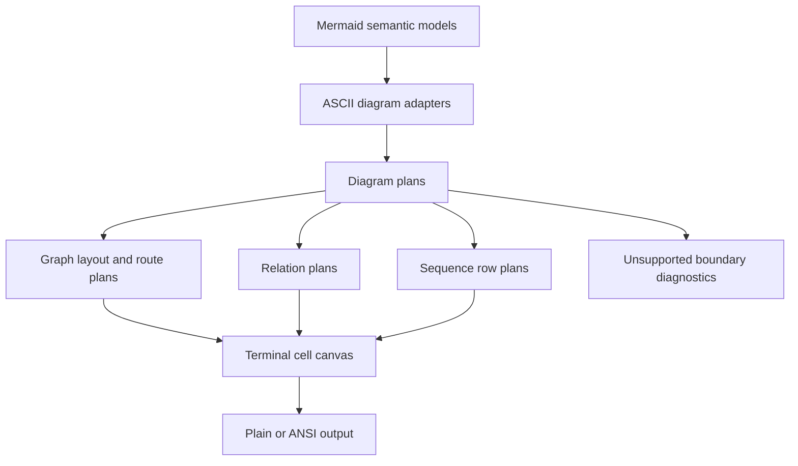

# refactor: Deepen ASCII Architecture

## Summary

This plan turns the current ASCII renderer from a set of diagram-local drawing routines into a smaller set of semantic planning layers. It intentionally allows breaking ASCII snapshots when existing output conflicts with Mermaid semantics, terminal display-cell rules, or source-backed behavior from the pinned reference projects.

---

## Problem Frame

`merman-ascii` already supports useful Flowchart, Sequence, Class, ER, and XYChart output, with color roles and fixture coverage. Other Mermaid families still return explicit unsupported-diagram errors through the crate entry point. The remaining problems are architectural: some semantics are decided too late in drawing code, some unsupported graph routes disappear silently, and terminal width handling is split between `display_width` calls and character-index writes.

The most visible correctness gap is Flowchart subgraph direction. The current layout skips local subgraph direction whenever a group has cross-boundary edges, while the reference ASCII fixture in `repo-ref/beautiful-mermaid` keeps the local left-to-right placement in a cross-boundary case. Routing has a similar boundary problem: edge planning can return no route and the drawing layer then emits nothing.

The second systemic gap is terminal cell ownership. `crates/merman-ascii/src/text.rs` knows about display width, but many write paths still advance by Rust characters rather than terminal cells. `repo-ref/mermaid-ascii/cmd/draw.go` uses `runewidth` and placeholder cells for wide characters, which is the right primitive for a terminal renderer.

This work should use fearless refactoring rather than preserving old ASCII snapshots. Old output is evidence only when it represents correct semantics.

---

## Requirements

**Graph Semantics**

- R1. Flowchart subgraphs with local direction must preserve internal relative placement when Mermaid semantics support it; cross-boundary edges must not be a blanket opt-out.
- R2. Every graph edge must either produce a route plan or produce an explicit unsupported-route signal that tests can assert.
- R3. Route planning must carry edge style, arrow, label, and transform intent before drawing starts.
- R4. Graph drawing must stop inferring styled cells by cloning the canvas and post-processing a paint delta.

**Terminal Cell Model**

- R5. Text placement must use terminal display cells, including wide characters, combining marks, ANSI roles, and plain-output fallback.
- R6. Diagram renderers must write through the shared cell primitive instead of mixing character counts, display widths, and manual padding rules.
- R7. Color-role behavior introduced for ASCII output must remain stable in both plain and ANSI modes.

**Shared Diagram Planning**

- R8. Class and ER relation drawing must share a relation planning boundary that owns lanes, parallel edges, cardinalities, labels, and centered relation text placement.
- R9. Sequence rendering must plan rows and overlays before painting, so notes, boxes, activations, loop/alt/control blocks, and messages have one ordering contract.
- R10. Flowchart shape rendering should have an explicit shape boundary where shape semantics materially affect size, ports, labels, and route attachment.

**Evidence and Documentation**

- R11. Tests must distinguish semantic failures from expected snapshot churn caused by the breaking refactor.
- R12. ASCII support docs and gap registries must record unsupported boundaries instead of allowing silent approximation.
- R13. Reference-project evidence must be used as prior art, with pinned Mermaid semantics taking precedence over copying another renderer's quirks.

---

## Scope Boundaries

In scope:

- Internal refactors inside `crates/merman-ascii` that change Flowchart, Sequence, Class, ER, and shared terminal-cell behavior.
- Breaking updates to ASCII and Unicode snapshots when old output was semantically wrong.
- Focused additions to support docs and gap registries that explain new unsupported-route or deferred-feature signals.
- Source-backed comparisons against `repo-ref/beautiful-mermaid`, `repo-ref/mermaid-ascii`, and pinned `repo-ref/mermaid` behavior.

Deferred to follow-up work:

- XYChart feature expansion such as full legend support or complete plot-area parity; this plan only covers width-safe text placement in existing XYChart output.
- New diagram-family ASCII support beyond the families already present in `crates/merman-ascii`, including Requirement and GitGraph.
- Pixel-perfect browser SVG parity; ASCII is judged by terminal semantics and Mermaid meaning, not browser DOM geometry.
- A full public API redesign for the `merman-ascii` crate outside the renderer internals needed by this plan.

Out of scope:

- Preserving current snapshots when they encode a known semantic error.
- Hiding unsupported graph routes by dropping edges from output.
- Adding broad magic-number tuning only to make one fixture visually closer to another renderer.

---

## Key Technical Decisions

- KTD1. Correct semantics beat snapshot compatibility: existing ASCII output may be broken and rebaselined when the model or route invariant proves it wrong.
- KTD2. Plan before paint: layout, route, style, relation, sequence-row, and terminal-cell decisions should be represented as inspectable plans before mutating the final canvas.
- KTD3. Diagnostics beat silent approximation: when the ASCII renderer cannot represent a graph route, it should surface a testable unsupported boundary instead of omitting the edge.
- KTD4. Terminal cells are a primitive, not a helper: width, occupancy, color role, and escaping behavior belong in one shared canvas/text layer.
- KTD5. Shared relation planning owns relation geometry: Class and ER should adapt domain relationships into one relation plan instead of duplicating lane and label decisions.
- KTD6. Reference implementations are evidence, not authority: `beautiful-mermaid` and `mermaid-ascii` guide architecture and fixtures, while pinned Mermaid source decides semantics.
- KTD7. Shape extraction follows invariants, not cosmetics: introduce a Flowchart shape boundary only where it clarifies sizing, port attachment, or route semantics.

---

## High-Level Technical Design

The renderer should make semantic commitments before drawing. Graph layout decides direction, groups, and node placements; route planning decides cells, labels, arrows, and style intent; relation planning decides shared Class/ER lanes; sequence planning decides row order and overlays. The canvas then becomes a terminal-cell writer, not the place where semantic omissions are hidden.

---

## Phased Delivery

- Phase 1 fixes graph correctness and testable routing boundaries, because dropped edges and wrong subgraph direction are user-visible semantic errors.
- Phase 2 deepens terminal-cell handling, because later diagram refactors should write through the same width-safe primitive.
- Phase 3 consolidates shared relation and sequence planning after the cell layer can represent their labels safely.
- Phase 4 rebases snapshots, docs, and gap registries after the new invariants have replaced old output assumptions.

---

## Implementation Units

### U1. Lock ASCII evidence and breaking-output policy

- **Goal:** Establish a clear evidence baseline so implementers can break wrong output without turning the refactor into unreviewable snapshot churn.
- **Requirements:** R11, R12, R13
- **Dependencies:** None
- **Files:**
  - `crates/merman-ascii/FLOWCHART_SUPPORT.md`
  - `crates/merman-ascii/SEQUENCE_SUPPORT.md`
  - `crates/merman-ascii/ASCII_GAP_REGISTRY.md`
  - `crates/merman-ascii/V1_MERMAID_ASCII_COVERAGE.md`
  - `crates/merman-ascii/tests/flowchart_model.rs`
  - `crates/merman-ascii/tests/graph_fixture.rs`
  - `crates/merman-ascii/tests/testdata/mermaid-ascii/README.md`
- **Approach:** Add or update characterization notes that identify which snapshots are compatibility baselines and which are known wrong-model outputs. Keep reference-project paths as research breadcrumbs, not as a new parity contract.
- **Execution note:** Start with characterization tests or explicit TODO-style gap entries before changing renderer behavior.
- **Patterns to follow:** Existing support-matrix language in `crates/merman-ascii/FLOWCHART_SUPPORT.md`; gap-entry style in `crates/merman-ascii/ASCII_GAP_REGISTRY.md`; fixture provenance notes under `crates/merman-ascii/tests/testdata/mermaid-ascii/`.
- **Test scenarios:**
  - A cross-boundary subgraph-direction fixture is identified as a semantic target, not as a snapshot to preserve.
  - A known silent edge-drop case is recorded as unsupported-route debt until U2 replaces it with a route or diagnostic.
  - Existing imported `mermaid-ascii` fixtures remain labeled as external evidence with their known gaps.
  - Support docs state that breaking ASCII snapshots is allowed when Mermaid semantics or terminal-cell rules demand it.
- **Verification:** A reviewer can tell which fixture changes are intentional semantic corrections before reading the implementation diff.

### U2. Deepen graph direction and route invariants

- **Goal:** Make Flowchart layout and routing preserve Mermaid direction semantics and stop dropping unroutable edges silently.
- **Requirements:** R1, R2, R11, R12
- **Dependencies:** U1
- **Files:**
  - `crates/merman-ascii/src/graph/layout.rs`
  - `crates/merman-ascii/src/graph/draw.rs`
  - `crates/merman-ascii/src/graph/routing.rs`
  - `crates/merman-ascii/src/graph/routing/plan.rs`
  - `crates/merman-ascii/src/graph/routing/plan/select.rs`
  - `crates/merman-ascii/src/graph/routing/plan/left_right.rs`
  - `crates/merman-ascii/src/graph/routing/plan/top_down.rs`
  - `crates/merman-ascii/tests/flowchart_model.rs`
  - `crates/merman-ascii/tests/graph_fixture.rs`
- **Approach:** Replace the current cross-boundary skip with a layout rule that composes local subgraph direction with external edge constraints. Change route planning so an edge outcome is represented as routed, explicitly unsupported, or impossible due to a detected model invariant violation.
- **Patterns to follow:** Existing route-planner tests in `crates/merman-ascii/src/graph/routing/plan/tests.rs`; Mermaid direction behavior in `repo-ref/mermaid/packages/mermaid/src/diagrams/flowchart/parser/flow-direction.spec.js`; reference ASCII direction fixture in `repo-ref/beautiful-mermaid/src/__tests__/testdata/ascii/subgraph_direction_override.txt`.
- **Test scenarios:**
  - A subgraph with local `direction LR` and cross-boundary incoming/outgoing edges keeps its internal left-to-right node order.
  - Nested subgraphs with mixed local directions keep each group's local ordering without moving external nodes into the group.
  - A route planner failure produces a visible diagnostic path for tests instead of omitting the edge from the canvas.
  - Existing simple TB, LR, self-edge, backlink, and bidirectional-edge fixtures still route through the new outcome model.
  - Unsupported-route entries are reflected in `ASCII_GAP_REGISTRY.md` when a route cannot be implemented in the same unit.
- **Verification:** Graph tests can assert that every input edge is accounted for as routed or explicitly unsupported.

### U3. Move edge style and transform intent into `RoutePlan`

- **Goal:** Make graph route plans carry the complete paint intent before the canvas is mutated.
- **Requirements:** R3, R4, R11
- **Dependencies:** U2
- **Files:**
  - `crates/merman-ascii/src/graph/routing.rs`
  - `crates/merman-ascii/src/graph/routing/cell.rs`
  - `crates/merman-ascii/src/graph/routing/label.rs`
  - `crates/merman-ascii/src/graph/routing/plan.rs`
  - `crates/merman-ascii/src/graph/routing/plan/select.rs`
  - `crates/merman-ascii/src/graph/draw.rs`
  - `crates/merman-ascii/src/graph/style.rs`
  - `crates/merman-ascii/src/graph/routing/plan/tests.rs`
  - `crates/merman-ascii/tests/flowchart_model.rs`
- **Approach:** Extend route-plan cells and labels with style, arrow, and role metadata. Remove the clone-and-delta styling path once styled cells can be painted directly.
- **Patterns to follow:** Current `RoutePlan` and `PlannedRouteCellKind` structures; graph style conversion helpers in `crates/merman-ascii/src/graph/style.rs`; color-role conventions in `crates/merman-ascii/src/color.rs`.
- **Test scenarios:**
  - Thick, dotted, and normal edges expose distinct style metadata in route-plan tests before painting.
  - Arrowhead and bidirectional edge plans carry endpoint intent without relying on post-paint canvas inspection.
  - Edge labels receive the edge-label role directly from the plan.
  - Removing the canvas-delta path does not regress styled Flowchart snapshots except where expected rebaselines are recorded by U1.
- **Verification:** `graph/draw.rs` paints planned cells directly, and no edge styling requires comparing a before/after canvas clone.

### U4. Make terminal cells the shared text primitive

- **Goal:** Centralize terminal width, occupancy, color-role, escaping, and placeholder-cell behavior in the canvas/text layer.
- **Requirements:** R5, R6, R7, R11
- **Dependencies:** U1
- **Files:**
  - `crates/merman-ascii/src/canvas.rs`
  - `crates/merman-ascii/src/text.rs`
  - `crates/merman-ascii/src/color.rs`
  - `crates/merman-ascii/src/graph/draw.rs`
  - `crates/merman-ascii/src/graph/label.rs`
  - `crates/merman-ascii/src/graph/routing/label.rs`
  - `crates/merman-ascii/src/sequence/text.rs`
  - `crates/merman-ascii/src/sequence/control.rs`
  - `crates/merman-ascii/src/sequence/events.rs`
  - `crates/merman-ascii/src/sequence/notes.rs`
  - `crates/merman-ascii/src/xychart/render.rs`
  - `crates/merman-ascii/tests/sequence_model.rs`
  - `crates/merman-ascii/tests/flowchart_model.rs`
  - `crates/merman-ascii/tests/xychart_model.rs`
- **Approach:** Introduce one terminal-cell representation that records a displayed glyph, optional continuation/placeholder state for wide characters, and color role. Replace direct character-count writes with cell-aware writes in shared helpers before updating diagram-specific call sites.
- **Patterns to follow:** Existing `StyledLine` and `display_width` helpers in `crates/merman-ascii/src/text.rs`; color-role renderer tests in `crates/merman-ascii/src/canvas.rs`; wide-character approach in `repo-ref/mermaid-ascii/cmd/draw.go`.
- **Test scenarios:**
  - Writing a CJK label into a canvas reserves two display cells and prevents later writes from occupying the continuation cell.
  - Sequence messages with CJK labels wrap and align by display cells, not Rust character count.
  - Flowchart node labels, edge labels, titles, and subgraph labels align after wide-character input.
  - XYChart axis labels and titles do not overwrite adjacent plot content when labels contain wide characters.
  - ANSI color-role output still emits the same roles for ASCII-only text and escapes HTML-sensitive characters in SVG/plain export paths where applicable.
- **Verification:** Diagram renderers no longer need to compensate manually for wide-character occupancy at each call site.

### U5. Deepen `RelationGraph` into a relation planner

- **Goal:** Move Class and ER relation geometry into one inspectable planning boundary.
- **Requirements:** R8, R11, R12
- **Dependencies:** U4
- **Files:**
  - `crates/merman-ascii/src/relation_graph.rs`
  - `crates/merman-ascii/src/class/render.rs`
  - `crates/merman-ascii/src/er/render.rs`
  - `crates/merman-ascii/tests/class_model.rs`
  - `crates/merman-ascii/tests/er_model.rs`
- **Approach:** Convert low-level helpers such as lane offsets, relation characters, and centered relation text into a relation-plan API. Class and ER renderers should adapt their domain relationships into that API, then paint the resulting plan through the cell canvas.
- **Patterns to follow:** Existing shared helpers in `crates/merman-ascii/src/relation_graph.rs`; Class relation rendering in `crates/merman-ascii/src/class/render.rs`; ER cardinality rendering in `crates/merman-ascii/src/er/render.rs`.
- **Test scenarios:**
  - Parallel Class relations allocate stable separate lanes without Class-specific duplicate lane logic.
  - ER identifying and non-identifying relationships keep their line characters and cardinalities after moving through the shared plan.
  - Centered relation labels use display-cell widths and do not drift for wide characters.
  - Self-relations and spanning relations are either routed by the planner or recorded as unsupported relation cases.
  - Class and ER snapshot changes are limited to planned geometry or width corrections recorded by U1.
- **Verification:** Class and ER relation paint paths depend on a shared relation plan rather than direct calls into scattered low-level geometry helpers.

### U6. Convert sequence rendering to a row plan

- **Goal:** Make sequence row ordering explicit before rendering so messages, notes, activations, boxes, and control blocks cannot fight for the same row by side effect.
- **Requirements:** R5, R6, R7, R9, R11
- **Dependencies:** U4
- **Files:**
  - `crates/merman-ascii/src/sequence/plan.rs`
  - `crates/merman-ascii/src/sequence/render.rs`
  - `crates/merman-ascii/src/sequence/events.rs`
  - `crates/merman-ascii/src/sequence/control.rs`
  - `crates/merman-ascii/src/sequence/boxes.rs`
  - `crates/merman-ascii/src/sequence/notes.rs`
  - `crates/merman-ascii/src/sequence/layout.rs`
  - `crates/merman-ascii/tests/sequence_model.rs`
  - `crates/merman-ascii/tests/testdata/mermaid-ascii/SEQUENCE_FIXTURE_GAPS.md`
- **Approach:** Replace the mutable event-state bag with row instructions that describe the event row, overlay rows, activation changes, and note/control boundaries. The renderer should paint rows from this plan rather than deciding row insertion while walking events.
- **Patterns to follow:** Existing `SequenceEventPlan` tests in `crates/merman-ascii/src/sequence/plan.rs`; sequence layout helpers in `crates/merman-ascii/src/sequence/layout.rs`; imported fixture gap style in `crates/merman-ascii/tests/testdata/mermaid-ascii/SEQUENCE_FIXTURE_GAPS.md`.
- **Test scenarios:**
  - A message with activation start/end produces the same participant lifecycle rows regardless of label width.
  - Notes over one or more participants reserve rows before message drawing and do not overlap control blocks.
  - `alt`, `loop`, and nested control blocks produce stable row boundaries when combined with messages and notes.
  - CJK participant labels and message labels stay aligned through the shared terminal-cell writer.
  - Imported `mermaid-ascii` sequence fixture gaps are updated only when the new row plan intentionally changes behavior.
- **Verification:** `sequence/render.rs` becomes mostly a painter over row plans, and row-plan tests cover event ordering without needing full snapshot assertions for every case.

### U7. Extract Flowchart shape semantics where they affect plans

- **Goal:** Separate Flowchart node shape semantics from layout and drawing code when those semantics affect size, ports, labels, or route attachment.
- **Requirements:** R3, R10, R11, R13
- **Dependencies:** U2, U3, U4
- **Files:**
  - `crates/merman-ascii/src/graph/adapter.rs`
  - `crates/merman-ascii/src/graph/model.rs`
  - `crates/merman-ascii/src/graph/layout.rs`
  - `crates/merman-ascii/src/graph/draw.rs`
  - `crates/merman-ascii/src/graph/routing/plan/left_right.rs`
  - `crates/merman-ascii/tests/flowchart_model.rs`
  - `repo-ref/beautiful-mermaid/src/ascii/shapes/types.ts`
- **Approach:** Introduce a shape-level plan only for shape properties that routing and layout need. Keep purely visual glyph choices in drawing until they need semantic metadata.
- **Patterns to follow:** Existing graph model conversion in `crates/merman-ascii/src/graph/adapter.rs`; shape taxonomy in `repo-ref/beautiful-mermaid/src/ascii/shapes/types.ts`; current node drawing functions in `crates/merman-ascii/src/graph/draw.rs`.
- **Test scenarios:**
  - Rounded, stadium, diamond, database, and plain node shapes expose stable size and attachment data before route planning.
  - Edge attachment avoids label interiors and wide-character placeholder cells for shaped nodes.
  - Shape extraction does not require a rewrite of graph routing paths that do not depend on shape metadata.
  - Unsupported Mermaid shapes remain documented as unsupported rather than approximated silently.
- **Verification:** Shape-aware layout and routing decisions read from one shape plan instead of duplicating shape checks across adapter, layout, drawing, and route selection.

### U8. Rebaseline docs, fixtures, and support gates

- **Goal:** Make the final support surface match the new architecture and remove stale claims from the old renderer shape.
- **Requirements:** R11, R12, R13
- **Dependencies:** U2, U3, U4, U5, U6, U7
- **Files:**
  - `crates/merman-ascii/FLOWCHART_SUPPORT.md`
  - `crates/merman-ascii/SEQUENCE_SUPPORT.md`
  - `crates/merman-ascii/ASCII_GAP_REGISTRY.md`
  - `crates/merman-ascii/V1_MERMAID_ASCII_COVERAGE.md`
  - `crates/merman-ascii/tests/flowchart_model.rs`
  - `crates/merman-ascii/tests/sequence_model.rs`
  - `crates/merman-ascii/tests/class_model.rs`
  - `crates/merman-ascii/tests/er_model.rs`
  - `crates/merman-ascii/tests/xychart_model.rs`
  - `crates/merman-ascii/tests/testdata/mermaid-ascii/GRAPH_FIXTURE_GAPS.md`
  - `crates/merman-ascii/tests/testdata/mermaid-ascii/SEQUENCE_FIXTURE_GAPS.md`
- **Approach:** Update snapshots only after semantic assertions exist for the changed behavior. Convert unresolved edge cases into explicit support/gap entries rather than leaving them as accidental fixture skips.
- **Patterns to follow:** Existing package-level support docs; imported fixture gap files; model tests for each ASCII diagram family.
- **Test scenarios:**
  - Flowchart tests include semantic assertions for local subgraph direction and edge accounting before snapshot rebaselines.
  - Sequence tests include row-plan assertions before snapshot rebaselines.
  - Class and ER tests include relation-plan assertions before snapshot rebaselines.
  - XYChart tests cover width-safe text placement without expanding the active plan into new XYChart feature work.
  - Gap docs distinguish unsupported semantics from known visual residuals.
- **Verification:** The final ASCII test suite makes each breaking snapshot update explainable by a semantic invariant, terminal-cell invariant, or explicit unsupported boundary.

---

## Acceptance Examples

- AE1. Given a Flowchart subgraph with local `direction LR` and cross-boundary edges, the internal nodes keep the local left-to-right ordering while external edges remain accounted for.
- AE2. Given a graph edge the router cannot represent, the test surface reports an unsupported route instead of emitting output with the edge missing.
- AE3. Given CJK text in Flowchart labels, Sequence labels, and XYChart labels, rendered output reserves display cells correctly and does not overwrite adjacent content.
- AE4. Given Class and ER diagrams with parallel relations and cardinality labels, both families use the shared relation plan and keep labels attached to the intended relationship.
- AE5. Given a Sequence diagram combining notes, activations, and control blocks, row planning prevents overlap and keeps lifecycle state consistent.
- AE6. Given styled Flowchart edges, route-plan tests expose the style and arrow intent before the canvas is painted.
- AE7. Given a changed ASCII snapshot, the corresponding test or gap entry explains whether the change is a semantic correction, a terminal-cell correction, or an unsupported-boundary update.

---

## System-Wide Impact

This plan changes the internal contract of `merman-ascii` more than any single diagram feature. It will likely create broad snapshot churn, especially for Flowchart labels, Sequence rows, Class/ER relation placement, and wide-character cases. That churn is acceptable only when each update traces back to a new invariant.

The CLI and downstream callers should not need new public flags. The user-visible change is output behavior: wrong or silently incomplete ASCII diagrams should become correct, explicitly unsupported, or documented as deferred.

---

## Risks & Mitigation

| Risk | Impact | Mitigation |
|---|---|---|
| Snapshot churn hides regressions | Reviewers cannot distinguish improvements from accidental visual drift | Land semantic assertions before broad rebaselines and keep U1 evidence notes current |
| Route diagnostics become user-hostile | Users may see more unsupported cases than before | Prefer routing fixes where practical; use diagnostics only for cases the model cannot honestly render yet |
| Terminal-cell refactor breaks ANSI/color output | Existing color-role work could regress while fixing width | Keep ASCII-only, ANSI, and SVG/plain escaping tests around the shared cell writer |
| Relation planner overgeneralizes Class and ER | Domain-specific cardinality or relation glyph behavior may get flattened | Keep Class and ER adapters domain-specific and share only geometry/lane planning |
| Sequence row planning grows too large | The unit can become a full sequence renderer rewrite | Limit U6 to row ordering, overlays, and cell-safe painting; defer new sequence features |
| Shape extraction becomes a cosmetic rewrite | It could add abstraction without improving invariants | Extract only shape data consumed by size, route, label, or port planning |

---

## Sources / Research

- `docs/adr/0065-ascii-output-boundary.md`: ASCII output should not silently misrepresent unsupported semantics.
- `docs/adr/0067-ascii-color-role-api.md`: Color roles are part of the ASCII output contract.
- `docs/quality/ARCHITECTURE_ISSUES_2026-06-01.md`: Existing architecture issue ledger for deepening opportunities.
- `crates/merman-ascii/src/lib.rs`: ASCII crate entry point and supported diagram-family boundary.
- `crates/merman-ascii/src/graph/layout.rs`: Current subgraph direction override and cross-boundary edge behavior.
- `crates/merman-ascii/src/graph/routing.rs`: Current route draw path and post-paint style delta.
- `crates/merman-ascii/src/graph/routing/plan/select.rs`: Current route-plan selection boundary.
- `crates/merman-ascii/src/canvas.rs`: Canvas writing, role handling, ANSI/plain output, and escaping tests.
- `crates/merman-ascii/src/text.rs`: `StyledLine`, display-width helpers, and wrapping logic.
- `crates/merman-ascii/src/relation_graph.rs`: Shared Class/ER relation helpers and current low-level lane utilities.
- `crates/merman-ascii/src/sequence/plan.rs`: Current sequence event planning state.
- `crates/merman-ascii/src/sequence/render.rs`: Current sequence row painting and overlay decisions.
- `crates/merman-ascii/src/xychart/render.rs`: Existing XYChart text placement surface affected by terminal-cell changes.
- `repo-ref/beautiful-mermaid/src/ascii/canvas.ts`: Prior art for ASCII canvas structure.
- `repo-ref/beautiful-mermaid/src/ascii/sequence.ts`: Prior art for sequence ASCII rendering.
- `repo-ref/beautiful-mermaid/src/ascii/xychart.ts`: Prior art for XYChart ASCII rendering.
- `repo-ref/beautiful-mermaid/src/ascii/shapes/types.ts`: Prior art for explicit ASCII shape metadata.
- `repo-ref/beautiful-mermaid/src/__tests__/testdata/ascii/subgraph_direction_override.txt`: Evidence for local subgraph direction under cross-boundary edges.
- `repo-ref/mermaid-ascii/cmd/draw.go`: Prior art for terminal display-width writes using `runewidth`.
- `repo-ref/mermaid/packages/mermaid/src/diagrams/flowchart/parser/flow-direction.spec.js`: Pinned Mermaid direction behavior evidence.
