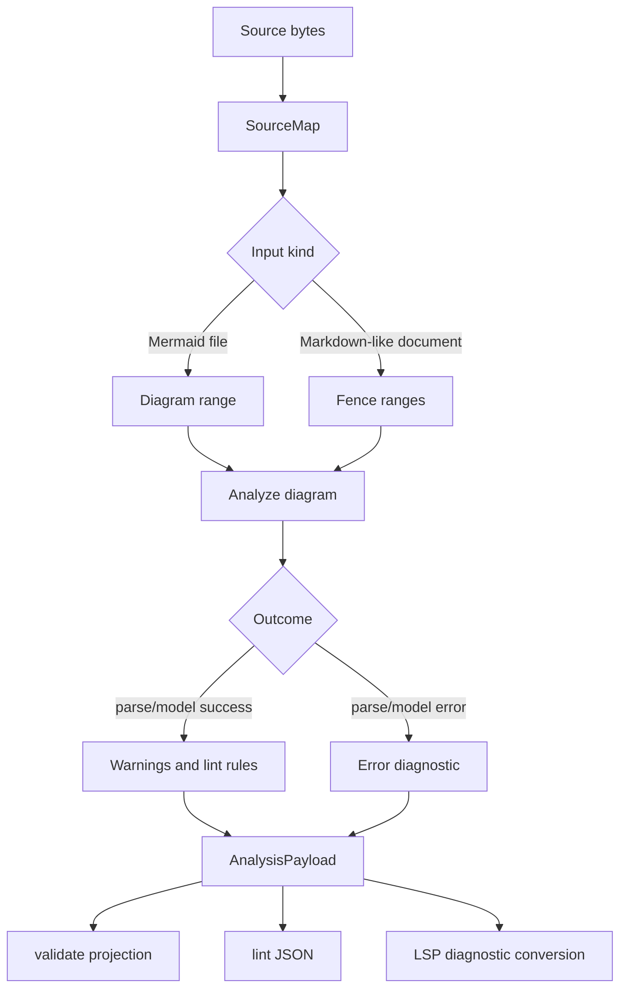

# refactor: Establish Diagnostics-First Analysis Core

## Summary

This plan turns `merman` validation into a diagnostics-first analysis surface that can power linting,
editor integrations, and future LSP work without making SVG rendering the source of truth. It uses
the alpha window to break shallow internals, adds a versioned diagnostics contract for Rust, CLI,
WASM, FFI, and UniFFI consumers, and records the long-lived boundary in ADR and engineering memory.

---

## Problem Frame

`merman` already has the pieces that make a strong headless lint engine plausible: Rust parsers,
semantic models, deterministic render/layout options, binding metadata, and browserless WASM/FFI
surfaces. The current validation path is still too shallow for that product shape. In
`merman-bindings-core`, `validate_json` reduces analysis to `valid/error/code/code_name`, and the
render feature owns validation even when the work is parse-only. Existing family warnings such as
Block and GitGraph warnings are stored as strings inside typed models rather than surfaced as a
common diagnostic stream.

The `mermaid-lint` article shows the right product lesson: fast Rust/WASM validation is valuable
when it shifts Mermaid failures into editors and CI, but it needs a parity story so it does not
drift from Mermaid JS. `merman` can go further because it owns the headless parser and binding
stack. The durable boundary should be an analysis contract; rendering should be one consumer of the
same parse and model facts, not the only path to user-facing feedback.

---

## Requirements

**Diagnostics Contract**

- R1. Diagnostics must use one versioned schema across Rust, CLI, WASM, FFI, UniFFI, and platform wrappers.
- R2. Every diagnostic must carry severity, stable identifier, message, category, optional diagram type, and an optional source span.
- R3. Source spans must be byte-based internally and convertible to line/column and UTF-16 positions for editor hosts.
- R4. Existing parse errors, unsupported-feature errors, resource-limit errors, and family warnings must map into diagnostics without losing the legacy status code.
- R5. The analyzer must run without SVG layout unless a rule explicitly requires layout data.

**Binding And Compatibility**

- R6. `analyze_json` becomes the canonical binding payload; `validate_json` stays as a compatibility projection during the alpha transition.
- R7. Binding JSON must remain tolerant of unknown fields and include a payload `version` so hosts can migrate safely.
- R8. `@mermanjs/web`, C ABI, UniFFI, Flutter, Apple, Android, and TypeScript definitions must expose the same analysis semantics.

**Lint And Documentation Scanning**

- R9. `merman-cli lint` must validate standalone Mermaid files and Mermaid fences inside Markdown-like documents.
- R10. Markdown diagnostics must report the containing document path and the diagram fence range, even before all family parsers expose token-level spans.
- R11. CLI lint output must support human-readable and JSON forms with deterministic exit codes for CI.

**LSP Preparation**

- R12. The first LSP-oriented work must define position encoding, document/fence mapping, diagnostic identity, and optional fix metadata without implementing a full language server.
- R13. Future LSP hosts must not need to parse render SVG or binding error strings to produce editor diagnostics.

**Governance**

- R14. Add an ADR for the diagnostics-first analysis boundary before public API migration.
- R15. Update engineering wiki memory after the plan lands so a later agent can resume without rereading this conversation.

---

## Scope Boundaries

In scope:

- New analysis/diagnostics module boundaries and versioned payloads.
- Breaking internal refactors in alpha-era validation, binding facade, CLI, and TypeScript wrappers.
- A CLI lint/check path for `.mmd`, `.mermaid`, `.md`, `.markdown`, and `.mdx` inputs.
- Source-map infrastructure that supports document-level and fence-level locations immediately, with parser-level spans added progressively.
- Parity harnesses that compare Rust analysis behavior against pinned Mermaid JS behavior for selected fixtures.

Deferred to follow-up work:

- A full LSP server process, VS Code extension, or editor distribution package.
- Runtime Mermaid JS fallback inside library, CLI, WASM, or FFI production paths.
- Complete rule catalog parity with `mermaid-lint` or markdownlint/textlint integrations.
- Rich auto-fix coverage beyond schema support and one or two low-risk fix examples.

Out of scope:

- Making rendering mandatory for lint.
- Replacing existing SVG parity strategy with lint-only checks.
- Treating Mermaid JS as an authority at runtime for user input.

---

## Key Technical Decisions

- KTD1. Introduce an analysis boundary instead of extending render validation. Diagnostics belong in a parse/model-oriented layer so lint, bindings, and LSP can run without SVG layout.
- KTD2. Put stable source-position and diagnostic payload types below host wrappers. Binding crates should serialize a shared model rather than reconstructing diagnostics from string errors.
- KTD3. Add canonical `analyze_json` and keep `validate_json` as a migration bridge. The bridge derives `valid` and legacy top-level fields from diagnostics while hosts move to the richer payload.
- KTD4. Use best-effort spans first, then deepen parser spans family by family. Markdown fences and whole-diagram spans give immediate editor value without blocking the architecture on every grammar.
- KTD5. Keep Mermaid JS as parity evidence, not as a production fallback. The pinned JS source and fixtures should catch Rust drift, but headless users should not inherit Node, jsdom, or browser runtime costs.
- KTD6. Treat diagnostics JSON as a public alpha contract. It may break once during this refactor, but after the ADR lands the payload versioning and compatibility policy become the migration path.

---

## High-Level Technical Design

```mermaid
flowchart TB
  Source[Mermaid source or Markdown document] --> Scan[Document scanner and source map]
  Scan --> Analyze[merman analysis engine]
  Analyze --> Core[merman-core parsers and typed models]
  Core --> Diagnostics[Diagnostic bag]
  Diagnostics --> Bindings[Binding JSON payloads]
  Diagnostics --> Cli[merman-cli lint]
  Diagnostics --> Lsp[LSP-ready adapters]
  Diagnostics --> Render[Render callers that need warnings]
  Bindings --> Wasm[@mermanjs/web]
  Bindings --> Ffi[C ABI / UniFFI / platform wrappers]
```

The new path separates three concerns. The document scanner knows where diagrams live in files and
Markdown fences. The analysis engine knows how to detect, parse, and collect model warnings. Host
wrappers only serialize or present diagnostics. Rendering still consumes parse and layout models,
but it no longer owns the definition of whether source is valid.



---

## Implementation Units

### U1. Record the diagnostics-first ADR and protocol boundary

- **Goal:** Add the durable decision record that makes analysis, not rendering, the canonical diagnostics boundary.
- **Requirements:** R1, R5, R6, R7, R14
- **Dependencies:** None
- **Files:**
  - `docs/adr/0070-diagnostics-first-analysis-contract.md`
  - `docs/bindings/FFI_PROTOCOL.md`
  - `docs/bindings/UNIFFI.md`
  - `docs/bindings/OPTIONS_JSON.md`
  - `README.md`
- **Approach:** Capture the split between `analyze_json` and `validate_json`, the payload versioning rule, the no-runtime-JS decision, and the alpha migration policy. Keep detailed schema examples in binding docs, not only in the ADR.
- **Patterns to follow:** `docs/adr/0066-ffi-binding-strategy.md`, `docs/adr/0069-wasm-package-surface-semantics.md`, and the existing binding protocol docs.
- **Test scenarios:** Test expectation: none -- documentation-only unit, reviewed by schema and file-reference inspection.
- **Verification:** The ADR explains why diagnostics are a first-class contract and binding docs show how existing hosts migrate from validation to analysis.

### U2. Add shared diagnostic and source-map types

- **Goal:** Introduce the typed foundation for diagnostics, source ranges, severity, categories, rule identifiers, related information, and optional fixes.
- **Requirements:** R1, R2, R3, R7, R12
- **Dependencies:** U1
- **Files:**
  - `Cargo.toml`
  - `crates/merman-analysis/Cargo.toml`
  - `crates/merman-analysis/src/lib.rs`
  - `crates/merman-analysis/src/diagnostic.rs`
  - `crates/merman-analysis/src/source_map.rs`
  - `crates/merman-analysis/src/payload.rs`
  - `crates/merman-analysis/tests/diagnostic_payload.rs`
  - `crates/merman-analysis/tests/source_map.rs`
- **Approach:** Create a small analysis crate that depends on `merman-core` but not `merman-render`. Keep byte offsets canonical, expose line/column and UTF-16 conversion helpers, and make JSON serialization stable enough for bindings and CLI tests.
- **Execution note:** Start with serialization and source-map tests before wiring the analyzer into existing validation.
- **Patterns to follow:** Workspace crate shape used by `merman-bindings-core`; status-code naming from `crates/merman-bindings-core/src/common.rs`.
- **Test scenarios:**
  - A diagnostic bag serializes with `version`, `valid`, `summary`, and ordered diagnostics.
  - UTF-8 byte spans convert to one-based human line/column positions for LF and CRLF documents.
  - UTF-16 conversion handles multibyte characters and emoji without shifting later diagnostics.
  - Unknown optional fields are skipped on serialization when absent.
- **Verification:** The new crate builds without pulling render dependencies, and its tests prove positions and schema stability independently of CLI or bindings.

### U3. Build the Rust analysis pipeline and diagnostic producers

- **Goal:** Replace boolean validation internals with an analyzer that detects diagrams, parses semantic or typed models, and collects structured diagnostics.
- **Requirements:** R2, R4, R5, R12, R13
- **Dependencies:** U2
- **Files:**
  - `crates/merman-analysis/src/analyzer.rs`
  - `crates/merman-analysis/src/rules.rs`
  - `crates/merman-core/src/diagrams/block.rs`
  - `crates/merman-core/src/diagrams/git_graph.rs`
  - `crates/merman-core/src/error.rs`
  - `crates/merman-analysis/tests/analyzer.rs`
  - `fixtures/diagnostics/`
- **Approach:** Map core errors into diagnostics, then add extraction adapters for existing model warnings. Use stable rule IDs such as parse/no-diagram and family-specific warning IDs. Parser-level spans can be `None` or whole-diagram spans until individual grammar families grow exact token spans.
- **Execution note:** Add characterization tests for current invalid-source behavior before replacing the implementation path.
- **Patterns to follow:** Block and GitGraph warning collection in core models; existing `BindingStatus` code mapping in `merman-bindings-core`.
- **Test scenarios:**
  - Empty source returns one error diagnostic with the legacy no-diagram status code.
  - Invalid Mermaid syntax returns an error diagnostic with the diagram type when detection succeeds.
  - A valid flowchart returns `valid=true` and no error diagnostics.
  - GitGraph duplicate commit IDs produce a warning diagnostic, not a hard validation failure.
  - Block width overflow produces a warning diagnostic with the diagram type and stable rule ID.
  - Resource-limit failures map to error diagnostics with the existing resource-limit status code.
- **Verification:** Analysis works through `merman-analysis` without invoking SVG rendering or layout for parse-only rules.

### U4. Migrate binding surfaces to canonical analysis payloads

- **Goal:** Expose the new analysis contract across binding-core, WASM, FFI, UniFFI, and platform wrappers while preserving a short alpha bridge for existing validation callers.
- **Requirements:** R1, R6, R7, R8, R13
- **Dependencies:** U3
- **Files:**
  - `crates/merman-bindings-core/src/common.rs`
  - `crates/merman-bindings-core/src/lib.rs`
  - `crates/merman-bindings-core/src/engine.rs`
  - `crates/merman-bindings-core/src/render.rs`
  - `crates/merman-wasm/src/lib.rs`
  - `crates/merman-ffi/src/lib.rs`
  - `crates/merman-ffi/include/merman.h`
  - `crates/merman-uniffi/src/lib.rs`
  - `platforms/web/src/index.ts`
  - `platforms/flutter/lib/src/merman_ffi.dart`
  - `platforms/apple/Sources/Merman/MermanEngine.swift`
  - `platforms/android/src/main/kotlin/io/merman/`
  - `crates/merman-bindings-core/tests/`
  - `crates/merman-ffi/tests/`
  - `crates/merman-uniffi/tests/`
  - `platforms/web/scripts/smoke.mjs`
- **Approach:** Add `analyze_json` entry points and make `validate_json` delegate to the analyzer projection. `validate` keeps `valid`, first-error legacy fields, and status code compatibility while adding diagnostics. Reusable engines should cache analysis options separately from render-only options.
- **Patterns to follow:** Existing `render_svg`, `parse_json`, `layout_json`, `validate_json`, `binding_capabilities`, and reusable-engine binding patterns.
- **Test scenarios:**
  - Stateless and reusable-engine analysis return identical payloads for the same source and options.
  - Existing `validate` smoke tests still pass by reading `valid` and legacy fields.
  - WASM `validate()` exposes diagnostics while a new `analyze()` helper returns the canonical payload.
  - C header smoke tests include the new function pointers and ABI docs.
  - UniFFI generated bindings expose analysis without changing render APIs.
  - Flutter, Apple, and Android wrappers can decode the new payload without string-parsing error messages.
- **Verification:** Binding tests prove the payload shape is shared and render-disabled artifacts can still analyze when the analysis crate is compiled.

### U5. Add CLI lint and document scanning

- **Goal:** Add a first-class CLI lint path for standalone Mermaid sources and Mermaid fences inside Markdown-like documents.
- **Requirements:** R9, R10, R11, R13
- **Dependencies:** U3
- **Files:**
  - `crates/merman-cli/src/cli.rs`
  - `crates/merman-cli/src/commands.rs`
  - `crates/merman-cli/src/lint.rs`
  - `crates/merman-cli/src/markdown.rs`
  - `crates/merman-cli/tests/lint.rs`
  - `crates/merman-cli/README.md`
  - `docs/alignment/CLI_COMPATIBILITY.md`
- **Approach:** Add `merman-cli lint` with path and stdin support. Reuse the Markdown extractor only after it carries fence offsets and document ranges; extend recognized document suffixes to include `.mdx`. JSON output should be the same payload family as bindings, with per-document diagnostics and deterministic exit codes.
- **Patterns to follow:** Existing clap subcommand structure, CLI JSON printing helpers, and Markdown rendering tests.
- **Test scenarios:**
  - Linting a valid `.mmd` file exits successfully and emits no error diagnostics.
  - Linting invalid stdin with `--stdin-file-name example.mmd` reports that display path.
  - Linting Markdown with two Mermaid fences reports diagnostics against the correct fence index and document range.
  - `.mdx` Mermaid fences are scanned without invoking Markdown render output rewriting.
  - Human output includes path, line, column, severity, and diagnostic ID.
  - JSON output is deterministic and uses the canonical analysis schema.
  - Exit code distinguishes lint failures from operational errors.
- **Verification:** CLI lint tests cover file, stdin, Markdown, and JSON/human output paths without requiring SVG rendering.

### U6. Prepare the LSP-facing adapter layer

- **Goal:** Make the diagnostic model directly consumable by a future LSP server without committing to an editor package in this refactor.
- **Requirements:** R3, R12, R13
- **Dependencies:** U2, U3, U5
- **Files:**
  - `crates/merman-analysis/src/lsp.rs`
  - `crates/merman-analysis/tests/lsp_positions.rs`
  - `docs/lsp/DIAGNOSTIC_PROTOCOL.md`
  - `docs/lsp/README.md`
- **Approach:** Add conversion helpers for LSP-style ranges, severity mapping, diagnostic codes, related information, and optional code action metadata. Keep the module dependency-free with local structs or feature-gated serialization so the core analysis crate does not depend on an LSP server framework yet.
- **Patterns to follow:** Binding payload versioning and source-map helpers from U2.
- **Test scenarios:**
  - Byte spans convert to zero-based UTF-16 ranges expected by LSP clients.
  - Whole-diagram fallback ranges remain usable when parser-level spans are missing.
  - Markdown fence-relative diagnostics convert back to containing document ranges.
  - Fix metadata can be represented without requiring a fixer implementation.
- **Verification:** The docs explain how a future `merman-lsp` crate can consume analysis output without parsing CLI text or SVG.

### U7. Add parity and regression harnesses for analysis behavior

- **Goal:** Prevent Rust-native diagnostics from silently drifting away from pinned Mermaid behavior.
- **Requirements:** R4, R5, R11, R14
- **Dependencies:** U3, U5
- **Files:**
  - `crates/xtask/src/cmd/`
  - `fixtures/diagnostics/`
  - `fixtures/diagnostics/*.golden.json`
  - `docs/rendering/UPSTREAM_SVG_BASELINES.md`
  - `docs/alignment/STATUS.md`
- **Approach:** Add fixture-driven diagnostics snapshots and an optional xtask check that compares Rust analysis outcomes with the pinned Mermaid JS parser where the upstream tool can be run. Keep JS comparison as evidence, not a production dependency.
- **Patterns to follow:** Existing fixture golden layout, `xtask` parity commands, and upstream SVG baseline documentation.
- **Test scenarios:**
  - Diagnostics snapshots are stable for representative valid, invalid, warning, and unsupported inputs.
  - The xtask check reports Rust-only, JS-only, and both-fail cases distinctly.
  - Missing upstream tooling produces an explicit skipped/evidence-unavailable result rather than changing library behavior.
  - Snapshot refresh does not require rendering SVG.
- **Verification:** Analysis parity can be audited separately from SVG DOM parity.

### U8. Close the migration with public docs and engineering memory

- **Goal:** Make the new contract discoverable and leave a reliable handoff for future agents and maintainers.
- **Requirements:** R8, R14, R15
- **Dependencies:** U1, U4, U5, U6, U7
- **Files:**
  - `README.md`
  - `platforms/web/README.md`
  - `crates/merman-ffi/README.md`
  - `platforms/flutter/README.md`
  - `platforms/apple/README.md`
  - `platforms/android/README.md`
  - `docs/knowledge/engineering/current-state.md`
  - `docs/knowledge/engineering/log.md`
  - `docs/knowledge/engineering/sessions/`
- **Approach:** Update user-facing examples to prefer analysis/lint terminology, mark legacy validation as a bridge, and record the final state in engineering memory after implementation evidence exists.
- **Patterns to follow:** Existing binding README sections and engineering memory bundle shape.
- **Test scenarios:** Test expectation: none -- documentation and memory closeout, validated by links and consistency with implemented APIs.
- **Verification:** A future maintainer can find the ADR, binding protocol, CLI lint examples, and current engineering state without reading the implementation PR.

---

## Acceptance Examples

- AE1. Given `flowchart TD\nA --> B`, when a host calls canonical analysis through Rust, WASM, FFI, or UniFFI, then the payload reports `valid=true` and an empty error set without rendering SVG.
- AE2. Given an empty Mermaid source, when a host calls legacy validation, then `valid=false` and the first diagnostic preserves the no-diagram status code while the canonical diagnostics array is present.
- AE3. Given a Markdown document with an invalid Mermaid fence, when `merman-cli lint --format json` runs, then the diagnostic points to the Markdown document and fence range instead of reporting an anonymous diagram string.
- AE4. Given a GitGraph diagram with duplicate commit IDs, when analysis runs, then the duplicate-ID warning is emitted as a warning diagnostic and does not make the payload invalid.
- AE5. Given a source containing emoji before an invalid Mermaid line, when the LSP adapter converts diagnostics, then UTF-16 ranges still point at the expected editor position.

---

## System-Wide Impact

This refactor changes a cross-interface contract. Rust users gain a render-independent analysis API;
CLI users gain lint; browser and native hosts gain a shared payload; future editor work gets a
position model. The main compatibility pressure is on existing `validate` callers, which should be
kept working through an alpha bridge while docs steer new code to `analyze`.

The change also sharpens crate boundaries. `merman-analysis` should stay lighter than
`merman-render`, and binding crates should stop treating render feature availability as a proxy for
validation capability.

---

## Risks & Mitigations

| Risk | Mitigation |
| --- | --- |
| Diagnostic schema churn breaks early host integrations. | Use a payload `version`, keep legacy validation projection during alpha, and document the migration in binding docs. |
| Lint locations are initially too coarse for editor users. | Ship document and fence ranges first, then add parser-level spans family by family behind the same schema. |
| Rust diagnostics diverge from Mermaid JS behavior. | Add fixture snapshots and optional pinned Mermaid JS parity checks as evidence, not runtime fallback. |
| The analysis crate accidentally pulls render dependencies. | Test and review feature graphs so parse-only analysis works without SVG layout. |
| CLI lint expands into a full markdownlint/textlint product too early. | Keep the first CLI focused on Mermaid source and Mermaid fences; defer ecosystem plugins. |

---

## Alternative Approaches Considered

1. **Only enrich existing `validate_json`.** This is smaller, but it keeps validation tied to render-era naming and makes LSP/lint feel like an afterthought.
2. **Use Mermaid JS fallback at runtime.** This follows the two-tier shape highlighted by `mermaid-lint`, but it undermines `merman`'s browserless value and adds packaging cost to FFI/WASM/native hosts.
3. **Build a full LSP server now.** This would prove the editor story, but it would force transport and editor decisions before the diagnostics contract is stable.
4. **Create a separate `merman-lint` product first.** This may become useful later, but the core contract should land before a package split creates another public surface.

---

## Documentation Plan

- ADR records the analysis boundary and migration policy.
- Binding protocol docs define canonical analysis JSON and legacy validation projection.
- CLI docs show `merman-cli lint` examples and exit-code semantics.
- LSP docs define position conversion and how a future server should consume analysis output.
- Engineering memory records the final implemented state after the work lands.

---

## Sources & Research

- Jason Worden, "Introducing mermaid-lint": https://jasonworden.com/blog/introducing-mermaid-lint/
- `docs/adr/0066-ffi-binding-strategy.md`
- `docs/adr/0069-wasm-package-surface-semantics.md`
- `docs/bindings/FFI_PROTOCOL.md`
- `crates/merman-bindings-core/src/common.rs`
- `crates/merman-bindings-core/src/render.rs`
- `crates/merman-wasm/src/lib.rs`
- `platforms/web/src/index.ts`
- `crates/merman-cli/src/markdown.rs`
- `crates/merman-core/src/diagrams/block.rs`
- `crates/merman-core/src/diagrams/git_graph.rs`
