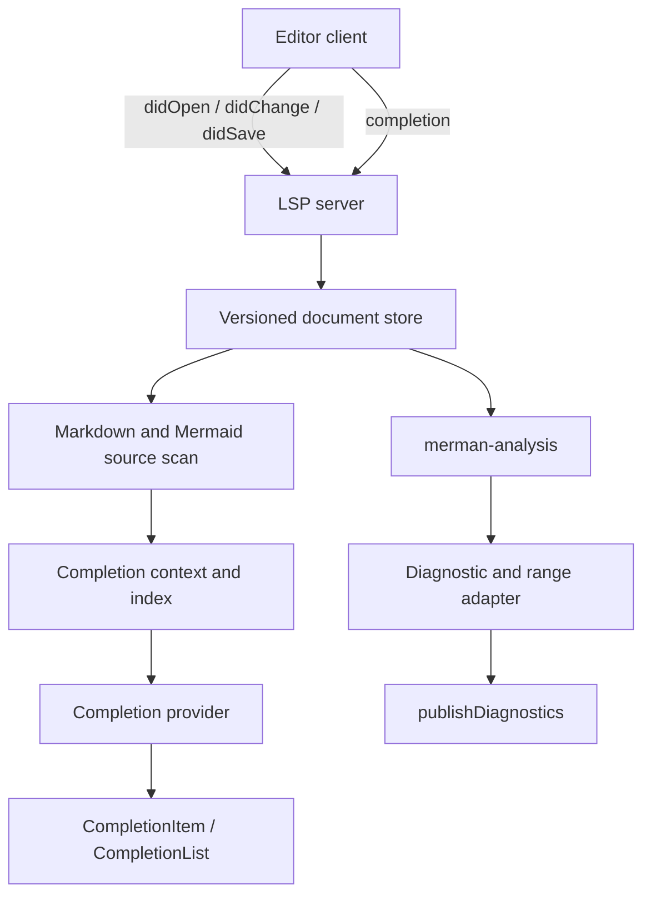

# feat: Add LSP Server and Completion Foundations

## Summary

This plan turns the diagnostics-first analysis contract into a first-class language server surface. It adds a dedicated `merman-lsp` crate, wires publish-diagnostics through shared source maps, and lays the snapshot and context foundation needed for completion without teaching the server to reparse or render on its own.

---

## Problem Frame

`merman-analysis` now owns structured diagnostics and UTF-16-friendly position data, which is enough to project editor diagnostics. What is still missing is the protocol layer, the versioned document cache, and a reusable completion context that can answer from current document state instead of ad hoc string inspection. The earlier diagnostics plan intentionally deferred the LSP server, so this follow-on should build the server and completion foundations on the same contract instead of reopening the analysis boundary.

---

## Requirements

- R1. The repository must expose a dedicated `merman-lsp` crate that speaks the Language Server Protocol and depends on `merman-analysis` rather than `merman-render`.
- R2. The server must publish diagnostics from `AnalysisPayload` on open, change, and save events.
- R3. Position conversion must handle UTF-8 bytes, one-based line and column values, and zero-based UTF-16 ranges consistently for editor clients.
- R4. The server must keep a versioned document store so stale analysis results are never published after newer edits.
- R5. The first completion surface must support context-driven suggestions for diagram kind, direction, operators, node IDs, directives, and nearby shape keywords.
- R6. Completion data must come from reusable snapshot and index structures so future completion, hover, and symbol features can share the same document analysis.
- R7. The LSP layer must stay thin enough that future transports can reuse the same core snapshot and completion logic.
- R8. Documentation must state which crate is canonical, which editor capabilities are first-class, and which ones remain deferred.

---

## Key Technical Decisions

- Use `tower-lsp` and `lsp-types` for the first server crate. The repo already has async code, `tower-lsp` gives direct support for diagnostics and completion, and it avoids building a manual message loop. `lsp-server` is too bare for this shape; `async-lsp` remains the backup if transport control later matters more than a turnkey server.
- Keep `merman-analysis` as the only diagnostics engine. The server consumes shared payloads and range helpers, but it does not invent its own parse or diagnostic rules.
- Add a shared document snapshot layer before broad completion. Completion quality depends on a stable in-memory view of the current document, not on rerunning the analyzer per cursor move.
- Start completion with structural and contextual suggestions, not semantic graph synthesis. The first release should be useful and predictable, not exhaustive.
- Make fence mapping and UTF-16 conversion shared utilities, not server-local helpers. Diagnostics and completion must agree on positions across Markdown and plain Mermaid inputs.

---

## High-Level Technical Design



---

## Output Structure

```text
crates/
  merman-analysis/
    src/
      lsp.rs
  merman-lsp/
    Cargo.toml
    src/
      main.rs
      lib.rs
      server.rs
      document_store.rs
      snapshot.rs
      completion.rs
      diagnostics.rs
    tests/
      server_smoke.rs
      completion.rs
      diagnostics.rs
docs/
  lsp/
    README.md
    DIAGNOSTIC_PROTOCOL.md
```

---

## Scope Boundaries

In scope:
- A dedicated language-server crate and its stdio transport.
- Publish-diagnostics wiring for plain Mermaid files and Markdown/MDX fences.
- A versioned document store and completion context based on current document snapshots.
- The initial completion set for diagram structure and local identifiers.
- Shared range conversion helpers for diagnostics and editor positions.

Deferred to follow-up work:
- Hover, go to definition, document symbols, rename, code actions, semantic tokens, workspace symbols, and formatting.
- Editor extensions and packaging for VS Code or other IDEs.
- Advanced fixer generation beyond metadata support.
- A broader parser refactor solely to improve completion quality.

Out of scope:
- Render-backed validation in the LSP path.
- Mermaid JS runtime fallback.
- A separate analysis contract unrelated to `merman-analysis`.

---

## System-Wide Impact

This introduces the first explicit LSP transport in the workspace and likely the first Tokio-backed binary. It sharpens the contract between analysis and editor features, and it may push parser families to expose a little more structural metadata so completion can stay cheap. The new crate should remain isolated from render code so editor support does not inherit SVG dependencies.

---

## Risks & Dependencies

- Completion quality may be thin until the snapshot layer learns enough structure from each diagram family.
- Markdown fence mapping can drift if document versions and fence offsets are not kept in sync.
- The new async runtime may introduce a different dependency shape from the rest of the workspace.
- Completion can sprawl into hover and code actions before the snapshot seam has earned trust.

---

## Acceptance Examples

- Given a plain Mermaid flowchart, opening the file publishes diagnostics without requiring render code.
- Given a Markdown document with a fenced Mermaid block, diagnostics and completions target the containing fence range instead of the raw document path.
- Given a document edit that increments the version, the server stops publishing diagnostics for the older snapshot.
- Given a cursor inside a known diagram context, completion returns a small set of diagram-appropriate suggestions with stable text edits.

---

## Implementation Units

### U1. Create the LSP crate and server lifecycle

- **Goal:** Add a dedicated `merman-lsp` crate with stdio transport, initialize capability handling, and publish diagnostics from current documents.
- **Requirements:** R1, R2, R4, R8
- **Dependencies:** None
- **Files:**
  - `Cargo.toml`
  - `crates/merman-lsp/Cargo.toml`
  - `crates/merman-lsp/src/main.rs`
  - `crates/merman-lsp/src/lib.rs`
  - `crates/merman-lsp/src/server.rs`
  - `crates/merman-lsp/tests/server_smoke.rs`
- **Approach:** Keep the server as a thin transport adapter that owns document versions and converts analysis output into LSP diagnostics. The server should handle initialize, open, change, and save without introducing a second analysis path.
- **Patterns to follow:** `crates/merman-bindings-core/src/engine.rs` for reusable state, and `crates/merman-cli/src/commands.rs` for clean command-to-result separation.
- **Test scenarios:**
  - A freshly initialized server advertises diagnostics and completion capabilities.
  - Opening a valid Mermaid file publishes no error diagnostics.
  - Opening an invalid file publishes diagnostics for the current version only.
  - A later edit supersedes older diagnostics instead of appending stale results.
  - Saving a document reuses the current snapshot and does not require render code.
- **Verification:** The server can run over stdio and emit client-visible diagnostics from `merman-analysis`.

### U2. Add shared mapping helpers for diagnostics and positions

- **Goal:** Centralize conversion from analysis payloads into LSP ranges, severities, and related information.
- **Requirements:** R2, R3, R7
- **Dependencies:** U1
- **Files:**
  - `crates/merman-analysis/src/lsp.rs`
  - `crates/merman-analysis/src/source_map.rs`
  - `crates/merman-analysis/src/payload.rs`
  - `crates/merman-analysis/tests/lsp_positions.rs`
  - `crates/merman-lsp/src/diagnostics.rs`
  - `crates/merman-lsp/tests/diagnostics.rs`
- **Approach:** Keep UTF-16 conversion and Markdown fence remapping in one shared seam so the server does not carry its own coordinate math. Map severity, codes, and related spans from the canonical payload instead of rebuilding them from string output.
- **Patterns to follow:** `SourceMap` and `DiagnosticSpan` in `merman-analysis`, plus the payload shape already used by bindings.
- **Test scenarios:**
  - Emoji and other multibyte characters map to the expected LSP character offsets.
  - Whole-document fallback spans remain usable when a family does not expose a narrow token span.
  - Markdown fence offsets remap diagnostics to the host document range.
  - Related diagnostics preserve their spans after conversion.
- **Verification:** Editor-facing positions come from shared helpers, not from server-local ad hoc conversions.

### U3. Build the document snapshot and completion context

- **Goal:** Maintain versioned document snapshots and extract the structural facts completion needs.
- **Requirements:** R4, R5, R6
- **Dependencies:** U1, U2
- **Files:**
  - `crates/merman-lsp/src/document_store.rs`
  - `crates/merman-lsp/src/snapshot.rs`
  - `crates/merman-lsp/src/context.rs`
  - `crates/merman-lsp/tests/snapshot.rs`
- **Approach:** Capture per-URI document versions, raw text, fence ranges, diagram kind, known identifiers, and directive prefixes in one snapshot object. Treat that snapshot as the seam for both completion and future hover or symbol work.
- **Patterns to follow:** `merman-analysis` source mapping, and the document-scanning behavior already established in the CLI lint path.
- **Test scenarios:**
  - A newer document version replaces the older snapshot.
  - Markdown documents produce per-fence snapshot entries instead of one anonymous blob.
  - Known node IDs and directive keys are available to completion queries from the current snapshot only.
  - Unsupported or empty documents produce an empty completion context rather than stale results.
- **Verification:** Completion and diagnostics both read from the same current document state.

### U4. Implement the completion provider and handler surface

- **Goal:** Add `textDocument/completion` support for structural, context-driven Mermaid suggestions.
- **Requirements:** R5, R6, R7
- **Dependencies:** U3
- **Files:**
  - `crates/merman-lsp/src/completion.rs`
  - `crates/merman-lsp/src/server.rs`
  - `crates/merman-lsp/tests/completion.rs`
  - `crates/merman-lsp/README.md`
- **Approach:** Offer a narrow first set of completions for diagram kinds, directions, operators, node IDs, directives, and nearby shape keywords. Use text edits and commit characters where they are obviously safe, and keep `completion_resolve` optional until the payload needs richer metadata.
- **Patterns to follow:** The snapshot contract from U3 and the shared position helpers from U2.
- **Test scenarios:**
  - A cursor after a diagram opener suggests diagram-appropriate keywords.
  - A cursor after a known identifier suggests local node IDs from the current snapshot.
  - A cursor inside a Markdown fence uses fence-local ranges and edits.
  - An empty or unsupported document returns a minimal, non-noisy completion set.
  - Completion results do not require reparsing the entire document for each request.
- **Verification:** Completion returns useful items without relying on render output or string parsing.

### U5. Add regression coverage for diagnostics and completion

- **Goal:** Prevent the server-visible behavior from drifting as analysis and snapshot logic change.
- **Requirements:** R2, R3, R4, R5
- **Dependencies:** U1, U2, U3, U4
- **Files:**
  - `crates/merman-lsp/tests/*.rs`
  - `fixtures/lsp/*.json`
  - `fixtures/lsp/*.mmd`
  - `fixtures/lsp/*.md`
- **Approach:** Snapshot representative valid, invalid, Markdown-fenced, and stale-version cases so the server can be checked without comparing raw protocol noise. Cover completion item shape and diagnostic positions together where that proves the shared seam.
- **Patterns to follow:** Existing golden-fixture style used elsewhere in the repo.
- **Test scenarios:**
  - A valid standalone diagram stays clean under diagnostics snapshots.
  - A fenced diagram reports the host-document range, not a raw fenced blob.
  - A versioned edit invalidates the old snapshot before the next publish.
  - Completion snapshots stay stable for the same document context.
- **Verification:** The fixture set proves the LSP surface stays consistent across the expected editor workflows.

### U6. Document the server contract and handoff

- **Goal:** Explain what the new crate covers, how completion is scoped, and what remains deferred.
- **Requirements:** R8
- **Dependencies:** U1, U4, U5
- **Files:**
  - `crates/merman-lsp/README.md`
  - `docs/lsp/README.md`
  - `docs/lsp/DIAGNOSTIC_PROTOCOL.md`
- **Approach:** Document the canonical analysis path, the first completion surface, and the boundaries that keep LSP thin. Keep the docs focused on consumer behavior rather than implementation trivia.
- **Patterns to follow:** The diagnostics-first framing in `docs/adr/0070-diagnostics-first-analysis-contract.md`.
- **Test expectation:** none -- documentation and handoff work, validated by links and consistency with implemented APIs.
- **Verification:** A future maintainer can find the server entry point, the position contract, and the deferred editor capabilities without reading the implementation PR.

---

## Sources & Research

- `docs/adr/0070-diagnostics-first-analysis-contract.md`
- `crates/merman-analysis/src/source_map.rs`
- `crates/merman-analysis/src/payload.rs`
- `tower-lsp` crate page: https://crates.io/crates/tower-lsp
- `lsp-types` crate page: https://crates.io/crates/lsp-types
- `async-lsp` crate page: https://crates.io/crates/async-lsp
- `lsp-server` crate page: https://crates.io/crates/lsp-server
- Jason Worden, "Introducing mermaid-lint": https://jasonworden.com/blog/introducing-mermaid-lint/
