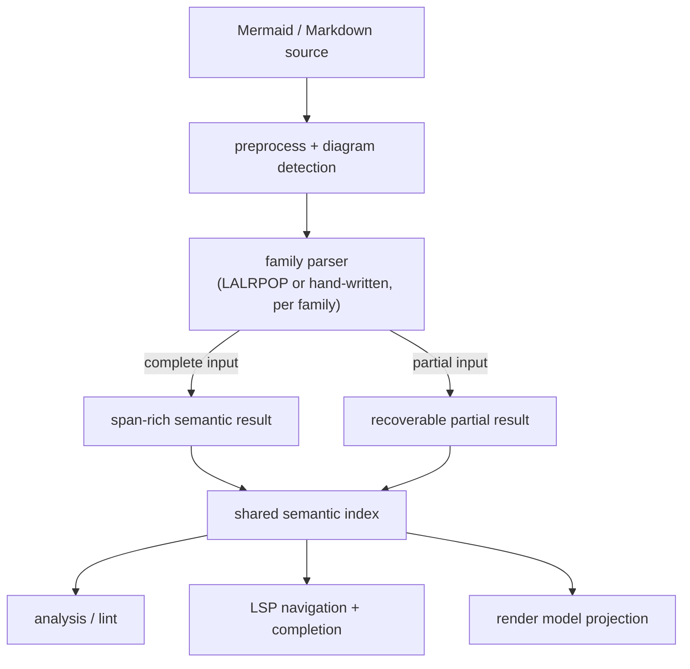

# Refactor Parser and Semantic Seam for Editor-Grade Mermaid Analysis

## Summary

This plan deepens `merman-core` so editor-facing features can rely on parser-produced structure
instead of raw-text heuristics. It standardizes a span-rich semantic contract and a recoverable
parse mode across families while keeping parser technology family-local.

## Problem Frame

`merman-lsp` now has a usable completion and navigation baseline, but several structural queries
still depend on fence-local scans rather than parser-backed facts. That is good enough to ship a
first pass, not good enough for a product-grade Mermaid LSP or lint surface. The next step is to
move structure and recoverability into the core parser/semantic seam, then let analysis and
transport layers consume those facts.

---

## Requirements

- R1. Core parser outputs must carry stable source spans for semantic entities used by downstream
  features.
- R2. Parser entrypoints must provide recoverable partial results for incomplete or malformed input
  that editor clients naturally produce.
- R3. Diagram families may keep their existing parser technology, but every family that feeds
  editor-visible features must conform to the shared semantic contract.
- R4. Shared semantic indexes must be available for consumers so LSP and lint no longer rediscover
  structure by scanning raw document text.
- R5. Existing parity fixtures must stay green while the new contract lands, and new tests must
  cover span propagation plus incomplete-input behavior.
- R6. Render-model production must continue to work from the same family parsers without
  introducing a second public parsing stack.
- R7. Documentation and ADRs must record the new contract and the migration rule for heuristic
  fallbacks.

---

## Key Technical Decisions

- Keep family-local parser implementations. A global parser-generator rewrite would cost a lot and
  still would not solve recovery or semantic indexing by itself.
- Make spans and recoverability part of the contract. Editor features need source truth, not
  best-effort reconstruction.
- Build semantic indexes in core or core-adjacent code. Downstream consumers should read facts,
  not infer them.
- Leave heuristic text scans only as migration shims. They are not the target path and should
  disappear once coverage lands.
- Preserve render-model production as a downstream projection. The new seam deepens the contract
  without splitting the public parsing surface.

---

## High-Level Technical Design

---

## Scope Boundaries

In scope:
- A span-rich parser/semantic contract in `merman-core`.
- Recovery-friendly parsing for editor inputs.
- Consumer migration away from raw-text structural scans.
- First-pass coverage for the families that already drive the current LSP and lint surfaces.

Deferred for later:
- A full incremental parser engine.
- A repository-wide parser-generator monoculture.
- Semantic tokens, formatting, and other editor surfaces that depend on the seam but do not define
  it.

Outside this slice:
- Render/layout cleanups that do not affect parser outputs.
- Mermaid JS runtime fallback.

---

## System-Wide Impact

- `merman-core` grows a stricter parser contract.
- `merman-analysis` and `merman-lsp` stop re-scanning structure when the new seam lands.
- Family parity suites will expand to cover recovery and span correctness.
- Future bindings benefit from the same semantic facts, not a separate transport-specific parser
  view.

---

## Risks & Dependencies

- Existing family fixtures may regress when span tracking changes.
- Recovery semantics may diverge between families if the contract is too loose.
- Heuristic compatibility paths may linger too long if they are not treated as temporary.
- Editor inputs are often partial by design, so recovery coverage must be explicit rather than
  inferred.

Mitigation is fixture-backed contract testing per family, plus explicit consumer tests that exercise
partial buffers and downstream migration.

---

## Acceptance Examples

- Given a partially typed flowchart, parser-backed completion can still use recoverable semantic
  facts without rescanning raw text.
- Given a hand-written mindmap or gantt diagram, the parser still emits the same span contract even
  though the internal implementation stays line-driven.
- Given a valid diagram, parity fixtures still match upstream and render output does not require a
  second public parser API.
- Given a supported family, hover, definition, references, and rename resolve from the semantic
  index instead of a fence-local text scan.

---

## Implementation Units

### U1. Define the span-rich core contract

- **Status:** Initial contract landed. `merman-core` now exposes `EditorSemanticFacts`,
  `EditorSemanticSymbol`, `EditorSemanticKind`, `EditorSemanticRole`,
  `EditorSemanticCompleteness`, and `SourceSpan`; spans are byte offsets in the caller-provided
  diagram text, facts distinguish complete versus recovered parser output, and roles distinguish
  entity facts from outline-only and payload-only facts so parser-backed spans can deepen without
  polluting completion ids.
- **Goal:** Add shared parser result types and semantic index interfaces in `merman-core`.
- **Files:** `crates/merman-core/src/lib.rs`, `crates/merman-core/src/parse_pipeline.rs`,
  `crates/merman-core/src/diagram/mod.rs`, and a new internal module under
  `crates/merman-core/src/diagram/` if the contract needs its own home.
- **Pattern to follow:** the existing `ParsedDiagram` / `RenderSemanticModel` split, not a new
  public AST layer.
- **Test scenarios:** semantic facts preserve source spans; partial parse results carry recovery
  metadata; render-model generation still compiles against the same family seam.
- **Verification:** core unit tests cover the contract and no existing fixture suite regresses.

### U2. Retrofit the parser-generator-backed families

- **Status:** Flowchart, Sequence, State, Class, and ER tracer bullets landed. Flowchart now
  preserves parser-backed node id spans and subgraph header/selection spans through its lexer/
  LALRPOP AST path, and falls back to recoverable token-stream facts for incomplete editor buffers.
  Sequence now emits parser-backed participant, actor, message-endpoint, note-actor, and box facts
  from its lexer token stream with complete/recovered provenance. State now carries state id spans
  in its LALRPOP AST, emits parser-backed state/reference/fork/join/choice facts, and recovers facts
  from the state lexer token stream for incomplete buffers. Class now emits class/namespace/
  relation, member-owner, member-outline, annotation-target, annotation-payload, directive-target,
  and interaction-target facts from its lexer token stream with complete/recovered provenance. ER now
  emits entity, relationship endpoint,
  attribute, class/style/classDef target, and inline class facts with recovered token-stream output
  for incomplete buffers; ER attribute names are now outline facts and attribute type/key/comment
  payload spans are preserved for lint/future semantic consumers without becoming node completion
  candidates.
- **Goal:** Lift span and recovery facts into the families already using deterministic lexer plus
  LALRPOP.
- **Files:** `crates/merman-core/src/diagrams/flowchart.rs`,
  `crates/merman-core/src/diagrams/sequence/mod.rs`,
  `crates/merman-core/src/diagrams/state/mod.rs`,
  `crates/merman-core/src/diagrams/class/mod.rs`,
  `crates/merman-core/src/diagrams/er.rs`, plus adjacent lexer, AST, and parse modules.
- **Pattern to follow:** preserve the current family-local parser shape and extend it with the new
  contract instead of flattening it into a new shared parser engine.
- **Test scenarios:** incomplete inputs still produce recoverable semantic facts where the family
  can recover; existing upstream parity cases still match; entity spans remain stable for
  editor-visible constructs.
- **Verification:** family-specific fixtures stay green.

### U3. Retrofit the hand-written families that feed editor-visible structure

- **Status:** Mindmap landed as the first hand-written-family tracer bullet. Its line parser now
  produces an internal event stream shared by render DB construction and editor facts, preserving
  node spans, class/icon directive prefixes, class/icon decoration semantics, inline-header spans,
  multiline-node behavior, and recovered facts for incomplete node delimiters. Gantt now emits
  parser-backed task id, `after`/`until` dependency, `click` target, `section` outline, and
  directive-prefix facts from the same statement grammar used by the render parser. Its
  relative-reference matcher now exposes source ranges so editor facts reuse the Mermaid-backed
  dependency grammar instead of reimplementing it downstream. Gantt editor completeness also
  tolerates original-source front matter and Mermaid init directives while preserving original byte
  spans. Gantt directive payloads such as `title`, `dateFormat`, `axisFormat`, `tickInterval`,
  `includes`, `excludes`, `todayMarker`, `weekday`, and `weekend` are now parser-backed payload
  facts, and `click` URLs/callback names/callback args are payload-only spans from the same click
  parser used by render semantics. Gantt `section` is an outline-only fact, not a node id, so task
  completion stays focused on task identifiers.
- **Goal:** Bring `mindmap`, `gantt`, and the other line- or indentation-driven families that matter
  to the same contract.
- **Files:** `crates/merman-core/src/diagrams/mindmap/*`,
  `crates/merman-core/src/diagrams/gantt/*`, and the remaining hand-written family modules that
  surface structural facts to analysis.
- **Pattern to follow:** preserve the explicit line-level parsing model while exporting the same
  semantic contract as the parser-generator-backed families.
- **Test scenarios:** indentation-driven hierarchy still matches upstream behavior; partial buffers
  do not force downstream rescans; span output stays stable across common editor edits.
- **Verification:** hand-written family tests remain aligned to upstream fixtures.

### U4. Move consumers onto the semantic seam

- **Status:** Flowchart, Sequence, State, Class, and ER paths migrated. LSP now consumes
  `merman-analysis::FenceTextIndex` instead of maintaining separate completion, outline,
  navigation, and rename scans, and covered flowchart/sequence fences use parser-backed core
  editor facts for both complete and recovered parser output; state fences now do the same through
  parser-backed complete/recovered facts; class fences now do the same for parser-backed token
  facts; ER fences now do the same for parser-backed entity/attribute/relation facts. Raw-text
  fallback remains only when a family has no core fact extraction path or the extraction itself is
  unavailable. Mindmap now follows the same complete/recovered provenance path, and `merman-lsp`
  explicitly enables the core full/host feature profile so product LSP detection does not silently
  run with the tiny registry. Gantt now follows the same `ParserComplete`/`ParserRecovered`
  provenance path in `DocumentStore`, exposes Gantt sections as outline-only symbols, and header
  completion includes `gantt`. The migration index now respects semantic roles: entity facts feed
  completion/navigation/outline, outline facts feed outline only, and payload facts stay out of LSP
  completion/navigation. Gantt directive and click payloads are preserved for future lint and
  semantic consumers without leaking into node-id completion or outline surfaces.
  Class member facts now use the outline role for class-body and inline `Class: member` entries,
  while annotation names are payload spans reserved for lint/future semantic consumers.
- **Goal:** Stop the analysis and LSP transport layers from rediscovering diagram structure by
  scanning raw text.
- **Files:** `crates/merman-analysis/src/document.rs`,
  `crates/merman-analysis/src/lsp.rs`,
  `crates/merman-lsp/src/completion.rs`,
  `crates/merman-lsp/src/structure.rs`,
  `crates/merman-lsp/src/snapshot.rs`,
  `crates/merman-lsp/src/document_store.rs`,
  `crates/merman-lsp/tests/*`.
- **Pattern to follow:** use parser-backed semantic facts as the source of truth; keep raw-text
  scans only as temporary migration fallbacks where no semantic facts exist yet.
- **Test scenarios:** hover, definition, references, and rename resolve from semantic indexes for
  supported families; Markdown fences still remap correctly; completion still produces stable
  replacement ranges.
- **Verification:** LSP smoke and focused unit tests pass without falling back to heuristic
  structure detection for covered families.

### U5. Lock the contract with parity, recovery, and documentation

- **Goal:** Add regression coverage and record the seam in ADR and memory so later slices do not
  drift back to heuristics.
- **Files:** `crates/merman-core/src/tests/*`, `crates/merman-analysis/tests/*`,
  `crates/merman-lsp/tests/*`, `docs/adr/0071-editor-parser-semantic-seam.md`,
  `docs/knowledge/engineering/*`.
- **Pattern to follow:** upstream parity fixtures plus targeted recovery tests for editor-like
  partial inputs.
- **Test scenarios:** parser parity stays green; malformed and partial inputs keep recoverable
  spans; the ADR and memory docs describe the same contract the tests enforce.
- **Verification:** the repo has an auditable contract for future editor-facing parser work.

---

## Sources & Research

- `docs/adr/0002-parser-strategy.md`
- `docs/adr/0010-semantic-model-boundary.md`
- `docs/adr/0013-flowchart-parser-technology.md`
- `docs/adr/0015-sequence-parser-technology.md`
- `docs/adr/0016-class-parser-technology.md`
- `docs/adr/0017-er-parser-technology.md`
- `docs/adr/0018-state-parser-technology.md`
- `docs/adr/0025-mindmap-parser-technology.md`
- `repo-ref/mermaid/packages/mermaid/src/diagrams/gantt/parser/gantt.spec.js`
- `repo-ref/mermaid/packages/mermaid/src/diagrams/gantt/ganttDb.js`
- `docs/plans/2026-06-24-001-feat-lsp-completion-foundations-plan.md`
- `crates/merman-analysis/src/document.rs`
- `crates/merman-analysis/src/lsp.rs`
- `crates/merman-lsp/src/completion.rs`
- `crates/merman-lsp/src/structure.rs`
- `crates/merman-lsp/src/snapshot.rs`
- Jason Worden, "Introducing mermaid-lint": https://jasonworden.com/blog/introducing-mermaid-lint/

## Fearless Refactor Opportunities

- For parser-backed families that already have deterministic lexer/parser boundaries, the old
  text-scan editor experience is no longer a reasonable target behavior. Keep it only as a
  migration fallback for families without `EditorSemanticFacts`.
- The initial parser-backed set now covers the high-value parser/lexer-backed families that feed
  current LSP navigation: flowchart, sequence, state, class, and ER.
- ER `IdList` is now span-rich internally; future ER lint can use directive payload spans instead
  of reparsing class/style/classDef lines.
- Class is migrated at the class/reference-owner level, and member outline plus annotation payload
  spans are now parser-backed; full product-grade rename/lint will still benefit from deeper
  directive payload spans and recovered diagnostics.
- Mindmap showed a high-return hand-written-family pattern: convert line handling into an explicit
  parser event stream, then project the same events into DB/render semantics and editor facts.
  This preserves behavior while removing duplicated scan logic.
- Gantt now exposes parser-backed task ids, section outlines, directive/click payloads,
  dependencies, and click targets for editor consumers without adding section names or directive
  values to task-id completion.
- LSP package profiles are now part of the architecture surface: editor products should opt into
  `core-full`/`core-host` unless they are deliberately shipping a reduced registry.
- `mindmap` and `gantt` likely need family-local line parser span extraction rather than a forced
  parser-generator rewrite; the useful break is the shared semantic contract, not parser
  monoculture.
- State class/style/click references are now directive-aware but not yet fully reference-spanned;
  when rename/reference quality becomes the target, extend the state lexer/AST to preserve spans for
  those directive payloads instead of adding LSP-side heuristics.
