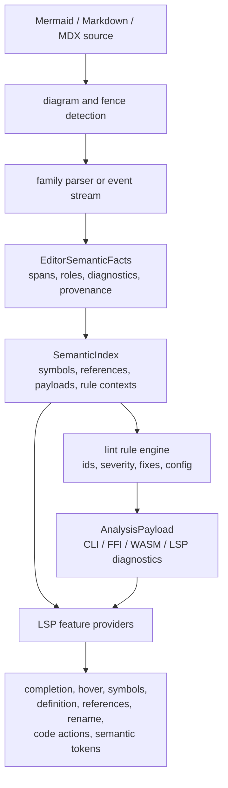

# refactor: Mature Mermaid LSP and Lint Product Surface

## Summary

This plan turns the current diagnostics-first LSP foundation into a product-grade Mermaid language
tooling surface. It keeps parser technology family-local, removes heuristic editor semantics as the
parser-backed contract matures, and aligns lint, CLI, FFI/WASM payloads, and LSP features around one
shared semantic index.

---

## Problem Frame

`merman-lsp` already has a real server, diagnostics, completion, hover, document symbols,
definition, references, prepare-rename, and rename. `merman-analysis` already owns canonical
diagnostics payloads, Markdown fence handling, and CLI lint output. The current gap is product
maturity: several capabilities still depend on a migration index, the lint layer is mostly parse and
semantic-warning projection, and deferred LSP surfaces such as code actions and semantic tokens are
not yet implemented.

The prior plans are the base layer:

- `docs/plans/2026-06-24-001-feat-lsp-completion-foundations-plan.md`
- `docs/plans/2026-06-24-002-refactor-parser-semantic-seam-plan.md`
- `docs/adr/0070-diagnostics-first-analysis-contract.md`
- `docs/adr/0071-editor-parser-semantic-seam.md`

This plan is the umbrella for the next maturity pass. It assumes breaking internal contracts is
acceptable when the break moves the system toward parser-backed facts, cleaner semantic indexes, and
shared analysis instead of transport-local scans.

---

## Requirements

### Parser and Semantic Contract

- R1. Every editor-visible diagram family must expose parser-backed semantic facts for definitions,
  references, outline entries, directive prefixes, and lint payloads needed by LSP and lint.
- R2. Recoverable partial parsing must preserve useful facts and source-backed recovery diagnostics
  for incomplete editor buffers.
- R3. Raw-text heuristic scans must be removed from first-class LSP/lint paths once parser-backed
  facts cover the family and feature.
- R4. Parser technology remains family-local; parser-generator rewrites are allowed only when a
  specific family needs them for correctness, recovery, or maintainability.

### Analysis and Lint

- R5. `merman-analysis` must expose a shared semantic index that supports diagnostics, lint rules,
  completion, hover, symbols, definition, references, rename, code actions, and future consumers.
- R6. Lint rules must have stable IDs, categories, severities, spans, optional fix metadata, and
  configuration hooks shared by CLI, LSP, FFI, UniFFI, and WASM surfaces.
- R7. Mermaid compatibility and source-backed semantic warnings must be rule-engine inputs, not
  one-off string mappings.

### LSP Product Surface

- R8. `merman-lsp` must provide production-quality diagnostics, completion, hover, document
  symbols, definition, references, prepare-rename, rename, code actions, and semantic tokens.
- R9. LSP responses must stay Markdown-fence aware and UTF-16 correct for plain Mermaid, Markdown,
  and MDX documents.
- R10. Completion, rename, references, and code actions must be driven by semantic roles and rename
  constraints, not by treating every span as a node identifier.

### Configuration, Packaging, and Quality

- R11. CLI lint, LSP initialization options, and binding payloads must share the same analysis
  configuration model for rule selection, severity overrides, resource limits, Mermaid config, and
  deterministic time controls.
- R12. Product readiness must be gated by semantic golden tests, recovery tests, protocol tests,
  fixture parity checks, and performance budgets for large Markdown documents.
- R13. Documentation must describe the canonical analysis/LSP contract, supported features by
  diagram family, migration boundaries, and known deferred editor-product work.

---

## Key Technical Decisions

- **KTD1. Parser-backed semantic facts remain the source of truth:** LSP and lint may use temporary
  migration shims only while a family lacks facts. New product behavior must extend core facts or a
  family event stream instead of adding editor-local parsing.
- **KTD2. Keep parser technology family-local:** Existing LALRPOP families should deepen grammar
  spans and recovery. Hand-written families should expose explicit event streams. A global LALRPOP
  rewrite would not by itself solve source spans, partial recovery, or semantic indexing.
- **KTD3. Replace `FenceTextIndex` with a richer semantic index when it stops fitting:** The current
  index is a good migration seam. Product-grade rename, lint, code actions, and semantic tokens need
  typed definitions, typed references, payload facts, rule contexts, and capability provenance.
- **KTD4. Treat lint and LSP as projections of one analysis engine:** CLI lint, LSP diagnostics,
  code actions, FFI/WASM diagnostics, and future editor integrations should share rule IDs and
  fix metadata instead of growing separate protocol-specific rule logic.
- **KTD5. Build toward IDE feature parity without cloning IDE products:** External tools such as
  Mermaid Studio Core demonstrate the expected IDE surface: completion, live validation,
  refactoring, usage search, highlighting, and visual workflows. This repo should own the language
  server and analysis core; editor-specific visual designers can be layered later.
- **KTD6. Use upstream Mermaid evidence for compatibility, not runtime fallback:** Mermaid-lint's
  fallback strategy shows why compatibility evidence matters, but Merman's goal is a Rust
  headless implementation. The compatibility path should be pinned fixtures, source-backed parser
  convergence, and documented residuals rather than a Mermaid JS runtime dependency.

---

## High-Level Technical Design

The intended break is at the analysis seam. `merman-core` keeps family parser locality,
`merman-analysis` owns semantic indexing and rule evaluation, and `merman-lsp` stays a protocol
adapter over snapshots, diagnostics, and semantic queries.

---

## Scope Boundaries

In scope:

- Parser-backed semantic facts and recovery diagnostics for the families that feed LSP and lint.
- A richer shared semantic index in `merman-analysis`.
- A rule engine with stable diagnostics and fix metadata.
- Product LSP features for code actions and semantic tokens, plus hardening of existing completion,
  hover, symbols, definition, references, and rename.
- Shared configuration for CLI lint, LSP initialization, and binding consumers.
- Test and documentation gates that make product readiness auditable.

Deferred to follow-up work:

- Full incremental parsing and incremental semantic-index updates.
- Editor-specific extensions for VS Code, JetBrains, or browser IDEs.
- Visual Mermaid editing, diagram preview UI, and MCP server surfaces.
- Formatting, unless rule-engine fixes naturally expose a narrow safe subset first.
- Workspace-wide cross-file Mermaid symbol resolution.

Outside this product slice:

- Mermaid JS runtime fallback.
- Render/layout parity refactors that do not affect analysis, lint, or LSP semantics.
- A repository-wide parser-generator monoculture.

---

## System-Wide Impact

- `merman-core` parser outputs become a stronger shared contract for editor-visible semantics.
- `merman-analysis` grows from diagnostics payload ownership into the canonical semantic and lint
  engine.
- `merman-lsp` becomes thinner over time, with feature providers delegating to semantic queries and
  rule metadata.
- `merman-cli`, FFI, UniFFI, and WASM inherit richer diagnostics without reimplementing rule logic.
- Tests move from checking isolated LSP helpers toward proving family capability coverage,
  recovery behavior, and shared payload stability.

---

## Risks & Dependencies

- Semantic fact coverage may drift by diagram family unless capability status is tested and
  documented.
- Rename and code action behavior can become unsafe if payload facts and entity references are not
  separated by role.
- Rule IDs and fix metadata are public contracts once bindings and editor clients consume them.
- Large Markdown files can expose performance issues if semantic indexing reparses too often.
- External product comparisons can tempt scope creep into visual editing; keep the core language
  tooling boundary explicit.

Mitigation is capability-driven tests, role-aware semantic indexing, staged public payload changes,
and performance fixtures before marking a family or feature product-ready.

---

## Acceptance Examples

- Given an incomplete flowchart in a Markdown fence, diagnostics, completion, hover, and rename use
  recovered parser facts and never fall back to a private LSP text scan.
- Given a class diagram with members, annotations, links, and style directives, node completion
  excludes payload-only facts while lint rules can still inspect those payload spans.
- Given a duplicated or undefined semantic reference, CLI lint and LSP diagnostics report the same
  rule ID, span, severity, and related information.
- Given a diagnostic with a safe fix, LSP code actions and machine-readable lint output expose the
  same edit intent.
- Given a large Markdown document with multiple Mermaid fences, diagnostics and completions remain
  fence-local, versioned, and UTF-16 correct.
- Given a first-class supported family, semantic tokens highlight syntax and entity roles from the
  shared semantic index.

---

## Implementation Units

### U1. Define product maturity and capability tracking

- **Goal:** Add an auditable capability matrix for diagram families, semantic fact kinds, lint rule
  coverage, and LSP feature support.
- **Requirements:** R1, R2, R3, R12, R13
- **Dependencies:** None
- **Files:**
  - `docs/lsp/README.md`
  - `docs/lsp/CAPABILITIES.md`
  - `crates/merman-analysis/src/editor.rs`
  - `crates/merman-lsp/tests/document_store.rs`
  - `crates/merman-lsp/tests/server_smoke.rs`
- **Approach:** Record family support as a test-backed product contract rather than prose only.
  Capability rows should distinguish parser-complete facts, parser-recovered facts, text-scan
  fallback, lint payload facts, rename safety, semantic-token readiness, and code-action readiness.
- **Patterns to follow:** The existing `FenceTextIndexSource::ParserComplete` /
  `ParserRecovered` tests and the role split from `EditorSemanticRole`.
- **Test scenarios:**
  - A first-class family reports parser-backed complete and recovered provenance for its supported
    semantic roles.
  - A family without full facts is visible as incomplete instead of silently passing through
    `TextScan`.
  - LSP tests fail if a first-class family regresses from parser-backed facts to text-scan
    provenance.
- **Verification:** Product docs and tests agree on which families and features are mature.

### U2. Complete parser-backed fact coverage and remove mature text scans

- **Goal:** Finish residual semantic facts for the high-value families and delete heuristic paths
  once parser-backed coverage is sufficient.
- **Requirements:** R1, R2, R3, R4, R10
- **Dependencies:** U1
- **Files:**
  - `crates/merman-core/src/diagrams/flowchart.rs`
  - `crates/merman-core/src/diagrams/sequence/mod.rs`
  - `crates/merman-core/src/diagrams/state/mod.rs`
  - `crates/merman-core/src/diagrams/class/mod.rs`
  - `crates/merman-core/src/diagrams/er.rs`
  - `crates/merman-core/src/diagrams/gantt/*`
  - `crates/merman-core/src/diagrams/mindmap/*`
  - `crates/merman-core/src/tests/*`
  - `crates/merman-analysis/src/editor.rs`
  - `crates/merman-lsp/tests/document_store.rs`
- **Approach:** Prefer grammar spans for parser-backed families and explicit event streams for
  hand-written families. Promote residual payloads such as flowchart click/linkStyle/shapeData,
  sequence messages and notes, and remaining ER/class directive values into core facts before LSP
  or lint consumes them.
- **Patterns to follow:** State's `StateEditorEvent` stream, Mindmap's line-event projection, Gantt
  payload spans, and Flowchart directive payload roles.
- **Test scenarios:**
  - Complete and recovered paths emit the same semantic roles for each targeted construct.
  - Payload-only spans are available for lint but do not enter completion, outline, references, or
    rename.
  - Text-scan fallback is unreachable for families marked mature in the capability matrix.
  - Existing render and parser fixture tests remain green after fact extraction changes.
- **Verification:** Supported families have parser-backed facts for all product-critical semantic
  roles, and mature LSP tests do not depend on raw-text structure scans.

### U3. Replace the migration index with a semantic index

- **Goal:** Evolve or replace `FenceTextIndex` with a semantic index that can power lint, rename,
  references, semantic tokens, and code actions without protocol-local interpretation.
- **Requirements:** R5, R8, R9, R10
- **Dependencies:** U1, U2
- **Files:**
  - `crates/merman-analysis/src/editor.rs`
  - `crates/merman-analysis/src/lib.rs`
  - `crates/merman-analysis/tests/analyzer.rs`
  - `crates/merman-lsp/src/snapshot.rs`
  - `crates/merman-lsp/src/structure.rs`
  - `crates/merman-lsp/src/completion.rs`
  - `crates/merman-lsp/tests/completion.rs`
  - `crates/merman-lsp/tests/server_smoke.rs`
- **Approach:** Model definitions, references, outline entries, payload spans, directive prefixes,
  semantic-token categories, rename groups, and provenance separately. Keep byte spans in analysis
  and convert to UTF-16 ranges only at the protocol boundary.
- **Current progress:** `FenceTextIndex` now retains parser-backed semantic items and stores
  references in typed `(name, kind)` groups. LSP definition, references, prepare-rename, and rename
  consume item-based group queries instead of name-only lookups.
- **Patterns to follow:** `SourceMap`, `analysis_payload_to_diagnostics`, and the current
  `FenceTextIndex` role projection behavior.
- **Test scenarios:**
  - Definition and references resolve through typed symbol groups rather than name-only lookups.
  - Rename rejects payload-only spans and unsafe replacement names while updating all valid
    references in one fence.
  - Completion reads local identifiers, directive prefixes, and context keywords from the semantic
    index.
  - Markdown fence offsets and UTF-16 conversion stay consistent across diagnostics and feature
    responses.
- **Verification:** LSP feature providers share semantic queries and no longer duplicate symbol
  interpretation.

### U4. Build the lint rule engine and configuration model

- **Goal:** Turn `merman-analysis` from diagnostics payload projection into a configurable rule
  engine for Mermaid lint.
- **Requirements:** R5, R6, R7, R11, R12
- **Dependencies:** U3
- **Files:**
  - `crates/merman-analysis/src/rules.rs`
  - `crates/merman-analysis/src/analyzer.rs`
  - `crates/merman-analysis/src/payload.rs`
  - `crates/merman-analysis/src/document.rs`
  - `crates/merman-analysis/tests/analyzer.rs`
  - `crates/merman-analysis/tests/payload_schema.rs`
  - `crates/merman-cli/src/cli.rs`
  - `crates/merman-cli/src/commands.rs`
  - `crates/merman-cli/tests/cli_compat.rs`
- **Approach:** Introduce rule descriptors with stable IDs, default severity, category, optional
  tags, config keys, and optional fix metadata. Migrate existing parse, recovery, semantic warning,
  resource, and compatibility diagnostics into the same reporting model before adding new semantic
  rules.
- **Patterns to follow:** `AnalysisPayload` schema stability, CLI `lint --format json|text`, and
  existing `AnalysisOptions` construction.
- **Test scenarios:**
  - Rule IDs and severities are stable in JSON output.
  - CLI severity override and rule enable/disable config affect both plain Mermaid and Markdown
    fences.
  - Existing warnings such as block width and duplicate gitGraph commits still map to compatible
    IDs after rule-engine migration.
  - Rule fix metadata serializes without forcing LSP-specific types into `merman-analysis`.
- **Verification:** CLI lint, bindings, and LSP diagnostics consume the same rule outputs.

### U5. Productize completion, hover, symbols, references, and rename

- **Goal:** Harden existing LSP structure features against the richer semantic index and document
  product-level behavior by family.
- **Requirements:** R8, R9, R10, R12, R13
- **Dependencies:** U3
- **Files:**
  - `crates/merman-lsp/src/completion.rs`
  - `crates/merman-lsp/src/context.rs`
  - `crates/merman-lsp/src/structure.rs`
  - `crates/merman-lsp/src/server.rs`
  - `crates/merman-lsp/tests/completion.rs`
  - `crates/merman-lsp/tests/server_smoke.rs`
  - `crates/merman-lsp/tests/document_store.rs`
  - `crates/merman-lsp/README.md`
- **Approach:** Use the semantic index to separate completion contexts, hover content, outline
  hierarchy, reference sets, and rename groups. Add family-specific expectations where Mermaid
  semantics differ instead of forcing all diagrams into node-id behavior.
- **Patterns to follow:** Existing handler tests for hover, document symbols, definition,
  references, prepare-rename, and rename.
- **Test scenarios:**
  - Completion suggests only valid identifiers or keywords for the cursor's family and context.
  - Hover distinguishes entities, outline-only members, directives, and lint-relevant payloads.
  - Document symbols preserve hierarchy for subgraphs, namespaces, states, sections, and member
    outlines where facts exist.
  - Rename updates definitions and references but excludes labels, URLs, comments, styles, and
    accessibility text unless a future rule explicitly allows that role.
- **Verification:** Existing LSP features are role-aware, family-aware, and documented as mature or
  partial.

### U6. Add code actions and semantic tokens

- **Goal:** Implement the deferred LSP surfaces that turn diagnostics and semantic roles into IDE
  productivity features.
- **Requirements:** R6, R8, R9, R10, R12
- **Dependencies:** U3, U4, U5
- **Files:**
  - `crates/merman-lsp/src/server.rs`
  - `crates/merman-lsp/src/structure.rs`
  - `crates/merman-lsp/src/semantic_tokens.rs`
  - `crates/merman-lsp/src/code_actions.rs`
  - `crates/merman-lsp/src/lib.rs`
  - `crates/merman-lsp/tests/server_smoke.rs`
  - `crates/merman-lsp/tests/semantic_tokens.rs`
  - `crates/merman-lsp/tests/code_actions.rs`
  - `crates/merman-analysis/tests/payload_schema.rs`
- **Approach:** Define a stable semantic-token legend from semantic roles and syntax facts. Map
  rule-engine fix metadata into LSP code actions only when edits are safe, localized, and
  source-span backed.
- **Current progress:** Full-document semantic tokens are wired through
  `textDocument/semanticTokens/full` from parser-backed `FenceSemanticItem` roles. Quickfix code
  actions are wired from source-span-backed `DiagnosticFix` metadata in `AnalysisDiagnostic`.
  The first fix-backed lint rule, `merman.config.prefer_init_directive`, replaces the directive
  alias `initialize` with `init` and remaps fixes correctly for Markdown fences. Range/delta
  semantic tokens and broader rule-generated fix metadata remain outstanding.
- **Patterns to follow:** `tower-lsp` capability wiring in `server.rs` and shared range conversion
  in `merman-analysis::lsp`.
- **Test scenarios:**
  - Initialize advertises semantic-token and code-action capabilities only after providers are
    wired.
  - Semantic tokens classify entities, references, directives, labels, comments, and payloads
    according to a stable legend.
  - Code actions appear for diagnostics with fix metadata and are absent for diagnostics without
    safe edits.
  - Markdown fence code actions edit host-document ranges, not fence-local byte ranges.
- **Verification:** Semantic tokens and code actions are protocol-tested and backed by shared
  analysis data.

### U7. Unify configuration, packaging, and binding surfaces

- **Goal:** Make LSP and lint configuration predictable across CLI, editor clients, FFI, UniFFI,
  and WASM.
- **Requirements:** R6, R9, R11, R13
- **Dependencies:** U4, U6
- **Files:**
  - `crates/merman-analysis/src/analyzer.rs`
  - `crates/merman-analysis/src/payload.rs`
  - `crates/merman-cli/src/cli.rs`
  - `crates/merman-cli/src/commands.rs`
  - `crates/merman-lsp/src/server.rs`
  - `crates/merman-ffi/*`
  - `crates/merman-wasm/*`
  - `docs/bindings/FFI_PROTOCOL.md`
  - `crates/merman-lsp/README.md`
  - `crates/merman-analysis/README.md`
- **Approach:** Extend `AnalysisOptions` and serialized payloads carefully so rule config,
  resource limits, deterministic time controls, Mermaid config, and feature flags have one meaning
  across transports. Keep public JSON additive where possible, but allow alpha internal Rust API
  breaks when they simplify the contract.
- **Patterns to follow:** Existing `analyze_json` surfaces, CLI lint options, and ADR 0066 / ADR
  0069 binding strategy.
- **Test scenarios:**
  - CLI lint and LSP initialization options produce equivalent analyzer configuration for the same
    rule settings.
  - FFI and WASM diagnostics payload schema tests include rule metadata and optional fixes.
  - Resource limits prevent analysis work before parser or LSP feature providers allocate
    unbounded state.
  - Documentation describes default feature profiles for product LSP builds.
- **Verification:** Consumers can configure analysis consistently without private transport
  behavior.

### U8. Lock product readiness with fixtures, performance gates, and docs

- **Goal:** Create the release gate for declaring the LSP/lint surface mature.
- **Requirements:** R1, R2, R8, R9, R12, R13
- **Dependencies:** U1, U2, U3, U4, U5, U6, U7
- **Files:**
  - `crates/merman-core/src/tests/*`
  - `crates/merman-analysis/tests/*`
  - `crates/merman-lsp/tests/*`
  - `crates/merman-cli/tests/cli_compat.rs`
  - `crates/xtask/*`
  - `docs/lsp/README.md`
  - `docs/lsp/CAPABILITIES.md`
  - `docs/knowledge/engineering/current-state.md`
- **Approach:** Add golden semantic-fact fixtures, LSP protocol smoke tests, Markdown multi-fence
  tests, binding schema tests, and large-document performance fixtures. Document known residuals
  instead of hiding them with broad normalization.
- **Patterns to follow:** Existing parser fixture strategy, `server_smoke` LSP tests, CLI compat
  tests, and the Mermaid parity policy in `AGENTS.md`.
- **Test scenarios:**
  - Parser-backed semantic facts match golden snapshots for representative upstream Mermaid
    fixtures.
  - Recovery tests cover incomplete buffers for each mature family.
  - LSP protocol tests cover diagnostics, completion, hover, symbols, definition, references,
    rename, code actions, and semantic tokens.
  - Large Markdown documents with many fences stay under documented analysis and completion
    latency budgets.
- **Verification:** The release gate proves feature coverage, parser-backed provenance, payload
  stability, and performance before the LSP/lint surface is called mature.

---

## Sources & Research

- `docs/plans/2026-06-24-001-feat-lsp-completion-foundations-plan.md`
- `docs/plans/2026-06-24-002-refactor-parser-semantic-seam-plan.md`
- `docs/adr/0070-diagnostics-first-analysis-contract.md`
- `docs/adr/0071-editor-parser-semantic-seam.md`
- `crates/merman-analysis/src/analyzer.rs`
- `crates/merman-analysis/src/rules.rs`
- `crates/merman-analysis/src/editor.rs`
- `crates/merman-lsp/src/server.rs`
- `crates/merman-lsp/src/structure.rs`
- `crates/merman-lsp/README.md`
- Jason Worden, "Introducing mermaid-lint": https://jasonworden.com/blog/introducing-mermaid-lint/
- JetBrains Marketplace, "Mermaid Studio Core": https://plugins.jetbrains.com/plugin/30883-mermaid-studio-core

---

## Documentation and Operational Notes

- Update `docs/knowledge/engineering/current-state.md` after each major unit so future sessions know
  which capabilities are parser-backed and which still use migration behavior.
- Add or update ADRs only when public payload semantics, rule configuration, or LSP capability
  boundaries change. Do not create an ADR for every family-local payload addition.
- Keep plan progress out of this document. Progress should be derived from git, tests, and the
  engineering wiki memory bundle.
