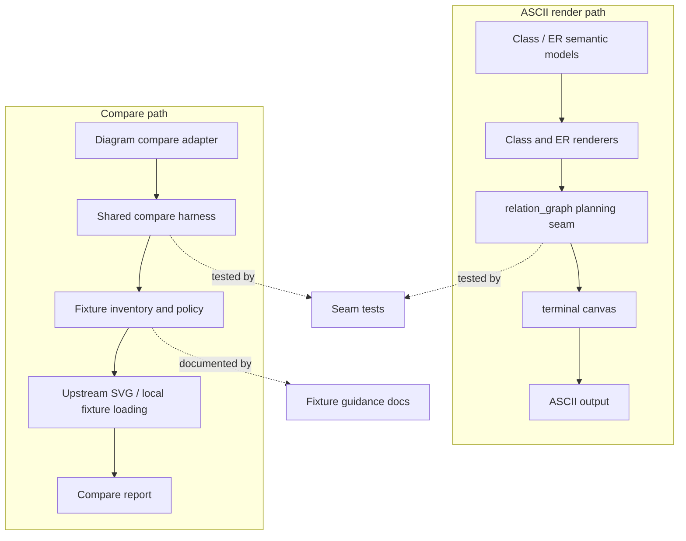

# refactor: Consolidate ASCII parity seams

## Summary
This plan consolidates the ASCII relation seam, compare harness, and test boundary so Class/ER parity work is judged through one clearer architecture instead of scattered per-diagram rules.
It keeps public snapshots as compatibility gates, but moves the load-bearing geometry, fixture selection, and inventory logic into dedicated seams.

---

## Problem Frame
`merman-ascii` has already crossed the line from feature demo into maintainable subsystem: Class notes, lollipops, interfaces, and relation fallback are supported, and the capability matrix now treats Class and ER as first-class local semantic coverage. The remaining pressure is not raw feature breadth. It is that the code still asks too many separate places to answer the same questions.

`relation_graph` already owns a useful slice of relation layout, but Class and ER still carry domain-specific layout branches, fallback decisions, and overlay assembly in their renderers. The compare side has the same smell in a different shape: `xtask` repeats fixture scanning, upstream/local loading, DOM checks, and root reporting per diagram, while the admissibility story is split between inventory docs, fixture readmes, and command behavior. Tests mirror that split, with public snapshots covering behavior that should be asserted one seam lower.

This plan uses fearless refactoring where it buys clarity. It does not preserve output shape just because a snapshot exists.

---

## Requirements
- R1. Class and ER ASCII renderers must treat `relation_graph` as the shared relation seam for routing, lane placement, and fallback.
- R2. Class and ER adapters must keep Mermaid-specific behavior at the edges: markers, cardinality, labels, and explicit unsupported diagnostics.
- R3. Dense, cyclic, or budget-constrained relation layouts must keep using the shared summary fallback rules instead of ad hoc renderer-local branches.
- R4. `xtask compare` must use one shared harness for fixture discovery, upstream/local loading, DOM checks, report writing, and root reporting.
- R5. Compare command entrypoints must remain diagram-specific adapters, but they should delegate instead of reimplementing the harness.
- R6. Fixture admissibility must stay explicit: copied `mermaid-ascii` for the narrow graph/sequence oracle, local semantic fixtures for Class/ER and dense cases, and `beautiful-mermaid` as capability evidence only.
- R7. Lower-level seam tests must cover relation planning, compare harness behavior, and inventory policy so broad snapshots can shrink without losing coverage.
- R8. Public ASCII snapshots must remain for user-visible output, but they should no longer be the only place where the critical behavior is asserted.
- R9. The docs that explain ASCII coverage and fixture choice must match the code paths and the current support matrix.

---

## Key Technical Decisions
- KTD1. `relation_graph` is the Class/ER planning seam. Renderers adapt domain semantics into that seam instead of duplicating geometry and fallback logic.
- KTD2. Compare command ergonomics stay per-diagram, but the harness becomes shared. This keeps the CLI stable while removing repeated loading and reporting code.
- KTD3. `mermaid-ascii` remains the byte-level oracle only for the narrow copied corpus. `beautiful-mermaid` informs capability and shape decisions, not exact output truth.
- KTD4. Snapshot tests stay as compatibility gates. They do not need to prove geometry, inventory selection, and fixture policy if narrower seam tests already do that.
- KTD5. Local semantic fixtures are the right home for dense Class/ER behavior and explicit unsupported boundaries. They should not be forced into copied-parity rules.
- KTD6. Inventory and docs are part of the contract. If they drift from the code, contributors will re-derive the policy instead of following it.

---

## High-Level Technical Design

---

## Scope Boundaries
In scope:
- `crates/merman-ascii/src/relation_graph.rs`
- `crates/merman-ascii/src/relation_graph/layered/scene.rs`
- `crates/merman-ascii/src/relation_graph/layered/boxes.rs`
- `crates/merman-ascii/src/relation_graph/layered/route.rs`
- `crates/merman-ascii/src/relation_graph/layered/lanes.rs`
- `crates/merman-ascii/src/class/render.rs`
- `crates/merman-ascii/src/er/render.rs`
- `crates/merman-ascii/tests/class_model.rs`
- `crates/merman-ascii/tests/er_model.rs`
- `crates/merman-ascii/tests/fixture_inventory.rs`
- `crates/merman-ascii/tests/testdata/local-semantic/README.md`
- `crates/xtask/src/cmd/compare/`
- `docs/alignment/ADMISSION_INVENTORY.md`
- `docs/rendering/ASCII_CLASS_ER_CAPABILITY_MATRIX.md`
- `crates/merman-ascii/ASCII_REFERENCE_COMPARISON.md`
- `crates/merman-ascii/ASCII_GAP_REGISTRY.md`

Deferred to follow-up work:
- New ASCII diagram families.
- Broader terminal-cell or sequence-layout rewrites that are not needed to finish the relation or compare seams.
- Expanding `beautiful-mermaid` into a universal oracle.
- Any SVG parity work.

Outside this plan:
- CLI flag redesign.
- Parser changes unrelated to ASCII parity seams.
- Cosmetic snapshot churn that does not follow from a seam or policy change.

---

## Risks & Dependencies
| Risk | Why it matters | Mitigation |
| --- | --- | --- |
| Compare harness consolidation preserves hidden special cases | The refactor would look shared while still behaving per-diagram in subtle ways | Keep diagram adapters thin and pin their behavior with focused tests |
| Relation seam deepening overgeneralizes the fallback | Dense layouts could become less readable instead of more honest | Preserve the explicit routed-vs-summary distinction and test the fallback boundary directly |
| Documentation drifts from the code | Contributors will keep re-deriving the fixture policy | Update inventory, README, and matrix together in the final unit |
| Snapshot reduction becomes coverage loss | Refactors could slip through with less protection than before | Land seam tests before broad snapshot shrinkage |

---

## Phased Delivery
1. Deepen the Class and ER relation seam first, because it defines the shape that the rest of the plan should protect.
2. Collapse compare harness duplication next, because it turns the fixture policy into executable behavior instead of prose.
3. Split seam tests from broad snapshots after the seams are stable.
4. Rebaseline the capability matrix and fixture guidance once the new boundaries are in place.

---

## Implementation Units

### U1. Deepen the Class/ER relation seam
- **Goal:** Make `relation_graph` the shared planning boundary for Class and ER relation routing, lane placement, and summary fallback.
- **Requirements:** R1, R2, R3
- **Dependencies:** None
- **Files:** `crates/merman-ascii/src/relation_graph.rs`, `crates/merman-ascii/src/relation_graph/summary.rs`, `crates/merman-ascii/src/relation_graph/layered/scene.rs`, `crates/merman-ascii/src/relation_graph/layered/boxes.rs`, `crates/merman-ascii/src/relation_graph/layered/route.rs`, `crates/merman-ascii/src/relation_graph/layered/lanes.rs`, `crates/merman-ascii/src/class/render.rs`, `crates/merman-ascii/src/er/render.rs`, `crates/merman-ascii/tests/class_model.rs`, `crates/merman-ascii/tests/er_model.rs`, `crates/merman-ascii/tests/testdata/local-semantic/class/`, `crates/merman-ascii/tests/testdata/local-semantic/er/`
- **Approach:** Keep Class and ER renderers focused on Mermaid semantics, then funnel shared routing, lane choice, and fallback into the relation seam. Preserve explicit unsupported diagnostics for cases the seam cannot honestly render.
- **Execution note:** Start with characterization coverage around dense fallback, same-endpoint lanes, and explicit unsupported boundaries.
- **Patterns to follow:** Existing `relation_graph` layered scene and summary modules; current Class and ER relation overlay patterns; local semantic fixture style in `tests/testdata/local-semantic/README.md`.
- **Test scenarios:**
  - A Class diagram with parallel same-endpoint relations keeps each lane visible and attached to the correct marker.
  - A Class note-for link still renders as a dotted relation to the target class.
  - An ER diagram with cardinality labels keeps the labels attached to the intended endpoint after routing.
  - Dense Class and ER layouts that exceed the readable-grid threshold fall back to `relations:` summary output instead of inventing a misleading routed grid.
  - Multiple-marker or unknown-cardinality cases remain explicit unsupported diagnostics.
- **Verification:** The renderer-specific files no longer need their own relation geometry rules to explain the public output.

### U2. Collapse compare harness duplication
- **Goal:** Replace the per-diagram copy-paste in `xtask compare` with one shared harness driven by the admission inventory and diagram-specific adapters.
- **Requirements:** R4, R5, R6
- **Dependencies:** U1
- **Files:** `crates/xtask/src/cmd/compare/mod.rs`, `crates/xtask/src/cmd/compare/root.rs`, `crates/xtask/src/cmd/compare/paths.rs`, `crates/xtask/src/cmd/compare/all.rs`, `crates/xtask/src/cmd/compare/diagrams.rs`, `crates/xtask/src/cmd/compare/diagrams/*.rs`, `crates/xtask/src/cmd/fixtures.rs`, `crates/xtask/src/cmd/admission.rs`, `docs/alignment/ADMISSION_INVENTORY.md`
- **Approach:** Keep diagram entrypoints, but make them thin wrappers around one shared compare flow for the whole compare surface. The harness should own fixture discovery, upstream/local loading, DOM reporting, and root reporting where the diagram contract supports it, while the adapters supply diagram-specific policy.
- **Execution note:** Add characterization coverage around the current compare reports before collapsing the shared harness.
- **Patterns to follow:** Existing `compare_diagram_paths` shape; current compare-all selection logic; admission inventory projection in `crates/xtask/src/cmd/admission.rs`.
- **Test scenarios:**
  - All compare adapters keep delegating through the shared harness instead of repeating file loading and report plumbing.
  - `compare-class-svgs` still honors filter, DOM, and root-report options.
  - `compare-er-svgs` still honors filter and DOM options and keeps marker checks wired through the shared flow.
  - `compare-all-svgs` continues to exclude deferred families according to the admission inventory.
  - `compare-all-svgs` continues to emit root reporting only for diagrams that already support it.
  - Missing fixture directories still fail loudly instead of being skipped.
  - Class and ER compare reports keep their current baseline-vs-local reporting shape after the harness refactor.
- **Verification:** The compare entrypoints remain stable for users, but the repeated harness logic lives in one place.

### U3. Split seam tests from broad snapshots
- **Goal:** Move relation, compare, and inventory assertions to lower-level tests so public snapshots only carry the output shape they actually need to protect.
- **Requirements:** R7, R8
- **Dependencies:** U1, U2
- **Files:** `crates/merman-ascii/tests/class_model.rs`, `crates/merman-ascii/tests/er_model.rs`, `crates/merman-ascii/tests/fixture_inventory.rs`, `crates/merman-ascii/src/relation_graph/layered/scene.rs`, `crates/merman-ascii/src/relation_graph/layered/boxes.rs`, `crates/xtask/src/cmd/compare/diagrams.rs`, `crates/xtask/src/cmd/compare/all.rs`
- **Approach:** Keep the public snapshots that describe user-visible output, but add or tighten seam-level tests for routing, fallback, inventory selection, and compare adapter behavior. Use the narrower tests to absorb the refactor churn that does not belong in end-to-end snapshots.
- **Execution note:** Add characterization coverage before shrinking any final string assertions.
- **Patterns to follow:** Existing relation_graph module tests; local semantic fixture assertions in `class_model.rs` and `er_model.rs`; current compare adapter registry tests in `diagrams.rs`.
- **Test scenarios:**
  - Relation planner tests assert the fallback reason directly instead of inferring it only from a full rendered string.
  - Inventory tests confirm the local semantic fixture README lists the actual fixtures and only the actual fixtures.
  - Compare adapter tests confirm the registry still covers the primary diagram matrix.
  - Public snapshots remain for final ASCII shape, but not for every internal relation-planning detail.
- **Verification:** The refactor is protected by more localized assertions, and the snapshot suite becomes smaller but more intentional.

### U4. Rebaseline docs and fixture guidance
- **Goal:** Bring the ASCII capability matrix, comparison note, and fixture guidance back into alignment with the refactored seams and inventory rules.
- **Requirements:** R6, R9
- **Dependencies:** U1, U2, U3
- **Files:** `docs/rendering/ASCII_CLASS_ER_CAPABILITY_MATRIX.md`, `crates/merman-ascii/ASCII_REFERENCE_COMPARISON.md`, `crates/merman-ascii/ASCII_GAP_REGISTRY.md`, `crates/merman-ascii/V1_MERMAID_ASCII_COVERAGE.md`, `crates/merman-ascii/tests/testdata/local-semantic/README.md`, `crates/merman-ascii/tests/testdata/mermaid-ascii/README.md`
- **Approach:** Update the docs so they state the real policy plainly: copied fixtures are narrow oracles, local semantic fixtures own dense Class/ER behavior, and `beautiful-mermaid` is capability evidence rather than a universal output standard. Keep the inventory README in sync with the actual fixture set.
- **Test expectation:** none -- documentation and fixture guidance only.
- **Patterns to follow:** The current capability matrix and comparison note already separate narrow parity from broader capability evidence; this unit should sharpen that split rather than invent a new policy.
- **Verification:** A contributor can tell, from the docs alone, which fixtures are copied parity, which are local semantic coverage, and which boundaries stay explicitly unsupported.

---

## System-Wide Impact
This plan changes the internal contract of `merman-ascii` and the surrounding `xtask` tooling, not just one diagram family. The visible impact is better locality for relation behavior, clearer fixture policy, and less snapshot noise when the seams move.

---

## Sources / Research
- `CONTEXT.md`
- `docs/adr/0016-class-parser-technology.md`
- `docs/adr/0052-normalized-upstream-fixtures.md`
- `docs/adr/0065-ascii-output-boundary.md`
- `docs/adr/0067-ascii-color-role-api.md`
- `docs/quality/ARCHITECTURE_ISSUES_2026-06-01.md`
- `docs/rendering/ASCII_CLASS_ER_CAPABILITY_MATRIX.md`
- `crates/merman-ascii/ASCII_REFERENCE_COMPARISON.md`
- `crates/merman-ascii/tests/testdata/local-semantic/README.md`
- `crates/merman-ascii/src/relation_graph.rs`
- `crates/merman-ascii/src/class/render.rs`
- `crates/merman-ascii/src/er/render.rs`
- `crates/xtask/src/cmd/compare/all.rs`
- `crates/xtask/src/cmd/compare/diagrams.rs`
- `crates/xtask/src/cmd/admission.rs`
- `repo-ref/beautiful-mermaid/src/ascii/class-diagram.ts`
- `repo-ref/beautiful-mermaid/src/ascii/er-diagram.ts`
- `repo-ref/beautiful-mermaid/src/__tests__/testdata/ascii/subgraph_direction_override.txt`
- `repo-ref/mermaid-ascii/README.md`
- `repo-ref/mermaid-ascii/cmd/render.go`
- `repo-ref/mermaid-ascii/pkg/sequence/renderer.go`
