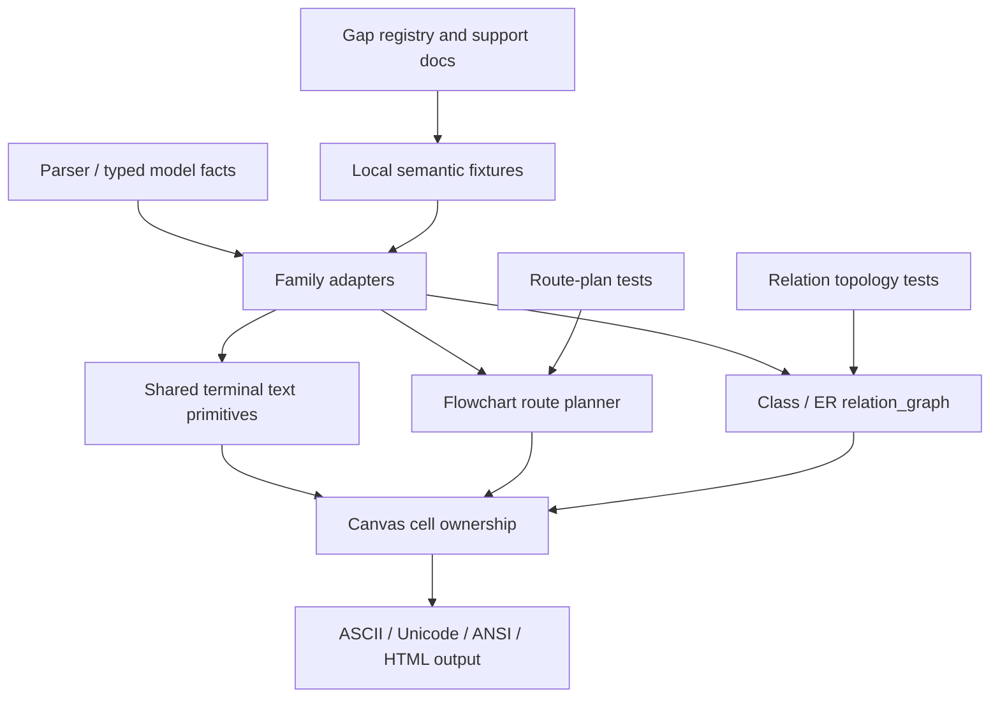

# refactor: Deepen ASCII terminal topology

## Summary

This plan turns the next ASCII pressure items into a bounded implementation track: true terminal
cell-width coverage, flowchart route-family expansion, and a sharper Class/ER routed-versus-summary
decision seam. It builds on the current `Canvas`, `StyledLine`, `graph::routing::plan`, and
`relation_graph` seams instead of creating another renderer layer.

---

## Problem Frame

The previous ASCII parity work clarified two important contracts: copied `mermaid-ascii` fixtures
are a narrow graph/sequence oracle, and Class/ER relation behavior belongs behind the shared
`relation_graph` seam. The remaining pressure is now concentrated in three places where terminal
semantics, not browser parity, should drive the design.

First, non-ASCII coverage is still uneven. `Canvas` and `StyledLine` understand display width and
continuation cells, but the support matrix still treats full CJK/emoji placement as a gap because
cross-family fixtures and row-ownership invariants are not complete. Second, flowchart routing has
many route families already split into direct, bent, back, grid-path, and boundary paths, but the
admitted coverage is still mostly high-frequency subsets. Third, Class/ER dense relations now fall
back honestly, but the project needs a better topology policy for deciding when to improve a routed
grid instead of accepting summary output.

---

## Requirements

**Terminal Cell Semantics**

- R1. Multi-cell CJK and emoji text must preserve row boundaries, style ownership, and visible
  labels across the renderer families that already claim display-width awareness.
- R2. New wide-text fixtures must be semantic unless exact text shape is the behavior being tested.
- R3. The implementation must not copy `mermaid-ascii` multibyte LR spacing as a byte oracle.

**Flowchart Routing**

- R4. Flowchart route-family work must be driven by route-plan tests before broad parser snapshots.
- R5. New route support must reuse `graph::routing::plan` selectors and route-family modules rather
  than adding diagram-level special cases.
- R6. Unsupported route combinations must remain explicit through existing support docs or focused
  diagnostics rather than silently degrading.

**Class/ER Topology**

- R7. Class/ER routed-versus-summary decisions must live in `relation_graph`, with adapters
  supplying only family-specific relation semantics.
- R8. Dense relation improvements must name why a case routes or summarizes: crossing, grid budget,
  lane collision, endpoint ambiguity, or unsupported family semantics.
- R9. Relation summary fallback must keep every endpoint, connector, marker/cardinality, and label
  line visible while routed upgrades are developed.

**Documentation and Gates**

- R10. Gap registry, support matrices, and local fixture guidance must stay aligned with shipped
  behavior and test gates.
- R11. Public snapshots remain user-visible compatibility checks, but seam-level tests must carry
  route, topology, and terminal-cell invariants.

---

## Key Technical Decisions

- **KTD1. Treat terminal cells as the root invariant.** The plan should harden `Canvas`,
  `StyledLine`, and family label writers around display cells, not Unicode scalar counts.
- **KTD2. Expand flowchart routing one route family at a time.** The existing route planner already
  isolates direct, bent, grid-path, back-edge, self-loop, and boundary routes; each expansion should
  land with route-plan tests before parser snapshots.
- **KTD3. Make Class/ER topology decisions explainable.** `LayeredRelationScenePlan::Summary`
  already records crossing and grid-budget reasons; the next seam should preserve or extend those
  reasons so tests can assert the policy directly.
- **KTD4. Keep local semantic fixtures as the complex-family oracle.** CJK/emoji, dense Class/ER,
  and complex flowchart routes should enter through small local fixtures or model tests unless a
  copied fixture is a real byte-level standard.
- **KTD5. Update docs with each behavior change.** The gap registry is part of the contract for
  ASCII workstreams; implementation units should close or narrow entries when they change support.

---

## High-Level Technical Design

The design keeps text width, flowchart routing, and relation topology as independent seams that
meet only at `Canvas`. This avoids a broad snapshot-driven rewrite and gives each pressure item a
local proof surface.

---

## Scope Boundaries

### In Scope

- Full terminal-cell ownership tests for CJK/emoji labels in the families already using
  display-width primitives.
- Focused flowchart route-family expansion where current planner modules can represent the route.
- Class/ER topology policy improvements inside `relation_graph`.
- Local semantic fixtures and support docs that describe the new behavior.

### Deferred to Follow-Up Work

- New Mermaid diagram families.
- Browser/SVG parity work unrelated to terminal output.
- A universal graph layout engine replacement.
- Pixel or byte-for-byte matching against `beautiful-mermaid`.
- Treating `mermaid-ascii` multibyte examples as exact-output fixtures.

---

## Implementation Units

### U1. Terminal Cell Coverage Inventory

- **Goal:** Turn A-TEXT-010 into a concrete cross-family fixture and invariant checklist.
- **Requirements:** R1, R2, R3, R10
- **Dependencies:** None
- **Files:** `crates/merman-ascii/ASCII_GAP_REGISTRY.md`,
  `crates/merman-ascii/tests/testdata/local-semantic/README.md`,
  `crates/merman-ascii/tests/flowchart_model.rs`, `crates/merman-ascii/tests/sequence_model.rs`,
  `crates/merman-ascii/tests/class_model.rs`, `crates/merman-ascii/tests/er_model.rs`,
  `crates/merman-ascii/tests/xychart_model.rs`
- **Approach:** Add a small inventory table or checklist for true multi-cell text cases and map each
  family to the assertion style it needs. Keep this as planning-time characterization inside tests
  and docs, not a new runtime registry.
- **Patterns to follow:** `flowchart_parser_multibyte_reference_labels_render_readably`,
  `sequence_wrapped_messages_respect_display_width_for_cjk`,
  `xychart_parser_vertical_categories_respect_display_width_for_cjk`, and `canvas::tests::wide_text_*`.
- **Test scenarios:**
  - CJK labels in a flowchart route remain visible and do not truncate adjacent connectors.
  - CJK or emoji labels in Class and ER boxes preserve relation visibility and do not leak
    continuation cells into borders.
  - Sequence and XYChart existing CJK tests remain semantic assertions rather than copied fixture
    byte checks.
- **Verification:** The gap registry names exactly which families have true multi-cell semantic
  coverage and which remain deferred.

### U2. Shared Wide-Text Cell Hardening

- **Goal:** Harden `Canvas` and `StyledLine` so family-level writers can rely on the same cell
  ownership rules for wide glyphs, styled spans, and overwrite behavior.
- **Requirements:** R1, R2, R11
- **Dependencies:** U1
- **Files:** `crates/merman-ascii/src/canvas.rs`, `crates/merman-ascii/src/text.rs`,
  `crates/merman-ascii/src/terminal.rs`, `crates/merman-ascii/src/graph/draw.rs`,
  `crates/merman-ascii/src/relation_graph.rs`, `crates/merman-ascii/src/relation_graph/summary.rs`
- **Approach:** Audit every path that writes text into a fixed-width line or canvas and make it use
  display-cell offsets. Preserve current plain output for single-width fixtures while adding
  targeted wide-glyph regressions.
- **Execution note:** Start with failing unit tests around overwrite, trimming, and styled spans
  before touching family renderers.
- **Patterns to follow:** `TerminalCell::continuation`, `write_primary_cell_style`,
  `StyledLine::write_line`, and `Canvas::index_for_char`.
- **Test scenarios:**
  - Writing a wide glyph into the final column is rejected or clipped without row spill.
  - Overwriting a wide glyph clears its old continuation cell and preserves new style ownership.
  - HTML and truecolor output keep a single style run around wide primary cells.
  - Relation summary alignment uses display width for CJK endpoints and labels.
- **Verification:** Single-width copied fixtures remain unchanged, while wide-glyph tests prove cell
  ownership at the primitive level.

### U3. Flowchart Route-Family Expansion

- **Goal:** Promote the next high-value flowchart route families through `graph::routing::plan`
  without broad renderer special cases.
- **Requirements:** R4, R5, R6, R11
- **Dependencies:** U1, U2 when wide labels are involved
- **Files:** `crates/merman-ascii/src/graph/routing/plan/select.rs`,
  `crates/merman-ascii/src/graph/routing/plan/left_right.rs`,
  `crates/merman-ascii/src/graph/routing/plan/top_down.rs`,
  `crates/merman-ascii/src/graph/routing/plan/grid.rs`,
  `crates/merman-ascii/src/graph/routing/plan/tests.rs`,
  `crates/merman-ascii/tests/flowchart_model.rs`,
  `crates/merman-ascii/tests/testdata/local-semantic/flowchart/`
- **Approach:** Choose one route family per implementation pass from current evidence: mixed local
  subgraph direction boundary routes, same-rank TD edges, reverse LR routes around self-loops, or
  grid-path routes with labels. Add route-plan tests first, then parser/model tests only for
  user-visible shape.
- **Patterns to follow:** `edge_boundary_context`, `plan_boundary_route`,
  `plan_left_right_grid_path_route_with_ports`, `plan_top_down_side_entry_route`, and existing
  `flowchart_local_semantic_fixture_covers_*` tests.
- **Test scenarios:**
  - A boundary-entering route selects the expected port pair and segment classification.
  - A boundary-leaving route reserves enough canvas extent for label text.
  - A same-rank or reverse route avoids overwriting node borders and keeps arrow direction readable.
  - Unsupported mixed-direction combinations remain documented rather than silently approximated.
- **Verification:** Each admitted route family has a route-plan unit test and a focused
  parser/model assertion when the final text shape matters.

### U4. Class/ER Routed-Versus-Summary Policy

- **Goal:** Make Class/ER topology decisions more precise so some dense cases can route while
  genuinely unreadable cases still summarize.
- **Requirements:** R7, R8, R9, R11
- **Dependencies:** U2
- **Files:** `crates/merman-ascii/src/relation_graph.rs`,
  `crates/merman-ascii/src/relation_graph/layered/scene.rs`,
  `crates/merman-ascii/src/relation_graph/layered/boxes.rs`,
  `crates/merman-ascii/src/relation_graph/layered/route.rs`,
  `crates/merman-ascii/src/class/render.rs`, `crates/merman-ascii/src/er/render.rs`,
  `crates/merman-ascii/tests/class_model.rs`, `crates/merman-ascii/tests/er_model.rs`,
  `crates/merman-ascii/tests/testdata/local-semantic/class/`,
  `crates/merman-ascii/tests/testdata/local-semantic/er/`
- **Approach:** Extend the relation topology seam with policy reasons before changing output.
  Candidate improvements include lane-collision detection, controlled layer reordering, and a
  readability budget separate from raw grid-cell area.
- **Patterns to follow:** `LayeredRelationScenePlan::Summary`, `LayeredRelationSummaryReason`,
  `plan_layered_relation_scene`, `render_layered_relation_component`, and local semantic
  Class/ER dense fixtures.
- **Test scenarios:**
  - A topology currently summarized only because of ordering can route after a deterministic reorder.
  - A topology with true crossings still reports the crossing summary reason.
  - A topology that exceeds the grid budget still summarizes and keeps every label line visible.
  - Class markers and ER cardinality markers survive both routed and summary paths.
- **Verification:** Tests can assert routed-versus-summary reason directly instead of inferring it
  only from full rendered strings.

### U5. Support Matrix and Fixture Guidance Closeout

- **Goal:** Keep contributor-facing ASCII docs aligned with the behavior shipped by U1-U4.
- **Requirements:** R2, R3, R6, R10
- **Dependencies:** U1, U2, U3, U4
- **Files:** `crates/merman-ascii/ASCII_GAP_REGISTRY.md`,
  `crates/merman-ascii/ASCII_REFERENCE_COMPARISON.md`,
  `crates/merman-ascii/FLOWCHART_SUPPORT.md`,
  `docs/rendering/ASCII_CLASS_ER_CAPABILITY_MATRIX.md`,
  `crates/merman-ascii/tests/testdata/local-semantic/README.md`
- **Approach:** Update docs only after behavior lands. Narrow gap entries when a family gains
  semantic coverage; avoid declaring full CJK/emoji support until every claimed renderer has tests.
- **Test scenarios:** Test expectation: none -- documentation unit, with `fixture_inventory` and
  existing support-doc checks providing indirect coverage where applicable.
- **Verification:** A contributor can tell whether a new case belongs in copied fixtures, local
  semantic fixtures, route-plan tests, or unsupported diagnostics.

---

## Risks & Dependencies

| Risk | Why it matters | Mitigation |
| --- | --- | --- |
| Wide-glyph fixes churn copied fixtures | Single-width byte parity is still a release gate. | Keep primitive tests focused and verify graph/sequence copied fixtures after text changes. |
| Route-family work becomes snapshot tuning | Full output snapshots can hide route-planner mistakes. | Require route-plan tests before parser/model snapshots. |
| Class/ER summary demotion becomes too aggressive | Dense summaries are honest, but overuse makes output less useful. | Add topology reasons and routed upgrade tests before changing fallback thresholds. |
| Docs overclaim support | Users will treat support matrices as product contracts. | Update support docs only after the corresponding tests land. |

---

## System-Wide Impact

This work affects the ASCII renderer as a product surface, not only isolated diagrams. The main
developer impact is a clearer proof ladder: primitive text tests for terminal cells, route-plan
tests for flowchart geometry, relation topology tests for Class/ER policy, and public snapshots for
final user-visible output.

---

## Sources / Research

- `crates/merman-ascii/ASCII_GAP_REGISTRY.md`
- `crates/merman-ascii/ASCII_REFERENCE_COMPARISON.md`
- `crates/merman-ascii/FLOWCHART_SUPPORT.md`
- `docs/rendering/ASCII_CLASS_ER_CAPABILITY_MATRIX.md`
- `crates/merman-ascii/tests/testdata/local-semantic/README.md`
- `crates/merman-ascii/src/canvas.rs`
- `crates/merman-ascii/src/text.rs`
- `crates/merman-ascii/src/terminal.rs`
- `crates/merman-ascii/src/graph/routing/plan/select.rs`
- `crates/merman-ascii/src/graph/routing/plan/tests.rs`
- `crates/merman-ascii/src/relation_graph.rs`
- `crates/merman-ascii/src/relation_graph/layered/scene.rs`
- `crates/merman-ascii/tests/class_model.rs`
- `crates/merman-ascii/tests/er_model.rs`
- `crates/merman-ascii/tests/flowchart_model.rs`
