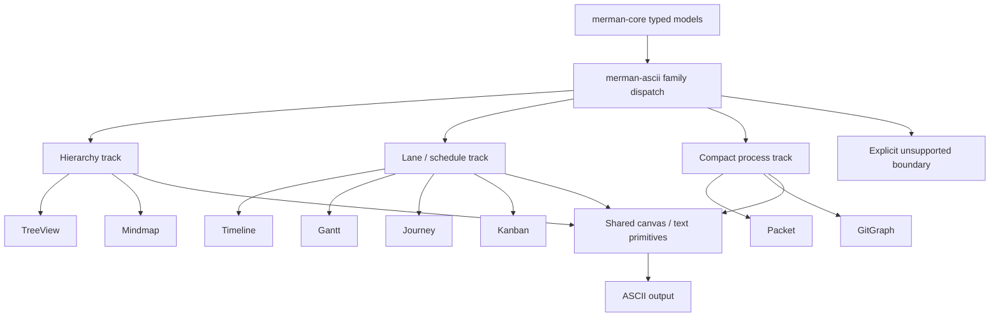

# refactor: Expand ASCII family coverage

## Goal Capsule

- **Objective:** Expand `merman-ascii` from the current supported set (`Flowchart`, `Sequence`, `Class`, `ER`, `State`, `XYChart`) to the next headless-friendly families: `TreeView`, `Mindmap`, `Timeline`, `Gantt`, `Journey`, `Kanban`, `Packet`, and `GitGraph`.
- **Authority:** The user-approved scope in this thread is primary; `crates/merman-ascii/README.md` and `crates/merman-ascii/ASCII_GAP_REGISTRY.md` remain the shipping contract.
- **Stop conditions:** Each admitted family has a supported ASCII path and targeted tests; families not admitted still fail with explicit unsupported-diagram errors; deferred heavy families (`Architecture`, `C4`, `Block`, `Requirement`) stay explicit in docs.
- **Execution profile:** Phased, code-first, with local semantic fixtures and support-doc updates landing alongside behavior.
- **Tail ownership:** `crates/merman-ascii` plus its support docs and test fixtures.

---

## Product Contract

### Summary

`merman-ascii` already renders a small set of diagram families well, but the broader semantic model in `merman-core` is still mostly gated behind unsupported-diagram errors.
This plan admits the next set of families that can be projected honestly in a terminal-first renderer without chasing browser geometry.

### Problem Frame

The repository already has typed semantic models for many diagram families, but the ASCII crate only exposes a narrow subset.
That leaves users who want headless output for hierarchy, schedule, lane, or compact process diagrams with unsupported errors even when the underlying semantics are simple enough to render in ASCII.
The missing work is not parser breadth; it is family admission, projection shape, and test coverage.

Some families are strong ASCII fits because their core meaning is hierarchical or lane-based.
`TreeView` and `Mindmap` naturally become outline trees.
`Timeline`, `Gantt`, `Journey`, and `Kanban` naturally become lanes, stages, or ordered rows.
`Packet` and `GitGraph` are smaller but still terminal-friendly if the output stays honest and compact.

The plan does not try to make ASCII look like SVG.
Where a family has no clean terminal geometry, the renderer should prefer a bounded summary or an explicit unsupported boundary rather than a fake visual clone.

### Requirements

- **R1.** `TreeView` and `Mindmap` must render through `merman-ascii` as supported headless ASCII families.
- **R2.** `Timeline`, `Gantt`, `Journey`, and `Kanban` must render through `merman-ascii` as supported headless ASCII families.
- **R3.** `Packet` and `GitGraph` must render through `merman-ascii` as supported headless ASCII families.
- **R4.** The ASCII entrypoint must remain typed-model-driven and keep unsupported families explicit.
- **R5.** Support docs, gap registry entries, and coverage notes must match shipped behavior.
- **R6.** New output should use bounded terminal projections, not browser-parity mimicry, when the family has no natural ASCII geometry.
- **R7.** Existing supported families must not regress while new families land.

### Acceptance Examples

- Given a `TreeView` or `Mindmap` model, the output preserves hierarchy, label order, and readable indentation.
- Given a `Timeline`, `Gantt`, `Journey`, or `Kanban` model, the output preserves row or stage ordering and lane separation.
- Given a `Packet` or `GitGraph` model, the output preserves the compact process or branch structure without pretending to be SVG.
- Given a family outside the admitted set, the crate still returns an explicit unsupported-diagram error.

### Scope Boundaries

In scope:

- Headless ASCII admission for `TreeView`, `Mindmap`, `Timeline`, `Gantt`, `Journey`, `Kanban`, `Packet`, and `GitGraph`.
- New family adapters, local semantic fixtures, and support-matrix updates in `crates/merman-ascii`.
- Documentation updates that explain the newly admitted families and the remaining unsupported families.

Deferred to follow-up:

- `Architecture`, `C4`, `Block`, and `Requirement`.
- Flowchart route-planning deepening, terminal-cell hardening, and Class/ER topology work already tracked in separate ASCII plans.
- Browser/SVG parity beyond the terminal projections needed for this work.

Out of scope:

- New parser work.
- A universal diagram abstraction that forces unrelated families into one geometry.
- Any attempt to copy browser layout verbatim into ASCII.

---

## Planning Contract

### Key Technical Decisions

- **KTD1.** Treat family admission as a semantic decision, not a rendering trick.
  Only families with a natural ASCII geometry should be promoted.
- **KTD2.** Split the work into three geometry clusters: hierarchy, lane or stage, and compact process.
  This keeps shared code local to the families that actually share layout.
- **KTD3.** Prefer bounded projections over faux precision.
  If a family has more visual detail than a terminal can honestly carry, render the core structure and leave the rest deferred or unsupported.
- **KTD4.** Keep the existing `UnsupportedDiagram` path honest for families still out of scope.
- **KTD5.** Update docs and gap registry entries in the same change as the shipped support so the contract and the code do not drift.

### Assumptions

- The typed semantic models already present in `merman-core` are sufficient for ASCII projection.
- No parser changes are needed to admit these families.
- Each new family can be covered with local semantic fixtures rather than copied upstream ASCII corpora.

### High-Level Technical Design

The dispatch layer should select a family adapter, normalize the semantic model into a compact layout plan, and write through the shared canvas and text primitives.
Shared helpers are allowed inside a cluster, but no single abstract layout engine should be introduced for unrelated families.

### Risks & Dependencies

- `Mindmap` and `GitGraph` are the most likely to need iteration on compact layout because they can expose more structure than a terminal-friendly outline wants to show.
- Adding new support without tightening docs would widen the shipped/support gap and confuse downstream users.
- A shared helper can become too broad if it tries to serve all eight families.
- The work depends on the existing `Canvas`, `Text`, and support-doc structure in `crates/merman-ascii`.

---

## Implementation Units

### U1. Lock the family admission contract

- **Goal:** Make the new supported set explicit before adding behavior.
- **Requirements:** R4, R5, R6, R7
- **Dependencies:** None
- **Files:**
  - `crates/merman-ascii/README.md`
  - `crates/merman-ascii/ASCII_GAP_REGISTRY.md`
  - `crates/merman-ascii/ASCII_REFERENCE_COMPARISON.md`
  - `crates/merman-ascii/V1_MERMAID_ASCII_COVERAGE.md`
  - `crates/merman-ascii/src/lib.rs`
  - `crates/merman-ascii/tests/fixture_inventory.rs`
  - `crates/merman-ascii/tests/testdata/local-semantic/README.md`
- **Approach:** Update the support matrix, define the admitted families versus deferred ones, and make the unsupported boundary explicit for everything else.
  Keep this as a contract pass, not a behavior rewrite.
- **Patterns to follow:** The current support matrix in `crates/merman-ascii/README.md`, the gap-entry style in `crates/merman-ascii/ASCII_GAP_REGISTRY.md`, and the comparison language in `crates/merman-ascii/ASCII_REFERENCE_COMPARISON.md`.
- **Test scenarios:**
  - The README and gap registry list the new admitted families and the deferred heavy families separately.
  - The entrypoint still returns unsupported for everything outside the admitted set.
  - The fixture inventory and coverage docs no longer imply that the current six-family matrix is the end of the story.
- **Verification:** A reviewer can tell the new family scope without reading code.

### U2. Add hierarchical ASCII support

- **Goal:** Render `TreeView` and `Mindmap`.
- **Requirements:** R1, R4, R6, R7
- **Dependencies:** U1
- **Files:**
  - `crates/merman-ascii/src/tree_view/mod.rs`
  - `crates/merman-ascii/src/mindmap/mod.rs`
  - `crates/merman-ascii/src/lib.rs`
  - `crates/merman-ascii/tests/tree_view_model.rs`
  - `crates/merman-ascii/tests/mindmap_model.rs`
  - `crates/merman-ascii/tests/testdata/local-semantic/tree_view/`
  - `crates/merman-ascii/tests/testdata/local-semantic/mindmap/`
- **Approach:** Introduce a shared hierarchy projector only if the tree semantics truly match.
  Otherwise keep `TreeView` and `Mindmap` adapters separate and share only indentation and text helpers.
  Render ancestry, sibling order, and labels, and keep the output compact and readable rather than diagrammatic.
- **Patterns to follow:** `crates/merman-core/src/diagrams/tree_view.rs`, `crates/merman-core/src/diagrams/mindmap/render_model.rs`, and the existing local semantic fixture style in `crates/merman-ascii/tests/testdata/local-semantic/`.
- **Test scenarios:**
  - A simple `TreeView` fixture preserves parent-child depth and sibling order.
  - A `Mindmap` fixture preserves branch ordering and center-to-leaf readability.
  - Wide labels remain readable under the existing text and canvas primitives.
  - Families outside the hierarchy track still fail with explicit unsupported errors.
- **Verification:** The output reads as a hierarchy outline, not as a browser copy.

### U3. Add lane and schedule ASCII support

- **Goal:** Render `Timeline`, `Gantt`, `Journey`, and `Kanban`.
- **Requirements:** R2, R4, R6, R7
- **Dependencies:** U1
- **Files:**
  - `crates/merman-ascii/src/timeline/mod.rs`
  - `crates/merman-ascii/src/gantt/mod.rs`
  - `crates/merman-ascii/src/journey/mod.rs`
  - `crates/merman-ascii/src/kanban/mod.rs`
  - `crates/merman-ascii/src/lib.rs`
  - `crates/merman-ascii/tests/timeline_model.rs`
  - `crates/merman-ascii/tests/gantt_model.rs`
  - `crates/merman-ascii/tests/journey_model.rs`
  - `crates/merman-ascii/tests/kanban_model.rs`
  - `crates/merman-ascii/tests/testdata/local-semantic/timeline/`
  - `crates/merman-ascii/tests/testdata/local-semantic/gantt/`
  - `crates/merman-ascii/tests/testdata/local-semantic/journey/`
  - `crates/merman-ascii/tests/testdata/local-semantic/kanban/`
- **Approach:** Normalize each family into a shared lane or stage model only where the semantics line up, then let each family choose its own textual projection.
  `Timeline` should prefer ordered event rows, `Gantt` should prefer bars or spans, `Journey` should prefer stage progression, and `Kanban` should prefer columns or lanes.
  Keep the projection stable, narrow, and testable.
- **Patterns to follow:** `crates/merman-core/src/diagrams/timeline.rs`, `crates/merman-core/src/diagrams/gantt/model.rs`, `crates/merman-core/src/diagrams/journey.rs`, `crates/merman-core/src/diagrams/kanban.rs`, and the corresponding SVG tests under `crates/merman-render/tests/`.
- **Test scenarios:**
  - A timeline fixture preserves event order and labels.
  - A gantt fixture preserves spans without overfitting to SVG bar geometry.
  - A journey fixture keeps stage progression readable across rows.
  - A kanban fixture preserves column order and card placement.
  - The shared lane helpers do not force a single layout onto families with different semantics.
- **Verification:** Each family can be recognized at a glance from its ASCII outline and label order.

### U4. Add compact process ASCII support

- **Goal:** Render `Packet` and `GitGraph`.
- **Requirements:** R3, R4, R6, R7
- **Dependencies:** U1
- **Files:**
  - `crates/merman-ascii/src/packet/mod.rs`
  - `crates/merman-ascii/src/git_graph/mod.rs`
  - `crates/merman-ascii/src/lib.rs`
  - `crates/merman-ascii/tests/packet_model.rs`
  - `crates/merman-ascii/tests/git_graph_model.rs`
  - `crates/merman-ascii/tests/testdata/local-semantic/packet/`
  - `crates/merman-ascii/tests/testdata/local-semantic/git_graph/`
- **Approach:** Keep these families compact and honest.
  `Packet` should favor readable message and segment blocks.
  `GitGraph` should favor branch and commit lane readability over decorative similarity.
  If a detail cannot be represented cleanly, prefer explicit omission plus unsupported diagnostics over a misleading pseudo-graphic.
- **Patterns to follow:** `crates/merman-core/src/diagrams/packet.rs`, `crates/merman-core/src/diagrams/git_graph.rs`, and the existing model-test style in `crates/merman-ascii/tests/`.
- **Test scenarios:**
  - A packet fixture renders the core packet structure and labels.
  - A git graph fixture renders branch continuity and commit ordering.
  - Dense or unsupported features are explicitly rejected rather than approximated.
- **Verification:** The output remains compact and accurate enough for headless reading.

### U5. Close docs and coverage gates

- **Goal:** Align shipped docs, gap registry, and tests after the new families land.
- **Requirements:** R5, R7
- **Dependencies:** U2, U3, U4
- **Files:**
  - `crates/merman-ascii/README.md`
  - `crates/merman-ascii/ASCII_GAP_REGISTRY.md`
  - `crates/merman-ascii/ASCII_REFERENCE_COMPARISON.md`
  - `crates/merman-ascii/V1_MERMAID_ASCII_COVERAGE.md`
  - `crates/merman-ascii/tests/fixture_inventory.rs`
  - `crates/merman-ascii/tests/flowchart_model.rs`
  - `crates/merman-ascii/tests/sequence_model.rs`
  - `crates/merman-ascii/tests/class_model.rs`
  - `crates/merman-ascii/tests/er_model.rs`
  - `crates/merman-ascii/tests/state_model.rs`
  - `crates/merman-ascii/tests/xychart_model.rs`
  - `crates/merman-ascii/tests/tree_view_model.rs`
  - `crates/merman-ascii/tests/mindmap_model.rs`
  - `crates/merman-ascii/tests/timeline_model.rs`
  - `crates/merman-ascii/tests/gantt_model.rs`
  - `crates/merman-ascii/tests/journey_model.rs`
  - `crates/merman-ascii/tests/kanban_model.rs`
  - `crates/merman-ascii/tests/packet_model.rs`
  - `crates/merman-ascii/tests/git_graph_model.rs`
- **Approach:** Update the shipped support matrix, rewrite the broad family gap entry so it distinguishes admitted families from deferred ones, and add or adjust coverage notes so future work knows which families are intentionally still out of scope.
  Keep the old families' test gates intact.
- **Patterns to follow:** The current matrix and boundary language in `crates/merman-ascii/README.md`, the gap registry row format in `crates/merman-ascii/ASCII_GAP_REGISTRY.md`, and the existing fixture-inventory gate in `crates/merman-ascii/tests/fixture_inventory.rs`.
- **Test scenarios:**
  - The README support matrix matches the actual entrypoint behavior.
  - Gap registry rows for deferred families remain explicit and do not overclaim support.
  - Existing Flowchart, Sequence, Class, ER, State, and XYChart tests still pass after the matrix changes.
  - The new family tests are discoverable from the support docs.
- **Verification:** The docs and tests tell the same support story.

---

## Verification Contract

| Gate | Command | Purpose |
|---|---|---|
| Format | `cargo fmt --all --check` | Keep the Rust changes mechanically clean. |
| Package regression | `cargo nextest run -p merman-ascii` | Run the ASCII package test suite after the new family tests land. |
| Focused family coverage | `cargo nextest run -p merman-ascii` with the new `tree_view_model`, `mindmap_model`, `timeline_model`, `gantt_model`, `journey_model`, `kanban_model`, `packet_model`, and `git_graph_model` tests present | Prove each admitted family before the package-wide pass. |

The package-wide `merman-ascii` suite is the main gate.
The new family tests are the proof surface that should fail first if a cluster regresses.

---

## Definition of Done

- The ASCII crate renders the eight newly admitted families and still rejects unsupported families explicitly.
- The new family tests exist, are stable, and cover the admitted family clusters.
- The support matrix, gap registry, comparison notes, and coverage doc all agree with the shipped behavior.
- Existing Flowchart, Sequence, Class, ER, State, and XYChart behavior still passes its current tests.
- Deferred heavy families remain explicitly deferred in docs rather than quietly implied by a broad support claim.

### Per-Unit Done Signals

- **U1:** The contract, docs, and dispatch surface describe the new family set accurately.
- **U2:** `TreeView` and `Mindmap` render through their new ASCII paths and their tests pass.
- **U3:** `Timeline`, `Gantt`, `Journey`, and `Kanban` render through their new ASCII paths and their tests pass.
- **U4:** `Packet` and `GitGraph` render through their new ASCII paths and their tests pass.
- **U5:** The docs and coverage gates match the actual shipped support matrix.

---

## Sources / Research

- `crates/merman-core/src/diagram/mod.rs`
- `crates/merman-core/src/diagrams/mod.rs`
- `crates/merman-core/src/diagrams/tree_view.rs`
- `crates/merman-core/src/diagrams/mindmap/render_model.rs`
- `crates/merman-core/src/diagrams/timeline.rs`
- `crates/merman-core/src/diagrams/gantt/model.rs`
- `crates/merman-core/src/diagrams/journey.rs`
- `crates/merman-core/src/diagrams/kanban.rs`
- `crates/merman-core/src/diagrams/packet.rs`
- `crates/merman-core/src/diagrams/git_graph.rs`
- `crates/merman-render/src/tree_view.rs`
- `crates/merman-render/src/mindmap.rs`
- `crates/merman-render/src/timeline.rs`
- `crates/merman-render/src/gantt.rs`
- `crates/merman-render/src/journey.rs`
- `crates/merman-render/src/kanban.rs`
- `crates/merman-render/src/packet.rs`
- `crates/merman-render/tests/tree_view_svg_test.rs`
- `crates/merman-render/tests/mindmap_svg_test.rs`
- `crates/merman-render/tests/timeline_svg_test.rs`
- `crates/merman-render/tests/gantt_svg_test.rs`
- `crates/merman-ascii/src/lib.rs`
- `crates/merman-ascii/README.md`
- `crates/merman-ascii/ASCII_GAP_REGISTRY.md`
- `crates/merman-ascii/ASCII_REFERENCE_COMPARISON.md`
- `crates/merman-ascii/V1_MERMAID_ASCII_COVERAGE.md`
