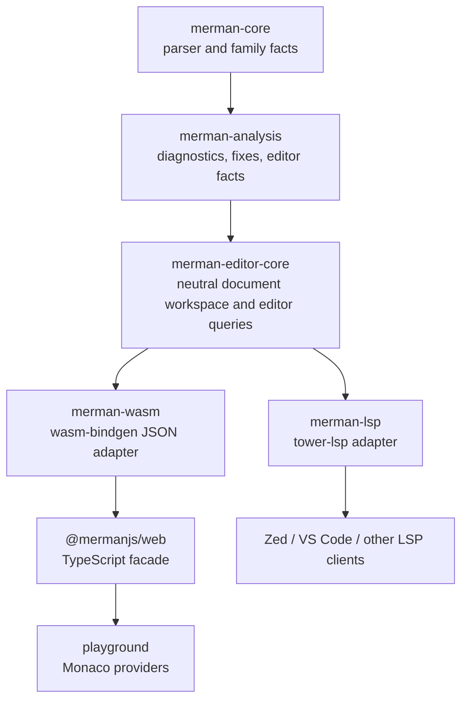
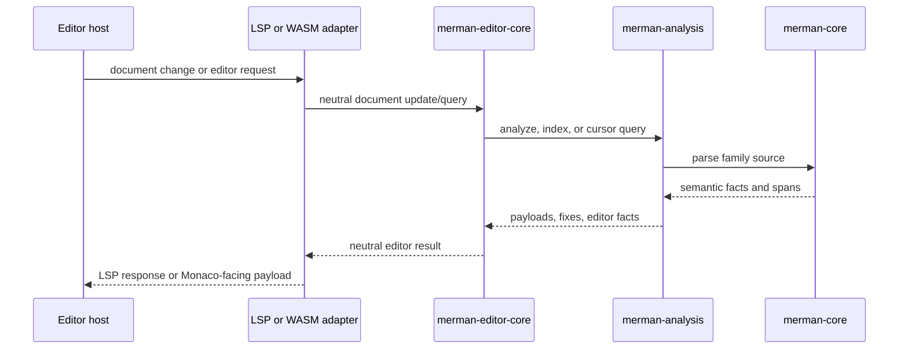

# refactor: Editor Core Language Intelligence

## Goal Capsule

This plan extracts Mermaid editor intelligence from `merman-lsp` into a protocol-neutral
`merman-editor-core` crate. `merman-lsp` becomes a thin LSP transport adapter, while
`merman-wasm`, `@mermanjs/web`, and the playground reuse the same completion, diagnostics, hover,
symbols, navigation, rename, code action, and semantic-token semantics.

Authority for this plan comes from the maintainer-confirmed scope in this planning session, the
accepted editor/parser seam in `docs/adr/0071-editor-parser-semantic-seam.md`, the browser WASM
boundary in `docs/adr/0069-wasm-package-surface-semantics.md`, and the mature LSP closure plan in
`docs/plans/2026-06-24-003-refactor-mature-mermaid-lsp-roadmap-plan.md`.

Execution profile: this is a deep, breaking internal refactor. Deleting duplicated LSP-local
semantic code is expected when the replacement is covered by characterization tests and adapter
smoke tests.

Stop if implementation discovers a product-level behavior change that contradicts the current LSP
capability matrix, or if the browser WASM surface would need to become a generic non-browser WASM
runtime. Those are scope changes, not implementation details.

## Product Contract

### Summary

Merman should have one Rust implementation of Mermaid editor intelligence. LSP clients such as Zed
and VS Code consume it through `merman-lsp`. Browser consumers and the playground consume it through
`merman-wasm` and `@mermanjs/web`. The adapters may differ, but the language behavior must not.

### Problem Frame

`merman-lsp` currently mixes three responsibilities:

- document state and Markdown fence snapshots;
- Mermaid editor semantics such as cursor context, completion, hover, symbols, rename, code
  actions, and semantic tokens;
- LSP protocol projection, lifecycle, capabilities, diagnostics transport, and semantic-token
  delta state.

`merman-analysis` also still contains LSP projection code and a direct dependency on `lsp-types`.
That makes the intended architecture blurry: analysis payloads are reusable, but protocol-specific
types leak upward and sideways.

The playground has the opposite problem. It already uses Monaco and `@mermanjs/web`, but its editor
language behavior is mostly static provider logic plus validation markers. As a result, the browser
experience can drift from the LSP experience even when both are backed by the same parsers and
analysis payloads.

### Requirements

#### Core Boundary

- R1. Add a `merman-editor-core` crate that owns protocol-neutral document snapshots, Markdown fence
  handling, cursor context, diagnostics projection, completion, hover, document symbols, workspace
  symbols, definition, references, prepare-rename, rename, code actions, and semantic-token streams.
- R2. `merman-editor-core` must not depend on `tower-lsp`, `lsp-types`, `wasm-bindgen`, Monaco, or
  TypeScript types.
- R3. `merman-editor-core` must expose neutral UTF-16 positions, ranges, document identifiers,
  locations, text edits, diagnostics, completion items, symbols, code actions, and semantic tokens.
- R4. `merman-editor-core` should use `merman-analysis` and `merman-core` semantic facts instead of
  adding new raw-text scans. Temporary text fallback is allowed only where existing analysis facts
  already expose no better source, and it must remain visible in tests or capability metadata.

#### LSP Adapter

- R5. `merman-lsp` must become a transport adapter over `merman-editor-core`. It owns LSP service
  lifecycle, initialization capabilities, client capability negotiation, push/pull diagnostics,
  semantic-token result-id and delta protocol state, custom requests, and conversion to/from
  `tower_lsp::lsp_types`.
- R6. Existing LSP product behavior must remain compatible with the current test suite unless the
  plan explicitly marks a behavior as a bug fix.
- R7. LSP protocol types must not leak back into `merman-analysis` or `merman-editor-core`.

#### WASM, Web, and Playground

- R8. `merman-wasm` must expose editor-language JSON calls backed by `merman-editor-core`, and
  `@mermanjs/web` must wrap them with typed TypeScript APIs.
- R9. The playground Monaco editor must call the WASM-backed editor APIs for diagnostics,
  completion, hover, semantic tokens, and code actions. Symbols, navigation, references, and rename
  should be wired where Monaco and the current playground UX can surface them without adding a
  separate editor product shell.
- R10. Static playground snippets and lexical tokenization may remain as loading/fallback behavior,
  but they must not be documented as the source of truth once editor-core-backed providers are
  available.
- R11. The browser-facing WASM package remains the browser/JS surface described by
  `docs/adr/0069-wasm-package-surface-semantics.md`. This plan does not create a generic pure-WASM
  editor runtime or split the npm package.

#### Documentation and Quality

- R12. Documentation must clearly distinguish `merman-editor-core` semantics from `merman-lsp`
  transport behavior and browser/Monaco adapter behavior.
- R13. Capability documentation must not claim playground parity, LSP maturity, or all-family
  coverage unless tests exercise the shared editor-core path.
- R14. Characterization tests must lock the current LSP behavior before each feature family is moved,
  then prove that LSP and browser projections are produced from the same neutral results.

### Scope Boundaries

In scope:

- new `merman-editor-core` crate and workspace integration;
- breaking internal movement of LSP semantic modules into editor core;
- removal of obsolete LSP-local semantic code after adapter coverage exists;
- removal or relocation of `lsp-types` projection from `merman-analysis`;
- WASM and TypeScript editor-language API surface;
- playground Monaco provider integration;
- documentation updates for module boundaries and capability claims.

Deferred:

- full VS Code or Zed extension packages;
- full incremental parsing or incremental semantic-index updates;
- workspace-wide Mermaid symbol resolution across unrelated files beyond current document-store
  semantics;
- formatting, except for existing safe fixes exposed through diagnostics/code actions;
- a visual Mermaid editor or diagram-editing UI.

Outside this plan:

- Mermaid JS runtime fallback;
- generic pure-WASM package restructuring;
- changing the current supported-family matrix for reasons unrelated to editor behavior;
- render/layout parity work that does not affect language intelligence.

## Context and Research

Relevant existing structure:

- `crates/merman-lsp/src/server.rs` owns LSP lifecycle, capabilities, diagnostics transport,
  semantic-token refresh, and custom request handling.
- `crates/merman-lsp/src/document_store.rs` and `crates/merman-lsp/src/snapshot.rs` own document
  snapshots, Markdown fence extraction, source maps, and semantic-token cache state, but they use
  LSP `Url`, `Position`, and `SemanticToken` types.
- `crates/merman-lsp/src/context.rs`, `completion.rs`, `structure.rs`, `semantic_tokens.rs`, and
  `code_actions.rs` contain editor-language behavior that should become protocol-neutral.
- `crates/merman-analysis/src/editor.rs` already provides lower-level editor facts such as
  `FenceTextIndex`, semantic roles, cursor context, and semantic items.
- `crates/merman-analysis/src/lsp.rs` projects analysis payloads into LSP diagnostics and is the
  main protocol leak to remove or relocate.
- `crates/merman-wasm/src/lib.rs` exposes rendering, parsing, validation, analysis, capabilities,
  and lint catalog functions, but no editor-language functions.
- `platforms/web/src/index.ts` is the typed browser package facade.
- `playground/src/components/Editor.tsx`, `playground/src/lib/mermaid-language.ts`,
  `playground/src/hooks/useMerman.ts`, and `playground/src/lib/wasm-loader.ts` are the browser
  editor integration points.

Relevant design constraints:

- `docs/adr/0071-editor-parser-semantic-seam.md` says editor-facing projections should route
  through span-rich semantic facts, not raw scans.
- `docs/adr/0069-wasm-package-surface-semantics.md` keeps browser WASM and JavaScript packaging
  explicit; browser editor APIs should extend that surface rather than redefine it.
- `docs/workstreams/web-wasm-playground/DESIGN.md` establishes the path
  `merman-core`/`merman-analysis` -> `merman-wasm` -> `@mermanjs/web` -> playground.
- `docs/lsp/README.md` and `docs/lsp/CAPABILITIES.md` are the public LSP contract that must remain
  honest after this refactor.

## Key Technical Decisions

- KTD1. The crate is named `merman-editor-core`, not `merman-lsp-core`, because it owns
  protocol-neutral editor semantics. LSP is one adapter, not the conceptual center.
- KTD2. `merman-editor-core` exposes a deep module interface: document update and query methods in,
  neutral editor results out. Callers should not need to understand `FenceTextIndex`, parser
  internals, or per-family fallback logic.
- KTD3. `merman-editor-core` owns neutral editor types. LSP and WASM adapters translate at the
  boundary instead of passing protocol-specific types through shared code.
- KTD4. `merman-analysis` remains responsible for analysis payloads, lint facts, fixes, and
  lower-level editor facts. LSP diagnostic conversion moves out of `merman-analysis`; analysis must
  not depend on `lsp-types` after the refactor.
- KTD5. Semantic-token production is split into two layers: editor core produces stable neutral
  token streams and legends; `merman-lsp` owns LSP relative-token encoding, result IDs, and delta
  state.
- KTD6. Browser APIs start as stateless document-query JSON calls over `merman-editor-core` rather
  than a long-lived WASM workspace object. This matches the current playground's single-document
  lifecycle and avoids exposing Rust state lifetime rules to JavaScript before multi-document web
  editing exists. Browser docs must describe these as single-document editor queries; workspace
  symbols remain an LSP/editor-workspace capability until the web product has a multi-document
  model.
- KTD7. Zed and VS Code integration remains through the `merman-lsp` executable. This plan documents
  that route but does not build editor-specific extension packages.
- KTD8. Characterization-first migration is mandatory. A feature moves only after existing behavior
  is captured in tests, the neutral core implementation is added, and the LSP adapter proves the
  same externally visible behavior.

## High-Level Technical Design

This sketch is intentionally non-prescriptive about exact Rust signatures. It defines ownership and
data flow; implementation can choose exact module names where they match the existing codebase.

Expected ownership after the refactor:

- `merman-editor-core` owns document text, versions, fence snapshots, neutral URI/document IDs, and
  neutral editor query results.
- `merman-lsp` owns only LSP lifecycle, client capabilities, URI conversion, protocol error
  handling, diagnostics transport, semantic-token delta projection, and custom LSP request
  projection.
- `merman-wasm` owns JSON serialization, JS error conversion, and browser-friendly stateless
  request functions.
- `@mermanjs/web` owns TypeScript types and ergonomic wrappers.
- The playground owns Monaco provider registration, debounce/stale-result handling, and fallback
  behavior while WASM is loading.

## System-Wide Impact

- The workspace gains a new Rust crate and a new dependency edge from `merman-lsp` and
  `merman-wasm` to `merman-editor-core`.
- `merman-analysis` should lose normal dependencies on `lsp-types` and `url`.
- Several `merman-lsp` modules become adapter modules, thin re-exports, or disappear.
- Tests move from LSP helper-only coverage toward a shared editor-core suite plus LSP adapter smoke
  tests.
- Browser WASM and npm package artifacts grow a language-intelligence surface. Build and packaging
  gates must catch accidental browser size, export, or TypeScript drift.
- Playground behavior changes from mostly static language metadata to async WASM-backed Monaco
  providers. Stale-result handling becomes part of the user-facing quality bar.
- Public docs must explain that `merman-editor-core` is an internal Rust reuse crate, not the
  recommended integration point for arbitrary editors. External editors should use `merman-lsp`
  unless they are embedding Merman directly.

## Implementation Units

### U1. Add `merman-editor-core` and Neutral Document Workspace

Requirements: R1, R2, R3, R4, R14. Decisions: KTD1, KTD2, KTD3, KTD8.

Files:

- `Cargo.toml`
- `crates/merman-editor-core/Cargo.toml`
- `crates/merman-editor-core/src/lib.rs`
- `crates/merman-editor-core/src/types.rs`
- `crates/merman-editor-core/src/workspace.rs`
- `crates/merman-editor-core/src/snapshot.rs`
- `crates/merman-editor-core/tests/document_workspace.rs`
- `crates/merman-lsp/src/document_store.rs`
- `crates/merman-lsp/src/snapshot.rs`

Approach:

- Introduce neutral document identifiers, versions, UTF-16 positions, ranges, locations, text edits,
  and workspace update operations.
- Move the reusable parts of `DocumentStore`, `DocumentSnapshot`, `FenceSnapshot`, source-map
  lookup, and Markdown fence selection into editor core.
- Keep any LSP-specific cache state, especially semantic-token result state, out of editor core.
- Preserve current plain Mermaid and Markdown multi-fence behavior before deleting LSP-local
  snapshot code.

Test scenarios:

- Opening a plain Mermaid document yields one active Mermaid snapshot with the same byte/UTF-16
  mapping as the current LSP helper.
- Opening Markdown with multiple fenced diagrams yields fence-local snapshots and correct source
  ranges for each fence.
- Cursor lookup inside prose returns no Mermaid fence; cursor lookup inside a fence returns the
  matching family and local position.
- Replacing a document version updates snapshots without retaining stale fence state.
- The new crate compiles without `tower-lsp`, `lsp-types`, `wasm-bindgen`, or TypeScript-facing
  dependencies.

Verification outcome:

- Shared document behavior is tested in `merman-editor-core`.
- `merman-lsp` no longer needs to own duplicate snapshot semantics after U6.

### U2. Move Completion and Cursor Context into Editor Core

Requirements: R1, R2, R3, R4, R5, R6, R8, R9, R14. Decisions: KTD2, KTD3, KTD8.

Files:

- `crates/merman-editor-core/src/context.rs`
- `crates/merman-editor-core/src/completion.rs`
- `crates/merman-editor-core/tests/completion.rs`
- `crates/merman-lsp/src/context.rs`
- `crates/merman-lsp/src/completion.rs`
- `crates/merman-lsp/tests/completion.rs`

Approach:

- Move cursor-context extraction into editor core using neutral positions and ranges.
- Define neutral completion lists, items, kinds, details, documentation, data payloads, and text
  edits.
- Keep LSP completion item kinds, insert text formats, and resolve behavior in the adapter layer.
- Use existing parser-backed expected syntax and semantic facts wherever available; keep fallback
  behavior only as an explicit compatibility bridge.

Test scenarios:

- Flowchart node, edge, direction, shape, and directive completions match current LSP behavior.
- Completion inside Markdown fences is local to the active fence and does not inspect surrounding
  prose or other fences.
- Payload-first families return payload-appropriate completions and do not fabricate node rename
  completions.
- Completion resolve preserves documentation and edit behavior through the LSP adapter.
- UTF-16 positions with non-ASCII text resolve to the same completion context in editor core and LSP.

Verification outcome:

- Completion logic has one semantic implementation.
- `merman-lsp` completion tests pass through adapter conversion rather than duplicated logic.

### U3. Move Structure, Navigation, References, and Rename into Editor Core

Requirements: R1, R2, R3, R4, R5, R6, R8, R9, R14. Decisions: KTD2, KTD3, KTD8.

Files:

- `crates/merman-editor-core/src/structure.rs`
- `crates/merman-editor-core/tests/structure.rs`
- `crates/merman-lsp/src/structure.rs`
- `crates/merman-lsp/tests/server_smoke.rs`
- `crates/merman-lsp/tests/document_store.rs`

Approach:

- Move hover, document symbols, workspace symbols, definition, references, prepare-rename, and
  rename into neutral editor queries.
- Represent symbols, symbol kinds, locations, rename constraints, and workspace edits without LSP
  types.
- Keep protocol conversion and unsupported-client handling in `merman-lsp`.
- Preserve the existing semantic-role distinction between definable entities, payload spans,
  outline entries, and non-renamable syntax.

Test scenarios:

- Hover and symbols for parser-backed flowchart and sequence fixtures match current LSP smoke
  behavior.
- Definition and references find typed entity spans, not payload-only or directive-only spans.
- Prepare-rename rejects non-renamable payload spans and accepts known entity spans.
- Rename produces a neutral workspace edit that maps to the same LSP `WorkspaceEdit` as before.
- Markdown multi-fence rename remains fence-local unless existing behavior already crosses fences.

Verification outcome:

- Structural editor queries are reusable by LSP and browser adapters.
- The adapter remains responsible only for protocol shape and client-facing error handling.

### U4. Move Diagnostics and Code Actions to Neutral Editor Results

Requirements: R1, R2, R3, R4, R5, R6, R7, R8, R12, R14. Decisions: KTD3, KTD4, KTD8.

Files:

- `crates/merman-editor-core/src/diagnostics.rs`
- `crates/merman-editor-core/src/code_actions.rs`
- `crates/merman-editor-core/tests/diagnostics.rs`
- `crates/merman-editor-core/tests/code_actions.rs`
- `crates/merman-analysis/src/lsp.rs`
- `crates/merman-analysis/Cargo.toml`
- `crates/merman-analysis/tests/lsp_positions.rs`
- `crates/merman-lsp/src/code_actions.rs`
- `crates/merman-lsp/tests/diagnostics.rs`
- `crates/merman-lsp/tests/server_smoke.rs`

Approach:

- Convert `AnalysisPayload` diagnostics and fix metadata into neutral editor diagnostics and code
  actions in editor core.
- Move or delete LSP-specific diagnostic projection from `merman-analysis`.
- Make `merman-lsp` convert neutral diagnostics and actions to LSP diagnostics, related
  information, diagnostic data, and workspace edits.
- Preserve existing diagnostic codes, severities, related information, fix metadata, and UTF-16
  range behavior.

Test scenarios:

- Diagnostics with emoji or other multi-byte text keep the same UTF-16 ranges after the move.
- Diagnostics without fixes do not produce code actions.
- Diagnostics with safe fixes produce neutral code actions and equivalent LSP quick fixes.
- Markdown fence diagnostics report document-level locations, not local fence-only ranges.
- `merman-analysis` tests no longer require LSP protocol types to verify range behavior.

Verification outcome:

- `merman-analysis` has no normal dependency on `lsp-types` or `tower-lsp`.
- Diagnostics and code actions share one neutral projection before adapter conversion.

### U5. Move Semantic Tokens and Keep Delta State in the LSP Adapter

Requirements: R1, R2, R3, R4, R5, R6, R8, R9, R14. Decisions: KTD3, KTD5, KTD8.

Files:

- `crates/merman-editor-core/src/semantic_tokens.rs`
- `crates/merman-editor-core/tests/semantic_tokens.rs`
- `crates/merman-lsp/src/semantic_tokens.rs`
- `crates/merman-lsp/src/document_store.rs`
- `crates/merman-lsp/tests/server_smoke.rs`

Approach:

- Move semantic-role-to-token selection into editor core with a neutral legend and absolute token
  stream.
- Keep LSP relative encoding, token type/modifier numeric mapping, result IDs, full/range/delta
  request handling, and refresh notifications in `merman-lsp`.
- Ensure browser adapters can consume the neutral stream without reimplementing semantic-role
  selection.

Test scenarios:

- Full semantic tokens preserve current token types and modifiers for entity, keyword, directive,
  payload, operator, and error-like roles.
- Range semantic tokens include only tokens intersecting the requested range.
- LSP delta requests produce stable edits across repeated requests and document updates.
- Browser-facing token payloads expose enough legend information for Monaco semantic tokens.
- Multi-line and non-ASCII token spans do not corrupt relative LSP encoding.

Verification outcome:

- Token semantics are shared, while protocol-specific delta machinery stays in the LSP adapter.

### U6. Consolidate `merman-lsp` into a Thin Adapter and Delete Duplicated Semantics

Requirements: R5, R6, R7, R12, R13, R14. Decisions: KTD3, KTD5, KTD7, KTD8.

Files:

- `crates/merman-lsp/src/lib.rs`
- `crates/merman-lsp/src/server.rs`
- `crates/merman-lsp/src/document_store.rs`
- `crates/merman-lsp/src/snapshot.rs`
- `crates/merman-lsp/src/context.rs`
- `crates/merman-lsp/src/completion.rs`
- `crates/merman-lsp/src/structure.rs`
- `crates/merman-lsp/src/semantic_tokens.rs`
- `crates/merman-lsp/src/code_actions.rs`
- `crates/merman-lsp/src/protocol.rs`
- `crates/merman-lsp/tests/capabilities.rs`
- `crates/merman-lsp/tests/completion.rs`
- `crates/merman-lsp/tests/diagnostics.rs`
- `crates/merman-lsp/tests/document_store.rs`
- `crates/merman-lsp/tests/server_smoke.rs`

Approach:

- Replace LSP-local semantic modules with adapter conversion modules or delete them when
  editor-core coverage exists.
- Keep `server.rs` focused on tower-lsp server state, client capabilities, config updates,
  diagnostics push/pull, semantic-token refresh, and custom requests.
- Keep `protocol.rs` for LSP custom request shapes and experimental capability projection.
- Preserve server smoke tests as the confidence gate that external clients still see the same
  behavior.

Test scenarios:

- Initialize returns the same supported capabilities unless intentionally updated for the shared
  editor surface.
- `didOpen`, `didChange`, `didSave`, and `didClose` update editor-core-backed state and diagnostics.
- Pull diagnostics and publish diagnostics preserve version and URI behavior.
- Hover, completion, symbols, definition, references, rename, code actions, and semantic tokens
  pass through the LSP service smoke tests.
- Custom rule catalog and config schema requests still return the documented payloads.

Verification outcome:

- `merman-lsp` has no remaining transport-local parsing or semantic fallback that duplicates
  editor core.
- LSP clients remain the recommended route for Zed, VS Code, and other editor integrations.

### U7. Expose Editor Core through WASM and `@mermanjs/web`

Requirements: R8, R10, R11, R12, R13, R14. Decisions: KTD3, KTD6.

Files:

- `crates/merman-wasm/Cargo.toml`
- `crates/merman-wasm/src/lib.rs`
- `platforms/web/src/index.ts`
- `platforms/web/scripts/smoke.mjs`
- `platforms/web/README.md`
- `docs/workstreams/web-wasm-playground/DESIGN.md`
- `docs/workstreams/web-wasm-playground/EVIDENCE_AND_GATES.md`

Approach:

- Add stateless document-query JSON exports for diagnostics, completion, hover, symbols,
  navigation, rename, code actions, and semantic tokens where editor core supports them.
- Wrap those exports in typed TypeScript functions in `@mermanjs/web`.
- Keep JSON request and response shapes close to editor-core neutral types, with TypeScript names
  that are browser-friendly.
- Preserve existing `analyze`, `validate`, render, capability, and lint catalog APIs.

Test scenarios:

- Shared parity fixtures compare neutral editor-core results, LSP adapter payloads, and
  `@mermanjs/web` payloads for the same representative source, including diagnostics, completion,
  hover, code actions, and semantic tokens.
- Empty source, unsupported diagram families, malformed JSON requests, invalid options, and
  analysis errors return stable browser errors or empty results without panics.
- A browser call for diagnostics returns the same diagnostic code, severity, message, and range as
  the LSP adapter for the same source.
- A browser completion call returns labels, kinds, documentation, and edits matching the neutral
  editor-core result.
- Hover, symbol, code-action, rename, and semantic-token JSON payloads serialize and deserialize
  without losing UTF-16 ranges or text edits.
- Existing `@mermanjs/web` build, prepack, and smoke behavior remains compatible.
- WASM target builds with editor core included and without pulling LSP protocol crates into the
  browser package.

Verification outcome:

- Browser consumers have a supported editor-language API surface.
- WASM does not become the owner of editor semantics; it only serializes editor-core results.

### U8. Wire Playground Monaco Providers and Close Documentation

Requirements: R8, R9, R10, R11, R12, R13, R14. Decisions: KTD6, KTD7, KTD8.

Files:

- `playground/src/components/Editor.tsx`
- `playground/src/lib/mermaid-language.ts`
- `playground/src/hooks/useMerman.ts`
- `playground/src/lib/wasm-loader.ts`
- `docs/lsp/README.md`
- `docs/lsp/CAPABILITIES.md`
- `docs/workstreams/web-wasm-playground/DESIGN.md`
- `README.md`

Approach:

- Register Monaco diagnostics, completion, hover, semantic-token, and code-action providers that
  call the `@mermanjs/web` editor APIs.
- Wire symbols, references, definition, and rename providers where Monaco can expose them using
  existing playground structure without adding a separate product shell. If a feature is available
  through editor core or LSP but not surfaced in the playground, document that exact gap rather than
  implying full playground parity.
- Guard async provider responses so stale WASM results do not overwrite newer document versions.
- Keep static snippets and lexical tokenization as loading/fallback behavior only.
- Update docs to explain the final module boundary: `merman-editor-core` is shared Rust semantics,
  `merman-lsp` is the editor protocol integration point, and the playground uses the browser WASM
  adapter for in-page Monaco features.

Test scenarios:

- Invalid Mermaid in the playground produces Monaco markers sourced from editor-core diagnostics.
- Completion after a flowchart edge or statement boundary uses WASM/editor-core results, with
  static snippets only when WASM is unavailable.
- Hover on a parser-backed symbol shows the same content category as LSP hover.
- Code actions apply safe diagnostic fixes to the Monaco model.
- Semantic tokens color parser-backed roles without overlapping or shifting text.
- Rapid edits do not display stale diagnostics, completions, or semantic tokens from an older
  source version.
- Documentation no longer implies that LSP maturity and playground editor behavior are separate
  implementations.

Verification outcome:

- Playground code editing uses the same editor intelligence as LSP-backed editors.
- Public docs are consistent with the implementation and avoid unsupported extension claims.

## Verification Contract

Run these gates before declaring the plan complete:

- Rust formatting: `cargo fmt --all --check`
- Diff hygiene: `git diff --check`
- Editor core tests: `cargo nextest run -p merman-editor-core`
- Analysis boundary tests: `cargo nextest run -p merman-analysis`
- LSP adapter tests: `cargo nextest run -p merman-lsp`
- Browser WASM check: `cargo check -p merman-wasm --target wasm32-unknown-unknown`
- WASM package build: `wasm-pack build crates/merman-wasm --target web --out-dir ../../target/merman-wasm-pkg`
- Web package build: `npm run build --prefix platforms/web`
- Web package prepack gate: `npm run prepack --prefix platforms/web`
- Playground build: `npm run build --prefix playground`
- Playground dist verification: `npm run verify:dist --prefix playground`

Additional boundary checks:

- `merman-analysis` must not have normal dependencies on `lsp-types` or `tower-lsp`.
- `merman-editor-core` must not depend on `tower-lsp`, `lsp-types`, `wasm-bindgen`, Monaco, or
  TypeScript packages.
- `merman-lsp` tests must exercise adapter projection, not a second semantic implementation.
- Browser editor API tests or smoke scripts must compare representative outputs against both
  neutral editor-core results and LSP adapter projection for the same source fixtures.

If an environment lacks npm, wasm-pack, or the wasm32 target, record the skipped gate and the exact
missing prerequisite rather than treating it as a pass.

## Risks and Mitigations

- Risk: adapter conversion bugs can silently change LSP behavior. Mitigation: characterization
  tests move before implementation, and `server_smoke.rs` remains the external-client gate.
- Risk: editor-core API becomes too shallow and exposes parser internals. Mitigation: keep public
  calls document/query oriented and use lower-level facts internally.
- Risk: WASM payloads become a second public protocol too early. Mitigation: expose browser-friendly
  JSON through `@mermanjs/web`, document it as the web package API, and avoid promising stable raw
  wasm-bindgen function names beyond the package facade.
- Risk: Monaco async providers can show stale results. Mitigation: include document-version guards
  and stale-response tests or smoke scenarios.
- Risk: semantic-token delta behavior regresses because delta state moves around. Mitigation: keep
  delta state in `merman-lsp` and preserve delta smoke coverage.
- Risk: browser package size or build time grows unexpectedly. Mitigation: include the existing
  WASM and web packaging gates in the required verification contract.
- Risk: docs overclaim all-editor support. Mitigation: document that Zed, VS Code, and similar
  tools use the LSP binary; editor-core is a Rust reuse layer, not a complete editor plugin.

## Open Questions

### Resolved During Planning

- The shared crate name is `merman-editor-core`.
- Zed and VS Code are not separate implementation targets in this plan; they consume
  `merman-lsp`.
- Browser playground support uses `merman-wasm` and `@mermanjs/web`, not an in-browser LSP server.
- Browser editor API starts as stateless document queries rather than a long-lived WASM workspace
  object.
- Internal breaking changes and deletion of obsolete code are allowed when tests preserve the
  product contract.

### Deferred to Implementation

- Exact Rust module names and TypeScript function names may be adjusted to match local naming
  conventions, as long as the ownership boundaries and tests above remain true.
- Monaco provider coverage for references, definition, and rename may be staged behind what Monaco
  can expose cleanly in the current playground UI, but the editor-core and WASM APIs should not
  block those features artificially.
- Any semantic behavior difference discovered during characterization must be classified as either
  an intentional bug fix with a test update or a regression to preserve.

## Documentation Updates

Required documentation changes:

- `docs/lsp/README.md`: explain that the LSP server is now an adapter over editor core, and that
  external editors should integrate through the LSP binary.
- `docs/lsp/CAPABILITIES.md`: update capability claims so they are backed by editor-core tests and
  adapter smoke tests.
- `docs/workstreams/web-wasm-playground/DESIGN.md`: add the editor-language API path through
  `merman-wasm` and `@mermanjs/web`.
- `docs/workstreams/web-wasm-playground/EVIDENCE_AND_GATES.md`: include editor API smoke coverage
  and playground Monaco provider checks.
- `platforms/web/README.md`: document the TypeScript editor API surface.
- `README.md`: mention the language-intelligence architecture only at a high level, without
  turning internal crate boundaries into user-facing setup instructions.

## Definition of Done

- `merman-editor-core` exists and owns neutral editor document state plus completion, diagnostics,
  hover, symbols, navigation, rename, code actions, and semantic-token semantics.
- `merman-lsp` is a thin adapter over editor core, with protocol lifecycle and projection logic but
  no duplicated semantic implementation.
- `merman-analysis` no longer depends on LSP protocol crates for normal builds.
- `merman-wasm` and `@mermanjs/web` expose browser editor-language APIs backed by editor core.
- The playground Monaco editor uses the browser editor APIs for real language features, with
  static behavior limited to loading/fallback paths.
- Obsolete LSP-local semantic code is deleted or reduced to adapter conversion.
- Capability and architecture docs match the implemented boundaries.
- All gates in the Verification Contract pass, or any skipped gate is documented with a concrete
  missing prerequisite.
