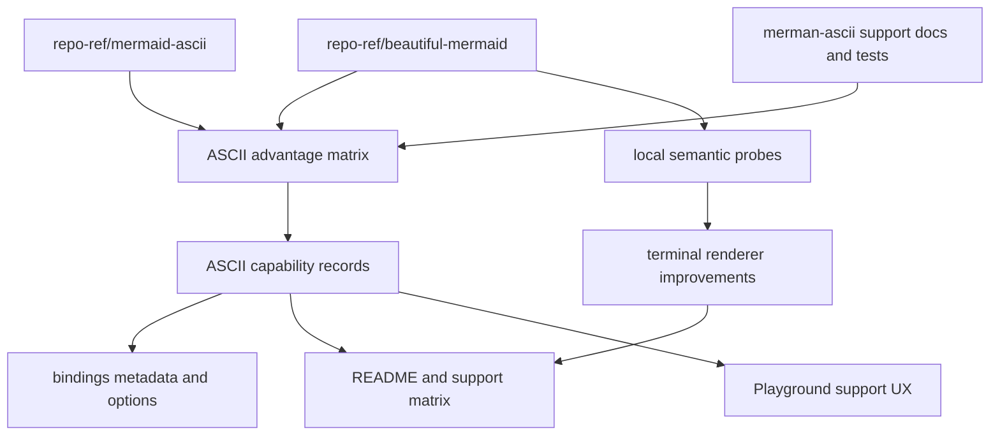

# ASCII Reference Advantage - Plan

## Goal Capsule

- **Objective:** Turn the local `beautiful-mermaid` comparison into an executable ASCII advantage track so `merman-ascii` is source-backed, user-visible, and broadly stronger before evaluating other references.
- **Authority:** Mermaid semantics and `merman-core` typed render models outrank reference output; `repo-ref/mermaid-ascii` remains the exact fixture oracle only for its copied graph and sequence corpus; `repo-ref/beautiful-mermaid` is capability prior art.
- **Execution profile:** Standard cross-surface refactor touching `merman-ascii`, binding metadata/options, CLI/Web/Playground surfaces, and ASCII docs.
- **Stop conditions:** Pause if a borrowed idea requires copying a reference parser, weakens typed-model ownership, treats `beautiful-mermaid` output as byte-level truth, or expands into unrelated SVG theme work.
- **Tail ownership:** Implementation updates docs and support matrices in the same change set as behavior or metadata changes.

---

## Product Contract

### Summary

`merman-ascii` already exceeds `beautiful-mermaid` on family breadth and several Mermaid semantics, including typed-model ownership, true `RL`/`BT` direction handling, richer state support, and terminal summaries for families that `beautiful-mermaid` does not expose as ASCII.
The next useful step is not another vague parity pass.
It is an advantage pass: make the stronger surface measurable, borrow the remaining good product ideas, and expose the result through stable APIs, docs, and Playground UX.

### Problem Frame

The current comparison docs correctly say that `beautiful-mermaid` is a broad reference, but they still leave several borrowable areas scattered across prose: theme-derived ASCII colors, HTML-colored terminal output, XYChart palette/readability choices, shape and sample organization, and clear user-facing options.
At the same time, the current public surfaces still flatten ASCII capability into simple support lists or format flags.
That makes it harder to prove that `merman-ascii` is now stronger, and harder to decide which `beautiful-mermaid` ideas deserve implementation.

### Reference Evidence Classification

The comparison must answer whether a claimed shortfall is actually a `beautiful-mermaid` capability.
Use these categories when updating the matrix, gap registry, docs, and promoted tests.

| Category | Evidence from `repo-ref/beautiful-mermaid` | Local implication |
| --- | --- | --- |
| Verified `beautiful-mermaid` capability | `repo-ref/beautiful-mermaid/README.md` documents 6 ASCII families, ASCII/Unicode output, `useAscii`, padding, `colorMode`, and theme options; `repo-ref/beautiful-mermaid/src/ascii/index.ts` exposes those options, dispatches Sequence, Class, ER, and XYChart directly, and routes Flowchart/State through the default graph pipeline. | Borrow the product clarity, but make `merman-ascii` stronger through broader family coverage and typed-model semantics. |
| Verified color/theme idea | `repo-ref/beautiful-mermaid/src/ascii/ansi.ts` derives `AsciiTheme` from `DiagramColors`, supports ANSI16/256/truecolor/HTML, and groups same-role output; `repo-ref/beautiful-mermaid/README.md` documents two-color mono mode plus `line`, `accent`, `muted`, `surface`, and `border` enrichment for SVG themes. | Add a terminal role derivation API, not a clone of SVG CSS variable behavior. |
| Verified XYChart idea | `repo-ref/beautiful-mermaid/src/ascii/xychart.ts`, `repo-ref/beautiful-mermaid/src/xychart/colors.ts`, and `repo-ref/beautiful-mermaid/src/__tests__/xychart-ascii.test.ts` show bar, line, mixed, horizontal, multi-series legends, per-series colors, title/axis ticks, and fixed 60x20 style plots. | Keep our configurable compact plot policy, typed display policy, and data-label handling while borrowing palette and readability cues. |
| Verified shape and multiline probes | `repo-ref/beautiful-mermaid/src/ascii/shapes/index.ts`, `repo-ref/beautiful-mermaid/src/__tests__/ascii-edge-styles.test.ts`, `repo-ref/beautiful-mermaid/src/__tests__/ascii-multiline.test.ts`, `repo-ref/beautiful-mermaid/src/__tests__/testdata/ascii`, and `repo-ref/beautiful-mermaid/src/__tests__/testdata/unicode` show shape registry coverage, dotted/thick edges, multiline nodes/edges/subgraphs, multiline sequence/class/ER labels, and 63 ASCII plus 37 Unicode golden files. | Promote selected examples as semantic local probes; do not import exact reference snapshots. |
| Verified Class/ER/Sequence ideas | `repo-ref/beautiful-mermaid/src/ascii/class-diagram.ts`, `repo-ref/beautiful-mermaid/src/ascii/er-diagram.ts`, and `repo-ref/beautiful-mermaid/src/ascii/sequence.ts` render compartments, annotations, crow's-foot markers, participant footer boxes, notes, and control blocks through local TS parsers. | Borrow fixture ideas, but keep `merman-ascii` relation topology and sequence behavior sourced from `merman-core` render models. |
| Verified editor/product idea | `repo-ref/beautiful-mermaid/editor.ts`, `repo-ref/beautiful-mermaid/editor/js/rendering.js`, `repo-ref/beautiful-mermaid/editor/js/config-panel.js`, `repo-ref/beautiful-mermaid/editor/js/export.js`, `repo-ref/beautiful-mermaid/editor/js/sharing.js`, and `repo-ref/beautiful-mermaid/editor/html/topbar.html` show a self-contained live editor with URL hash sharing, theme swatches, color/font/layout controls, render-time status, and export/copy actions. | Borrow the product clarity for existing Playground surfaces, but do not make a new editor or treat SVG-oriented controls as ASCII renderer requirements. |
| Not a `beautiful-mermaid` advantage | `repo-ref/beautiful-mermaid/src/ascii/index.ts` explicitly treats `RL` as `LR`; the canvas uses single JS string cells; support metadata is README/API prose, not a structured support-level endpoint; no grid-budget limit is visible in the ASCII API. | Do not describe true `RL`, wide-cell ownership, structured support metadata, or grid-budget diagnostics as things `beautiful-mermaid` already does; these are local advantage targets. |
| Not worth copying | SVG live CSS variables, Shiki extraction, browser XYChart tooltips, fixed plot constants, and reference parsers are useful context but not terminal-renderer goals. | Keep them deferred or rejected unless a future host-theme or SVG plan promotes them outside this ASCII advantage track. |

### Requirements

**Reference advantage**

- R1. The project must keep `repo-ref/beautiful-mermaid` as capability prior art, not a byte-for-byte oracle.
- R2. A maintained advantage matrix must compare `mermaid-ascii`, `beautiful-mermaid`, current `merman-ascii`, target `merman-ascii`, and the evidence path for each capability area.
- R3. The matrix must show where `merman-ascii` already wins: supported family count, true direction semantics, typed-model rendering, explicit unsupported diagnostics, terminal-cell handling, resource limits, and docs-backed support levels.
- R4. Borrowed `beautiful-mermaid` ideas must become local semantic tests, docs, or APIs before they are claimed as shipped support.
- R5. Every comparison claim must be tagged as verified `beautiful-mermaid` capability, partial/inferred reference signal, local extra target, intentionally different, or deferred.

**User-facing ASCII surface**

- R6. Public ASCII options must expose the meaningful renderer knobs that already exist internally: charset, color mode, color theme, sequence mirrored actors, XYChart plot dimensions, and grid limits.
- R7. ASCII color/theme behavior must support a small, stable theme-derivation entry point inspired by `beautiful-mermaid` mono/enriched colors while preserving `merman` host-theme boundaries.
- R8. Binding metadata and Playground capability data must expose support level and limits, not only a supported-family string array.
- R9. Playground ASCII controls must reuse the existing theme, export, share, status, and example-gallery patterns instead of introducing a separate `beautiful-mermaid`-style editor surface.
- R10. Docs must explain why `merman-ascii` intentionally differs from `beautiful-mermaid` where terminal semantics or Mermaid semantics demand it.

**Rendering depth**

- R11. XYChart ASCII must absorb the useful `beautiful-mermaid` chart ideas that fit terminal output: series palette derivation, clearer multi-series legends, line readability, and terminal-friendly value disclosure.
- R12. Flowchart, Class, ER, State, and Sequence must promote selected `beautiful-mermaid` sample ideas into local semantic probes when the sample reveals a real local gap.
- R13. Wide-cell, CJK, emoji, and combining-mark behavior must stay a first-class acceptance gate for any borrowed shape, label, chart, or summary behavior.

### Acceptance Examples

- AE1. Given a maintainer reads the reference comparison, they can see that `beautiful-mermaid` has 6 ASCII families while `merman-ascii` exposes the larger typed-model surface, and they can see the evidence file for each claim.
- AE2. Given a Web or binding caller passes ASCII options for charset, color mode, theme roles, sequence mirrored actors, XYChart plot size, or grid limit, the renderer honors valid options and rejects invalid options with existing binding error categories.
- AE3. Given an XYChart with multiple named series and a theme-derived accent color, ASCII output uses stable terminal-safe series colors and legends without depending on SVG hover tooltips.
- AE4. Given a `beautiful-mermaid` sample demonstrates a missing local semantic case, the promoted local test asserts Mermaid-visible meaning rather than exact reference spacing.
- AE5. Given a Playground user opens the ASCII filter or ASCII tab for a partially supported family, the UI can explain the support level or limit instead of only enabling or disabling the tab.
- AE6. Given a maintainer asks whether a shortfall is something `beautiful-mermaid` already handles, the plan and comparison table identify the source path or classify the item as a local extra target instead of implying reference parity pressure.
- AE7. Given a Playground user shares, exports, changes theme, or filters examples while using ASCII output, those workflows carry ASCII support-level and option context through the existing Playground controls.

### Scope Boundaries

In scope:

- ASCII reference comparison, advantage matrix, and gap registry alignment.
- `merman-ascii` options, color roles, XYChart terminal rendering, and selected semantic fixture promotion.
- Binding metadata/options and public Web/Playground capability surfaces.
- Documentation that states why `merman-ascii` is stronger or intentionally different.

Deferred to follow-up work:

- Additional Mermaid families after the current unsupported list unless the capability matrix shows a high-value terminal projection.
- Full SVG theme/live CSS variable parity with `beautiful-mermaid`.
- Shiki-specific theme extraction unless a later host-theme plan promotes it across render and ASCII surfaces.
- Full interactive chart tooltips; terminal output should use value rows, labels, or summaries instead.

Outside this product's identity:

- Copying `beautiful-mermaid` parsers into `merman-ascii`.
- Treating `beautiful-mermaid` ASCII fixtures as official Mermaid terminal output.
- Replacing the typed-model renderer boundary with source-text parsing inside `merman-ascii`.
- Pixel-perfect or byte-perfect matching against `beautiful-mermaid`.

---

## Planning Contract

### Key Technical Decisions

- KTD1. Advantage is measured by source-backed capability, not imitation.
  The plan should make stronger local behavior visible and tested instead of forcing reference-shaped output.
- KTD2. Add a richer ASCII capability record before widening UI claims.
  A support list is enough for feature gating, but the next surface needs status, level, limits, evidence, and source-reference fields.
- KTD3. Keep ASCII theme derivation local to terminal roles.
  `beautiful-mermaid` has a good two-color theme story, but `merman-ascii` should derive `AsciiColorTheme` roles from stable Rust/JSON inputs rather than inheriting SVG CSS variable semantics.
- KTD4. Expose renderer options through existing public channels.
  The crate already has meaningful options; bindings, CLI, Web, and Playground should stop hardcoding Unicode defaults when callers ask for ASCII-specific behavior.
- KTD5. Promote reference samples as semantic probes.
  Samples such as fan-in/fan-out ampersand flowcharts, class annotations, ER attributes, edge styles, multiline labels, and XYChart multi-series cases should assert local meaning and terminal readability.
- KTD6. Keep the copied `mermaid-ascii` release gate unchanged.
  This plan strengthens `beautiful-mermaid`-informed capability without expanding the exact v1 fixture oracle.
- KTD7. Require evidence tags for advantage claims.
  A missing local feature is only a `beautiful-mermaid` gap if a source path proves it; otherwise it is a local product-strength target.

### High-Level Technical Design

The design keeps three boundaries separate.
Reference checkouts provide evidence, capability records expose local truth, and renderer changes ship only when local semantic tests prove Mermaid-visible behavior.

### Assumptions

- The current `merman-ascii` broad family support documented in `crates/merman-ascii/README.md` and `docs/rendering/ASCII_SUPPORT_MATRIX.md` is the starting truth for this plan.
- `repo-ref/beautiful-mermaid` remains a local research checkout and is not required in CI.
- Public bindings can accept new ASCII options without changing the existing default output.

### Risks & Dependencies

| Risk | Impact | Mitigation |
| --- | --- | --- |
| Comparison work turns into a marketing claim without tests | Users see overbroad support statements | Require evidence paths in the advantage matrix and update support docs with every claim |
| ASCII theme options drift from render host themes | Integrators get inconsistent colors across SVG and ASCII | Derive terminal roles from a shared role vocabulary but keep terminal-specific rendering in `merman-ascii` |
| `beautiful-mermaid` samples become brittle snapshots | Snapshot churn hides semantic regressions | Promote samples as local semantic probes and reserve exact fixtures for `mermaid-ascii` |
| Playground support levels become stale | UI promises output that the crate no longer supports | Generate or expose support metadata from the same capability records used by bindings |
| XYChart polish overfits SVG expectations | Terminal charts become cluttered | Prefer compact value disclosure and configurable plot dimensions over interactive tooltip mimicry |

### System-Wide Impact

This plan changes the contract around ASCII capability reporting.
The renderer remains model-driven, but downstream surfaces gain enough metadata to explain support levels and enough options to make ASCII output a product surface rather than a fixed default.
The comparison docs also become a maintenance input for future ASCII work instead of a one-time research note.

---

## Implementation Units

### U1. Create the ASCII advantage capability record

- **Goal:** Make the `beautiful-mermaid` comparison executable as local capability data and docs.
- **Requirements:** R1, R2, R3, R4, R5, R10
- **Dependencies:** None
- **Files:** `crates/merman-ascii/ASCII_REFERENCE_COMPARISON.md`, `crates/merman-ascii/ASCII_GAP_REGISTRY.md`, `docs/rendering/ASCII_SUPPORT_MATRIX.md`, `crates/merman-ascii/src/capability.rs`, `crates/merman-ascii/src/lib.rs`, `crates/merman-bindings-core/src/metadata.rs`
- **Approach:** Introduce a small ASCII capability record that can describe family support level, key supported semantics, important limits, and reference evidence.
  Use it to replace duplicated hardcoded support claims where practical, starting with binding metadata and docs.
  Keep `repo-ref/beautiful-mermaid` counts and examples in docs or tests, not in runtime code.
  Add an evidence classification field so comparison entries can distinguish verified `beautiful-mermaid` behavior from local extra targets.
- **Patterns to follow:** Existing metadata JSON helpers in `crates/merman-bindings-core/src/metadata.rs`, support-level vocabulary in `docs/rendering/ASCII_SUPPORT_MATRIX.md`, comparison style in `crates/merman-ascii/ASCII_REFERENCE_COMPARISON.md`.
- **Test scenarios:**
  - Metadata exposes every currently supported ASCII family, including `zenuml`, with a support level matching the support matrix.
  - Capability records include at least one evidence reference for each family that is compared against `beautiful-mermaid`.
  - The comparison docs state that `beautiful-mermaid` is capability prior art and never a byte oracle.
  - Claims about color themes, XYChart, multiline labels, shapes, and Class/ER/Sequence probes cite `repo-ref/beautiful-mermaid` source paths.
  - Claims about true `RL`, wide-cell ownership, support-level metadata, grid-budget limits, and extra summary families are marked as local advantages rather than `beautiful-mermaid` capabilities.
  - The copied `mermaid-ascii` v1 fixture counts remain unchanged.
- **Verification:** A reader and a binding caller can derive the same family support story from metadata, support docs, and the reference comparison.

### U2. Expose ASCII renderer options through bindings, CLI, Web, and Playground

- **Goal:** Stop hiding internal ASCII renderer controls behind hardcoded Unicode/default behavior.
- **Requirements:** R6, R8, R10
- **Dependencies:** U1
- **Files:** `crates/merman-ascii/src/options.rs`, `crates/merman-bindings-core/src/common.rs`, `crates/merman-bindings-core/src/ascii.rs`, `crates/merman-bindings-core/src/metadata.rs`, `crates/merman-cli/src/render.rs`, `crates/merman-cli/tests/ascii_smoke.rs`, `platforms/web/src/index.ts`, `playground/src/hooks/useMerman.ts`, `playground/src/components/Preview.tsx`
- **Approach:** Add an `ascii` options block to binding JSON and map it into `AsciiRenderOptions`.
  Include charset, color mode, sequence mirrored actors, XYChart plot dimensions, and max grid cells.
  Add CLI flags only for the controls that make sense in terminal use, and let Web/Playground pass the same JSON contract through WASM.
- **Patterns to follow:** Binding option parsing and error mapping in `crates/merman-bindings-core/src/common.rs`, CLI render format parsing in `crates/merman-cli/src/render.rs`, Playground render option flow in `playground/src/components/Preview.tsx`.
- **Test scenarios:**
  - Binding JSON `{ "ascii": { "charset": "ascii" } }` renders ASCII box characters while the default remains Unicode.
  - Invalid numeric plot dimensions return `MERMAN_INVALID_ARGUMENT` with the existing `AsciiError::InvalidOption` path.
  - CLI ASCII output can opt into mirrored sequence actors without changing SVG rendering.
  - Web wrapper and Playground pass ASCII options without breaking existing `render_ascii` calls that omit options.
- **Verification:** Public surfaces can request meaningful ASCII behavior while preserving current defaults.

### U3. Add terminal theme derivation inspired by beautiful-mermaid

- **Goal:** Borrow the useful two-color and enriched-color theme idea without importing SVG CSS variable semantics into terminal rendering.
- **Requirements:** R6, R7, R10, R13
- **Dependencies:** U2
- **Files:** `crates/merman-ascii/src/color.rs`, `crates/merman-ascii/src/style_color.rs`, `crates/merman-ascii/src/canvas.rs`, `crates/merman-ascii/tests/flowchart_model.rs`, `crates/merman-ascii/tests/sequence_model.rs`, `crates/merman-ascii/tests/state_model.rs`, `crates/merman-ascii/tests/xychart_model.rs`, `crates/merman-bindings-core/src/common.rs`, `README.md`, `crates/merman-ascii/README.md`
- **Approach:** Add a safe constructor that derives terminal roles from `background`, `foreground`, and optional `line`, `accent`, `muted`, `surface`, and `border` inputs.
  Map only terminal-meaningful roles to `AsciiColorTheme`.
  Preserve explicit role overrides through the existing `with_role` API.
  Keep `Html` output escaped and span-grouped.
- **Patterns to follow:** `AsciiColorTheme::default_light`, existing ANSI/HTML color modes, CSS color parsing in `crates/merman-ascii/src/style_color.rs`, host-theme role vocabulary in binding options.
- **Test scenarios:**
  - Two-color theme derivation assigns stable text, border, line, arrow, muted text, and chart series roles.
  - Enriched `accent` changes arrow and chart series roles without changing plain output.
  - HTML color mode escapes label text while wrapping colored spans.
  - ANSI/HTML color output with CJK and emoji labels preserves continuation cells and does not split wide glyphs.
- **Verification:** ASCII colors can be configured through a compact product API, and plain text output remains unchanged when color mode is `Plain`.

### U4. Deepen XYChart terminal readability beyond the reference

- **Goal:** Make XYChart ASCII a terminal-native strength rather than a compact fallback.
- **Requirements:** R3, R7, R11, R13
- **Dependencies:** U3
- **Files:** `crates/merman-ascii/src/xychart/plot.rs`, `crates/merman-ascii/src/xychart/render.rs`, `crates/merman-ascii/tests/xychart_model.rs`, `docs/rendering/ASCII_SUPPORT_MATRIX.md`, `crates/merman-ascii/README.md`
- **Approach:** Reuse the derived chart series colors from U3.
  Improve multi-series legends and line glyph readability where the current point/step rendering loses intent.
  Add a terminal value-disclosure mode for data labels and dense chart cases instead of copying browser hover tooltips.
  Keep configurable compact plot dimensions as the default policy.
- **Patterns to follow:** Existing `xychart::plot` split between plot-cell planning and rendering, `showDataLabel` and `showDataLabelOutsideBar` handling, wide-label tests in `crates/merman-ascii/src/xychart/render.rs`.
- **Test scenarios:**
  - Multi-series bar and line charts render stable named legend entries from typed plot titles.
  - A themed multi-series chart assigns distinct terminal series colors in ANSI and HTML modes.
  - Dense category labels produce readable terminal output without overflowing display cells.
  - `showDataLabelOutsideBar` renders useful values for horizontal and vertical bars without hiding the chart.
  - Negative and mixed bar/line data continue to respect typed y-axis ranges.
- **Verification:** XYChart output has a documented advantage over `beautiful-mermaid` for terminal consumers: configurable compact layout, typed display policy, and terminal value disclosure.

### U5. Promote selected beautiful-mermaid samples into local semantic probes

- **Goal:** Convert useful reference examples into local tests that prove meaning instead of spacing.
- **Requirements:** R1, R4, R12, R13
- **Dependencies:** U1
- **Files:** `crates/merman-ascii/tests/testdata/local-semantic/README.md`, `crates/merman-ascii/tests/testdata/local-semantic/flowchart/`, `crates/merman-ascii/tests/testdata/local-semantic/class/`, `crates/merman-ascii/tests/testdata/local-semantic/er/`, `crates/merman-ascii/tests/testdata/local-semantic/sequence/`, `crates/merman-ascii/tests/testdata/local-semantic/xychart/`, `crates/merman-ascii/tests/flowchart_model.rs`, `crates/merman-ascii/tests/class_model.rs`, `crates/merman-ascii/tests/er_model.rs`, `crates/merman-ascii/tests/sequence_model.rs`, `crates/merman-ascii/tests/xychart_model.rs`
- **Approach:** Triage `repo-ref/beautiful-mermaid/src/__tests__/testdata` and focused test files for samples that reveal real local semantic coverage.
  Promote only examples that either prove an advantage claim or expose a missing local behavior.
  Name promoted tests after the local semantic behavior, with source comments pointing to the reference sample.
- **Patterns to follow:** Existing local semantic fixture policy in `crates/merman-ascii/tests/testdata/local-semantic/README.md`, semantic assertions in Class/ER dense relation tests, and reference comparison admissibility rules.
- **Test scenarios:**
  - Flowchart fan-in/fan-out ampersand samples preserve every endpoint and label through local routing.
  - Class annotation/member/method samples render typed class content without copying reference layout.
  - ER attribute and identifying relationship samples preserve entity, attribute, and cardinality meaning.
  - Sequence multiline/block examples preserve message and frame text.
  - XYChart multi-series examples preserve series count, legend, labels, and values.
- **Verification:** Every promoted reference idea has a local semantic test or an explicit gap entry; no new test treats `beautiful-mermaid` output as an exact expected string.

### U6. Upgrade Playground and metadata support UX

- **Goal:** Make ASCII support levels and limits visible to users and downstream integrators.
- **Requirements:** R2, R3, R8, R9, R10
- **Dependencies:** U1, U2
- **Files:** `crates/merman-bindings-core/src/metadata.rs`, `crates/merman-wasm/src/lib.rs`, `platforms/web/src/index.ts`, `playground/src/lib/ascii-capabilities.ts`, `playground/src/lib/ascii-support.ts`, `playground/src/lib/export.ts`, `playground/src/hooks/useShare.ts`, `playground/src/store.ts`, `playground/src/components/ExampleGallery.tsx`, `playground/src/components/Preview.tsx`, `playground/src/components/Toolbar.tsx`, `playground/src/i18n/locales/en.json`, `playground/src/i18n/locales/zh.json`
- **Approach:** Add a richer ASCII capability metadata endpoint alongside the existing supported-family list.
  Keep the old list for compatibility.
  Teach Playground to distinguish full, partial, summary, and unsupported families and to show concise limits where a family is partial or summary-only.
  Thread the same support-level and ASCII option context through the existing share URL, export menu, render status, theme menu, and example-gallery filter where it affects user-visible behavior.
- **Patterns to follow:** Existing `ascii_supported_diagrams_json` metadata cache, TS wrapper constants in `platforms/web/src/index.ts`, current `useAsciiSupport` hook.
- **Test scenarios:**
  - Existing `SUPPORTED_ASCII_DIAGRAMS` remains available and unchanged for compatibility.
  - New capability metadata reports support level and limits for Flowchart, Class, ER, State, XYChart, and summary families.
  - Playground ASCII filter counts families by capability metadata when WASM is ready and uses fallback metadata when it is not.
  - A partial or summary family can show a limit message without disabling the ASCII tab.
  - Share links preserve ASCII-relevant render options when those options are exposed in Playground.
  - Export and copy actions explain partial or summary ASCII support instead of only disabling unsupported diagrams.
- **Verification:** Users can tell what will render, what will summarize, and why a specific example may still be hidden from the ASCII-ready filter.

### U7. Close docs, release gates, and advantage statement

- **Goal:** Publish a coherent "stronger than beautiful-mermaid for ASCII" story backed by code, tests, and docs.
- **Requirements:** R1, R2, R3, R4, R5, R9, R10
- **Dependencies:** U1, U2, U3, U4, U5, U6
- **Files:** `README.md`, `crates/merman-ascii/README.md`, `crates/merman-ascii/ASCII_REFERENCE_COMPARISON.md`, `crates/merman-ascii/ASCII_GAP_REGISTRY.md`, `crates/merman-ascii/V1_MERMAID_ASCII_COVERAGE.md`, `docs/rendering/ASCII_SUPPORT_MATRIX.md`, `docs/workstreams/ALIGNMENT.md`
- **Approach:** Rewrite the comparison short read around four categories: already stronger, borrowed and shipped, intentionally different, and deferred.
  Keep the release gate language clear that `mermaid-ascii` exact fixture parity is separate from `beautiful-mermaid` capability evidence.
  Update public README sections to explain the richer ASCII options and support-level metadata.
- **Patterns to follow:** Current provenance language in `crates/merman-ascii/README.md`, V1 gate wording in `crates/merman-ascii/V1_MERMAID_ASCII_COVERAGE.md`, support-level definitions in `docs/rendering/ASCII_SUPPORT_MATRIX.md`.
- **Test scenarios:**
  - Docs list `beautiful-mermaid` as a reference for ideas, not as an oracle.
  - Docs include a "what beautiful-mermaid already does" list covering 6 ASCII families, ASCII/Unicode options, theme/color modes, XYChart multi-series/horizontal output, shape/multiline probes, and Class/ER/Sequence examples.
  - Docs include a separate "local advantage beyond beautiful-mermaid" list covering broader family coverage, true `RL`, typed-model ownership, support-level metadata, terminal-cell discipline, grid limits, and summary families.
  - Docs identify `beautiful-mermaid` editor affordances as product-surface inspiration while pointing to existing Playground share, export, theme, status, and example-gallery workflows.
  - Docs mention the new ASCII option contract and support-level metadata.
  - Gap registry remaining pressure matches the implementation state after U1-U6.
  - V1 copied fixture gate still lists only `mermaid-ascii` graph and sequence fixtures.
- **Verification:** The public docs can support the claim that `merman-ascii` is stronger in coverage, semantics, and product surface while being precise about remaining gaps.

---

## Verification Contract

| Gate | Applies to | Done signal |
| --- | --- | --- |
| `cargo fmt --check --all` | All Rust units | Formatting is stable across touched crates. |
| `cargo nextest run -p merman-ascii` | U1, U3, U4, U5, U7 | ASCII renderer behavior, semantic probes, color, wide-cell, and family tests pass. |
| `cargo nextest run -p merman-bindings-core --features ascii` | U1, U2, U6 | Binding metadata and ASCII option parsing pass with the ASCII feature. |
| `cargo nextest run -p merman-cli ascii` | U2 | CLI ASCII option behavior and smoke tests pass. |
| `npm --prefix platforms/web run build:ts` | U2, U6 | Web wrapper types and exported metadata helpers compile. |
| `npm --prefix playground run build` | U6 | Playground capability UX compiles against the Web wrapper. |
| `git diff --check` | All units | No trailing whitespace or patch artifacts remain. |

---

## Definition of Done

- ASCII reference comparison names every borrowed `beautiful-mermaid` idea as shipped, deferred, or intentionally rejected.
- Public metadata exposes both the old ASCII supported-family list and the richer support-level capability records.
- Public ASCII options are accepted through crate/binding/CLI/Web paths where applicable, with invalid options rejected cleanly.
- XYChart ASCII has a documented terminal-native advantage story and focused tests for multi-series, theme colors, labels, and dense categories.
- Promoted `beautiful-mermaid` samples are local semantic probes, not exact output snapshots.
- README, ASCII support matrix, gap registry, and V1 coverage contract agree on the support boundary.
- All verification gates relevant to touched files pass.
- Dead-end experimental code and one-off debug fixtures are removed before landing.

### Per-Unit Done Signals

| Unit | Done signal |
| --- | --- |
| U1 | Capability data, comparison docs, and binding metadata agree on family support levels. |
| U2 | ASCII option JSON and CLI flags reach `AsciiRenderOptions` without changing defaults. |
| U3 | Theme derivation works in ANSI/HTML modes and plain output remains unchanged. |
| U4 | XYChart terminal output gains tested readability improvements over the current compact baseline. |
| U5 | Reference-inspired probes cover selected Flowchart, Class, ER, Sequence, and XYChart cases semantically. |
| U6 | Playground uses richer capability metadata while keeping compatibility fallbacks. |
| U7 | Public docs can state the advantage over `beautiful-mermaid` without overclaiming parity. |

---

## Sources / Research

- `repo-ref/beautiful-mermaid/README.md`
- `repo-ref/beautiful-mermaid/src/ascii/index.ts`
- `repo-ref/beautiful-mermaid/src/ascii/ansi.ts`
- `repo-ref/beautiful-mermaid/src/ascii/xychart.ts`
- `repo-ref/beautiful-mermaid/src/xychart/colors.ts`
- `repo-ref/beautiful-mermaid/src/ascii/shapes/index.ts`
- `repo-ref/beautiful-mermaid/src/text-metrics.ts`
- `repo-ref/beautiful-mermaid/src/__tests__/testdata/`
- `repo-ref/beautiful-mermaid/editor.ts`
- `repo-ref/beautiful-mermaid/editor/js/rendering.js`
- `repo-ref/beautiful-mermaid/editor/js/config-panel.js`
- `repo-ref/beautiful-mermaid/editor/js/export.js`
- `repo-ref/beautiful-mermaid/editor/js/sharing.js`
- `repo-ref/beautiful-mermaid/editor/html/topbar.html`
- `crates/merman-ascii/README.md`
- `crates/merman-ascii/ASCII_REFERENCE_COMPARISON.md`
- `crates/merman-ascii/ASCII_GAP_REGISTRY.md`
- `crates/merman-ascii/V1_MERMAID_ASCII_COVERAGE.md`
- `docs/rendering/ASCII_SUPPORT_MATRIX.md`
- `crates/merman-ascii/src/options.rs`
- `crates/merman-ascii/src/color.rs`
- `crates/merman-ascii/src/xychart/plot.rs`
- `crates/merman-bindings-core/src/ascii.rs`
- `crates/merman-bindings-core/src/metadata.rs`
- `playground/src/lib/ascii-capabilities.ts`
