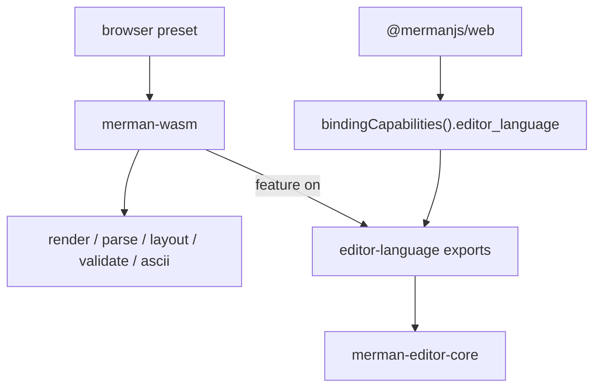

# refactor: Browser WASM Editor-Language Surface Split

## Goal Capsule

This plan splits the browser WASM editor-language surface from the render-focused browser builds so slim presets can omit editor-core-backed APIs entirely.

The baseline for this plan is the current browser package surface, the editor-core extraction work, and the existing browser preset matrix. It keeps the current npm publication default unchanged for now and treats any release-policy change as separate follow-on work.

Execution profile: bounded refactor across Rust crate features, the browser package manifest, TypeScript capability handling, and package docs.

Stop if the split cannot be expressed with feature gating plus capability metadata, or if the only clean path would be to change the published default artifact or introduce a second npm package. Those are separate decisions.

---

## Product Contract

### Summary

Browser consumers should be able to build and consume a render-focused `@mermanjs/web` artifact without compiling editor-language code paths they do not use, while editor-capable builds keep the existing Monaco-aligned completion, hover, symbols, navigation, rename, code-action, and semantic-token behavior.

The package surface must make that difference explicit enough that render-only consumers can choose a slim preset confidently and the wrapper can fail fast when editor APIs are absent.

### Problem Frame

`merman-wasm` currently compiles editor-language exports together with render, parse, layout, validation, and metadata APIs. That makes the browser surface broader than it needs to be for users who only want SVG or static validation, and it keeps editor-core code in the dependency graph even for slim browser builds.

The browser package already has preset plumbing, but the current boundary is implicit. A TypeScript caller can only discover missing editor APIs by trying them. That is workable for full builds, but it is a poor contract for a render-only preset matrix.

### Requirements

- R1. Add a compile-time `editor-language` feature boundary in `merman-wasm` so editor-core-backed exports and their transitive Rust dependencies can be omitted from slim browser presets.
- R2. Extend browser capability metadata so `@mermanjs/web` can detect whether editor-language APIs are compiled before attempting to call them.
- R3. Keep render, parse, layout, validation, and ASCII behavior unchanged for the presets that still ship those surfaces.
- R4. Make `browser-core`, `browser-render`, and `browser-ascii` build and smoke cleanly without editor-language exports; keep `browser-full` and the current full-package path editor-capable.
- R5. Keep the current npm publication default unchanged in this plan; changing the released default artifact is a separate release decision.
- R6. Document the split so the browser package, release docs, and crate README clearly distinguish render-only builds from editor-capable builds.
- R7. Add regression coverage that proves slim presets do not expose editor-language APIs while full presets still do.

### Scope Boundaries

In scope:

- Cargo feature gating in `crates/merman-wasm`
- preset manifest and TypeScript wrapper changes in `platforms/web`
- browser smoke and build gates
- package-surface documentation updates

Deferred:

- changing the npm publish default
- creating a separate editor-only npm package or subpath
- moving editor semantics out of `merman-editor-core`
- adding a browser-side LSP runtime

Outside this plan:

- reworking the editor-core contract itself
- changing current LSP server behavior
- changing the current browser package name or publication workflow

### Acceptance Examples

- Given a `browser-core` or `browser-render` build, editor-language methods are unavailable and the package does not compile editor-core-backed exports.
- Given a `browser-full` build, the same editor-language methods remain available and continue to return the current completion, hover, structure, navigation, rename, code-action, and semantic-token results.
- Given a render-only browser build, capability metadata tells the wrapper that editor-language is absent without needing crash-only probing.

---

## Planning Contract

### Key Technical Decisions

- KTD1. The split must happen at the Rust crate boundary, not only as a TypeScript runtime convention. Slim presets should avoid compiling the editor-language dependency tree instead of merely hiding methods at call time.
- KTD2. Capability detection is the contract between Rust and TypeScript. A browser artifact should advertise editor-language support explicitly so the wrapper can branch without probing missing exports.
- KTD3. The default published browser package stays full for now. This plan keeps release-policy changes separate from build-surface changes.
- KTD4. The existing preset matrix remains the right abstraction. The work should refine preset contents and metadata, not invent a second packaging model.
- KTD5. Verification must distinguish two claims: render-only presets compile without editor-language, and editor-capable presets still expose the existing Monaco-aligned behavior.

### High-Level Technical Design

The Rust side owns the compile boundary. The browser package owns the preset metadata and runtime branching. TypeScript wrappers use capability bits to decide whether editor-language methods are available, instead of learning that from a runtime exception after work has already been done.

### Risks And Mitigations

- Risk: the split only hides editor APIs in TypeScript while the Rust crate still compiles editor-core for every preset. Mitigation: gate the Rust dependency and export set with a real feature.
- Risk: browser capability metadata drifts from the actual wasm exports. Mitigation: keep the manifest, `bindingCapabilities()`, and smoke checks aligned.
- Risk: a release-policy change sneaks in alongside the surface split. Mitigation: keep the current npm default unchanged and call out any publication change as follow-on work.

---

## Implementation Units

### U1. Gate editor-language inside `merman-wasm`

- **Goal:** Make editor-language exports optional at the Rust boundary.
- **Requirements:** R1, R3, R4, R7
- **Dependencies:** None
- **Files:** `crates/merman-wasm/Cargo.toml`, `crates/merman-wasm/src/lib.rs`
- **Approach:** Add an `editor-language` feature, move editor-core imports and editor export functions behind `cfg(feature = "editor-language")`, and extend capability metadata with an explicit editor-language bit. Keep the render, parse, layout, validation, and ASCII exports compiling in slim presets.
- **Test scenarios:** Full builds still export diagnostics, code actions, completions, hover, symbols, definition, references, prepare-rename, rename, semantic-token legend, and semantic tokens; slim builds compile without editor-core-linked exports; `bindingCapabilities()` reports editor-language truthfully; render and validation behavior does not change.
- **Verification:** `cargo nextest run -p merman-wasm`; `cargo check -p merman-wasm --target wasm32-unknown-unknown --no-default-features`; `cargo check -p merman-wasm --target wasm32-unknown-unknown --no-default-features --features render`; `cargo check -p merman-wasm --target wasm32-unknown-unknown --no-default-features --features ascii`

### U2. Thread the new capability through the browser package and preset builder

- **Goal:** Make the browser build matrix and TypeScript wrapper respect whether editor-language is present.
- **Requirements:** R2, R3, R4, R7
- **Dependencies:** U1
- **Files:** `platforms/web/scripts/build-wasm.mjs`, `platforms/web/src/index.ts`, `platforms/web/scripts/smoke.mjs`, `platforms/web/package.json`
- **Approach:** Add an `editor_language` capability field to the preset manifest and wrapper capability type; keep `browser-core`, `browser-render`, and `browser-ascii` on the slim path; keep `browser-full`, `browser-full-no-elk`, and `browser-ratex-math` editor-capable; have the wrapper refuse editor methods when the capability is absent instead of discovering absence by crash-only probing.
- **Test scenarios:** Slim presets report editor-language false; full presets report editor-language true; calling editor methods on slim builds fails fast with the current unsupported-artifact error path; full builds continue to return completions, hover, symbols, references, rename, and semantic tokens.
- **Verification:** `npm run build --prefix platforms/web`; `npm run smoke --prefix platforms/web`; `npm run prepack --prefix platforms/web`; `npm run build:wasm:core --prefix platforms/web`; `npm run build:wasm:render --prefix platforms/web`; `npm run build:wasm:ascii --prefix platforms/web`; `npm run build:wasm:full --prefix platforms/web`

### U3. Update package and release docs to describe the split

- **Goal:** Make the new surface contract visible to users and maintainers.
- **Requirements:** R5, R6
- **Dependencies:** U1, U2
- **Files:** `crates/merman-wasm/README.md`, `platforms/web/README.md`, `docs/release/PACKAGE_SURFACES.md`
- **Approach:** Explain that render-only browser presets can omit editor-language while the current published default stays full; document the capability bit and the meaning of slim versus full browser presets; avoid implying that every browser artifact includes editor APIs.
- **Test scenarios:** Docs name the editor-language distinction plainly; browser package docs show which presets omit editor APIs; release docs do not claim a changed npm default in this plan.
- **Verification:** `git diff --check`

### U4. Add regression coverage for slim and full editor-language behavior

- **Goal:** Lock the feature split so future refactors do not accidentally re-couple the surfaces.
- **Requirements:** R1, R2, R4, R7
- **Dependencies:** U1, U2
- **Files:** `crates/merman-wasm/src/lib.rs`, `platforms/web/scripts/smoke.mjs`, `platforms/web/src/index.ts`
- **Approach:** Add runtime assertions for feature-on and feature-off artifacts in the Rust and browser smoke paths; keep the smoke matrix capability-driven so the same test script validates both slim and full builds without a separate harness.
- **Test scenarios:** Slim builds do not expose editor-language methods; full builds do; wrapper capability checks and preset manifests agree; browser consumers still get the current render, parse, layout, validation, and ASCII behavior in every preset.
- **Verification:** `npm run smoke --prefix platforms/web`; `cargo nextest run -p merman-wasm`

---

## Verification Contract

- `cargo fmt --all --check`
- `cargo nextest run -p merman-wasm`
- `cargo check -p merman-wasm --target wasm32-unknown-unknown --no-default-features --features render`
- `cargo check -p merman-wasm --target wasm32-unknown-unknown --no-default-features --features ascii`
- `npm run build --prefix platforms/web`
- `npm run smoke --prefix platforms/web`
- `npm run prepack --prefix platforms/web`
- `npm run build:wasm:core --prefix platforms/web`
- `npm run build:wasm:render --prefix platforms/web`
- `npm run build:wasm:ascii --prefix platforms/web`
- `npm run build:wasm:full --prefix platforms/web`
- `git diff --check`

---

## Definition of Done

- `merman-wasm` can compile with editor-language disabled and no longer pulls editor-core into slim browser presets.
- `bindingCapabilities()` and the browser preset manifest agree on whether editor-language is present.
- The current full browser package remains editor-capable and behaves as before.
- Package and release docs describe the split without claiming a new default publish policy.
- The Verification Contract passes.

---

## Appendix

### Sources

- `docs/workstreams/wasm-feature-surface-slimming/DESIGN.md`
- `docs/workstreams/wasm-feature-surface-slimming/EVIDENCE_AND_GATES.md`
- `docs/workstreams/web-wasm-playground/HANDOFF.md`
- `docs/workstreams/web-wasm-playground/EVIDENCE_AND_GATES.md`
- `docs/plans/2026-06-09-002-refactor-wasm-feature-surface-slimming-plan.md`
- `docs/plans/2026-06-28-001-refactor-editor-core-language-intelligence-plan.md`
- `docs/knowledge/engineering/progress/2026-06-28-editor-core-language-intelligence-extraction.md`
- `docs/release/PACKAGE_SURFACES.md`
- `crates/merman-wasm/README.md`
- `platforms/web/README.md`
