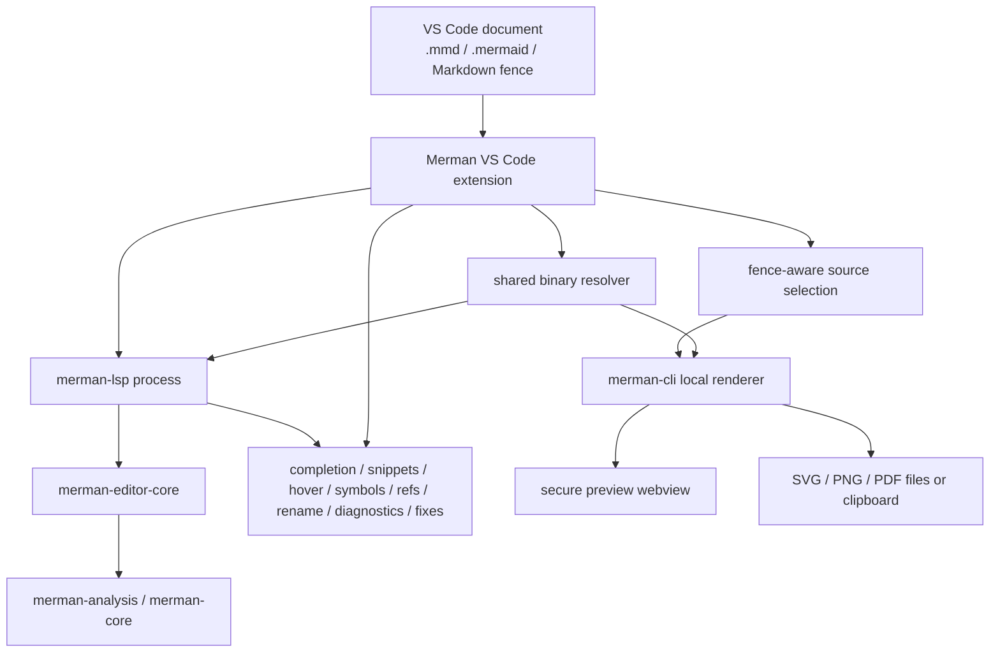

# feat: VS Code Semantic Authoring Experience

## Goal Capsule

This plan turns the Merman VS Code extension from a developer exercise harness into a local-first Mermaid authoring product. The extension should expose Merman's semantic analysis advantage through better completions, snippets, diagnostics, preview, export, and installation flows without requiring login, cloud sync, remote AI, or Cargo on the user's machine.

Authority comes from the maintainer-confirmed scope in this planning session, the current `merman-lsp` and `merman-editor-core` capability work, the existing VS Code extension, and current VS Code 1.121 Mermaid preview behavior.

Execution profile: product-facing extension work with Rust editor-core/LSP support where the VS Code UX needs richer semantic payloads.

Stop if the implementation requires a cloud account, remote AI feature, visual drag-and-drop editor, or a release-policy decision that changes Merman's package/licensing posture. Those are product decisions, not implementation details for this plan.

---

## Product Contract

### Summary

Merman's VS Code extension should become the local, semantic Mermaid authoring layer that complements VS Code's built-in Mermaid Markdown preview. Users should get strong editing help for `.mmd`, `.mermaid`, and Markdown/MDX Mermaid fences; reliable local preview and export; and a VSIX or Marketplace install that works without building Rust locally.

### Problem Frame

VS Code 1.121 now includes Mermaid rendering in Markdown preview and notebooks, including panning, zooming, and source copy. That removes the need for Merman to compete as a basic Markdown preview renderer.

MermaidChart's extension covers richer product needs such as preview, export, theme selection, AI assistance, and cloud sync, but its public surface also includes login, optional cloud features, AI workflows, analytics, and user complaints around disabling AI and authentication/export behavior. Merman should not imitate that whole product. Its stronger position is local-first, no-login, semantic authoring powered by Merman's own parsers and analysis.

The current Merman extension already launches `merman-lsp`, wires diagnostics/completion/hover/symbols/rename/references/code actions/semantic tokens, previews the active Mermaid source, and shows the rule catalog/config schema. It is still shaped like a development tool: it falls back to `cargo run`, has no snippets, no editor menus, no export commands, no packaged binaries, no extension tests, and only a small command palette surface.

### Requirements

#### Semantic Authoring

- R1. The extension must make `merman-editor-core` and `merman-lsp` the source of truth for semantic completions. VS Code-side logic may route and present results, but it must not become a second Mermaid parser.
- R2. Completion must include diagram headers, directions, operators, shapes, node identifiers, class names, style targets, click/link targets, subgraph targets where supported, and icon/template candidates when the semantic context allows them.
- R3. Completion must support snippets where placeholders materially improve authoring, including diagram skeletons, nodes, edges, subgraphs, class/style blocks, icon nodes, accessibility fields, and common diagram-family templates.
- R4. Static VS Code snippets are allowed for family skeletons and common templates. LSP snippet completions should be used for semantic, context-sensitive inserts. Do not introduce a new Mermaid shorthand dialect in this plan.
- R5. Diagnostics must be readable to normal Mermaid authors. Parser recovery messages and rule diagnostics should be deduplicated, mapped to useful ranges, and phrased as editor guidance instead of raw parser internals where possible.
- R6. Code actions must be discoverable from both VS Code's lightbulb flow and the Merman preview diagnostics list, using the existing rule/fix metadata rather than a hand-maintained VS Code rule list.
- R7. Hover, symbols, references, definitions, rename, and semantic tokens should remain LSP-backed and be documented as part of the authoring experience rather than hidden implementation details.

#### Preview And Export

- R8. Preview must work reliably for `.mmd`, `.mermaid`, and the active Mermaid fence in Markdown/MDX. When a document has multiple fences, the user must be able to preview/export the intended fence instead of only the first one.
- R9. Preview must provide editor-title, context-menu, and explorer entry points where they are relevant, not only command palette access.
- R10. Preview must show scoped diagnostics for the source being rendered and keep navigation back to the source range.
- R11. Preview inspection should include pan, zoom, reset, theme/background controls, and source-copy affordances where they do not weaken webview security.
- R12. Export/copy must use local Merman rendering. Support SVG and PNG file export first; support SVG copy first; support PNG copy only where VS Code and the host platform provide a reliable binary clipboard path, otherwise provide a clear save-to-file fallback. PDF can be exposed if the existing CLI pipeline is reliable from VS Code.
- R13. Export must work for whole Mermaid files and selected Markdown/MDX fences, with predictable filenames and user-visible errors when rendering fails.

#### Install And Local-First Product Shape

- R14. A normal extension install must not require Rust, Cargo, or a built workspace. Developer-mode `cargo run` fallback may remain, but packaged users should get bundled or resolvable `merman-lsp` and `merman-cli` binaries.
- R15. Binary resolution must share one clear path for the language server and renderer CLI, including platform detection, user override settings, executable validation, and actionable failure messages.
- R16. The extension must not require login, cloud sync, remote AI, or analytics. Any optional network behavior, such as remote icon-pack fetching, must be opt-in and documented.
- R17. The extension must coexist with VS Code 1.121's built-in Mermaid Markdown preview. Merman should focus on `.mmd` authoring, semantic language features, fence-aware actions, and local export instead of overriding the built-in Markdown preview pipeline.
- R18. The README and Marketplace-facing copy must explain the product promise plainly: local semantic Mermaid authoring, preview, and export powered by Merman.

#### Quality

- R19. Add extension-level automated coverage for activation, command registration, preview source selection, binary resolution, export command routing, and LSP integration smoke behavior.
- R20. Add Rust coverage for any new editor-core/LSP completion, snippet, or diagnostic payload shape needed by the extension.
- R21. Add packaging checks that prove the VSIX contains the extension output and required runtime assets, and that packaged mode does not silently depend on workspace `target/debug` binaries.

### Scope Boundaries

In scope:

- VS Code extension UX for authoring, preview, export, snippets, settings, commands, menus, tests, docs, and packaging
- Rust editor-core/LSP changes needed to expose richer completion/snippet/diagnostic payloads
- Local binary resolution for `merman-lsp` and `merman-cli`
- README and package metadata updates for a user-facing extension

Deferred:

- Visual drag-and-drop diagram editor
- Remote AI generation/repair/chat features
- Cloud sync, accounts, team sharing, review portals, or hosted storage
- JetBrains, Zed, or other editor packages
- Full formatter support beyond existing quick fixes
- A new Mermaid shorthand language or Emmet-compatible parser
- Publishing to Marketplace as an account/credential task, unless separately requested

Outside this plan:

- Changing `@mermanjs/web` package policy
- Changing Mermaid render/layout parity strategy
- Introducing telemetry or analytics

### Acceptance Examples

- AE1. A user installs the packaged VSIX on a machine without Rust/Cargo, opens a `.mmd` file, and gets diagnostics, semantic completions, hover, symbols, preview, and export.
- AE2. In a flowchart, after typing an edge, class assignment, style statement, or click target, completion suggests known node IDs and relevant semantic targets from the current diagram.
- AE3. Typing a common template prefix offers snippets for a flowchart, subgraph, icon node, styled node, and at least one non-flowchart family skeleton with useful placeholders.
- AE4. A malformed diagram shows one clear diagnostic at the useful range, not duplicate raw parser errors, and any available fix appears through VS Code's lightbulb and the preview diagnostics list.
- AE5. In a Markdown file with two Mermaid fences, preview and export operate on the fence nearest the cursor or on an explicitly selected fence.
- AE6. Exporting SVG and PNG uses local Merman rendering and produces valid files without network access; copying SVG works locally, and PNG copy either works through a supported platform path or clearly falls back to file export.
- AE7. With VS Code 1.121's built-in Mermaid Markdown preview enabled, Merman does not fight the built-in Markdown preview and still provides semantic authoring and local export.

---

## Planning Contract

### Key Technical Decisions

- KTD1. Merman's differentiator is semantic authoring, not cloud AI. The VS Code extension should surface parser-backed facts and lint/fix metadata already owned by Rust.
- KTD2. Use two snippet channels: static VS Code snippets for broad diagram skeletons, and LSP snippet completions for context-sensitive semantic inserts. This keeps shortcuts familiar without creating a separate Mermaid dialect.
- KTD3. Extend `merman-editor-core` completion items with enough metadata for LSP snippet projection only where needed. Plain completions should remain plain text.
- KTD4. Preview and export should use local `merman-cli` rendering so VS Code behavior matches the command-line product. The extension owns source selection, progress UI, clipboard/file routing, and error presentation.
- KTD5. Packaged extension mode should prefer package-local release binaries. Downloading binaries is outside the default local-first path and should only appear as a separate explicit opt-in decision. Workspace `target/debug` and `cargo run` are development fallbacks, not the normal user path.
- KTD6. If preview controls require webview scripts, use a restrictive Content Security Policy, no remote script sources, narrow `localResourceRoots`, and message passing with validated command payloads.
- KTD7. Coexistence with VS Code's built-in Mermaid Markdown preview is intentional. Merman should add authoring and local export around Markdown fences instead of taking over the built-in Markdown renderer.
- KTD8. Extension tests are part of the product contract. A feature is not complete if it only works from an extension development window against a prebuilt local workspace.

### High-Level Technical Design

The Rust side owns semantic facts and editor intelligence. The VS Code side owns product ergonomics: command placement, snippets, source selection, preview controls, export destinations, binary resolution, status, and user-facing documentation.

### System-Wide Impact

- `merman-editor-core` completion item shape may need snippet metadata, additional semantic target kinds, and friendlier diagnostic presentation data.
- `merman-lsp` must project new completion/snippet metadata through LSP while keeping existing clients compatible.
- `tools/vscode-extension` becomes a product package instead of only a local harness; this affects package metadata, runtime assets, `.vscodeignore`, tests, and release docs.
- `merman-cli` becomes part of the extension runtime contract for preview/export, so its binary location and failure modes need to be treated as extension UX.
- Documentation should distinguish VS Code authoring support from browser WASM/playground editor-language support.

### Risks And Mitigations

- Risk: bundled native binaries increase VSIX size and release complexity. Mitigation: make binary packaging an explicit unit with platform matrix checks and keep user override settings for external binaries.
- Risk: too many snippets make completion noisy. Mitigation: keep static snippets focused on high-frequency authoring and make semantic LSP suggestions context-sensitive.
- Risk: webview scripts for pan/zoom/copy expand the attack surface. Mitigation: ship no remote scripts, use CSP, restrict local resources, and validate message payloads.
- Risk: `cargo run` fallback hides packaging gaps during development. Mitigation: add packaged-mode tests that run without workspace `target/debug` binaries.
- Risk: icon templates imply online icon-pack resolution. Mitigation: support local/bundled icon packs first and require explicit opt-in for network fetches.
- Risk: VS Code's built-in Mermaid preview overlaps with Merman preview. Mitigation: focus Merman preview on `.mmd`, active fence inspection, diagnostics, and export while leaving built-in Markdown preview alone.

### Sources And Research

- `tools/vscode-extension/README.md`
- `tools/vscode-extension/package.json`
- `tools/vscode-extension/src/extension.ts`
- `tools/vscode-extension/src/server.ts`
- `tools/vscode-extension/src/preview.ts`
- `tools/vscode-extension/src/preview-source.ts`
- `crates/merman-lsp/README.md`
- `crates/merman-editor-core/README.md`
- `crates/merman-editor-core/src/completion.rs`
- `crates/merman-lsp/src/completion.rs`
- `crates/merman-analysis/src/rules.rs`
- `crates/merman-cli/README.md`
- `docs/lsp/CAPABILITIES.md`
- `docs/plans/2026-06-28-001-refactor-editor-core-language-intelligence-plan.md`
- `docs/plans/2026-06-24-003-refactor-mature-mermaid-lsp-roadmap-plan.md`
- VS Code 1.121 release notes: https://code.visualstudio.com/updates/v1_121
- VS Code snippet guide: https://code.visualstudio.com/api/language-extensions/snippet-guide
- VS Code contribution points: https://code.visualstudio.com/api/references/contribution-points
- VS Code webview guide: https://code.visualstudio.com/api/extension-guides/webview
- MermaidChart VS Code Marketplace listing: https://marketplace.visualstudio.com/items?itemName=MermaidChart.vscode-mermaid-chart
- MermaidChart public issues used as demand signals: https://github.com/Mermaid-Chart/vscode-mermaid-chart/issues/130, https://github.com/Mermaid-Chart/vscode-mermaid-chart/issues/51, https://github.com/Mermaid-Chart/vscode-mermaid-chart/issues/84

---

## Implementation Units

### U1. Productize extension packaging and shared binary resolution

- **Goal:** Make packaged extension installs work without Rust/Cargo and without a checked-out Merman workspace.
- **Requirements:** R14, R15, R16, R18, R21
- **Dependencies:** None
- **Files:** `tools/vscode-extension/package.json`, `tools/vscode-extension/.vscodeignore`, `tools/vscode-extension/src/server.ts`, `tools/vscode-extension/src/preview.ts`, `tools/vscode-extension/src/workspace.ts`, new `tools/vscode-extension/src/binaries.ts`, `tools/vscode-extension/README.md`
- **Approach:** Extract a shared binary resolver used by both LSP launch and preview/export rendering. Resolve in this order: explicit user setting, packaged extension binary path, workspace `target/debug` for development, and optional `cargo run` only when developer mode is enabled. Validate executability before use and surface actionable errors. Revisit the VS Code engine floor in `package.json`: support VS Code 1.121+ if the extension API use allows it, or document the exact API that requires a newer version. Update package metadata and `.vscodeignore` so the VSIX includes `dist`, snippets, media, and runtime assets while excluding source-only and development folders.
- **Test scenarios:** Packaged-mode resolver finds a fixture binary path without a workspace; missing binary reports a useful error; developer-mode fallback still works; server and renderer use the same resolver logic; `.vscodeignore` does not exclude required runtime files; the extension installs on the chosen minimum VS Code version.
- **Verification:** `cd tools/vscode-extension && npm run check`; `cd tools/vscode-extension && npm run package`; inspect the produced VSIX contents for `dist` and runtime assets.

### U2. Add static Mermaid snippets and command/menu discoverability

- **Goal:** Give users fast, familiar template insertion and make Merman actions visible in normal VS Code locations.
- **Requirements:** R3, R4, R7, R8, R9, R18
- **Dependencies:** U1 is not required for development, but packaged validation should use U1's package shape.
- **Files:** `tools/vscode-extension/package.json`, new `tools/vscode-extension/snippets/mermaid.json`, `tools/vscode-extension/language-configuration.json`, `tools/vscode-extension/README.md`
- **Approach:** Add `contributes.snippets` for the Mermaid language. Do not globally register Mermaid snippets for all Markdown text; for Markdown/MDX fences, rely on LSP completions inside detected Mermaid fences or explicit insert-template commands that know the cursor is in a Mermaid block. Keep snippets small and high signal: flowchart, sequence, class, state, ER, Gantt, pie, journey, mindmap, subgraph, edge, classDef, styled node, click, icon node, and accessibility text. Add `contributes.menus` for editor title/context and explorer commands: preview, export SVG/PNG, copy SVG, conditional copy PNG, show rule catalog, and restart server.
- **Test scenarios:** Snippets appear for Mermaid documents; Markdown snippets do not pollute ordinary prose outside Mermaid fences; snippet prefixes do not swamp semantic completions; commands appear only for Mermaid documents or Markdown/MDX contexts where they make sense; README documents the snippets without pretending they are a new syntax.
- **Verification:** `cd tools/vscode-extension && npm run check`; manual extension host smoke for snippets and menus.

### U3. Expand semantic completions and LSP snippet projection

- **Goal:** Make completion feel semantic rather than keyword-only.
- **Requirements:** R1, R2, R3, R4, R20
- **Dependencies:** U2 for product vocabulary, but Rust work can start independently.
- **Files:** `crates/merman-editor-core/src/completion.rs`, `crates/merman-editor-core/src/context.rs`, `crates/merman-editor-core/src/types.rs`, `crates/merman-lsp/src/completion.rs`, `crates/merman-lsp/tests/completion.rs`, `docs/lsp/CAPABILITIES.md`
- **Approach:** Add completion item metadata for semantic target kind, sort/filter behavior, detail text, optional snippet insert text, and insert-text format. Expand flowchart-aware completions for node IDs in edge targets, class/style/click/link contexts, class names from `classDef`, known shapes, icon syntax, and diagram-family templates where the parser can identify the context. Keep payload-only spans excluded as the current capability docs require.
- **Test scenarios:** Existing keyword completions remain; node ID completions appear in edge/class/style/click contexts; class names appear after class assignment where known; snippets use LSP `InsertTextFormat::SNIPPET`; plain completions stay plain text; Markdown fence offsets remain correct.
- **Verification:** `cargo nextest run -p merman-editor-core -p merman-lsp`; focused completion tests in `crates/merman-lsp/tests/completion.rs`.

### U4. Improve diagnostics, quick fixes, and preview issue UX

- **Goal:** Make errors actionable and avoid duplicate/raw parser noise in the Problems panel and preview.
- **Requirements:** R5, R6, R10, R20
- **Dependencies:** U3 if completion metadata changes share editor-core types; otherwise independent.
- **Files:** `crates/merman-editor-core/src/diagnostics.rs`, `crates/merman-lsp/src/diagnostics.rs`, `crates/merman-lsp/src/code_actions.rs`, `crates/merman-lsp/tests/diagnostics.rs`, `crates/merman-analysis/src/rules.rs`, `tools/vscode-extension/src/preview.ts`, `tools/vscode-extension/src/extension.ts`
- **Approach:** Normalize recovered parser diagnostics before LSP publication so users see one clear issue per source range when possible. Preserve technical detail behind diagnostic data or logs, but make the visible message concise. Ensure diagnostic `code`, `source`, and fix metadata survive into VS Code code actions and preview quick-fix links. Add preview grouping by range/rule so repeated diagnostics do not appear as duplicates.
- **Test scenarios:** Known recovered parse errors publish one user-facing diagnostic; rule diagnostics still include fix metadata; VS Code code actions apply existing analysis fixes; preview diagnostics navigate to the right range and offer the same fixes as the editor.
- **Verification:** `cargo nextest run -p merman-editor-core -p merman-lsp`; `cd tools/vscode-extension && npm run check`; manual smoke with malformed fixtures.

### U5. Build a secure, fence-aware preview experience

- **Goal:** Make preview useful for daily editing while respecting VS Code webview security.
- **Requirements:** R8, R9, R10, R11, R17
- **Dependencies:** U1 for renderer binary resolution; U4 for diagnostic grouping.
- **Files:** `tools/vscode-extension/src/preview.ts`, `tools/vscode-extension/src/preview-source.ts`, `tools/vscode-extension/src/extension.ts`, `tools/vscode-extension/package.json`, new `tools/vscode-extension/media/preview.js`, new `tools/vscode-extension/media/preview.css`
- **Approach:** Add source identity for whole files and individual Markdown/MDX fences, including line range and stable label. Let users preview the cursor fence, choose another fence when multiple exist, and pin the preview to a source. Add pan/zoom/reset and theme/background controls. If scripts are enabled, add a strict CSP, nonce-based local script loading, no remote resources, narrow `localResourceRoots`, and validated message commands.
- **Test scenarios:** Active fence preview works with multiple fences; pinned preview does not jump unexpectedly; diagnostics remain scoped to the previewed source; pan/zoom/reset work on large diagrams; webview HTML contains CSP and does not load remote scripts.
- **Verification:** `cd tools/vscode-extension && npm run check`; manual extension host smoke for `.mmd`, `.mermaid`, and Markdown/MDX multi-fence files.

### U6. Add local export and copy commands

- **Goal:** Make Merman useful for producing artifacts directly from VS Code.
- **Requirements:** R12, R13, R15, R16, R17
- **Dependencies:** U1 and U5
- **Files:** `tools/vscode-extension/src/preview.ts`, new `tools/vscode-extension/src/export.ts`, `tools/vscode-extension/src/preview-source.ts`, `tools/vscode-extension/package.json`, `tools/vscode-extension/README.md`
- **Approach:** Add commands for export SVG, export PNG, copy SVG, conditional copy PNG, and optionally export PDF if clipboard/file support is robust enough. Use `merman-cli` with stdin for source and explicit format/output arguments. Route whole Mermaid files and selected Markdown fences through the same source-selection path as preview. Use VS Code progress notifications, save dialogs, and clipboard APIs where appropriate.
- **Test scenarios:** Export SVG writes the rendered SVG for a whole file; export PNG writes a valid PNG; copy SVG puts SVG text on the clipboard; copy PNG either uses a supported clipboard path or reports a clear save-to-file fallback; Markdown fence export chooses the intended fence; render failures show stderr in a concise error channel.
- **Verification:** `cd tools/vscode-extension && npm run check`; manual extension host smoke exporting SVG/PNG from file and Markdown fence; CLI smoke with the same source to compare outputs.

### U7. Add extension tests and packaged install smoke

- **Goal:** Prevent the VS Code product surface from regressing as LSP/editor-core evolves.
- **Requirements:** R19, R21
- **Dependencies:** U1 through U6 for full coverage, but the harness can be introduced earlier.
- **Files:** `tools/vscode-extension/package.json`, `tools/vscode-extension/tsconfig.json`, new `tools/vscode-extension/src/test/**/*.ts`, new `tools/vscode-extension/test-fixtures/**/*`, `tools/vscode-extension/README.md`
- **Approach:** Add a VS Code extension test harness, plus unit-level tests for pure helpers such as source extraction, binary resolution, export argument construction, and diagnostic grouping. Add an integration smoke that activates the extension, verifies command registration, opens fixture files, and checks that packaged-mode resolution does not depend on workspace debug binaries.
- **Test scenarios:** Extension activates for Mermaid files; commands are registered; preview source extraction selects the cursor fence; binary resolver honors override/package/dev order; export command builds expected CLI invocation; packaged-mode fixture fails clearly when runtime assets are missing.
- **Verification:** `cd tools/vscode-extension && npm run check`; `cd tools/vscode-extension && npm test`; `cd tools/vscode-extension && npm run package`.

### U8. Update docs, package metadata, and competitive positioning

- **Goal:** Explain why a user should install Merman now that VS Code has built-in Mermaid preview.
- **Requirements:** R16, R17, R18
- **Dependencies:** U1 through U7
- **Files:** `tools/vscode-extension/README.md`, `tools/vscode-extension/package.json`, `docs/lsp/CAPABILITIES.md`, root `README.md`
- **Approach:** Update copy around the concrete product promise: local semantic authoring, no login, no telemetry, parser-backed completions, diagnostics/fixes, preview, and local export. Document overlap with VS Code's built-in Mermaid Markdown preview and recommend using Merman for `.mmd` authoring, fence-aware diagnostics/export, and semantic editing. List known limitations and deferred areas honestly.
- **Test scenarios:** README quick start covers packaged install and developer install separately; Marketplace-facing package metadata no longer reads as a local harness; docs do not claim cloud/AI features; capability docs align with tested behavior.
- **Verification:** `git diff --check`; `cd tools/vscode-extension && npm run package`.

---

## Verification Contract

Run these gates before considering the plan complete:

- `cargo fmt --all --check`
- `cargo nextest run -p merman-editor-core -p merman-lsp`
- `cd tools/vscode-extension && npm run check`
- `cd tools/vscode-extension && npm test`
- `cd tools/vscode-extension && npm run package`
- Inspect the VSIX contents to confirm it includes `dist`, snippets/media, and required runtime assets.
- Install the VSIX in a clean VS Code profile at the chosen minimum supported VS Code version with no Rust/Cargo dependency and verify `.mmd` authoring, Markdown fence authoring, preview, export SVG, export PNG, diagnostics, quick fixes, and snippets.
- Disable network access or proxy access and verify core authoring/preview/export still work unless the user explicitly enabled an optional network feature.
- Re-run a VS Code 1.121 Markdown preview smoke to confirm Merman does not override or break built-in Mermaid Markdown preview.
- `git diff --check`

---

## Definition of Done

- A packaged Merman VS Code extension can be installed and used without a Rust toolchain.
- `merman-lsp` and `merman-cli` are resolved through a shared, tested binary-resolution path.
- Mermaid snippets and semantic LSP completions cover common authoring flows without introducing a new shorthand syntax.
- Diagnostics are deduplicated, readable, range-accurate, and connected to code actions where fixes exist.
- Preview supports whole Mermaid files and active Markdown/MDX fences, with scoped diagnostics and secure inspection controls.
- SVG and PNG file export work locally for whole files and selected fences; SVG copy works locally; PNG copy either works through a supported platform path or has a clear save-to-file fallback.
- Extension commands are discoverable through normal VS Code menus and the command palette.
- Automated Rust and TypeScript/VS Code extension tests cover the new behavior.
- Documentation and package metadata position Merman as local semantic Mermaid authoring, not cloud AI or a replacement for VS Code's built-in Markdown preview.
- No telemetry, login, cloud sync, or remote AI path is added.
- Temporary development-only code paths, stale comments, and obsolete local-harness assumptions are removed or clearly marked as development-only.

---

## Open Questions

- Should packaged VSIX releases include all platform binaries in one artifact, or should release automation produce platform-specific VSIXs? The implementation should start by making the resolver support both, then choose the smallest release path that works with the project's distribution target.
- Should PNG copy be implemented in the first export slice if VS Code clipboard APIs or platform support make it unreliable, or should the first slice ship SVG copy plus PNG file export?
- Which icon packs, if any, should be bundled for icon-node snippets so icon authoring remains useful offline?
