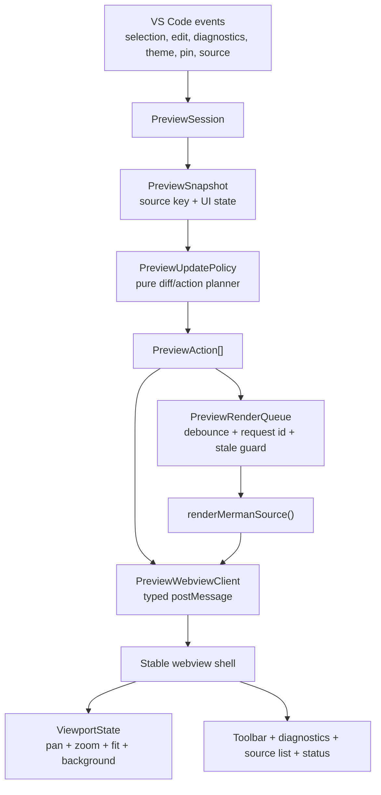
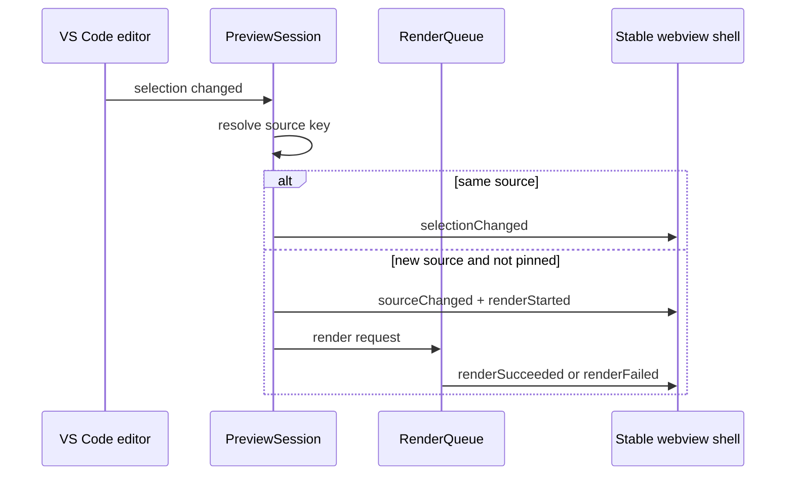

# refactor: VS Code Preview Lifecycle

## Goal Capsule

Refactor the Merman VS Code preview from a full-page HTML refresh loop into a stable, message-driven preview session. Cursor movement, diagnostics updates, source-list changes, theme/background controls, and render output should update independently without destroying the webview DOM or losing pan/zoom state.

The immediate user-visible failures are:

- Moving the editor cursor resets the preview viewport.
- The preview blanks to a "Rendering preview" page on ordinary refreshes.
- Zoom works, but drag state and viewport state are fragile because all state lives in a script instance that is destroyed on every `webview.html` rewrite.
- Zooming a large SVG can look blurry because the whole `.canvas` is scaled as a composited layer instead of resizing the SVG/vector surface.

Authority comes from the current `tools/vscode-extension` implementation, the maintainer-reported preview UX issues, and local reference implementations cloned under `repo-ref/`.

Execution profile: VS Code extension refactor with focused webview UI work, pure decision tests, and a manual extension-host smoke pass.

Stop if the work requires changing Merman render semantics, changing the Headless Render Operation contract, adding cloud or remote-render behavior, replacing the whole VS Code extension product direction, or deleting/reverting unrelated local changes.

---

## Product Contract

### Summary

The preview must behave like a persistent inspection surface, not like a regenerated document. The webview shell should be created once per preview session; after that, the extension should send typed messages for render state, SVG replacement, diagnostics, source selection, editor selection, settings, and errors.

### Problem Frame

Today, `MermanPreviewController` treats every relevant event as `scheduleRefresh()`:

- `onDidChangeActiveTextEditor`
- `onDidChangeTextEditorSelection`
- `workspace.onDidChangeTextDocument`
- `languages.onDidChangeDiagnostics`
- pin/source/theme changes
- panel visibility changes

`refresh()` then rewrites `panel.webview.html` before rendering and rewrites it again after rendering succeeds or fails. That destroys the webview document, the script instance, DOM event handlers, and all client-side viewport state. The current preview is therefore sensitive to non-render events such as cursor movement.

The preview script already contains useful pan/zoom behavior, but its state is process-local JavaScript memory. It is not persisted through `acquireVsCodeApi().getState()/setState()`, not owned by an extension-side session model, and not keyed by source identity.

The current zoom implementation applies `transform: translate(-50%, -50%) scale(var(--preview-zoom))` to `.canvas`. That keeps interaction math simple, but it may force Chromium/Electron to scale a composited layer. The user can still be looking at SVG, but the displayed layer can blur when enlarged. The next implementation should preserve vector sharpness by resizing the SVG or its wrapper dimensions and using transform primarily for panning.

### Requirements

#### Stable Preview Session

- R1. Creating or revealing the preview panel may assign `webview.html`; ordinary preview updates must not rewrite the whole HTML document.
- R2. The webview shell must receive typed messages for content, diagnostics, source list, selection, settings, render status, and errors.
- R3. Cursor movement inside the same resolved preview source must not request a render and must not reset pan/zoom/background/theme UI state.
- R4. Diagnostics changes must update the diagnostics area only unless the active preview source text or render settings changed.
- R5. A render request must keep the previous SVG visible until the new render succeeds or fails, using an overlay/status affordance instead of replacing the preview with a blank "Rendering" page.
- R6. Stale async render results must be ignored by request id and by source identity.

#### Source And Selection Semantics

- R7. The preview source identity must be explicit: document URI, source id, source range, document version, source hash, and render-affecting settings.
- R8. Markdown/MDX source selection must remain fence-aware. Cursor movement may update the candidate source, but it should only rerender when the resolved preview source actually changes and the preview is not pinned.
- R9. When the preview is pinned, editor cursor movement must not change the rendered source.
- R10. Source-list updates must preserve the currently rendered source where possible and update the toolbar independently from SVG rendering.

#### Viewport And Webview State

- R11. Pan, zoom, background, selected source control state, and diagram theme control state must survive incremental updates and webview reloads where VS Code allows it.
- R12. Zoom must keep SVG output visually sharp at high zoom. Avoid whole-canvas composited scaling for the rendered SVG as the long-term default.
- R13. Dragging must be reliable after SVG replacement, diagnostics updates, source-list updates, and panel visibility changes.
- R14. Fit/reset behavior must be deterministic and must not change the layout in response to ordinary toolbar label updates.

#### Security And Maintainability

- R15. Keep the webview CSP strict: no remote scripts, no inline event handlers, narrow `localResourceRoots`, and validated extension/webview messages.
- R16. Keep render semantics source-backed through `renderMermanSource()` and the existing local renderer path. The preview controller must not become a second Mermaid renderer.
- R17. Extract pure event-policy and state-model code so tests can catch regressions without requiring the VS Code API runtime.
- R18. New abstractions must be deeper than the current controller: hide event classification, snapshot comparison, render request lifecycle, and message transport behind small interfaces.

### Scope Boundaries

In scope:

- `tools/vscode-extension/src/preview.ts`
- `tools/vscode-extension/src/preview-html.ts`
- `tools/vscode-extension/media/preview.js`
- `tools/vscode-extension/media/preview.css`
- new preview model/session/message modules under `tools/vscode-extension/src/`
- focused extension/webview tests
- preview README or developer notes if they clarify user-visible behavior

Deferred:

- Replacing the renderer pipeline or changing Mermaid output semantics
- Full visual drag-and-drop editing
- PNG/PDF export changes unless required by preview message boundaries
- Publishing/package release work beyond ensuring tests and build stay green
- Taking over VS Code built-in Markdown preview

Outside this plan:

- Telemetry, cloud render, accounts, remote AI, or hosted preview services
- Broad UI redesign unrelated to preview lifecycle stability
- Unrelated Rust parser/layout/render parity work

### Acceptance Examples

- AE1. Open a Mermaid preview, pan and zoom the diagram, move the editor cursor within the same diagram or Markdown fence, and observe no viewport reset and no render request.
- AE2. Open a Markdown file with multiple Mermaid fences. Moving the cursor within the current fence preserves the viewport. Moving to another fence changes the preview only when the source is not pinned and the resolved source id changes.
- AE3. While an edit triggers a rerender, the previous SVG remains visible with a rendering status overlay. If rendering fails, the old preview remains inspectable and the error is shown without destroying controls.
- AE4. Diagnostics arriving after render do not replace the SVG or reset pan/zoom. The diagnostics panel updates independently.
- AE5. Theme changes rerender the current source but preserve viewport intent unless the user explicitly chooses fit or reset.
- AE6. Large SVGs remain crisp when zoomed in. The user is inspecting vector output, not a scaled bitmap-like composited snapshot.
- AE7. Running the extension test suite catches a regression where `onDidChangeTextEditorSelection` schedules a full HTML refresh.

---

## Planning Contract

### Current Defects

- D1. Event intent is collapsed into one method. Selection, diagnostics, text edits, source switches, and settings changes all call `scheduleRefresh()` and then `refresh()`.
- D2. `panel.webview.html` is used as the update transport. This destroys the document and script state on every preview update.
- D3. Selection changes are treated as render-affecting changes even when the resolved preview source is unchanged.
- D4. Diagnostics updates are coupled to SVG rendering. The diagnostics panel cannot update without rebuilding the whole preview document.
- D5. Render lifecycle blanks the viewport. The current implementation writes a "Rendering preview" HTML page before `renderSvg()` finishes.
- D6. Webview state has no durable owner. Pan/zoom/background state exists only in `media/preview.js` memory.
- D7. Zoom is implemented as whole-canvas CSS scale. The source remains SVG, but the displayed layer can blur after compositor scaling.
- D8. Source identity is implicit. The controller compares active editor and pinned source ad hoc instead of using a snapshot key.
- D9. Stale render protection uses a numeric `renderVersion` only. It does not carry source id, source hash, document version, or settings identity into the webview message.
- D10. Tests mostly assert generated HTML/media strings. There is no pure event-policy test proving that cursor movement does not rerender or rewrite HTML.

### Reference Findings

- `repo-ref/vscode-mermaid-preview/src/panels/previewPanel.ts` creates HTML once when `webview.html` is empty, then sends render data through `webview.postMessage({ type: "update", ... })`.
- `repo-ref/vscode-mermaid-preview/webview/src/App.svelte` preserves panzoom scale and pan before replacing SVG content, then reapplies them after rendering.
- `repo-ref/vscode-markdown-preview-enhanced/src/preview-provider.ts` keeps previews alive with `retainContextWhenHidden`, registers message handlers once, and exposes `postMessageToPreview()`.
- `repo-ref/vscode-markdown-preview-enhanced/src/extension-common.ts` handles editor selection by posting `changeTextEditorSelection` with line and ratio instead of regenerating HTML.
- `repo-ref/vscode-markdown-reference/extensions/markdown-language-features/src/preview/preview.ts` uses `postMessage({ type: "onDidChangeTextEditorSelection", ... })` for selection and can update preview content by message when a full reload is unnecessary.
- `repo-ref/vscode-markdown-reference/extensions/markdown-language-features/preview-src/index.ts` uses `vscode.getState()` and `vscode.setState()` to preserve preview state such as scroll progress.
- `repo-ref/vscode-markdown-mermaid/src/shared-mermaid/diagramManager.ts` stores pan/zoom state by diagram id and restores it when the diagram wrapper is recreated.
- `repo-ref/vscode-vega-viewer/src/vega.preview.ts` configures webview HTML separately from data refresh and sends spec refreshes through `webview.postMessage({ command: "refresh", ... })`.

### Key Technical Decisions

- KTD1. Introduce a stable preview shell. `renderPreviewHtml()` should render app chrome/placeholders once, not embed the current SVG as the primary update mechanism.
- KTD2. Model preview changes as events that produce actions. For example, selection changes can produce `selectionChanged`, `sourceCandidateChanged`, or no-op; document changes can produce `renderRequested` only when the active source hash changes.
- KTD3. Use a `PreviewSnapshot` as the comparison unit: URI, document version, source id, source hash, source range, diagnostic range, title/subtitle, pin state, source list, diagram theme, and background.
- KTD4. Use request ids and source keys on every async render. Extension and webview should both ignore stale render results.
- KTD5. Keep old SVG visible during render. Loading and error UI are overlays or side panels, not a replacement HTML document.
- KTD6. Persist viewport state in the webview using `acquireVsCodeApi().getState()/setState()` and keep a matching in-memory model keyed by source id. Persist only non-sensitive UI state.
- KTD7. Prefer a small custom viewport module first. The current product already ships dependency-light webview media, and a custom module can avoid bundling changes. Re-evaluate `@panzoom/panzoom` only if custom pointer/resize behavior remains fragile after tests.
- KTD8. Replace whole-canvas scaling with vector-aware zoom. Set SVG/wrapper dimensions from `viewBox` and zoom, keep pan as translation, and use CSS transforms only where they do not blur the rendered vector surface.

### High-Level Technical Design



The extension owns source resolution and rendering. The webview owns local interaction state and DOM updates. The shared contract is a typed message protocol.



### Proposed Module Shape

- `preview.ts`: VS Code registration and controller wiring only. It should not directly encode all update policy.
- `preview-session.ts`: owns active panel/session state, pinned source, last editor URI, current snapshot, and render-affecting settings.
- `preview-policy.ts`: pure functions that map previous snapshot plus event to actions.
- `preview-messages.ts`: typed extension-to-webview and webview-to-extension message schema with validators.
- `preview-render.ts`: async render queue, debounce, request id, stale result checks, and error normalization.
- `preview-html.ts`: stable shell generation and static template only.
- `media/preview.js`: message dispatcher, DOM patching, viewport persistence, SVG replacement, diagnostics/source-list rendering.
- `media/preview.css`: stable app layout, overlay status, vector-aware viewport styling.

### Message Contract Sketch

Extension to webview:

- `init`: initial snapshot, resources, source list, settings, diagnostics, and any current SVG.
- `sourceListUpdated`: source choices and selected source id.
- `selectionChanged`: editor line/range and source id.
- `renderStarted`: request id, source key, title/subtitle, and status text.
- `renderSucceeded`: request id, source key, SVG string, diagnostics summary, and source metadata.
- `renderFailed`: request id, source key, normalized error, and diagnostics if available.
- `diagnosticsUpdated`: diagnostics for the current source range.
- `settingsUpdated`: diagram theme/background/default fit options.
- `pinStateUpdated`: pin state and selected source id.

Webview to extension:

- `ready`: webview shell loaded and can receive state.
- `copySvg`: copy current SVG.
- `revealDiagnostic`: reveal source diagnostic range.
- `showDiagnosticFixes`: request quick fixes for a range.
- `togglePin`: toggle current source pin.
- `selectSource`: user selected a source id.
- `setDiagramTheme`: render-affecting theme change.
- `setBackground`: non-rendering UI change if the extension chooses to persist it.
- `viewportChanged`: optional extension-side viewport persistence if needed after `getState()` proves insufficient.

### Risks And Mitigations

- Risk: message-driven DOM patching grows into a mini framework. Mitigation: keep the shell small and use explicit render functions for toolbar, diagnostics, status, and SVG region.
- Risk: source switching policy is product-sensitive. Mitigation: default to current behavior only when source id changes and preview is not pinned; make pin semantics explicit and tested.
- Risk: vector-aware zoom can regress fit/pan math. Mitigation: isolate viewport math in testable functions and manually test large `viewBox` diagrams.
- Risk: stale renders can still win during rapid edits. Mitigation: include request id and source key in render start/success/failure messages, and check both before DOM replacement.
- Risk: `getState()/setState()` persistence can save stale state across unrelated resources. Mitigation: store `resource` and `sourceId` with viewport state and invalidate when they do not match.
- Risk: CSP blocks dynamically inserted SVG behavior or styles. Mitigation: keep SVG insertion local, avoid script execution from SVG, and test copy/render with the existing CSP.

---

## Implementation Units

### U1. Extract preview snapshot and event policy

- Goal: Make render decisions explicit and testable before changing the webview transport.
- Requirements: R3, R4, R7, R8, R9, R10, R17, R18
- Files: `tools/vscode-extension/src/preview.ts`, new `tools/vscode-extension/src/preview-session.ts`, new `tools/vscode-extension/src/preview-policy.ts`, new tests under `tools/vscode-extension/src/test/`
- Approach: Define `PreviewSnapshot`, `PreviewSourceKey`, `PreviewEvent`, and `PreviewAction`. Move source resolution and pin behavior behind `PreviewSession`. Add pure tests for selection, diagnostics, document edits, source selection, pin toggle, theme change, and panel visibility.
- Test scenarios: cursor move in same source returns no render action; cursor entering another fence while unpinned requests a source switch render; cursor movement while pinned is ignored for source selection; diagnostics update returns diagnostics-only action; current source text hash change requests render; edit outside pinned source does not render.
- Verification: `cd tools/vscode-extension && npm test`.

### U2. Introduce typed webview messages and stable shell

- Goal: Stop using full HTML replacement as the update transport.
- Requirements: R1, R2, R5, R6, R15
- Dependencies: U1
- Files: `tools/vscode-extension/src/preview.ts`, `tools/vscode-extension/src/preview-html.ts`, new `tools/vscode-extension/src/preview-messages.ts`, `tools/vscode-extension/media/preview.js`
- Approach: Change `renderPreviewHtml()` into a stable app shell with empty regions for toolbar, diagnostics, status, and viewport. Set `panel.webview.html` only when creating or recovering a panel. Add a `PreviewWebviewClient` wrapper for validated `postMessage` calls. Handle `ready` by sending an `init` message.
- Test scenarios: opening preview assigns HTML once; a same-source selection change posts `selectionChanged` only; render success posts `renderSucceeded`; diagnostics update posts `diagnosticsUpdated`; invalid webview messages are ignored.
- Verification: `cd tools/vscode-extension && npm test`; manual extension host open/reveal preview smoke.

### U3. Split render queue from UI updates

- Goal: Keep render lifecycle asynchronous and stale-safe without blanking the preview.
- Requirements: R5, R6, R16
- Dependencies: U1, U2
- Files: `tools/vscode-extension/src/preview.ts`, new `tools/vscode-extension/src/preview-render.ts`, `tools/vscode-extension/media/preview.js`, `tools/vscode-extension/media/preview.css`
- Approach: Move debounce, request id, source key, render start/success/failure, and error normalization into a render queue. On render start, send an overlay status while preserving the current SVG. On success, replace only the SVG region if request id and source key match. On failure, keep the previous SVG and show an error panel/overlay.
- Test scenarios: rapid edits ignore older render completions; render failure preserves old SVG state; theme change triggers render with current source key; document change outside active source updates source list/diagnostics without rendering.
- Verification: `cd tools/vscode-extension && npm test`; manual rapid-edit smoke.

### U4. Rebuild viewport state and vector-aware zoom

- Goal: Make pan/zoom reliable and reduce high-zoom SVG blur.
- Requirements: R11, R12, R13, R14
- Dependencies: U2
- Files: `tools/vscode-extension/media/preview.js`, `tools/vscode-extension/media/preview.css`, possible new `tools/vscode-extension/src/test/preview-viewport.test.ts`
- Approach: Extract viewport state in the webview script. Persist state with `getState()/setState()` keyed by resource/source id. Replace whole-canvas `scale()` with SVG or wrapper dimension changes derived from `viewBox`; keep pan as translation. Preserve anchor-point zoom math. Restore viewport after SVG replacement and after webview reload. Keep fit/reset explicit.
- Test scenarios: pan survives diagnostics update; zoom survives SVG replacement for the same source; state invalidates on a different source when appropriate; fit recomputes after resize; large SVG remains visually sharp in manual inspection.
- Verification: `cd tools/vscode-extension && npm test`; manual extension host pan/zoom/drag smoke on small and large SVGs.

### U5. Incremental diagnostics, source list, and toolbar updates

- Goal: Decouple non-rendering UI updates from SVG rendering.
- Requirements: R2, R4, R8, R9, R10, R15
- Dependencies: U2
- Files: `tools/vscode-extension/src/preview.ts`, `tools/vscode-extension/src/preview-html.ts`, `tools/vscode-extension/media/preview.js`, `tools/vscode-extension/media/preview.css`
- Approach: Move diagnostics/source-list/toolbar rendering into webview-side patch functions or message payload renderers. Extension computes validated data; webview patches DOM. Toolbar changes should not affect viewport layout more than necessary. Diagnostic reveal and quick-fix messages continue to validate payloads extension-side.
- Test scenarios: diagnostics list updates without replacing SVG; source picker updates without resetting viewport; pin button state updates independently; theme selector state reflects extension state; background selection is persisted and does not render.
- Verification: `cd tools/vscode-extension && npm test`; manual diagnostics and multiple-fence smoke.

### U6. Add regression harness and extension-host smoke checklist

- Goal: Prevent the specific UX regressions that triggered this refactor.
- Requirements: R3, R4, R5, R6, R11, R17
- Dependencies: U1 through U5
- Files: `tools/vscode-extension/src/test/preview.test.ts`, new targeted tests as needed, `tools/vscode-extension/README.md` or `docs/`
- Approach: Replace fragile string-only tests with policy tests and a small webview script contract test. Keep tests local and deterministic. Document the manual extension-host checklist for interactions that are hard to assert in Node.
- Test scenarios: same-source cursor move cannot call full refresh; diagnostics cannot call render; render start does not clear SVG; stale render success is ignored; viewport state is serialized and restored; message validators reject malformed payloads.
- Verification: `cd tools/vscode-extension && npm test`; `cd tools/vscode-extension && npm run package`.

### U7. Final polish and documentation

- Goal: Make the new preview behavior understandable for future maintainers.
- Requirements: R15, R16, R18
- Dependencies: U1 through U6
- Files: `tools/vscode-extension/README.md`, optional `docs/knowledge/engineering/` note, tests
- Approach: Document preview lifecycle ownership: extension owns source/rendering; webview owns interaction state; messages are the contract. Add a short troubleshooting note for SVG sharpness and the difference between SVG source output and compositor scaling.
- Test scenarios: README describes current behavior; package still includes media assets; manual checklist passes on macOS at minimum.
- Verification: `cd tools/vscode-extension && npm run check`; `cd tools/vscode-extension && npm run package`.

---

## Verification Contract

Automated:

```bash
cd tools/vscode-extension
npm test
npm run check
npm run package
```

Manual VS Code extension-host smoke:

- Open a `.mmd` file, open preview, pan, zoom, drag, fit, and reset.
- Move the cursor within the same diagram; verify no viewport reset and no visible blank/render page.
- Edit the active diagram; verify the old SVG remains visible while a render status appears.
- Introduce a syntax error; verify the old SVG remains visible and the error appears without destroying controls.
- Fix the syntax error; verify the new SVG replaces only the diagram region.
- Open Markdown with at least two Mermaid fences; verify source selection, pinning, and cursor movement behavior.
- Trigger diagnostics changes; verify diagnostics update without resetting pan/zoom.
- Switch diagram theme; verify render occurs and viewport intent is preserved.
- Zoom a large SVG beyond 200 percent; verify text and edges remain crisp enough for inspection.
- Hide and reveal the preview; verify state survives with `retainContextWhenHidden` and webview state restoration.

Evidence to collect before merge:

- Test command output summary.
- VSIX package content check if `npm run package` builds an artifact.
- Short before/after note explaining that `panel.webview.html` is no longer the ordinary update transport.

---

## Definition Of Done

- Cursor movement inside the same preview source no longer resets the preview or requests a render.
- Full `webview.html` replacement happens only on panel creation/recovery or explicit hard reload.
- Render start/success/failure are message-driven and stale-safe.
- Diagnostics and source-list updates are incremental.
- Pan/zoom/background state persists through normal preview updates.
- High-zoom SVG inspection is not limited by whole-canvas bitmap-like compositor scaling.
- Tests cover event policy, stale renders, diagnostics-only updates, message validation, and viewport state persistence.
- The final implementation passes `npm test`, `npm run check`, and `npm run package` for `tools/vscode-extension`.
