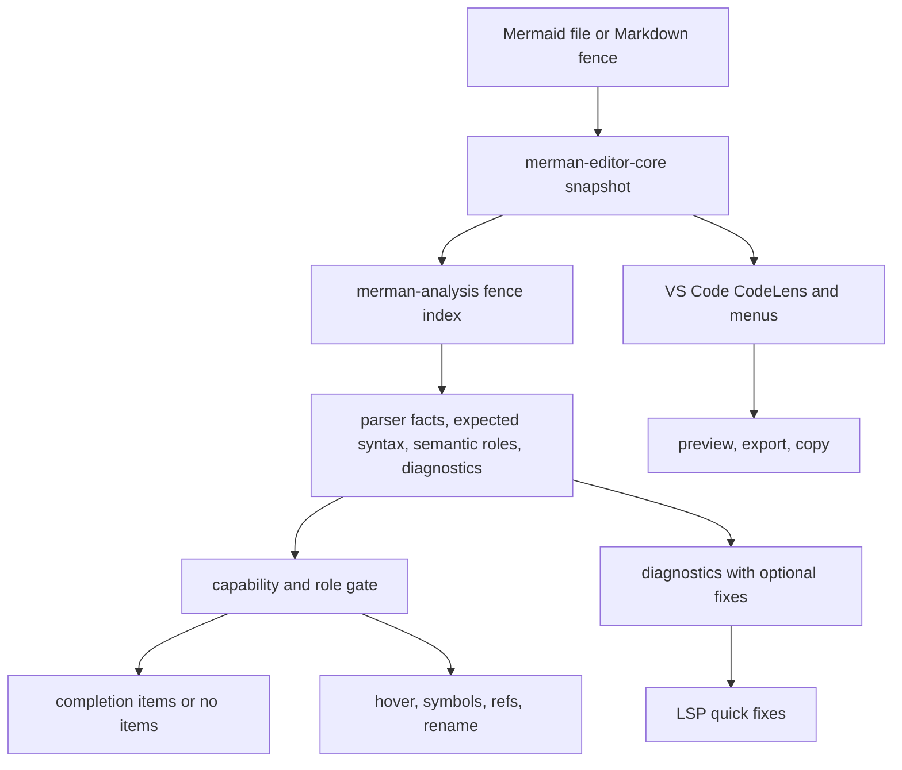
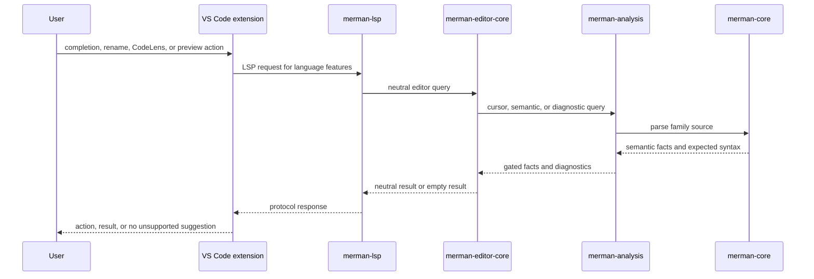

# Robust Parser-Backed Editor Experience - Plan

## Goal Capsule

This plan hardens Merman's Mermaid editing experience around deterministic, parser-backed language intelligence. The goal is to remove or demote authoring behavior that is only guessed from text prefixes, while keeping common user actions discoverable in VS Code and preserving the preview/export work that already landed.

Authority comes from the maintainer direction in this session: avoid AI and marketing-shaped features, avoid heuristic behavior, support only what Merman can prove through `merman-core`, `merman-analysis`, `merman-editor-core`, and `merman-lsp`, and delete unnecessary code during the refactor. This plan also builds on `docs/plans/2026-06-24-003-refactor-mature-mermaid-lsp-roadmap-plan.md`, `docs/plans/2026-06-28-001-refactor-editor-core-language-intelligence-plan.md`, `docs/plans/2026-06-29-002-feat-vscode-semantic-authoring-experience-plan.md`, and `docs/plans/2026-06-30-001-refactor-vscode-preview-lifecycle-plan.md`.

Execution profile: deep internal/editor UX refactor. Breaking internal APIs, removing dead helper paths, and narrowing user-visible completions are expected when tests prove the new behavior is parser/analyze backed.

Stop if implementation discovers that a desired editor behavior needs remote AI, a cloud account, a new Mermaid shorthand dialect, a visual diagram editor, or broad parser-family semantics that current parser facts cannot provide. Those are product or parser-roadmap decisions, not implementation details for this plan.

---

## Product Contract

### Summary

Merman should feel useful while editing Mermaid, but only because the language tooling is grounded in the same semantic facts used by diagnostics, navigation, rename, and rendering workflows. Unsupported contexts should quietly produce no completion, no rename, or no quick fix rather than guessing.

### Problem Frame

The repository now has the right architecture for this work: `merman-editor-core` owns protocol-neutral editor behavior, `merman-lsp` adapts it to LSP, and the VS Code extension owns local preview/export and user entry points. The remaining risk is product drift. Some completion and authoring helpers still combine parser expected syntax with line-prefix logic, directive-prefix parsing, and broad fallback suggestions. That can make the editor feel noisy or misleading, especially when the user is merely moving the cursor or editing payload text.

Open-source reference extensions show common user needs: CodeLens or menu actions above Mermaid fences, preview/export/copy actions that are visible, stable live preview, and clear syntax errors. They also show what Merman should avoid: webview-side syntax-error scraping, login/cloud/AI flows, and broad static snippet catalogs that compete with semantic completions.

### Requirements

#### Deterministic Language Intelligence

- R1. Editor-visible language intelligence must be backed by parser facts, analysis diagnostics, editor-core semantic indexes, or explicit capability metadata.
- R2. Contexts without strong parser/analyze support must degrade to no suggestion, no action, no rename, or a documented unsupported state instead of using broad text-prefix guesses.
- R3. Completion must be capability-gated by context: diagram headers and templates at legal starts, expected syntax for direction, shape, operator, node identifier, class name, directive target, config keys, and known semantic targets only where facts prove the slot.
- R4. Completion must never project payload-only semantic facts as node identifiers, outline entries, navigation targets, or rename targets.
- R5. Diagnostics and quick fixes must be sourced from `merman-analysis` diagnostics and `DiagnosticFix` metadata. Diagnostics without explicit safe fixes must not create quick actions.
- R6. Hover, definition, references, prepare-rename, and rename must use typed entity/reference groups and role gates. Payload hover is allowed only as parser-labeled explanatory metadata, not as navigation or rename authority.

#### VS Code Authoring UX

- R7. Common source actions must be discoverable from editor menus and Mermaid-fence CodeLens: preview, export SVG, export PNG, copy SVG, and copy PNG only when the platform path is reliable.
- R8. CodeLens must be source-scoped and low-noise. It must not add a separate pin action when source selection already belongs to preview state, and it must not surface AI, account, or cloud actions.
- R9. Markdown and MDX Mermaid fences must use stable source identities and source ranges so preview, export, diagnostics, and CodeLens target the intended fence.
- R10. Cursor-only movement must not reset preview zoom, pan, theme, background, or source selection. Preview refresh must be driven by source identity, content, diagnostics, and render options.
- R11. Preview and editor surfaces must expose the same quick fixes for the same diagnostics. The preview must not maintain a separate syntax-error parser.
- R12. Mermaid files and Markdown fences must remain local-first. No authoring feature in this plan may require network access, login, telemetry, or remote rendering.

#### Cleanup, Documentation, And Quality

- R13. `docs/lsp/CAPABILITIES.md` must describe the real feature gates after the refactor, including unsupported contexts and intentionally sparse entity families.
- R14. Dead, duplicate, or superseded helper code must be removed once its behavior is replaced by parser/analyze-backed logic and tests.
- R15. Tests must cover supported and unsupported contexts. A missing suggestion in an unsupported context is a positive result, not a failure.
- R16. VS Code extension tests must cover CodeLens/action routing, source identity, preview update policy, and export/copy command visibility.
- R17. The plan must not add AI repair, generated syntax advice, or marketing copy as a substitute for deterministic language features.

### Scope Boundaries

In scope:

- deterministic completion gating in `merman-analysis` and `merman-editor-core`;
- quick fix projection and preview quick-fix parity through existing diagnostic metadata;
- safe navigation, hover, references, and rename gates;
- Mermaid-file and Markdown-fence CodeLens/actions for preview/export/copy;
- preview update-policy tests that protect user viewport state;
- deletion of obsolete heuristic or duplicate code paths;
- capability documentation for supported and unsupported contexts.

Deferred to follow-up work:

- adding brand-new parser facts for every missing Mermaid subgrammar beyond the contexts already needed by this plan;
- full formatter support beyond existing safe diagnostic fixes;
- workspace-wide cross-file Mermaid symbol resolution;
- browser playground parity for every VS Code authoring affordance;
- publishing or Marketplace account work.

Outside this plan:

- remote AI repair, generation, chat, or naming assistance;
- cloud sync, login, team sharing, or hosted diagrams;
- visual drag-and-drop diagram editing;
- Mermaid JS runtime fallback for language intelligence;
- replacing the local-first preview/export pipeline with webview-side Mermaid parsing.

### Acceptance Examples

- AE1. In a flowchart payload string or unsupported directive slot, completion returns no semantic node/class/template noise rather than generic diagram headers.
- AE2. In a parser-backed node-id slot, completion suggests known identifiers from the current fence and uses the expected-syntax span for the edit range.
- AE3. In a Markdown document with two Mermaid fences, CodeLens actions above each fence preview/export/copy the matching fence and do not switch when the cursor moves elsewhere.
- AE4. A diagnostic with a `DiagnosticFix` appears as a VS Code quick fix and as the same preview diagnostic action; a diagnostic without fix metadata creates no quick action.
- AE5. Rename works for entity roles such as node ids, participants, tasks, or class ids where reference groups exist, and refuses payload-only text with a normal no-rename response.
- AE6. Moving the cursor, changing selection, or focusing another editor does not reset preview zoom/pan/background unless the selected preview source changes.

---

## Planning Contract

### Assumptions

- The maintainer wants this plan written now without another scoping confirmation pass; unresolved bets are called out here instead of blocking plan creation.
- The scratch research notes under `targets/mermaid_editor_experience_research/` are non-canonical planning inputs and do not need to be committed.
- The current LSP capability matrix is treated as a claim to verify, not as proof that every exposed completion branch is already strict enough.
- VS Code CodeLens should help users reach common source actions, but preview-panel controls remain the right place for viewport state such as pinning or preserving source selection.

### Key Technical Decisions

- KTD1. Parser/analyze facts are the only authority for semantic authoring. Text-prefix checks may help compute an edit range inside a proven context, but they must not decide that a semantic feature is available.
- KTD2. Unsupported contexts should be silent. The editor should not fill the gap with generic diagram headers, broad templates, or node completions when it cannot prove the user is in a legal slot.
- KTD3. Keep source actions in VS Code, keep language semantics in Rust. The extension may register CodeLens, menus, preview, export, copy, and progress UI, but it must not become a second Mermaid parser.
- KTD4. Code actions remain diagnostics-first. A quick fix is available only when `merman-analysis` produced fix metadata that survives editor-core and LSP projection.
- KTD5. Navigation and rename stay entity-only. Payload facts can improve diagnostics, hover, and semantic tokens, but they do not become navigation targets unless a future parser role explicitly allows it.
- KTD6. Low-noise UX beats feature count. CodeLens and menus should expose high-frequency local actions, while advanced inspection controls stay compact in the preview surface.
- KTD7. Deletion is part of the refactor. Once parser/analyze-backed paths cover a behavior, duplicate prefix parsers, fallback branches, and webview-side diagnostic parsing should be removed instead of retained as hidden alternates.

### High-Level Technical Design

### System-Wide Impact

- `crates/merman-analysis/src/editor.rs` becomes stricter about which completion kinds are parser-backed versus prefix-derived.
- `crates/merman-editor-core/src/context.rs` and `completion.rs` should shrink or move from availability decisions to edit-range construction and item projection.
- `crates/merman-editor-core/src/structure.rs` remains the role gate for navigation and rename and may gain capability metadata where tests expose ambiguity.
- `crates/merman-lsp/src/code_actions.rs` stays thin over diagnostic data and should not gain rule-specific logic.
- `tools/vscode-extension` gains source-scoped CodeLens and tests, while preview/export remain local actions over `preview-source.ts`.
- `docs/lsp/CAPABILITIES.md` must remain conservative when a family has parser facts but only sparse entity-bearing spans.

### Risks And Mitigations

- Risk: stricter completion may look like a regression to users who liked broad suggestions. Mitigation: document supported contexts and keep static Mermaid snippets available only where they are clearly template-oriented.
- Risk: capability metadata may duplicate the existing capability matrix. Mitigation: make runtime gates minimal and use docs/tests for product claims; do not build a second policy language unless implementation proves it necessary.
- Risk: Markdown fence CodeLens can become visual clutter. Mitigation: expose only high-frequency local actions and make actions source-scoped; avoid pin, AI, account, and remote commands.
- Risk: some family parser facts may be too sparse for desired completions. Mitigation: no heuristic fallback; add parser facts in a future parser-family unit or leave the context unsupported.
- Risk: preview update-policy changes can accidentally break recently fixed export and diagnostics behavior. Mitigation: add regression tests before deleting or narrowing preview/session paths.

### Sources And Research

- `crates/merman-core/src/editor.rs`
- `crates/merman-analysis/src/editor.rs`
- `crates/merman-analysis/src/analyzer.rs`
- `crates/merman-analysis/src/markdown.rs`
- `crates/merman-editor-core/src/completion.rs`
- `crates/merman-editor-core/src/context.rs`
- `crates/merman-editor-core/src/diagnostics.rs`
- `crates/merman-editor-core/src/structure.rs`
- `crates/merman-lsp/src/code_actions.rs`
- `crates/merman-lsp/src/server.rs`
- `tools/vscode-extension/src/extension.ts`
- `tools/vscode-extension/src/preview-source.ts`
- `tools/vscode-extension/src/preview-policy.ts`
- `tools/vscode-extension/package.json`
- `docs/lsp/CAPABILITIES.md`
- `repo-ref/vscode-mermaid-preview/src/mermaidChartCodeLensProvider.ts`
- `repo-ref/vscode-mermaid-preview/src/panels/previewPanel.ts`
- `repo-ref/vscode-mermaid-preview/src/constants/condSnippets.ts`
- `repo-ref/vscode-markdown-preview-enhanced/src/preview-provider.ts`
- Dendron preview flicker issue: https://github.com/dendronhq/dendron/issues/1832
- Dendron Mermaid version issue: https://github.com/dendronhq/dendron/issues/3802
- Dendron mindmap render issue: https://github.com/dendronhq/dendron/issues/3922
- Mermaid Chart VS Code extension issue on config syntax: https://github.com/Mermaid-Chart/vscode-mermaid-preview/issues/169

---

## Implementation Units

### U1. Define the deterministic editor capability contract

- **Goal:** Make every editor feature know whether it is backed by parser/analyze facts before it returns user-visible behavior.
- **Requirements:** R1, R2, R4, R6, R13, R15
- **Dependencies:** None
- **Files:** `crates/merman-core/src/editor.rs`, `crates/merman-analysis/src/editor.rs`, `crates/merman-editor-core/src/types.rs`, `crates/merman-editor-core/src/context.rs`, `docs/lsp/CAPABILITIES.md`
- **Approach:** Introduce or consolidate a small capability/provenance model for editor queries: supported completion kinds, semantic roles, reference-group availability, and payload-only exclusions. Prefer adding fields or helper methods to existing editor facts and fence indexes over inventing a parallel registry. The contract should answer "can this feature be shown here?" before item projection begins.
- **Patterns to follow:** `EditorSemanticRole::contributes_completion`, `EditorSemanticRole::contributes_references`, `FenceTextIndex::from_core_facts`, and the conservative wording in `docs/lsp/CAPABILITIES.md`.
- **Test scenarios:** A parser-backed entity role is marked eligible for completion/references; a payload role is retained for diagnostics/tokens but marked ineligible for completion/navigation; a family with no entity-bearing spans can still be first-class for diagnostics and hover; unsupported contexts report no capability instead of a fallback kind.
- **Verification:** Capability tests prove both positive and negative gates, and `docs/lsp/CAPABILITIES.md` describes the same gates without overstating family coverage.

### U2. Harden completion gating and remove broad fallback suggestions

- **Goal:** Make completion useful only when Merman can prove the cursor context.
- **Requirements:** R1, R2, R3, R4, R14, R15
- **Dependencies:** U1
- **Files:** `crates/merman-analysis/src/editor.rs`, `crates/merman-editor-core/src/context.rs`, `crates/merman-editor-core/src/completion.rs`, `crates/merman-lsp/src/completion.rs`, `docs/lsp/CAPABILITIES.md`
- **Approach:** Split completion into availability and projection. Availability comes from parser expected syntax, semantic roles, and explicit source-position states such as document/fence start. Projection builds labels, snippets, and text edits only after availability is true. Remove the generic "if no items, offer diagram headers" fallback inside existing fences, and narrow directive/config helpers to contexts the analysis layer can identify. Keep static template snippets only as template completions in legal start/template positions.
- **Patterns to follow:** Existing expected-syntax override tests in `crates/merman-analysis/src/editor.rs`, `completion_documentation` in `crates/merman-editor-core/src/completion.rs`, and LSP resolve behavior in `crates/merman-lsp/src/completion.rs`.
- **Test scenarios:** Payload expected syntax returns no items; unknown prose inside a diagram returns no diagram-header fallback; document start and empty Mermaid fence still offer headers/templates; node-id expected syntax returns known identifiers with the expected edit range; shape/direction expected syntax returns only shape/direction items; directive target slots produce node/class completions only when the slot is known; Markdown fence offsets remain correct.
- **Verification:** Rust tests lock the supported and unsupported contexts, and no VS Code-side code parses Mermaid syntax to compensate for missing completions.

### U3. Keep diagnostics and quick fixes single-source

- **Goal:** Ensure Problems panel, LSP quick fixes, and preview diagnostic actions all reflect the same analysis payload.
- **Requirements:** R5, R11, R12, R14, R15
- **Dependencies:** U1
- **Files:** `crates/merman-editor-core/src/diagnostics.rs`, `crates/merman-lsp/src/diagnostics.rs`, `crates/merman-lsp/src/code_actions.rs`, `crates/merman-analysis/src/analyzer.rs`, `crates/merman-analysis/src/rules.rs`, `tools/vscode-extension/src/preview.ts`, `tools/vscode-extension/src/preview-html.ts`, `tools/vscode-extension/src/test/preview-webview.test.ts`
- **Approach:** Keep diagnostic data projection rule-agnostic. Code actions should inspect only `DiagnosticCodeActionData`, build workspace edits from `DiagnosticFix`, and return nothing for diagnostics without fixes. The preview should continue to collect VS Code diagnostics and invoke `vscode.executeCodeActionProvider`; any remaining webview-side syntax-error parsing or duplicate diagnostic-generation path should be removed.
- **Patterns to follow:** `diagnostic_code_action_data`, `code_actions_for_params`, and `collectPreviewDiagnostics`.
- **Test scenarios:** A diagnostic with one preferred fix yields one preferred quick fix; a diagnostic without fix metadata yields no action; a non-Merman diagnostic is ignored by the Merman quick-fix provider; preview diagnostic action selection invokes the same VS Code code actions; duplicate diagnostics with the same range/code/message are deduplicated.
- **Verification:** LSP code-action tests and VS Code preview tests prove one diagnostic source and one fix source.

### U4. Add low-noise Mermaid source CodeLens and action routing

- **Goal:** Make preview/export/copy discoverable at the source without adding preview-panel noise or cloud-oriented controls.
- **Requirements:** R7, R8, R9, R12, R16
- **Dependencies:** U3 for quick-fix parity only; source actions can start after current preview/export APIs are stable.
- **Files:** `tools/vscode-extension/package.json`, `tools/vscode-extension/src/extension.ts`, new `tools/vscode-extension/src/codelens.ts`, `tools/vscode-extension/src/preview-source.ts`, `tools/vscode-extension/src/export.ts`, `tools/vscode-extension/src/test/preview-source.test.ts`, new `tools/vscode-extension/src/test/codelens.test.ts`
- **Approach:** Register a CodeLens provider for Mermaid documents and Markdown/MDX Mermaid fences. For Mermaid files, show source actions at the document start. For Markdown fences, show actions on the fence opener range and pass the stable `sourceId` into existing preview/export/copy commands. Keep the action set local and basic: Preview, Export SVG, Export PNG, Copy SVG, and Copy PNG only when implemented reliably. Do not add Pin, AI, account, sync, or remote edit actions.
- **Patterns to follow:** `listPreviewInputsFromDocument`, existing command registrations in `tools/vscode-extension/package.json`, and the source-action shape in `repo-ref/vscode-mermaid-preview/src/mermaidChartCodeLensProvider.ts` without its login/cloud actions.
- **Test scenarios:** Mermaid files produce one source-action group; Markdown with two fences produces two source-scoped CodeLens groups; the active cursor does not change a CodeLens action target after it is created; no CodeLens appears outside Mermaid files/fences; Copy PNG is hidden or disabled when the platform path is unavailable.
- **Verification:** VS Code extension unit tests cover provider output and command arguments, and manual extension-host smoke confirms the actions appear in the expected locations.

### U5. Tighten hover, symbols, definition, references, and rename gates

- **Goal:** Make navigation and refactor behavior predictable for large diagrams.
- **Requirements:** R1, R2, R4, R6, R13, R15
- **Dependencies:** U1
- **Files:** `crates/merman-editor-core/src/structure.rs`, `crates/merman-analysis/src/editor.rs`, `crates/merman-lsp/src/structure.rs`, `docs/lsp/CAPABILITIES.md`
- **Approach:** Audit every call path from position to semantic item. Entity queries should only use reference-contributing roles and typed reference groups. Hover can show outline or parser-labeled payload detail, but definition/references/rename must reject payload-only and outline-only items unless a role explicitly opts in. Preserve current valid rename behavior for supported families while adding negative tests for same-label but different-kind symbols.
- **Patterns to follow:** Existing `entity_item_at_offset`, `reference_spans_for_item`, `prepare_rename`, and tests that payload semantic items are not navigation targets.
- **Test scenarios:** Rename succeeds for a flowchart node id, a sequence participant, a Gantt task id, and a class id when parser facts expose reference groups; rename refuses payload text, labels, comments, and outline-only sections; same-name symbols with different semantic kinds do not share references; hover still reports useful parser-labeled metadata for supported payload facts.
- **Verification:** Editor-core and LSP structure tests prove both accepted and refused navigation paths.

### U6. Protect preview feedback-loop state while editor actions expand

- **Goal:** Keep preview usable while CodeLens and stricter language features land.
- **Requirements:** R9, R10, R11, R14, R16
- **Dependencies:** U3, U4
- **Files:** `tools/vscode-extension/src/preview-session.ts`, `tools/vscode-extension/src/preview-policy.ts`, `tools/vscode-extension/src/preview.ts`, `tools/vscode-extension/src/preview-webview-client.ts`, `tools/vscode-extension/src/test/preview-policy.test.ts`, `tools/vscode-extension/src/test/preview-session.test.ts`, `tools/vscode-extension/src/test/preview.test.ts`
- **Approach:** Treat preview viewport state as user-owned. Source identity changes, content changes, render-option changes, and diagnostics changes may update the webview; cursor-only movement and selection changes must not reset pan/zoom/background. Re-check recent preview UI controls and remove redundant panel actions when source CodeLens or menus make them unnecessary.
- **Patterns to follow:** Existing `preview-policy.ts` update comparison and `preview-session.ts` state model.
- **Test scenarios:** Cursor movement in the same source does not trigger a viewport reset; editing source content updates rendered content without losing selected theme/background unless the option changes; switching from one Markdown fence source id to another updates the source intentionally; diagnostics refresh does not reset pan/zoom; export/copy still uses the current source identity.
- **Verification:** VS Code extension tests lock the no-reset policy, and manual smoke covers a large diagram with zoom/pan before and after edits.

### U7. Document, verify, and delete superseded paths

- **Goal:** Finish the refactor with an honest capability contract and no hidden alternate implementation.
- **Requirements:** R13, R14, R15, R16, R17
- **Dependencies:** U1, U2, U3, U4, U5, U6
- **Files:** `docs/lsp/CAPABILITIES.md`, `tools/vscode-extension/README.md`, `README.md`, `crates/merman-analysis/src/editor.rs`, `crates/merman-editor-core/src/context.rs`, `crates/merman-editor-core/src/completion.rs`, `tools/vscode-extension/src/preview.ts`, `tools/vscode-extension/src/extension.ts`
- **Approach:** Update docs after behavior is proven, not before. Remove fallback branches, obsolete directive-slot helpers, duplicate preview action wiring, or local diagnostic parsing that tests no longer need. Keep the README user-facing: local parser-backed editing, preview, and export; no AI or cloud claims.
- **Patterns to follow:** Conservative capability wording already present in `docs/lsp/CAPABILITIES.md` and the local-first extension positioning in `tools/vscode-extension/package.json`.
- **Test scenarios:** Documentation examples match actual supported completions; unsupported contexts are documented as unsupported rather than omitted; removed code paths have equivalent or stronger tests; a packaged extension smoke still exposes preview/export/copy commands.
- **Verification:** Final diff contains no retained dead helper path for a behavior now owned by parser/analyze facts, and docs match the tested behavior.

---

## Verification Contract

| Gate | Applies to | Done signal |
| --- | --- | --- |
| `cargo fmt --all --check` | Rust workspace | Formatting is stable. |
| `cargo nextest run -p merman-core -p merman-analysis -p merman-editor-core -p merman-lsp` | Parser, analysis, editor core, and LSP | Supported and unsupported language-intelligence contexts pass. |
| `cd tools/vscode-extension && npm run check` | VS Code extension TypeScript | Type checking and lint-style checks pass. |
| `cd tools/vscode-extension && npm test` | VS Code extension unit tests | CodeLens, preview source, preview policy, export/copy routing, and diagnostics tests pass. |
| `cd tools/vscode-extension && npm run package` | Extension packaging | The VSIX still builds with the action/provider additions. |
| Manual extension-host smoke | User-facing VS Code behavior | `.mmd` and Markdown multi-fence files show correct actions, deterministic completions, safe rename refusal, stable preview viewport, and local export/copy. |

---

## Definition of Done

- U1-U7 are complete or explicitly narrowed in a follow-up plan before implementation stops.
- Completion has no broad fallback suggestions inside known Mermaid fences when the cursor context is unsupported.
- Diagnostics, quick fixes, preview diagnostic actions, and code actions all flow from `merman-analysis` fix metadata.
- CodeLens/source actions expose the basic local operations users expect without adding pin, AI, account, sync, or remote commands.
- Navigation and rename are entity-only and covered by negative tests for payload/outline/comment contexts.
- Preview viewport state survives cursor-only movement and diagnostics-only refresh.
- `docs/lsp/CAPABILITIES.md` and extension documentation describe the actual supported contexts.
- Superseded heuristic, duplicate, or webview-side parsing paths are removed from the final diff.
- All Verification Contract gates pass, or any failure is documented as an explicit blocker rather than ignored.
