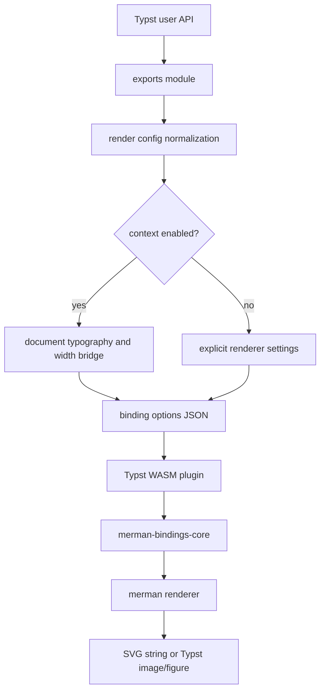
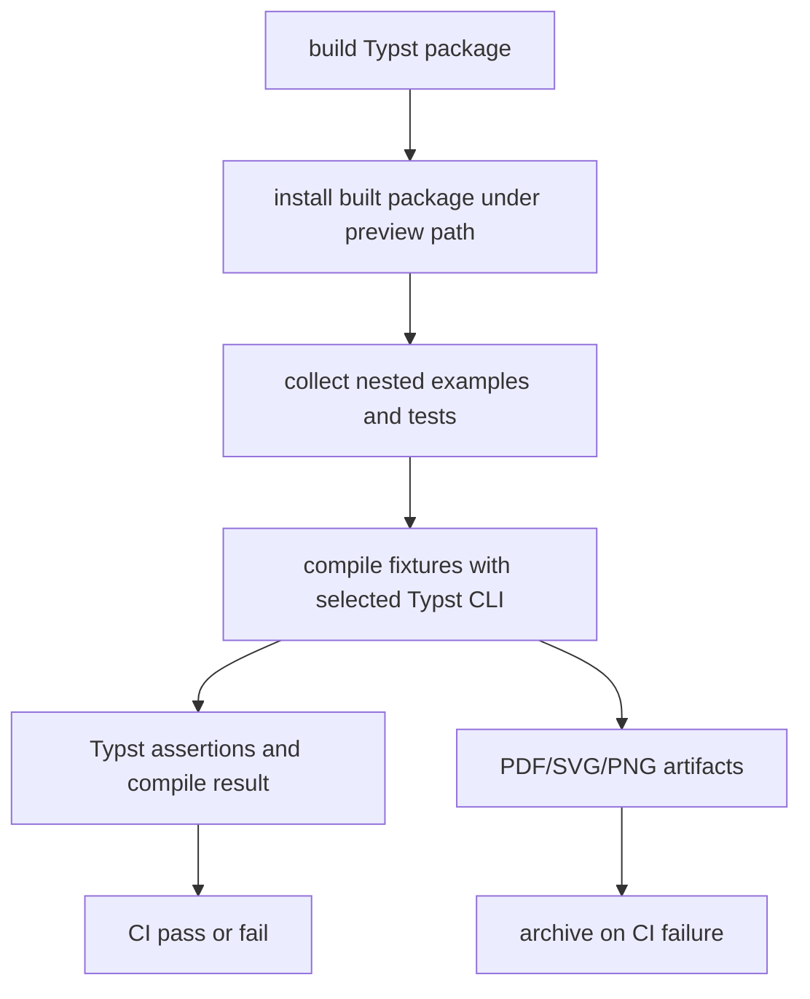

# Typst Package Architecture - Plan

## Goal Capsule

| Field | Value |
|---|---|
| Objective | Refactor the Typst package into a maintainable module architecture with a cleaner breaking API, stronger package-level tests, consolidated CI, and executable docs/examples. |
| Authority | The user's request allows fearless refactoring, breaking Typst package APIs, and deleting obsolete code because the package/ABI surface has not been treated as a stable public release line. |
| Execution profile | Characterization-first refactor: lock the behaviors that should survive, simplify the public surface, then move code and delete compatibility-only wrappers. |
| Stop conditions | Stop if implementation discovers the chosen API shape cannot be represented ergonomically in Typst, if package import of split modules fails under the supported Typst CLI, or if the WASM artifact budget regresses without an explicit decision. |
| Tail ownership | The implementer owns updating tests, examples, README, CI, and any package build logic affected by the refactor. |

---

## Product Contract

### Summary

This plan turns the Typst integration from a growing single-file wrapper into a package-shaped API with fletcher-inspired source organization and regression discipline. The plan keeps merman's identity as a Mermaid-to-SVG WASM bridge, while allowing breaking Typst wrapper changes that remove parallel context entry points and duplicated option plumbing.

### Problem Frame

The current Typst package already exposes useful capabilities: profiles, explicit and context-aware rendering, figures, raw block handlers, structured render results, SVG export, and capability reporting. The implementation has outgrown its shape: `packages/typst/merman/lib.typ` contains plugin loading, API exports, profile normalization, context bridging, image/figure composition, error handling, and raw block helpers in one file, with the same renderer parameter set repeated across most public functions.

The local `repo-ref/typst-fletcher` reference shows a more mature Typst package posture. Fletcher keeps a small entrypoint that imports/re-exports focused modules, organizes tests by feature and issue family, and runs a dedicated Typst test suite in CI with artifacts. Merman should borrow that engineering discipline, not fletcher's native node/edge drawing DSL.

### Requirements

**Public API and behavior**

- R1. The Typst package must keep merman as a Mermaid renderer bridge that returns SVG/image/figure output, not become a Typst-native graph drawing DSL.
- R2. The public Typst API may break to remove compatibility-only wrappers and reduce duplicated argument surfaces.
- R3. The default rendering path must remain explicit-only: document font, text size, and layout width are inherited only through an opt-in context control.
- R4. The low-level binding `options` escape hatch must remain available and must bypass high-level profile/context shorthand behavior.
- R5. Profiles must remain the reusable way to share renderer, typography, layout, SVG, and figure defaults across direct calls, figures, and raw block handlers.
- R6. Structured render results, raw SVG export, validation, figures, raw block handlers, and capability reporting must remain available through the redesigned surface.
- R7. Removed or renamed APIs must be documented as intentional breaking changes with migration examples.

**Package architecture**

- R8. The Typst source must be split into focused modules with `lib.typ` acting as the package entry shim.
- R9. Renderer option normalization, context bridging, error handling, image composition, figure composition, and raw block handling must each have one owning module.
- R10. Duplicate parameter forwarding and redundant context-specific wrappers must be deleted once the new canonical path exists.
- R11. The package build command must copy every required Typst source module into the generated package artifact.

**Tests and CI**

- R12. Typst package behavior must be covered by a nested fixture structure that can grow by API area, issue regression, and visual/artifact family.
- R13. The package smoke harness must support nested fixtures without output filename collisions.
- R14. CI must use one canonical xtask package-smoke path for examples, tests, and preview import coverage instead of duplicating shell compile logic.
- R15. CI must archive package smoke artifacts on failure so layout/image regressions can be inspected.
- R16. Rust plugin tests must keep the Typst WASM export and capability contract honest when wrapper APIs change.

**Docs and examples**

- R17. README and examples must be rewritten around the new API surface, including explicit rendering, context opt-in, profiles, figures, raw blocks, SVG export, error modes, and current typography limits.
- R18. README snippets must correspond to maintained examples or fixtures.
- R19. The version mapping and package publish metadata must be checked by tooling rather than relying on manual edits.

### Scope Boundaries

- This plan does not replace Mermaid parsing, layout, or SVG rendering with native Typst/CeTZ drawing.
- This plan does not promise exact Typst font glyph measurement. Font family and size forwarding remain style intent unless a separately versioned renderer/ABI capability is designed.
- This plan does not require pixel-perfect visual parity with browser Mermaid output; comparisons should focus on package behavior, stable SVG/image embedding, and bounded visual artifacts.
- This plan does not publish the package. Version bump and publish steps are follow-up release work after the refactor lands.

#### Deferred to Follow-Up Work

- Full Typst font asset measurement or shaping support.
- A separate `merman-lite` or multi-package distribution strategy for smaller WASM artifacts.
- Replacing the xtask package test runner with `tytanic` if future evidence shows it handles plugin package paths better than the in-repo runner.

### Acceptance Examples

- AE1. Given a document with `#set text(font: "Arial", size: 13pt)`, when a user renders with the default API path, then the diagram does not inherit Typst document typography unless context is enabled.
- AE2. Given the same document, when a user enables context on the canonical rendering path, then font, text size, and available width are forwarded unless direct renderer settings override them.
- AE3. Given a reusable profile, when a user applies it to an image render, figure render, raw block handler, SVG export, or structured result call, then the same normalized renderer options are used.
- AE4. Given an invalid Mermaid diagram and non-panic error mode, when a user compiles a Typst document, then the document receives a text or placeholder error instead of an unrelated plugin failure.
- AE5. Given a package built by xtask, when CI installs it under a preview package path, then nested tests and examples compile against the built artifact rather than the source tree.
- AE6. Given a removed pre-refactor API such as a context-specific wrapper, when a user reads the README migration notes, then they can map it to the new context control without reading implementation internals.

---

## Planning Contract

### Key Technical Decisions

- KTD1. Use an xtask-owned package test harness instead of making `tytanic` the canonical runner. Fletcher proves the value of grouped Typst fixtures and archived artifacts, but merman's WASM package build and preview package installation are already owned by xtask and CI.
- KTD2. Collapse parallel context entry points into an opt-in context control on canonical APIs. This deletes public duplication such as separate context wrappers while preserving explicit-only default behavior.
- KTD3. Keep `options` as the lowest-level escape hatch. High-level profiles, typography, context, layout, and SVG helpers normalize into binding options only when `options` is absent.
- KTD4. Keep `lib.typ` as the manifest entrypoint and move implementation into `src/*.typ`. This preserves Typst package entrypoint simplicity while allowing fletcher-style internal modules.
- KTD5. Characterize behavior before moving code. The refactor is allowed to break names, but surviving semantics such as precedence, error handling, package import, and capability reporting need tests before the module split.
- KTD6. Treat visual regression as bounded package evidence, not pixel-perfect renderer parity. Package smoke should compile and archive visual artifacts, while stable assertions stay semantic or structural.
- KTD7. Keep the Typst WASM plugin ABI independent from the Typst wrapper API unless exported WASM functions change. Wrapper API breaks do not require a plugin ABI bump by themselves.
- KTD8. Documentation examples are part of the test surface. README snippets should map to maintained examples or readme-example fixtures so future API changes cannot leave stale docs behind.

### High-Level Technical Design





### Output Structure

The exact module names may adjust during implementation, but the package should move toward this shape:

```text
packages/typst/merman/
  lib.typ
  src/
    exports.typ
    plugin.typ
    source.typ
    options.typ
    context.typ
    render.typ
    image.typ
    figure.typ
    raw.typ
    errors.typ
    capabilities.typ
  tests/
    api/
    context/
    errors/
    figure/
    issues/
    raw-blocks/
    readme-examples/
    visual/
  examples/
```

### System-Wide Impact

The Typst package becomes a first-class integration surface rather than a thin wrapper file. Build tooling must package source modules, CI must test the built package rather than source-only imports, and docs must align with a breaking Typst API. Rust renderer behavior should stay stable unless tests expose a binding or capability gap.

### Risks and Dependencies

| Risk | Mitigation |
|---|---|
| Typst split modules may not be copied into package artifacts. | Update xtask package copy logic before switching `lib.typ` to import modules, and add artifact structure tests. |
| Breaking wrapper APIs could leave examples or README stale. | Move examples and README snippets into package-smoke coverage before deleting old names. |
| Context behavior may drift while wrappers are removed. | Add precedence and explicit-only characterization fixtures before API consolidation. |
| Visual tests can become noisy across Typst/font versions. | Use semantic assertions for core behavior and archive visual artifacts; only snapshot stable output where environment variance is bounded. |
| CI shell logic may diverge from local smoke behavior. | Route PR and push Typst package verification through xtask with an explicit Typst binary path. |
| Wrapper API changes may be confused with plugin ABI changes. | Keep plugin export tests and document that Typst wrapper API breaks do not imply a WASM ABI bump unless exports change. |

### Sources and Research

- `packages/typst/merman/lib.typ` currently defines plugin loading, capabilities, profile construction, binding option normalization, rendering, SVG export, validation, image output, context wrappers, figures, raw block handlers, and error rendering in one file.
- `packages/typst/merman/README.md` already documents profiles, figures, raw blocks, explicit-only defaults, typography limits, capability reporting, and package development commands.
- `packages/typst/merman/tests/` currently has flat smoke/assertion fixtures for basic rendering, capabilities, context, figures, options escape hatch, profile typography, and raw block context.
- `crates/xtask/src/cmd/typst_package.rs` builds the package, copies examples, installs a preview package for smoke tests, and compiles flat or nested Typst files, but fixture outputs currently use only the input stem.
- `.github/workflows/ci.yml` has duplicated Typst package shell logic in the PR job and a separate xtask smoke path in the push compatibility job.
- `crates/merman-typst-plugin/src/lib.rs` exports `abi_version`, `package_version`, `capabilities_json`, `render_svg_json`, and `validate_json`, with Rust tests for the current ABI and capability boundary.
- `repo-ref/typst-fletcher/typst.toml` uses `src/exports.typ` as entrypoint, and `repo-ref/typst-fletcher/src/exports.typ` re-exports focused modules.
- `repo-ref/typst-fletcher/tests/` contains feature-family and issue-family Typst fixtures with visual artifacts, while `repo-ref/typst-fletcher/.github/workflows/ci.yaml` runs `tt run` and archives `tests/**/diff`, `tests/**/out`, and `tests/**/ref`.

---

## Implementation Units

### U1. Characterize the surviving Typst package behavior

- **Goal:** Add or tighten tests for behavior that should survive the breaking API refactor before moving code.
- **Requirements:** R3, R4, R5, R6, R12, R16, AE1, AE2, AE3, AE4.
- **Dependencies:** None.
- **Files:**
  - `packages/typst/merman/tests/api/current-surface.typ`
  - `packages/typst/merman/tests/api/profile-precedence.typ`
  - `packages/typst/merman/tests/context/default-explicit.typ`
  - `packages/typst/merman/tests/context/opt-in-context.typ`
  - `packages/typst/merman/tests/errors/error-modes.typ`
  - `packages/typst/merman/tests/capabilities.typ`
  - `crates/merman-typst-plugin/src/lib.rs`
- **Approach:** Preserve tests for semantics, not obsolete names. Where an old public name is scheduled for removal, characterize the underlying behavior through the new planned concept or an internal fixture note rather than locking the removed spelling.
- **Execution note:** Start with failing or missing characterization fixtures for precedence, context opt-in, non-panic errors, and capabilities before changing `lib.typ`.
- **Patterns to follow:** Existing assertion style in `packages/typst/merman/tests/profile-typography.typ` and `packages/typst/merman/tests/capabilities.typ`.
- **Test scenarios:**
  - Default rendering does not inherit surrounding Typst text font, size, or layout width.
  - Context-enabled rendering forwards document font, size, and available width when no direct override is present.
  - `options` bypasses profile, typography, direct shorthand, and context-derived fields.
  - Direct renderer fields override profile and context defaults.
  - Profile typography maps to host theme fields, and direct host theme fields win over typography.
  - Non-panic error mode renders text or placeholder output for invalid Mermaid source.
  - Plugin capabilities still report vendored and deterministic text measurement while not claiming host callback or font asset measurement.
- **Verification:** The current behavior that must survive is covered by package fixtures and Rust plugin tests before implementation deletes or renames API entry points.

### U2. Split the Typst package into modules

- **Goal:** Move implementation out of the monolithic `lib.typ` into focused `src/*.typ` modules while keeping the package manifest entrypoint simple.
- **Requirements:** R8, R9, R10, R11.
- **Dependencies:** U1.
- **Files:**
  - `packages/typst/merman/lib.typ`
  - `packages/typst/merman/src/exports.typ`
  - `packages/typst/merman/src/plugin.typ`
  - `packages/typst/merman/src/source.typ`
  - `packages/typst/merman/src/options.typ`
  - `packages/typst/merman/src/context.typ`
  - `packages/typst/merman/src/render.typ`
  - `packages/typst/merman/src/image.typ`
  - `packages/typst/merman/src/figure.typ`
  - `packages/typst/merman/src/raw.typ`
  - `packages/typst/merman/src/errors.typ`
  - `packages/typst/merman/src/capabilities.typ`
  - `crates/xtask/src/cmd/typst_package.rs`
- **Approach:** Keep `typst.toml` entrypoint as `lib.typ`; make `lib.typ` import and expose `src/exports.typ`. Update package build logic to copy `src/` recursively into the built package before `lib.typ` depends on it.
- **Patterns to follow:** Fletcher's `src/exports.typ` re-export entry and the existing `copy_dir_recursive` helper in `crates/xtask/src/cmd/typst_package.rs`.
- **Test scenarios:**
  - A built preview package imports from `@preview/merman:<version>` and resolves every `src/*.typ` import.
  - Package build output contains `lib.typ`, `src/exports.typ`, required source modules, README, licenses, examples, and the WASM plugin.
  - Missing `src/` files cause package smoke to fail with a package import error rather than silently using source-tree files.
  - The module split does not change characterized render output for representative basic, profile, context, error, raw block, and figure fixtures.
- **Verification:** `lib.typ` is a small entry shim, the generated package contains the new module tree, and package smoke compiles against the generated package.

### U3. Redesign the public Typst API surface

- **Goal:** Replace parallel context-specific and raw-helper exports with a smaller canonical API that still covers rendering, SVG export, validation, figures, raw blocks, profiles, and capabilities.
- **Requirements:** R2, R3, R4, R5, R6, R7, R10, AE1, AE2, AE3, AE6.
- **Dependencies:** U1, U2.
- **Files:**
  - `packages/typst/merman/src/exports.typ`
  - `packages/typst/merman/src/render.typ`
  - `packages/typst/merman/src/context.typ`
  - `packages/typst/merman/src/raw.typ`
  - `packages/typst/merman/src/figure.typ`
  - `packages/typst/merman/README.md`
  - `packages/typst/merman/examples/basic.typ`
  - `packages/typst/merman/examples/document-context.typ`
  - `packages/typst/merman/examples/figure.typ`
  - `packages/typst/merman/examples/raw-block.typ`
  - `packages/typst/merman/tests/api/new-surface.typ`
  - `packages/typst/merman/tests/readme-examples/api-migration.typ`
- **Approach:** Define a canonical export set around `mermaid`, `mermaid-svg`, `mermaid-result`, `validate-mermaid`, `mermaid-figure`, `mermaid-profile`, `show-mermaid-blocks`, and `merman-capabilities`. Fold context-aware behavior into a context control on the canonical APIs, and make raw block rendering use the same control instead of a separate context show-rule export. Keep private helpers private.
- **Technical design:** Directional surface, not an implementation signature: default APIs render explicitly; `context` opt-in controls typography and width bridging; profiles carry reusable defaults; `options` remains the direct binding escape hatch.
- **Patterns to follow:** Existing profile and figure concepts in `packages/typst/merman/README.md`; fletcher's small public re-export entry.
- **Test scenarios:**
  - The canonical image render supports default explicit rendering, profile rendering, direct overrides, and context opt-in.
  - The canonical SVG export and structured result paths use the same renderer normalization path as image rendering.
  - Figure rendering uses the same renderer options plus figure-specific defaults.
  - Raw block show rules use the canonical renderer path and can opt into context without a separate public context wrapper.
  - Removed public names no longer appear in examples or README quick-start snippets.
  - Migration examples show how pre-refactor context-specific calls map to the new context control.
- **Verification:** The exported Typst API is smaller, docs match the new surface, and no compatibility-only wrapper remains solely to support old names.

### U4. Centralize renderer config normalization and error handling

- **Goal:** Delete repeated renderer argument plumbing by routing all public APIs through one normalized render configuration path.
- **Requirements:** R4, R5, R9, R10, AE2, AE3, AE4.
- **Dependencies:** U3.
- **Files:**
  - `packages/typst/merman/src/options.typ`
  - `packages/typst/merman/src/context.typ`
  - `packages/typst/merman/src/render.typ`
  - `packages/typst/merman/src/image.typ`
  - `packages/typst/merman/src/figure.typ`
  - `packages/typst/merman/src/errors.typ`
  - `packages/typst/merman/tests/api/options-escape-hatch.typ`
  - `packages/typst/merman/tests/api/profile-precedence.typ`
  - `packages/typst/merman/tests/context/precedence.typ`
  - `packages/typst/merman/tests/errors/error-modes.typ`
- **Approach:** Introduce one internal render config object that merges package defaults, context defaults, profile values, direct values, and low-level `options` by the documented precedence ladder. Keep image and figure composition separate from binding option construction.
- **Patterns to follow:** Existing `_binding-options`, `_merged-host-theme`, `_layout-options`, `_result-image`, and `_diagram-error` behavior, but not their duplicated call-site forwarding shape.
- **Test scenarios:**
  - `options` short-circuits high-level normalization.
  - Direct fields override profile fields.
  - Direct host theme overrides direct typography where both target font family or font size.
  - Context fills only missing typography and layout width fields.
  - Explicit layout or viewport width prevents context width inference.
  - Unknown typography keys and invalid profile shapes produce clear Typst errors.
  - Text and placeholder error modes render in-document errors, while panic mode fails compilation.
- **Verification:** Every renderer-bearing public API calls the same normalization path, and old duplicated parameter forwarding blocks are removed.

### U5. Upgrade xtask Typst package smoke infrastructure

- **Goal:** Make the package smoke runner suitable for fletcher-style nested tests, CI use, and artifact inspection.
- **Requirements:** R11, R12, R13, R14, R15.
- **Dependencies:** U2.
- **Files:**
  - `crates/xtask/src/cmd/typst_package.rs`
  - `crates/xtask/src/main.rs`
  - `packages/typst/merman/tests/`
- **Approach:** Add an explicit Typst binary option, preserve relative fixture paths in output names or directories, compile nested tests and examples against the built preview package, and keep artifacts when requested or when CI fails. Extend unit tests around path collection, output path derivation, version parsing, and source-module package copying.
- **Patterns to follow:** Existing `typst_package_smoke`, `collect_typst_files`, and `copy_dir_recursive` helpers.
- **Test scenarios:**
  - `--typst` points the smoke runner at a downloaded Typst binary without relying on `PATH`.
  - Two nested fixtures named `test.typ` produce distinct output artifacts.
  - `--examples-only`, `--tests-only`, and default example-plus-test modes collect the intended fixture sets.
  - Missing Typst binary reports a clear prerequisite error.
  - Package build copies `src/` modules and examples into the generated package.
  - `--keep-artifacts` preserves compiled outputs for local inspection.
- **Verification:** The xtask smoke runner can replace the duplicated GitHub Actions shell steps and can support nested package tests.

### U6. Restructure package tests into fixture families

- **Goal:** Replace the flat Typst test directory with package-level fixture families for API behavior, context behavior, errors, figures, raw blocks, issue regressions, readme examples, and visual artifacts.
- **Requirements:** R12, R13, R15, AE1, AE2, AE3, AE4, AE5.
- **Dependencies:** U3, U4, U5.
- **Files:**
  - `packages/typst/merman/tests/api/test.typ`
  - `packages/typst/merman/tests/context/test.typ`
  - `packages/typst/merman/tests/errors/test.typ`
  - `packages/typst/merman/tests/figure/test.typ`
  - `packages/typst/merman/tests/raw-blocks/test.typ`
  - `packages/typst/merman/tests/issues/test.typ`
  - `packages/typst/merman/tests/readme-examples/test.typ`
  - `packages/typst/merman/tests/visual/test.typ`
- **Approach:** Mirror fletcher's feature-family and issue-family organization, but keep assertions tailored to merman's SVG/WASM behavior. Use `#show: none` style assertion-only fixtures where visual output adds no value, and compile visible fixtures where package image/figure output needs artifact inspection.
- **Patterns to follow:** Fletcher's `tests/edge/arguments/test.typ` for assertion-only tests and `tests/issues/test.typ` for historical regression scenarios; existing merman fixtures for profile and capabilities assertions.
- **Test scenarios:**
  - API fixture covers canonical render, SVG export, structured result, validation, profiles, and low-level `options`.
  - Context fixture covers explicit default, context opt-in, direct override, and layout width inference.
  - Error fixture covers invalid Mermaid source under panic, text, and placeholder modes.
  - Figure fixture covers caption, placement/scope defaults, profile figure defaults, and renderer options.
  - Raw block fixture covers document-wide Mermaid fences with explicit and context-enabled rendering.
  - Issue fixture captures previously fixed or high-risk cases such as duplicate raw block ids, invalid Mermaid placeholders, Typst image warnings, and package import failures.
  - Visual fixture emits representative flowchart, sequence, class, ER, state, and gitGraph outputs for artifact inspection without asserting pixel-perfect parity.
- **Verification:** The package has a scalable fixture structure and CI artifacts that make Typst package regressions diagnosable.

### U7. Consolidate Typst package CI around xtask

- **Goal:** Remove duplicated GitHub Actions shell logic and route Typst package verification through the canonical xtask runner.
- **Requirements:** R14, R15, R16, AE5.
- **Dependencies:** U5, U6.
- **Files:**
  - `.github/workflows/ci.yml`
  - `crates/xtask/src/cmd/typst_package.rs`
  - `crates/merman-typst-plugin/src/lib.rs`
- **Approach:** After downloading Typst in CI, pass the binary path to xtask package smoke. Use the same smoke command for PR package verification and push compatibility verification, with mode differences only where intentionally needed. Archive package smoke outputs on failure.
- **Patterns to follow:** Existing `typst-package-compat` job already uses `cargo run -p xtask -- typst-package-smoke --skip-wasm-build --tests-only`; current PR job has duplicate shell compile logic to delete after xtask can replace it.
- **Test scenarios:**
  - PR CI builds the Typst package, checks WASM size/ABI, and runs package smoke through xtask with the downloaded Typst binary.
  - Push compatibility CI runs package smoke through the same xtask path.
  - Failure artifacts include nested fixture outputs and logs needed to diagnose Typst compile failures.
  - The plugin crate tests still validate exported functions and capability payloads.
  - The CI workflow no longer contains separate hand-written loops for example compilation or preview package smoke imports.
- **Verification:** One local xtask path and one CI path prove the package, and duplicated shell package verification is removed.

### U8. Rewrite docs, examples, and gallery coverage

- **Goal:** Align user-facing documentation with the breaking API and make examples executable evidence.
- **Requirements:** R7, R17, R18, R19, AE6.
- **Dependencies:** U3, U6, U7.
- **Files:**
  - `packages/typst/merman/README.md`
  - `packages/typst/merman/examples/basic.typ`
  - `packages/typst/merman/examples/document-context.typ`
  - `packages/typst/merman/examples/figure.typ`
  - `packages/typst/merman/examples/options.typ`
  - `packages/typst/merman/examples/presentation.typ`
  - `packages/typst/merman/examples/print.typ`
  - `packages/typst/merman/examples/profile.typ`
  - `packages/typst/merman/examples/raw-block.typ`
  - `packages/typst/merman/examples/svg-export.typ`
  - `packages/typst/merman/tests/readme-examples/test.typ`
  - `docs/typst/merman-gallery.md`
  - `crates/xtask/src/cmd/typst_package.rs`
- **Approach:** Reorganize docs around workflow selection: direct render, context opt-in, profile reuse, figure output, raw Mermaid fences, SVG export, errors, capabilities, and limits. Add a gallery document or generated example index that references maintained fixtures and compiled artifacts.
- **Patterns to follow:** Existing README version mapping and fletcher's rich README/example orientation, without copying its native drawing API.
- **Test scenarios:**
  - Every quick-start snippet has a matching example or readme-example fixture.
  - Migration notes cover removed context wrapper exports and any renamed config fields.
  - Examples compile through the built preview package.
  - Gallery coverage includes representative Mermaid families that the renderer supports in Typst.
  - Version mapping between `typst.toml`, README, and Rust crate/package metadata is checked by tooling or an xtask validation path.
- **Verification:** A Typst user can learn the new API from the README and examples, and CI detects stale snippets or version mapping drift.

### U9. Clean up Typst plugin ABI and release-surface documentation

- **Goal:** Make the boundary between Typst wrapper API breaks, package versioning, and WASM plugin ABI explicit.
- **Requirements:** R6, R7, R16, R19.
- **Dependencies:** U3, U7, U8.
- **Files:**
  - `crates/merman-typst-plugin/src/lib.rs`
  - `crates/merman-typst-plugin/README.md`
  - `packages/typst/merman/typst.toml`
  - `packages/typst/merman/README.md`
  - `packages/typst/merman/tests/capabilities.typ`
  - `crates/xtask/src/cmd/typst_package.rs`
- **Approach:** Keep plugin ABI unchanged if exported WASM function names and payload contracts remain stable. If implementation changes exports or payload contracts, bump the plugin ABI intentionally and update tests/docs. Add release-surface checks that distinguish Typst package version, Rust crate version, and plugin ABI version.
- **Patterns to follow:** Existing `abi_version_is_stable`, `package_version_matches_crate_version`, and capability tests in `crates/merman-typst-plugin/src/lib.rs`.
- **Test scenarios:**
  - Wrapper-only API changes do not force a plugin ABI bump.
  - Any plugin export or payload contract change updates ABI tests intentionally.
  - Capability fixture still reports the text measurement boundary accurately.
  - README version mapping names Typst package version, merman source version, and plugin ABI without conflating them.
  - Package validation fails when README version mapping drifts from `typst.toml` or crate metadata.
- **Verification:** Release reviewers can tell what changed at the Typst API layer versus the WASM ABI layer, and CI enforces the documented mapping.

---

## Verification Contract

| Gate | Applies to | Done signal |
|---|---|---|
| `cargo fmt --check` | Rust tooling changes | Rust formatting is stable. |
| `cargo nextest run --cargo-quiet` | Workspace regression | Existing Rust tests pass under nextest. |
| `cargo test -p merman-typst-plugin` | Typst WASM plugin contract | ABI, package version, render payload, and capabilities tests pass. |
| `cargo run -p xtask -- build-typst-package` | Package artifact | The generated package contains WASM, `lib.typ`, `src/`, README, licenses, and examples. |
| `cargo run -p xtask -- typst-package-smoke --skip-wasm-build` | Built package behavior | Nested examples and tests compile against the preview package path. |
| `cargo run -p xtask -- typst-plugin-smoke --wasm target/wasm32-unknown-unknown/wasm-size/merman_typst_plugin.wasm` | Typst WASM host protocol | The compiled plugin can be called through a Typst-compatible host and returns SVG output. |
| `cargo run -p xtask -- profile-budget check-wasm --profile typst-wasm --wasm target/wasm32-unknown-unknown/wasm-size/merman_typst_plugin.wasm` | WASM artifact budget | Refactor does not hide a size regression. |
| GitHub Actions `typst-package` and `typst-package-compat` jobs | CI parity | PR and push package verification use the same xtask smoke path and publish artifacts on failure. |

---

## Definition of Done

- The Typst package no longer keeps core implementation in one monolithic `lib.typ`; `lib.typ` is an entry shim over focused `src/*.typ` modules.
- The public Typst API is smaller and intentionally breaking where old wrappers only duplicated context or raw-block behavior.
- All surviving behavior is covered by package-level fixtures, with nested fixture families replacing the flat test directory.
- Package smoke handles nested fixtures without output collisions and accepts an explicit Typst binary path.
- CI uses xtask for Typst package examples, tests, and preview import smoke; duplicate shell compile loops are removed.
- README, examples, gallery/readme fixtures, and version mapping match the new API.
- Typst wrapper API breaks are documented separately from the WASM plugin ABI.
- Abandoned compatibility code, duplicate wrappers, unused helpers, and dead docs/examples from the old API are deleted from the final diff.
- Verification Contract gates pass or any environment-specific skipped gate is explained with a concrete prerequisite.

---

## Appendix

### Alternative Approaches Considered

| Alternative | Decision |
|---|---|
| Adopt fletcher's native diagram DSL direction | Rejected. Merman's value is Mermaid semantic compatibility and SVG rendering through the Rust renderer. |
| Make `tytanic` the canonical test runner immediately | Deferred. Fletcher shows the value of the pattern, but xtask already owns WASM build, package copy, and CI integration. |
| Keep all old public names as compatibility shims | Rejected for this plan. The user explicitly authorized breaking changes and code deletion before the package surface is treated as stable. |
| Change the Typst package entrypoint to `src/exports.typ` | Rejected for now. Keeping `lib.typ` as the manifest entry shim is simpler and avoids an avoidable manifest-level change while still enabling module split. |
| Add exact Typst font measurement while touching typography docs | Deferred. Current plugin capabilities report no host callback or font asset measurement, so promising exact measurement would misrepresent the renderer boundary. |
