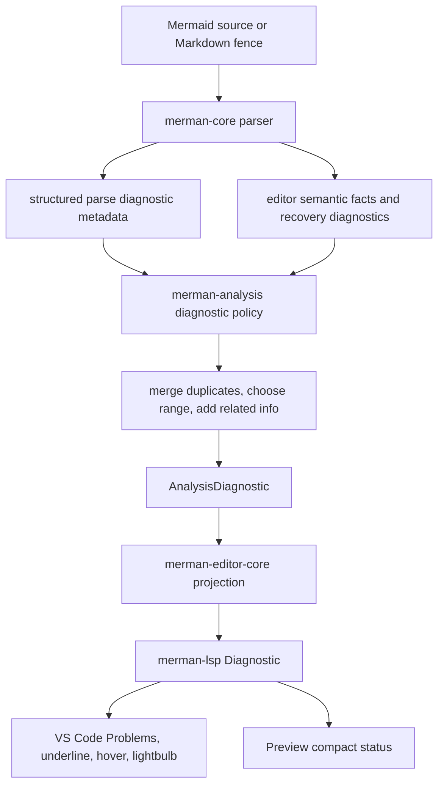
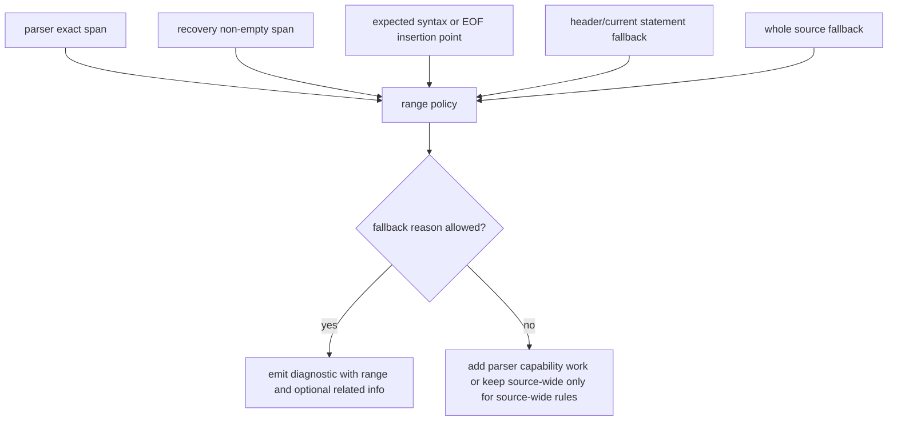

# Precise Diagnostics Authoring Experience - Plan

## Goal Capsule

This plan refactors Merman's Mermaid authoring diagnostics so common editing mistakes produce one precise, actionable diagnostic in the right place, with VS Code using Problems, hover, and quick fixes as the primary language surfaces instead of duplicating diagnostics inside the preview UI.

Authority comes from the maintainer direction in this session: analyze the current defects before refactoring, avoid heuristic-only fixes, support only deterministic LSP behavior that core/parser/analysis can prove, delete unnecessary code, and prepare for fearless internal breakage where it improves the user-facing authoring experience.

This plan builds on `docs/plans/2026-06-23-002-refactor-diagnostics-first-analysis-plan.md`, `docs/plans/2026-06-28-001-refactor-editor-core-language-intelligence-plan.md`, `docs/plans/2026-06-30-001-refactor-vscode-preview-lifecycle-plan.md`, and `docs/plans/2026-06-30-002-refactor-parser-backed-editor-experience-plan.md`. It narrows the next refactor to diagnostic quality and authoring UX rather than broad completion/navigation scope.

Execution profile: deep cross-crate refactor across `merman-core`, `merman-analysis`, `merman-editor-core`, `merman-lsp`, and `tools/vscode-extension`. Internal API breakage is acceptable when it replaces broad fallback spans, duplicate diagnostics, numeric UI codes, or preview-side diagnostic product logic with parser-backed contracts and tests.

Stop if implementation discovers that a desired diagnostic needs Mermaid runtime scraping, remote AI repair, broad text heuristics, or parser-family semantics not exposed by the current core parser. Those cases should become explicit parser capability work or deferred product decisions, not hidden UI guesses.

---

## Product Contract

### Summary

Users editing Mermaid should see diagnostics like a normal VS Code language: one underline at the failing token or syntax region, a stable `merman.<rule>` code, optional related information, and quick fixes only when Merman has safe edits. The preview should help users understand the active render state, but it should not become a noisy duplicate Problems panel.

### Problem Frame

The current diagnostic stack already has useful pieces: `merman-analysis` has rule ids, categories, severities, spans, related information, help text, and fix metadata; `merman-editor-core` projects diagnostics into protocol-neutral structures; `merman-lsp` publishes `Diagnostic` objects with `data` for quick fixes; the VS Code extension can collect diagnostics in the active source range.

The defects are in the contracts between those pieces. Core parse errors carry only `diagram_type` and `message`, so `merman-analysis` often falls back to `whole_source_span()` for syntax errors. Recovered editor facts can add a better span, but that path is a secondary recovery channel and has already caused duplicate user diagnostics. Editor-core currently prefers numeric `AnalysisStatus` codes over rule ids, which makes VS Code display generic codes like `merman(5)` instead of a useful rule identifier. When analysis has no span, editor-core defaults to a zero range, which creates misleading underlines at the start of the document. The VS Code preview then adds another diagnostic list and quick-fix surface, increasing noise rather than making the normal LSP surfaces better.

### Requirements

#### Diagnostic Precision

- R1. Common Mermaid syntax mistakes must produce a non-duplicate diagnostic with the narrowest deterministic range Merman can prove.
- R2. Core parser errors must carry structured diagnostic metadata: stable kind, message, diagram type, optional primary span, optional related spans, and whether the span is exact or fallback.
- R3. Whole-source diagnostics are allowed only for source-wide conditions such as no diagram, unsupported diagram, resource limits, panic/internal failures, or genuinely unlocatable parser failures.
- R4. Empty zero-length ranges are allowed only when they represent a known insertion point such as unexpected EOF; unlocatable diagnostics must use an explicit fallback policy rather than defaulting to line 0 character 0.
- R5. Recovery diagnostics must merge with primary parser diagnostics when they describe the same root parse failure. They may improve the primary range, but they must not create a second user-visible error for the same cause.
- R6. Markdown and MDX Mermaid fences must remap diagnostics, fixes, and related information from fence-local spans to document ranges without losing precision or creating fence-wide ranges when a token span exists.

#### LSP And Quick Fix Semantics

- R7. VS Code-visible `Diagnostic.code` must be a stable user-facing rule id or specific diagnostic id, not a broad numeric analysis status when a rule id exists.
- R8. Numeric `AnalysisStatus` and `code_name` may remain in analysis payloads for CLI/schema compatibility, but LSP/UI projection must not collapse unrelated parse errors into the same visible code.
- R9. Diagnostic `source` must stay `merman`; severity must come from rule configuration; quick fixes must be available only through `DiagnosticFix` metadata preserved in `Diagnostic.data`.
- R10. Related information must be used when it reduces confusion, especially Markdown fence context and parser errors where the reported span is a fallback rather than the exact failing token.
- R11. LSP projection should preserve rule metadata beyond the visible code, including category, diagram type, help text, code description, and deprecated tags when the client supports them.
- R12. LSP publish and pull diagnostics must match advertised client/server capabilities, clear stale diagnostics on close or valid text, and avoid claiming workspace-wide diagnostics unless unopened workspace files are really covered.

#### VS Code Authoring UX

- R13. Problems, editor underline, hover, and VS Code quick fixes are the primary diagnostic experience. Preview diagnostics are a compact status summary and navigation aid only.
- R14. The preview must not render per-diagnostic quick-fix buttons or a full diagnostic list by default when the same actions are already available through Problems and the lightbulb.
- R15. Preview source selection state should be named and implemented as selected source state, not residual pin terminology.
- R16. CodeLens and source actions should remain low-noise: a primary preview action plus a compact More/export/copy route, not repeated diagnostic or pin controls.

#### Coverage And Governance

- R17. The plan must include a characterization matrix for common Mermaid authoring mistakes before broad refactoring lands.
- R18. Tests must cover both supported precision and honest fallback behavior. A whole-source diagnostic is acceptable only when the test names why no narrower span is deterministic.
- R19. Documentation must describe the diagnostic contract, including which surfaces own diagnostics, what `Diagnostic.code` means, and how parser recovery participates.

### Scope Boundaries

In scope:

- structured parse diagnostic metadata in core and parser families that already expose token or recovery spans;
- analysis-level diagnostic merge, fallback-span policy, and Markdown remapping;
- editor-core and LSP projection policy for `code`, `source`, `range`, `relatedInformation`, `codeDescription`, `tags`, metadata `data`, capability handling, and quick-fix `data`;
- VS Code preview diagnostic simplification, source-state naming cleanup, and low-noise CodeLens/source-action routing;
- regression tests for common Mermaid syntax mistakes across Rust and TypeScript surfaces.

Deferred to follow-up work:

- complete parser-span coverage for every Mermaid diagram family;
- new safe quick fixes for syntax errors that currently have no deterministic edit;
- workspace-wide cross-file Mermaid diagnostics;
- renderer/runtime diagnostics that depend on browser layout, fonts, or remote resources;
- marketplace packaging or user-facing release copy.

Outside this plan:

- AI repair, syntax generation, or natural-language correction;
- webview-side Mermaid parsing or scraping Mermaid JS error strings for ranges;
- visual drag-and-drop editing;
- hiding parser defects behind UI normalization;
- changing Mermaid language semantics to make diagnostics easier.

### Acceptance Examples

- AE1. `flowchart TD\nA[unterminated` reports one parse diagnostic with message `Unterminated node label (missing \`]`)`, code `merman.parse.diagram_parse` or a more specific parser id, and a range at the unterminated label or proven insertion point, not two diagnostics.
- AE2. `stateDiagram-v2\nIdle --> Running\nRunning -->` reports one parse diagnostic at the incomplete transition/EOF insertion point, and the recovered editor-facts diagnostic does not appear as a duplicate Problems entry.
- AE3. Invalid directive JSON highlights the directive body or invalid token when the directive parser can locate it; if the lower-level parser cannot locate it yet, the diagnostic documents the fallback and does not default to line 0 character 0.
- AE4. A Markdown document with two Mermaid fences reports an unterminated label only inside the affected fence, with related information pointing to the fence when useful.
- AE5. A diagnostic with a `DiagnosticFix` produces a VS Code quick fix through LSP `data`; a parse diagnostic without fix metadata produces no fake quick fix button in the preview.
- AE6. The preview surface shows a compact diagnostic status such as `1 error`; clicking navigates to Problems or the first diagnostic, while detailed messages and fixes remain in normal VS Code language surfaces.

---

## Planning Contract

### Assumptions

- The duplicate parser/recovery diagnostic fix currently in the working tree is treated as a local in-progress baseline, not as proof the full diagnostic contract is complete.
- Existing public analysis JSON consumers may rely on numeric `code` and `code_name`; the plan changes the editor/LSP projection first and only changes payload schema if implementation proves it necessary.
- The first implementation pass should focus on common high-frequency authoring mistakes in flowchart, state, sequence, class, Markdown fences, directive/frontmatter config, and resource/source-wide failures.
- Read-only sub-agent findings were incorporated for parser span coverage, diagnostic-chain metadata, LSP best practices, and VS Code diagnostics UX. The plan treats those findings as planning evidence, not as implementation proof.

### Key Technical Decisions

- KTD1. Core owns parse-error structure. Parser families should emit structured parse diagnostics when they know a token, delimiter, line, or EOF insertion point; analysis and VS Code must not infer that structure from arbitrary message strings.
- KTD2. Analysis owns merge and fallback policy. `merman-lsp` and the VS Code extension should project diagnostics, not decide whether two parse errors are the same root cause.
- KTD3. Visible diagnostic codes should be rule ids. Keep numeric analysis statuses available for machine payload compatibility, but prefer stable string ids for LSP `Diagnostic.code` so Problems and Code Actions are meaningful; carry non-visible rule metadata through `data` or `codeDescription` instead of throwing it away.
- KTD4. Recovery diagnostics are secondary evidence. Recovered editor facts may provide spans and extra related context, but when they describe the same parse error as the strict parser failure, the primary parse diagnostic remains the single user-visible issue.
- KTD5. Range fallback must be explicit. Use exact parser span first, then recovery span, then syntax-category insertion point, then diagram header/current line when defensible, and whole-source only for source-wide or truly unlocatable errors.
- KTD6. Preview is not a second Problems panel. The preview should expose render state and compact diagnostic status; detailed diagnostic exploration belongs to VS Code Problems, editor hover, and quick fixes.
- KTD7. Delete superseded UI and naming. Residual pin terminology and preview-side per-diagnostic actions should be removed or renamed once selected-source and LSP-owned diagnostics cover the behavior.

### High-Level Technical Design

### System-Wide Impact

- `crates/merman-core/src/error.rs` needs a structured parse diagnostic shape or an equivalent field on `Error::DiagramParse`.
- Parser families using LALRPOP and manual parsers need a common helper for turning `ParseError` or local parser failures into exact/fallback source spans.
- `crates/merman-analysis/src/analyzer.rs` becomes the single merge/fallback policy point for primary parse failures, recovered editor facts, and source-wide diagnostics.
- `crates/merman-editor-core/src/diagnostics.rs` changes visible `Diagnostic.code` policy and must avoid defaulting unspanned diagnostics to a misleading zero range.
- `crates/merman-lsp/src/diagnostics.rs`, `crates/merman-lsp/src/code_actions.rs`, and `crates/merman-lsp/src/server.rs` stay thin but gain stronger tests for `code`, `codeDescription`, `tags`, `related_information`, metadata `data`, quick-fix edit safety, capability handling, and stale diagnostic clearing.
- `tools/vscode-extension/src/preview.ts`, `tools/vscode-extension/media/preview.js`, `tools/vscode-extension/media/preview.css`, `tools/vscode-extension/src/preview-session.ts`, and source-action tests need UX cleanup so preview diagnostics are status-level and selected-source naming replaces pin semantics.

### Risks And Mitigations

| Risk | Mitigation |
|---|---|
| Changing `Error::DiagramParse` breaks many parser call sites. | Introduce compatibility constructors/helpers first, then migrate high-value families; keep the final type simple enough for manual parsers. |
| Improving one parser family creates inconsistent UX across others. | Publish a diagnostic characterization matrix and make fallback reasons explicit per family. |
| LSP code changes break tests or downstream consumers expecting numeric `code`. | Keep numeric payload fields, change editor/LSP projection with regression tests, and document the split. |
| Recovery merge logic becomes message-string matching again. | Move toward structured parse diagnostic kind/detail keys; message normalization may remain only as a temporary bridge with tests. |
| Preview cleanup removes useful discoverability. | Keep a compact status entry and one navigation path to Problems/first diagnostic; leave fixes in VS Code-native surfaces. |

### Sources And Research

- Local code: `crates/merman-core/src/error.rs`, `crates/merman-core/src/editor.rs`, `crates/merman-core/src/diagrams/flowchart.rs`, `crates/merman-analysis/src/payload.rs`, `crates/merman-analysis/src/analyzer.rs`, `crates/merman-analysis/src/source_map.rs`, `crates/merman-analysis/src/markdown.rs`, `crates/merman-editor-core/src/diagnostics.rs`, `crates/merman-lsp/src/diagnostics.rs`, `crates/merman-lsp/src/code_actions.rs`, `tools/vscode-extension/src/preview.ts`, `tools/vscode-extension/src/preview-session.ts`.
- Local returned thread: Parser span audit found that precise ranges mostly come from `EditorSemanticFacts` recovery today, while primary `Error::DiagramParse` has no span and many manual parser/semantic errors still fall back to whole source.
- Local returned thread: Diagnostic chain audit found that numeric codes override rule ids, `code_name/category/diagram_type/help` are lost in editor/LSP projection, unspanned diagnostics default to `0..0`, and dedup can drop fixes or related information when two diagnostics share range/message/code.
- Local returned thread: LSP best-practice audit found push/pull capability gaps, missing `didClose` empty publish cleanup, overclaimed workspace diagnostics if unopened files are not scanned, absent `codeDescription`/deprecated tags, and missing non-overlap quick-fix edit tests.
- Local returned thread: VS Code diagnostics UX audit found that preview diagnostics duplicate Problems/lightbulb, residual `pinnedSource` naming remains after Pin UI removal, and CodeLens/source actions should be lower noise.
- Official LSP 3.17 specification for `Diagnostic.range`, `severity`, `code`, `source`, `relatedInformation`, and `data`: https://microsoft.github.io/language-server-protocol/specifications/lsp/3.17/specification/
- VS Code Language Server Extension Guide for publishing diagnostics from the server to the editor: https://code.visualstudio.com/api/language-extensions/language-server-extension-guide
- VS Code Programmatic Language Features for diagnostics and code actions as native language features: https://code.visualstudio.com/api/language-extensions/programmatic-language-features
- VS Code API reference for `Diagnostic`, `DiagnosticCollection`, and CodeAction integration: https://code.visualstudio.com/api/references/vscode-api

---

## Implementation Units

### U1. Build the common diagnostic characterization matrix

- **Goal:** Establish the expected diagnostic behavior for high-frequency Mermaid authoring mistakes before changing the contracts.
- **Requirements:** R1, R3, R4, R5, R17, R18
- **Dependencies:** None
- **Files:** `crates/merman-core/src/tests/flowchart.rs`, `crates/merman-core/src/tests/state.rs`, `crates/merman-core/src/tests/sequence.rs`, `crates/merman-core/src/tests/class.rs`, `crates/merman-analysis/tests/analyzer.rs`, `crates/merman-lsp/tests/diagnostics.rs`, `docs/lsp/CAPABILITIES.md`
- **Approach:** Add table-driven characterization cases for common edit-time failures: unterminated flowchart node label, dangling flowchart/state/sequence edge or transition, unexpected token, unexpected EOF, invalid directive JSON, malformed frontmatter, unsupported diagram type, no diagram, and resource-limit source-wide failure. Each case should record expected diagnostic count, stable id, severity, visible LSP code, range policy, and whether whole-source is allowed.
- **Execution note:** Start with characterization tests for existing behavior where possible, marking intended failures in the plan/implementation notes rather than weakening the assertions.
- **Patterns to follow:** Existing analyzer tests in `crates/merman-analysis/src/analyzer.rs`, LSP diagnostic tests in `crates/merman-lsp/tests/diagnostics.rs`, and source-position tests in `crates/merman-analysis/tests/source_positions.rs`.
- **Test scenarios:** `flowchart TD\nA[unterminated` produces one parse diagnostic; `stateDiagram-v2\nIdle --> Running\nRunning -->` produces one parse diagnostic; invalid directive JSON maps to directive span or documented fallback; no diagram and resource limit remain source-wide; Markdown fence versions of the same syntax errors remap ranges to the containing document.
- **Verification:** The matrix can be read by an implementer to know which diagnostics must become precise, which may remain fallback, and why each whole-source diagnostic is legitimate.

### U2. Add structured parse diagnostics to core

- **Goal:** Let parser failures carry deterministic diagnostic metadata instead of only `diagram_type` and a human message.
- **Requirements:** R1, R2, R3, R4
- **Dependencies:** U1
- **Files:** `crates/merman-core/src/error.rs`, `crates/merman-core/src/editor.rs`, `crates/merman-core/src/parse_pipeline.rs`, `crates/merman-core/src/diagrams/flowchart.rs`, `crates/merman-core/src/diagrams/state/parse.rs`, `crates/merman-core/src/diagrams/sequence/parse.rs`, `crates/merman-core/src/diagrams/class/parse.rs`, `crates/merman-core/src/tests/flowchart.rs`, `crates/merman-core/src/tests/state.rs`, `crates/merman-core/src/tests/sequence.rs`, `crates/merman-core/src/tests/class.rs`
- **Approach:** Introduce a small parser diagnostic data type with diagram type, stable parser kind or rule id, message, optional primary `SourceSpan`, optional related spans, and a fallback reason. Update `Error::DiagramParse` or add constructor helpers so existing parser call sites can migrate incrementally. Convert LALRPOP errors through a shared helper that preserves token spans for `UnrecognizedToken` and insertion-point spans for `UnrecognizedEof`; manual parsers should pass local spans when they already know the failing token or delimiter.
- **Patterns to follow:** `SourceSpan`, `lalrpop_recovery_span`, `format_lalrpop_parse_error`, `EditorSemanticDiagnostic`, and parser-family span capture already present in flowchart/state/sequence/class.
- **Test scenarios:** LALRPOP `UnrecognizedToken` exposes token start/end; `UnrecognizedEof` exposes EOF insertion point; `User` errors do not pretend to be exact when no span is known; manual parser failures that already know statement spans preserve them; existing public error formatting remains readable.
- **Verification:** Core parser tests assert diagnostic metadata separately from display strings, and existing parser snapshot/golden behavior remains unchanged except for richer errors.

### U3. Centralize analysis merge and fallback-span policy

- **Goal:** Make `merman-analysis` the single point that turns core parse diagnostics and recovered editor facts into one clean `AnalysisDiagnostic`.
- **Requirements:** R1, R3, R4, R5, R6, R9, R10, R11
- **Dependencies:** U2
- **Files:** `crates/merman-analysis/src/analyzer.rs`, `crates/merman-analysis/src/payload.rs`, `crates/merman-analysis/src/rules.rs`, `crates/merman-analysis/src/source_map.rs`, `crates/merman-analysis/src/markdown.rs`, `crates/merman-analysis/tests/analyzer.rs`, `crates/merman-analysis/tests/payload_schema.rs`, `crates/merman-analysis/tests/source_positions.rs`
- **Approach:** Replace broad `rule_diagnostic(...).with_span(whole_source_span)` behavior for parse errors with a diagnostic builder that accepts exact spans, insertion-point spans, fallback reasons, and related information. Merge recovered editor-facts diagnostics into primary parse diagnostics by structured key when available, with the current message-detail merge only as a temporary compatibility bridge. Update analysis/editor diagnostic dedup so it either keys on rule metadata, fixes, and related information or deliberately prefers the richer diagnostic instead of letting order decide whether fix/related data survives. Ensure Markdown remapping handles primary span, related spans, and fix spans consistently.
- **Patterns to follow:** Existing `AnalysisDiagnostic` fields, source directive span helpers, Markdown `remap_diagnostic`, and the current local `merge_recovery_diagnostics` direction.
- **Test scenarios:** Matching recovery and primary parse diagnostics merge into one error; recovery span improves primary span when non-empty; unrelated recovery diagnostics remain visible; same-range diagnostics with different fixes or related information keep the richer metadata; unspanned parse errors use an explicit fallback reason and never silently become line 0 character 0; Markdown fence diagnostics remap primary, related, and quick-fix edit spans.
- **Verification:** Analyzer tests prove diagnostic counts, ids, severity, category, diagram type, span policy, related information, and payload schema compatibility.

### U4. Correct editor-core and LSP diagnostic projection

- **Goal:** Make LSP diagnostics display useful codes and safe ranges while preserving quick-fix data.
- **Requirements:** R7, R8, R9, R10, R11, R12
- **Dependencies:** U3
- **Files:** `crates/merman-editor-core/src/diagnostics.rs`, `crates/merman-editor-core/src/types.rs`, `crates/merman-editor-core/tests/diagnostics.rs`, `crates/merman-lsp/src/diagnostics.rs`, `crates/merman-lsp/src/code_actions.rs`, `crates/merman-lsp/src/server.rs`, `crates/merman-lsp/tests/diagnostics.rs`, `crates/merman-lsp/tests/capabilities.rs`, `crates/merman-lsp/tests/server_smoke.rs`
- **Approach:** Change editor/LSP projection to prefer diagnostic `id` or a more specific parser diagnostic id as visible `Diagnostic.code`; keep numeric analysis status in payload data only if needed. Replace `unwrap_or_default()` range behavior with an explicit unspanned-diagnostic handling path supplied by analysis. Preserve `source: "merman"`, severity mapping, related information, and quick-fix `data` projection. Add rule metadata to diagnostic data or code description where it helps code actions and user inspection. Map deprecated compatibility/config diagnostics to `DiagnosticTag.Deprecated` when appropriate, gated by client capability. Audit push versus pull diagnostics: `textDocument/diagnostic` capability should govern pull behavior, refresh should require the matching workspace refresh support, `didClose` should publish empty diagnostics in push mode, and workspace diagnostics should be advertised only when implementation covers unopened files. Keep code actions generic over `DiagnosticCodeActionData` and reject overlapping quick-fix edit sets.
- **Patterns to follow:** Existing `analysis_payload_to_diagnostics`, `editor_diagnostic_to_lsp`, `code_actions_for_params`, and current server smoke tests that verify versioned diagnostic publishing.
- **Test scenarios:** Parse diagnostics display `NumberOrString::String("merman.parse.diagram_parse")` or a specific string id, not `Number(5)`; fixable config diagnostics still carry quick-fix `data`; diagnostics without fixes do not create actions; related information reaches LSP; deprecated rules map to tags only when supported; pull-capable clients do not receive duplicate push diagnostics; `didClose` clears stale push diagnostics; workspace diagnostics are either real for unopened files or not advertised; overlapping quick-fix edits are rejected or split before projection.
- **Verification:** LSP tests prove the UI-visible diagnostic shape and code-action behavior without adding rule-specific code to the LSP layer.

### U5. Simplify VS Code preview diagnostics and source actions

- **Goal:** Reduce preview-page diagnostic noise and align with VS Code-native Problems and quick fixes.
- **Requirements:** R13, R14, R15, R16
- **Dependencies:** U4
- **Files:** `tools/vscode-extension/src/preview.ts`, `tools/vscode-extension/src/preview-session.ts`, `tools/vscode-extension/src/preview-messages.ts`, `tools/vscode-extension/src/source-actions.ts`, `tools/vscode-extension/src/codelens.ts`, `tools/vscode-extension/media/preview.js`, `tools/vscode-extension/media/preview.css`, `tools/vscode-extension/src/test/preview.test.ts`, `tools/vscode-extension/src/test/preview-session.test.ts`, `tools/vscode-extension/src/test/source-actions.test.ts`, `tools/vscode-extension/src/test/preview-messages.test.ts`
- **Approach:** Replace the preview's detailed diagnostic list and per-diagnostic quick-fix buttons with a compact status summary that can reveal the first diagnostic or route users to VS Code's native Problems/action flow. Rename residual `pinnedSource` concepts to selected-source state. Collapse editor CodeLens/source actions toward a primary preview action and compact More/export/copy commands, keeping export/copy discoverable without making every fence look like a toolbar.
- **Patterns to follow:** Current preview lifecycle state preservation in `preview-session.ts`, diagnostics collection filtering in `collectPreviewDiagnostics`, and source action command routing already covered by extension tests.
- **Test scenarios:** Preview with one diagnostic renders a compact status and no per-diagnostic quick-fix button; clicking the status reveals the diagnostic target or Problems route; selected source survives cursor movement; multi-fence Markdown source selection does not reset because of diagnostics-only updates; CodeLens exposes low-noise primary action and More/export route.
- **Verification:** TypeScript tests prove the webview message contract, selected-source behavior, and action routing. Manual VS Code smoke should show diagnostics primarily in Problems/editor underline, with preview status as a secondary indicator.

### U6. Document the diagnostic contract and remove obsolete paths

- **Goal:** Make the new diagnostic ownership model durable for future parser and VS Code work.
- **Requirements:** R17, R18, R19
- **Dependencies:** U1, U2, U3, U4, U5
- **Files:** `docs/lsp/CAPABILITIES.md`, `docs/adr/0070-diagnostics-first-analysis-contract.md`, `tools/vscode-extension/README.md`, `crates/merman-analysis/src/analyzer.rs`, `crates/merman-editor-core/src/diagnostics.rs`, `tools/vscode-extension/src/preview.ts`, `tools/vscode-extension/media/preview.js`
- **Approach:** Update docs to describe parser-backed diagnostic precision, fallback-span reasons, visible LSP code policy, recovery merge behavior, and preview-vs-Problems ownership. Remove obsolete preview diagnostic helpers, pin naming, or bridge code once tests prove selected-source and LSP-native diagnostics cover the behavior.
- **Patterns to follow:** Existing ADR style and conservative LSP capability documentation.
- **Test scenarios:** Documentation examples match the characterization matrix; no stale docs claim numeric `merman(5)` as the intended user-facing code; removed code paths have equivalent Rust or TypeScript regression coverage.
- **Verification:** Docs and code agree on which layer owns parse structure, merge policy, projection, and UX display.

---

## Verification Contract

| Gate | Applies To | Done Signal |
|---|---|---|
| Rust formatting | All Rust changes | Workspace formatting check passes. |
| Core parser diagnostics | U1, U2 | Core tests cover exact span, insertion point, and fallback parse diagnostic cases for selected families. |
| Analysis payload and Markdown remap | U1, U3 | Analysis tests prove merge policy, range fallback, related information, schema compatibility, and Markdown fence remapping. |
| Editor/LSP projection | U4 | Editor-core and LSP tests prove string diagnostic codes, safe ranges, metadata preservation, related information, quick-fix data, capability handling, and stale diagnostic clearing. |
| VS Code extension UX | U5 | TypeScript tests prove compact preview diagnostic status, selected-source naming/state, low-noise source actions, and preview message compatibility. |
| Documentation parity | U6 | Capability docs and ADR describe the same contract enforced by tests. |

---

## Definition of Done

- Common syntax-error cases in the characterization matrix produce exactly one user-visible diagnostic unless the matrix explicitly allows multiple independent root causes.
- Diagnostics have stable `merman.<rule>` or more specific string codes in LSP/VS Code; numeric analysis status no longer appears as the primary Problems code for parser errors.
- LSP diagnostics preserve useful rule metadata through `data`, `codeDescription`, or tags where supported, and do not advertise pull/workspace capabilities beyond implemented behavior.
- Parser/recovery duplicates are merged by structured evidence where available, with message-string bridging isolated and tested only for compatibility during migration.
- Unspanned diagnostics never default silently to line 0 character 0.
- Markdown/MDX Mermaid fence diagnostics preserve precise ranges and related information after remapping.
- Push diagnostics are cleared on close or valid text, pull diagnostics do not duplicate push diagnostics, and quick-fix edits are validated against overlap.
- VS Code preview shows compact diagnostic status and does not duplicate Problems as a full diagnostic list or quick-fix panel.
- Residual pin naming and superseded preview diagnostic helpers are removed or renamed.
- Rust and TypeScript tests covering the changed surfaces pass, and `cargo fmt` formatting remains clean.
