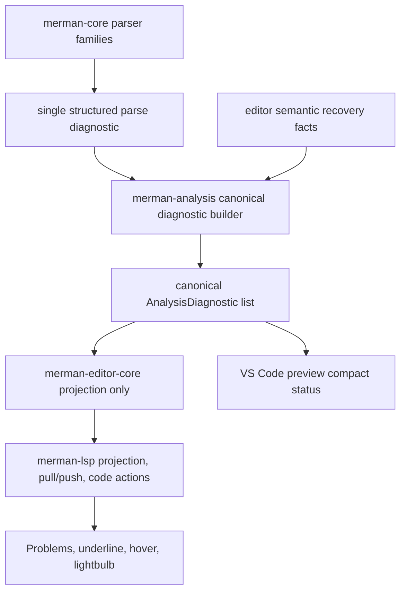
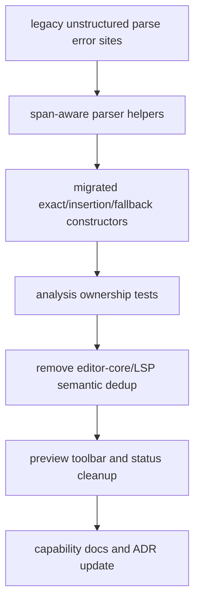

# Editor Diagnostics Architecture Cleanup - Plan

## Goal Capsule

This plan finishes the next fearless refactor pass for Merman's editor diagnostics and preview UX after `docs/plans/2026-06-30-003-refactor-precise-diagnostics-authoring-plan.md` shipped.

The objective is to remove temporary compatibility layers that now hide ownership boundaries: core should expose one structured parse diagnostic contract, analysis should own all user-visible diagnostic merge and fallback policy, editor-core and LSP should only project diagnostics, and the VS Code preview should prioritize common actions without duplicating Problems.

Authority comes from maintainer direction in this session: all proposed cleanup areas are in scope, internal API breakage is acceptable, dead code should be deleted, and the implementation should avoid heuristic-only language features or AI-style repair claims.

Execution profile: deep cross-crate refactor across `merman-core`, `merman-analysis`, `merman-editor-core`, `merman-lsp`, and `tools/vscode-extension`. The implementation may break internal APIs and tests while moving toward the new contract, but it must end with deterministic parser-backed behavior and green Rust/TypeScript gates.

Stop if implementation discovers that a target diagnostic can only be made precise by scraping Mermaid JS runtime errors, browser layout state, arbitrary source-message matching, or editor-webview guesses. Those cases should become explicit parser capability gaps, not hidden UI fixes.

---

## Product Contract

### Summary

This plan targets the remaining structural debt after the first precise-diagnostics pass: collapse diagnostic ownership into analysis, tighten core parse-error APIs, migrate high-value handwritten parser spans, clarify LSP pull/workspace behavior, and polish the preview controls around the actions users perform most often.

### Problem Frame

The current branch already fixed the most visible duplicate diagnostic bug and improved preview lifecycle behavior, but several fixes are still transitional. `merman-core` now has both legacy `Error::DiagramParse` and newer `Error::DiagramParseDiagnostic`, while `ParseDiagnostic`, `ParseDiagnosticSpanKind`, and `ParseErrorSourceSpan` are publicly re-exported even though they mainly exist to support parser internals and analysis projection. `merman-analysis` still merges parser and recovered diagnostics by extracting details from a human message string, which is exactly the sort of brittle coupling this authoring stack should avoid.

The projection layers also still carry defensive behavior that made sense before analysis owned the policy. `merman-editor-core` deduplicates projected diagnostics and humanizes recovered-parser messages, so it can mask whether analysis produced the correct canonical diagnostic. `merman-lsp` no longer advertises workspace diagnostics, but it still implements `workspace/diagnostic` over open snapshots, leaving an ambiguous internal contract. The preview is better than before, yet its toolbar and source actions still need a user-frequency pass: export/copy should be directly discoverable, settings should stay compact, diagnostics should remain status-level, and pointer/viewport behavior needs explicit regression coverage.

### Requirements

#### Diagnostic Architecture

- R1. `merman-analysis` must be the only layer that decides whether two diagnostics represent the same user-visible problem.
- R2. `merman-editor-core`, `merman-lsp`, and the VS Code extension must project diagnostics without adding semantic deduplication or recovered-parser message policy.
- R3. Core parser errors must use one structured parse-diagnostic path; legacy unstructured `DiagramParse` construction should be removed or converted at parser boundaries.
- R4. Public core API exposure for parse diagnostic internals should be minimized to the read-only surface needed by downstream crates.
- R5. Fallback locations must be explicit and tested; line-zero default ranges and silent whole-source fallback are not acceptable for parser errors that can provide a better location.

#### Parser Span Migration

- R6. Mature editor families that still emit unspanned handwritten `DiagramParse` errors should migrate to span-aware helpers in priority order.
- R7. Parser span migration must use parser-known byte offsets, line scans, or local token spans, not broad message heuristics.
- R8. Each migrated family must add malformed-source tests that prove exact span, insertion point, or explicit fallback behavior.
- R9. Families not fully migrated in this pass must use named fallback constructors so their remaining imprecision is visible in code and docs.

#### LSP Contract

- R10. Document pull diagnostics must preserve `previousResultId` unchanged behavior, return stable empty results for closed documents, and not duplicate push diagnostics.
- R11. `workspace/diagnostic` must not remain semantically ambiguous: either remove the handler while `workspace_diagnostics` is false, or document and test it as open-document-only defensive behavior.
- R12. Capability docs and tests must agree on what the server advertises, what it implements defensively, and how diagnostic refresh is triggered.
- R13. Quick fixes must continue to come only from `DiagnosticFix` metadata and must reject overlapping or unsafe edit sets before reaching VS Code.

#### VS Code Preview UX

- R14. The preview should default to a paper background and keep SVG export/copy actions directly visible in SVG mode.
- R15. Mode, Mermaid theme, and preview background should live in a compact settings menu; export/copy must not be buried behind that menu in normal desktop width.
- R16. Preview toolbar text and controls must be vertically centered, keyboard reachable, accessibly named, responsive, and usable at narrow webview widths without overlapping the source picker.
- R17. Preview diagnostics should remain a compact status and first-diagnostic navigation aid, not a duplicate Problems list or quick-fix panel.
- R18. Cursor movement, diagnostics-only updates, and settings-only updates must not reset pan/zoom unless the rendered source identity or render key truly changes.
- R19. Pointer drag, wheel zoom, fit, and 1:1 behavior must have webview regression coverage for SVG mode; ASCII/Unicode text modes must remain selectable and copyable as text.
- R20. Source actions should use user-facing labels that reveal the common commands, such as preview plus export/copy, without reintroducing noisy per-fence toolbars.

#### Cleanup And Governance

- R21. Obsolete pin terminology, duplicate projection deduplication, old parse-error constructors, and unadvertised diagnostic behavior should be deleted once tests prove replacement coverage.
- R22. `docs/lsp/CAPABILITIES.md` and the diagnostics ADR must describe the final ownership model and not preserve stale implementation-history claims.
- R23. The plan's implementation must prefer breaking internal APIs over keeping compatibility shims that make future diagnostics harder to reason about.

### Scope Boundaries

In scope:

- core parse diagnostic type and constructor cleanup;
- span-aware migration for high-value handwritten parser families;
- analysis-level diagnostic merge, range fallback, related-information, and metadata policy;
- removal of projection-layer semantic deduplication when analysis guarantees canonical diagnostics;
- LSP document pull, push, close, refresh, workspace-diagnostic boundary, and code-action safety tests;
- VS Code preview toolbar, export/copy discoverability, settings menu, responsive layout, viewport interaction, and compact diagnostic status;
- documentation updates that lock the ownership model for future parser and editor work.

Deferred to follow-up work:

- exhaustive span migration for every remaining Mermaid family if implementation proves the pass would exceed a reviewable diff;
- new syntax repair quick fixes beyond existing deterministic `DiagnosticFix` metadata;
- unopened workspace-file scanning and true workspace-wide diagnostics;
- marketplace packaging, release notes, and user-facing marketing copy;
- visual drag-and-drop Mermaid editing.

Outside this plan:

- AI repair, source generation, or natural-language correction;
- webview-side Mermaid parsing;
- scraping Mermaid JS runtime exceptions to infer source ranges;
- pixel-perfect renderer parity changes unrelated to editor diagnostics;
- changing Mermaid language semantics to make diagnostics easier.

### Acceptance Examples

- AE1. `flowchart TD\nA[unterminated` produces exactly one user-visible parser diagnostic through analysis, and neither editor-core nor LSP needs a secondary deduplication pass to hide a recovered-parser duplicate.
- AE2. A migrated handwritten parser case such as invalid XY Chart numeric data highlights the offending value or insertion point instead of the whole document.
- AE3. A family that cannot yet provide a precise span emits a named fallback parse diagnostic with related information explaining the fallback, not a legacy unstructured `DiagramParse` error.
- AE4. A pull-capable client that asks for diagnostics after a document is closed receives a stable empty report instead of stale items.
- AE5. The server does not claim workspace diagnostics while only open-document snapshots are analyzed; tests and docs describe the same behavior.
- AE6. In the preview, Copy SVG, Export SVG, and Export PNG are visible in SVG mode at normal width, while Mode, Theme, and Background stay in a settings menu.
- AE7. Copy/export buttons render centered text and do not overlap the zoom controls or source picker at narrow webview widths.
- AE8. Moving the editor cursor or receiving diagnostics-only updates does not reset the preview's pan/zoom for the same rendered source.
- AE9. ASCII and Unicode preview modes remain selectable from the menu, hide SVG-only export controls, and render selectable text.

---

## Planning Contract

### Assumptions

- The previous plan's commit is the baseline; this plan does not need to preserve transitional APIs added only to ship that first pass.
- `merman-core` is still pre-1.0, so breaking public parse diagnostic internals is acceptable when downstream workspace crates are migrated in the same change.
- External web research is not load-bearing for this plan; the defects and target patterns are visible in local code, tests, capability docs, and the earlier local reference work.
- Parser span migration should be broad enough to remove the most visible whole-source diagnostics, but implementation may leave a documented fallback ledger for families that require larger parser rewrites.

### Key Technical Decisions

- KTD1. Analysis owns canonical diagnostics. All duplicate/recovery/fallback policy should happen before projection so editor-core, LSP, and the preview cannot hide upstream contract bugs.
- KTD2. Core exposes one parse diagnostic contract. The legacy split between unstructured `DiagramParse` and structured `DiagramParseDiagnostic` should collapse into one path with read-only metadata and explicit constructors.
- KTD3. Parser spans come from parser facts. Handwritten families should pass source offsets through their local parsing helpers instead of reconstructing positions from final messages.
- KTD4. LSP workspace diagnostics are out until unopened-file scanning exists. The server should not keep an open-doc-only implementation that looks like a real workspace feature unless it is explicitly framed as defensive and tested that way.
- KTD5. Preview controls follow user frequency. SVG copy/export and viewport controls are primary; render mode, Mermaid theme, and background are secondary settings; diagnostics remain a status indicator.
- KTD6. Cleanup is part of done. Compatibility shims, old naming, and redundant dedup code should be deleted once the replacement is covered by tests rather than left as future confusion.

### High-Level Technical Design

### Priority Strategy

| Priority | Work | Reason |
|---|---|---|
| 1 | Core parse diagnostic API cleanup | Every downstream contract depends on whether parse errors carry structured, trustworthy metadata. |
| 2 | Analysis ownership and projection cleanup | This removes duplicate policy from editor-core/LSP before adding more parser-family cases. |
| 3 | Handwritten parser span migration | Once the API and ownership are stable, family migrations can be mechanical and testable. |
| 4 | LSP pull/workspace boundary | This is user-visible for editor correctness and should be settled before more preview affordances rely on diagnostics. |
| 5 | Preview UX polish | Toolbar and diagnostics cleanup can then depend on the canonical diagnostic contract. |
| 6 | Documentation and dead-code removal | Docs should describe the final state, and dead code should be deleted after tests prove replacement coverage. |

### System-Wide Impact

- `crates/merman-core/src/error.rs`, `crates/merman-core/src/editor.rs`, and `crates/merman-core/src/lib.rs` define the parse diagnostic API that all parser families and analysis consume.
- Mature handwritten parser files such as `crates/merman-core/src/diagrams/xychart.rs`, `crates/merman-core/src/diagrams/gantt/parse.rs`, `crates/merman-core/src/diagrams/git_graph.rs`, `crates/merman-core/src/diagrams/timeline.rs`, and `crates/merman-core/src/diagrams/c4.rs` contain many legacy unstructured parse errors and should be migrated first.
- `crates/merman-analysis/src/analyzer.rs` becomes the enforced policy boundary for parser/recovery merge, explicit fallback, and related-information enrichment.
- `crates/merman-editor-core/src/diagnostics.rs` should shrink toward range/code/data projection and stop acting as a semantic diagnostic policy layer.
- `crates/merman-lsp/src/server.rs`, `crates/merman-lsp/src/diagnostics.rs`, and `crates/merman-lsp/src/code_actions.rs` must agree with advertised capabilities and keep quick-fix safety local to code action construction.
- `tools/vscode-extension/src/preview-html.ts`, `tools/vscode-extension/media/preview.css`, `tools/vscode-extension/media/preview.js`, `tools/vscode-extension/src/preview-session.ts`, and `tools/vscode-extension/src/source-actions.ts` own the preview and source-action UX polish.

### Risks And Mitigations

| Risk | Mitigation |
|---|---|
| Removing `Error::DiagramParse` creates a large mechanical diff across parser families. | Introduce one span-aware constructor family first, migrate high-value files in waves, and keep any remaining fallback constructor visibly named. |
| Analysis ownership cleanup accidentally drops fixes or related information previously preserved by editor-core dedup. | Add tests where same-range diagnostics carry related info and fixes, then remove projection dedup only after analysis merges metadata. |
| Parser span migration becomes heuristic string matching. | Require every migrated family test to assert byte/LSP ranges from parser-known source offsets or local token spans. |
| LSP workspace diagnostic behavior regresses clients that call unadvertised methods. | Decide the boundary in tests: unsupported when not advertised, or explicitly open-doc-only defensive behavior. Do not leave it accidental. |
| Preview toolbar becomes too dense on small panels. | Use responsive CSS and tests for narrow widths; keep settings in the menu and direct commands visible only when they fit cleanly. |
| Documentation drifts from implementation again. | Make docs update a final unit with assertions against capability tests and ADR text. |

### Sources And Research

- Previous implementation-ready plan: `docs/plans/2026-06-30-003-refactor-precise-diagnostics-authoring-plan.md`.
- Related plans: `docs/plans/2026-06-23-002-refactor-diagnostics-first-analysis-plan.md`, `docs/plans/2026-06-28-001-refactor-editor-core-language-intelligence-plan.md`, `docs/plans/2026-06-30-001-refactor-vscode-preview-lifecycle-plan.md`, and `docs/plans/2026-06-30-002-refactor-parser-backed-editor-experience-plan.md`.
- Current code evidence: `crates/merman-core/src/error.rs` still exposes both structured and unstructured parse error paths; `crates/merman-analysis/src/analyzer.rs` still contains message-detail recovery merging; `crates/merman-editor-core/src/diagnostics.rs` still deduplicates projection output; `crates/merman-lsp/src/server.rs` still implements `workspace_diagnostic` while `workspace_diagnostics` is false.
- Preview evidence: `tools/vscode-extension/src/preview-session.ts` defaults to paper background and selected-source state; `tools/vscode-extension/media/preview.js` preserves pan/zoom for same source identity; `tools/vscode-extension/media/preview.css` still has toolbar/sourcebar layout constraints that need responsive polish.
- Capability docs: `docs/lsp/CAPABILITIES.md` already describes analysis-owned diagnostics and no advertised workspace diagnostics, so this plan should align code and tests with that documented contract.

---

## Implementation Units

### U1. Tighten Core Parse Diagnostic API

- **Goal:** Replace the transitional dual parse-error surface with one structured core diagnostic contract.
- **Requirements:** R3, R4, R5, R21, R23
- **Dependencies:** None
- **Files:** `crates/merman-core/src/error.rs`, `crates/merman-core/src/editor.rs`, `crates/merman-core/src/lib.rs`, `crates/merman-core/src/parse_pipeline.rs`, `crates/merman-core/src/diagrams/flowchart.rs`, `crates/merman-core/src/diagrams/state/parse.rs`, `crates/merman-core/src/diagrams/sequence/parse.rs`, `crates/merman-core/src/diagrams/class/parse.rs`, `crates/merman-core/src/diagrams/er.rs`, `crates/merman-core/src/tests/flowchart.rs`, `crates/merman-core/src/tests/state.rs`, `crates/merman-core/src/tests/sequence.rs`, `crates/merman-core/src/tests/class.rs`, `crates/merman-core/src/tests/er.rs`
- **Approach:** Collapse `Error::DiagramParse` and `Error::DiagramParseDiagnostic` into one structured parse-error variant or one constructor path that always carries a `ParseDiagnostic`. Make direct fields private where possible and expose read-only accessors for analysis. Move `ParseErrorSourceSpan` out of the public crate re-export unless an external consumer truly needs it. Keep display formatting stable for users while changing internal construction.
- **Execution note:** Start with compile-driven migration and narrow core tests before touching handwritten families.
- **Patterns to follow:** Existing `lalrpop_parse_diagnostic`, `ParseDiagnosticSpanKind`, and LALRPOP family parse wrappers already used by flowchart, state, sequence, class, and ER.
- **Test scenarios:** LALRPOP token errors preserve exact spans; EOF errors preserve insertion points; user errors without spans are marked fallback; old unstructured parser call sites no longer compile or are converted through an explicitly named fallback constructor; public error display remains readable.
- **Verification:** Core tests prove structured parse diagnostic metadata without requiring analysis or LSP projection.

### U2. Centralize Canonical Diagnostic Ownership In Analysis

- **Goal:** Move final duplicate, recovery, fallback, and metadata merge behavior into `merman-analysis`.
- **Requirements:** R1, R2, R5, R13, R21
- **Dependencies:** U1
- **Files:** `crates/merman-analysis/src/analyzer.rs`, `crates/merman-analysis/src/payload.rs`, `crates/merman-analysis/src/rules.rs`, `crates/merman-analysis/src/source_map.rs`, `crates/merman-analysis/src/markdown.rs`, `crates/merman-analysis/tests/analyzer.rs`, `crates/merman-analysis/tests/payload_schema.rs`, `crates/merman-analysis/tests/source_positions.rs`, `crates/merman-editor-core/src/diagnostics.rs`, `crates/merman-editor-core/tests/diagnostics.rs`
- **Approach:** Replace recovered-parser message splitting with a structured merge key derived from parse diagnostic metadata, diagram type, and recovery facts. Analysis should choose the best primary span, attach fallback/recovery context as related information, and preserve fixes/help/category/diagram metadata before projection. After analysis guarantees canonical output, remove editor-core semantic dedup and recovered-message humanization or reduce them to format-only fallbacks for legacy payloads.
- **Patterns to follow:** Existing `AnalysisDiagnostic`, `DiagnosticRelated`, Markdown diagnostic remapping, and the recent duplicate-flowchart/state regression tests.
- **Test scenarios:** Matching parser and recovery diagnostics produce one output; recovery span can improve a fallback parser span; unrelated recovery diagnostics remain visible; duplicate metadata merges preserve fixes and related information in analysis rather than editor-core; Markdown/MDX remapping preserves primary span, related spans, and fix edit spans; unspanned diagnostics never project as a silent default range.
- **Verification:** Analysis and editor-core tests prove projection receives already-canonical diagnostics.

### U3. Migrate High-Value Handwritten Parser Spans

- **Goal:** Reduce whole-source parser diagnostics from mature handwritten families without introducing source-message heuristics.
- **Requirements:** R6, R7, R8, R9
- **Dependencies:** U1, U2
- **Files:** `crates/merman-core/src/diagrams/xychart.rs`, `crates/merman-core/src/diagrams/gantt/parse.rs`, `crates/merman-core/src/diagrams/gantt/date.rs`, `crates/merman-core/src/diagrams/git_graph.rs`, `crates/merman-core/src/diagrams/timeline.rs`, `crates/merman-core/src/diagrams/c4.rs`, `crates/merman-core/src/diagrams/architecture.rs`, `crates/merman-core/src/diagrams/kanban.rs`, `crates/merman-core/src/tests/misc.rs`, `crates/merman-analysis/tests/analyzer.rs`, `docs/lsp/CAPABILITIES.md`
- **Approach:** Migrate handwritten families in two waves. First migrate XY Chart, Gantt, GitGraph, Timeline, and C4 because they are mature editor families with many direct legacy `DiagramParse` sites. Then migrate Architecture and Kanban if the same helper shape applies cleanly. For any remaining mature family errors left unspanned, convert them to named fallback constructors and add a capability-doc note rather than leaving generic whole-source behavior hidden.
- **Patterns to follow:** Existing source-offset helpers in parser files, `SourceSpan`, flowchart lexer span capture, and family-local test modules such as `crates/merman-core/src/diagrams/gantt/tests.rs`.
- **Test scenarios:** Invalid XY Chart numeric token highlights the token; malformed Gantt date highlights the date field or insertion point; unknown GitGraph command highlights the command token; malformed Timeline row highlights the row or field; malformed C4 relation/style argument highlights the local argument span; remaining fallback cases include a documented reason and related information.
- **Verification:** Core and analysis tests show improved spans for migrated families and no regression for valid parse/render behavior.

### U4. Harden LSP Diagnostic Boundaries

- **Goal:** Make pull, push, workspace, and code-action behavior match advertised capabilities and the canonical analysis payload.
- **Requirements:** R10, R11, R12, R13
- **Dependencies:** U2
- **Files:** `crates/merman-lsp/src/server.rs`, `crates/merman-lsp/src/diagnostics.rs`, `crates/merman-lsp/src/code_actions.rs`, `crates/merman-lsp/tests/diagnostics.rs`, `crates/merman-lsp/tests/capabilities.rs`, `crates/merman-lsp/tests/server_smoke.rs`, `docs/lsp/CAPABILITIES.md`, `docs/lsp/DIAGNOSTIC_PROTOCOL.md`
- **Approach:** Keep document pull diagnostics and unchanged-result behavior. Add closed-document pull tests that assert a stable empty report. Audit diagnostic refresh so it reflects document-pull support rather than pretending workspace scanning exists. Decide the workspace handler boundary in code: prefer deleting the `workspace_diagnostic` implementation while `workspace_diagnostics` remains false; if tower-lsp or client behavior makes a defensive handler useful, rename tests/docs to open-document-only aggregation and keep it clearly non-product.
- **Patterns to follow:** Current document diagnostic `previous_result_id` tests, push/pull capability gating, and `DiagnosticFix` metadata projection in code actions.
- **Test scenarios:** Pull-capable clients do not receive duplicate push diagnostics; repeated pull with matching result id returns unchanged; pull after close returns an empty full or unchanged empty report; non-pull clients receive empty publish on close; unadvertised workspace diagnostics are unsupported or explicitly open-document-only; overlapping quick-fix edits are rejected; diagnostics without fixes produce no actions.
- **Verification:** LSP tests and capability docs agree on every advertised diagnostic behavior.

### U5. Redesign Preview Controls Around Common Actions

- **Goal:** Make the preview quieter and more useful without turning it into a second Problems panel.
- **Requirements:** R14, R15, R16, R17, R18, R19, R20
- **Dependencies:** U2, U4
- **Files:** `tools/vscode-extension/src/preview-html.ts`, `tools/vscode-extension/media/preview.css`, `tools/vscode-extension/media/preview.js`, `tools/vscode-extension/src/preview-model.ts`, `tools/vscode-extension/src/preview-messages.ts`, `tools/vscode-extension/src/preview-session.ts`, `tools/vscode-extension/src/preview.ts`, `tools/vscode-extension/src/source-actions.ts`, `tools/vscode-extension/src/codelens.ts`, `tools/vscode-extension/src/test/preview.test.ts`, `tools/vscode-extension/src/test/preview-webview.test.ts`, `tools/vscode-extension/src/test/preview-session.test.ts`, `tools/vscode-extension/src/test/source-actions.test.ts`, `tools/vscode-extension/src/test/preview-messages.test.ts`
- **Approach:** Keep paper background as the default. In SVG mode, keep zoom controls plus visible Copy SVG, Export SVG, and Export PNG controls at normal widths, with settings menu entries limited to Mode, Theme, and Background. Rename source-action `More...` to a clearer export/copy label. Add responsive toolbar/sourcebar CSS so controls wrap or collapse without overlap. Extend preview diagnostics to carry maximum severity if needed for status accenting, but keep detailed messages and fixes in VS Code Problems/lightbulb.
- **Patterns to follow:** Existing message-driven preview shell, `PreviewSession` selected-source state, `previewSourceKeyId`, and current webview tests that prove diagnostics updates do not replace rendered SVG.
- **Test scenarios:** Copy/export buttons are present and text-centered in SVG mode; toolbar/menu controls have usable titles or labels and remain keyboard reachable; output controls hide for ASCII/Unicode; settings menu contains Mode, Theme, and Background; source action labels reveal export/copy; diagnostics-only and cursor-only updates preserve pan/zoom; pointer drag changes pan; wheel zoom preserves anchor behavior; fit and 1:1 update persisted state; narrow layout does not overlap source picker and toolbar.
- **Verification:** TypeScript tests cover the HTML shell, webview app behavior, source actions, and message schema.

### U6. Delete Redundant Compatibility Paths

- **Goal:** Remove code that only existed to bridge the old diagnostic architecture.
- **Requirements:** R2, R21, R23
- **Dependencies:** U1, U2, U4, U5
- **Files:** `crates/merman-core/src/error.rs`, `crates/merman-core/src/lib.rs`, `crates/merman-analysis/src/analyzer.rs`, `crates/merman-editor-core/src/diagnostics.rs`, `crates/merman-lsp/src/server.rs`, `tools/vscode-extension/src/preview.ts`, `tools/vscode-extension/media/preview.js`, `tools/vscode-extension/src/source-actions.ts`, `tools/vscode-extension/src/test/preview.test.ts`, `tools/vscode-extension/src/test/source-actions.test.ts`
- **Approach:** Delete legacy `DiagramParse` compatibility, public re-exports no longer needed outside core/parser integration, message-string recovery merge helpers, editor-core duplicate projection merge, obsolete pin naming, unadvertised workspace diagnostic code if U4 chooses removal, and any preview diagnostic quick-fix/list scaffolding that survived earlier cleanup. Keep compatibility only where a test names the external consumer or schema requirement.
- **Patterns to follow:** The repository's existing conservative public capability docs and tests that derive behavior from analysis rather than UI patches.
- **Test scenarios:** Searching the codebase no longer finds legacy constructor usage except intentionally named fallback helpers; editor-core tests no longer depend on projection dedup for correctness; VS Code tests no longer reference pin terminology or hidden quick-fix panel controls; capability tests still pass after removing workspace handler or renaming it.
- **Verification:** Dead-code cleanup is backed by passing compile/tests and no stale docs referencing removed behavior.

### U7. Update Diagnostics Documentation And Validation Matrix

- **Goal:** Make the final architecture durable for future parser-family and preview work.
- **Requirements:** R9, R12, R21, R22, R23
- **Dependencies:** U1, U2, U3, U4, U5, U6
- **Files:** `docs/lsp/CAPABILITIES.md`, `docs/lsp/DIAGNOSTIC_PROTOCOL.md`, `docs/adr/0070-diagnostics-first-analysis-contract.md`, `tools/vscode-extension/README.md`, `crates/merman-analysis/README.md`, `crates/merman-core/README.md`
- **Approach:** Update docs to describe the final ownership model: core emits structured parse diagnostics, analysis canonicalizes and merges, editor-core/LSP project, VS Code preview summarizes. Add a parser-family span matrix for migrated exact spans and named fallbacks. Ensure docs no longer imply numeric Problems codes, preview-side quick fixes, pin controls, or real workspace diagnostics when those are not implemented.
- **Patterns to follow:** Existing capability-matrix wording and ADR style.
- **Test scenarios:** Documentation examples match the diagnostic IDs and fallback behavior asserted in tests; migrated family rows mention exact/insertion/fallback support; workspace diagnostics wording matches U4; preview docs show direct export/copy controls and compact diagnostics only.
- **Verification:** Docs and tests can be compared one-to-one for ownership, capability, and user-facing behavior.

---

## Verification Contract

| Gate | Applies To | Done Signal |
|---|---|---|
| Rust formatting | U1, U2, U3, U4, U6 | Workspace formatting is clean. |
| Core parser diagnostics | U1, U3 | Core tests prove structured parse diagnostic metadata, exact spans, insertion points, and named fallbacks. |
| Analysis canonicalization | U2, U3 | Analysis tests prove duplicate merge, recovery-span improvement, metadata preservation, Markdown remap, and no silent zero-range fallback. |
| Editor/LSP projection | U2, U4, U6 | Editor-core and LSP tests prove projection-only behavior, string diagnostic codes, related information, code action safety, pull/push boundaries, and closed-document behavior. |
| VS Code extension UX | U5, U6 | TypeScript tests prove preview controls, responsive state behavior, source action labels, diagnostics status, and SVG/text mode boundaries. |
| Documentation parity | U7 | LSP docs, ADR, and README text match the implemented capability and ownership model. |
| Diff hygiene | All units | No stale compatibility code, pin naming, or preview diagnostic panel scaffolding remains without a test-backed reason. |

---

## Definition of Done

- `merman-core` has one structured parse diagnostic path, and legacy unstructured `DiagramParse` construction is gone or reduced to explicitly named fallback helpers.
- `ParseDiagnostic` internals are not unnecessarily exposed as a broad public mutation API.
- `merman-analysis` owns canonical diagnostic merge/fallback policy, including parser/recovery deduplication and metadata preservation.
- Projection layers no longer compensate for duplicate diagnostics with semantic deduplication.
- High-value handwritten parser families have tests for exact spans, insertion points, or named fallback reasons.
- LSP document pull, push, close, refresh, and workspace diagnostic behavior matches advertised capabilities and docs.
- Quick fixes remain available only from safe `DiagnosticFix` metadata.
- The preview defaults to paper, keeps common SVG copy/export actions visible, keeps settings compact, and does not reset pan/zoom on cursor or diagnostics-only updates.
- Preview diagnostics remain compact status/navigation only.
- Obsolete pin terminology, old diagnostic panel code, and redundant compatibility paths are removed.
- Rust and TypeScript verification gates pass, with formatting and diff hygiene clean.
