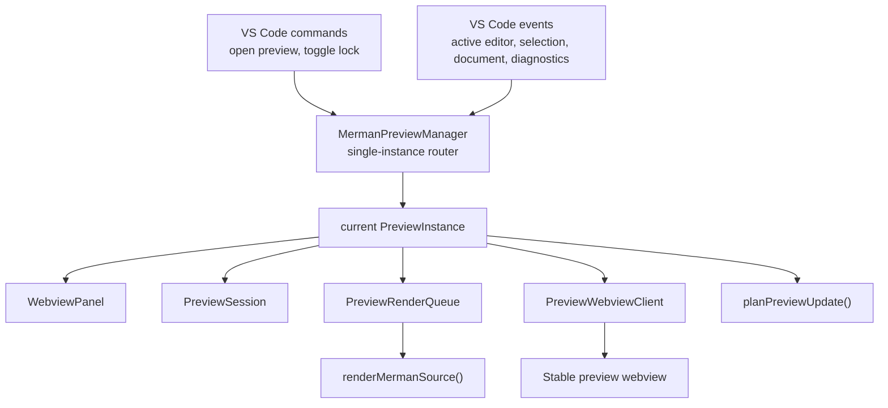

# VS Code PreviewInstance Extraction - Plan

## Goal Capsule

Extract the Merman VS Code preview's per-panel ownership into a `PreviewInstance` while preserving the current single-preview product behavior.

The end state is one preview manager and one current preview instance. The manager owns VS Code command registration and global editor/workspace event routing. The instance owns the webview panel, preview session, render debounce timer, render queue, webview client, webview message handling, panel-origin export, and disposal cleanup.

Authority comes from:

- the current `tools/vscode-extension` implementation;
- `docs/knowledge/engineering/current-state.md`, which identifies this as the next action before true multi-preview support;
- `docs/knowledge/engineering/progress/2026-07-01-vscode-preview-ux-follow-up.md`, which records the behavior that must not regress;
- prior VS Code Markdown Preview parity research showing a manager plus per-preview instance/store model as the right long-term shape.

Execution profile: TypeScript-only VS Code extension refactor, characterization-first, no user-visible feature changes.

Stop if the work requires enabling multiple preview panels, changing renderer semantics, changing Mermaid source extraction, redesigning the preview UI, modifying unrelated Rust crates, or reverting unrelated local work.

---

## Product Contract

### Summary

The preview currently behaves as a single inspection surface. This plan keeps that behavior and changes only the ownership model so later work can safely add active-instance routing, multiple locked previews, show-source parity, and refresh command parity.

### Problem Frame

`MermanPreviewController` currently mixes two responsibilities:

- Manager responsibilities: register `merman.openPreview` and `merman.togglePreviewLock`, listen to active editor, selection, document, and diagnostics events, decide whether the single preview should refresh, and dispose shared resources.
- Instance responsibilities: create and reveal the `WebviewPanel`, own `PreviewSession`, own `PreviewRenderQueue`, own `PreviewWebviewClient`, debounce renders, apply preview update actions, handle webview messages, copy/export panel output, and reset panel state on dispose.

That combined class is workable for one preview, but it is the wrong boundary for future parity. It makes lock, source selection, export, and stale render handling look global even though they are per-preview concepts.

### Requirements

#### Behavior Preservation

- R1. Keep exactly one preview panel in this change. Calling `merman.openPreview` must continue to create or reveal the existing panel.
- R2. Preserve explicit source-target behavior: command arguments with `uri` and optional `sourceId` still retarget one snapshot even when `preserveFocus: true` leaves another editor active.
- R3. Preserve lock/follow behavior, including the empty-preview lock guard and the existing warning when the user attempts to lock without a snapshot.
- R4. Preserve source selection, theme, display mode, background, diagnostics, stale render, same-source failure, different-source failure, and output-action disablement behavior.
- R5. Preserve panel-origin Copy SVG and Export SVG/PNG semantics. Preview-panel export remains bound to the instance's current session snapshot; source CodeLens and source action export remain outside this refactor.
- R6. Preserve stable webview lifecycle behavior from the previous preview lifecycle refactor. The webview shell is still initialized once and updated through typed messages.

#### Architecture Boundary

- R7. Introduce `PreviewInstance` as the owner of panel-local state: `panel`, `PreviewSession`, `PreviewRenderQueue`, `PreviewWebviewClient`, render timer, webview message handlers, render/apply-action flow, and panel disposal reset.
- R8. Keep the current controller surface as a manager/router. It owns command registration, global VS Code event subscriptions, the shared output channel, and the current single instance reference.
- R9. Keep pure modules stable unless a small interface adjustment is needed: `preview-model.ts`, `preview-messages.ts`, `preview-policy.ts`, `preview-render.ts`, `preview-session.ts`, and `preview-webview-client.ts` should remain the semantic core rather than being folded back into a controller.
- R10. Do not add new diagnostics inference. Preview diagnostics remain a display input collected from existing Merman-sourced diagnostics.
- R11. Keep instance seams narrow. Avoid introducing a full multi-preview store or broad dependency-injection framework in this change.

#### Deferred Scope

- R12. Do not enable true multi-preview behavior, dynamic/static preview stores, view-column matching, show-source command parity, refresh command parity, or command-palette scoping in this plan.
- R13. Do not change the preview UI layout or webview interaction model except for test-only harness seams required to characterize existing behavior.
- R14. Do not change renderer output, export formats, SVG safety policy, or source extraction.

### Scope Boundaries

In scope:

- `tools/vscode-extension/src/preview.ts`
- new `tools/vscode-extension/src/preview-instance.ts`
- focused preview tests under `tools/vscode-extension/src/test/`
- small type/interface adjustments in existing preview modules if they make ownership explicit without behavior changes

Deferred:

- multiple simultaneous preview panels;
- active preview selection across multiple webviews;
- VS Code Markdown Preview style dynamic/static preview stores;
- show-source and refresh command parity;
- broader source action or CodeLens export changes;
- UI redesign or visual polish.

Outside this plan:

- Rust parser, renderer, LSP, or CLI changes;
- web playground changes;
- release packaging changes beyond verification.

### Acceptance Examples

- AE1. Open a Mermaid preview from an active Mermaid editor. The panel appears beside the editor, uses the same title behavior, and renders the same content as before.
- AE2. Open a preview from a CodeLens/source action target while another editor remains active. The preview uses the requested target for the next snapshot, then follow mode behaves as it does today.
- AE3. Toggle lock before any preview snapshot exists. The same warning appears and no unusable locked empty preview state is created.
- AE4. Toggle lock after a preview snapshot exists. The preview remains bound to the current source until unlocked, including when the source editor is not the active editor.
- AE5. Select another Mermaid fence from the preview source list. The same source-select refresh path runs and the same session selection behavior is preserved.
- AE6. Trigger a same-source render failure after a successful render. The visible output is still marked stale and Copy/Export actions remain blocked until a successful render.
- AE7. Trigger a different-source render failure. The previous source's diagram is not silently presented as current output.
- AE8. Reload the webview or reveal a hidden panel. The webview ready/replay behavior still restores current UI state or rerenders when needed.
- AE9. Run source CodeLens export/copy actions. They continue to use source-action export paths, not preview-panel instance state.

---

## Planning Contract

### Current Architecture Evidence

- `preview.ts` currently constructs `MermanPreviewController` from `registerPreview()` and the class directly owns `panel`, `renderTimer`, `PreviewRenderQueue`, `PreviewSession`, and `PreviewWebviewClient`.
- The same class registers commands and global listeners for active editor, selection, document changes, and diagnostics changes.
- `open()` currently creates or reveals the single `WebviewPanel`, wires webview messages, panel disposal, panel visibility refresh, and then schedules refresh.
- `refresh()` builds a `PreviewSnapshot`, calls `planPreviewUpdate()`, remembers the snapshot, and applies actions.
- `renderSnapshot()` delegates async cancellation and stale result behavior to `PreviewRenderQueue`.
- `handleWebviewMessage()` currently routes `ready`, `copySvg`, `exportRendered`, `revealDiagnostic`, `selectSource`, `setLocked`, `setDiagramTheme`, `setDisplayMode`, and `setBackground` directly inside the controller.
- `PreviewSession` already owns instance-shaped state: current snapshot, last/preferred editor URI, selected source, diagram theme, display mode, background, and lock state.
- `PreviewRenderQueue` is intentionally instance-shaped because it owns a request id and an `AbortController`.
- `PreviewWebviewClient` is also instance-shaped because it owns HTML initialization state, ready state, pending messages, and last-rendered replay data.

### Reference Findings

- The previous preview lifecycle refactor already established stable shell, typed webview messages, pure update policy, stale-safe render queue, source-scoped viewport state, and `AbortSignal` cancellation.
- The preview UX follow-up added behavior that this refactor must preserve: lock/follow propagation, explicit target one-shot selection, empty lock guard, Merman-only diagnostics, stale same-source labeling, different-source failure clearing, and stale output-action blocking.
- VS Code Markdown Preview uses a manager model with an active preview and per-preview lock/update behavior. This is a reference for direction, not a requirement to copy full Markdown parity now.

### Key Technical Decisions

- KTD1. Extract the instance first, keep behavior single-instance. The manager may have a `currentInstance` or `activeInstance` field, but it must not create multiple panels in this change.
- KTD2. Move panel-local state and methods into `PreviewInstance`. This includes `openResource()`, `scheduleRefresh()`, `refresh()`, `applyActions()`, `renderSnapshot()`, `handleWebviewMessage()`, `selectSource()`, settings setters, `setLocked()`, and `exportRendered()`, adjusted only as needed for manager routing.
- KTD3. Keep command registration and global VS Code subscriptions in the manager. The manager routes command invocations and editor/workspace events to the current instance.
- KTD4. Treat the shared output channel as manager-owned infrastructure passed into each instance. Do not create one output channel per instance while the product still exposes one preview.
- KTD5. Preserve pure policy and model modules. If routing logic needs tests, add a small pure helper rather than testing by poking private VS Code API state.
- KTD6. Add characterization tests before or alongside movement. The extraction should first make current behavior observable, then move ownership.
- KTD7. Leave future multi-preview decisions as named seams only. For example, method names like `currentInstance` and `handleInstanceDisposed()` are useful; actual `Set<PreviewInstance>` fan-out can wait unless it is necessary for clarity.

### High-Level Technical Design



The manager decides whether an event should reach the current instance. The instance decides how its own session should refresh and what messages should be sent to its own webview.

### Proposed Module Shape

- `preview.ts`: keep `registerPreview(context)`, define the private manager class, create the output channel, register commands, register global event listeners, create or reuse the single `PreviewInstance`, and dispose manager-owned resources.
- `preview-instance.ts`: define `PreviewInstance`, with a narrow constructor that receives `context`, `outputChannel`, and an `onDispose` callback. It should hide panel/session/render/webview lifecycle details behind methods such as `open(target)`, `scheduleRefresh(reason, immediate)`, `resolvePreviewEditor(activeEditor, visibleEditors)`, `setLocked(locked, notify)`, and `dispose()`.
- `preview-session.ts`: remain the source of snapshot, follow/lock, selected source, and settings state.
- `preview-policy.ts`: remain the pure snapshot-to-actions planner.
- `preview-render.ts`: remain the per-instance render queue and stale render guard.
- `preview-webview-client.ts`: remain the per-instance webview HTML/message/replay owner.
- `media/preview.js`: unchanged unless tests reveal a missing behavior characterization around stale output actions.

### Sequencing

1. Add characterization coverage for manager/instance-sensitive behavior before moving code.
2. Introduce `PreviewInstance` and move panel-local fields plus panel-local methods with minimal signature changes.
3. Reduce `MermanPreviewController` into a manager/router while preserving command names and single-preview behavior.
4. Run verification, remove temporary scaffolding, and update engineering memory if implementation changes need future handoff context.

### Risks And Mitigations

| Risk | Mitigation |
| --- | --- |
| Command behavior accidentally becomes panel-creating or no-op when no preview exists | Preserve the current lock warning path and cover empty lock with a characterization test. |
| Explicit target opens regress because focus remains on another editor | Keep `rememberResource(..., { preferOnce: true })` and selected `sourceId` behavior inside the instance; cover a targeted open test. |
| Render cancellation becomes global | Keep one `PreviewRenderQueue` per `PreviewInstance`; never lift queue state into the manager. |
| Webview ready/replay loses state | Keep one `PreviewWebviewClient` per `PreviewInstance`; cover ready replay behavior through existing webview tests. |
| Stale output actions regress | Keep stale state and disabled action behavior in the existing message/webview contract; verify same-source failure and recovery. |
| Diagnostics responsibility expands | Keep diagnostics as input collection and filtering only; do not add new analysis logic in the preview instance. |
| Refactor hides future multi-preview needs | Name active/current instance boundaries explicitly, but do not implement multi-preview stores in this change. |

---

## Implementation Units

### Unit 1: Characterize Current Preview Behavior

Purpose: lock down the behaviors most likely to regress when panel-local state moves out of `preview.ts`.

Files:

- `tools/vscode-extension/src/test/preview.test.ts`
- `tools/vscode-extension/src/test/preview-session.test.ts`
- `tools/vscode-extension/src/test/preview-policy.test.ts`
- `tools/vscode-extension/src/test/preview-webview.test.ts`
- `tools/vscode-extension/src/test/preview-render.test.ts`

Work:

- Add or confirm tests for explicit target one-shot selection with `preserveFocus`.
- Add or confirm tests for empty lock guard and normal lock/follow snapshot propagation.
- Add or confirm tests for same-source render failure stale labeling and disabled output actions.
- Add or confirm tests for different-source failure clearing.
- Add or confirm tests for webview ready replay and rerender fallback.
- Prefer pure or harness tests where possible. Add only the smallest VS Code test seam needed to observe manager routing behavior.

Done when:

- The current behavior is covered before movement or in the same commit as movement.
- The tests describe behavior, not private implementation names that will immediately churn.

### Unit 2: Introduce `PreviewInstance`

Purpose: move per-panel ownership into a class that can later become one of many instances.

Files:

- `tools/vscode-extension/src/preview.ts`
- `tools/vscode-extension/src/preview-instance.ts`
- focused tests from Unit 1 as needed

Work:

- Create `PreviewInstance` and move panel-local fields into it: `panel`, `renderTimer`, `PreviewSession`, `PreviewRenderQueue`, and `PreviewWebviewClient`.
- Move panel-local lifecycle and behavior into the instance: panel create/reveal, webview message handling, refresh scheduling, snapshot creation, action application, render calls, lock/settings changes, source selection, export rendered, pending render clearing, and panel disposal reset.
- Pass manager-owned dependencies into the instance: extension context, output channel, and disposal callback.
- Keep `renderMermanSource()`, `assertSafePreviewSvg()`, `planPreviewUpdate()`, `PreviewSession`, `PreviewRenderQueue`, and `PreviewWebviewClient` usage semantically unchanged.
- Preserve current method behavior even if the new method names become more instance-oriented.

Done when:

- One `PreviewInstance` can create, reveal, refresh, render, receive webview messages, export, and dispose its own panel.
- Instance disposal resets its own session/webview/render timer without disposing manager command subscriptions.

### Unit 3: Reduce Controller To Single-Instance Manager

Purpose: leave `preview.ts` as command and event routing glue.

Files:

- `tools/vscode-extension/src/preview.ts`
- `tools/vscode-extension/src/preview-instance.ts`
- focused tests from Unit 1 as needed

Work:

- Rename or reshape the private controller into a manager-style class.
- Keep `registerPreview(context)` as the public extension wiring point.
- Keep command IDs unchanged: `merman.openPreview` and `merman.togglePreviewLock`.
- Route `openPreview` to create or reuse the one current instance.
- Route `togglePreviewLock` to the current instance while preserving the no-snapshot warning behavior.
- Route active editor, selection, document change, and diagnostics events to the current instance only when the existing filters would have refreshed the preview.
- On instance disposal, clear the manager's current-instance reference without disposing command/global subscriptions.
- Keep source action export/copy paths outside this manager/instance split.

Done when:

- The manager no longer owns `PreviewSession`, `PreviewRenderQueue`, `PreviewWebviewClient`, or panel-local render state.
- The manager still owns command registrations, global subscriptions, and the shared output channel.
- Running the extension still exposes one preview panel with the same behavior.

### Unit 4: Verification And Handoff

Purpose: prove this was an ownership extraction, not a behavior change.

Files:

- changed TypeScript files and tests from Units 1-3
- `docs/knowledge/engineering/current-state.md` or a new progress note, only if implementation creates useful handoff context

Work:

- Run the automated gates from `tools/vscode-extension`.
- Run `git diff --check` from the repo root.
- If an interactive VS Code extension host is available, smoke open, retarget, lock/unlock, select source, same-source failure, different-source failure, webview reload, Copy SVG, and Export SVG/PNG.
- Record any residual manual-only verification gap in the implementation summary.

Done when:

- Automated verification passes, or any inability to run a required automated command is recorded with the reason.
- Any skipped manual smoke is explicitly called out.
- The diff shows no unrelated Rust, playground, packaging, or renderer changes.

---

## Verification Contract

Required automated commands:

```bash
cd tools/vscode-extension
npm run check
npm test
```

```bash
git diff --check
```

Manual smoke when a VS Code extension host is available:

- open preview from active `.mmd` or Markdown fence;
- open preview from a source action target while another editor is active;
- lock and unlock preview;
- select another Mermaid source from the preview source list;
- cause a same-source render failure and confirm stale output actions are disabled;
- cause a different-source render failure and confirm old output is not presented as current;
- reload or reveal the preview panel and confirm replay/rerender behavior;
- copy SVG and export SVG/PNG from the preview panel.

Rust verification is not required unless the implementation touches Rust crates. If Rust files are touched unexpectedly, run the targeted `cargo nextest` gate for the affected crate and explain why the TypeScript refactor crossed that boundary.

---

## Definition Of Done

- `PreviewInstance` owns panel-local preview state and behavior.
- The manager owns command registration, global event subscriptions, output channel lifetime, and a single current instance reference.
- Existing preview behavior is unchanged from the user's perspective.
- True multi-preview behavior remains deferred and unobservable.
- Panel-origin Copy/Export and source action Copy/Export remain separate paths.
- Diagnostics remain filtered to Merman-sourced diagnostics.
- Stale render and stale output-action protections remain intact.
- `npm run check`, `npm test`, and `git diff --check` pass, or any inability to run them is recorded with the reason.
