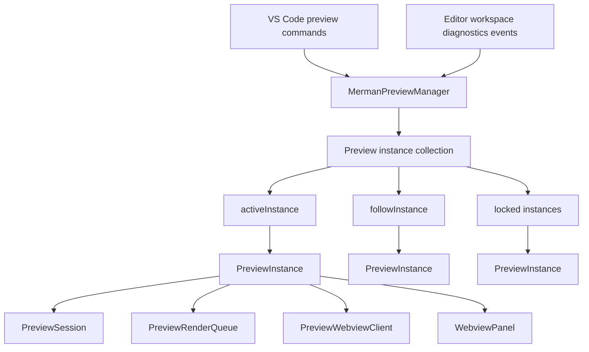

# VS Code Preview Multi-Instance Parity - Plan

## Goal Capsule

Add the next VS Code preview parity slice on top of the extracted `PreviewInstance` boundary: multiple preview panels through locked previews, active-instance command routing, manual refresh, and show-source behavior.

The end state is a preview manager that owns an instance collection, one active preview reference, and at most one unlocked follow preview. Each `PreviewInstance` continues to own its webview panel, session, render queue, webview client, panel-origin commands, and disposal cleanup.

Authority comes from:

- `docs/plans/2026-07-01-001-refactor-vscode-preview-instance-extraction-plan.md`, which created the manager plus per-instance boundary without changing product behavior;
- `docs/knowledge/engineering/progress/2026-07-01-vscode-preview-instance-extraction.md`, which records that true multi-preview behavior remained deferred after the extraction;
- `docs/knowledge/engineering/progress/2026-07-01-vscode-preview-ux-follow-up.md`, which identifies VS Code Markdown Preview's dynamic/static preview model, active preview, refresh, and show-source behavior as the next parity target;
- `repo-ref/vscode/extensions/markdown-language-features/src/preview/previewManager.ts`, `repo-ref/vscode/extensions/markdown-language-features/src/preview/preview.ts`, and related command files as source-backed reference behavior.

Execution profile: TypeScript-only VS Code extension feature work, test-first where the behavior is ambiguous, with no Rust crate changes expected.

Stop if implementation requires changing Mermaid parsing/rendering semantics, changing LSP diagnostics production, adding VS Code custom editor support, implementing Markdown scroll synchronization, or discarding unrelated local work.

---

## Product Contract

### Summary

Merman preview should support the useful Markdown Preview parity behavior without importing the whole Markdown feature set. Users can keep a preview locked to one Mermaid source, open another preview that follows the active source, refresh previews on demand, and jump from a preview back to the source it represents.

### Problem Frame

The current extension now has a clean `MermanPreviewManager` plus `PreviewInstance` boundary, but the manager still keeps only `currentInstance`. Lock is therefore panel-local in code but still product-global in behavior: once a preview is locked, the open-preview command cannot create a second follow preview for another source. The extension also lacks two common preview operations: force refresh and show source.

VS Code Markdown Preview handles this class of behavior with a manager-owned preview store, an active preview, dynamic previews that may follow editor changes, locked previews that stay bound to a resource, and commands that route through the manager. Merman should adopt the semantic shape that applies to Mermaid previews, not the full Markdown subsystem.

### Requirements

#### Multi-Preview Behavior

- R1. `merman.openPreview` must continue to create or reveal a preview from the active Mermaid source or an explicit `MermaidSourceCommandArgument`.
- R2. A locked preview must not retarget when `merman.openPreview` is run for another source.
- R3. If the active preview is locked and the user runs `merman.openPreview` for another source, the manager must create or reuse an unlocked follow preview for that source.
- R4. The manager must allow multiple locked preview panels to coexist.
- R5. The manager must keep at most one unlocked follow preview. When an unlocked preview becomes redundant, the manager should close the redundant unlocked instance using a deterministic rule covered by tests.
- R6. Global active-editor and selection changes must refresh only the unlocked follow preview.
- R7. Document and diagnostics changes must refresh every instance that tracks the changed source, including locked previews for the same document when their source editor is visible or their last snapshot identifies the document.
- R8. Disposing a preview panel must remove only that instance from the manager and must clear `activeInstance` or `followInstance` only when they point at the disposed instance.

#### Active Instance And Commands

- R9. The manager must track the active preview instance from `WebviewPanel.onDidChangeViewState` and clear it on disposal.
- R10. `merman.togglePreviewLock` must target the active preview when one is active, otherwise the current follow preview, otherwise the sole existing preview. It must keep the existing empty-preview lock warning when there is no lockable snapshot.
- R11. Unlocking a preview must promote that instance to the follow preview and resolve any redundant unlocked preview according to R5.
- R12. `merman.refreshPreview` must force a rerender even when the snapshot render key has not changed.
- R13. The command-palette refresh command must refresh all managed preview instances. A webview Refresh button must refresh only the panel that sent the message.
- R14. `merman.showPreviewSource` must reveal the active preview's source document and select the current Mermaid source range.
- R15. A webview Show Source button must reveal the source for the panel that sent the message, regardless of which preview the manager currently marks active.

#### Existing Behavior Preservation

- R16. Explicit preview targets must still prefer the requested `uri` and optional `sourceId` for one snapshot even when `preserveFocus: true` leaves another editor active.
- R17. Existing lock/follow snapshot propagation, source selection, theme, display mode, background, diagnostics, same-source stale failure labeling, different-source failure clearing, and stale output-action blocking must not regress.
- R18. Panel-origin Copy SVG and Export SVG/PNG must remain bound to the sending instance's session snapshot.
- R19. Webview ready/replay behavior must remain per instance through `PreviewWebviewClient`.
- R20. Preview diagnostics remain display inputs collected from Merman-sourced VS Code diagnostics; this work must not add new diagnostic inference.

#### Command And UI Surface

- R21. `tools/vscode-extension/package.json` must register activation events and command contributions for `merman.refreshPreview` and `merman.showPreviewSource`.
- R22. The preview toolbar must expose Refresh and Show Source controls using the existing webview script/message architecture.
- R23. New webview messages must be typed and validated in `preview-messages.ts`.
- R24. Command visibility should be scoped with reliable existing VS Code contexts where practical, but command correctness must not depend on menu visibility.

### Acceptance Examples

- AE1. Open preview from `one.mmd`, lock it, focus `two.mmd`, and run Open Preview. The original panel remains locked to `one.mmd`, and a second panel follows `two.mmd`.
- AE2. With one locked preview and one follow preview open, selecting a different Mermaid fence in the active editor updates only the follow preview.
- AE3. Editing the document shown by a locked visible preview refreshes that locked preview without retargeting it to the active editor.
- AE4. Closing the active preview panel removes it from manager state without disposing other preview panels or command subscriptions.
- AE5. Running Toggle Preview Lock from an active preview panel toggles that panel, not an arbitrary older preview.
- AE6. Unlocking a locked preview makes it the follow preview and leaves no duplicate unlocked follower.
- AE7. Running Refresh Preview from the command palette forces all previews to rerender even when source text and settings are unchanged.
- AE8. Clicking Refresh in one preview rerenders only that preview.
- AE9. Running Show Preview Source from an active preview opens the source document and selects the current Mermaid document or Markdown fence range.
- AE10. Clicking Show Source in a locked preview opens the locked source even if another editor or preview is active.
- AE11. Copy SVG and Export SVG/PNG from a preview panel use that panel's latest non-stale snapshot, not the manager's active preview.
- AE12. Webview reload still replays state or rerenders for each preview panel independently.

### Scope Boundaries

In scope:

- multiple preview panels created from the existing `WebviewPanel` path;
- locked previews plus one unlocked follow preview;
- active preview tracking and command routing;
- refresh and show-source commands;
- toolbar actions and typed webview messages;
- focused manager, policy, message, and webview tests.

Deferred:

- VS Code custom editor / serializer parity for restored previews;
- Markdown Preview scroll synchronization and topmost-line tracking;
- view-column matching beyond the current `ViewColumn.Beside` behavior;
- preview link navigation, image copy, security selector, plugin reload, or Markdown-specific features;
- automated extension-host smoke tests unless a lightweight harness already exists.

Outside this plan:

- Rust parser, renderer, LSP, CLI, or crate API changes;
- Merman playground changes;
- Mermaid semantic/layout parity work;
- release packaging changes beyond normal TypeScript verification.

---

## Planning Contract

### Current Architecture Evidence

- `tools/vscode-extension/src/preview.ts` registers `merman.openPreview` and `merman.togglePreviewLock`, owns global VS Code event subscriptions, and currently keeps one `currentInstance`.
- `tools/vscode-extension/src/preview-instance.ts` owns `WebviewPanel`, `PreviewSession`, `PreviewRenderQueue`, `PreviewWebviewClient`, render debounce, webview messages, export/copy, lock/settings changes, and disposal cleanup.
- `tools/vscode-extension/src/preview-session.ts` already stores per-preview state: current snapshot, last and preferred editor URI, selected source, diagram theme, display mode, background, and lock state.
- `tools/vscode-extension/src/preview-policy.ts` only renders when the render key changes; manual refresh needs a new force-render reason.
- `tools/vscode-extension/src/preview-messages.ts`, `tools/vscode-extension/src/preview-html.ts`, and `tools/vscode-extension/media/preview.js` form the typed webview command surface.
- `tools/vscode-extension/src/test/preview-manager.test.ts` already contains a fake VS Code harness that can be extended to observe multiple panels and command routing.

### Reference Findings

- VS Code Markdown Preview's `MarkdownPreviewManager` stores previews, tracks `activePreview`, and routes toggle-lock through that active preview.
- VS Code Markdown Preview distinguishes unlocked dynamic previews from locked previews. A locked dynamic preview only matches the same resource, while an unlocked preview matches by position and can retarget.
- VS Code Markdown Preview refresh command refreshes all previews.
- VS Code Markdown Preview show-source command opens the active preview resource. Merman should go one step more specific for Mermaid by selecting the current `PreviewInput.sourceRange`.

### Key Technical Decisions

- KTD1. Model Merman parity as one follow preview plus many locked previews. This gives the user-facing value of multiple previews without introducing full Markdown view-column matching.
- KTD2. Keep instance behavior panel-local. `PreviewInstance` should expose narrow capabilities such as `open()`, `scheduleRefresh()`, `forceRefresh()`, `showSource()`, `tracksDocument()`, `setLocked()`, `isLocked`, and disposal/view-state hooks.
- KTD3. Put collection policy in the manager, not the instance. The manager owns `instances`, `activeInstance`, `followInstance`, instance creation, instance removal, active tracking, and redundant follow cleanup.
- KTD4. Use source-backed active preview routing. `WebviewPanel.onDidChangeViewState` should mark an instance active when the panel is active, and panel-origin webview messages should execute on the sending instance.
- KTD5. Refresh has two scopes. Manager command refresh forces every instance; webview refresh forces only the sending instance.
- KTD6. Show-source has two target paths. Manager command show-source uses the active preview fallback chain; webview show-source uses the sending instance.
- KTD7. Preserve one-shot explicit target semantics in `PreviewSession`. Multi-preview routing must choose the instance before `open(target)` calls into the session; it must not replace session-level `preferOnce`.
- KTD8. Add a `manual-refresh` update reason to `preview-policy.ts` and make it emit `renderRequested` even when `samePreviewRenderKey(previous, next)` is true.
- KTD9. Prefer pure routing tests where possible. If manager behavior depends on VS Code panel lifecycle, extend the existing fake VS Code harness instead of adding broad test-only injection.
- KTD10. Keep command contribution changes minimal. The feature is behavior-first; menu scoping can remain conservative if VS Code context keys are not already represented in tests.

### High-Level Technical Design



Manager responsibilities:

- register preview commands;
- own the shared output channel;
- create and store instances;
- decide which instance handles open, lock, show-source, and webview-independent commands;
- route global editor, document, and diagnostic events;
- remove disposed instances and clean redundant unlocked followers.

Instance responsibilities:

- own one panel and one session;
- decide how its own snapshot refreshes;
- handle its own webview messages;
- force-refresh itself on demand;
- reveal its own source range;
- report whether it tracks a document URI;
- dispose its panel-local state.

### Proposed Manager State

`MermanPreviewManager` should move from:

```ts
private currentInstance: PreviewInstance | undefined;
```

to a small explicit store:

```ts
private readonly instances = new Set<PreviewInstance>();
private activeInstance: PreviewInstance | undefined;
private followInstance: PreviewInstance | undefined;
```

The manager should use a targeting helper with this fallback order:

- active preview, when the command semantically targets a preview;
- follow preview, when a preview command can reasonably apply to the current follow surface;
- sole remaining instance, when only one preview exists;
- warning or no-op, when no instance can satisfy the command.

### Proposed Instance API

The instance should expose only what the manager needs:

- `isLocked: boolean`
- `hasSnapshot: boolean`
- `open(target?: MermaidSourceCommandArgument): Promise<void>`
- `scheduleRefresh(reason: PreviewUpdateReason, immediate?: boolean): void`
- `forceRefresh(): void`
- `setLocked(locked: boolean, notify: boolean): boolean`
- `resolvePreviewEditor(): vscode.TextEditor | undefined`
- `tracksDocument(uri: vscode.Uri): boolean`
- `showSource(): Promise<boolean>`
- `dispose(): void`

`setLocked()` should return whether the lock state changed so the manager can promote or demote `followInstance` without peeking into session internals.

### Routing Rules

- Open Preview: choose the active unlocked preview if present, otherwise the existing follow preview, otherwise create a new follow preview. Never retarget a locked preview.
- Toggle Lock: target active preview, then follow preview, then sole instance. If the target locks, remove it as `followInstance`. If the target unlocks, promote it to `followInstance` and close redundant unlocked followers.
- Active editor and selection events: schedule refresh on `followInstance` only.
- Document changes: schedule refresh on every instance whose `tracksDocument(changedUri)` is true.
- Diagnostics changes: schedule refresh on every instance whose tracked document URI appears in the changed URI list.
- Refresh command: call `forceRefresh()` on every instance.
- Refresh webview message: call `forceRefresh()` on the sending instance.
- Show Source command: call `showSource()` on the preview target selected by the active/follow/sole fallback.
- Show Source webview message: call `showSource()` on the sending instance.

### Risks And Mitigations

| Risk | Mitigation |
| --- | --- |
| Locked previews retarget accidentally through the existing `open()` path | Manager never calls `open(target)` on locked instances for a different source; tests cover locked plus new source. |
| Multiple unlocked previews all follow active editor changes | Manager keeps one `followInstance` and cleans redundant unlocked instances after unlock or creation. |
| Commands target the wrong panel | Track active panel view state and add manager harness tests with two panels. |
| Manual refresh does not rerender unchanged sources | Add `manual-refresh` policy coverage that forces `renderRequested`. |
| Show-source opens the document but not the Mermaid fence | Use `PreviewSnapshot.input.sourceRange` for selection and add tests for Markdown fence ranges. |
| Panel-origin export/copy crosses instance state | Keep export/copy in `PreviewInstance` and test two panels with distinct snapshots where feasible. |
| Webview toolbar buttons regress stale output protections | Add only new buttons/messages; do not bypass existing disabled-output action logic. |
| The plan grows into full Markdown Preview parity | Keep custom editors, serializers, scroll sync, and view-column matching deferred. |

---

## Implementation Units

### U1. Characterize Multi-Preview Routing

- **Goal:** Define manager behavior before changing the store shape.
- **Requirements:** R1, R2, R3, R4, R5, R6, R8, R10, R11, AE1, AE2, AE4, AE5, AE6.
- **Files:** `tools/vscode-extension/src/test/preview-manager.test.ts`, optional new `tools/vscode-extension/src/preview-manager-routing.ts`, `tools/vscode-extension/src/test/preview-manager-routing.test.ts`.
- **Approach:** Extend the fake VS Code harness so it can create multiple fake panels, record panel active/view-state events, dispatch command handlers, and observe disposal. Add tests for locked preview plus second open, follow-only active-editor refresh, active-instance toggle-lock, and cleanup after panel disposal.
- **Verification:** `npm test -- --test-reporter=spec` from `tools/vscode-extension`.

### U2. Replace `currentInstance` With Manager Store

- **Goal:** Implement the collection state and routing rules while preserving existing single-preview behavior for users who never lock a panel.
- **Requirements:** R1, R2, R3, R4, R5, R6, R7, R8, R9, R10, R11.
- **Files:** `tools/vscode-extension/src/preview.ts`, `tools/vscode-extension/src/preview-instance.ts`, `tools/vscode-extension/src/preview-manager-routing.ts`.
- **Approach:** Add `instances`, `activeInstance`, and `followInstance`; create instances through one helper; wire instance disposal and view-state callbacks; route active editor/selection/document/diagnostic events according to the routing rules; make redundant unlocked preview cleanup deterministic and tested.
- **Verification:** Manager tests plus `npm run check` from `tools/vscode-extension`.

### U3. Add Instance Capabilities For Refresh, Source Reveal, And Tracking

- **Goal:** Give the manager the narrow APIs it needs without exposing session internals.
- **Requirements:** R7, R12, R14, R15, R18, R19, AE3, AE7, AE8, AE9, AE10, AE11, AE12.
- **Files:** `tools/vscode-extension/src/preview-instance.ts`, `tools/vscode-extension/src/preview-session.ts`, `tools/vscode-extension/src/test/preview-session.test.ts`, `tools/vscode-extension/src/test/preview-manager.test.ts`.
- **Approach:** Add `hasSnapshot`, `forceRefresh()`, `tracksDocument(uri)`, and `showSource()`. Source reveal should open `snapshot.documentUri` and select `snapshot.input.sourceRange`. Tracking should use the resolved preview editor when available and fall back to the current snapshot document URI.
- **Verification:** Focused tests for Markdown fence source reveal, `.mmd` source reveal, locked visible document refresh, and panel-origin behavior where the existing harness can observe it.

### U4. Add Manual Refresh Policy

- **Goal:** Make refresh semantically force a render rather than merely reapplying unchanged UI state.
- **Requirements:** R12, R13, AE7, AE8.
- **Files:** `tools/vscode-extension/src/preview-policy.ts`, `tools/vscode-extension/src/test/preview-policy.test.ts`, `tools/vscode-extension/src/preview-instance.ts`.
- **Approach:** Add `manual-refresh` to `PreviewUpdateReason`. Update `planPreviewUpdate()` so `manual-refresh` emits `renderRequested` for an existing snapshot even when the render key is unchanged, while still emitting normal source/settings/diagnostics UI updates when they changed.
- **Verification:** Policy tests proving unchanged-source manual refresh renders, plus existing policy tests unchanged.

### U5. Add Command And Webview Surfaces

- **Goal:** Expose refresh and show-source through VS Code commands and preview toolbar buttons.
- **Requirements:** R13, R14, R15, R21, R22, R23, R24, AE7, AE8, AE9, AE10.
- **Files:** `tools/vscode-extension/package.json`, `tools/vscode-extension/src/preview.ts`, `tools/vscode-extension/src/preview-messages.ts`, `tools/vscode-extension/src/preview-html.ts`, `tools/vscode-extension/media/preview.js`, `tools/vscode-extension/media/preview.css`, `tools/vscode-extension/src/test/preview-messages.test.ts`, `tools/vscode-extension/src/test/preview-webview.test.ts`.
- **Approach:** Register `merman.refreshPreview` and `merman.showPreviewSource`. Add webview messages `refresh` and `showSource`. Add toolbar buttons using the existing action dispatcher. Keep styling within the existing toolbar groups and avoid a toolbar redesign.
- **Verification:** Message validation tests and webview tests that clicking the new controls posts the expected messages.

### U6. Regression Verification And Documentation Memory

- **Goal:** Close the feature with repo verification and durable handoff context.
- **Requirements:** R16, R17, R18, R19, R20, all acceptance examples.
- **Files:** `docs/knowledge/engineering/current-state.md`, `docs/knowledge/engineering/progress/2026-07-01-vscode-preview-multi-instance-parity.md`, optional `docs/knowledge/engineering/index.md`.
- **Approach:** Run the full VS Code extension checks, review `git diff --check`, update engineering memory with shipped behavior, residual manual smoke items, and any deliberate parity deferrals.
- **Verification:** See Verification Contract.

---

## Verification Contract

| Gate | Command or Check | Applies To | Done Signal |
| --- | --- | --- | --- |
| TypeScript typecheck | `npm run check` from `tools/vscode-extension` | U2-U6 | No TypeScript errors. |
| VS Code extension tests | `npm test -- --test-reporter=spec` from `tools/vscode-extension` | U1-U6 | All extension tests pass. |
| Diff hygiene | `git diff --check` from repo root | U1-U6 | No whitespace errors. |
| Manual extension-host smoke | Open the extension in VS Code Extension Development Host and exercise AE1-AE12 | U6 | Multiple locked/follow previews, refresh, show-source, copy/export, close/reopen, and webview reload behave as specified. |
| Rust safety check | No command required unless Rust files are touched | All units | If Rust files are touched unexpectedly, run `cargo fmt` and targeted `cargo nextest run` for affected crates. |

---

## Definition of Done

- DOD1. `MermanPreviewManager` owns an instance collection, active preview, and follow preview instead of a single `currentInstance`.
- DOD2. Locked previews stay locked when another source opens, and users can create another follow preview without closing the locked panel.
- DOD3. Only one unlocked follow preview remains after open/unlock flows.
- DOD4. Active-editor and selection events update the follow preview, while document and diagnostics events reach all affected instances.
- DOD5. Toggle lock, refresh, and show-source commands target the intended preview scope.
- DOD6. Webview Refresh and Show Source buttons route to the sending instance.
- DOD7. Manual refresh forces rerender for unchanged sources.
- DOD8. Show-source reveals the correct document and selects the current Mermaid source range.
- DOD9. Existing preview UX protections remain intact: explicit target one-shot behavior, stale render labeling, stale output action blocking, different-source failure clearing, and per-instance export/copy.
- DOD10. Tests cover manager routing, refresh policy, webview message validation, and toolbar message dispatch.
- DOD11. `npm run check`, `npm test -- --test-reporter=spec`, and `git diff --check` pass.
- DOD12. Abandoned experimental code, debug logs, and temporary harness shortcuts are removed before completion.
- DOD13. Engineering memory records the shipped behavior and any remaining manual smoke or parity deferrals.

---

## Appendix

### Source Breadcrumbs

- `tools/vscode-extension/src/preview.ts`: current manager entry point and global event routing.
- `tools/vscode-extension/src/preview-instance.ts`: panel-local state and behavior extracted in the previous plan.
- `tools/vscode-extension/src/preview-session.ts`: per-preview source, lock, settings, and snapshot state.
- `tools/vscode-extension/src/preview-policy.ts`: snapshot action planner that needs forced refresh semantics.
- `tools/vscode-extension/src/preview-messages.ts`: typed webview command validation.
- `tools/vscode-extension/src/preview-html.ts` and `tools/vscode-extension/media/preview.js`: preview toolbar and webview action dispatcher.
- `tools/vscode-extension/src/test/preview-manager.test.ts`: fake VS Code manager harness to extend for multi-panel routing.
- `repo-ref/vscode/extensions/markdown-language-features/src/preview/previewManager.ts`: upstream active preview, dynamic/static stores, refresh-all behavior, and lock routing reference.
- `repo-ref/vscode/extensions/markdown-language-features/src/preview/preview.ts`: upstream dynamic preview lock, refresh, update, and matching behavior reference.
- `repo-ref/vscode/extensions/markdown-language-features/src/commands/showSource.ts`: upstream show-source command shape.
- `repo-ref/vscode/extensions/markdown-language-features/src/commands/refreshPreview.ts`: upstream refresh command shape.
