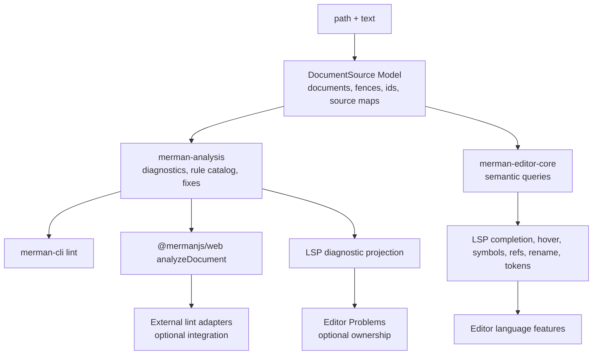
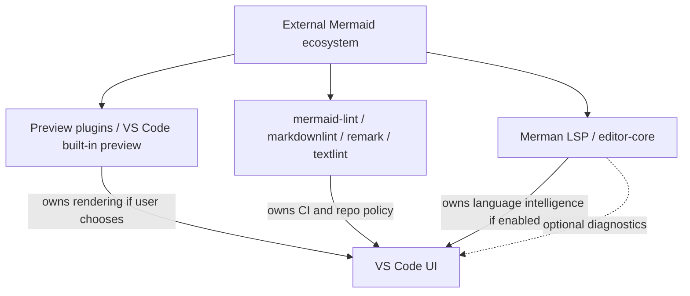

# Analysis LSP Ecosystem Seams - Plan

## Goal Capsule

- **Objective:** Deepen Merman's analysis, document-source, editor-core, and LSP seams so LSP remains valuable as a language-intelligence capability while coexisting cleanly with external Mermaid lint and preview tools.
- **Authority:** Maintainer direction: plan the fearless refactor scope, do not assume other lint or preview plugins will use Merman analysis, and treat the VS Code LSP extension as optional capability validation rather than a required product launch.
- **Execution profile:** Deep cross-crate refactor touching Rust analysis/editor/LSP crates, WASM/web TypeScript surfaces, VS Code extension integration boundaries, and docs.
- **Stop conditions:** Stop if implementation turns into a VS Code marketplace launch plan, a wholesale external linter rewrite, a Mermaid.js runtime fallback inside Merman, or a style-rule grab bag.
- **Tail ownership:** The implementation should leave a thinner LSP adapter, a stronger analysis/document contract, and explicit coexistence guidance for users who already run Mermaid preview or lint tools.

---

## 2026-07-02 Status Note

This plan remains useful ecosystem context, but its core Rust seam work has been narrowed and
implemented through `docs/plans/2026-07-02-001-refactor-analysis-editor-snapshot-seams-plan.md`.
Do not revive this full ecosystem plan as the next refactor by default.

- Completed or already present as boundary evidence: shared document/fence analysis behavior,
  web document analysis and rule metadata surfaces, VS Code coexistence settings, protocol-neutral
  editor-core language queries, thin LSP projection, analyzer/snapshot configuration alignment,
  centralized LSP range/position projection, and explicit internal rich-facts projection failure
  diagnostics.
- Deferred product work: polished external integration guides, broader adapter examples, and any
  public VS Code marketplace posture.
- Out of scope unless a new product plan says otherwise: replacing `mermaid-lint`, porting broad
  external style policies into Merman, adding a Mermaid.js runtime fallback inside Merman, or making
  the LSP/VS Code extension mandatory for lint users.

The current boundary is: external lint and preview tools may integrate with Merman, coexist beside
it, or ignore it; Merman's core value is parser-backed language intelligence and shared analysis
contracts, not forcing ecosystem convergence.

---

## Product Contract

### Summary

Merman should not compete as "another Mermaid preview plugin" or assume the ecosystem will standardize on its analysis engine.
The plan positions Merman as a parser-backed Mermaid language-intelligence engine with thin projections: lint consumers may integrate or ignore the analysis payload, preview plugins may coexist, and `merman-lsp` proves editor semantics without becoming a mandatory VS Code product surface.

### Problem Frame

Two reference lint projects show the real ecosystem shape.
`repo-ref/lint` already uses `@mermanjs/web` as a fast validation path but keeps Mermaid.js as an authoritative fallback and owns broad lint adapters, file discovery, CI integration, and many opinionated semantic rules.
`repo-ref/mermaid-lint` takes a separate Langium parser route and does not appear to use Merman.
Meanwhile VS Code 1.121 merged Mermaid rendering into built-in Markdown preview and notebooks, which makes preview alone a commodity surface.

Merman's current architecture has the right direction but still needs sharper seams.
`merman-analysis` owns canonical diagnostics, `merman-editor-core` owns protocol-neutral editor intelligence, and `merman-lsp` projects to LSP.
The weak spots are the shared document/fence source model, TypeScript analysis payload completeness, ecosystem coexistence contract, and the long-term split between parser facts and LSP projection.
If these stay fuzzy, LSP work will either duplicate lint behavior or overreach into preview/plugin product territory.

### Requirements

**Core Contract**

- R1. `merman-analysis` must remain the canonical diagnostics and rule metadata boundary for Merman-owned consumers.
- R2. Merman must not require external lint or preview plugins to adopt `AnalysisPayload` to coexist with the VS Code extension or CLI.
- R3. Document and fence mapping must be reusable across analysis, editor-core, LSP, CLI, WASM, and future adapter examples.
- R4. Public contracts must distinguish Mermaid syntax/compatibility diagnostics from Merman authoring recommendations.
- R5. Stable source ids, spans, related locations, and fix remapping must work for standalone `.mmd`, Markdown, and MDX inputs.

**Ecosystem Interop**

- R6. Merman should publish enough analysis metadata for downstream linters that want integration, including full TypeScript typing for spans, related information, fixes, source descriptors, and rule catalog entries.
- R7. Merman should provide adapter guidance for projects that keep their own rule engine, Mermaid.js fallback, file discovery, or host lint pipeline.
- R8. Merman should document coexistence with VS Code built-in Mermaid Markdown preview, `mermaid-lint`-style linters, markdownlint/remark/textlint rules, and other Mermaid preview extensions.
- R9. The VS Code extension must allow users to run Merman language features without forcing Merman preview or diagnostics to replace other tools.

**LSP Positioning**

- R10. `merman-lsp` should be judged as a protocol projection and capability-validation layer, not as proof that a dedicated VS Code LSP extension must ship.
- R11. LSP should own transport, capabilities, request lifecycle, URI handling, and safe projection only.
- R12. Analysis, document/fence modeling, semantic facts, completions, hover, symbols, references, rename, semantic tokens, and quickfix metadata should live behind protocol-neutral interfaces before LSP projection.
- R13. LSP diagnostics must be optional and predictable when another linter already owns Problems output.
- R14. Capability docs must clearly state which features are mature, which are validation-only, and which require host adoption to become product surfaces.

**Cleanup And Governance**

- R15. Duplicate document snapshots, source mapping, or projection-only type conversions should be deleted or collapsed when a deeper shared Module replaces them.
- R16. Text-scan fallback should remain visible as a migration shim and must not masquerade as mature parser-backed capability.
- R17. The refactor must preserve existing Rust and TypeScript tests while adding interop-oriented tests where contract ambiguity currently lives.
- R18. The final docs should make the answer to "LSP vs lint" explicit: shared analysis where adopted, coexistence where not, and no forced dependency either way.

### Scope Boundaries

In scope:

- shared document/fence/source model design and migration;
- full web TypeScript analysis payload and rule catalog typing;
- official interop examples and docs for external lint engines and preview plugins;
- LSP adapter thinning around protocol projection and diagnostic opt-in behavior;
- editor-core ownership cleanup where it reduces LSP-specific duplication;
- VS Code extension settings or docs needed to support coexistence modes;
- tests that prove Merman can run beside external preview/lint tools without duplicated or forced ownership.

Deferred to follow-up work:

- implementing a full `@mermaid-lint/*` replacement ecosystem;
- porting all external semantic lint rules into Merman;
- publishing a marketplace LSP-first VS Code extension as the definition of success;
- adding formatter support;
- making a public plugin system for third-party Merman rules.

Outside this plan:

- production Mermaid.js fallback inside Merman analysis;
- AI repair or natural-language Mermaid correction;
- remote rendering, account sync, cloud sharing, or collaborative editor features;
- changing Mermaid syntax or rendering semantics to suit Merman diagnostics;
- forcing users to disable VS Code built-in Mermaid preview or third-party lint extensions.

### Acceptance Examples

- AE1. A project using `mermaid-lint` for CI can install the Merman VS Code extension with language features enabled and Merman preview disabled, without Merman claiming ownership of repository-wide lint.
- AE2. A downstream linter that wants richer Merman data can call web analysis and receive typed spans, related information, fixes, source descriptors, and rule metadata without scraping legacy validation fields.
- AE3. A downstream linter that keeps Mermaid.js fallback can treat Merman analysis as optional evidence or fast path without violating Merman's docs or support model.
- AE4. A Markdown document with multiple Mermaid fences produces stable source ids and remapped diagnostics/fixes in Rust analysis, web analysis, editor-core snapshots, and LSP projection.
- AE5. When another VS Code extension already renders Mermaid Markdown preview, Merman can still provide completion, hover, rename, references, semantic tokens, and optional quick fixes.
- AE6. If `merman-lsp` is never packaged as a public VS Code extension, its tests and docs still prove the protocol projection and editor intelligence contract.
- AE7. A host can suppress Merman diagnostics while keeping completion/navigation/semantic tokens, so duplicate Problems output is avoidable.
- AE8. Capability docs identify text-scan fallback as a migration state and do not present it as equal to parser-backed semantic facts.

---

## Planning Contract

### Assumptions

- This branch already contains a working LSP, editor-core, analysis payload, VS Code extension, and web binding surface; the refactor should reshape these rather than start a new subsystem.
- External projects may use Merman selectively or not at all, so interoperability must include coexistence and adapter guidance, not only shared-engine integration.
- LSP capability validation is valuable even if the VS Code extension ultimately exposes only a subset or keeps LSP behind an experimental setting.
- Web and CLI consumers need stable contracts earlier than they need every possible semantic lint rule.

### Key Technical Decisions

- KTD1. `merman-analysis` is the shared engine; lint and LSP are projections. This avoids duplicate diagnostics logic while allowing external tools to ignore the engine when they need Mermaid.js fallback or custom policy.
- KTD2. Document source modeling is a deep Module, not helper glue. Source slicing, fence ids, line/UTF-16 mapping, and fix remap should be exercised through one interface by analysis, editor-core, LSP, CLI, and WASM.
- KTD3. LSP remains protocol-thin. Protocol state and LSP type conversion stay in `merman-lsp`; semantic decisions move to `merman-editor-core` and `merman-analysis`.
- KTD4. Coexistence is a first-class mode. Merman diagnostics, preview, and source actions should be individually disableable or clearly scoped so other lint/preview tools can own those surfaces.
- KTD5. External lint rules are not automatically core rules. Merman adopts source-backed syntax/compatibility/resource diagnostics and explicitly labeled Merman authoring hints; broader style policy belongs in lint ecosystems unless later evidence justifies migration.
- KTD6. Web analysis is the ecosystem bridge. `@mermanjs/web` should expose typed analysis/document APIs that downstream JS tools can consume without adopting LSP or native binaries.

### High-Level Technical Design

### System-Wide Impact

- `crates/merman-analysis/src/markdown.rs`, `crates/merman-analysis/src/document.rs`, and `crates/merman-analysis/src/payload.rs` are the current source and payload anchors.
- `crates/merman-editor-core/src/workspace.rs` and `crates/merman-editor-core/src/snapshot.rs` currently rebuild document/fence snapshots and should consume the deeper document model.
- `crates/merman-lsp/src/document_store.rs`, `crates/merman-lsp/src/snapshot.rs`, and `crates/merman-lsp/src/server.rs` currently adapt editor-core state into LSP-specific state and should shrink toward transport concerns.
- `platforms/web/src/index.ts` currently exposes `analyze`, `validate`, editor helpers, and `lintRuleCatalog`, but its TypeScript analysis payload shape is incomplete for downstream lint integration.
- `tools/vscode-extension/src/server.ts`, `tools/vscode-extension/package.json`, and related extension settings define which Merman surfaces users can enable beside other VS Code Mermaid tools.
- `docs/lsp/CAPABILITIES.md`, `docs/adr/0070-diagnostics-first-analysis-contract.md`, `docs/adr/0071-editor-parser-semantic-seam.md`, and `docs/adr/0072-lint-rule-governance.md` carry the architecture claims this plan should make concrete.

### Risks And Mitigations

| Risk | Mitigation |
|---|---|
| The plan overfits to `jasonworden/mermaid-lint` and ignores independent linters. | Treat `mermaid-lint` as evidence, not the contract; document both optional integration and no-integration coexistence. |
| LSP work becomes a VS Code launch project. | Define success through protocol-neutral tests, capability docs, and adapter-thin LSP behavior; keep marketplace packaging out of scope. |
| Web analysis grows a second source model separate from Rust analysis. | Make Rust document source modeling canonical and expose it through bindings rather than recreating fence logic in TypeScript. |
| Diagnostic disablement accidentally disables fixes or hover context needed by language features. | Separate diagnostic publication from semantic queries and quickfix projection; test modes independently. |
| Text-scan fallback remains hidden after refactor. | Keep source metadata such as parser-backed vs recovered vs text-scan visible in capability docs and tests. |
| External tools expect Mermaid.js-authoritative verdicts. | Document that Merman analysis is source-backed Rust analysis, not a Mermaid.js fallback host; downstream tools may keep their own fallback. |

### Sources And Research

- `repo-ref/lint` shows a production-style lint ecosystem using `@mermanjs/web` as a fast path while preserving Mermaid.js fallback and broad host adapters.
- `repo-ref/mermaid-lint` shows an independent Langium parser path and demonstrates why Merman cannot assume ecosystem convergence.
- VS Code 1.121 release notes show Mermaid Markdown preview and notebook rendering moving into built-in VS Code functionality, making preview a weak standalone differentiator.
- `docs/lsp/CAPABILITIES.md` already frames LSP maturity around parser-backed facts, recoverable input, semantic tokens, definition/references/rename, and explicit text-scan fallback boundaries.
- ADRs 0070, 0071, and 0072 establish diagnostics-first analysis, parser semantic seams, and lint rule governance.

---

## Implementation Units

### U1. Establish The Shared Document Source Model

- **Goal:** Replace scattered document/fence extraction and source remapping with one reusable Module.
- **Requirements:** R3, R5, R15
- **Dependencies:** None
- **Files:** `crates/merman-analysis/src/document.rs`, `crates/merman-analysis/src/markdown.rs`, `crates/merman-analysis/src/source_map.rs`, `crates/merman-analysis/src/payload.rs`, `crates/merman-analysis/tests/analyzer.rs`, `crates/merman-analysis/tests/source_positions.rs`, `crates/merman-editor-core/src/workspace.rs`, `crates/merman-editor-core/src/snapshot.rs`, `crates/merman-editor-core/tests/document_workspace.rs`
- **Approach:** Introduce a document source abstraction that represents whole-diagram input and Markdown/MDX fences with stable source ids, byte ranges, body ranges, language, path, source kind, and remap helpers. Move fence marker policy into this Module, including CommonMark backtick and tilde fences; keep colon fences only if tests and docs make that extension intentional. Make analysis and editor-core consume the same model.
- **Patterns to follow:** Existing `SourceDescriptor`, `MarkdownChart`, `SourceMap`, `DocumentWorkspace`, and `FenceSnapshot`.
- **Test scenarios:** Standalone `.mmd` yields one whole-document source; Markdown with multiple backtick fences yields stable ordered ids; tilde fences are recognized or explicitly rejected according to the chosen policy; MDX uses the same remap path; malformed/unclosed fences produce deterministic structural diagnostics or source records; fix edit spans remap from diagram body to host document coordinates.
- **Verification:** Analysis and editor-core tests prove document/fence mapping once, without parallel extraction logic.

### U2. Complete The Web Analysis Contract For Linters

- **Goal:** Make `@mermanjs/web` useful for external linters that want Merman analysis without LSP.
- **Requirements:** R1, R6, R7, R18
- **Dependencies:** U1
- **Files:** `platforms/web/src/index.ts`, `platforms/web/src/surfaces/core.ts`, `platforms/web/src/surfaces/full.ts`, `platforms/web/scripts/smoke.mjs`, `crates/merman-wasm/src/lib.rs`, `crates/merman-bindings-core/src/engine.rs`, `crates/merman-bindings-core/src/common.rs`, `docs/bindings/OPTIONS_JSON.md`, `platforms/web/README.md`
- **Approach:** Add or expose document-level analysis through the web binding surface and align TypeScript types with the Rust `AnalysisPayload` shape, including spans, related information, fixes, help text, source descriptors, and rule catalog metadata. Keep `validate()` as a compatibility projection and make docs steer new lint integrations toward analysis.
- **Patterns to follow:** Existing `analyze`, `analyzeJson`, `lintRuleCatalog`, `editorDiagnostics`, and binding-core `analyze_json`.
- **Test scenarios:** `analyze()` still accepts diagram source; `analyzeDocument()` or equivalent accepts Markdown with path/options and returns document-relative spans; TypeScript types compile against diagnostics with fixes and related locations; rule catalog entries expose origin/profile/configurable/fixable metadata; legacy `validate()` remains stable for existing users; web smoke tests cover core and full surfaces.
- **Verification:** Web build/smoke tests and Rust binding tests prove parity between Rust and TypeScript analysis payloads.

### U3. Define Ecosystem Interop And Coexistence Modes

- **Goal:** Document and test how Merman behaves beside external lint and preview tools.
- **Requirements:** R2, R7, R8, R9, R13, R18
- **Dependencies:** U1, U2
- **Files:** `docs/integrations/README.md` (new), `docs/integrations/lint-interop.md` (new), `docs/integrations/vscode-coexistence.md` (new), `tools/vscode-extension/README.md`, `tools/vscode-extension/package.json`, `tools/vscode-extension/src/config.ts`, `tools/vscode-extension/src/server.ts`, `tools/vscode-extension/src/test/preview-policy.test.ts`, `tools/vscode-extension/src/test/source-actions.test.ts`
- **Approach:** Add integration docs and settings that separate language features, diagnostics, preview, source actions, and export/copy behavior. Describe three supported modes: Merman-owned language intelligence with external preview, Merman analysis consumed by external lint, and coexistence where external lint owns diagnostics while Merman keeps non-diagnostic LSP features.
- **Patterns to follow:** Existing VS Code `merman.analysis.*` settings and README sections for preview, diagnostics, and runtime analysis settings.
- **Test scenarios:** Setting diagnostics off suppresses Merman Problems publication without disabling completion/hover/semantic tokens; preview can be disabled or left unused while source language features still work; docs explain how to use Merman with VS Code built-in Mermaid preview; docs explain how external lint tools can use or ignore analysis payloads; settings schema exposes coexistence modes without hidden coupling.
- **Verification:** Extension tests prove settings separation, and docs give copyable configuration examples without requiring third-party changes.

### U4. Deepen Semantic Facts As The Editor-Core Interface

- **Goal:** Reduce text-scan fallback and make parser-backed semantic facts the stable editor-core input.
- **Requirements:** R10, R12, R14, R16
- **Dependencies:** U1
- **Files:** `crates/merman-analysis/src/editor.rs`, `crates/merman-core/src/editor.rs`, `crates/merman-editor-core/src/context.rs`, `crates/merman-editor-core/src/completion.rs`, `crates/merman-editor-core/src/structure.rs`, `crates/merman-editor-core/src/semantic_tokens.rs`, `crates/merman-editor-core/tests/completion.rs`, `crates/merman-editor-core/tests/structure.rs`, `crates/merman-editor-core/tests/semantic_tokens.rs`, `crates/merman-lsp/tests/capabilities.rs`
- **Approach:** Treat `FenceTextIndex` as the migration interface and narrow its text-scan behavior to documented fallback cases. Prefer parser facts for mature families and expose source provenance so callers can tell parser-complete, parser-recovered, and text-scan results apart. Move any language-feature policy still hidden in LSP tests into editor-core tests.
- **Patterns to follow:** ADR 0071, existing `FenceTextIndexSource`, semantic role filtering, and capability matrix tests.
- **Test scenarios:** Parser-backed facts feed completion/hover/symbols/references/rename for mature families; payload-only spans do not become completion ids; text-scan fallback does not provide body completions beyond documented source-start cases; recovered facts remain useful but visibly marked; editor-core tests cover language behavior without LSP types.
- **Verification:** Editor-core tests prove language intelligence independent of LSP transport.

### U5. Thin `merman-lsp` To Protocol Projection And Capability Validation

- **Goal:** Keep LSP valuable while preventing it from owning core analysis or lint policy.
- **Requirements:** R10, R11, R12, R13, R14, R15
- **Dependencies:** U1, U4
- **Files:** `crates/merman-lsp/src/server.rs`, `crates/merman-lsp/src/document_store.rs`, `crates/merman-lsp/src/snapshot.rs`, `crates/merman-lsp/src/diagnostics.rs`, `crates/merman-lsp/src/completion.rs`, `crates/merman-lsp/src/structure.rs`, `crates/merman-lsp/src/semantic_tokens.rs`, `crates/merman-lsp/src/code_actions.rs`, `crates/merman-lsp/tests/server_smoke.rs`, `crates/merman-lsp/tests/document_store.rs`, `crates/merman-lsp/tests/diagnostics.rs`, `crates/merman-lsp/tests/capabilities.rs`
- **Approach:** Collapse duplicated LSP snapshot types where editor-core types can carry the protocol-neutral state, leaving LSP to convert URI/range/types and handle request lifecycle. Add explicit diagnostic ownership modes so LSP can serve language features with diagnostics disabled or minimized. Keep `merman/ruleCatalog` and `merman/configSchema` as capability-discovery surfaces, not lint rule engines.
- **Patterns to follow:** Existing `analysis_payload_to_diagnostics`, `DocumentSnapshot::from_editor`, server capability tests, and code-action safety checks.
- **Test scenarios:** LSP initializes with capabilities matching docs; completion/hover/rename/references work when diagnostics are disabled; diagnostic pull/push behavior remains stable when enabled; code actions only arise from fix metadata; duplicate LSP/editor snapshot conversion is reduced or justified by tests; workspace diagnostics stay unadvertised unless a real workspace scanner exists.
- **Verification:** LSP tests prove transport behavior while editor-core tests own language semantics.

### U6. Make VS Code LSP Adoption Optional And Non-Invasive

- **Goal:** Allow the VS Code extension to validate LSP capability without forcing it into the public product contract.
- **Requirements:** R8, R9, R10, R13, R14
- **Dependencies:** U3, U5
- **Files:** `tools/vscode-extension/package.json`, `tools/vscode-extension/README.md`, `tools/vscode-extension/src/extension.ts`, `tools/vscode-extension/src/server.ts`, `tools/vscode-extension/src/source-actions.ts`, `tools/vscode-extension/src/preview.ts`, `tools/vscode-extension/src/test/extension.test.ts`, `tools/vscode-extension/src/test/source-actions.test.ts`
- **Approach:** Separate "uses local Merman LSP" from "ships a public LSP-first plugin". Keep extension activation and command behavior local and opt-in where needed. Ensure preview/source actions coexist with built-in Mermaid Markdown preview and external linters by avoiding broad language ownership claims.
- **Patterns to follow:** Current extension settings, source-scoped CodeLens actions, preview manager/instance split, and packaging metadata added for local VSIX testing.
- **Test scenarios:** Users can enable language intelligence without opening Merman preview; source actions do not retarget when another preview extension is active; diagnostics setting can be off while hover/completion continue; README describes the extension as local Merman authoring tools rather than a replacement for VS Code Mermaid Markdown preview; VSIX packaging still includes binaries and media.
- **Verification:** Extension tests and docs show a capability-validation posture rather than a forced marketplace launch.

### U7. Govern Merman Rules Against External Lint Policy

- **Goal:** Keep the rule catalog conservative while making integration choices clear.
- **Requirements:** R4, R6, R7, R18
- **Dependencies:** U2, U3
- **Files:** `crates/merman-analysis/src/rules.rs`, `crates/merman-analysis/src/options_json.rs`, `crates/merman-analysis/tests/analyzer.rs`, `crates/merman-analysis/tests/payload_schema.rs`, `docs/adr/0072-lint-rule-governance.md`, `docs/bindings/OPTIONS_JSON.md`, `docs/integrations/lint-interop.md`
- **Approach:** Audit the rule catalog against ADR 0072 and external lint examples. Add only source-backed compatibility or explicitly Merman-authoring rules in this plan. Document how external tools can layer their own style rules without expecting Merman to mirror every rule id or severity policy.
- **Patterns to follow:** Current `RuleDescriptor`, `RuleOrigin`, `AnalysisRuleProfile`, configurable rule catalog, and Options JSON lint config.
- **Test scenarios:** Rule catalog serializes origin/profile/evidence; core profile avoids authoring style hints unless source-backed or explicitly enabled; unknown external rule ids are not accepted as Merman config; docs show mapping strategy without promising rule parity with `mermaid-lint`.
- **Verification:** Rule tests and docs preserve Merman's authority boundary.

### U8. Update Architecture Docs And Delete Superseded Glue

- **Goal:** Make the new seams durable and remove confusing transitional code.
- **Requirements:** R14, R15, R16, R18
- **Dependencies:** U1, U2, U3, U4, U5, U6, U7
- **Files:** `docs/adr/0070-diagnostics-first-analysis-contract.md`, `docs/adr/0071-editor-parser-semantic-seam.md`, `docs/lsp/CAPABILITIES.md`, `crates/merman-analysis/README.md`, `crates/merman-editor-core/README.md`, `crates/merman-lsp/README.md`, `platforms/web/README.md`, `tools/vscode-extension/README.md`
- **Approach:** Update docs to state the final ownership model: analysis owns diagnostics, document source owns source/fence mapping, editor-core owns protocol-neutral language queries, LSP validates protocol projection, web bindings are the JS ecosystem bridge, and external lint/preview tools may integrate or coexist. Delete duplicate helper code only after tests prove replacement coverage.
- **Patterns to follow:** Current ADR style, capability matrix, and analysis/LSP README responsibility lists.
- **Test scenarios:** Documentation examples match tested settings and payload shapes; capability matrix distinguishes parser-backed, recovered, and text-scan behavior; README text no longer implies VS Code preview replacement; code search no longer finds superseded duplicate extraction or projection helpers without a named compatibility reason.
- **Verification:** Docs align with tests and removed code is not referenced by public guidance.

---

## Verification Contract

| Gate | Applies To | Done Signal |
|---|---|---|
| Rust formatting | U1, U4, U5, U7 | `cargo fmt --all --check` is clean. |
| Analysis and source model | U1, U2, U7 | `cargo nextest run -p merman-analysis` passes with document/fence/remap/rule payload coverage. |
| Editor-core language behavior | U1, U4 | `cargo nextest run -p merman-editor-core` passes with parser-backed semantic query coverage. |
| LSP projection | U5 | `cargo nextest run -p merman-lsp` passes with diagnostics-on/off, capability, and request lifecycle coverage. |
| Web bindings | U2 | `npm run build` and smoke tests in `platforms/web` pass for core/full surfaces and typed analysis payloads. |
| VS Code extension | U3, U6 | `npm run check` and `npm test` in `tools/vscode-extension` pass with coexistence settings and packaging assumptions intact. |
| Documentation parity | U3, U7, U8 | ADRs, LSP capability docs, binding docs, and extension README describe the implemented ownership and coexistence model. |
| Diff hygiene | All units | Superseded duplicate extraction/projection code is removed or documented as intentional compatibility. |

---

## Definition of Done

- One shared document source model feeds analysis, editor-core, LSP, CLI, and web analysis.
- Web analysis exposes document-level analysis and complete TypeScript payload metadata for lint integrations.
- External lint and preview coexistence is documented as a supported mode, not a workaround.
- `merman-lsp` is thinner: protocol and capability projection stay there, language and diagnostic policy live in analysis/editor-core.
- VS Code extension settings allow users to avoid duplicate preview or diagnostics ownership while keeping Merman language features.
- Rule governance remains conservative and does not copy broad external lint policy into core by default.
- Text-scan fallback remains visible and bounded in tests and docs.
- LSP remains useful as a capability-validation surface even if no public LSP-first VS Code extension ships.
- Rust, web, and VS Code verification gates pass.
- Architecture docs answer the "LSP vs lint" question directly: shared engine when adopted, coexistence when not, and no forced dependency either way.
