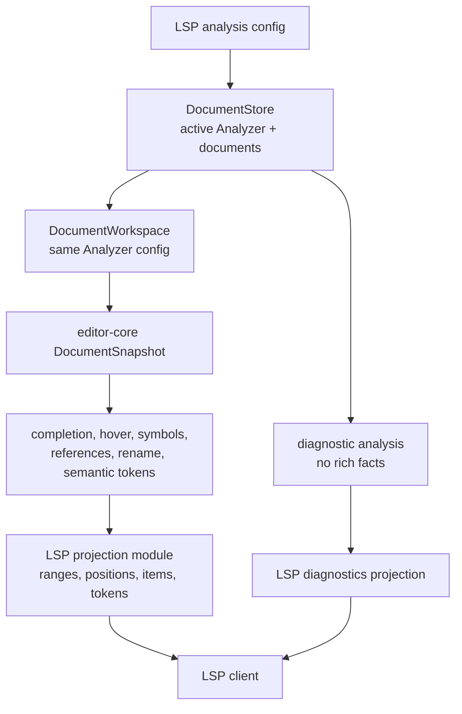
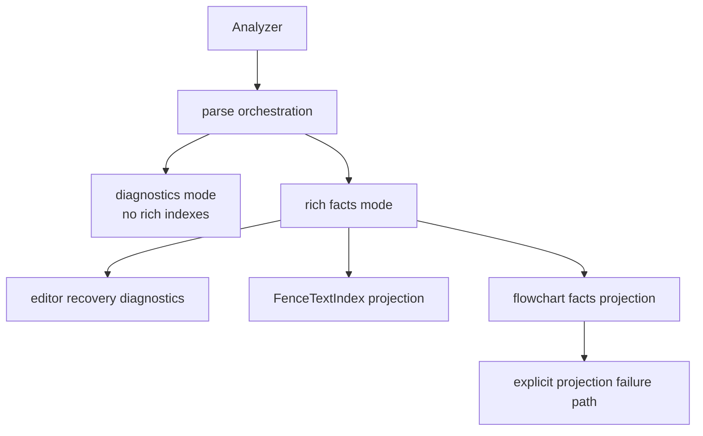

# Analysis Editor Snapshot Seams - Plan

## Goal Capsule

- **Objective:** Harden the remaining analysis, editor-core, and LSP seams after the diagnostics/rich-facts split and lazy LSP snapshot work, without reopening completed web, VS Code coexistence, or lint ecosystem scope.
- **Authority:** Maintainer direction: continue fearless refactoring only where subagent analysis shows real need; breaking changes are acceptable for unreleased internals, but unnecessary compatibility churn should not displace higher-value cleanup.
- **Execution profile:** Focused cross-crate refactor across `merman-analysis`, `merman-editor-core`, and `merman-lsp`, with docs updates that retire stale old-plan assumptions.
- **Stop conditions:** Stop if the work turns into a new VS Code marketplace release effort, a web analysis contract rewrite, external linter integration work, broad rule-governance churn, or a preview-plugin product pass.
- **Tail ownership:** The implementation should leave one coherent analyzer configuration path for diagnostics and editor snapshots, fewer LSP snapshot/projection copies, clearer analysis internals, and tests that make the remaining seams hard to regress.

---

## Product Contract

### Summary

The next refactor is worth doing, but it should be narrower than the previous ecosystem plan.
Subagent review found that the high-level boundaries are now mostly correct: `merman-analysis` owns diagnostics and facts, `merman-editor-core` owns protocol-neutral editor intelligence, and `merman-lsp` mostly projects that work into LSP types.
The remaining risk is inside those boundaries: analyzer configuration can diverge between LSP diagnostics and editor snapshots, LSP still clones editor snapshots in request paths, protocol conversions are duplicated, and rich-facts projection can silently drop flowchart facts on model drift.

This plan treats those as core quality issues.
It explicitly does not expand into web API design, VS Code preview behavior, external lint adapters, or marketplace release metadata.

### Problem Frame

Recent commits made `Analyzer::analyze()` diagnostics-first and made LSP editor snapshots lazy.
That improved cost and ownership, but it also exposed the next seam:

- `DocumentWorkspace` constructs its own `Analyzer::new()`, while `merman-lsp` separately maintains a server analyzer for diagnostics.
- LSP configuration changes update diagnostic analysis, but already cached editor snapshots can still reflect the workspace analyzer and old snapshot cache state.
- LSP stores document text, wraps editor snapshots, and also relies on editor-core workspace caching; request handlers then clone full editor snapshots through `to_editor()`.
- Range and position projection helpers live in several LSP modules, which makes future UTF-16/source-map fixes easier to apply inconsistently.
- `AnalysisFlowchartFacts::from_model` uses `serde_json::from_value(...).ok()`, so a core model shape drift can erase rich facts without an explicit failure surface.

The old `Analysis LSP Ecosystem Seams` plan has mostly served its purpose.
The web binding already exposes document-level analysis and facts types, the VS Code extension already has coexistence settings, and lint rule governance is already documented.
The next round should therefore be a focused seam hardening plan, not another ecosystem plan.

### Requirements

**Analysis And Facts**

- R1. Diagnostics-only analysis must keep its low-cost path and must not accidentally build rich text indexes.
- R2. Rich-facts projection must not silently discard flowchart facts when model deserialization fails.
- R3. Analyzer internals should separate parse orchestration, diagnostics projection, editor recovery diagnostics, and rich facts projection enough that future parser work can change one area without rethreading the whole method.
- R4. Existing public analysis entry points may be renamed or reshaped only when the change deletes confusing unreleased surface area; do not churn JSON or TypeScript contracts just for naming purity.

**Editor-Core And LSP**

- R5. LSP diagnostics and editor snapshots must use one coherent analyzer configuration lifecycle.
- R6. Configuration changes must be classified by effect: diagnostic-only changes refresh diagnostics, while snapshot-affecting changes invalidate or rebuild editor snapshots and semantic-token state.
- R7. LSP request handlers should not clone a full editor snapshot repeatedly merely to call protocol-neutral editor-core functions; any remaining per-request owned snapshot clone must be explicit and justified by the lock boundary.
- R8. LSP must keep protocol ownership local: URI handling, request lifecycle, `tower_lsp` types, semantic-token delta state, diagnostic publication, and code-action transport remain in `merman-lsp`.
- R9. Shared LSP projection helpers for positions, ranges, locations, and optional source ids should live in one LSP-local module.
- R10. LSP semantic token legend ordering should be derived from the editor-core semantic token catalog rather than duplicated by hand.

**Scope And Documentation**

- R11. The implementation must preserve the already-completed web analysis contract and VS Code coexistence work.
- R12. The implementation must not remove text-scan fallback or move external lint policy into Merman core.
- R13. Architecture docs should reflect the new narrower boundary: Merman LSP is valuable as a language-intelligence projection, while lint and preview ecosystems may integrate, coexist, or ignore it.

### Scope Boundaries

In scope:

- analyzer configuration ownership across `merman-lsp` and `merman-editor-core`;
- snapshot invalidation and request-time clone reduction;
- LSP-local protocol projection helper cleanup;
- editor-core semantic token legend export needed by LSP;
- internal analyzer helper extraction where it reduces duplication around diagnostics vs rich facts;
- explicit rich-facts deserialization failure handling;
- tests that prove configuration changes, lazy snapshot behavior, and editor-core/LSP projection behavior;
- docs updates that mark the old ecosystem plan items completed, deferred, or intentionally out of scope.

Deferred to follow-up work:

- VS Code extension packaging, release metadata, and marketplace CI;
- web binding API expansion beyond the analysis/facts contract already present;
- public adapter packages for `mermaid-lint`, markdownlint, remark, textlint, or other lint ecosystems;
- full rule module reshaping unless this refactor directly touches those files;
- formatter support.

Outside this plan:

- Mermaid.js runtime fallback in Merman analysis;
- replacing third-party Mermaid preview extensions;
- changing preview UI, export UI, or source-action UX;
- changing Mermaid syntax or rendering semantics;
- forcing external linters to use Merman analysis;
- moving LSP protocol types into `merman-editor-core`.

### Acceptance Examples

- AE1. After an LSP configuration change, diagnostics and completion/hover/symbol/semantic-token requests observe the same analyzer options or rebuild from the same analyzer configuration.
- AE2. Opening a document still does not build an editor snapshot until an editor feature requests one.
- AE3. A request path such as completion, hover, document symbols, or semantic tokens can call editor-core with a borrowed snapshot reference for each core query, even if the request still owns or shares one snapshot at the request boundary.
- AE4. Position and range conversion fixes are made in one LSP-local projection module and used consistently by diagnostics, completion, structure, semantic tokens, and code actions.
- AE5. LSP semantic-token legend tests fail if editor-core token ordering changes without LSP projection following it.
- AE6. A deliberately malformed flowchart model projection produces an explicit test-observable error path instead of being hidden by `.ok()`.
- AE7. Web analysis and VS Code coexistence settings remain behaviorally unchanged by this refactor.
- AE8. Capability docs explain why this refactor strengthens language intelligence without claiming that Merman replaces external lint or preview tools.

---

## Planning Contract

### Assumptions

- Current branch already contains diagnostics-only analysis, rich facts APIs, document-level web analysis, VS Code coexistence switches, and lazy LSP snapshot construction.
- `merman-analysis` is not yet a broadly stable public API, so internal breakage is allowed when it removes real ambiguity; however, broad JSON/TypeScript contract churn is not required for this plan.
- `merman-lsp` should remain a validation and projection layer for editor intelligence even if the VS Code extension is not publicly promoted.
- Editor-core snapshots can legitimately cache rich semantic facts, but their analyzer configuration must be explicit and invalidatable.
- External lint and preview tools are a coexistence boundary, not a dependency to model inside this refactor.

### Key Technical Decisions

- KTD1. The active LSP analyzer configuration has one lifecycle, not two drifting lifecycles. Start by making `DocumentWorkspace` accept the current analyzer or analysis options explicitly. Let `DocumentStore` own analyzer-driven diagnostic operations only if that removes duplicated lifecycle logic without widening lock scope or turning the store into a broad orchestration layer.
- KTD2. Analyzer option changes are not all snapshot-affecting. Rule profile, enablement, disablement, and severity changes are diagnostic-only unless future evidence shows they alter editor facts. Parse options, site config, fixed date/time, resource limits, and any option that can alter parser/editor facts clear or rebuild editor-core workspace state, LSP snapshot wrappers, and semantic-token result state.
- KTD3. LSP remains protocol-thin. Conversions to `tower_lsp::lsp_types` stay in `merman-lsp`; editor-core does not learn about LSP URIs, LSP `Range`, LSP semantic token encodings, or client diagnostic transport.
- KTD4. Snapshot clone removal is staged. First remove repeated per-core-call `to_editor()` clones by adding borrowed access; then remove or collapse per-request/cache-boundary clones only where borrow/lifetime tests show it is safe without holding the document-store lock across expensive request work.
- KTD5. Rich-facts deserialization failures are explicit internal analysis failures. The implementation may keep the external payload stable, but the code path and tests must no longer rely on `Option` produced by `.ok()`.
- KTD6. Completed ecosystem work should be marked complete, not re-planned. Web `analyzeDocument`/facts/types, VS Code coexistence settings, and rule governance are boundary evidence for this plan, not implementation units.

### High-Level Technical Design





### System-Wide Impact

- `crates/merman-analysis/src/analyzer.rs` currently owns parse orchestration, diagnostics mode, rich facts mode, editor recovery, panic diagnostics, and recovery deduplication.
- `crates/merman-analysis/src/result.rs` currently projects flowchart facts from core model JSON.
- `crates/merman-editor-core/src/workspace.rs` currently constructs `Analyzer::new()` internally and converts `AnalyzedDiagram` into `FenceSnapshot`.
- `crates/merman-editor-core/src/snapshot.rs` defines the protocol-neutral snapshot consumed by editor features.
- `crates/merman-lsp/src/server.rs` currently maintains analyzer configuration and diagnostic publication.
- `crates/merman-lsp/src/document_store.rs` currently owns source text, a `DocumentWorkspace`, LSP snapshot wrappers, and semantic-token state.
- `crates/merman-lsp/src/snapshot.rs`, `completion.rs`, `structure.rs`, `diagnostics.rs`, `semantic_tokens.rs`, and `code_actions.rs` currently contain duplicated projection and clone points.
- `docs/lsp/CAPABILITIES.md`, ADRs 0070-0072, and the previous ecosystem plan are the likely docs that need boundary cleanup.

### Risks And Mitigations

| Risk | Mitigation |
|---|---|
| Removing snapshot clones accidentally holds the store mutex through expensive editor requests. | Prefer a borrowed wrapper API for request-local calls first; remove duplicate caches only after tests and code shape prove the lock boundary stays acceptable. |
| Analyzer configuration consolidation breaks diagnostic refresh behavior. | Add configuration-change tests before refactoring, then assert diagnostic-only changes refresh diagnostics without needless snapshot invalidation and snapshot-affecting changes rebuild snapshot-dependent state. |
| Rich-facts projection failures start surfacing as user-facing diagnostics for diagrams that Mermaid accepts. | Keep the first implementation internal/test-observable unless a deliberate rule/severity decision is made in code and docs. |
| Centralized LSP projection grows into a generic abstraction layer. | Keep it as a small `merman-lsp` module with mechanical conversions only; semantic decisions stay in analysis/editor-core. |
| The plan reopens already completed web/VS Code ecosystem work. | Treat web and VS Code findings as boundary checks only; exclude them from units unless a regression is introduced by core changes. |
| Rules refactor scope expands because `Analyzer` imports rule config. | Touch rules only where analyzer helper extraction requires it; defer catalog/config/source-lint module splitting. |

### Sources And Research

- Subagent analysis API audit: recommended internal `Analyzer` pipeline cleanup and explicit rich-facts failure handling, but no broad public API churn.
- Subagent LSP/editor audit: identified analyzer lifecycle drift, LSP snapshot double caching/cloning, duplicated protocol projection helpers, and duplicate semantic token legends.
- Local code review confirmed `DocumentWorkspace::new()` constructs its own analyzer, while LSP server diagnostics use separately configured analysis.
- Local code review confirmed web document analysis and VS Code coexistence settings are already present, so they should not define this plan's core scope.
- Previous plan: `docs/plans/2026-07-01-003-refactor-analysis-lsp-ecosystem-seams-plan.md`.

---

## Implementation Units

### U1. Characterize Analyzer Configuration And Snapshot Invalidation

- **Goal:** Lock down the current drift risk with tests before moving ownership.
- **Requirements:** R5, R6, AE1, AE2
- **Dependencies:** None
- **Files:** `crates/merman-lsp/src/server.rs`, `crates/merman-lsp/src/document_store.rs`, `crates/merman-lsp/tests/server_smoke.rs`, `crates/merman-lsp/tests/document_store.rs`, `crates/merman-editor-core/tests/document_workspace.rs`
- **Approach:** Add focused tests that create or request an editor snapshot, apply an analysis configuration change, and assert that later diagnostics and editor features rebuild from the updated analyzer configuration. Preserve the existing lazy snapshot guarantee: opening/changing text stores source text only, and the first editor feature request creates the snapshot.
- **Patterns to follow:** Existing lazy snapshot tests in LSP server smoke coverage, existing document store tests, and current `did_change_configuration` refresh tests.
- **Test scenarios:** `didOpen` does not create a snapshot; first completion or hover creates one; diagnostic-only configuration changes refresh diagnostics without clearing snapshots; snapshot-affecting configuration changes clear cached snapshots and semantic-token result ids; next editor request rebuilds from current options; diagnostics after configuration change match the active analyzer configuration.
- **Verification:** The tests should fail or be incomplete against the current two-analyzer design, then pass after U2.

### U2. Consolidate Analyzer Ownership Across LSP Diagnostics And Editor Snapshots

- **Goal:** Make LSP diagnostics and editor snapshots share a single analyzer configuration lifecycle.
- **Requirements:** R5, R6, R8, AE1, AE2
- **Dependencies:** U1
- **Files:** `crates/merman-editor-core/src/workspace.rs`, `crates/merman-lsp/src/document_store.rs`, `crates/merman-lsp/src/server.rs`, `crates/merman-lsp/src/config.rs`, `crates/merman-lsp/tests/server_smoke.rs`, `crates/merman-lsp/tests/document_store.rs`
- **Approach:** First add an explicit `DocumentWorkspace` constructor or setter for `Analyzer` or `AnalysisOptions`, plus an invalidation API for snapshot-affecting option changes. Then pick the smallest ownership design that preserves one lifecycle. Move active analysis ownership into `DocumentStore` only if code review shows server-level analyzer sharing still leaves drift or duplicated lifecycle logic; do not move it there if that makes `DocumentStore` a broad orchestration layer or widens lock scope around diagnostics.
- **Patterns to follow:** Current `Analyzer::with_options`, `analyze_document`, `analyze_document_result`, `DocumentStore::upsert_text`, and LSP configuration normalization.
- **Test scenarios:** Rule profile, enablement, disablement, or severity changes refresh diagnostics without forcing editor snapshot or semantic-token state invalidation; parse options, site config, fixed date/time, resource limits, or any option that affects rich facts invalidate existing snapshots; semantic-token result state is cleared when snapshot-affecting configuration changes; unchanged configuration does not unnecessarily rebuild state.
- **Verification:** `cargo nextest run -p merman-lsp --test server_smoke --no-fail-fast` and `cargo nextest run -p merman-lsp --test document_store --no-fail-fast`.

### U3. Remove Request-Local Editor Snapshot Clones

- **Goal:** Keep lazy snapshots, but stop cloning the full editor snapshot every time LSP projects an editor-core query inside a request.
- **Requirements:** R7, R8, AE2, AE3
- **Dependencies:** U2
- **Files:** `crates/merman-lsp/src/snapshot.rs`, `crates/merman-lsp/src/completion.rs`, `crates/merman-lsp/src/structure.rs`, `crates/merman-lsp/src/semantic_tokens.rs`, `crates/merman-lsp/src/document_store.rs`, `crates/merman-lsp/tests/document_store.rs`
- **Approach:** Replace `DocumentSnapshot::to_editor()` with borrowed access such as `as_editor()` or rely on `Deref` in call sites. Update completion, hover, symbols, references, rename, folding, selection ranges, and semantic tokens to pass borrowed editor snapshots into editor-core. The mandatory result is no repeated per-core-call snapshot clone in request projection. After that mechanical cleanup, evaluate whether `DocumentStore.snapshots` or `snapshot_cloned` can be collapsed with shared ownership or a safe borrow guard; if not, keep at most one owned snapshot clone at the cache/request boundary and document why the lock boundary requires it.
- **Patterns to follow:** Existing `Deref` implementation in `crates/merman-lsp/src/snapshot.rs`, editor-core functions that accept `&DocumentSnapshot`, and lazy snapshot tests.
- **Test scenarios:** Completion, hover, document symbols, workspace symbols, references, rename, semantic tokens, folding ranges, and selection ranges still return the same results; request handlers do not require full snapshot clones at every core call; any remaining per-request/cache-boundary clone is documented and not hidden behind `to_editor()`; lazy construction behavior remains unchanged.
- **Verification:** `rg "to_editor\\(" crates/merman-lsp/src` returns no request-path usages after the migration, and remaining `snapshot_cloned` call sites are either removed or explicitly documented as cache/request-boundary ownership.

### U4. Centralize LSP Projection Helpers And Derive Semantic Token Legend

- **Goal:** Reduce protocol projection drift while keeping LSP-specific code inside `merman-lsp`.
- **Requirements:** R8, R9, R10, AE4, AE5
- **Dependencies:** U3
- **Files:** `crates/merman-lsp/src/protocol.rs` (new or reused), `crates/merman-lsp/src/completion.rs`, `crates/merman-lsp/src/structure.rs`, `crates/merman-lsp/src/diagnostics.rs`, `crates/merman-lsp/src/code_actions.rs`, `crates/merman-lsp/src/semantic_tokens.rs`, `crates/merman-editor-core/src/semantic_tokens.rs`
- **Approach:** Move mechanical conversions for core positions, ranges, locations, and optional source identifiers into one LSP-local projection module. Expose a stable editor-core semantic token legend list or iterator, then derive LSP `SemanticTokensLegend` from it instead of hand-maintaining a second order. Keep LSP delta encoding, result ids, and client cache state where they are.
- **Patterns to follow:** Current `range_to_lsp`, `position_to_core`, `editor_diagnostic_to_lsp`, and editor-core `token_type_index` / `token_modifier_index` helpers.
- **Test scenarios:** Range conversion remains UTF-16 compatible; diagnostic related information and quickfix edits still project correctly; semantic-token legend matches editor-core ordering; token delta tests remain unchanged.
- **Verification:** Existing LSP unit tests plus a new legend parity test.

### U5. Split Analyzer Internals And Make Rich-Facts Projection Failure Explicit

- **Goal:** Make the diagnostics/rich-facts split easier to maintain without changing the intended external behavior.
- **Requirements:** R1, R2, R3, R4, R12, AE6
- **Dependencies:** U1
- **Files:** `crates/merman-analysis/src/analyzer.rs`, optional new modules under `crates/merman-analysis/src/`, `crates/merman-analysis/src/result.rs`, `crates/merman-analysis/src/lib.rs`, `crates/merman-analysis/tests/analyzer.rs`
- **Approach:** Extract small internal helpers for parsed-diagram analysis, parse-error analysis, editor semantic facts recovery, and rich facts projection. Reuse the same editor recovery diagnostic path for diagnostics and rich facts without forcing diagnostics-only mode to build a `FenceTextIndex`. Replace `AnalysisFlowchartFacts::from_model(...).ok()` with an explicit result-bearing projection path and tests. Keep public payload behavior stable unless the code deliberately introduces an internal diagnostic with a documented rule id.
- **Patterns to follow:** Current `AnalysisMode`, `LocalAnalysis`, `EditorFactsProjection`, `merge_recovery_diagnostics`, and existing analyzer tests around parser-backed vs text-scan facts.
- **Test scenarios:** Valid diagrams in diagnostics mode do not build rich facts; parser-backed facts still appear in rich mode; recovered editor diagnostics remain deduplicated near parse errors; editor parser panic still maps to an internal diagnostic; malformed flowchart facts projection follows the explicit failure path; text-scan fallback remains visible where expected.
- **Verification:** `cargo nextest run -p merman-analysis --no-fail-fast`.

### U6. Update Architecture Docs And Retire Completed Old Scope

- **Goal:** Keep future agents from reviving completed ecosystem work as refactor scope.
- **Requirements:** R11, R12, R13, AE7, AE8
- **Dependencies:** U2, U4, U5
- **Files:** `docs/lsp/CAPABILITIES.md`, `docs/adr/0070-diagnostics-first-analysis-contract.md`, `docs/adr/0071-editor-parser-semantic-seam.md`, `docs/adr/0072-lint-rule-governance.md`, `docs/plans/2026-07-01-003-refactor-analysis-lsp-ecosystem-seams-plan.md`
- **Approach:** Update capability and ADR language only where the refactor changes real ownership. Mark the previous ecosystem plan's remaining broad items as completed, deferred, or out of scope in a short status note, rather than editing its product decisions into a new plan. Make the LSP vs lint boundary explicit: LSP projects Merman-owned language intelligence; external lint/preview tools can integrate with, coexist beside, or ignore Merman.
- **Patterns to follow:** Existing LSP capability language and ADR format.
- **Test scenarios:** Documentation names the same ownership model implemented in code; docs do not claim web/VS Code release work happened as part of this plan; docs still identify text-scan fallback as fallback.
- **Verification:** Documentation review plus `rg` checks for stale claims about mandatory LSP-first workflows or unfinished web analysis contract work.

---

## Verification Contract

Run the focused gates as implementation units land:

```bash
cargo fmt --all --check
cargo nextest run -p merman-analysis --no-fail-fast
cargo nextest run -p merman-editor-core --no-fail-fast
cargo nextest run -p merman-lsp --no-fail-fast
cargo test -p merman-lsp --test server_smoke -- --nocapture
cargo test -p merman-lsp --test document_store -- --nocapture
```

Before final handoff, run the combined Rust gate:

```bash
cargo fmt --all --check
cargo nextest run -p merman-analysis -p merman-editor-core -p merman-lsp --no-fail-fast
```

If any TypeScript or VS Code extension files are touched despite the intended scope boundary, also run the package's existing Node test/build commands from `tools/vscode-extension`.

---

## Definition Of Done

- LSP diagnostics and editor snapshots use one coherent analyzer configuration path.
- Snapshot-affecting configuration changes clear or rebuild editor snapshots and semantic-token state.
- Existing lazy snapshot behavior remains covered and passing.
- LSP request paths no longer call `to_editor()` to clone full editor snapshots for core queries, and any remaining per-request/cache-boundary snapshot clone is either removed or documented.
- Mechanical LSP position/range/legend projection is centralized inside `merman-lsp`.
- LSP semantic token legend order is derived from editor-core and protected by a parity test.
- Analyzer internals have clearer diagnostics vs rich-facts helpers without regressing diagnostics-only cost.
- Flowchart rich facts projection has an explicit failure path and tests instead of silent `.ok()` loss.
- Web analysis contract, VS Code coexistence settings, text-scan fallback, and lint governance remain intact.
- Architecture docs and the previous ecosystem plan no longer imply that broad web/VS Code/lint ecosystem work is still part of the next refactor.
- Verification Contract commands pass, or any failure is documented with a concrete blocker and owner.
